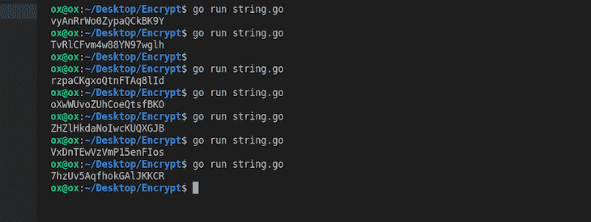

# 学习 Golang 加密和解密

> 原文：<https://blog.logrocket.com/learn-golang-encryption-decryption/>

鉴于安全性并不总是 100%有保证，所以总是需要保护您的信息，尤其是在线数据。通过使用加密，我们可以将信息转换成计算机代码，从而防止未经授权的访问。

对于开发人员来说，加密对于保护应用程序中的数据至关重要。想象一下，如果我们将用户的密码以纯文本的形式保存在数据库中，而数据库遭到破坏；这可能是灾难性的，导致错误的人获取你的信息。

通过加密，这是可以避免的。

在本教程中，我们将了解如何在 Go 中加密和解密数据，通过使数据在落入坏人之手时难以使用来保护数据的安全。

## Golang 加密教程先决条件

要学习本教程，您必须具备以下条件:

## 设置 Golang 项目

首先，让我们快速建立我们的 Go 项目。

如果您在机器上全局安装了 Golang，您可以创建一个文件夹来存放您的 Go 项目。如果您没有全局安装 Golang，请在 Go 安装所在的根文件夹中创建一个文件夹。

这完全取决于您使用的操作系统和 Go 安装方法。

要确保在您所在的文件夹中正常工作，请在终端中运行以下命令:

```
go version

```

您将在终端中看到您正在运行的 Go 版本:


接下来，创建一个文件夹并将 cd 放入其中:

```
mkdir Encrypt
cd Encrypt

```

然后，您可以通过运行以下命令来启用依赖项跟踪:

```
go mod init code/encrypt

```

这将创建一个`go.mod`文件。可以把这想象成 JavaScript 中的`package.json`或者 PHP 中的`composer.json`。这个`go.mod`文件列出了任何 Go 项目中使用的所有外部模块。

对于本教程，我们不一定需要安装外部依赖项，因为 Go 附带了许多可以生成、加密和解密数据的模块。

## 在 Golang 中生成随机数

生成随机数或字符串在编程中很重要，是加密的基础。如果不生成随机数，加密将是无用的，加密的数据是可预测的。

要在 Go 中生成随机数，让我们在项目目录中创建新的 Go 文件:

```
touch numbers.go

```

接下来，将以下代码复制并粘贴到新创建的文件中:

```
package main
import (
    "fmt"
    "math/rand"
)
func main() {
    fmt.Println(rand.Intn(100))
}

```

这里，我们导入了`[fmt](https://pkg.go.dev/fmt)` [包来格式化数据](https://pkg.go.dev/fmt)和`math/rand`包来生成随机数。虽然这两个包是内置到 Go 中的，但是要注意，如果有一个导入的包没有在你的程序中使用，Go 将不会成功运行。

附加的`main()`函数是每个可执行文件的入口点，它使用`rand.Intn()`函数打印一个从 0 到 99 的随机整数。

为此，让我们运行以下代码:

```
run go numbers.go

```

就我而言，我得了 81 分。然而现在的问题是，当我重新运行程序时，我总是得到 81。虽然这在技术上不是问题，但它确实违背了在运行代码时生成随机数的目的。


计算机做的事情没有一件是简单随机的；它遵循算法。为了解决这个问题，[我们必须使用](https://pkg.go.dev/math/rand#Seed) `[Seed()](https://pkg.go.dev/math/rand#Seed)` [方法](https://pkg.go.dev/math/rand#Seed)和`rand`。这是在引擎盖下运行的，但是它将`1`作为默认参数。

在`main()`函数的开头添加以下代码:

```
rand.Seed(time.Now().UnixNano())

```

因为我们正在使用时间，所以我们必须导入时间包`time.Now().UnixNano()`，它将当前时间精确到秒，从而改变`Seed()`参数。

所以，当我们现在运行`numbers.go`文件时，我们总是得到一个不同的随机数。

我们的代码现在应该是这样的:

```
package main
import (
    "fmt"
    "math/rand"
     "time"
)
func main() {
    rand.Seed(time.Now().UnixNano())
    fmt.Println(rand.Intn(100))
}

```

然后，我们可以再次运行代码，最终得到一个介于 0 和 99 之间的不同随机数，而不会重复:

```
run go numbers.go

```


## 在 Golang 中生成随机字符串

为了在 Go 中生成随机字符串，我们将使用 Base64 编码和一个外部包，因为这是一种更实用、更安全的生成随机数的方式。

首先，在项目的根目录下创建一个名为`strings.go`的文件。然后，在声明`package main`之后，告诉 Go 这是一个可执行文件，接着导入`encoding/base64`和`fmt`模块:

```
package main

import (
    "encoding/base64"
    "fmt"
)

func main() {

    StringToEncode := "ABCDEFGHIJKLMNOPQRSTUVWXYZ0123456789"

    Encoding := base64.StdEncoding.EncodeToString([]byte(StringToEncode))
    fmt.Println(Encoding)                                        
}

```

通过使用 Base64 编码，我们现在可以对字符串进行编码和解码。

然后，我们使用带有`StringToEncode`变量的`main()`函数，这是我们正在加密的字符串。之后，我们调用 Base64 包附带的方法，并传递创建的需要编码的变量。

* * *

### 更多来自 LogRocket 的精彩文章:

* * *

运行该程序会产生以下结果:


为了确保总是返回不同的字符串，我们可以使用一个名为`randstr`的第三方包。

`[randstr](https://github.com/thanhpk/randstr)` [比使用`Seed()`方法更快更好的解决问题](https://github.com/thanhpk/randstr)。要使用该软件包，请下载以下内容:

```
go get -u github.com/thanhpk/randstr

```

这增加了一个`go.sum`文件，这意味着我们不需要重新安装以前安装的包，因为它缓存了包并提供了下载包到`go.mod`文件的路径。

例如，要生成一个随机数，使字符串的长度始终为 20 个字符，请创建一个新文件并粘贴以下代码:

```
 package main
import(
  "github.com/thanhpk/randstr"
  "fmt"
)
func main() {
    MyString := randstr.String(20)
    fmt.Println(MyString)

}

```

每次我们运行它，代码都会产生不同的随机字符串，长度为 20 个字符。容易吗？当我们生成随机数时，这个包已经处理了很多种子，提供了更干净的代码。



## 在 Golang 中加密和解密数据

我们学习了如何生成随机数和字符串，所以我们现在可以学习如何加密和解密数据。

几乎在所有情况下，安全性都是我们需要理解这一点的主要原因。因此，我们将使用以下模块:`[crypto/aes](https://pkg.go.dev/crypto/aes)`、`[crypto/cipher](https://pkg.go.dev/crypto/cipher)`、`encoding/base64`和`fmt`、*。然而，`crypto`模块特别提供了它们的安全功能来帮助我们。*

### 加密

加密仅仅是一种隐藏数据的方法，因此如果数据落入坏人之手，它就毫无用处。为了在 Go 中加密，[我们将使用高级加密标准，这是](https://blog.logrocket.com/cryptography-in-go-today/) `[crypto/aes](https://blog.logrocket.com/cryptography-in-go-today/)` [提供的](https://blog.logrocket.com/cryptography-in-go-today/)。

首先，创建文件`encrypt.go`并将以下代码粘贴到其中:

```
package main
import (
 "crypto/aes"
 "crypto/cipher"
 "encoding/base64"
 "fmt"
)

var bytes = []byte{35, 46, 57, 24, 85, 35, 24, 74, 87, 35, 88, 98, 66, 32, 14, 05}
// This should be in an env file in production
const MySecret string = "abc&1*~#^2^#s0^=)^^7%b34"
func Encode(b []byte) string {
 return base64.StdEncoding.EncodeToString(b)
}

// Encrypt method is to encrypt or hide any classified text
func Encrypt(text, MySecret string) (string, error) {
 block, err := aes.NewCipher([]byte(MySecret))
 if err != nil {
  return "", err
 }
 plainText := []byte(text)
 cfb := cipher.NewCFBEncrypter(block, bytes)
 cipherText := make([]byte, len(plainText))
 cfb.XORKeyStream(cipherText, plainText)
 return Encode(cipherText), nil
}

func main() {
    StringToEncrypt := "Encrypting this string"

    // To encrypt the StringToEncrypt
    encText, err := Encrypt(StringToEncrypt, MySecret)
    if err != nil {
     fmt.Println("error encrypting your classified text: ", err)
    }
    fmt.Println(encText)
}

```

通过添加随机字节，我们可以在`crypto/cipher`模块方法`NewCFBEncrypter()`中使用它们作为参数。然后，在将字符串编码并返回 Base64 的`Encode`函数之前，有一个包含加密秘密的`MySecret`常量。

`Encrypt`函数有两个参数，提供要编码的文本和编码的密码。然后返回`Encode()`函数并传递用`Encrypt`范围定义的`cipherText`变量。

通过运行该文件，`main`函数用包含要加密的字符串的`StringToEncrypt`变量执行。当主函数执行时，`Encrypt()`函数也执行，现在有两个参数:`StringToEncrypt`和`MySecret`。

运行此代码会产生以下结果:


### 解密

在成功加密我们的字符串后，我们可以将它解密到原始状态。但是我们为什么要这样做呢？

其中一个常见的用例是用户的密码，在保存到数据库之前应该对其进行加密。然而，在我们可以在我们的应用程序中给用户访问之前，我们必须总是解密它。

为此，我们必须从前面的代码块`Li5E8RFcV/EPZY/neyCXQYjrfa/atA==`中获取加密的字符串，并通过向`encrypt.go`文件添加以下函数来解密它:

```
func Decode(s string) []byte {
 data, err := base64.StdEncoding.DecodeString(s)
 if err != nil {
  panic(err)
 }
 return data
} 

```

由于`Decode`函数只有一个参数，我们可以在下面的`Decrypt`函数中调用它:

```
// Decrypt method is to extract back the encrypted text
func Decrypt(text, MySecret string) (string, error) {
 block, err := aes.NewCipher([]byte(MySecret))
 if err != nil {
  return "", err
 }
 cipherText := Decode(text)
 cfb := cipher.NewCFBDecrypter(block, bytes)
 plainText := make([]byte, len(cipherText))
 cfb.XORKeyStream(plainText, cipherText)
 return string(plainText), nil
}

```

`Decrypt`函数接受两个字符串参数:`text`，这是来自加密数据的文本，以及`MySecret`，这是一个我们已经定义并赋值的变量。

在`main()`函数中，将以下代码添加到`fmt.Println(encText)`下面，该代码将打印在加密文本的下一行:

```
decText, err := Decrypt("Li5E8RFcV/EPZY/neyCXQYjrfa/atA==", MySecret)
 if err != nil {
  fmt.Println("error decrypting your encrypted text: ", err)
 }
 fmt.Println(decText)

```

最后，我们应该在`encrypt.go`中看到完整的代码:

```
package main
import (
 "crypto/aes"
 "crypto/cipher"
 "encoding/base64"
 "fmt"
)

var bytes = []byte{35, 46, 57, 24, 85, 35, 24, 74, 87, 35, 88, 98, 66, 32, 14, 05}
// This should be in an env file in production
const MySecret string = "abc&1*~#^2^#s0^=)^^7%b34"
func Encode(b []byte) string {
 return base64.StdEncoding.EncodeToString(b)
}
func Decode(s string) []byte {
 data, err := base64.StdEncoding.DecodeString(s)
 if err != nil {
  panic(err)
 }
 return data
}
// Encrypt method is to encrypt or hide any classified text
func Encrypt(text, MySecret string) (string, error) {
 block, err := aes.NewCipher([]byte(MySecret))
 if err != nil {
  return "", err
 }
 plainText := []byte(text)
 cfb := cipher.NewCFBEncrypter(block, bytes)
 cipherText := make([]byte, len(plainText))
 cfb.XORKeyStream(cipherText, plainText)
 return Encode(cipherText), nil
}
// Decrypt method is to extract back the encrypted text
func Decrypt(text, MySecret string) (string, error) {
 block, err := aes.NewCipher([]byte(MySecret))
 if err != nil {
  return "", err
 }
 cipherText := Decode(text)
 cfb := cipher.NewCFBDecrypter(block, bytes)
 plainText := make([]byte, len(cipherText))
 cfb.XORKeyStream(plainText, cipherText)
 return string(plainText), nil
}
func main() {
 StringToEncrypt := "Encrypting this string"
 // To encrypt the StringToEncrypt
 encText, err := Encrypt(StringToEncrypt, MySecret)
 if err != nil {
  fmt.Println("error encrypting your classified text: ", err)
 }
 fmt.Println(encText)
 // To decrypt the original StringToEncrypt
 decText, err := Decrypt("Li5E8RFcV/EPZY/neyCXQYjrfa/atA==", MySecret)
 if err != nil {
  fmt.Println("error decrypting your encrypted text: ", err)
 }
 fmt.Println(decText)
} 

```

运行该程序对数据进行加密和解密，并将打印以下内容:


## 结论

你已经成功地看透了这一点。我们讨论了诸如生成字符串和数字之类的随机数据，研究了如何使用高级加密标准和 Go 模块(如`crypto/aes`、`crypto/cipher`、`encoding/base64`)进行加密。

我们不仅加密数据，还解密加密的数据。

你可以在这里找到完整的源代码。

## 使用 [LogRocket](https://lp.logrocket.com/blg/signup) 消除传统错误报告的干扰

[](https://lp.logrocket.com/blg/signup)

[LogRocket](https://lp.logrocket.com/blg/signup) 是一个数字体验分析解决方案，它可以保护您免受数百个假阳性错误警报的影响，只针对几个真正重要的项目。LogRocket 会告诉您应用程序中实际影响用户的最具影响力的 bug 和 UX 问题。

然后，使用具有深层技术遥测的会话重放来确切地查看用户看到了什么以及是什么导致了问题，就像你在他们身后看一样。

LogRocket 自动聚合客户端错误、JS 异常、前端性能指标和用户交互。然后 LogRocket 使用机器学习来告诉你哪些问题正在影响大多数用户，并提供你需要修复它的上下文。

关注重要的 bug—[今天就试试 LogRocket】。](https://lp.logrocket.com/blg/signup-issue-free)