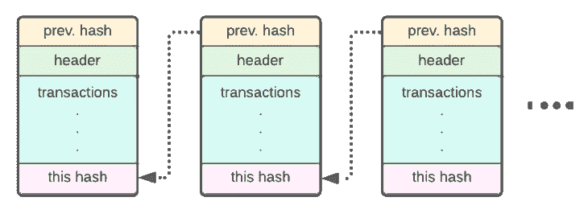
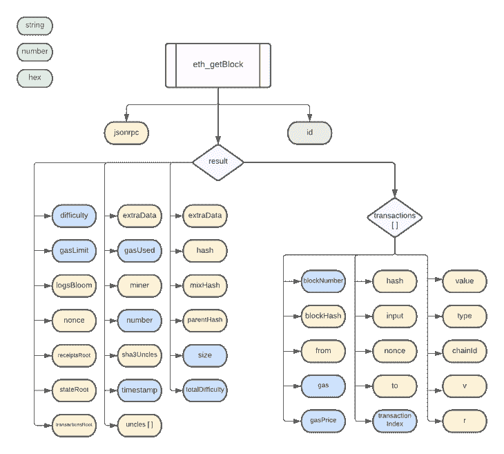

# 通过 JSON-RPC - LogRocket 博客利用以太坊区块链数据

> 原文：<https://blog.logrocket.com/leverage-ethereum-blockchain-data-json-rpc/>

区块链是一个用现代协议、网络和加密技术构建的概念，它提供了各种计算构建模块，为人类交互打开了一个全新的世界。

在本文中，我们将讨论如何使用远程过程调用(RPC)接口来访问以太坊区块链上的大量数据并与之交互。

虽然本文中的示例基于以太坊区块链，但是绝大多数区块链，如 Avalanche、Polygon、BSC 和 Harmony，都使用相同的底层状态机来跟踪它们的数据库。换句话说，本文中介绍的概念也可以应用于其他基于以太坊虚拟机(EVM)的区块链。

## 区块链数据库架构

尽管任何特定的区块链平台都有一些浮夸的说法，但从建筑的角度来看，所有的区块链基本上都是一样的。任何给定的区块链在物理上都是由相同类型的资源构成的，由一组独立操作的节点组成，这些节点通过一个商定的协议相互通信，以公开一个仅附加的数据库。

区块链数据库不是按表组织的。相反，它是由加密链接的块组成的。



为了使用这个交易数据库中的数据来构建应用程序或采取其他行动，我们需要能够查看和查询这些数据。此外，也是最重要的，我们需要一个可以写入数据库的通道。大多数区块链网络通过指定自己的 RPC 接口来实现这些基本目标。

## 区块链的 RPC

远程过程调用是指两个系统之间的接口。RPC 有多种类型:[gRPC](https://grpc.io/)(Google RPC)[JSON-RPC](https://www.jsonrpc.org/)， [XML-RPC](http://xmlrpc.com/) 等等。

RPC 接口通常通过 HTTP 实现，可用于调用各种函数。为了清楚起见，在本文中，我们将专门考虑一种类型的 RPC 和一个系统。我们将会看到如何在以太坊区块链中使用 JSON-RPC。

首先，让我们从用户的角度来看 RPC 将如何发挥作用，以及它如何参与手边的区块链(在这种情况下，以太坊)。

亲爱的读者，假设我想送给你 10 芬尼，感谢你花时间吸收一些区块链知识。

> **注意**，芬尼是以太坊的[子教派。](https://ethereum.stackexchange.com/questions/253/the-ether-denominations-are-called-finney-szabo-and-wei-what-who-are-these-na)

我可能会跳上我的电脑或 iPhone，使用[元掩码](https://metamask.io/)来发送这个总和。MetaMask 将使用我的私钥(存储在本地设备的磁盘上)来签署一个事务，并通过一个 HTTP 请求调用`eth_sendTransaction`函数，该请求包含 MetaMask 公司运行的完整节点的正确字段。

在这种情况下，完整节点是区块链网络中运行以太坊软件的几个节点之一。它连接到网络中的所有其他节点，并且能够验证数据块。因此，它可以验证我的交易 10 芬尼给你。

基于这个想法，我怎么知道我有多少钱？如果资金不足，交易就会失败，我会在汽油费上浪费钱。

MetaMask，或者任何客户端，都可以向一个有可用 RPC 接口的以太坊节点发出 HTTP 请求，以我的地址作为参数调用`eth_getBalance`函数。

该请求类似于以下内容:

```
curl --location --request POST 'some.ethereum.full.node/' \
--header 'Content-Type: application/json' \
--data-raw '{
    "jsonrpc":"2.0",
    "method":"eth_getBalance",
    "params":[
        "0x407d73d8a49eeb85d32cf465507dd71d507100c1",
    ]
}'

```

RPC 可以被认为是一个网关协议，用于参与(读取或写入)以太网:


## 以太坊节点和 RPC 功能

为了签署交易和提出请求，我们需要访问运行以太坊软件的区块链网络服务器(或节点)。有三种不同类型的节点:完整节点、归档节点和轻型节点。每种节点类型都有不同的操作要求，并提供不同的 RPC 功能:

*   轻节点只是你电脑上下载的账户状态。它可以保存和检索单个帐户的信息。它还可以在完整节点的帮助下代表该帐户执行 RPC 事务
*   一个完整的节点有足够的数据与网络上的其他节点同步，以验证数据块，并有助于保护我们称为区块链的数据库。一个完整的节点实现大多数 RPC 功能，比如获取给定块号的原始块数据、输入事务和检索帐户值
*   存档节点努力确保存储区块链的全部历史。它可能会也可能不会加入像完整节点这样的验证块。归档节点可以公开可能包含信息(或更密集的数据)的更丰富的 RPC 端点。例如，一个存档节点可以公开一个跟踪，该跟踪可以被认为是给定块中给定事务的事务调用堆栈

根据您的使用情况，您可能可以在桌子下的微型计算机上操作一个简单的灯光节点。但是，如果您想要使用区块链数据、运行您自己的索引器或创建一个应用程序，允许用户在由 RPC 区块链数据支持的 3D 可视化中浏览他们的历史余额，您将需要一个完整节点或一个存档节点。

## 用以太坊区块链实现 JSON-RPC

有许多提供者公开了 JSON-RPC 接口，例如[data hub figument](https://datahub-beta.figment.io/)、 [Infura](https://infura.io/) 和 [Moralis](https://moralis.io/ethereum-rpc-nodes-what-they-are-and-why-you-shouldnt-use-them/) 等等。然而，在您使用这些服务之前，请注意扩展可能会有相当大的代价。

您也可以选择使用 OpenEthereum 标准的实现来托管自己的归档节点。许多开源客户端都带有内置的 RPC 服务，可以读取它在您的服务器上构建的数据，使设置变得轻而易举。

Erigon 是目前最受欢迎的客户端之一，用于与以太坊区块链同步并公开数据丰富的 RPC 接口。它的流行是由于它的速度和它为以太坊特定数据提供的优化。

Erigon 有许多有趣的属性，我希望很快能更深入地介绍，但目前，我们可以认为它是存档节点的最佳以太坊特定实现之一。运行 Erigon 使您能够以硬件能够跟上的速度查询 RPC 接口。例如，您可能希望[使用这种方法来练习索引区块链数据](https://blog.logrocket.com/run-rinkeby-indexer-graph-network-for-free/),以便在图形网络上以闪电般的速度进行查询。

当然，还有其他更成熟或更流行的 OpenEthereum 标准实现可以提供 JSON-RPC 接口。一个例子是 [Geth](https://github.com/ethereum/go-ethereum) ，以太坊的 Go 实现。

运行这类节点确实需要一套强大的硬件。仅从数字上看， [Erigon 应该至少有 8gb 内存](https://github.com/ledgerwatch/erigon#:~:text=and%20will%20break.-,System%20Requirements,%2Dtmp%20to%20another%20disk)。)和一个 i7CPU 来在大约一周内同步以太坊区块链。在周末，您应该预计会使用 2TB 的磁盘。相比之下，Geth 将需要大约一个月的时间来同步，并将消耗大约 10TB 的磁盘空间。呀！

如果您的业务依赖于此类数据，您的节点发生故障的后果可能是灾难性的。在这种情况下，等待一个月来重新同步将是荒谬的。运行多个节点本身就是一项工程挑战。这种选择不仅在时间上而且在原始硬件上都是昂贵的，因为这些客户端强烈倾向于在 SSD 上运行(Erigon 要求这是正确的)。现在你明白为什么我可能想连接一个供应商，以便发送我的 10 芬尼！

无论您选择使用提供者还是运行自己的客户机和节点，目标都是一样的:连接到分散的数据库，并与之交互。

现在，让我们来看看一些以太坊的原始块数据在 RPC 调用中是什么样子的！

## 从 JSON-RPC 调用中检查以太坊块数据

让我们考虑以下对提供以太坊 JSON-RPC API 的服务器的 HTTP 请求:

```
curl --location --request POST 'some.ethereum.node' 
  \--header 'Content-Type: application/json'
  \--data-raw '{
    "jsonrpc":"2.0",
    "method":"eth_getBlockByNumber",
    "params":[
        "0x4E4ee",
    ],
}'

```

这里，我们用参数`0x4E4ee`调用`eth_getBlockByNumber`函数，参数`0x4E4ee`在十进制中是`320750`。如果我们将这个请求发送到一个 RPC 节点，我们可以预期返回数据的主体如下所示:



上图展示了原始块数据的外观。如图表图例所示，字符串用黄色表示，数字用绿色表示。蓝色显示的值在技术上是字符串，但准确地说，它们是编码为十六进制值的数字。

以太坊通过 Patricia 树(T1)将数据存储在其状态中，这是它的强项。RPC 接口希望返回真正的原始数据，仅此而已，因此保证了各种值的十六进制表达式。

通过在我们对这个 RPC 端点的`POST`请求的原始体中调用`eth_getBlockByNumber`函数，我们获得了关于那个块的信息(比如您期望在以太坊块头中看到的)，以及那个块中所有事务的列表。

例如，要查找您在 2019 年 9 月 21 日发送的交易，您可以查询块，直到`timestamp`字段等于 BigInt 形式的查询日期:`1569091562`。从那里，您将检查特定`timestamp`周围的每个区块，以检测您发送的所有交易。

如果这对您来说听起来像很多 HTTP 请求，那么您是正确的！问题就在这里——通过 RPC 接口可用的数据不是很丰富，而且建立的索引也很有限。这些数据不容易搜索，像上面这样简单的查询很快就会变成“大海捞针”。

为了解决这个问题，一些人将使用索引服务来索引他们自己的数据，这些数据是通过 RPC 节点的原始数据从 RPC 节点中抽取出来的，如上所述。另一种选择是使用软件解决方案，如[图](https://thegraph.com/docs/en/indexing/)，并支付其他索引器做繁重的工作，方法是从 RPC 接口的无限块数据的原始天书中公开一组定制的索引字段。

无论哪种方式，很明显区块链节点相互通信的最基本方式是通过 RPC。这种原始级别的接口非常适合于通过其可操作的写操作(如发送事务或挖掘数据块)保持网络平稳运行，并允许人们在抓取数据块级别的数据时从这个全局分散的数据库中读取数据，如上所示。

我们之前说过，RPC 具有有限的读取功能，因为对原始数据进行详细的索引会给手头的 RPC 节点以及网络带来极大的挑战。索引是网络用户要解决的一个不同于网络级通信的问题。

## 结论

在本文中，我们探索了 JSON-RPC 和区块链数据，包括如何访问原始数据并与之交互。如果您想接触一些真实世界的区块链 RPC 调用和数据，而不需要构建自己的基础设施，那么就去前面提到的托管 RPC 提供商那里吧。开一个免费账户，试试吧！

下面是一些有趣的以太坊 JSON-RPC 调用，可以帮助您入门。查看[官方邮递员文档](https://documenter.getpostman.com/view/4117254/ethereum-json-rpc/RVu7CT5J)获取完整列表。

## 加入像 Bitso 和 Coinsquare 这样的组织，他们使用 LogRocket 主动监控他们的 Web3 应用

影响用户在您的应用中激活和交易的能力的客户端问题会极大地影响您的底线。如果您对监控 UX 问题、自动显示 JavaScript 错误、跟踪缓慢的网络请求和组件加载时间感兴趣，

[try LogRocket](https://lp.logrocket.com/blg/web3-signup)

.

[](https://lp.logrocket.com/blg/web3-signup)[https://logrocket.com/signup/](https://lp.logrocket.com/blg/web3-signup)

LogRocket 就像是网络和移动应用的 DVR，记录你的网络应用或网站上发生的一切。您可以汇总和报告关键的前端性能指标，重放用户会话和应用程序状态，记录网络请求，并自动显示所有错误，而不是猜测问题发生的原因。

现代化您调试 web 和移动应用的方式— [开始免费监控](https://lp.logrocket.com/blg/web3-signup)。

*   `net_version`:获取当前网络 ID
*   `net_peerCount`:获取 RPC 区块链节点所连接的活动对等节点的数量
*   `eth_gasPrice`:获取天然气的当前价格，单位为 ETH
*   `eth_blockNumber`:返回最近块的编号(高度)
*   `eth_getBalance`:返回给定地址的账户余额
*   `eth_sendTransaction`:如果数据字段包含代码，则创建新的消息调用交易或合同创建
*   `eth_getBlockByNumber`:按块号返回关于块的信息