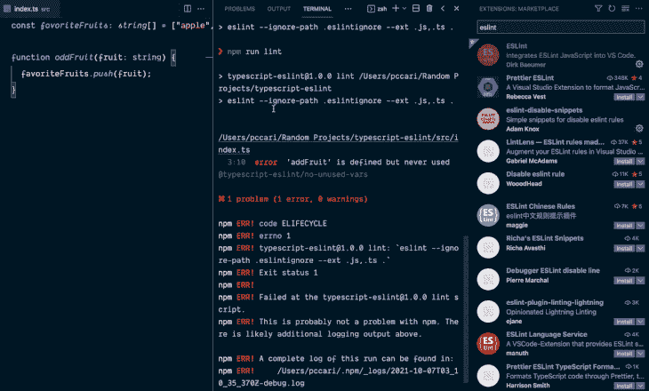
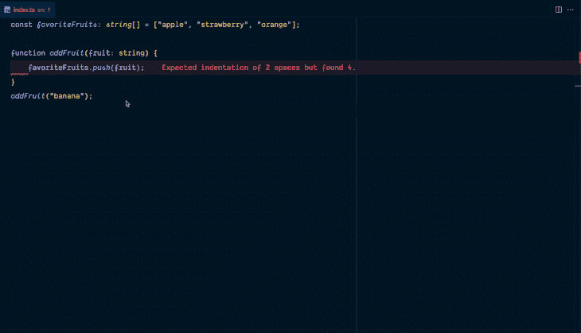
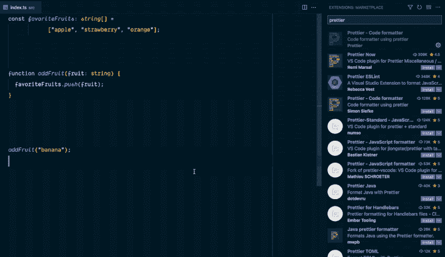

# 使用 ESLint 和 beauty-log rocket 博客的打字稿中的林挺

> 原文：<https://blog.logrocket.com/linting-typescript-eslint-prettier/>

***编者按:*** *本文最后更新于 2022 年 12 月 16 日。查看这个* [*使用 appellister 和 ESLint 来自动格式化*](https://blog.logrocket.com/using-prettier-eslint-automate-formatting-fixing-javascript/) *教程以获得更多信息。*

作为开发人员，我们通常通过为林挺添加配置和脚本来启动项目，然后为我们的代码库语法和风格进行格式化和类型检查。

当在团队中工作时，这个过程甚至更加重要，因为每个人都需要在代码库语法和风格上保持一致。此外，为了确保我们的应用程序在生产过程中没有打字错误或错误，我们应该一路对代码进行类型检查。

有了格式化工具、林挺工具和 TypeScript 可以帮助我们自动化这个过程。

在本文中，我们将使用 [ESLint](https://eslint.org) 和 [TypeScript](https://www.typescriptlang.org) ，我们还将看到如何添加更漂亮的额外工具来自动完成这个过程。

向前跳:

注意:特定版本的 Node 与最新版本的 ESLint 和 Prettier 之间存在兼容性问题，因此请确保您运行的 Node 版本> = 16.0.0，以便以后遵循代码部分。

## 编译类型脚本代码

Typescript 是 JavaScript 的超集，帮助我们在编译时进行静态类型检查。由于编辑器中的自动完成功能，TypeScript 将为您提供更好的开发体验。TypeScript 还帮助您维护大型代码库中的代码。

首先，我们需要一个编译器将 TypeScript 代码转换成 JavaScript，这样浏览器就可以读取它。让我们使用您最喜欢的包管理器安装一个依赖项。转到计算机上合适的文件夹，在终端中运行以下命令之一:

```
#npm
npm install --save-dev typescript

#yarn
yarn add typescript --dev 

```

安装完成后，您将看到一个新条目进入到您的`package.json`文件的`devDependencies`属性中，如下所示:

```
{
  "name": "Linting TypeScript with ESLint",
  "version": "1.0.0",
  "devDependencies": {
    "typescript": "^4.9.4"
  }
}

```

如果您想验证它是否已经安装，您可以运行以下命令来检查版本:

```
npx tsc --version
# Version 4.4.3

```

在您的文件夹中，在`src`目录下创建一个`index.ts`文件，并添加以下类型脚本代码:

```
// src/index.ts
const favoriteFruits: string[] = ["apple", "strawberry", "orange"];

function addFruit(fruit: string) {
  favoriteFruits.push(fruit);
}

```

我们可以通过在终端中运行以下命令将 TypeScript 代码编译成 JavaScript:

```
npx tsc src/index.ts

```

紧接着，我们将在与 TypeScript 文件相同的目录中看到一个新生成的 JavaScript 文件:

```
// src/index.js
var favoriteFruits = ["apple", "strawberry", "orange"];

function addFruit(fruit) {
    favoriteFruits.push(fruit);
}

```

默认情况下，编译器将与创建 JavaScript 文件的 TypeScript 源文件一起创建 JavaScript 文件。这不是一个好主意，因为你最终会把你的构建结果和你的源代码混合在一起。

所以，让我们改变一些默认的编译器设置，从我们想把我们编译的代码放在哪里开始，哪个 JavaScript 级别是目标编译的(默认为:ECMAScript 3)，以及我们想编译哪些文件。

有两种方法可以创建 TypeScript 编译器设置:

1.  在终端中运行以下命令:`npx ts``c` `--init`。这将生成一个默认的 TypeScript 配置文件
2.  在项目的根目录下创建一个名为`tsconfig.json`的文件，并包含您的设置

在这种情况下，我将手动创建 TypeScript 编译器设置。然而，我鼓励你选择第一个选项。它将创建带有一些推荐选项的配置文件——所有选项都有注释说明它们的作用。

您可以根据需要修改这些设置。查看支持的编译器选项的完整列表，并且您可以在 [TypeScript 游乐场](https://www.typescriptlang.org/play)中玩耍:

```
// tsconfig.json
{
  "compilerOptions": {
    "outDir": "dist", // where to put the compiled JS files
    "target": "ES2020", // which level of JS support to target
    "module": "CommonJS", // which system for the program AMD, UMD, System, CommonJS

    // Recommended: Compiler complains about expressions implicitly typed as 'any'
    "noImplicitAny": true, 
  },
  "include": ["src"], // which files to compile
  "exclude": ["node_modules"], // which files to skip
}

```

恭喜你！现在，您可以开始编写 TypeScript，并通过运行`npx tsc`将其编译成 JavaScript。

您可以在脚本中包含上述命令，使其更容易运行。转到`package.json`并添加`--watch`标志来观察文件的变化。请记住，`compilerOptions`中描述的所有内容都可以使用 CLI 标志传入命令行:

```
// package.json
{
  "name": "Linting TypeScript with ESLint",
  "version": "1.0.0",
  "devDependencies": {
    "typescript": "^4.9.4"
  },
  "scripts": {
    "dev": "tsc --watch"
  }
}

```

## 什么是 ESLint？

林挺最受欢迎的工具之一是 ESLint，它将分析您的代码，通过定义编码约定并自动执行来发现潜在的 bug 并提高代码质量。让我们看看如何将 ESLint 安装到我们的 TypeScript 项目中。

首先，将以下依赖项安装到您的`devDependencies`:

```
npm install eslint @typescript-eslint/parser @typescript-eslint/eslint-plugin --save-dev

```

*   `eslint`:eslit 核心库
*   `@typescript-eslint/parser`:允许 ESLint 理解类型脚本代码的解析器
*   `@typescript-eslint/eslint-plugin`:带有一组推荐的类型脚本规则的插件

与 Typescript 编译器设置类似，您可以使用命令行通过 ESLint 中的`--init`标志生成一个配置文件，也可以手动创建它。无论哪种方式，都必须有您的 ESLint 配置文件。

让我们使用 CLI 创建一个配置文件。在终端中运行以下命令:

```
npx eslint --init

```

接下来，您将看到一系列问题，允许您根据自己的偏好调整配置文件:

*   您希望如何使用 ESLint？
*   你的项目使用什么类型的模块？
*   你的项目使用哪个框架？
*   您的项目使用 TypeScript 吗？
*   你的代码在哪里运行？
*   您希望如何定义项目的样式？

基于所选择的选项，ESLint CLI 将在项目的根目录中创建一个带有一些默认设置的`.eslintrc.json`配置文件。如果已经有了自己喜欢的设置，可以替换配置文件中的一些选项。

您还可以浏览配置文件可用的 ESLint 设置的完整列表。

## 林挺与埃斯林

对于本文，将配置文件中的默认设置替换为:

```
// .eslintrc
{
  "parser": "@typescript-eslint/parser",
  "parserOptions": {
    "ecmaVersion": 12,
    "sourceType": "module"
  },
  "plugins": ["@typescript-eslint"],
  "extends": ["eslint:recommended", "plugin:@typescript-eslint/recommended"],
  "rules": {

  },
  "env": {
    "browser": true,
    "es2021": true
  },
}

```

*   `parser`:指定 ESLint 在分析代码时使用的解析器
*   `parserOptions`:指定想要支持的 JS 语言选项，比如想要使用的 ECMAScript 语法版本
*   这是你定义插件的地方
*   `extends`:告诉 ESLint 从什么配置开始扩展。顺序很重要，因为在任何冲突的配置中，最后一个扩展选项将覆盖前面的选项。
*   你的代码将在哪些环境中运行

当我们添加一个 ESLint 规则时，它会覆盖在`extends`列表中定义的配置。让我们添加几个规则来看看它是如何工作的:

```
// .eslintrc
{
  "parser": "@typescript-eslint/parser",
  "parserOptions": {
    "ecmaVersion": 12,
    "sourceType": "module",
  },
  "plugins": ["@typescript-eslint"],
  "extends": ["eslint:recommended", "plugin:@typescript-eslint/recommended"],

  "rules": {
    "@typescript-eslint/no-unused-vars": "error",
    // to enforce using type for object type definitions, can be type or interface 
    "@typescript-eslint/consistent-type-definitions": ["error", "type"], 
  },

  "env": {
    "browser": true,
    "es2021": true
  }
}

```

简而言之，我们应用的第一个规则被赋值为`error`，但是`error`不是我们唯一可以赋值的值——我们有三个选项:

*   `off`或`0`:完全关闭规则
*   `warn`或`1`:将该规则视为一个警告，但在运行 linter 时它不会失败
*   `error`或`2`:将规则视为错误。运行棉绒机时会失败

注意:在一些 ESLint 规则中，比如第二个规则，您需要设置额外的选项来使用数组文字语法。

您可以使用下面的命令告诉 ESLint lint 您的代码:`eslint` `--ext .js,.ts`。`ext`标志用于指定 ESLint 在目标目录中搜索文件时应该考虑哪些文件扩展名。在这种情况下，我们包括 TypeScript 文件扩展名:`.ts`(默认情况下，它是`.js`)

现在，您可以使用上面的命令将一个`lint`脚本添加到您的`package.json`中:

```
// package.json
{
  "name": "Linting TypeScript with ESLint",
  "version": "1.0.0",
  "scripts": {
    "dev": "tsc --watch",
    "lint": "eslint --ext .js,.ts .",
  },
  "devDependencies": {
    "@typescript-eslint/eslint-plugin": "^5.45.1",
    "@typescript-eslint/parser": "^5.45.1",
    "eslint": "^8.29.0",
    "typescript": "^4.9.4"
  }
}

```

您会发现有些文件根本不需要被链接，例如您的`dist`文件夹，因此您可以通过创建一个`.eslintignore`文件并添加您想要忽略的文件夹或文件来防止林挺:

```
node_modules
dist

```

这通常与您的`.gitignore`文件内容相匹配，因此为了获得单一的真实来源，您可以更新`lint`脚本以使用`--ignore-path`标志:

```
// package.json
{
  // ...
  "scripts": {
    "lint": "eslint --ignore-path .eslintignore --ext .js,.ts ."
   },
  // ...
}

```

现在你已经准备好了！我建议你将 ESLint 集成到你使用的任何编辑器中。如果那是 VSCode，转到扩展并安装 [ESLint 扩展](https://marketplace.visualstudio.com/items?itemName=dbaeumer.vscode-eslint)。

一旦您安装并启用了它，您将看到您在代码中犯了什么错误，而不用运行带有红线下划线的脚本。

注意:您将看到 ESLint 错误消息在编辑器中被内联打印出来；这是另一个名为 [Error Lens](https://marketplace.visualstudio.com/items?itemName=usernamehw.errorlens) 的扩展，它高亮显示整行并立即显示错误信息，而不是用指针悬停来查看它:



ESLint 的另一个特点是，当你悬停并右键点击`Quick fix`时，它可以自动修复代码，或者你可以点击`command`和`+`:



手动修复所有违反规则的错误可能会很繁琐，但是您可以运行以下命令，告诉 ESLint 尽可能地修复错误:

```
npm run lint -- --fix

```

*提示*:您可以使用双破折号`--`为`npm`脚本传递参数，这些参数将作为`npm`执行的脚本的参数被接收:

```
npm run <command> [-- <args>]

```

## 什么更漂亮？

Prettier 是一个众所周知的代码格式化程序，支持各种不同的编程语言。它通过根据指定的代码风格自动格式化代码，帮助我们避免手动格式化代码。

如今，将 ESLint 和 learn 一起使用是很常见的，我们将学习如何将 learn 与 ESLint 集成。首先，让我们看看两者之间的区别，以及为什么它们可以一起受益。

## 为什么我们需要更漂亮的 ESLint？

linter 的主要功能是通过分析代码，并根据可定制或预定义的规则集提醒您任何潜在的问题，从而改进您的代码。这些规则集或规则允许开发团队维护一致的编码风格，并识别由不一致的编码风格引起的潜在错误。

另一方面，像 Prettier 这样的代码格式化程序通过解析您的代码并根据其规则重新打印来确保一致的风格。例如，可以指定一种样式，所有 JavaScript 语句都必须以分号结尾；代码格式化程序会自动将分号添加到所有不带分号的语句中。

本质上，您可以使用 ESLint 来指定必须遵守的规则集，然后使用 Prettier 来修复代码中这些规则集被破坏的情况。

## 整合更漂亮

有了这些，让我们给我们的项目添加一些漂亮的东西；在终端中运行以下命令:

```
npm install --save-dev prettier

```

与 ESLint 相比，Prettier 不需要配置文件，这意味着您可以直接运行和使用它。然而，如果您想要设置一个配置，您将需要创建一个名为`.prettierrc`的文件(在项目的根目录中)，在这里您可以定义您的格式选项。

* * *

### 更多来自 LogRocket 的精彩文章:

* * *

你可以看看[格式选项的完整列表](https://prettier.io/docs/en/options.html)并且可以在[漂亮的游乐场](https://prettier.io/playground/)玩耍:

```
// .prettierrc
{
  "semi": false, // Specify if you want to print semicolons at the end of statements
  "singleQuote": true, // If you want to use single quotes
  "arrowParens": "avoid", // Include parenthesis around a sole arrow function parameter
}

```

接下来，我们将在命令行中使用更漂亮的来格式化我们的代码:

```
npx prettier --write src/index.ts
# src/index.ts 37ms

```

我添加了一个`write`标志来覆盖 TypeScript 文件，否则，它不会覆盖它，只会在您的 CLI 中记录格式化的代码。

让我们将更漂亮的命令添加到我们的脚本中，就像我们对 TypeScript 和 ESLint 所做的那样。让我们也支持所有以`.ts`、`.js`和`.json`结尾的文件，忽略与`gitignore`相同的文件和目录(或者您可以创建一个文件`.prettierignore`):

```
// package.json

{
  // ...
  "scripts": {
    "dev": "tsc --watch",
    "lint": "eslint --ext .js,.ts .",
    "format": "prettier --ignore-path .gitignore --write \"**/*.+(js|ts|json)\""
  },
  // ...
}

```

现在，您可以运行`npm run format`命令来格式化和修复您的所有代码。但是如果我们想在保存文件后立即格式化代码呢？

那是可能的！在 VSCode 中，转到`extensions`选项卡，查找`Prettier`扩展，并确保它已启用。一旦启用，我们需要在 VSCode 中配置一些东西。

你可以打开你的命令面板(`Command` + `Shift` + `P`)，寻找`Preferences: Open Settings (JSON)`。然后，您需要更改编辑器的默认格式化程序，并在保存文件时添加一个额外的配置来格式化代码:

```
// settings.json
{
  "editor.defaultFormatter": "esbenp.prettier-vscode",
  "editor.formatOnSave": true,
  ...
}

```



## 使用 ESLint 和 Prettier 时避免冲突

当 apters 和 ESLint 规则重叠时，您可能会遇到问题。你可以尝试自动格式化你的代码，但是它会向你显示一些与 ESLint 的冲突。

这里最好的解决方案是使用一个插件`[eslint-config-prettier](https://github.com/prettier/eslint-config-prettier)`来禁用所有与代码格式无关的 ESLint 规则，因为 Prettier 已经很擅长了:

```
npm install --save-dev eslint-config-prettier

```

安装好之后，让我们转到`.eslintrc`文件和扩展列表末尾的`prettier`来禁用其他插件的任何其他先前的规则:

```
// .eslintrc
{
  "parser": "@typescript-eslint/parser",
  "parserOptions": {
    "ecmaVersion": 12,
    "sourceType": "module",
  },
  "plugins": ["@typescript-eslint"],
  // HERE
  "extends": ["eslint:recommended", "plugin:@typescript-eslint/recommended", "prettier"],

  "rules": {
    "@typescript-eslint/no-unused-vars": "error",
    "@typescript-eslint/consistent-type-definitions": ["error", "type"],
  },

  "env": {
    "browser": true,
    "es2021": true
  }
}

```

就是这样！现在您知道了如何有效地使用这些静态测试工具。像林挺、格式化和类型检查这样的特定任务有一些自动化是非常好的。

## 结论

一起使用 TypeScript 和 ESLint 可以增强我们对代码的信心。从长远来看，它有助于我们预防错误并节省时间。我建议您下次构建酷的东西时，尝试使用 TypeScript 和 ESLint 为您和您的整个团队提供更好的开发体验。

## [LogRocket](https://lp.logrocket.com/blg/typescript-signup) :全面了解您的网络和移动应用

[](https://lp.logrocket.com/blg/typescript-signup)

LogRocket 是一个前端应用程序监控解决方案，可以让您回放问题，就像问题发生在您自己的浏览器中一样。LogRocket 不需要猜测错误发生的原因，也不需要向用户询问截图和日志转储，而是让您重放会话以快速了解哪里出错了。它可以与任何应用程序完美配合，不管是什么框架，并且有插件可以记录来自 Redux、Vuex 和@ngrx/store 的额外上下文。

除了记录 Redux 操作和状态，LogRocket 还记录控制台日志、JavaScript 错误、堆栈跟踪、带有头+正文的网络请求/响应、浏览器元数据和自定义日志。它还使用 DOM 来记录页面上的 HTML 和 CSS，甚至为最复杂的单页面和移动应用程序重新创建像素级完美视频。

[Try it for free](https://lp.logrocket.com/blg/typescript-signup)

.