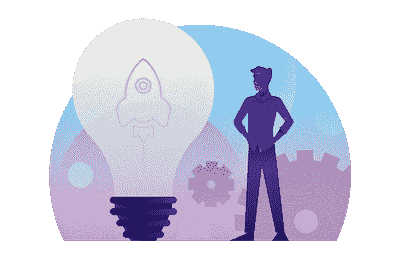

# LogRocket 访谈:eng 领导如何考虑“整体工程师”来保持他们的团队既投入又高效

> 原文：<https://blog.logrocket.com/logrocket-interviews-whole-engineer/>

进行一系列面试的全部目的是让你的谈话对象所说的话让你大吃一惊。如果你发现自己并不惊讶，那就很难说任何人都学到了新东西——毫无疑问，这是满足的基本原罪。更清楚地说，由此产生的作品肯定会令人厌烦。

LogRocket 内容团队想要推出一个访谈系列已经有一段时间了(你可能已经注意到，在过去的几年里，我们一直忙于教程)。虽然人们似乎很喜欢我们发布的教程，但我们无法摆脱忽视工程经理的痛苦感觉。也许他们不像以前那样写那么多代码，但是他们和个人贡献者一样重要。

早在新冠肺炎强调“运营效率”的重要性之前，我们就将它定为我们的第一个主题。因此，当我们开始就此采访一群工程领域的领导者时，我们并不期望会有一个关于管理的阐述。

我们认为我们会听到很多关于流程和工具的技术讨论，以及他们因此而享受的时间(成本)节约。当然，我们确实得到了一些。但是在这些谈话结束时，最突出的是这些过程背后的人类利益。

对话更多的是关于人而不是数字——不仅仅是这些领导者管理的团队，还有他们在整个组织中的同事。过程只是开始，但它们确实存在，以帮助管理人员和期望。运营效率是所有这些因素的结果。这些部分是如何组合在一起的。

## TL；速度三角形定位法(dead reckoning)

## 我们的谈话对象:

**Jordan Smith**, software engineering manager, formerly at PillPack. PillPack is a full-service online pharmacy that was acquired by Amazon in 2018, and Jordan’s perspective is colored in large part by his time there throughout its early growth stages. Jordan now works for a large e-commerce company.

**Sanjeev Banerji**, VP of engineering at [Ellevation Education](https://ellevationeducation.com/), an edtech company that serves solutions for school administrators and educators working with English-language learners. Sanjeev, too, has a background in startups, having previously worked at Delphix and BitSight.

**Amos Benninga**, VP of engineering at [LightForce Orthodontics](https://lightforceortho.com/), a medical device company that produces individually customized 3D-printed braces (and the software that makes it possible). Amos has a range of engineering experience, having formerly held leadership positions at GrabCAD and, later, Stratasys, after the latter acquired the former.

## MVP 思维模式

#### *“不是释放垃圾的意思。这意味着要尽快拿出一些东西来回答问题。”*

你想开发人们喜欢使用的优秀软件——这是必然的。用户反馈在这里是无价的。但是平衡用户输入和业务优先级，以及决定它的许多声音，是很困难的。

PillPack 的前软件工程经理约旦·史密斯最近加入了一家大型电子商务公司，他说:“就像你在管理中做的大多数事情一样，你真的在努力寻找一种金发姑娘式的、重叠的、维恩图的方法。”。

一旦你找到了最佳点并决定做什么，你如何确保你不会过度设计需求？开发太多没人用的功能不仅仅是浪费时间，还会影响士气。

你的团队不会因为花了一个月的时间为一个没人会使用的功能添加附加功能而感觉良好，更不用说公司领导层会如何回应了。这是 MVP 存在的主要原因——验证需求。

“Something I’m drawn to is this notion of having a hypothesis,” says Sanjeev Banerji, VP of engineering at edtech company Ellevation Education.

“MVP 是关于一个假设。这实际上不是“最小价值时间”更多的是，有什么东西我们可以快速发货来回答问题？"

“回答问题并不意味着释放垃圾，”他澄清道。“这意味着要尽快拿出东西来回答问题。一旦 MVP 出来了，我们就会有意识地决定是否继续投资，以及以什么样的速度投资。”

LightForce Orthodontics 的工程副总裁 Amos Benninga 表示同意。“我们真的在四处寻找，我们做的任何事情的 MVP 是多少？”他说。“我们总是尽量做到最少，因为我们越快将其推向市场，就能越快获得反馈。”

> “与其花太多时间争论特定的特性集或其他东西，”Amos 继续说道，“我们所做的很大一部分实际上是围绕理解用例。我们能做的最起码的事情是什么呢？当然，不仅仅是最低的质量，还有最低的功能。一旦你明白了这一点，如果你和(你的用户)做了足够多的工作，你就会开始得到反馈，这就是所有的增量开发。”

“我认为[你的团队]需要的平衡，”他总结道，“是要拿出多少并愿意事后重构，还是要投入多少太多，在任何人都不需要之前构建太多的产品。”

简而言之:建造满足需求的东西。测试一下。它解决问题了吗？它提供价值吗？很好。继续建设。增量开发是附加的，最好的，微调的——如果你愿意的话，是糖衣。提前做这些工作是浪费时间，当时间是你最稀缺的资源时，这是一个大罪。

## 范围练习

#### *“我觉得这是一种幼稚的做法，而且非常昂贵。”*

让我们加倍努力避免浪费时间。在您开始构建之前，领导层可能希望对给定项目需要多长时间进行一些估计。原因显而易见。他们希望在继续进行项目之前了解他们在项目上投入了多少时间(即资金);建筑的成本不应该超过它的回报。

在敏捷方法中，这种测量交付时间的练习通常被称为 [t 恤衫尺码调整或定位](https://www.atlassian.com/agile/project-management/estimation)。没有太多的杂七杂八，它只是简单地估计了你的团队交付一个[用户故事](https://www.atlassian.com/agile/project-management/user-stories)需要多少努力，这是从用户的角度表达的最终目标。

前 PillPack 公司的 Jordan 不仅质疑这种做法的准确性，还质疑其有用性。“我不相信非常非常详细的工程估算，”他说。“原因之一是我认为他们几乎总是错的。”

“每个人都想要同样的东西:他们想有效地利用公司的工程资源，”他解释道。“但实际上他们说的是，我们希望你在计划中投入大量精力，以避免我们做出错误决定的风险。我认为这是一种幼稚的方法，而且非常昂贵。”

这归结为管理期望——记住你在谈论一个估计，而不是契约。这意味着不仅要与你的直属团队保持畅通的沟通渠道，还要与其他业务部门的领导和利益相关者保持畅通的沟通渠道。

> “我们知道风险是持续的和必然的，”乔丹说。“我们如何构建项目，以便预先承担大量风险？我们如何让我们的团队与我们的业务利益相关者保持如此频繁的联系，以至于当我们遇到重大风险时，这些利益相关者知道他们选择了什么，并且因为他们知道我们在处理什么而原谅我们？”

“比起正式合同，我更支持人际关系和沟通，”他总结道。“我认为管理风险和不确定性——以及适应风险和不确定性——是比试图掩盖它更好的方法。”

我们真正谈论的是向上、向下和横向管理的技能。这并不容易，但这是必要的，你和你的团队会因此变得更好。它能确保你和你的团队充分利用你的时间，还能建立信任，加强你在整个公司的关系。

## 你的建筑

#### *“如果你试图快速交付，你最终会走很多捷径，随着时间的推移，这些捷径会越积越多。”*

当你开始倡导像重构你的架构这样不性感的项目时，这种信任将会派上用场。对工程师来说，好处是显而易见的，但你的架构不太可能很快成为你营销信息的基石；除了你和你的团队，这对任何人来说都不是一个“关键区别点”。

所以你必须翻转剧本，把价值卖给公司的其他人。当你和你的销售对象有着良好的关系时，这就容易多了。

> LightForce 的工程副总裁阿莫斯说:“我喜欢用的一句格言来自摩托车比赛:它是‘慢行快’。“如果你正确地构建了(架构)，那么你就可以更快地获得更多的功能，而无需付出更多的努力。但如果你试图快速交付，你最终会走很多捷径，随着时间的推移，这些捷径会越积越多。”

如果你信守诺言，在新特性集上处处妥协，保持沟通渠道畅通，并且总体上有效地管理，你可能已经成功地让 caché倡导核心系统的实质性工作。这是阿莫斯接下来的观点。“很多时候，这取决于管理层。”

对于 Ellevation 的 Sanjeev 来说，这是他试图向初级团队成员传达的信息。“我想让他们考虑一下，”他在向非工程师解释从事建筑工作的重要性时说。“如果你能更快地工作，如果你不那么烦躁，这让你更有效率，那就有商业价值。”

If you can communicate and, ultimately, objectively demonstrate the value of maintaining and improving your architecture, it’ll be easier to get others to buy in down the road.

这是一种在 LightForce 为 Amos 工作的方法。“我很高兴我今天的位置，因为我认为首席执行官明白，当我们建立正确的基础设施时，你就可以更快地获得许多东西。”

你的团队会因此更加快乐和高效。阿莫斯简单地说:“我认为工程师想要构建伟大的代码”，这从你的架构开始。

## 科技债务

#### *“技术债务的很大一部分是你经常会在销售和工程之间就投资多少时间在新功能上发生争执。”*

然而，现实是你需要选择你的位置。不能动不动就重构一切。回到我们之前关于 MVP 的讨论，你根本没有时间去研究细节。“这是一种持续的紧张，”乔丹说。“你如何平衡提供商业价值的需求和你对科技债务的长期策略？”

科技债务是快速工作的结果，在许多人眼里这是一个贬义词。但它也是一个可以利用的工具。例如，当你需要快速测试一个假设或获得反馈时，你可以使用它。“我对科技债务相当漫不经心，”乔丹说，尤其是在 PillPack 的时候。“我认为这是因为这只是你在创业时必须具备的心态。”

但是要采取一个雄心勃勃的方法，你需要准备好解决可能由此产生的问题。过度使用科技债务会影响你努力建立的关系。

对于 Jordan 来说，当内部用户反复遇到 UI 渲染错误时，他们开始对软件的其他领域失去信任，最终对他的团队失去信任。“尽管渲染错误本身并不昂贵(修复)，但与我们的利益相关者建立牢固的关系却很昂贵。”

阿莫斯也提到了这样一个事实，即你处理科技债务的方式会在你的公司内部产生更广泛的影响。“技术债务的很大一部分是，销售团队和工程团队之间经常会围绕在新功能上投资多少时间而发生争吵。”

> 他继续说，“当你解决技术债务时，没有人真正知道你在做什么，因为你进入一个盒子一个月，然后回来，[销售团队]说，‘嗯，我们得到了什么？是一样的产品。我希望你花时间在新功能上。所以我认为，这种讨论是公司关系和文化的一种症状。"

因此，一方面，你冒着行动过快的风险，透支了你的技术债务，让你的用户失望——并通过强迫他们用蹩脚的代码工作来扰乱你的团队。另一方面，你没有充分展示偿还技术债务的价值，让你的同事和领导感到沮丧。

同样，这又回到了管理期望和建立基于信任和沟通的文化。你的团队需要认识到走捷径的短期利益，以便更快地行动。销售人员需要了解，当你分期偿还技术债务时，你的团队能提高多少效率。效率让每个人都快乐。

## 建设文化

#### *“你不会想成为一台大机器中的一个小齿轮。”*

事实上，你的团队是否开心是最重要的。一个快乐的团队更有动力去交付，并且更有效率地交付。你放置的工具和过程，你在组织中建立的关系，这些实际上只是为了让你的团队受益而存在的。加上合适的人，这些因素奠定了你的团队文化的基础。

这听起来可能很明显，但它始于招聘。LightForce 副总裁阿莫斯解释说:“我认为首要的事情是从雇佣喜欢工作的人开始。“我认为，最重要的是，大多数开发者喜欢为人们创造东西。如果你有合适的人，这就是你所得到的。”

引入合适的人只能让你到此为止。下一步必须做的是弄清楚他们需要什么来感受价值和满足感。“本质上，这是管理 101，”Ellevation 的 Sanjeev 说。“什么能激励一个人？个人的动机是什么？”

> 他很快指出，对于拥有大型团队的领导者来说，这是不可持续的。“很难在一个人一个人的基础上复制这一点。那么我们的杠杆点在哪里呢？如果我能真正帮助一个人，如果我能让他们扬帆起航，他们也会让别人扬帆起航。就是这样。是什么在一对一的基础上激励着人们，还有，哪里是一个人能让另一个人真正兴奋的地方？”

阿莫斯对存在主义动机也有类似的看法。“你想成为重要人物。你不想成为大机器中的一个小齿轮。这不仅与公司的规模有关，还与责任有关。我可以推翻失败的测试吗？我可以强制合并吗？在正确的文化中，我们希望人们有责任心。”

对于 Sanjeev 来说，代码审查是创造问责和授权文化的另一个因素。“当我加入[Ellevation]时，我们没有代码审查的文化。一个人必须有那个——那是一个台桩。但是，当你有一个成功的公司运输产品时，很难在飞行中建立这种关系。我们不能暂停，也不想暂停。”

在他的案例中，部分问题是他的团队的效率受到他们用于代码评审的遗留工具的影响。“所以我们最终引入了 GitHub，转移了我们所有的回购，现在我们已经有了代码审查的规则，这确实提高了效率，”Sanjeev 解释道。“因为你在发布代码的时候做了正确的事情。我们已经看到 bug 数量全面大幅下降。”

阿莫斯认为，更高效、更频繁地发布更好的代码本身就是一个激励因素。“我真的发现，对于开发者来说，你发布得越多，你就越喜欢，”他说。写作，发布，收集反馈，然后迭代的循环是丰富的，有了正确的过程，它是无缝的。

## 衡量不仅仅是可量化的

套用上面 Jordan 的一句话，你公司的所有领导都想有效地利用你的工程资源。原因很明显，当您开始衡量团队时间的美元价值、基于新特性赢得的交易等等时，这一点变得更加明显。

但令我惊讶的是，这些对话，我本以为会如此强烈地关注运营效率的客观、可量化的领域，却变成了围绕管理的更定性的讨论。

这并不是说你选择的工具和过程本质上更有效，它们通过设计节省了更多的时间和金钱，而是事实上它们有助于一种文化和一种环境，在这种文化和环境中，团队只是更快乐、更有动力、更有见识。这超越了你的直接团队——它渗透到整个公司。

根据他们在公司的任期，你可以合理准确地估算新工程师的入职成本，以及你在这项投资上的得失。但是很难，如果不是不可能的话，对他们通过有效的开发过程开发出伟大的产品所获得的满足感进行定价。