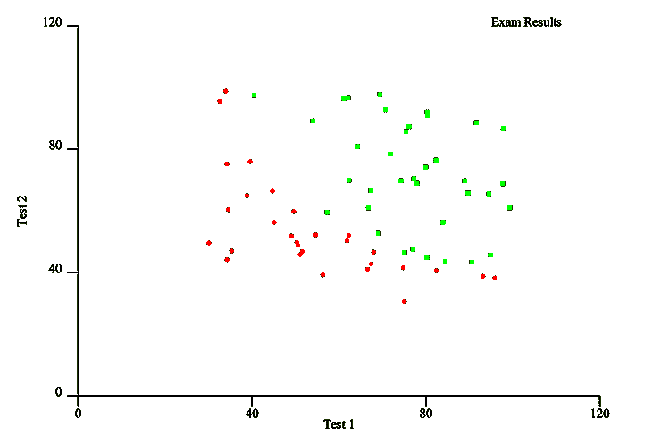

# Rust 中使用 Linfa - LogRocket 博客的机器学习

> 原文：<https://blog.logrocket.com/machine-learning-in-rust-using-linfa/>

机器学习是一个非常有趣的话题。当谈到 Rust 中的机器学习时，我以前曾尝试过，这个话题继续让我着迷。

每当我在学习一门新的编程语言时，过一会儿，我会问自己，“我能用这个做机器学习吗？”当然，你可以用任何编程语言“做机器学习”。因此，问题是，它的效果如何？

在本教程中，我们将向您展示如何使用 Linfa 在 Rust 中创建基本的机器学习应用程序。在此过程中，我们将涵盖以下内容:

## Rust 对机器学习有好处吗？

在机器学习领域，Python、R 以及最近的 Julia 等语言占据了主导地位，因为它们拥有非常好的库、工具和框架，可以完成许多与数据科学相关的繁重工作。无论如何，性能关键部分通常由低级 BLAS/Lapack 库处理，所以在这方面，动态语言的开销不像在游戏编程中那样令人痛苦。

Rust 中关于机器学习的现状如何？你可以查看[我们正在学习吗？](https://www.arewelearningyet.com/)了解 Rust 机器学习生态系统的持续进展更新。在撰写本文时，该社区非常活跃，进展也很快。然而，如果你计划在 Rust 中做更多的机器学习实验，鉴于生态系统的不成熟，你应该预计到必须自己构建一些东西。

也就是说，已经有一些很棒的底层库和工具包可用，包括 [Linfa 工具包](https://rust-ml.github.io/linfa/)。

## 林法是什么？

Linfa 是一个更高级别的元框架，包括数据处理的公共助手和用于机器学习的许多领域的[算法，包括:](https://github.com/rust-ml/linfa#current-state)

*   线性回归
*   数据分组
*   核心方法
*   逻辑回归
*   贝叶斯
*   支持向量机

据我所知，这个工具包是有据可查的，并且有一个直观的 API。该项目的宏伟目标是接近 scikit 的功能广度。如果他们继续像去年一样，我可以看到这种情况发生。

在之前的一个实验中，我试图在围棋中建立一个小型分类器，使用逻辑回归对学生的考试成绩和被学校录取的机会进行分类。在本教程中，我们将尝试使用 Rust 和 Linfa 来构建类似的东西。

我们将从加载和绘制数据开始，感受一下它。然后，我们将使用各种参数训练逻辑回归模型，并选择在测试集上执行最好的模型。

## 什么是逻辑回归？

因为我们的重点是如何使用 Rust 来处理机器学习问题，所以我们不会在逻辑回归到底是如何工作的问题上陷得太深。但是，我们至少应该对它的含义有一个基本的了解。

逻辑回归是一种统计模型，用于测量结果的概率，如真/假、接受/拒绝等。，也可以扩展到多个这样的类。

在内部，模型使用逻辑函数(S 曲线)。逻辑回归是寻找最适合给定数据集的参数的过程。简而言之，它模拟了我们在数据中感兴趣的随机变量(0 或 1)的概率。

在机器学习中，寻找最佳模型通常是使用[梯度下降](https://en.wikipedia.org/wiki/Gradient_descent) [nt](https://en.wikipedia.org/wiki/Gradient_descent) 来完成的，这是一种寻找局部最小值的优化。目标通常是计算误差，然后最小化该误差。

一般来说，有很多非常好的资源可以学习更多关于逻辑回归和机器学习算法的知识。如果你有兴趣深入研究，那么[牛逼的机器学习](https://github.com/josephmisiti/awesome-machine-learning)是学习资源、框架、库等等的绝佳起点。

## 在 Rust 中构建一个简单的机器学习应用

本教程的目标是演示在 Rust 中构建一个简单的机器学习应用程序的多种方法之一。因为我们的目标不是从真实数据中获得任何见解，所以我们将使用一个非常小的数据集，只包含 100 条记录。

我们也将跳过为机器学习准备数据，这可能包括预处理步骤，如离群点消除，规范化，数据清理等。这是数据科学的一个非常重要的部分，但是它不在本教程的讨论范围之内。

我们将在示例中使用的实际数据如下所示:

```
32.72283304060323,43.30717306430063,0
64.0393204150601,78.03168802018232,1

```

在第一列中，我们有一个学生第一次考试的分数，在第二列中，有第二次考试的结果。这些是我们的`features`。第三列，我们所谓的`target`，表示学生是否凭借这些成绩被学校录取。一个`1`表示接受，一个`0`表示拒绝。

我们的目标是训练一个模型，它可以根据两个考试分数可靠地预测一个学生是否会被学校录取。数据集分为 65 行训练数据和 35 行测试数据，前者用于训练模型，后者用于验证训练好的模型。最后，我们将确定我们的模型在它尚未看到的数据上是否表现良好。

您可以在 [GitHub](https://github.com/zupzup/rust-ml-example/tree/main/data) 上访问 CSV 格式的训练和测试数据文件。

**设置**

接下来，你只需要一个[最近的 Rust 安装](https://blog.rust-lang.org/2021/03/25/Rust-1.51.0.html)(在撰写本文时为 1.51)。

首先，创建一个新的 Rust 项目:

```
cargo new rust-ml-example
cd rust-ml-example

```

接下来，编辑`Cargo.toml`文件并添加您需要的依赖项:

```
[dependencies]
linfa = { version = "0.3.1", features = ["openblas-system"] }
linfa-logistic = "0.3.1"
ndarray = { version = "0.13", default-features = false }
ndarray-csv = "0.4"
csv = "1.1"
plotlib = "0.5.1"

```

我们将使用`linfa`和`linfa-logistic`箱子，它们提供了基本的 Linfa 工具箱和逻辑回归算法。

我们还将使用`openblas-system`特性，这意味着我们将依赖`libopenblas`进行底层计算。对于林法可以使用的 [BLAS/Lapack 后端](https://github.com/rust-ml/linfa#blaslapack-backend)(低级的、高度优化的线性代数库)，还有一些其他的选项。

除了 Linfa，我们还将使用奇妙的`[ndarray](https://docs.rs/ndarray/0.15.1/ndarray/)` crate，它是 Rust 中 n 维向量的事实上的标准。为了将数据集加载到应用程序中并转换成一个`ndarray`，我们将使用`[csv](https://docs.rs/csv/1.1.6/csv/)`和`[ndarray-csv](https://docs.rs/ndarray-csv/0.5.1/ndarray_csv/)`箱子，在示例中，它们也在 Linfa 内部用于加载数据集。

最后，我们将使用 [`plotlib`](https://docs.rs/plotlib/0.5.1/plotlib/) 来创建数据的初始 SVG 散点图，以了解数据点是如何分布的。

## 加载数据

首先，从`./data/test.csv`和`./data/train.csv`中的 CSV 文件加载数据，将其转换为`ndarray`，并从中创建一个 Linfa `Dataset`:

```
fn load_data(path: &str) -> Dataset<f64, &'static str> {
    let mut reader = ReaderBuilder::new()
        .has_headers(false)
        .delimiter(b',')
        .from_path(path)
        .expect("can create reader");

    let array: Array2<f64> = reader
        .deserialize_array2_dynamic()
        .expect("can deserialize array");

    let (data, targets) = (
        array.slice(s![.., 0..2]).to_owned(),
        array.column(2).to_owned(),
    );

    let feature_names = vec!["test 1", "test 2"];

    Dataset::new(data, targets)
        .map_targets(|x| {
            if *x as usize == 1 {
                "accepted"
            } else {
                "denied"
            }
        })
        .with_feature_names(feature_names)
}

```

在`csv::ReaderBuilder`中，我们将`has_headers`设置为`false`，因为我们没有标题行，设置了分隔符和路径，并从它那里接收了一个阅读器。

`ndarray-csv`库有一个实用方法来创建一个`ndarray::Array2`，一个来自这个阅读器的二维数组，我们使用`ndarray::s!`切片参数构造器宏进一步分割它。这个宏将范围作为输入，输出参数给`array.slice`方法，将原始数据分割成我们需要的部分。

如果你想深入了解，Rust docs 提供了一个[关于`ndarray`](https://docs.rs/ndarray/0.15.1/ndarray/struct.ArrayBase.html#slicing) 切片的深入解释。这个想法实际上是将前两列切到我们的`data`数组中，将第三列切到`targets`数组中，因为这是`linfa::Dataset`期望创建的新数据集。

我们的两个特性分别标记为`test 1`和`test 2`，将完成的数据集返回给调用者。

对于我们的训练和测试数据，我们可以在`main`中调用它:

```
fn main() {
    let train = load_data("data/train.csv");
    let test = load_data("data/test.csv");
    ...
}

```

接下来，我们将看到如何使用`plotlib`创建散点图。

## 绘制数据

为了创建散点图，我们将使用 [`plotlib`](https://github.com/milliams/plotlib) ，这是一个轻量级且易于使用的 Rust 绘图库。

```
fn plot_data(
    train: &DatasetBase<
        ArrayBase<OwnedRepr<f64>, Dim<[usize; 2]>>,
        ArrayBase<OwnedRepr<&'static str>, Dim<[usize; 2]>>,
    >,
) {
    let mut positive = vec![];
    let mut negative = vec![];

    let records = train.records().clone().into_raw_vec();
    let features: Vec<&[f64]> = records.chunks(2).collect();
    let targets = train.targets().clone().into_raw_vec();
    for i in 0..features.len() {
        let feature = features.get(i).expect("feature exists");
        if let Some(&"accepted") = targets.get(i) {
            positive.push((feature[0], feature[1]));
        } else {
            negative.push((feature[0], feature[1]));
        }
    }

    let plot_positive = Plot::new(positive)
        .point_style(
            PointStyle::new()
                .size(2.0)
                .marker(PointMarker::Square)
                .colour("#00ff00"),
        )
        .legend("Exam Results".to_string());

    let plot_negative = Plot::new(negative).point_style(
        PointStyle::new()
            .size(2.0)
            .marker(PointMarker::Circle)
            .colour("#ff0000"),
    );

    let grid = Grid::new(0, 0);

    let mut image = ContinuousView::new()
        .add(plot_positive)
        .add(plot_negative)
        .x_range(0.0, 120.0)
        .y_range(0.0, 120.0)
        .x_label("Test 1")
        .y_label("Test 2");

    image.add_grid(grid);

    Page::single(&image)
        .save("plot.svg")
        .expect("can generate svg for plot");
}

```

第一步是将我们的数据转换成正确的格式。要创建一个散点图，我们需要创建两个图:一个用于阳性(接受)数据点，一个用于阴性(拒绝)数据点。

`plotlib`期望数据以`Vec<(f64, f64)>`的形式出现，所以我们需要首先通过迭代记录(特征)和目标并将它们收集到向量中，将我们的`ndarray`支持的 Linfa 数据集按摩回这个形状。然后，我们必须迭代这些向量，将正数据点添加到一个`positive` vec，将负数据点添加到一个`negative`向量。

在这一点上，我们终于可以创建出实际的情节。我们将设置不同的点样式，以区分正和负，并将它们放在一个`ContinuousView`中，在这里我们设置标签值和最大轴范围。

只需将绘图保存为 SVG 文件。结果应该是这样的:



正如您所看到的，这些数据在视觉上被很好地分开了，所以我们希望模型能够很好地适应这些数据。

我们可以调用`plot_data`函数，对我们的数据进行一些元数据的初始打印，就像`main`中这样:

```
...
    let features = train.nfeatures();
    let targets = train.ntargets();

    println!(
        "training with {} samples, testing with {} samples, {} features and {} target",
        train.nsamples(),
        test.nsamples(),
        features,
        targets
    );

    println!("plotting data...");
    plot_data(&train);
...

```

## 训练和验证模型

最后一步是训练和验证模型。为此，我们必须完成以下步骤:

1.  使用训练数据创建逻辑回归模型并对其进行训练
2.  用测试数据测试创建的模型
3.  创建一个混淆矩阵，并检查模型在测试数据上的准确性

一个[混淆矩阵](https://en.wikipedia.org/wiki/Confusion_matrix)本质上是一个显示真阳性、假阳性、真阴性和假阴性的表格，并使您能够计算模型的准确性或精确度等指标。

我们将多次完成上述步骤。我们将尝试优化模型中的两个参数:迭代次数和决策阈值。

首先，创建一个助手方法来进行一次模型迭代，计算并返回一个混淆矩阵:

```
fn iterate_with_values(
    train: &DatasetBase<
        ArrayBase<OwnedRepr<f64>, Dim<[usize; 2]>>,
        ArrayBase<OwnedRepr<&'static str>, Dim<[usize; 2]>>,
    >,
    test: &DatasetBase<
        ArrayBase<OwnedRepr<f64>, Dim<[usize; 2]>>,
        ArrayBase<OwnedRepr<&'static str>, Dim<[usize; 2]>>,
    >,
    threshold: f64,
    max_iterations: u64,
) -> ConfusionMatrix<&'static str> {
    let model = LogisticRegression::default()
        .max_iterations(max_iterations)
        .gradient_tolerance(0.0001)
        .fit(train)
        .expect("can train model");

    let validation = model.set_threshold(threshold).predict(test);

    let confusion_matrix = validation
        .confusion_matrix(test)
        .expect("can create confusion matrix");

    confusion_matrix
}

```

下一步是传递测试和训练数据。忽略长类型——这是 Linfa 和`n``darray`换行的副作用。在一个更大的项目中，我们将简单地在这里创建类型别名，以及决策阈值和最大迭代次数的值。

接下来，用给定的`max_iterations`创建`LogisticRegression`模型。将`gradient_tolerance`设置为`0.0001`，这是默认值，只是为了说明它也可以设置。这是梯度下降的学习率。操纵该值可能会加快或减慢计算速度，但可能会陷入较高值的局部最小值。

在模型上调用`.fit(train)`，根据我们的训练数据对其进行训练。之后，通过设置决策阈值并对测试数据调用`.predict(test)`来创建一个`validation`模型。

这将在测试数据上测试我们的训练模型。我们随后可以从结果中产生一个混淆矩阵。

为了更改参数并找到最佳模型，我们将在`main`中创建一个嵌套循环，其中 t 调用`iterate_with_values`助手:

```
    println!("training and testing model...");
    let mut max_accuracy_confusion_matrix = iterate_with_values(&train, &test, 0.01, 100);
    let mut best_threshold = 0.0;
    let mut best_max_iterations = 0;
    let mut threshold = 0.02;

    for max_iterations in (1000..5000).step_by(500) {
        while threshold < 1.0 {
            let confusion_matrix = iterate_with_values(&train, &test, threshold, max_iterations);

            if confusion_matrix.accuracy() > max_accuracy_confusion_matrix.accuracy() {
                max_accuracy_confusion_matrix = confusion_matrix;
                best_threshold = threshold;
                best_max_iterations = max_iterations;
            }
            threshold += 0.01;
        }
        threshold = 0.02;
    }

    println!(
        "most accurate confusion matrix: {:?}",
        max_accuracy_confusion_matrix
    );
    println!(
        "with max_iterations: {}, threshold: {}",
        best_max_iterations, best_threshold
    );
    println!("accuracy {}", max_accuracy_confusion_matrix.accuracy(),);
    println!("precision {}", max_accuracy_confusion_matrix.precision(),);
    println!("recall {}", max_accuracy_confusion_matrix.recall(),);

```

这当然不是最有效的方法。请记住，在实际场景中，这可以在同一台机器或一个集群上并行化。

下一步是计算一个初始的最佳混淆矩阵，并为`max_iterations`和`threshold`参数设置范围，遍历它们，并为每个计算我们的模型。

一旦我们有了一个结果，就将该模型的准确性与之前的最佳模型进行比较，如果有更好的模型，就保存参数。

最后一步是打印最优模型的参数和性能指标。用`cargo run`运行整个应用程序输出如下:

```
training with 65 samples, testing with 35 samples, 2 features and 1 target
plotting data...
training and testing model...
most accurate confusion matrix:
classes    | denied     | accepted
denied     | 11         | 0
accepted   | 2          | 22

with max_iterations: 1000, threshold: 0.37000000000000016
accuracy 0.94285715
precision 0.84615386
recall 1

```

有用！正如你所看到的，只有两个数据点被错误地分类，给了我们大约 94%的准确率。还不错！

你应该把这个实验的结果和一块巨大的盐放在一起；100 个条目的数据集上的数据科学根本不是真正的数据科学，只是数据噪音。然而，你可以看到我们的方法奏效了。您还可以在循环中试验参数并打印出来，以查看流程不同阶段的性能

你可以在 [GitHub](https://github.com/zupzup/rust-ml-example) 上找到完整的示例代码。

## Rust 中机器学习的未来

自从我第一次检查 Rust 的机器学习生态系统以来，它已经取得了很大的进步，看起来社区并没有计划在短期内放缓。

我很高兴看到这种趋势，以及 Rust 是否会成为这个领域中已建立的语言和平台的有力竞争者。看看 Rust 的优势，作为一种非常快速、安全的低级系统语言，它可能非常适合在未来构建可扩展的机器学习应用程序——也就是说，如果它变得足够符合人体工程学，可以与现有的平台和工具一起使用。

## [log rocket](https://lp.logrocket.com/blg/rust-signup):Rust 应用的 web 前端的全面可见性

调试 Rust 应用程序可能很困难，尤其是当用户遇到难以重现的问题时。如果您对监控和跟踪 Rust 应用程序的性能、自动显示错误、跟踪缓慢的网络请求和加载时间感兴趣，

[try LogRocket](https://lp.logrocket.com/blg/rust-signup)

.

[](https://lp.logrocket.com/blg/rust-signup)

LogRocket 就像是网络和移动应用程序的 DVR，记录你的 Rust 应用程序上发生的一切。您可以汇总并报告问题发生时应用程序的状态，而不是猜测问题发生的原因。LogRocket 还可以监控应用的性能，报告客户端 CPU 负载、客户端内存使用等指标。

现代化调试 Rust 应用的方式— [开始免费监控](https://lp.logrocket.com/blg/rust-signup)。