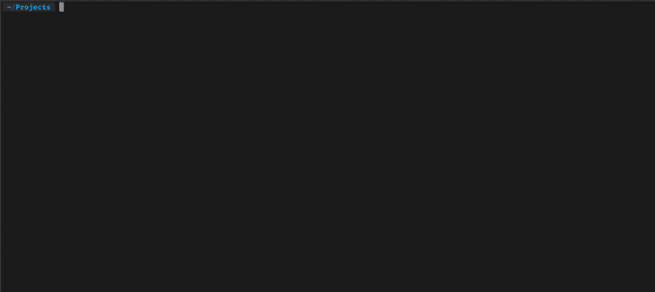
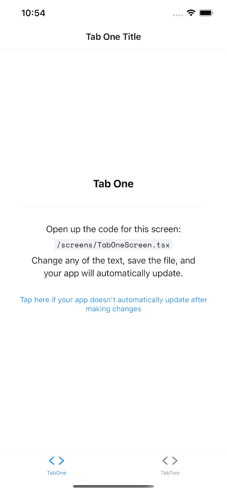
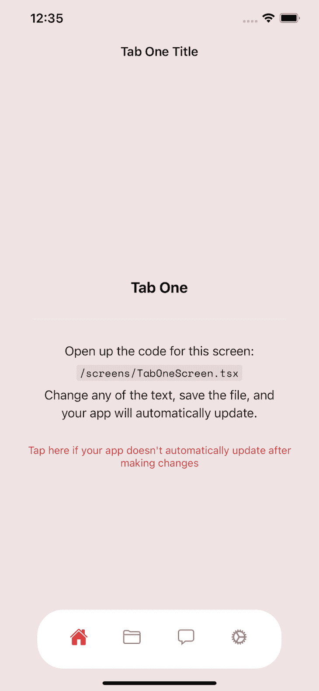
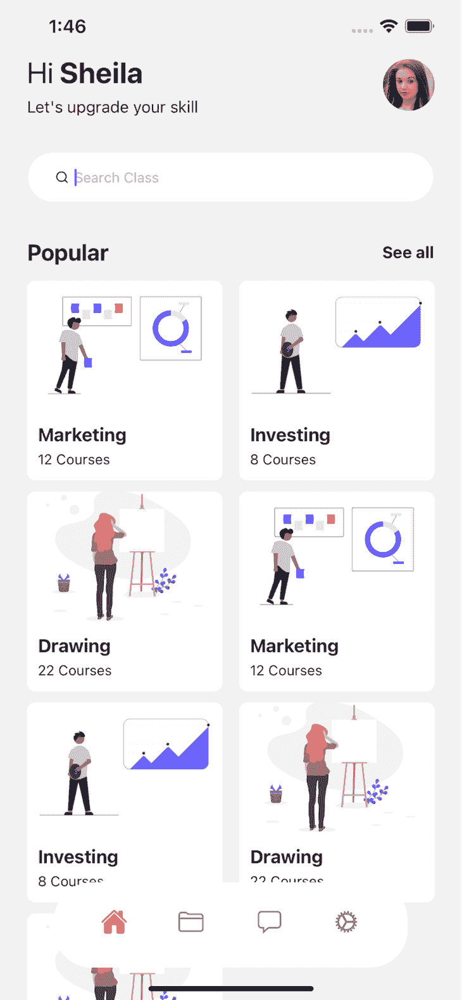
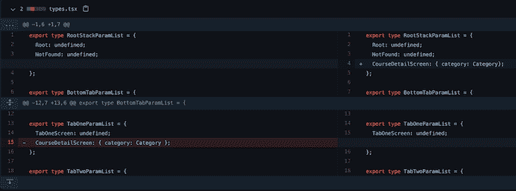
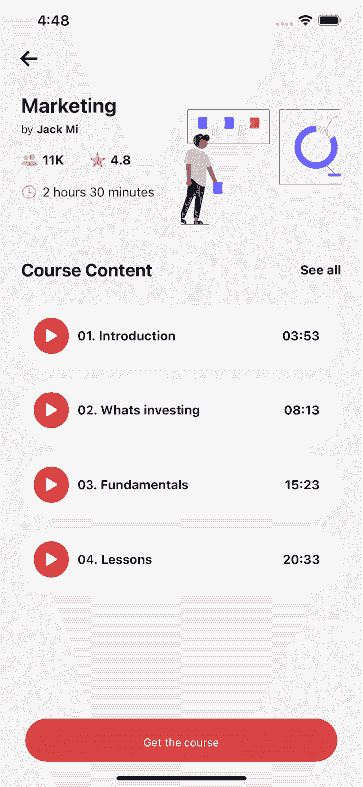

# Magnus UI 教程:构建 React 原生 UI 组件

> 原文：<https://blog.logrocket.com/magnus-ui-tutorial-building-out-react-native-ui-components/>

拥有一个好的用户界面和 UX 是任何应用在野外成功的最重要的因素之一，尤其是当几乎每个应用都有这么多选择的时候。让你的应用程序的外观和行为符合你的要求需要时间、耐心和练习。

但是，如果你在开发应用时没有设计师和 UX 开发者的帮助，你可能会花大部分时间来实现你的想法。让 UI 看起来漂亮可能是你最不关心的事情——特别是如果你是一个单独的开发者。

这就是像 Magnus UI 这样的工具的用武之地。通过一些组件和直观的实用工具，它允许您非常快速和轻松地为 React 本机应用程序构建外观和感觉都很棒的 [UI 组件。](https://blog.logrocket.com/react-native-component-libraries-in-2020/)

实用程序第一风格的库是热门的新事物——它们已经存在一段时间了，但是最近它们的发展速度相当快。Magnus UI 正在追随这一趋势。如果你想看看所有的炒作是怎么回事，这是给你的帖子。

在这篇博文中，我将带你使用 Magnus UI 构建两个完整的应用程序屏幕。我跟设计师一点关系都没有，所以我会求助于[从 Dribbble](https://dribbble.com/shots/14725018-E-Learning-App) 中挑选一些东西。看起来是这样的:


我选择这种设计的原因是因为它包含了几乎所有应用程序都有的一些最常见的 UI 块:

1.  一个列表的东西，每个图像和一些文本内容。在这种情况下，它是课程类别的列表
2.  允许您在多个页面之间导航的底部导航
3.  主详细模式，其中每个类别都有自己的屏幕，显示其中的课程和屏幕的操作按钮
4.  一些更小的细节，如用户资料，搜索栏，统计显示等。

当然，Dribbble 模型总是包含一些额外的部分，对最终用户没有任何价值，只会让设计流行起来。因此，我们将削减这一点，以保持这篇文章的内容相关和点。

好了，现在让我们开始吧！哦，在我们开始之前，如果你只是想在承诺通读整本书之前先看一下最终结果是什么样的，[这里给你一个快速预览](https://youtu.be/MDTnu1C5tyA)，这里是 GitHub 上的[完整代码库](https://github.com/foysalit/elarn-blog)。

## 我们的工具包

首先，我喜欢 TypeScript，一旦我开始使用它，回到 JavaScript 就感觉不对。所以我将在这个项目中使用 TypeScript，但是如果您愿意，也可以坚持使用 JS 版本。

开始使用和管理 React Native 项目可能有点乏味，这就是为什么我总是更喜欢 [Expo](https://expo.io/) 的原因，尽管它有其局限性。幸运的是，为了演示如何构建一个双屏应用程序，我们不会遇到任何限制。

对于课程类别及其详细页面之间的主详细信息导航，我选择了 react-navigation 包。它还能帮助我们快速搭建一堆复杂的东西，比如底部导航栏、顶部标题区等等。

当然，该节目的主要明星 [Magnus UI](https://magnus-ui.com/) 需要被包括在该列表中。在设计中，有一些插图没有单独提供，所以我将用来自 [unDraw](https://undraw.co/) 的插图来替换这些插图，这是一个绝对一流的网站，可以为你的项目快速找到漂亮的插图。

我把这些都列出来是为了给读者一个机会，让你在深入研究之前熟悉这些工具。然而，这不是强制性的，因为我会尽我所能在需要时记录所有这些的用法。

## 搭建我们的 React 本地应用

如果您不熟悉 React Native 或 Expo CLI，它们都有一些非常方便的样板文件，可以随时启动任何项目。因为我们使用 Expo，所以最适合我们需求的是带标签的模板。

要获得样板文件，在您的终端中运行命令`expo init elarn`并从提示中选择模板。完成后，使用`cd elarn`进入新创建的文件夹。



样板文件已经有了相当多的代码，但是在我们深入研究它之前，让我们从 npm 安装 Magnus UI。您可以在这里遵循他们的[安装指南，但这是您需要运行的:](https://magnus-ui.com/docs/getting-started/)

```
yarn add react-native-magnus color react-native-modal react-native-animatable -S
```

好了，现在让我们看看有了样板代码的应用程序是什么样子的。运行`yarn start`启动世博服务。一旦服务运行，你可以使用 Expo 客户端在你选择的物理设备(iOS/Android)上运行应用程序，或者在仿真器/模拟器上运行应用程序。我打算用 iOS 版模拟器。如果您在这些方面有任何问题，请遵循[世博会文件](https://docs.expo.io/get-started/installation/)。应用程序运行后，您应该会看到如下屏幕:



正如你所看到的，我们有相当多的工作要做，以使它看起来像我们选择的惊人的 Dribbble 设计，所以让我们开始吧！

## 设计底部标签

Expo 选项卡模板内置了 react-navigation，包括两个选项卡屏幕。但是，选项卡遵循基于设备操作系统的本机默认样式。为了让它看起来更像设计，我们必须对它进行一点配置。

由于 react-navigation 和我们的 Expo 样板已经构建了它的大部分，我们将尽量不要过多地重新连接 Magnus UI。相反，我们将只使用一些原始的 React 原生配置和样式，让它看起来像设计。

在样板文件中，我们只得到两个选项卡，但设计有四个。因此，让我们添加几个选项卡，并添加图标，使选项卡看起来更像设计。我们通过@expo/vector-icons 包提供了大量的图标，对于选项卡图标，我们使用的是 Ionicons 图标集。

首先，打开`navigation/BottomTabNavigator.tsx`文件，用以下内容替换`BottomNavigator`组件:

```
   <BottomTab.Navigator
      initialRouteName="TabOne"
      tabBarOptions={{
          showLabel: false,
          activeTintColor: Colors[colorScheme].tint,
          style: {
              marginLeft: 50,
              marginRight: 50,
              marginBottom: 30,
              borderRadius: 35,
              paddingBottom: 10,
              borderTopWidth: 0,
              position: 'absolute',
              paddingHorizontal: 20,
              backgroundColor: Colors[colorScheme].tabBarBackground,
          }
      }}>
      <BottomTab.Screen
        name="TabOne"
        component={TabOneNavigator}
        options={{
          tabBarIcon: ({ color }) => <TabBarIcon name="ios-home" color={color} />,
        }}
      />
      <BottomTab.Screen
        name="TabTwo"
        component={TabTwoNavigator}
        options={{
          tabBarIcon: ({ color }) => <TabBarIcon name="ios-folder-outline" color={color} />,
        }}
      />
      <BottomTab.Screen
        name="TabThree"
        component={TabTwoNavigator}
        options={{
          tabBarIcon: ({ color }) => <TabBarIcon name="ios-chatbox-outline" color={color} />,
        }}
      />
      <BottomTab.Screen
        name="TabFour"
        component={TabTwoNavigator}
        options={{
          tabBarIcon: ({ color }) => <TabBarIcon name="ios-cog" color={color} />,
        }}
      />
    </BottomTab.Navigator>
```

此处增加的内容有:

1.  `BottomTab.Navigator`组件中`tabBarOptions`属性的`style`和`showLabel`字段。这增加了一些自定义样式，使它看起来像设计
2.  `TabThree`和`TabFour`标签指向现有的屏幕，本质上是复制`TabTwo`，但使用不同的图标

现在，与设计相比，这些图标看起来有点太大了，所以在同一个文件中，查找`TabBarIcon`组件，并将`size`道具更改为 25。要用新尺寸调整间距，将`marginBottom`改为-5:

```
 return <Ionicons size={25} style={{ marginBottom: -5 }} {...props} />;
```

由于上述变化，TypeScript 会有点抱怨，因为我们添加了两个新的选项卡，但没有正确定义它们的类型。打开`types.tsx`文件，在`BottomTabParamList`定义中添加`TabThree`和`TabFour`，如下图:

```
export type BottomTabParamList = {
  TabOne: undefined;
  TabTwo: undefined;
  TabThree: undefined;
  TabFour: undefined;
};
```

如果你在看应用程序的当前状态，你可能已经意识到，与设计相比，颜色在屏幕上看起来很差，所以让我们来解决这些问题。通过设置`const tintColorLight = '#D84343';`改变`constants/Colors.ts`中标签的色调，然后通过设置`background: '#EFE3E3'`改变标签栏背景。

这个样板文件同时支持暗模式和亮模式，所以让我们也为暗模式调整一下我们的设计。给明暗方案都添加一个新属性:`tabBarBackground: '#fff'`，因为我们在`tabBarOptions`道具的 style 属性中使用了这个属性。

仅供参考，我直接从 Dribbble 设计中提取了这些十六进制值，因此如果它们不符合您的期望或偏好，请随意调整它们。

完成上述更改后，您的屏幕应该如下所示:



## 配置 Magnus UI 来构建我们的 React 原生 UI

最后，我们开始关注用 Magnus UI 构建页面内容。为了使用所有的 Magnus UI 实用工具来进行样式化，我们需要用一些基本的细节来配置它。首先，让我们将 Magnus `ThemeProvider`导入到`App.tsx`文件中，并用我们的主要颜色定义一个自定义主题:

```
import { ThemeProvider } from "react-native-magnus";

const ElarnTheme = {
  colors: {
    pink900: '#D84343',
  }
}
```

这些颜色定义有助于构建颜色变化的子集，您可以在整个应用程序中使用更容易记忆和识别的名称。我们现在要做的就是用`ThemeProvider`包装我们的整个应用程序，并将`theme`对象传递给提供者:

```
       <ThemeProvider theme={ElarnTheme}>
          <Navigation colorScheme={colorScheme} />
          <StatusBar />
        </ThemeProvider>
```

现在，让我们从头开始构建我们的主屏幕。我首先注意到的是标题，上面写着`Tab One Title`像一个疼痛的拇指一样突出。为了摆脱这一点，我们需要回到`BottomTabNavigator.tsx`并传递一个新的道具给`TabOneScreen`定义:

```
  <TabOneStack.Screen
        name="TabOneScreen"
        component={TabOneScreen}
        options={{
            headerShown: false
        }}
      />
```

很明显，`headerShown: false`是隐藏头的东西。

## 步骤 1:构建主屏幕 UI

您可能已经注意到了，文件名、文件名中的代码等等。都是通用的写法，有`TabOne`、`TabTwo`等。如果你愿意的话，可以随意给它们重新命名，但是我会保持原样。让我们从`screens/TabOne.tsx`开始，删除其中所有的样式定义，然后放入下面的代码:

```
import * as React from 'react';
import Constants from "expo-constants";
import {Avatar, Div, Icon, Input, Text} from "react-native-magnus";

import { categories, CategoryCard } from '../components/CategoryCard';
import {ScrollView} from "react-native";

export default function TabOneScreen() {
  return (
      <ScrollView>
        <Div px={25}>
            <Div mt={Constants.statusBarHeight} row justifyContent={"space-between"} alignItems="center">
                <Div>
                    <Div row>
                        <Text fontSize="5xl" mr={5}>Hi</Text>
                        <Text fontSize="5xl" fontWeight="bold">Sheila</Text>
                    </Div>
                    <Text fontSize="lg">Let's upgrade your skill</Text>
                </Div>
                <Avatar shadow={1} source={{uri: 'https://i.pravatar.cc/300'}}/>
            </Div>
            <Div my={30}>
                <Input
                    py={15}
                    px={25}
                    bg="white"
                    rounded={30}
                    placeholder="Search Class"
                    prefix={<Icon name="search" color="gray900" fontFamily="Feather" />}
                />
            </Div>
            <Div row pb={10} justifyContent="space-between" alignItems="center">
            <Text fontWeight="bold" fontSize="3xl">Popular</Text>
            <Text fontWeight="bold" fontSize="lg">See all</Text>
        </Div>
            <Div row flexWrap="wrap" justifyContent="space-between">
                {categories.map((category) => (
                    <CategoryCard {...category} />
                ))}
            </Div>
        </Div>
      </ScrollView>
  );
}
```

我们来分析一下。我们将整个页面包装在一个`[ScrollView component](https://blog.logrocket.com/common-bugs-react-native-scrollview/)`中，这样课程类别列表就可以滚动了。然后还有另一个名为`Div`的包装器，带有一个道具`px={25}`。

`Div`是 React Native 中基本`View`组件的 Magnus UI 替代。它可以接受任何实用道具进行造型，`px`就是其中之一；它在容器周围设置水平填充。

由于我们移除了标题区域，选项卡屏幕内的内容将开始与设备的状态栏区域重叠。为了防止这种情况，我们将顶部区域的内容包装在一个 div 中，并添加一个等于设备状态栏的顶部边距，可以使用`Constants.statusBarHeight`从 expo-constants 库中提取。

由于`row justifyContent={"space-between"}`，这个组件的直接子组件将被一个接一个地放置在同一行上，它们将被推到容器的水平边缘，并在容器的垂直中心对齐。

* * *

### 更多来自 LogRocket 的精彩文章:

* * *

在它的内部，我们有一个`Div`包装所有的文本内容来问候用户。为了设计文本的样式，我们使用了道具`fontSize`和`fontWeight`。`fontSize`的值在`sm`、`lg`、`xl`等中定义。而不是实际大小，以确保整个应用程序的一致性。

在右边，为了显示一张个人资料照片，我们使用了 Magnus UI 中的`Avatar`组件，并从[的一个虚拟服务](https://pravatar.cc/)中传递一个 URL 给它。请注意，这个组件将图像放在一个圆圈中是多么漂亮，通过简单地传递一个`shadow={1}`道具，给它添加一些阴影是多么容易。

接下来，我们有搜索输入字段，这是来自 Magnus UI 的另一个组件。我们可以很容易地用像`rounded={30}`这样方便的道具来设计它，它给输入字段的边界一个 30px 的半径。`color="gray900"`是另一个有趣的道具，它从默认主题定义中提取了`gray900`颜色。

您可以通过在传递给`ThemeProvider`的自定义主题中定义这些颜色来覆盖它们。其他的道具和我们目前看到的有点类似。

现在我们需要一些课程类别列表的数据。理想情况下，在现实生活中的应用程序，这些将来自某处的服务器。现在，我们只对它们进行硬编码。

为了保持代码的整洁，我们将把类别显示移动到它自己的名为`CategoryCard`的组件中，并在映射所有类别时将类别数据传递给它。这两个都是从还不存在的`components/CategoryCard.tsx`导入的。因此，让我们创建该文件，并将以下代码放入其中:

```
import * as React from "react";
import {Div, Image, Text} from "react-native-magnus";
import {ImageSourcePropType} from "react-native";

type Category = {
    count: number;
    category: string;
    picture: ImageSourcePropType;
}

export const categories = [
    {category: 'Marketing', count: 12, picture: require('../assets/images/illustration_one.png')},
    {category: 'Investing', count: 8, picture: require('../assets/images/illustration_two.png')},
    {category: 'Drawing', count: 22, picture: require('../assets/images/illustration_three.png')},
    {category: 'Marketing', count: 12, picture: require('../assets/images/illustration_one.png')},
    {category: 'Investing', count: 8, picture: require('../assets/images/illustration_two.png')},
    {category: 'Drawing', count: 22, picture: require('../assets/images/illustration_three.png')},
    {category: 'Drawing', count: 22, picture: require('../assets/images/illustration_three.png')},
];

export const CategoryCard = ({category, count, picture}: Category) => (
    <Div rounded="lg" bg="white" mb={10} w="48%">
        <Image source={picture} h={120} roundedTop="lg" />
        <Div p={10}>
            <Text fontWeight="bold" fontSize="xl">{category}</Text>
            <Text>{count} Courses</Text>
        </Div>
    </Div>
);
```

组件本身非常简单。我们有一个圆形边框和白色背景的`Div`。每张卡片占据 48%的可用宽度，因此每一行只能容纳两张卡片，中间留有一定的间隔。图片显示在顶部，一些类别和课程计数显示在卡片底部。

我们还在一个数组中定义了一些假的类别数据来填充屏幕。每个类别中的`picture`道具指向`assets/images`目录中的一个本地文件，我把从 unDraw 下载的三幅插图放在那里。此时，您应该会在主屏幕上看到这样的屏幕:



## 步骤 2:构建详细页面用户界面

在主从模式中，您通常有一个项目列表，单击其中一个项目会将您带到一个不同的屏幕，显示该项目的更多详细信息。为了创建每个类别的详细信息屏幕，让我们创建一个名为`screens/CourseDetail.tsx`的新文件，并将以下代码放入其中:

```
import * as React from 'react';
import {ScrollView} from "react-native";
import { useHeaderHeight } from '@react-navigation/stack';
import {Div, Icon, Image, Text} from "react-native-magnus";
import {StackScreenProps} from "@react-navigation/stack";
import {ListHeader} from "../components/ListHeader";
import {CourseVideo} from "../components/CourseVideo";
import {Category, TabOneParamList} from "../types";

export default function CourseDetailScreen({route}: StackScreenProps<TabOneParamList, 'CourseDetailScreen'>) {
    const { category }: { category: Category } = route.params;
    const headerHeight = useHeaderHeight();
    return (
        <ScrollView style={{marginTop: headerHeight}}>
            <Div px={25}>
                <Div row mt={15} mb={15} justifyContent="space-between">
                    <Div pb={50}>
                        <Text fontSize="4xl" fontWeight="bold">{ category.category }</Text>
                        <Div row>
                            <Text>by </Text>
                            <Text fontWeight="bold">{category.author}</Text>
                        </Div>
                        <Div row mt={15}>
                            <Div pr={30} row>
                                <Icon fontFamily="Ionicons" fontSize={20} name='people' color="pink500" />
                                <Text fontSize="lg" ml={5} fontWeight="bold">{ category.subscriberCount }</Text>
                            </Div>
                            <Div row>
                                <Icon fontFamily="Ionicons" fontSize={20} name='star' color="pink500" />
                                <Text fontSize="lg" ml={5} fontWeight="bold">{ category.rating }</Text>
                            </Div>
                        </Div>
                        <Div row mt={15}>
                            <Icon name="time-outline" fontFamily="Ionicons" fontSize={20} color="pink500"  />
                            <Text fontSize="lg" ml={5}>{category.duration}</Text>
                        </Div>
                    </Div>
                    <Image source={category.picture} w="50%" />
                </Div>
                <ListHeader title="Course Content" />
                <Div mt={15}>
                    {category.videos.map(video => (
                        <CourseVideo {...video} />
                    ))}
                </Div>
            </Div>
        </ScrollView>
    );
}
```

该屏幕将根据用户选择的类别显示动态内容，这就是为什么它需要接受类别作为路由参数。当在屏幕之间导航时，路由参数用于将数据从一个屏幕传递到另一个屏幕。

在我们的例子中，我们希望将选择的类别数据传递到这个屏幕。为了便于传递数据，我们需要通过`TabOneParamList`正确地输入这个组件，因此打开`types.tsx`文件并更新它，如下所示:

```
export type TabOneParamList = {
  TabOneScreen: undefined;  
  CourseDetailScreen: { category: Category};
};
```

现在，当我们在这个文件中时，注意到一个类别的详细页面比每个类别的主屏幕中显示的数据多得多——评级、订户、课程视频列表等。

因此，我们需要更新我们的类别数据，由于它是原始数据，我们可能不应该在 card 组件中包含它。因此，让我们将它从`components/CategoryCard.tsx`中移除，并将下面的代码添加到`types.tsx`文件中:

```
export const categories = [
  {
    category: 'Marketing',
    count: 12,
    picture: require('./assets/images/illustration_one.png'),
    author: 'Jack Mi',
    subscriberCount: '11K',
    rating: 4.8,
    duration: '2 hours 30 minutes',
    bg: 'pink500',
    videos: [
      {title: '01\. Introduction', duration: '03:53'},
      {title: '02\. Whats investing', duration: '08:13'},
      {title: '03\. Fundamentals', duration: '15:23'},
      {title: '04\. Lessons', duration: '20:33'},
    ]
  },
  {
    category: 'Investing',
    count: 8,
    picture: require('./assets/images/illustration_two.png'),
    author: 'Jack Mi',
    subscriberCount: '11K',
    rating: 4.8,
    duration: '2 hours 30 minutes',
    bg: 'purple500',
    videos: [
      {title: '01\. Introduction', duration: '03:53'},
      {title: '02\. Whats investing', duration: '08:13'},
      {title: '03\. Fundamentals', duration: '15:23'},
      {title: '04\. Lessons', duration: '20:33'},
    ]
  },
  {
    category: 'Drawing',
    count: 22,
    picture: require('./assets/images/illustration_three.png'),
    author: 'Jack Mi',
    subscriberCount: '11K',
    rating: 4.8,
    duration: '2 hours 30 minutes',
    bg: 'red500',
    videos: [
      {title: '01\. Introduction', duration: '03:53'},
      {title: '02\. Whats investing', duration: '08:13'},
      {title: '03\. Fundamentals', duration: '15:23'},
      {title: '04\. Lessons', duration: '20:33'},
    ]
  },
  {
    category: 'Marketing',
    count: 12,
    picture: require('./assets/images/illustration_one.png'),
    author: 'Jack Mi',
    subscriberCount: '11K',
    rating: 4.8,
    duration: '2 hours 30 minutes',
    bg: 'blue500',
    videos: [
      {title: '01\. Introduction', duration: '03:53'},
      {title: '02\. Whats investing', duration: '08:13'},
      {title: '03\. Fundamentals', duration: '15:23'},
      {title: '04\. Lessons', duration: '20:33'},
    ]
  },
  {
    category: 'Investing',
    count: 8,
    picture: require('./assets/images/illustration_two.png'),
    author: 'Jack Mi',
    subscriberCount: '11K',
    rating: 4.8,
    duration: '2 hours 30 minutes',
    bg: 'pink500',
    videos: [
      {title: '01\. Introduction', duration: '03:53'},
      {title: '02\. Whats investing', duration: '08:13'},
      {title: '03\. Fundamentals', duration: '15:23'},
      {title: '04\. Lessons', duration: '20:33'},
    ]
  },
  {
    category: 'Drawing',
    count: 22,
    picture: require('./assets/images/illustration_three.png'),
    author: 'Jack Mi',
    subscriberCount: '11K',
    rating: 4.8,
    duration: '2 hours 30 minutes',
    bg: 'pink500',
    videos: [
      {title: '01\. Introduction', duration: '03:53'},
      {title: '02\. Whats investing', duration: '08:13'},
      {title: '03\. Fundamentals', duration: '15:23'},
      {title: '04\. Lessons', duration: '20:33'},
    ]
  },
  {
    category: 'Drawing',
    count: 22,
    picture: require('./assets/images/illustration_three.png'),
    author: 'Jack Mi',
    subscriberCount: '11K',
    rating: 4.8,
    duration: '2 hours 30 minutes',
    bg: 'pink500',
    videos: [
      {title: '01\. Introduction', duration: '03:53'},
      {title: '02\. Whats investing', duration: '08:13'},
      {title: '03\. Fundamentals', duration: '15:23'},
      {title: '04\. Lessons', duration: '20:33'},
    ]
  },
];
```

正如你所看到的，我们在每个类别中都有一些新的属性，包括一系列视频。这意味着我们需要调整`Category`的类型定义。让我们从`components/CategoryCard.tsx`中删除它的类型定义，并将这段代码放在`types.tsx`文件中:

```
import {ImageSourcePropType} from "react-native";
export type Video = {
  title: string;
  duration: string;
};

export type Category = {
  bg: string;
  count: number;
  author: string;
  rating: number;
  category: string;
  duration: string;
  videos: Video[];
  subscriberCount: string;
  picture: ImageSourcePropType;
}
```

好了，现在让我们再回到屏幕上。类似于我们的主页，我们有一个顶部区域，在左侧有一些细节。类别的图像在右边，所以我们使用一个 flex 包装器来包含它。

请注意，`subscriberCount`图标使用了`color="pink500"`。为了与设计相匹配，我们需要通过`App.tsx`中的主题修改器覆盖它的默认值:

```
const ElarnTheme = {
  colors: {
    pink900: '#D84343',
    pink500: '#D59999'
  }
}
```

然后，在下面，我们映射课程的所有视频，并呈现一个`CourseVideo`组件。让我们创建一个名为`components/CourseVideo.tsx`的新文件，并将以下代码放入其中:

```
import {Button, Div, Icon, Text} from "react-native-magnus";
import React from "react";

export const CourseVideo = ({title, duration}: {title: string, duration: string}) => (
    <Button block bg="white" mb={15} py={15} px={15} rounded="circle" shadow="xl">
        <Div row flex={1} alignItems="center" pr={10}>
            <Div bg="pink900" rounded="circle" p={10} mr={10}>
                <Icon name="play" fontFamily="Ionicons" color="white" fontSize="3xl" />
            </Div>
            <Div flex={2} row justifyContent="space-between">
                <Text fontWeight="bold" fontSize="lg">{ title }</Text>
                <Text fontWeight="bold" fontSize="lg">{duration}</Text>
            </Div>
        </Div>
    </Button>
);
```

我想让你在这个屏幕上注意的最后一件事是，我们使用了一个`ListHeader`组件来显示视频列表标题。因为这个标题与我们在主屏幕上看到的列表标题完全相同，所以将其抽象成自己的组件是有意义的。

让我们创建一个新文件`components/ListHeader.tsx`，并将以下代码放入该文件:

```
import * as React from "react";
import {Div, Text} from "react-native-magnus";

export const ListHeader = ({title}: {title: string}) => (
    <Div row pb={10} justifyContent="space-between" alignItems="center">
        <Text fontWeight="bold" fontSize="3xl">{title}</Text>
        <Text fontWeight="bold" fontSize="lg">See all</Text>
    </Div>
);
```

我只是简单地从主屏幕复制了标题内容，并通过 prop 将标题动态化。所以现在我们可以用这个来替换主屏幕中的标题:`<ListHeader title="Popular" />`。

现在，为了允许用户选择一个类别并打开细节屏幕，我们必须首先将每个类别卡片变成一个按钮，并附加一个`onPress`事件处理程序。打开`components/CategoryCard.tsx`文件，用这个替换包装器`Div`:

```
export const CategoryCard = ({category, count, picture, bg, onPress}: CategoryCardProp) => (
     <Button
        block
        w="48%"
        mb={10}
        p="none"
        bg="white"
        rounded="lg"
        onPress={onPress}>
```

`onPress`被期望作为道具，所以我们需要回到主屏幕，将这个`onPress`函数传递给每个类别。react-navigation 中的每个屏幕都有一个`navigation`道具，可以用来在屏幕之间导航。打开`screens/TabOneScreen.tsx`并调整组件定义，如下所示:

```
export default function TabOneScreen({ navigation }: StackScreenProps<any>) {
```

然后将`onPress`支柱传递给`CategoryCard`组件，如下所示:

```
                    <CategoryCard
                        {...category}
                        onPress={() => navigation.navigate('TabOne',{
                            screen: 'CourseDetailScreen',
                            params: {category}
                        })}

                    />
```

因此，当任何类别被按下时，我们在`TabOne`导航器中导航到`CourseDetailScreen`，并将`category`信息作为参数传递给屏幕。为了让这个导航工作，我们需要通过在`navigation/BottomTabNavigator.tsx`中添加下面的选项卡定义，在导航器中注册我们新创建的屏幕:

```
      <TabOneStack.Screen
          name="CourseDetailScreen"
          component={CourseDetailScreen}
          options={{
              headerTransparent: true,
              headerBackTitleVisible: false,
              headerTitle: '',
              headerLeft: props =>
                  <Button bg="transparent" p="none" {...props} ml={20}>
                      <Ionicons name="arrow-back" size={30} />
                  </Button>
          }}
      />
      </TabOneStack.Navigator>
```

对于这个选项卡，我们保留标题，但是用一个图标替换它的内容，以匹配设计。图标本身是使用 Magnus UI 中的`Button`组件呈现的，并且只包含一个返回箭头图标。

如果到目前为止您遵循了每一步，您应该能够点击主屏幕上的任何类别项目，并且应该打开详细页面。

但是，请注意，详细页面与主屏幕具有相同的底部选项卡，而在设计中，详细页面在主屏幕底部选项卡占据的相同区域中只有一个操作按钮。这是一个棘手的问题，需要重新连接导航器。

## 最后一步:替换详细信息屏幕上的底部选项卡

由于 react-navigation 的工作方式，您不能在选项卡导航器的嵌套屏幕中隐藏底部选项卡。因此，要从我们的详细信息屏幕中隐藏底部选项卡，我们需要将它移出选项卡导航器，并将其放在主堆栈导航器中。打开`navigation/index.tsx`并添加如下所示的新屏幕:

```
      <Stack.Screen name="Root" component={BottomTabNavigator} />
      <Stack.Screen
        name="CourseDetailScreen"
        component={CourseDetailScreen}
        options={{
            headerShown: true,
            headerTransparent: true,
            headerBackTitleVisible: false,
            headerTitle: '',
            headerLeft: props =>
                <Button bg="transparent" p="none" {...props} ml={20}>
                    <Ionicons name="arrow-back" size={30} />
                </Button>
        }}
      />
```

然后，从`navigation/BottomTabNavigator.tsx`文件中移除我们之前在底部选项卡导航器中添加的`CourseDetail`屏幕。

由于详细信息屏幕现在是堆栈的一部分，我们需要改变导航到它的方式。返回`TabOneScreen.tsx`并替换`onPress`函数，如下所示:
<pre "><category card {…category } on press = {()=>navigation . navigate(' course detail screen '，{ category })} / >

注意我们是如何直接用字段名`category`传递参数的，而不是在 params 对象下？这意味着它将以不同的方式传递给我们的屏幕组件。让我们将`screens/CourseDetail.tsx`的定义调整为:

```
export default function CourseDetailScreen({route}: StackScreenProps<RootStackParamList, 'CourseDetailScreen'>) {
```

因此，我们现在使用的是`RootStackParamList`，而不是`TabOneParamList`。在我们研究`RootStackParamList`的定义之前，让我们在这个屏幕上添加动作按钮，因为我们已经在这个文件中了。在`ScrollView`组件下添加下面的按钮组件，并将它们包装在一个片段中(`<>`

```
        <>
         <ScrollView>
         //...previous code
         </ScrollView>
         <Button block bg="pink900" rounded="circle" mx={30} top={-30} pt={20} pb={15}>
            Get the course
        </Button>
        </>
```

最后，打开`types.tsx`文件，移动详细屏幕参数定义，如下所示:



此时，您的详细信息屏幕应该不再有底部选项卡，而是显示一个操作按钮，如下所示:



## 包扎

我希望在整篇文章中，Magnus UI 让用户界面的构建变得非常容易。我们做了很多配置步骤，因为它是一个从头开始的应用程序，但一旦你把这些弄清楚了，你就可以继续用 Magnus UI 构建组件，并且道具变成了第二天性。

## [LogRocket](https://lp.logrocket.com/blg/react-native-signup) :即时重现 React 原生应用中的问题。

[](https://lp.logrocket.com/blg/react-native-signup)

[LogRocket](https://lp.logrocket.com/blg/react-native-signup) 是一款 React 原生监控解决方案，可帮助您即时重现问题、确定 bug 的优先级并了解 React 原生应用的性能。

LogRocket 还可以向你展示用户是如何与你的应用程序互动的，从而帮助你提高转化率和产品使用率。LogRocket 的产品分析功能揭示了用户不完成特定流程或不采用新功能的原因。

开始主动监控您的 React 原生应用— [免费试用 LogRocket】。](https://lp.logrocket.com/blg/react-native-signup)