# 如何在 Unity 中制作一个 360 VR 视频

> 原文：<https://blog.logrocket.com/make-360-vr-video-unity/>

在本文中，我将向您展示如何借助两个工具在 Unity 中创建 360 VR 视频:

1.  统一记录器
2.  谷歌空间媒体元数据注入器

这种技术可以用于为 Unity 内部的任何场景创建 360 VR 视频。出于演示目的，我将使用 Unity Asset Store 中提供的免费[公寓套件资产](https://assetstore.unity.com/packages/3d/props/apartment-kit-124055#description)，这是您在遵循本文中的步骤后将获得的。

播放 YouTube 视频，并在视频播放器上滑动以获得公寓的 360°视图。👇

 [https://www.youtube.com/embed/RLyHk9dCQgg?version=3&rel=1&showsearch=0&showinfo=1&iv_load_policy=1&fs=1&hl=en-US&autohide=2&wmode=transparent](https://www.youtube.com/embed/RLyHk9dCQgg?version=3&rel=1&showsearch=0&showinfo=1&iv_load_policy=1&fs=1&hl=en-US&autohide=2&wmode=transparent)

视频

让我们开始吧:

此外，这里是完整的视频教程:

 [https://www.youtube.com/embed/gy56eQdZmXw?version=3&rel=1&showsearch=0&showinfo=1&iv_load_policy=1&fs=1&hl=en-US&autohide=2&wmode=transparent](https://www.youtube.com/embed/gy56eQdZmXw?version=3&rel=1&showsearch=0&showinfo=1&iv_load_policy=1&fs=1&hl=en-US&autohide=2&wmode=transparent)

视频

## 项目设置

如果您还没有这样做，创建一个新的 Unity 3D 项目，并将其命名为“VR 360 公寓”

你可以在电脑上启动 Unity Hub，点击**新建项目**来完成。

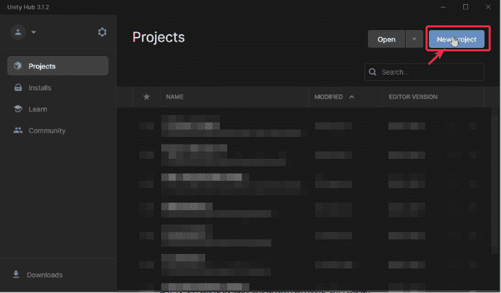

点击**新建项目**后，弹出如下窗口。要确保我们正在创建 3D 项目，请执行以下步骤:

1.  从模板中选择 **3D**
2.  将**项目名称**从**我的项目**更新为 **VR 360 公寓**
3.  点击**创建项目**按钮

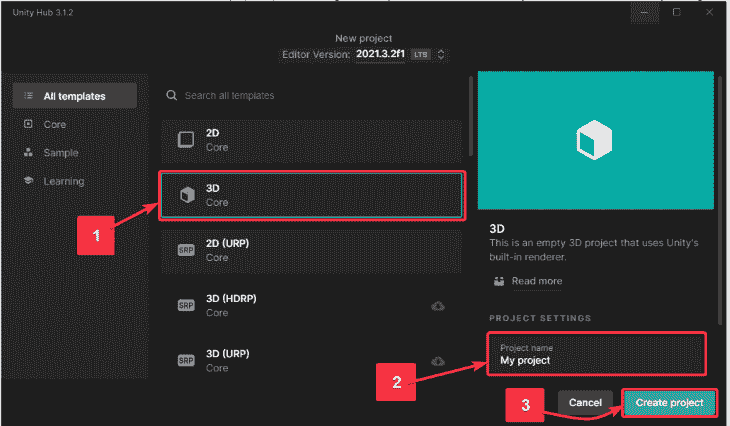

该项目将需要几分钟时间在 Unity 中打开。

项目开启后，前往 Unity 资产商店获取[公寓套件](https://assetstore.unity.com/packages/3d/props/apartment-kit-124055#description)资产。你会看到**添加到我的资产**按钮，而不是在 Unity 中打开**按钮(在下图中)。点击**添加到我的资产**按钮后，您还会看到**在 Unity 中打开**按钮。**

当**在 Unity 中打开按钮**出现时，点击它。

这是你将会看到的👇：

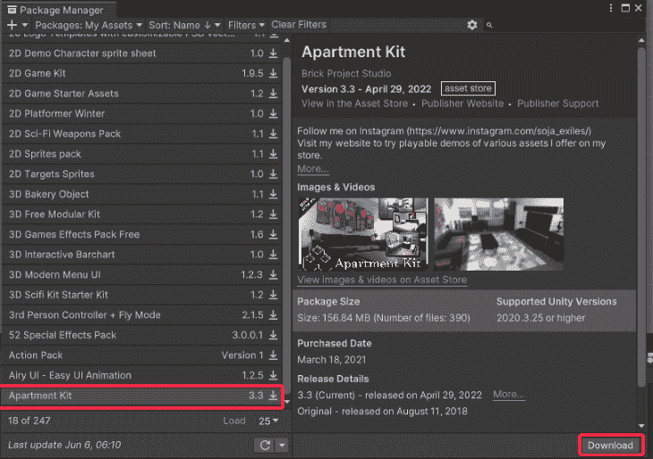

这个窗口称为包管理器。在左侧，您将看到您从 Unity 资产商店购买的所有资产。在右边，您会看到该资产的描述。很方便，不是吗？

点击**下载**。一旦资产下载完毕，点击**导入**。

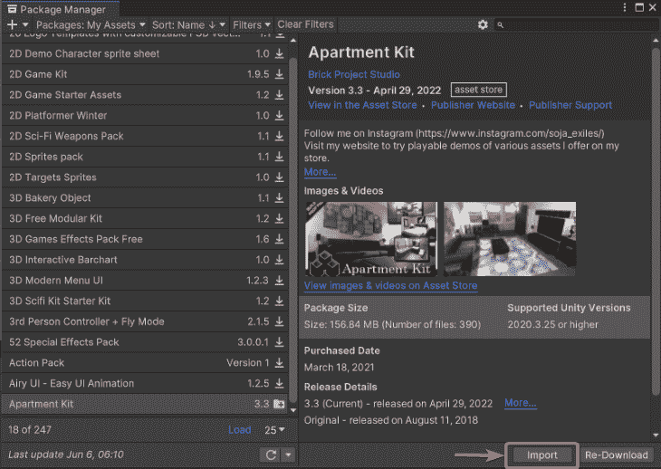

点击导入后，如果出现警告，只需点击**安装/升级**按钮。之后，您会看到这个弹出窗口:

*注意，很多时候，当您导入如上所述的第三方资产时，您不需要导入项目中该资产的所有文件。这就是为什么 Unity 给了你为你的项目选择特定文件的选项，这样你就不会用不必要的东西膨胀你的项目。*

出于本教程的目的，确保检查了所有文件，然后点击 **Import** 。

资产导入后，您会在左下角的项目面板中的**资产**下看到一个名为 **Brick Project Studio** 的新文件夹。这意味着您已经成功下载了公寓套件资产。🎉

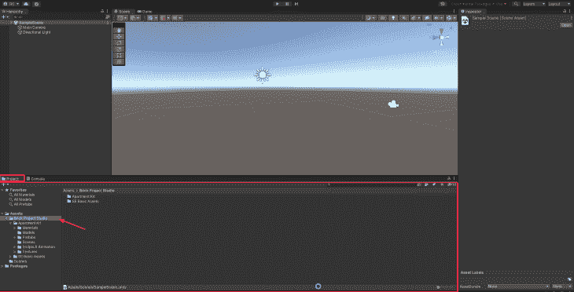

💡如果“资源”面板看起来有些不同，您可以通过左右拖动小开关来更改视图(如下所示)。该开关位于底部右侧。

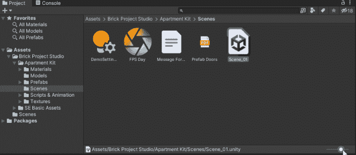

现在点击位于**资产** > **砖头项目工作室** > **公寓套件**下的**场景**文件夹。现在双击打开 **Scene_01.unity** 文件。

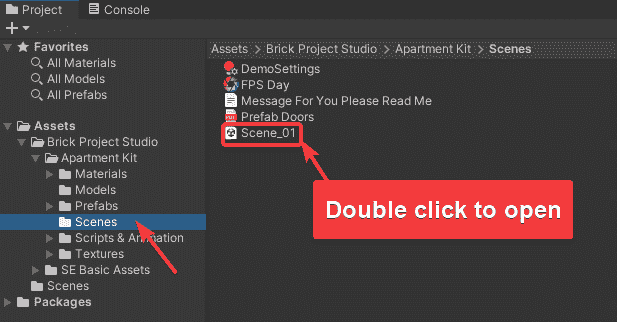

这是您将在场景面板中看到的内容:

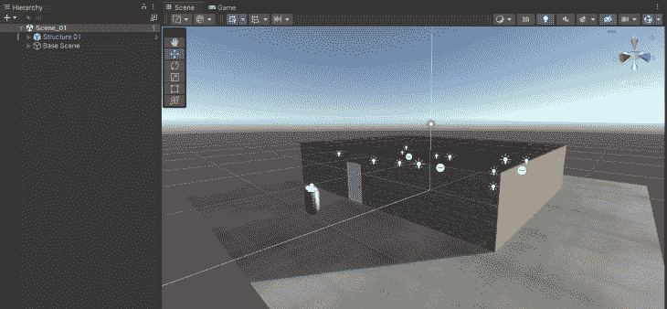

试着放大来看清楚你的公寓:

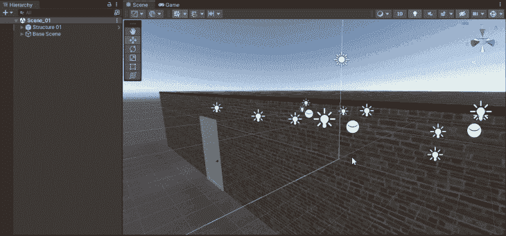

在**场景层次**窗口中，展开**基础场景**游戏对象。

选择**第一人称玩家**。重新定位此游戏对象，使其位于公寓内。下面是一个快速演示:

我们将第一人称玩家放置在公寓内，以便相机对象(第一人称玩家游戏对象的子对象)也放置在公寓内。我们将在本文后面的步骤中使用这个摄像机。

请确保该相机对象被标记为**主相机**。以下是您如何从“检查器”面板中执行此操作:

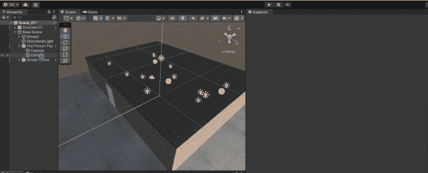

此外，从检查器面板中取消选中相机游戏对象的**鼠标外观**脚本组件。

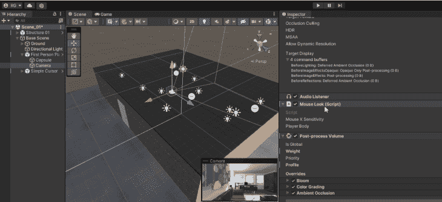

唷！现在公寓建好了。

我们现在要做的就是录一段公寓的 360 VR 视频。

我们走吧。

## 录制 Unity 中任意场景的 360 VR 视频

第一步:进入**窗口** > **包管理器**

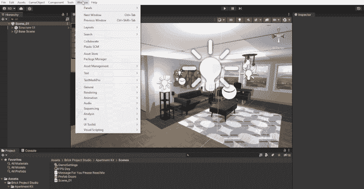

第二步:切换到 **Unity Registry** 而不是**我的资产**

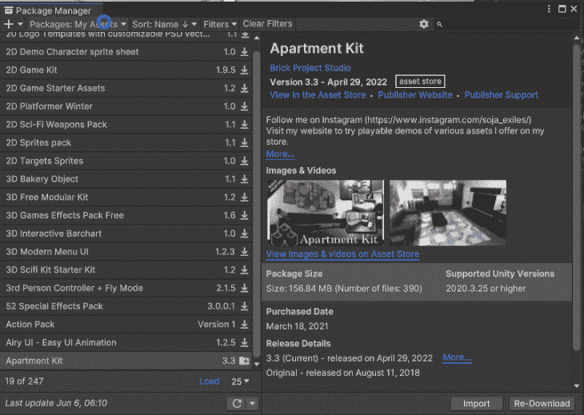

第三步:安装 Unity Technologies 的**记录仪**

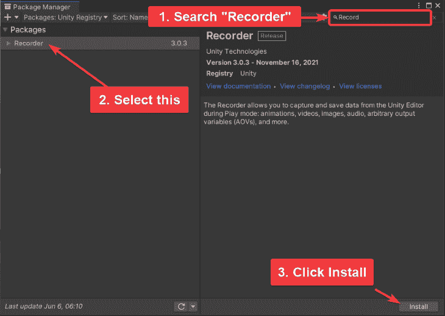

第四步:进入**窗口** > **通用** > **记录仪** > **记录仪窗口**

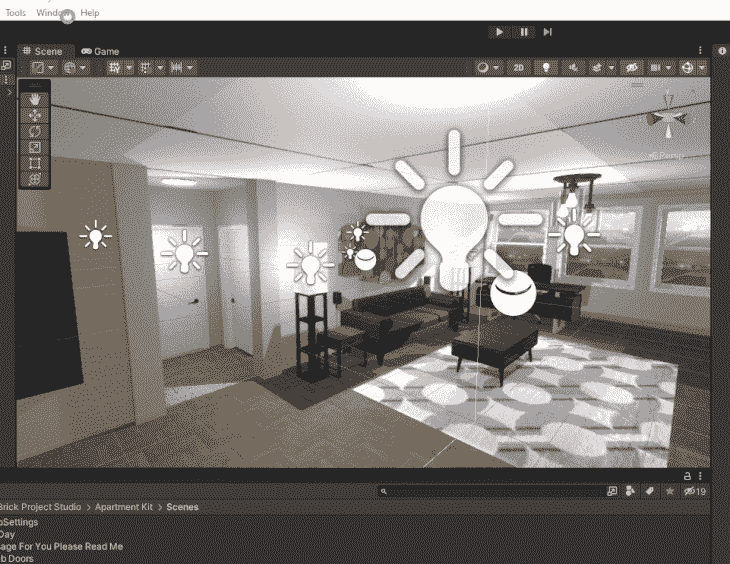

第五步:**添加录像机** > **电影**

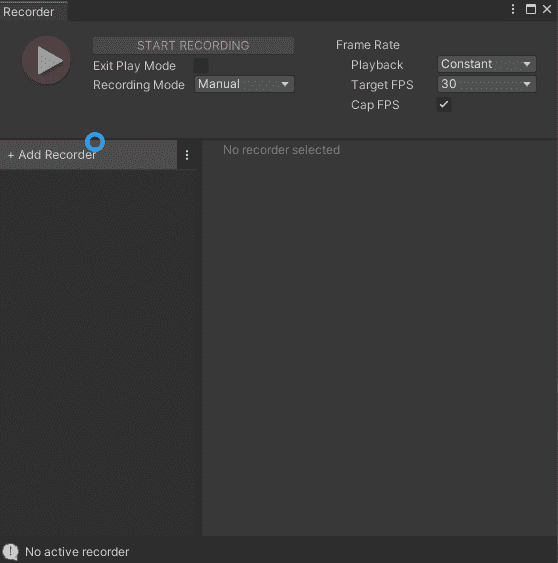

第六步:在**电影设置**中，保留以下设置(下图中标注)。

1.  将**源**设置为**360°视角**
2.  将**摄像头**设置为**主摄像头**
3.  设定**输出尺寸**宽度= 4096 &高度= 2048
4.  设置**立方体贴图尺寸**宽度= 2048
5.  取消选择立体声中的**录音**
6.  包括或排除音频(个人偏好。我排除它，因为我们在这个项目中没有任何声音效果)
7.  将**输出文件** > **文件名**设置为“公寓 360 视频”
8.  选择**输出文件** > **路径**。默认路径将在项目本身内部创建一个名为**录音**的文件夹。如果需要，您可以通过点按右侧的三个点图标，将其设定为电脑上的自定目的位置

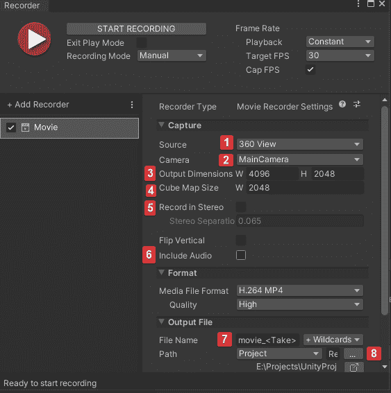

保持这个**记录器**窗口打开。我们将在接下来的两步中需要它。

第七步:点击 Unity 编辑器中的播放按钮。

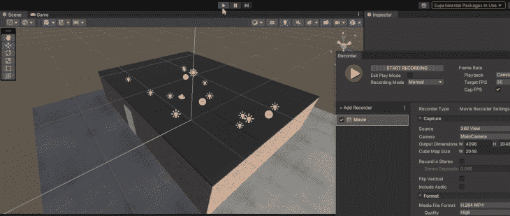

第八步:在播放模式下，点击记录器面板中的**开始记录**。

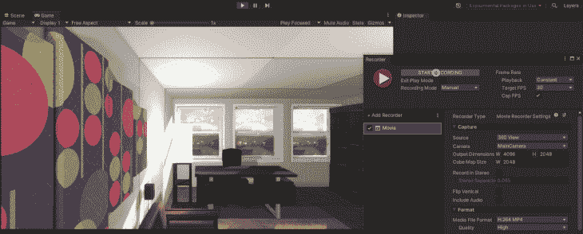

第九步:大约 30 秒后停止记录。您可以根据需要录制更长的视频。然后进入你的项目文件夹>**录像**。你会发现一个名为“公寓 360 Video.mp4”的文件

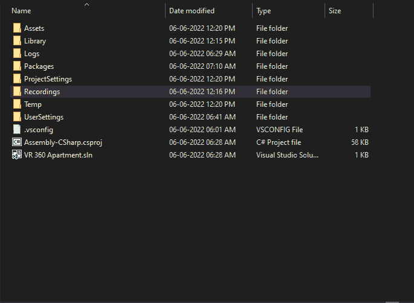

尝试在 VLC Media Player 等任何视频播放器中播放上述视频。会显得有点失真。这是意料之中的行为。发生这种情况是因为视频中没有任何关于 360 支持能力的数据。要添加这种 360 度支持，你必须使用谷歌的工具注入数据，或者更确切地说是“元数据”。

让我们看看如何安装谷歌的空间媒体工具，然后将 360 元数据注入 Video.mp4 公寓 360。

步骤 1:从他们的[官方存储库](https://github.com/google/spatial-media/releases)下载空间媒体元数据。向下滚动一点，直到你在他们的发布页面看到这个**资产**部分。获得“360。Video.Metadata.Tool.win.zip "文件。

步骤 2:提取计算机上任意位置的压缩文件夹，然后运行空间媒体元数据 Injector.exe 文件。您将看到这个弹出窗口。

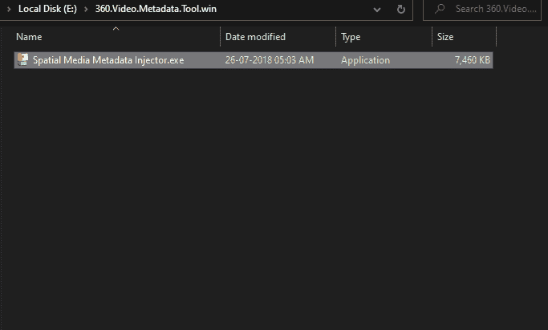

第三步:点击**打开**。选择你的公寓 360 Video.mp4 文件然后点击**打开**。

第四步:最后，点击**注入元数据**。这样会创建一个名为公寓 360 Video_injected.mp4 的文件，就这样。

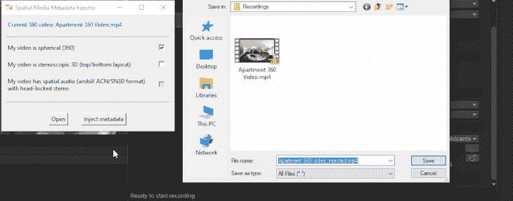

现在，这个视频可以很容易地上传到 YouTube，或者你甚至可以尝试在 VLC 媒体播放器上播放它。您可以通过按住鼠标左键并四处移动来平移 360°视频。

在 YouTube 视频播放器中尝试一下:

 [https://www.youtube.com/embed/RLyHk9dCQgg?version=3&rel=1&showsearch=0&showinfo=1&iv_load_policy=1&fs=1&hl=en-US&autohide=2&wmode=transparent](https://www.youtube.com/embed/RLyHk9dCQgg?version=3&rel=1&showsearch=0&showinfo=1&iv_load_policy=1&fs=1&hl=en-US&autohide=2&wmode=transparent)

视频

## 结论

你可以在这里获得[最终项目。](https://github.com/knightcube/vr-360-apartment-tutorial)

请随意使用 Unity 资产商店中的其他资产，并在 Unity 中创建您自己的 360 视频。您甚至可以使用不同的资源创建自己的环境，按照自己的意愿进行排列，然后录制 360 视频。是不是很神奇？🙂

如果你正在探索 AR 和 VR，请获得我的 [100+ AR/VR 资源包](https://knightcube.gumroad.com/arvr-resources)，节省数千小时的 AR/VR 研究时间。或者[在这里看看我的其他作品](https://linktr.ee/knightcube)。

## 使用 [LogRocket](https://lp.logrocket.com/blg/signup) 消除传统错误报告的干扰

[LogRocket](https://lp.logrocket.com/blg/signup) 是一个数字体验分析解决方案，它可以保护您免受数百个假阳性错误警报的影响，只针对几个真正重要的项目。LogRocket 会告诉您应用程序中实际影响用户的最具影响力的 bug 和 UX 问题。

然后，使用具有深层技术遥测的会话重放来确切地查看用户看到了什么以及是什么导致了问题，就像你在他们身后看一样。

LogRocket 自动聚合客户端错误、JS 异常、前端性能指标和用户交互。然后 LogRocket 使用机器学习来告诉你哪些问题正在影响大多数用户，并提供你需要修复它的上下文。

关注重要的 bug—[今天就试试 LogRocket】。](https://lp.logrocket.com/blg/signup-issue-free)