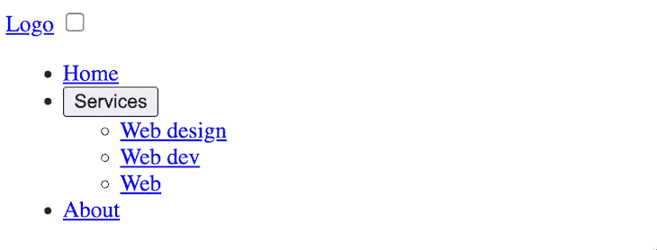
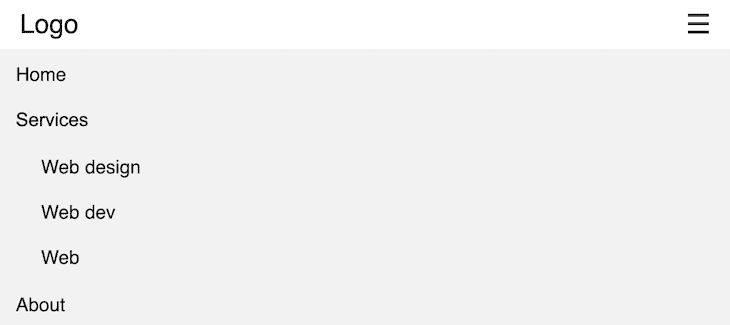
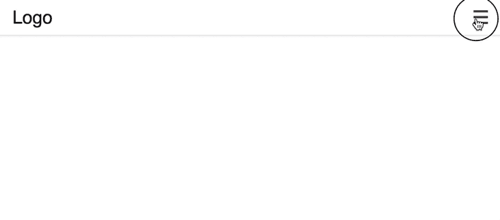
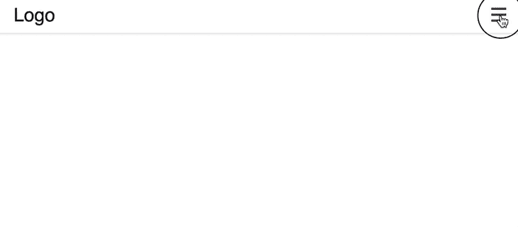
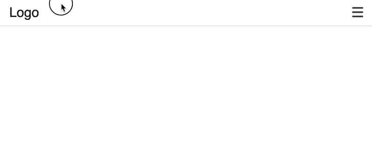
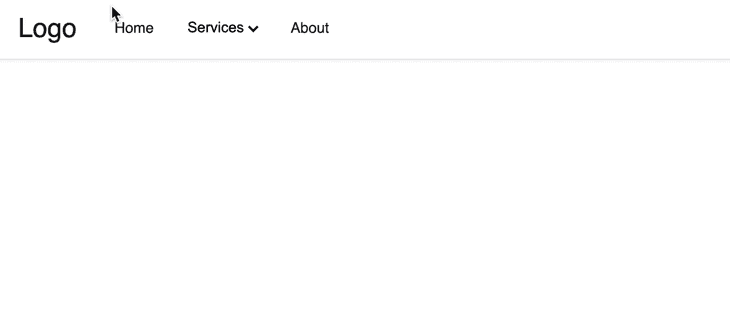

# 用 CSS 制作下拉菜单

> 原文：<https://blog.logrocket.com/making-dropdown-menus-css/>

下拉菜单使得用户可以很容易地浏览网络应用程序和网站。有了 CSS，我们可以为键盘和鼠标用户创建一个惊人的、反应灵敏的、可访问的下拉菜单。

本课中的 CSS 下拉方法使用:

1.  激活下拉列表项的`:focus-within`伪类
2.  在较小的屏幕上切换主下拉菜单的输入框
3.  语义 HTML 元素和 ARIA 属性来帮助屏幕阅读器

虽然这些技术不需要 JavaScript，但是您可以用 JavaScript 改进它们的实现，尤其是对于屏幕阅读器用户。

我们将在本课中讲述以下内容:

## 用 CSS 项目预览我们的下拉菜单

在本课结束时，我们将有一个 CSS 响应下拉菜单，如下所示:

参见 [CodePen](https://codepen.io) 上 Ibadehin Mojeed([@ ibas logic](https://codepen.io/ibaslogic))
的带 CSS 的 Pen [下拉菜单。](https://codepen.io/ibaslogic/pen/dyeZeGL)

可以和项目互动，之后就可以开始了！

用 CSS 构建一个可访问的下拉菜单首先要使用语义 HTML5 标记，并构建菜单来引导用户到达目的地。

下面的代码设置了一些简单的导航，有三个主菜单项— `Home`、`Services`和`About`。`Services`项包含一个下拉菜单，其中有三个嵌套的`ul`子菜单项:

```
<header>
  <div class="header-content">

    <a href="#" class="logo">Logo</a>

    <input type="checkbox" id="hamburger">
    <label for="hamburger"><span></span></label>

    <nav>
      <ul class="menus">
        <li><a href="#">Home</a></li>
        <li>
          <button type="button">Services</button>
          <ul class="dropdown">
            <li><a href="#">Web design</a></li>
            <li><a href="#">Web dev</a></li>
            <li><a href="#">Web</a></li>
          </ul>
        </li>
        <li><a href="#">About</a></li>
      </ul>
    </nav>
  </div>
</header>

```

通过使用无序列表项，屏幕阅读器将知道导航中有多少链接。输出应该如下所示:



代码中包含的复选框(如图所示)将用于在较小的屏幕上切换主下拉菜单。

我们将从设计较小屏幕的导航开始。在 CSS 文件中，我们将添加以下样式:

```
* {
  margin: 0;
  padding: 0;
  box-sizing: border-box;
}

body {
  font-family: sans-serif;
}

header {
  position: relative;
  box-shadow: 0 1px 3px 0 rgba(0, 0, 0, 0.07), 0 1px 2px 0 rgba(0, 0, 0, 0.05);
}

.header-content {
  align-items: center;
  max-width: 1200px;
  margin: 0 auto;
  padding: 10px 20px;
  color: #212529;
}

.logo {
  text-decoration: none;
  font-size: 25px;
  color: inherit;
  margin-right: 20px;
}

label {
  padding: 23px 20px;
  position: absolute;
  cursor: pointer;
  right: 0;
  top: 0;
}

input[type="checkbox"] {
  opacity: 0;
  position: absolute;
  right: 0;
}

label span {
  width: 20px;
  height: 3px;
  display: block;
  background: #4f3e3e;
  position: relative;
}

label span::after, label span::before {
  content: "";
  position: absolute;
  display: block;
  background: inherit;
  width: inherit;
  height: inherit;
}

label span::before{
  top: 8px;
}

label span::after {
  bottom: 8px;
}

label::before {
  position: absolute;
  content: "";
  width: 58px;
  height: 49px;
  top: 0;
  right: 0;
}

input[type="checkbox"]:focus + label::before {
  box-shadow: 0 0 20px black;
}

ul {
  background: #f2f2f2;
}

ul li {
   list-style: none;
   font-size: 18px;
}

ul li button {
    font-size: inherit;
    border: none;
    background-color: transparent;
    cursor: pointer;
    width: 100%;
}

ul li a {
   display: block;
   color: inherit;
   text-decoration: none;
}

ul li a, ul li button {
  padding: 0.7rem 1rem;
  text-align: left;
}

.menus {
  position: absolute;
  top: 3.2rem;
  left: 0;
  right: 0;
}

.dropdown {
  padding: 2px 1.5rem;
}

```

现在我们应该有一个如下所示的下拉菜单:



让我们在下一节讨论代码。

### CSS 中发生了什么？

使用`.menus`类选择器上的 CSS `position: absolute;`，我们放置了相对于标题栏的导航下拉菜单，如上图所示。

之后，我们使用`::before`和`::after`伪类将 input checkbox 转换成自定义的 hamburger 菜单，以便在较小的屏幕上激活下拉菜单。

请注意，我们使用了`opacity: 0;`来隐藏输入复选框，而不是`display: none;`属性:

```
input[type="checkbox"] {
  opacity: 0;
  /* ... */
}

```

同时，使用下面的代码，当键盘用户通过 tab 键导航时，汉堡包图标可以接收焦点:

```
input[type="checkbox"]:focus + label::before {
  box-shadow: 0 0 20px black;
}

```

## 切换下拉块

允许用户切换下拉菜单可以极大地增强 UX——尤其是在较小的移动屏幕上，总是可见的菜单会遮住大部分或全部视口。

我们将首先使用 CSS `visibility`属性隐藏下拉列表:

```
.menus {
  /* ... */
  /* hide dropdown on small screens */
  visibility: hidden;
}

```

然后，点击汉堡时切换下拉菜单:

```
/* toggle main dropdown */

input[type="checkbox"]:checked ~ nav > ul {
  visibility: visible;
}

```

上面的 CSS 规则针对的是 dropdown `ul` dropdown，它是 input checkbox 后面的`nav`元素的直接子元素。行为应该是这样的:



## 使用`:focus-within`伪类

当`Services`菜单项获得焦点或被点击时，我们将使用 CSS `:focus-within`来激活`Services`下拉菜单。

让我们更新`.dropdown`类选择器来隐藏`Services`下拉项目:

```
.dropdown {
  /* ... */
  height: 0;
  overflow: hidden;
}

```

然后，添加此规则以激活下拉列表:

```
li:focus-within .dropdown {
  height: 135px;
}

```

如果父元素`li`被聚焦，上面的 CSS 规则匹配下拉列表。换句话说，如果我们点击`Services`项目或通过 tab 键聚焦在它上面，子菜单将会显示。

### 添加下拉指示器

我们将在`Services`项上添加一个下拉箭头，表示存在一个下拉菜单。让我们更新`Services`项，以包含一个具有`arrow`类名的 span 元素:

```
<li>
  <button type="button">Services <span class="arrow"></span></button>
  <ul class="dropdown">
    <!-- ... -->
  </ul>
</li>

```

在 CSS 中，我们将为类选择器添加一个样式规则:

```
.arrow {
  width: 0.5em;
  height: 0.5em;
  display: inline-block;
  vertical-align: middle;
  border-left: 0.15em solid currentColor;
  border-bottom: 0.15em solid currentColor;
  transform: rotate(-45deg);
  margin-left: 0.38em;
  margin-top: -0.25em;
}

```

如果我们保存，我们应该将箭头放在`Services`菜单项旁边，就像这样:


为了在下拉菜单打开时向上旋转箭头，我们将添加以下 CSS 规则:

```
li:focus-within > button > .arrow {
  transform: rotate(-225deg);
  margin-top: 4px;
}

```

## 实现向下拉菜单的过渡

我们将为用户打开或关闭下拉菜单时添加平滑过渡效果。从主下拉菜单开始，我们将更新`.menus`以包含`transform`和`transition` CSS 属性:

```
.menus {
  /* ... */
  /* smooth transitioning */
  transform: translateY(-1em);
  transition: transform ease 0.2s;
}

```

然后，当下拉菜单处于活动状态时，我们将使用`[transform](https://blog.logrocket.com/deep-dive-css-individual-transform-properties/)` [CSS 属性](https://blog.logrocket.com/deep-dive-css-individual-transform-properties/)将下拉菜单移回其原始位置:

```
input[type="checkbox"]:checked ~ nav > ul {
  /* ... */
  transform: translateY(0);
}

```

接下来，我们将向`Services`下拉菜单及其箭头指示器添加一个过渡。让我们更新`.dropdown`来转换`height`属性，如下所示:

```
.dropdown {
  /* ... */
  transition: height ease 0.2s;
}

```

然后，对于箭头，我们将转换`transform`属性，因此我们有以下内容:

```
.arrow {
  /* ... */
  transition: transform 100ms ease-in-out;
}

```

如果我们保存 CSS，下拉列表应该如下所示:



向下拉菜单添加 ARIA 属性将有助于屏幕阅读器向视障用户传达预期的行为和目的。

我们将为交互元素添加一个`aria-label`属性，这样屏幕阅读器软件就可以在浏览下拉菜单时宣布控件的用途。同时，`aria-haspopup`属性将通知屏幕阅读器有一个弹出窗口。

属性将把控制元素映射到扩展的小部件。我们将把扩展小部件的`id`设置为控制元素的`aria-controls`属性的值。

最后，`aria-expanded`将告诉屏幕阅读器一个下拉菜单目前是否隐藏。它需要根据下拉菜单的状态在`true`或`false`之间切换。这是我们可以[用 JavaScript](https://blog.logrocket.com/building-accessible-menubar-component-react/) 提高下拉菜单可访问性的一个地方。

使用我们的 CSS 实现，当有视觉障碍的用户将焦点移到下拉列表项时，`:focus-within`伪类将立即打开下拉列表。为此，通过将布尔值`true`分配给`aria-expanded`，屏幕阅读器的软件将正确解释下拉小部件。

我们可以安装 [Chrome 扩展屏幕阅读器](https://chrome.google.com/webstore/detail/screen-reader/kgejglhpjiefppelpmljglcjbhoiplfn)观察解读。

让我们更新 HTML 标记以包含 ARIA 属性:

```
<header>
 <div class="header-content">
  <!--... -->
  <input type="checkbox" id="hamburger" aria-label="menu button">
  <label for="hamburger"><span></span></label>

  <nav aria-label="main navigation">
   <ul class="menus">
    <!-- ...-->
    <li>
     <button 
      type="button" 
      aria-haspopup="true" 
      aria-expanded="true" 
      aria-controls="dropdown1"
     >
      Services<span class="arrow"></span>  
     </button>
     <ul class="dropdown" id="dropdown1">
      <!--... -->
     </ul>
    </li>
    <!--... -->
   </ul>
  </nav>
 </div>
</header>

```

如果我们使用键盘来导航下拉菜单，行为将如下所示:



正如我们所见，一旦我们将焦点移到`Services`项，下拉菜单会立即打开。因此，屏幕阅读器将正确地宣布扩展。

我们将使用 CSS 媒体查询，并定义屏幕宽度为`640px`及以上的样式规则:

```
/* MEDIA QUERIES */
@media (min-width: 640px) {

 .header-content {
  display: flex;
 }

 .menus {
  position: static;
  visibility: visible;
  background: #fff;
  display: flex;
  transform: initial;
 }

 label, input[type="checkbox"] {
  display: none;
 }

 ul li {
  position: relative;
  font-size: 14px;
 }

 ul li a:hover,
 ul li button:hover {
  background-color: #f2f2f2;
 }

 .dropdown {
  position: absolute;
  right: 0;
  left: auto;
  box-shadow: 0 10px 15px -3px rgba(46, 41, 51, 0.08),
  0 4px 6px -2px rgba(71, 63, 79, 0.16);
  z-index: 99;
  min-width: 10rem;
  padding: 0;
  background-color: #fff;
  border-radius: 0 0 0.5rem 0.5rem; 
 }

 ul li:hover .dropdown {
  height: 135px;
 }

 ul li:hover > button > .arrow {
  transform: rotate(-225deg);
  margin-top: 4px;
 }
}

```

在上面的 CSS 中，我们首先在标题内容中添加了一个`display: flex;`来定位徽标和并排的导航菜单。之后，我们在导航内容上添加了一个`position: static;`声明，以覆盖我们在移动设计中使用的绝对定位，并将导航项目放在页面的正常流程中。

同样重要的是要注意我们是如何用`:hover`伪类包含了在悬停时激活下拉菜单的规则。结果现在看起来是这样的:



## Safari 浏览器的辅助功能支持

默认情况下，在 Safari 中使用 tab 键导航是禁用的。我们可以通过打开 Safari 偏好设置和高级设置来启用它。然后，在“可访问性”部分，我们可以选中标记为“按 Tab 突出显示网页上的每个项目”的复选框

我们可能还会注意到，在 Safari 中点击`Services`菜单项并不会显示下拉菜单。Safari 上的一个元素如果有一个`tabindex="0"`就会得到一个`:focus-within`。因此，我们将更新`Services`的`li`，使其包含一个`tabindex`:

```
<li tabindex="0">
  <button 
    <!--  ...   -->
  >
    Services<span class="arrow"></span>   
  </button>
  <ul class="dropdown" id="dropdown1">
    <!--  ... -->
  </ul>
</li>

```

下拉菜单现在应该可以正常工作了。

## 结论

用 CSS 创建一个奇妙的下拉菜单是可能的，如本课所示。键盘、鼠标和屏幕阅读器用户可以访问下拉列表。我们可以使用像 JavaScript 这样的脚本语言进一步改进 CSS 下拉菜单。

下拉菜单是现代应用程序中常见的设计模式。要了解更多，你可以看看在 React 中构建多级下拉菜单的[。](https://blog.logrocket.com/how-create-multilevel-dropdown-menu-react/)

如果你有问题或贡献，请在评论区分享你的想法。最后，努力在网络上分享这个教训。

## 你的前端是否占用了用户的 CPU？

随着 web 前端变得越来越复杂，资源贪婪的特性对浏览器的要求越来越高。如果您对监控和跟踪生产环境中所有用户的客户端 CPU 使用、内存使用等感兴趣，

[try LogRocket](https://lp.logrocket.com/blg/css-signup)

.

[](https://lp.logrocket.com/blg/css-signup)[https://logrocket.com/signup/](https://lp.logrocket.com/blg/css-signup)

LogRocket 就像是网络和移动应用的 DVR，记录你的网络应用或网站上发生的一切。您可以汇总和报告关键的前端性能指标，重放用户会话和应用程序状态，记录网络请求，并自动显示所有错误，而不是猜测问题发生的原因。

现代化您调试 web 和移动应用的方式— [开始免费监控](https://lp.logrocket.com/blg/css-signup)。