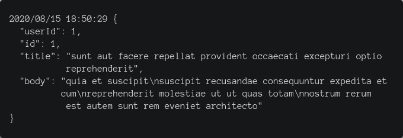

# 在 Go - LogRocket 博客中发出 HTTP 请求

> 原文：<https://blog.logrocket.com/making-http-requests-in-go/>

HTTP 请求是整个 web 的一个非常基础的部分。它们用于访问服务器(可能是远程的)上托管的资源。

HTTP 是超文本传输协议的缩写，超文本传输协议是一种确保客户端和服务器之间数据传输的通信协议。HTTP 客户端-服务器交互的一个完美实例是当您打开浏览器并键入 URL 时。您的浏览器充当客户端，从服务器获取资源，然后显示出来。

在 web 开发中，我们需要获取资源的情况非常普遍。您可能正在开发一个天气应用程序，需要从一个 API 获取天气数据。在这种情况下，在应用程序中使用浏览器作为客户端将不再可能。因此，您必须在应用程序中设置一个 HTTP 客户端来处理这些请求。

大多数编程语言都有各种各样的结构来设置 HTTP 客户端以发出请求。在接下来的几节中，我们将采取实践的方法来探索如何用 Golang 或 Go 进行 HTTP 请求，因为在本文的其余部分我将参考这种语言。

## 先决条件

要阅读本文，您需要:

## 在 Go 中发出 HTTP 请求

### 获取请求

我们将发出的第一个请求是 GET 请求。HTTP GET 方法用于从指定的源或服务器请求数据。GET 方法主要在需要获取数据时使用。

为了清楚起见，需要注意的是，本文中的 HTTP 方法总是大写的。

对于我们的例子，我们将使用 GET 方法从[https://jsonplaceholder.typicode.com/posts](https://jsonplaceholder.typicode.com/posts)获取一些示例 JSON 数据。

用 Go 发出 HTTP 请求的第一步是从标准库中导入`net/http`包。这个包为我们提供了轻松进行 HTTP 请求所需的所有工具。我们可以通过将下面几行代码添加到我们创建的`main.go`文件中来导入`net/http`包和我们需要的其他包:

```
import (
   "io/ioutil"
   "log"
   "net/http"
)
```

我们导入的`net/http`包有一个 GET 函数，用于发出 Get 请求。Get 函数接收一个 URL，并返回一个指向结构的指针类型的响应和一个错误。当错误为`nil`时，返回的响应将包含响应体，反之亦然:

```
resp, err := http.Get("https://jsonplaceholder.typicode.com/posts/1")
if err != nil {
   log.Fatalln(err)
}
```

为了发出请求，我们调用 Get 函数，传入一个 URL 字符串(【https://jsonplaceholder.typicode.com/posts】)如上所示。调用该函数返回的值存储在两个变量中，通常称为 resp 和 err。尽管变量 resp 包含了我们的响应，但是如果我们把它打印出来，我们会得到一堆不一致的数据，包括请求的头和属性。为了获得我们感兴趣的响应，我们必须访问 response 结构上的`Body`属性，并在最终将它输出到终端之前读取它。我们可以使用`ioutil.ReadMe`函数读取响应体。

类似于`Get`函数，`ioutil.ReadMe`函数返回一个主体和一个错误。需要注意的是，响应`Body`应该在我们读完之后关闭，以防止内存泄漏。

在函数末尾执行`resp.Body.Close()`的 defer 关键字用于关闭响应体。然后，我们可以打印出终端响应的值。作为优秀的程序员，处理可能的错误是很重要的，因此我们使用 if 语句来检查任何错误，如果存在错误，则记录错误:

```
package main

import (
   "io/ioutil"
   "log"
   "net/http"
)

func main() {
   resp, err := http.Get("https://jsonplaceholder.typicode.com/posts")
   if err != nil {
      log.Fatalln(err)
   }
//We Read the response body on the line below.
   body, err := ioutil.ReadAll(resp.Body)
   if err != nil {
      log.Fatalln(err)
   }
//Convert the body to type string
   sb := string(body)
   log.Printf(sb)
}
```

此时，我们已经设置好了，可以执行包含我们代码的文件了。如果一切顺利，您会注意到一些类似下图的 JSON 数据被打印到终端上:



恭喜你，你已经用 Go 发出了你的第一个 HTTP 请求。现在我们已经看到了如何使用 HTTP GET 方法从服务器获取资源，接下来我们将看看如何向服务器发送资源。

### 发布请求

HTTP POST 方法用于发出通常包含主体的请求。它用于向服务器发送数据，发送的数据通常用于创建或更新资源。

使用 POST 请求的一个明显例子是，当用户试图创建一个社交媒体帐户时，用户需要提供他们的数据(姓名、电子邮件和密码)。然后解析这些数据，并作为 POST 请求发送到服务器，服务器随后创建并保存用户。就像上面看到的 GET 方法一样，Go 的`net/http`包也提供了通过 Post 函数发出 POST 请求的功能。Post 函数有三个参数。

1.  服务器的 URL 地址
2.  字符串形式的正文的内容类型
3.  使用类型`io.Reader`的 POST 方法发送的请求正文

Post 函数返回一个响应和一个错误。为了调用 Post 函数，我们必须将请求体转换为可接受的类型。对于这个例子，我们将向[https://postman-echo.com/post](https://postman-echo.com/post)发出一个 post 请求，并传入包含姓名和电子邮件的 JSON 数据。首先，我们将 JSON 数据转换为实现 Io 的类型。Post 函数期望的读者接口，这是一个双向步骤:

*   第一步是对我们的 Json 数据进行编码，以便它能够以字节格式返回数据，为此我们使用了 Go 的 JSON 包提供的 [Marshall 函数](https://golang.org/pkg/encoding/json/#Marshal)
*   接下来，我们将编码的 JSON 数据转换成由`io.Reader`接口实现的类型，我们简单地使用`NewBuffer`函数，将编码的 JSON 数据作为参数传入。`NewBuffer`函数返回一个 buffer 类型的值，然后我们可以将它传递给 Post 函数

```
postBody, _ := json.Marshal(map[string]string{
   "name":  "Toby",
   "email": "[email protected]",
})
responseBody := bytes.NewBuffer(postBody)
```

现在我们已经有了 Post 函数需要的所有参数，我们可以继续调用它，传入 https://postman-echo.com/post 的[作为 URL 字符串，传入 application/JSON 作为内容类型，传入由`NewBuffer`函数返回的请求体作为请求体。由`Post`函数返回的值被分配给 resp 和 err，分别代表响应和错误。处理完错误后，我们读取并打印响应体，就像我们在上一节中对 Get 函数所做的那样。此时，您的文件应该如下所示:](https://postman-echo.com/post)

```
import (
   "bytes"
   "encoding/json"
   "io/ioutil"
   "log"
   "net/http"
)

func main() {
//Encode the data
   postBody, _ := json.Marshal(map[string]string{
      "name":  "Toby",
      "email": "[email protected]",
   })
   responseBody := bytes.NewBuffer(postBody)
//Leverage Go's HTTP Post function to make request
   resp, err := http.Post("https://postman-echo.com/post", "application/json", responseBody)
//Handle Error
   if err != nil {
      log.Fatalf("An Error Occured %v", err)
   }
   defer resp.Body.Close()
//Read the response body
   body, err := ioutil.ReadAll(resp.Body)
   if err != nil {
      log.Fatalln(err)
   }
   sb := string(body)
   log.Printf(sb)
}

```

当文件被执行时，如果一切正常，我们应该将响应打印出来。很神奇，对吧？我们刚刚用 Go 使用`net/http`包发出了一个 post 请求，该包提供了使 HTTP 请求更容易的功能。在下一节中，我们将进行一个项目，帮助我们了解 HTTP 请求在现实生活中的应用。

## HTTP 请求在起作用

在本节中，我们将构建一个加密货币价格检查器 CLI 工具！本练习旨在让您看到 HTTP 请求的真实用例。我们正在构建的工具将检查用户在指定法定货币中指定的任何加密货币的价格。我们将使用 Nomics 提供的加密市值和定价数据来实时获取加密货币的价格！首先，创建所需的文件和文件夹以匹配下面的树结构:

```
├── model/
│   ├── crypto-model.go
├── client/
│   ├── crypto-client.go
└── main.go
```

*   加密客户端文件将存放从 API 获取加密货币数据的代码
*   加密模型文件包含了我们的应用程序所必需的几个实用函数
*   主文件是应用程序的中心引擎，它将合并应用程序的所有部分，使其发挥作用

在加密模型文件中，我们创建一个对从 API 接收的数据进行建模的结构，该结构仅包括我们需要/打算使用的特定数据。接下来，我们创建一个名为`TextOutput`的函数，它是一个属于我们上面创建的`Cryptoresponse`结构的接收器。`TextOutput`函数的目的是将从 API 获得的数据格式化为比 JSON(我们从服务器接收的)更容易阅读的纯文本。我们使用`fmt.Sprintf`函数来格式化数据:

```
package model

import (
   "fmt"
)

// Cryptoresponse is exported, it models the data we receive.
type Cryptoresponse []struct {
   Name              string    `json:"name"`
   Price             string    `json:"price"`
   Rank              string    `json:"rank"`
   High              string    `json:"high"`
   CirculatingSupply string    `json:"circulating_supply"`
}

//TextOutput is exported,it formats the data to plain text.
func (c Cryptoresponse) TextOutput() string {
p := fmt.Sprintf(
  "Name: %s\nPrice : %s\nRank: %s\nHigh: %s\nCirculatingSupply: %s\n",
  c[0].Name, c[0].Price, c[0].Rank, c[0].High, c[0].CirculatingSupply)
   return p
}
```

既然`crypto-model`文件已经准备好了，我们可以继续看与我们最相关的`crypto-client`文件。在`crypto-client`文件中，我们创建了一个`FetchCrypto`函数，它接受加密货币和法定货币的名称作为参数。

> 注意，我们将函数名的第一个字母大写，这是为了确保它被导出。

在`FetchCrypto`函数中，我们创建了一个名为 URL 的变量，该变量是由 [Nomics API](https://api.nomics.com/v1/) 提供的 URL 字符串和将被传递到我们的应用程序中的各种变量的串联。还记得我们的应用程序接受所需加密货币和首选法定货币的名称吗？这些是用于构建 URL 字符串的变量。我们的 URL 字符串应该是这样的。

```
URL := "...currencies/ticker?key=3990ec554a414b59dd85d29b2286dd85&interval=1d&ids="+crypto+"&convert="+fiat

```

设置好 URL 后，我们可以继续使用上面提到的 Get 函数来发出请求。Get 函数返回响应，我们优雅地处理错误。为了得到我们想要的数据，以我们想要的格式，我们必须解码它！为此，我们使用接收响应体的`Json.NewDecoder`函数和接收我们在`crypto-model`文件中创建的 cryptoresponse 类型变量的 decode 函数。最后，我们对解码后的数据调用`TextOutput`函数，使我们能够以纯文本的形式获得结果:

```
package client

import (
   "encoding/json"
   "fmt"
   "log"
   "net/http"

   "github.com/Path/to/model"
)

//Fetch is exported ...
func FetchCrypto(fiat string , crypto string) (string, error) {
//Build The URL string
   URL := "https://api.nomics.com/v1/currencies/ticker?key=3990ec554a414b59dd85d29b2286dd85&interval=1d&ids="+crypto+"&convert="+fiat
//We make HTTP request using the Get function
   resp, err := http.Get(URL)
   if err != nil {
      log.Fatal("ooopsss an error occurred, please try again")
   }
   defer resp.Body.Close()
//Create a variable of the same type as our model
   var cResp model.Cryptoresponse
//Decode the data
   if err := json.NewDecoder(resp.Body).Decode(&cResp); err != nil {
      log.Fatal("ooopsss! an error occurred, please try again")
   }
//Invoke the text output function & return it with nil as the error value
   return cResp.TextOutput(), nil
}

```

从上面的内容来看，这个应用程序正在很好地组合在一起。然而，如果您尝试运行上面的文件，您将会遇到一些错误，这是因为我们没有调用`FetchCrypto`函数，所以没有提供 fiat 和 crypto 参数的值。我们将把应用程序的各个部分放在我们创建的`main.go`文件中。由于我们的应用程序是一个命令行工具，用户必须通过终端传递数据，我们将使用 Go 的标志包来处理这个问题。

在主函数中，我们创建了两个变量`fiatcurrency`和`nameofcrypto`。这两个变量都调用`flag.string`函数，传入:

*   作为第一个参数的命令名称
*   作为第二个的回退值
*   关于如何使用命令作为第三个参数的信息

接下来，我们调用在`crypto-client`文件中定义的`FetchCrypto`函数，并传入`fiatcurrency`和`nameofcrypto`变量。然后我们可以打印对`FetchCrypto`的调用结果:

```
package main

import (
    "flag"
    "fmt"
    "log"

    "github.com/path/to/client"
)

func main() {
    fiatCurrency := flag.String(
      "fiat", "USD", "The name of the fiat currency you would like to know the price of your crypto in",
    )

    nameOfCrypto := flag.String(
      "crypto", "BTC", "Input the name of the CryptoCurrency you would like to know the price of",
    )
    flag.Parse()

    crypto, err := client.FetchCrypto(*fiatCurrency, *nameOfCrypto)
    if err != nil {
        log.Println(err)
      }

  fmt.Println(crypto)
}
```

此时，我们可以开始了，如果我们运行命令`go run main.go -fiat=EUR -crypto=ETH`，我们将得到类似下图的输出:


这表明我们的应用程序运行良好，非常棒。我们有一个使用 HTTP 协议从远程服务器获取数据的应用程序。

## 结论

在本文中，我们讨论了如何在 Go 中发出 HTTP 请求，并构建了一个 CLI 工具来检查加密货币的价格。我强烈推荐查看`net/http`包的[源代码](https://golang.org/src/net/http/client.go?s=16191:16251#L460)和[文档](https://golang.org/pkg/net/http/)，探索它提供的其他惊人功能。

## 使用 [LogRocket](https://lp.logrocket.com/blg/signup) 消除传统错误报告的干扰

[](https://lp.logrocket.com/blg/signup)

[LogRocket](https://lp.logrocket.com/blg/signup) 是一个数字体验分析解决方案，它可以保护您免受数百个假阳性错误警报的影响，只针对几个真正重要的项目。LogRocket 会告诉您应用程序中实际影响用户的最具影响力的 bug 和 UX 问题。

然后，使用具有深层技术遥测的会话重放来确切地查看用户看到了什么以及是什么导致了问题，就像你在他们身后看一样。

LogRocket 自动聚合客户端错误、JS 异常、前端性能指标和用户交互。然后 LogRocket 使用机器学习来告诉你哪些问题正在影响大多数用户，并提供你需要修复它的上下文。

关注重要的 bug—[今天就试试 LogRocket】。](https://lp.logrocket.com/blg/signup-issue-free)