# 在 Unity 中制造程序噪音

> 原文：<https://blog.logrocket.com/making-procedural-noise-unity/>

实现视觉多样性最常见的方法之一是使用程序噪声。由于程序噪声能够以较低的内存和人工成本添加复杂的细节，因此它对于计算机图形领域非常重要，并且在整个行业中广泛使用。

在本文中，我们讨论了在 Unity 中使用过程噪声的两种方法，以及如何使用它们来实现多种结果和成果。第一种是基于 [Unity Mathematics](https://docs.unity3d.com/Packages/com.unity.mathematics@1.0/manual/index.html) 包的处理程序噪声的代码方法。这种方法非常适合当你想要控制噪声参数，以及它们在应用程序中的结果，这些应用程序要么不是完全可视化的，要么会提供给其他算法，比如[预制产卵器](https://docs.unity3d.com/Manual/InstantiatingPrefabs.html)。

第二个是基于使用[着色器图形节点](https://docs.unity3d.com/Packages/com.unity.shadergraph@6.9/manual/Create-Node-Menu.html)来使用着色器中的程序噪声。这种方法更适合 Unity 用户，他们熟悉可视化编码，并且正在寻找使用自定义着色器的可视化结果。值得注意的是，这种方法需要使用[通用渲染管道或高清渲染管道](https://docs.unity3d.com/Manual/render-pipelines.html)来启用[着色器图形工具](https://docs.unity3d.com/Packages/com.unity.shadergraph@6.9/manual/index.html)。

## 程序噪音

程序噪声，或简称为噪声，已经在工业中被用于许多过程，包括 T2 云、波浪、动画等等。在计算机图形学中，噪声是一种随机的、无结构的模式，没有明显的结构。程序噪声描述了一个过程，在该过程中，给定一组输入，我们可以程序性地生成噪声模式。

请注意，噪声被描述为一种非结构化的模式，通常是为了寻找这些特征。这是因为类似模式的特性允许我们用它来传达细节和熟悉感，而不用呈现一个简单的设计。如前所述，云有着清晰的视觉特征，但仅仅盯着它们看并不能立刻清楚它们的形状是如何形成的。

处理噪声的最基本方法之一是[白噪声](https://www.taylorfrancis.com/books/mono/10.1201/9780203733813/white-noise-distribution-theory-hui-hsiung-kuo-mark-pinsky-richard-durrett):从一个范围内随机收集值，在这个范围内每个可能的值都有相等的出现机会。

用更通俗的术语来说，生成白噪声就像填写一个值列表，在这个列表中，我们为每个值扔一个骰子。来自骰子的所有值具有相同的概率，这意味着它们出现的机会均等。下图展示了 2D 白噪声图像的外观:

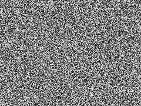

其高度不可预测的行为是白噪声的优点和缺点。这是有利的，因为它可以用非常低的清晰结构(或者根本没有清晰结构)快速地将变化添加到我们的过程中。例如，如果我们想要描绘尘埃或星星，白噪声是一个很好的候选对象。

但是，如果我们的目标是像前面提到的那样模拟类似噪声的模式，白噪声就是一个缺点。例如，它太混乱了，不像云。为此，我们求助于使用其他来源的噪音。

一般来说，我们不是直接使用噪声，而是使用术语噪声函数，它是产生噪声值的过程。白噪声函数可以写成:

```
float whiteNoiseFunction(float minimalValue, float maximalValue) {
    return Random.Range(minimalValue, maximalValue);
}

```

或者，对于生成 2D 点的类单位噪声函数:

```
Vector2 white2DNoiseFunction(float minimalValue, float maximalValue) {
    return new Vector2(Random.Range(minimalValue, maximalValue),
                                           Random.Range(minimalValue, maximalValue));
}

```

幸运的是，Unity 已经有了很多噪声函数的实现，我们可以用它们来生成噪声值。

## 单位默认噪声函数

首先，Unity 项目可以直接访问业内使用的最著名的噪声函数之一:[柏林噪声](https://docs.unity3d.com/ScriptReference/Mathf.PerlinNoise.html)函数。下面是一个柏林噪声的示例:

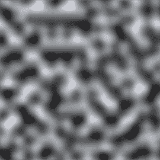

柏林噪声函数不会为其所有位置生成随机数。相反，它将空间分成单元，形成网格。在格网边缘生成随机数，并根据像元与最近边缘的接近程度对像元内的值进行插值。这就产生了波动模式，其中数值在空间中增加和减少。

Perlin Noise 函数的实现可以很容易地从 2D 扩展到 3D 等等(不管出于什么原因，您可能需要这样做)。

我们可以直接从 [Mathf](https://docs.unity3d.com/ScriptReference/Mathf.html) 库中访问 Unity 中的[柏林噪声函数。它有以下签名:](https://docs.unity3d.com/ScriptReference/Mathf.PerlinNoise.html)

```
public static float PerlinNoise(float x, float y);

```

由于柏林噪声函数是基于网格的，其单位实现没有传统的一维实现(1D)。然而，这可以通过管理所使用的输入来容易地实现。例如，[文档建议](https://docs.unity3d.com/ScriptReference/Mathf.PerlinNoise.html)简单地使用 0 作为参数之一是生成 1D 柏林噪声值的一种简单的替代方法。

由于默认情况下可以访问，Perlin Noise 函数的 Mathf 实现可能是 Unity 教程中最常见的噪声函数。不过更多的噪声函数实现可以通过导入[数学包](https://docs.unity3d.com/Packages/com.unity.mathematics@1.0/manual/index.html)在 Unity 中访问。

## 数学软件包中的单位噪声函数

Unity 的数学包包含了高效的矢量类型和数学函数，带有类似着色器的语法。在撰写本文时，数学库仍被认为是一项正在进行的工作，应该小心使用。

可以使用包管理器将包下载并导入到您的项目中。选择 **Unity Registry** 下的包选项，然后选择数学包，如下图所示:


数学噪声函数可作为基础[噪声类](https://docs.unity3d.com/Packages/com.unity.mathematics@0.0/api/Unity.Mathematics.noise.html)的方法。可用的噪声功能可分为[四大组](https://forum.unity.com/threads/an-overview-of-noise-functions-in-the-unity-mathematics-package.1098193/)，分别是:

*   蜂窝噪声函数:这些函数基于[蜂窝/沃利噪声函数](https://en.wikipedia.org/wiki/Worley_noise)。例如:`float2 cellular2x2 (float2 p)`
*   柏林噪声函数:这些是基于前面讨论的柏林噪声函数。例如:`float cnoise (float2 p)`
*   单工噪声函数:这些是与被称为[单工噪声](https://en.wikipedia.org/wiki/Simplex_noise)的柏林噪声相似的方法。例如:`float snoise (float2 v)`
*   额外的单工噪声函数:这些是在图书馆出现的单工噪声函数的扩展。例如:`float3 psrdnoise (float2 pos, float2 per, float rot)`

除了之前已经介绍过的 Perlin Noise 函数之外，让我们更好地看看这些其他函数以及它们在代码中的用法。但是，在此之前，理解我们如何转换和处理数学软件包和 Unity 默认变量类型所使用的不同数据类型是至关重要的。

## 数学数据类型

数学软件包使用 Unity 使用的常规数据类型之外的其他数据类型。比如不使用`[Vector2](https://docs.unity3d.com/ScriptReference/Vector2.html)`，而是使用`[float2](https://docs.unity3d.com/Packages/com.unity.mathematics@0.0/api/Unity.Mathematics.float2.html)`。它们之间的核心区别在于，数学数据类型是专门为[更好的性能](https://www.jacksondunstan.com/articles/5214)而设计的，并且如前所述，是为了[更好地匹配类似着色器的编程语言](https://forum.unity.com/threads/reasons-for-float2-float3-etc.523210/)。

虽然还不清楚 Unity 是否会完全淘汰旧的数据类型，但目前来看，使用这两种类型都是有效的(不一定推荐)，并且由于它们的数据结构相似，类型之间的转换很简单。

例如，将一个`float2`转换成一个`Vector2`就像下面这样简单:

```
float2 f2 = new float2(2.0f, 3.0f);
Vector2 v2 = (Vector2) f2;

```

### 细胞噪声函数

如前所述，这些函数基于[沃利噪声函数](https://dl.acm.org/doi/10.1145/237170.237267)，后者本身基于柏林噪声函数。简单来说，沃利噪声函数在一个表面上产生[随机点](https://thebookofshaders.com/12/)。然后，它通过向最接近它的随机点插值来计算该表面上各个点的值。

由于这一过程，产生的图像类似于细胞(因此得名)结构。下图提供了一个使用 Worley 噪波函数生成的 2D 图像的示例。

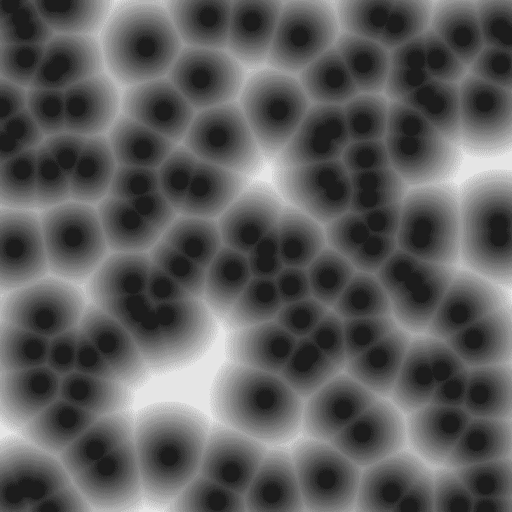

该包的细胞功能有许多变化，从维度(2D 或 3D)和效率(为了速度，精度较低)。`cellular` [函数](https://github.com/Unity-Technologies/Unity.Mathematics/blob/master/src/Unity.Mathematics/Noise/cellular2D.cs)接收一个`float2`作为 x 和 y 位置的参数，并返回相应的噪声值。这个函数的性能更友好的版本是`cellular2x2` [函数](https://github.com/Unity-Technologies/Unity.Mathematics/blob/master/src/Unity.Mathematics/Noise/cellular2x2.cs)，它具有相同的签名和用法。

从基本的测试比较来看，`cellular2x2`的执行速度比`cellular`快三倍。

*注意，测试是通过使用相同的 x 和 y 参数执行每个噪声函数 100.000 并测量花费的总时间来完成的。*

### 单纯形噪声函数

单纯形噪声函数最初是由 Ken Perlin 开发的，他也是最初 Perlin 噪声函数的开发者。它在计算上[比 Perlon Noise](https://weber.itn.liu.se/~stegu/simplexnoise/simplexnoise.pdf) 函数更有效，并且更适合于更多的维度(比如 4 和 5 维)。此外，与原始函数相比，单纯形噪声函数具有不太明显的视觉伪像。

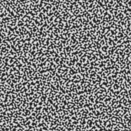

至于其他的，单工噪声函数的许多变体在软件包中是可用的，这些变体在维度上是不同的(从 2D、3D 和 4D)。所有功能共享相同的名称`snoise`，并且与可用参数不同。单工噪声[函数](https://github.com/Unity-Technologies/Unity.Mathematics/blob/master/src/Unity.Mathematics/Noise/noise2D.cs)的 2D 调用将`float2`作为 x 和 y 位置的参数，并返回相应的噪声值。

奇怪的是，在比较单纯形噪声函数(`snoise`)和柏林噪声[函数](https://github.com/Unity-Technologies/Unity.Mathematics/blob/master/src/Unity.Mathematics/Noise/classicnoise2D.cs) ( `cnoise`)的数学包实现的基本测试中，2D 和 4D 值的柏林函数分别比单纯形函数快 24%和 42%。

*注意，测试是通过使用相同的 x 和 y 参数执行每个噪声函数 100.000 并测量花费的总时间来完成的。*

除了我们刚刚讨论的方法之外，数学库还包含其他方法，这些方法是通过添加新参数来控制其结果的变体。例如，库中包含一个`psdrnoise` [函数](https://github.com/Unity-Technologies/Unity.Mathematics/blob/master/src/Unity.Mathematics/Noise/psrdnoise2D.cs)，它有 3 个参数:一个用于位置的`float2`，另一个用于平铺的`float2`，以及一个用于旋转的`float`值。由于它们的特殊用途，本文将不进一步关注它们。

如果你想了解更多，我建议你在[库](https://github.com/Unity-Technologies/Unity.Mathematics/tree/master/src/Unity.Mathematics/Noise)中查看它们的源代码，并在 Unity 论坛上阅读这个[主题](https://forum.unity.com/threads/an-overview-of-noise-functions-in-the-unity-mathematics-package.1098193/)。此外，如果你想要一篇关于这个话题的文章，请随意发表评论。😉

## 通过代码实现常见噪声应用

通过代码访问噪声函数允许我们在函数中直接使用它们的值，而不是将它们计算到一个中间结构(例如，纹理)中。因此，这些函数也是随机函数的良好替代品。

比方说，你想在一个场景中分布一些预设(一个预设产卵器)。我们可以通过使用以下代码来实现它:

```
public void SpawnPrefab(Vector3 position, float frequency, float radius)
{
   //Generates a random point within a given radius
   var randomPosition = Random.insideUnitSphere * radius;
   //Add the original position
   randomPosition.x += position.x;
   randomPosition.y += position.y;
   randomPosition.z += position.z;

   //Only instantiates the prefab if it is within a certain noise frequency. For this case, we are using the position itself as the noise function parameter.
   if (noise.snoise(position) <= frequency)
   {
       Instantiate(prefab, randomPosition, Quaternion.identity);
   }
}

```

另一种通过代码处理噪声的有用方法是通过它们程序化地生成纹理。可以通过代码来执行这些步骤。然而，对于这一点，我们有一个更容易和更灵活的选择。

## 通过着色器图形的噪波

[Shader Graph](https://unity.com/features/shader-graph) 是一个 Unity 工具，允许用户使用基于节点的系统对着色器进行可视化编程。它可以在设计着色器时实现快速和可视化的迭代。此外，即使它是基于节点的，Shader Graph 也有[特定的节点](https://docs.unity3d.com/Packages/com.unity.shadergraph@6.7/manual/Custom-Function-Node.html)，允许用户将着色器语言编写为文本、字符串或加载着色器 HLSL 代码。

要访问着色器图形工具，您的应用程序需要在[通用渲染管道](https://docs.unity3d.com/Packages/com.unity.render-pipelines.universal@12.1/manual/index.html)或[高清渲染管道](https://docs.unity3d.com/Packages/com.unity.render-pipelines.high-definition@14.0/manual/index.html)中。可以通过访问菜单**资产** > **创建** > **着色器图形**来创建着色器。

可以在着色器图形窗口中编辑着色器，该窗口显示参数、预览和输出的功能。该窗口用于通过连接节点来设计着色器。

由于其复杂性，着色器图形工具本身不在本文讨论范围之内，除了它的一些与噪声节点相关的功能。关于如何开始使用着色器图形工具的更多信息，[请参考另一篇文章](https://blog.logrocket.com/getting-started-unity-shader-graph-nodes/)。

### 噪声节点

默认情况下，着色器图形工具有三个噪波节点，即渐变噪波、简单噪波和 Voronoi 噪波。下图显示了所有这些节点及其各自的预览和默认值。

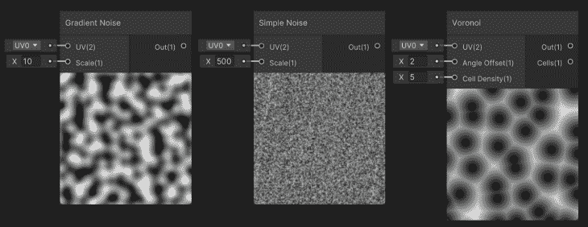

让我们逐一讨论它们，并将它们与之前讨论的噪声函数进行比较:

*   [梯度噪声](https://docs.unity3d.com/Packages/com.unity.shadergraph@6.9/manual/Gradient-Noise-Node.html)节点:根据文档，它是一个柏林噪声函数，尽管其实现类似于前面的单纯形噪声函数
*   [简单噪声](https://docs.unity3d.com/Packages/com.unity.shadergraph@6.9/manual/Simple-Noise-Node.html)节点:根据文档，简单噪声是一个类似白噪声的函数，但由于其在相邻值之间的插值，其结果更类似于单纯噪声函数
*   [Voronoi 噪声](https://docs.unity3d.com/Packages/com.unity.shadergraph@6.9/manual/Voronoi-Node.html)节点:Voronoi 是另一个名字，用来描述之前讲过的 Worley 噪声函数或者细胞噪声函数。与其他节点不同，此节点具有控制点之间的角度偏移和像元密度的输入值，这些值决定了有多少个点可用

类似于数学软件包，这些噪声函数接收坐标作为参数。主要区别在于，这些节点会自动将 UV 坐标指定为噪波函数坐标的输入，这可以很容易地更改为任何其他类型的二维向量。

处理这些噪声的一种常见方法是通过执行简单的数学运算(如将它们的值相加和相乘)来合并它们。下图是这三个噪波依次相乘的结果。

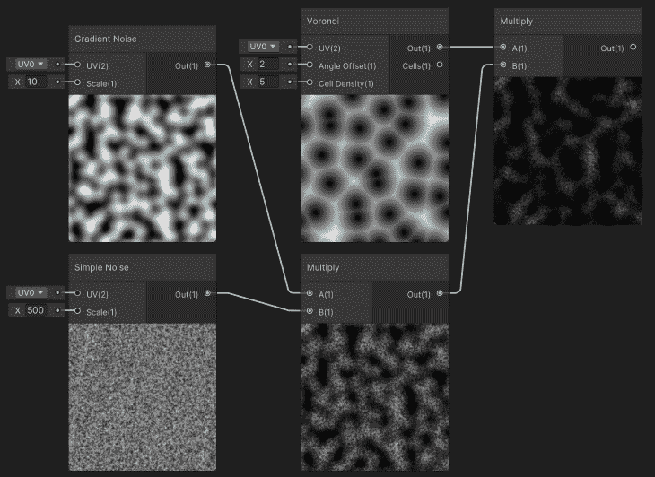

正如上一节末尾所述，我们可以使用数学包通过代码生成噪声值，并在我们的系统上使用它们来控制方面。或者，我们使用着色器图形工具通过节点生成噪声值，并在我们的材质和其他视觉元素中直观地使用它们，如[粒子系统](https://docs.unity3d.com/Manual/class-ParticleSystem.html)和[轨迹渲染器](https://docs.unity3d.com/Manual/class-TrailRenderer.html)。

事实上，您可以混合使用这两种方法，并根据各自的目的使用它们，但是这种方法可能会适得其反。我建议你坚持“代码为代码，视觉为视觉”的经验法则

### 通过着色器图形的典型噪声应用

组合简单的节点可以轻松快速地实现多种结果。例如，由于其值之间的插值，渐变噪波节点和简单噪波节点都是制作简单云着色器的良好候选对象:

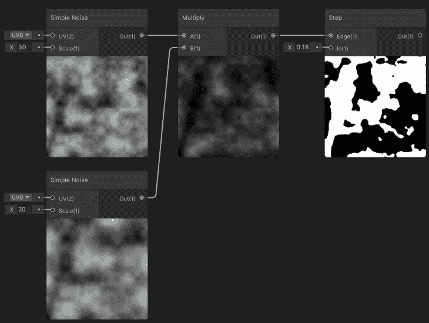

通过乘以不同尺度的简单噪声节点，我们进一步打破了噪声产生的结构。然后结果被用于一个[步骤](https://docs.unity3d.com/Packages/com.unity.shadergraph@6.9/manual/Step-Node.html)节点，该节点给定一个输入，如果它高于输入变量则返回 1，否则返回 0。

下图显示了云图案的动画版本的给定图形的扩展，这是通过在相反方向上偏移两个简单噪波节点的 uv 实现的:

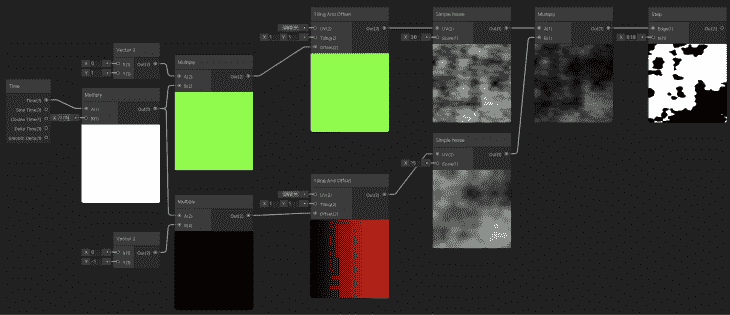

下面的 GIF 显示了动画效果:


### 设置 uv 动画

虽然与本主题仅部分相关，但对于许多使用噪波的着色器图形，节点的组合经常重复:通过随时间偏移 uv 值来设置 uv 的动画。

我们已经在前面的图中看到了它在类似云的图案中的用法。尽管如此，它仍然值得一个简短的解释，因为它通常用于动画噪声模式的许多其他实现中。

下图显示了实现这一目标所需的节点:

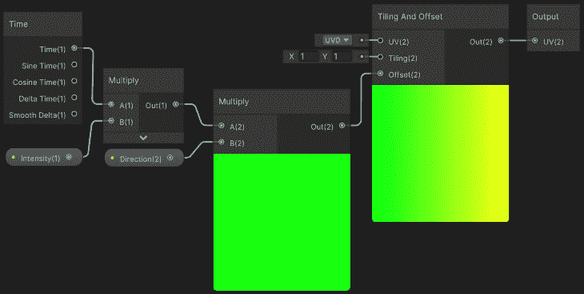

我们使用偏移参数将 UV 在 x 和 y 方向移动一个给定值。偏移值通过使用[时间](https://docs.unity3d.com/Packages/com.unity.shadergraph@6.9/manual/Time-Node.html)节点计算，乘以强度值，帮助我们控制移动的快慢。

然后，将结果乘以矢量 2，我们希望在该方向上偏移 UV。如果我们想要水平移动，我们使用 x = 1 和 y = 0 的向量，而垂直移动将使用 x = 0 和 y = 1 的向量。

其他组合也是可能的，但如果方向向量的大小不是 1(即方向向量不是一元的)，它将影响强度并导致您的移动比最初预期的快或慢。为了防止这个问题，您可以在[乘](https://docs.unity3d.com/Packages/com.unity.shadergraph@6.9/manual/Multiply-Node.html)节点之后使用一个[规格化](https://docs.unity3d.com/Packages/com.unity.shadergraph@6.9/manual/Normalize-Node.html)节点，并将其输出连接到[平铺和偏移](https://docs.unity3d.com/Packages/com.unity.shadergraph@6.9/manual/Tiling-And-Offset-Node.html)节点。

为了简单起见，接下来的着色器图形将使用这个图形作为子图形。这个名为 UVOffsetOverTime 的子图有两个浮点参数:强度和方向。它的输出是新计算的 UV 的矢量 2。

此外，值得注意的是，该子图形使用默认 UV0 作为平铺和偏移节点。如果这不是你的(主要)意图，你也可以很容易地添加第三个参数给它，将 UV 传递给图形。

### 带有噪波节点的水着色器图形

使用这些相同的想法，我们可以快速绘制其他效果，例如水着色器:

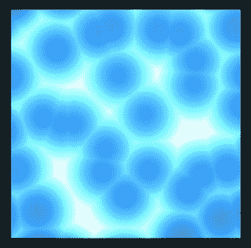

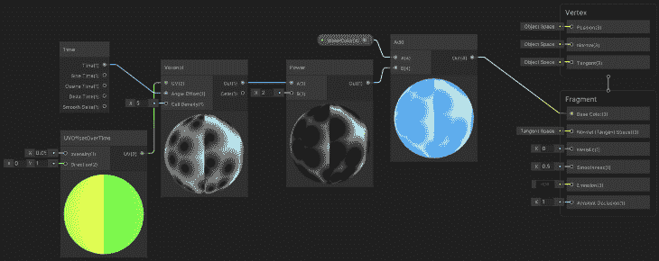

在这种情况下，我们还使用时间节点来改变 Voronoi 的角度偏移参数。这样，Voronoi 噪声函数的内部点也将移动，这创建了液体(如水和熔岩表面)的细胞状运动特征。

另一方面，为了打破单元格的视觉外观，Voronoi 节点的结果被用在一个[幂](https://docs.unity3d.com/Packages/com.unity.shadergraph@6.9/manual/Power-Node.html)节点中，该节点强调较高的值(更接近 1)并减少较低的值(更接近 0)。

### 带有噪波节点的 Lava 着色器图形

此外，作为一个将所有这三个噪波节点用于不同功能的着色器示例，我们可以构建一个 Lava 着色器，如下所示:


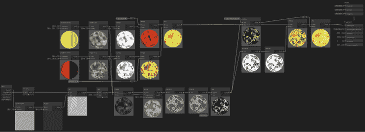

正如你在上面看到的，熔岩着色器比我们简单的水着色器有更多的节点。让我们部分地看一下，以理解如何应用噪声节点来获得最终结果。


首先，我们使用 UVOffsetSubGraph 两次，用相反的方向向量来控制两个简单的噪声节点。这两个简单的噪声节点具有不同的比例，以在它们之间创建足够的差异，因为我们稍后将组合它们的结果，类似于对云图所做的。

此外，为了在将噪波值乘以颜色之前加强噪波值，噪波节点的两个结果都乘以 2。这个过程使结果变得明亮。

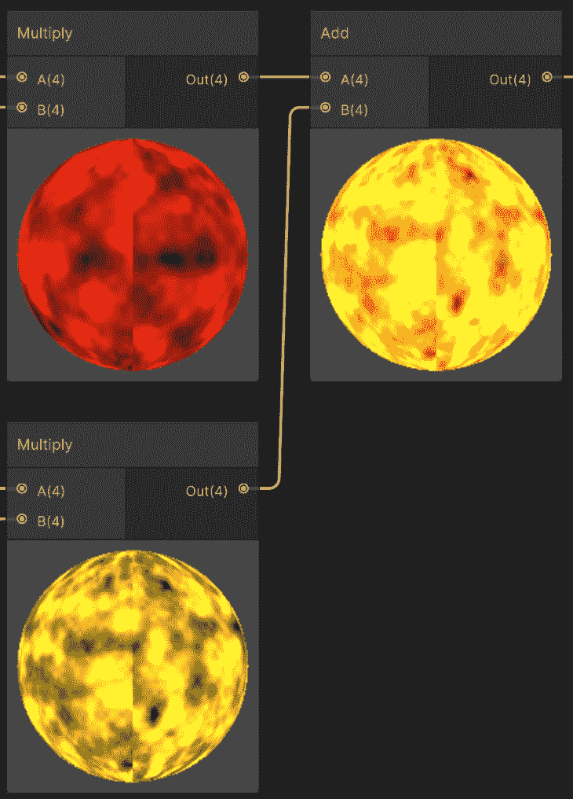

使用 [Add](https://docs.unity3d.com/Packages/com.unity.shadergraph@6.9/manual/Add-Node.html) 节点将两个结果相加。在把它们结合起来之后，我们应该已经得到了一个类似熔岩或者炽热表面的结果。为了进一步增加趣味，我们将添加一种脉动的颜色来强调[的熔岩运动和炽热的强度](https://hayasida.artstation.com/projects/R3Q9kW)。


对于一个更多样的噪声纹理，我们将来自前面步骤的两个原始噪声结果相乘，并将结果用作 Voronoi 噪声节点的 UV 坐标。混合噪波值和 UV 通道是获得大范围视觉效果的快速方法。

不是直接使用结果 Voronoi，这仍然太类似于它的输入，我们使用[1 减去](https://docs.unity3d.com/Packages/com.unity.shadergraph@6.9/manual/One-Minus-Node.html)节点来反转它，随后是[饱和](https://docs.unity3d.com/Packages/com.unity.shadergraph@6.9/manual/Saturate-Node.html)节点，将结果箝位在 0 和 1 之间。饱和节点通常用于保证反转操作和其他函数的结果不会产生负数，因为负数可能会导致图中即将出现的节点出现问题。

为了只从当前的噪波纹理中选择小岛，我们再次使用 Step 节点来只过滤高于给定值的结果。对于此处显示的结果，使用的值是 0.33。

对于脉动效果，我们将通过使用时间节点和梯度噪声的组合来振荡先前讨论的 Voronoi 节点的角度偏移，如下所示。

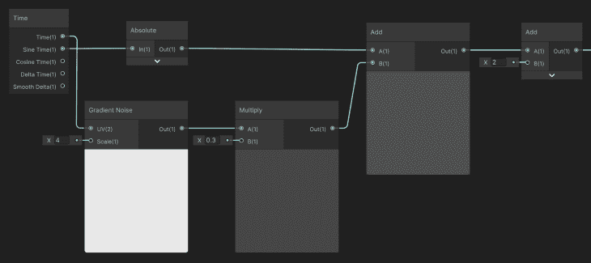

通常，脉动值的一个好方法是对时间节点使用正弦或余弦函数。为了节省时间，时间节点本身已经包含了两个函数的输出。由于我们不想要负脉冲，我们将正弦值插入到绝对节点中。

为了打破简单正弦函数的单调，我们使用 1D 梯度噪声方法，通过使用时间节点输出作为 UV 坐标(因此，x 和 y 分量是相同的)。

请注意，即使我们对“渐变噪波”节点使用 1D 结果，考虑“缩放”输入参数也很重要。较大的标度值会比较小的标度值引起更多的变化。在这种情况下，我们使用等级 4 来实现较小的时间变化。

此外，渐变噪波节点输出乘以一个值，以控制其在最终结果中的强度。本例将它乘以 0.3，将其影响降低到只有 30%。当然，这些价值观可以被调整以获得不同的预期结果。

最后，将正弦结果和噪声相加，并用作 Voronoi 噪声节点的角度偏移。

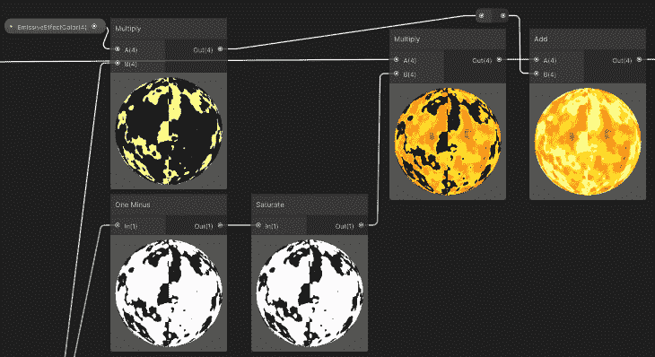

我们采取两个步骤将脉动的颜色结合到先前的熔岩纹理中。

第一个是从先前生成的纹理中移除脉动区域。如果我们忽略这一步，在当前结果上添加(或乘以)脉动值可能会改变颜色和结果太多，或者使结果趋向于平淡的白色，或者取消相反的颜色(例如，如果脉冲是绿色，纹理是蓝色)。

实现移除的一个简单方法是再次使用一个减节点，后面跟着一个饱和节点，然后将结果与之前的纹理相乘。这将使脉动区域变黑，并使非脉动区域保持其预期值。

然后，在第二步中，我们将脉动纹理与所需的颜色相乘，并使用 Add 节点将其添加到最后一个节点，合并所有的节点。


正如在本文中所看到的，在 Unity 项目中，大量的选项会产生噪音和随机性。标准数学库和数学包允许各种方法通过代码使用噪声函数。同时，着色器图形工具为程序生成提供了三个通用的噪波功能节点。

事实上，业界使用的许多其他[噪声函数](https://hal.archives-ouvertes.fr/hal-00920177)并不完全可以通过这些方法获得，例如[分形噪声](https://thebookofshaders.com/13/)函数和[卷曲噪声](https://www.researchgate.net/publication/314502571_Curl-noise_for_procedural_fluid_flow)函数。然而，其中大部分可以用 C#函数编程，在代码中使用，或者在着色器图形中用 HLSL 语言实现。换句话说，虽然没有给出所有的功能，但是我们有足够的工具来实现它们。

最后，考虑另一个简单的替代缺少特定噪声函数或模式的方法是使用预制纹理。[熔岩流着色器](https://assetstore.unity.com/packages/vfx/shaders/lava-flowing-shader-33635)是 Unity 资产商店中的免费资产，它通过结合多种纹理和着色器编程来实现好看的熔岩流材质。

考虑到这个讨论归结为通常的冲突。同时，在开发应用程序时，我们可以使用更多的内存(纹理)或更多的处理时间(程序噪声函数)来实现我们的结果。由我们来决定什么能产生最好的效率和工作流程。幸运的是，所给出的噪声函数具有最小的性能足迹。

感谢您的阅读，如果您想了解更多关于 Unity 的噪波函数、着色器图形和其他快速开发和原型制作技术，请告诉我。你可以在 www.dagongraphics.com 看到更多我的作品。

## 使用 [LogRocket](https://lp.logrocket.com/blg/signup) 消除传统错误报告的干扰

[](https://lp.logrocket.com/blg/signup)

[LogRocket](https://lp.logrocket.com/blg/signup) 是一个数字体验分析解决方案，它可以保护您免受数百个假阳性错误警报的影响，只针对几个真正重要的项目。LogRocket 会告诉您应用程序中实际影响用户的最具影响力的 bug 和 UX 问题。

然后，使用具有深层技术遥测的会话重放来确切地查看用户看到了什么以及是什么导致了问题，就像你在他们身后看一样。

LogRocket 自动聚合客户端错误、JS 异常、前端性能指标和用户交互。然后 LogRocket 使用机器学习来告诉你哪些问题正在影响大多数用户，并提供你需要修复它的上下文。

关注重要的 bug—[今天就试试 LogRocket】。](https://lp.logrocket.com/blg/signup-issue-free)