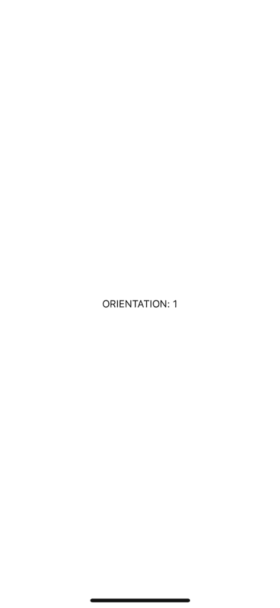

# 管理 React 本机应用中的方向变化

> 原文：<https://blog.logrocket.com/managing-orientation-changes-react-native-apps/>

屏幕方向是指设备的握持或放置方式，通常是围绕其垂直轴和水平轴。屏幕方向很重要，因为它决定了设备屏幕的显示方式以及用户如何与之交互。

例如，纵向设备将垂直显示屏幕，而横向设备将水平显示屏幕。在这篇文章中，我们将探讨现代 [React Native](https://blog.logrocket.com/tag/react-native/) 应用程序中的锁定方向，以及如何确保应用程序只能以特定的屏幕方向显示。

*向前跳转:*

## 安装世博屏幕定向包

世博屏定位包由世博团队打造。它包括管理设备屏幕方向的所有工具，包括获取当前方向、更改方向以及将屏幕方向锁定到特定状态。

要使用 expo-screen-orientation，您需要使用以下命令将其安装在 React 本地项目中:

```
$ yarn add expo-screen-orientation

$ npm install --save expo-screen-orientation

```

```
$ npx expo install expo-screen-orientation

```

## 获取当前屏幕方向

要在 React 本地应用程序中获取屏幕的当前方向，请使用 Expo 设计的`ScreenOrientation` API，它提供了有关设备屏幕方向的信息。您可以使用`getOrientationAsync`属性来获取屏幕的当前方向，这将返回一个整数作为它的值，如下所示:

```
Orientation.Unknown = 0
Orientation.PORTRAIT_UP = 1
Orientation.PORTRAIT_DOWN = 2
Orientation.LANDSCAPE_LEFT = 3
Orientation.LANDSCAPE_RIGHT = 4

```

下面是获取当前屏幕方向的代码片段:

```
const checkOrientation = async () => {
    const orientation = await ScreenOrientation.getOrientationAsync();
    console.log("orientation", orientation);
};

```

## 收听屏幕方向更新

要检查屏幕方向的更新，使用来自`ScreenOrientation` API 的`addOrientationChangeListener`方法。这将传递一个`callback`函数，当方向改变时，这个函数将被调用。这个`callback`函数将接收一个包含新方向信息的事件对象，您可以用它来更新您的应用程序的 [UI](https://blog.logrocket.com/comparing-react-native-ui-libraries/) 或以另一种方式处理方向变化。

下面是一个示例，说明如何使用这些 API 来处理应用程序中的方向更改:

```
import { StatusBar } from "expo-status-bar";
import { StyleSheet, Text, View } from "react-native";
import * as ScreenOrientation from "expo-screen-orientation";
import { useEffect, useState } from "react";
export default function App() {
  const [orientation, setOrientation] = useState(null);
  useEffect(() => {
    checkOrientation();
    const subscription = ScreenOrientation.addOrientationChangeListener(
      handleOrientationChange
    );
    return () => {
      ScreenOrientation.removeOrientationChangeListeners(subscription);
    };
  }, []);
  const checkOrientation = async () => {
    const orientation = await ScreenOrientation.getOrientationAsync();
    setOrientation(orientation);
  };
  const handleOrientationChange = (o) => {
    setOrientation(o.orientationInfo.orientation);
  };
  console.log(orientation);
  return (
    <View style={styles.container}>
      <Text>ORIENTATION: {orientation}</Text>
      <StatusBar style="auto" />
    </View>
  );
}
const styles = StyleSheet.create({
  container: {
    flex: 1,
    backgroundColor: "#fff",
    alignItems: "center",
    justifyContent: "center",
  },
});

```

以下是纵向和横向屏幕方向的样子:



在这个例子中，我们使用`ScreenOrientation` API 来获取屏幕的当前方向，并监听方向的变化。当方向改变时，我们使用`setOrientation`钩子更新`orientation`状态变量。

然后，我们使用这个状态变量来显示日志中的当前方向。侦听器的响应采用对象的形式，如下所示:

```
{
   "orientationInfo":{
      "horizontalSizeClass":1,
      "orientation":4,
      "verticalSizeClass":1
   },
   "orientationLock":0
}

```

我们还使用`ScreenOrientation` API 将屏幕锁定为纵向，这意味着用户将无法将屏幕旋转到横向。如果您希望阻止应用程序以横向显示，或者希望确保应用程序始终以特定方向显示，这将非常有用。

## 如何锁定屏幕方向

要禁用方向更改或为 React 本机应用程序设置单一方向，可以使用`ScreenOrientation` API。这个 API 提供了控制屏幕方向的方法。

您可以使用`lockAsync`方法将屏幕锁定在特定方向，或者使用`unlockAsync`方法将屏幕旋转到任意方向。

以下是以编程方式锁定方向的示例:

```
import { StatusBar } from "expo-status-bar";
import { StyleSheet, Text, View } from "react-native";
import * as ScreenOrientation from "expo-screen-orientation";
import { useEffect, useState } from "react";
export default function App() {
  const [orientation, setOrientation] = useState(1);
  useEffect(() => {
    lockOrientation();
  }, []);
  const lockOrientation = async () => {
    await ScreenOrientation.lockAsync(
      ScreenOrientation.OrientationLock.LANDSCAPE_RIGHT
    );
  const o = await ScreenOrientation.getOrientationAsync();
    setOrientation(o);
  };
  return (
    <View style={styles.container}>
      <Text>Locked Screen orientation: {orientation}</Text>
      <StatusBar style="auto" />
    </View>
  );
}
const styles = StyleSheet.create({
  container: {
    flex: 1,
    backgroundColor: "#fff",
    alignItems: "center",
    justifyContent: "center",
  },
});

```

在 bare React 原生应用中，我们有另一种方法来锁定应用的屏幕方向。

### 机器人

打开`AndroidManifest.xml`文件，设置`android:screenOrientation="portrait"`将屏幕锁定在纵向模式，或者设置`android:screenOrientation="landscape"`将屏幕锁定在横向模式。这应该是这样的:

```
<activity
      android:name=".MainActivity"
      android:label="@string/app_name"
      android:configChanges="keyboard|keyboardHidden|orientation|screenLayout|screenSize|smallestScreenSize|uiMode"
      android:launchMode="singleTask"
      android:windowSoftInputMode="adjustResize"
      android:exported="true"
      android:theme="@style/Theme.App.SplashScreen"
      android:screenOrientation="portrait"
    >

```

### ios

要在 iOS 中管理屏幕方向，请打开 [Xcode](https://blog.logrocket.com/xcode-for-react-native-developers-tutorial-and-best-practices/) 并在**常规>部署**信息中检查您的应用所需的方向:


## 在 React Native 中控制屏幕方向的示例

现在，如果需要以编程方式更新方向，该怎么办呢？例如，在播放视频时，您可能希望它以横向模式显示，以便为用户提供更好的观看体验。

下面是一个使用 expo-screen-orientation 更新和锁定按钮点击和点击的屏幕方向的易用示例:

```
import { StatusBar } from "expo-status-bar";
import { StyleSheet, Text, TouchableOpacity, View } from "react-native";
import * as ScreenOrientation from "expo-screen-orientation";
import { useEffect, useState } from "react";
export default function App() {
  const [orientation, setOrientation] = useState(null);
  useEffect(() => {
    checkOrientation();
    const subscription = ScreenOrientation.addOrientationChangeListener(
      handleOrientationChange
    );
    return () => {
      ScreenOrientation.removeOrientationChangeListeners(subscription);
    };
  }, []);
  const checkOrientation = async () => {
    const orientation = await ScreenOrientation.getOrientationAsync();
    setOrientation(orientation);
  };
  const changeOrientation = async (newOrientation) => {
    console.log("newOrientation: ", newOrientation);
    await ScreenOrientation.lockAsync(newOrientation);
  };
  const handleOrientationChange = (o) => {
    setOrientation(o.orientationInfo.orientation);
  };
  console.log(orientation);
  return (
    <View style={styles.container}>
      <Text>ORIENTATION: {orientation}</Text>
      <TouchableOpacity
        style={[styles.btn, { marginTop: 15 }]}
        onPress={() =>
          changeOrientation(ScreenOrientation.OrientationLock.PORTRAIT_UP)
        }
      >
        <Text style={styles.txt}>Tap to Portrait orientation</Text>
      </TouchableOpacity>
      <TouchableOpacity
        style={styles.btn}
        onPress={() =>
          changeOrientation(ScreenOrientation.OrientationLock.LANDSCAPE_RIGHT)
        }
      >
        <Text style={styles.txt}>Tap to Landscape orientation</Text>
      </TouchableOpacity>
      <StatusBar style="auto" />
    </View>
  );
}
const styles = StyleSheet.create({
  container: {
    flex: 1,
    backgroundColor: "#fff",
    alignItems: "center",
    justifyContent: "center",
  },
  btn: {
    padding: 10,
  },
  txt: {
    fontSize: 16,
    color: "blue",
  },
});

```

瞧啊。下面是一个视频剪辑，展示了我们使用上面的代码所取得的成果:

## 结论

总之，屏幕方向是设备交互的一个重要方面。Expo APIs 允许您获取当前方向，监听方向变化，并在 React 本机应用程序中控制屏幕方向。

这些 API 帮助你创建[更吸引人和用户友好的应用](https://blog.logrocket.com/ux-design/designing-microinteractions-better-app-ux/)，适应不同的方向并提供一致的 [UX](https://blog.logrocket.com/category/ux-design/) 。总的来说，expo-screen-orientation 包对于任何需要管理屏幕方向的 React 本地应用程序来说都是一个有价值的工具。

## [LogRocket](https://lp.logrocket.com/blg/react-native-signup) :即时重现 React 原生应用中的问题。

[](https://lp.logrocket.com/blg/react-native-signup)

[LogRocket](https://lp.logrocket.com/blg/react-native-signup) 是一款 React 原生监控解决方案，可帮助您即时重现问题、确定 bug 的优先级并了解 React 原生应用的性能。

LogRocket 还可以向你展示用户是如何与你的应用程序互动的，从而帮助你提高转化率和产品使用率。LogRocket 的产品分析功能揭示了用户不完成特定流程或不采用新功能的原因。

开始主动监控您的 React 原生应用— [免费试用 LogRocket】。](https://lp.logrocket.com/blg/react-native-signup)