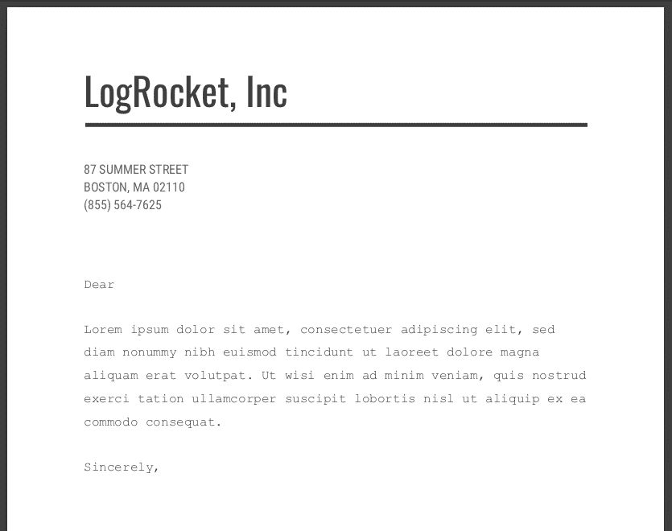
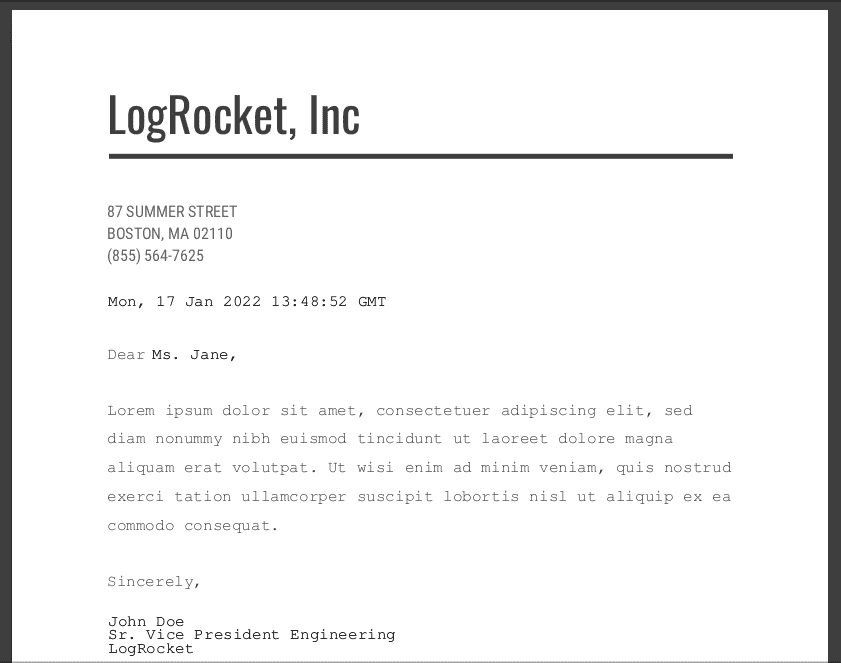
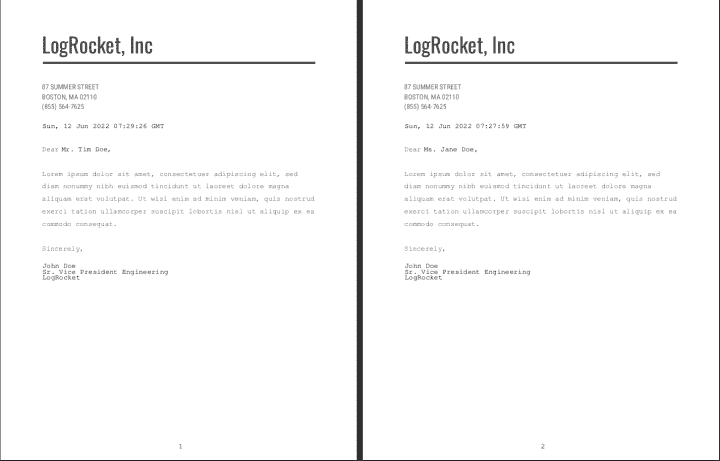

# 使用 pdf-lib 管理节点中的 pdf

> 原文：<https://blog.logrocket.com/managing-pdfs-node-pdf-lib/>

## 介绍

可移植文档格式，通常称为 PDF，是最流行的文档格式之一。pdf 受欢迎是因为:

*   它们易于创建、查看和共享。大多数操作系统都预装了用于查看 PDF 文档的应用程序，并且大多数现代 web 浏览器也具有内置的 PDF 文档查看功能
*   PDF 文档是安全的–您可以用密码保护 PDF 文档
*   与其他文档格式不同，PDF 文档的外观是一致的，与您用来查看它们的应用程序无关
*   您可以轻松地压缩 PDF 文档，以便在互联网上传输

尽管 PDF 文档很流行，但是 JavaScript 生态系统缺乏对 PDF 操作的强大支持。pdf-lib 是一个比较新的、流行的、功能丰富的软件包，可以用来管理 PDF 文档。

pdf-lib 包可以在 Node、Deno、React Native 和 Browser 中运行。本文将指导您使用 pdf-lib 在节点运行时环境中管理 PDF 文档。

### 目录

## 什么是 pdf-lib？

pdf-lib 是在 Node.js、Deno、React Native 和浏览器中运行的第三方包。使 pdf-lib 优于大多数其他类似 JavaScript 包的特性包括:

*   创建新的 PDF 文档以及修改现有文档的能力
*   它支持各种 JavaScript 环境

在 GitHub 上相对[受欢迎，有超过 3.5k 的明星。我们将在下一节中讨论它的一些显著特征。](https://github.com/Hopding/pdf-lib)

## 如何使用 pdf-lib 包管理 Node.js 中的 pdf

如前所述，pdf-lib 是 JavaScript 生态系统中用于管理 pdf 文档的功能丰富的包之一。我们将在下面的小节中实现它的核心特性。

因为这是第三方软件包，所以您必须从 npm 软件包注册表中安装它，如下所示:

```
# With npm
npm install pdf-lib

# With yarn
yarn add pdf-lib

```

如果您已经使用上面的命令之一初始化了一个节点项目并安装了 pdf-lib，请按照下面的小节来实现它的一些主要特性。它支持 [CommonJS 和 ES 模块](https://blog.logrocket.com/commonjs-vs-es-modules-node-js/)。

在本文中，我们将使用 CommonJS 语法。如果您切换到 ESM 语法，这些示例应该可以工作。

### 如何创建 PDF

在深入研究 pdf-lib 包之前，让我们通过使用下面的代码创建一个简单的空白文档来体验一下。这是基本特征之一。

```
const { PDFDocument } = require("pdf-lib");
const { writeFileSync } = require("fs");

async function createPDF() {
  const PDFdoc = await PDFDocument.create();
  const page = PDFdoc.addPage([300, 400]);
  writeFileSync("blank.pdf", await PDFdoc.save());
}

createPDF().catch((err) => console.log(err));

```

`PDFDocument`类拥有文档操作所需的大多数方法和属性。导入后，您可以使用`create`方法创建一个文档。

在上面的例子中，我们将页面的尺寸作为一个整数数组传递给了`addPage`方法。`addPage`方法也接受其他类型的参数，您可以在 pdf-lib 文档中读到。

执行上面的代码后，您会看到一个`blank.pdf`文件。


没有一些文本的空白 PDF 文档是没有用的。让我们在刚刚创建的文档中添加一个简单的“hello world”文本。

### 如何向 PDF 添加文本

下面的代码演示了如何向 PDF 文档中添加文本。它将一个简单的“hello world”文本添加到我们在前一小节中创建的空白 PDF 文档中。通常，使用`drawText`方法添加文本。最多需要两个参数。

第一个参数是您想要添加的文本，第二个参数是一个对象，它具有您可以在 pdf-lib 文档中查找的各种属性。此时，我们将传递属性`x`和`y`来定位文本。默认情况下，pdf-lib 将文本放在左下角。

pdf-lib 包附带了一些内置的标准字体。在这个例子中，我们将使用内置的 Helvetica 字体。我们还将使用内置属性来计算文本的宽度和高度，这是我们将文本居中所需要的:

```
const { PDFDocument, StandardFonts } = require("pdf-lib");
const { writeFileSync } = require("fs");

async function createPDF() {
  const document = await PDFDocument.create();

  const page = document.addPage([300, 400]);

  const text = "Hello World";
  const helveticaFont = await document.embedFont(StandardFonts.Helvetica);
  const textWidth = helveticaFont.widthOfTextAtSize(text, 24);
  const textHeight = helveticaFont.heightAtSize(24);

  page.drawText(text, {
    x: page.getWidth() / 2 - textWidth / 2,
    y: page.getHeight() / 2 - textHeight / 2,
  });

  writeFileSync("hello.pdf", await document.save());
}

createPDF().catch((err) => console.log(err));

```

当您运行上面的代码时，它将创建一个中心带有文本“Hello World”的`hello.pdf`文件。如果你改变`x`和`y`的值，文本的位置也会改变。


如前所述，`x`和`y`不是传递给`drawText`方法的对象的唯一属性。您还可以包括类似于`color`、`opacity`、`font`和`rotate`的属性。

### 如何修改现有的 PDF

pdf-lib 包可以修改现有的 pdf 文档。我们将使用`fs`模块的`readFileSync`方法将文件读入内存。值得一提的是，如果没有通过`encoding`参数，`readFileSync`会返回一个缓冲区。

下图显示了我们将要修改的一个简单的 PDF 文档。



让我们使用下面的代码来修改上面的信。我们将添加当前日期、收件人姓名和作者姓名:

```
const { PDFDocument, StandardFonts, rgb } = require("pdf-lib");
const { writeFileSync, readFileSync } = require("fs");

async function createPDF() {
  const document = await PDFDocument.load(readFileSync("./letter.pdf"));

  const courierBoldFont = await document.embedFont(StandardFonts.Courier);
  const firstPage = document.getPage(0);

  firstPage.moveTo(72, 570);
  firstPage.drawText(new Date().toUTCString(), {
    font: courierBoldFont,
    size: 12,
  });

  firstPage.moveTo(105, 530);
  firstPage.drawText("Ms. Jane,", {
    font: courierBoldFont,
    size: 12,
  });

  firstPage.moveTo(72, 330);
  firstPage.drawText("John Doe \nSr. Vice President Engineering \nLogRocket", {
    font: courierBoldFont,
    size: 12,
    lineHeight: 10,
  });

  writeFileSync("jane-doe.pdf", await document.save());
}

createPDF().catch((err) => console.log(err));

```

上面的代码将修改前面的 PDF 文档，使其看起来像下图。它会加上日期、收信人和写信人。确保将`letter.pdf`文件放在同一个目录中。



您可以使用此功能动态修改文档的内容。就像上面的例子，你可能有一封内容相同的信，但是你想写给不同的人。您可以像我们一样查询数据库并动态修改文档。

不幸的是，如上所示，您需要获得文档上的准确位置来添加文本。

### 如何合并 pdf

pdf-lib 包附带了可用于合并 pdf 文档的功能。下图中我们有一个两页的 PDF 文档。我们将把我们在前一小节中创建的文档附加到它后面。


在下面的代码中，我们将把 Jane Doe 的信附加到其余的信中。我们正在从文件中读取两个 PDF 文档。您也可以通过 HTTP 客户端从服务器获取文档:

```
const { PDFDocument } = require("pdf-lib");
const { writeFileSync, readFileSync } = require("fs");

async function appendPDF() {
  const janeDoe = await PDFDocument.load(readFileSync("./jane-doe.pdf"));
  const letters = await PDFDocument.load(readFileSync("./letters.pdf"));

  const pagesArray = await letters.copyPages(janeDoe, janeDoe.getPageIndices());

  for (const page of pagesArray) {
    letters.addPage(page);
  }

  writeFileSync("all-letters.pdf", await letters.save());
}

appendPDF().catch((err) => console.log(err));

```

方法返回一个页面数组。在上面的例子中，我们遍历数组，并在循环中将页面追加到文档中。如果要追加单页，可以不通过数组循环来实现。您可以用下面的代码替换该循环:

```
letters.addPage(pagesArray[0]);

```

运行上面的代码将创建一个`all-letters.pdf`文件，将 Jane Doe 的信附加到其余的字母上。如果您想要合并多个 PDF 文档，此功能会非常有用。例如，如果您有不同 PDF 文件中的书籍章节，您可以使用几行代码将它们合并。

您可能希望在两页之间插入页面，而不是在文档末尾追加页面。在这种情况下，您将不得不使用`insertPage`方法。下面的代码是对前面代码的修改，在特定的索引处插入一个页面。传递给`insertPage`方法的索引应该是从零开始的:

```
const { PDFDocument } = require("pdf-lib");
const { writeFileSync, readFileSync } = require("fs");

async function insertPage() {
  const janeDoe = await PDFDocument.load(readFileSync("./jane-doe.pdf"));
  const letters = await PDFDocument.load(readFileSync("./letters.pdf"));

  const pagesArray = await letters.copyPages(janeDoe, janeDoe.getPageIndices());

  letters.insertPage(1, pagesArray[0]);
  writeFileSync("insert-page.pdf", await letters.save());
}

insertPage().catch((err) => console.log(err));

```

### 如何从 PDF 中删除页面

您可能想要删除页面，而不是像我们在前面小节中那样向文档添加页面。您可以使用`removePage`方法来实现，该方法获取您想要删除的页面的索引。如果传递超出范围的索引，将会出现错误。

下面的代码演示了如何使用`removePage`方法。它将文档加载到内存中，删除特定索引处的页面，并将修改后的文档写入文件:

```
const { PDFDocument } = require("pdf-lib");
const { writeFileSync, readFileSync } = require("fs");

async function removePage() {
  const letters = await PDFDocument.load(readFileSync("./insert-page.pdf"));
  letters.removePage(1);
  writeFileSync("remove-page.pdf", await letters.save());
}

removePage().catch((err) => console.log(err));

```

运行上面的代码将删除我们在前一小节中添加的页面。

### 如何向 PDF 添加图像

我在下面的代码中演示了如何向 PDF 文档添加图像。在执行之前，确保`cat.jpg`文件在同一个目录中。如果您打算使用不同的图像，也可以将图像路径传递给`readFileSync`方法:

```
const { PDFDocument } = require("pdf-lib");
const fs = require("fs");

async function createPDFDocument() {
  const document = await PDFDocument.create();
  const page = document.addPage([300, 400]);

  const imgBuffer = fs.readFileSync("./cat.jpg");
  const img = await document.embedJpg(imgBuffer);

  const { width, height } = img.scale(1);
  page.drawImage(img, {
    x: page.getWidth() / 2 - width / 2,
    y: page.getHeight() / 2 - height / 2,
  });

  fs.writeFileSync("./image.pdf", await document.save());
}

createPDFDocument().catch((err) => console.log(err));

```

上面的代码将创建一个类似下图的`image.pdf`文件。它将在页面中央添加图像。


PDF 文档通常包含提供文档附加信息的元数据。元数据包括文档标题、作者、创建日期和版权信息。

以下代码说明了如何设置和检索 PDF 文档的元数据:

```
const { PDFDocument } = require("pdf-lib");
const { readFileSync } = require("fs");

async function removePage() {
  const PDFdoc = await PDFDocument.load(readFileSync("./jane-doe.pdf"), {
    updateMetadata: false,
  });

  PDFdoc.setTitle("Letter");
  PDFdoc.setAuthor("Jane Doe");
  PDFdoc.setSubject("pdf-lib example");
  PDFdoc.setCreationDate(new Date());
  PDFdoc.setModificationDate(new Date());

  console.log(`Title: ${PDFdoc.getTitle()}`);
  console.log(`Author: ${PDFdoc.getAuthor()}`);
  console.log(`Subject: ${PDFdoc.getSubject()}`);
  console.log(`Creation Date: ${PDFdoc.getCreationDate()}`);
  console.log(`Modification date: ${PDFdoc.getModificationDate()}`);
}

removePage().catch((err) => console.log(err));

```

### 如何给 PDF 添加页码

修改现有 PDF 文档后，可能需要添加页码。您可以使用前面某一小节中描述的添加文本的功能来完成此操作。

您需要将整个文档读入内存，并循环访问每一页。在下面的代码中，在阅读了 PDF 文档后，我们使用`getPageIndices`方法来检索页面索引数组并遍历它。您可以使用`getPage`方法为每个数组索引检索相应的页面。您需要将数组索引作为参数传递给`getPage`:

```
const { PDFDocument, StandardFonts } = require("pdf-lib");
const { writeFileSync, readFileSync } = require("fs");

async function addPageNumbers() {
  const document = await PDFDocument.load(readFileSync("./letters.pdf"));

  const courierBoldFont = await document.embedFont(StandardFonts.Courier);
  const pageIndices = document.getPageIndices();

  for (const pageIndex of pageIndices) {
    const page = document.getPage(pageIndex);

    page.drawText(`${pageIndex + 1}`, {
      x: page.getWidth() / 2,
      y: 20,
      font: courierBoldFont,
      size: 12
    });
  }

  writeFileSync("paged-letters.pdf", await document.save());
}

addPageNumbers().catch((err) => console.log(err));

```

这些指数是从零开始的。因此，在将每个页面索引设置为页码时，应该将它递增 1。从零开始数页码是没有意义的。运行上面的代码后，您将得到一个底部带有页码的 PDF 文档，类似于下图。



您可以使用`getPages`方法来检索页面，而不是像我们在上面的例子中那样使用`getPageIndices`方法来检索页面索引。它将返回一个页面数组，您可以通过类似的方式进行循环。

如上所述，您需要知道文本在页面上的准确位置。请务必仔细选择页码的位置，以避免与页面上的其他内容重叠。您可以在页面的顶部或底部添加页码。

要在页面顶部添加页码，而不是像上面的例子那样在底部添加页码，请使用`getHeight`方法获取页面高度，并使用它来设置`y`坐标，如下所示:

```
page.drawText(`${pageIndex + 1}`, {
  x: page.getWidth() / 2,
  y: page.getHeight() - 20,
  font: courierBoldFont,
  size: 12,
});

```

对电子书或学术文档的不同部分应用不同的页面格式是很常见的。在学术著作中，通常的做法是用罗马数字标记介绍页，而其他页则用通常的编号系统。pdf-lib 使得应用这种格式变得容易。您需要确定需要不同页码格式的页面，并适当地应用它。

## 结论

希望您已经学会了如何使用 pdf-lib 在节点运行时环境中创建和操作 PDF 文档。pdf-lib 包很可能满足您的基本 pdf 文档操作需求。它比我们在本文中介绍的功能更多。

如果你渴望更多，你可以检查文档。我们在这里没有涉及到的 pdf-lib 的一些特性包括嵌入 pdf 文档、创建表单和绘制 SVG 路径。

尽管上面强调了这些特性，pdf-lib 还是有它的局限性。值得注意的问题包括缺乏对操作加密文档和添加 HTML 和 CSS 内容的支持。试图加载加密文档将会引发错误。

本文的重点是在节点运行时环境中运行 pdf-lib。您还可以在其他 JavaScript 环境中运行它，如 Deno、React Native 和浏览器，而无需对源代码进行重大修改。

## 200 只显示器出现故障，生产中网络请求缓慢

部署基于节点的 web 应用程序或网站是容易的部分。确保您的节点实例继续为您的应用程序提供资源是事情变得更加困难的地方。如果您对确保对后端或第三方服务的请求成功感兴趣，

[try LogRocket](https://lp.logrocket.com/blg/node-signup)

.

[](https://lp.logrocket.com/blg/node-signup)[https://logrocket.com/signup/](https://lp.logrocket.com/blg/node-signup)

LogRocket 就像是网络和移动应用程序的 DVR，记录下用户与你的应用程序交互时发生的一切。您可以汇总并报告有问题的网络请求，以快速了解根本原因，而不是猜测问题发生的原因。

LogRocket 检测您的应用程序以记录基线性能计时，如页面加载时间、到达第一个字节的时间、慢速网络请求，还记录 Redux、NgRx 和 Vuex 操作/状态。

[Start monitoring for free](https://lp.logrocket.com/blg/node-signup)

.