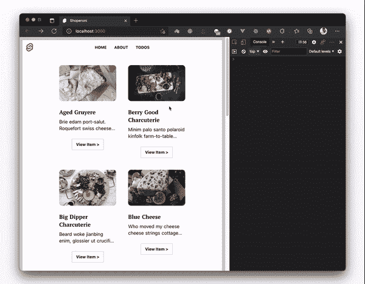
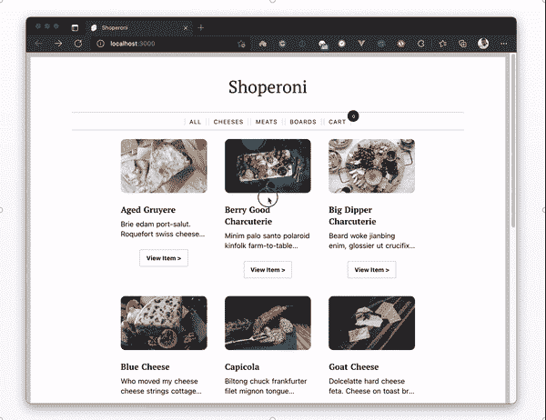
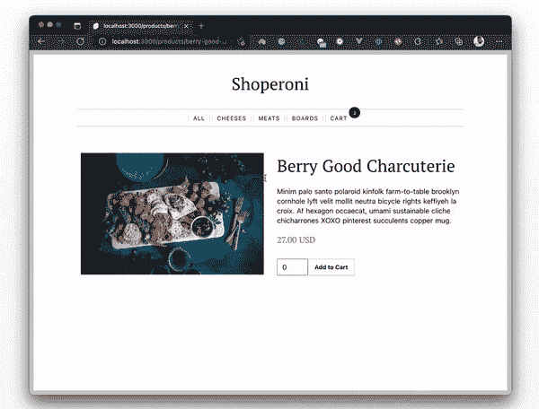
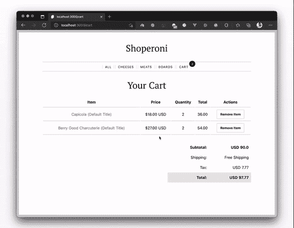

# 管理 SvelteKit 和 Shopify 购物车交互

> 原文：<https://blog.logrocket.com/managing-sveltekit-shopify-cart-interactions/>

每个电子商务解决方案最重要的部分之一是购物车功能。让用户能够方便地在购物车中添加和删除商品至关重要。

在之前的帖子中，我向您展示了如何使用 SvelteKit 和 Shopify Storefront API 构建一个快速的电子商务网站。但是我们并没有在那篇文章中谈到如何管理购物车。这就是我们要做的事情——向您展示如何通过 Shopify Storefront cart API 添加和删除购物车中的产品。

这里有一个快速回顾:我们正在谈论的网站目前[部署在 Netlify](https://sveltekit-shopify-ecommerce.netlify.app) 上，托管在 [GitHub](https://github.com/kenny-io/sveltekit-shopify-ecommerce) 上。如果你想的话，看看它，玩一会儿。当你完成的时候，回来让我们直接进入。

## 将商品添加到购物车

查看我们部署的站点，我们可以在产品详细信息页面中看到，我们可以单击一个按钮将产品添加到购物车中。这似乎是一个非常好的无服务器功能的候选，但 Svelte 也提供 API 路线，我们将在这个项目中使用它。

使用简单的 API 路由，我们可以设置一个`add-to-cart`端点，当用户点击`Add To Cart`按钮时，我们可以将我们的产品细节发布到这个端点。端点将接收数据，并向 Shopify 发出一个`POST`请求，要么创建一个包含产品的购物车，要么将产品添加到购物车中(如果存在的话)。

在`src/routes`文件夹中，创建一个名为`api`的新文件夹。在其中，我们可以创建第一个名为`add-to-cart.js`的端点，并像这样设置它:

```
// src/routes/api/add-to-cart
import { createCartWithItem } from './utils/createCartWithItem';
import { addItemToCart } from './utils/addItemToCart';

export async function post(request) {
    let { cartId, itemId, quantity } = JSON.parse(request.body);
    quantity = parseInt(quantity);
    if (cartId) {
        console.log('Adding item to existing cart...');
        const shopifyResponse = await addItemToCart({
            cartId,
            itemId,
            quantity
        });
        return {
            statusCode: 200,
            body: JSON.stringify(shopifyResponse.cartLinesAdd.cart)
        };
    } else {
        console.log('Creating new cart with item...');
        const createCartResponse = await createCartWithItem({
            itemId,
            quantity
        });
        return {
            statusCode: 200,
            body: JSON.stringify(createCartResponse.cartCreate.cart)
        };
    }
}

```

这里的逻辑很简单。当点击`Add To Cart`按钮时，我们从产品页面获取必要的详细信息(`cartId`、`itemId`和`quantity`，并将它们发送到这个端点。然后在上面的端点中，我们接收数据并检查请求体中是否存在有效的`cartId`。

*   如果是，我们继续将产品添加到购物车中
*   否则，我们将使用收到的产品数据创建一个购物车

我在这里使用了效用函数(`[createCartWithItem](https://github.com/kenny-io/sveltekit-shopify-ecommerce/blob/master/src/routes/api/utils/createCartWithItem.js)`和`[addItemToCart](https://github.com/kenny-io/sveltekit-shopify-ecommerce/blob/master/src/routes/api/utils/addItemToCart.js)`)来加快速度。请随意查阅它们，以便更好地了解我们在那里做了什么。

现在我们已经设置了一个端点来接收产品数据并将其添加到购物车中，我们可以返回到产品页面并定义一个`addToCart`函数来将数据发送到这个端点:

```
//src/routes/products/[handle].svelte
<script context="module">
    import { getProductDetails } from '../../../store'; 
    export async function load(ctx) {
        // ...
    }
</script>

<script>
    // ...
    let quantity = 0;
    let selectedProduct = productVariants[0].id;
        const addToCart = async () => {
        // add selected product to cart
        try {
            const addToCartResponse = await fetch('/api/add-to-cart', {
                method: 'POST',
                body: JSON.stringify({
                    cartId: localStorage.getItem('cartId'),
                    itemId: selectedProduct,
                    quantity: quantity
                })
            });
            const data = await addToCartResponse.json();
            // save cart to localStorage
            localStorage.setItem('cartId', data.id);
            localStorage.setItem('cart', JSON.stringify(data));
            location.reload();
        } catch (e) {
            console.log(e);
        }
    };
    function price(itemPrice) {
        const amount = Number(itemPrice).toFixed(2);
        return amount + ' ' + 'USD';
    }
</script>
<main>
<!-- page content -->
</main>

```

我们在这里所做的只是将`addToCart()`函数添加到这个文件中。我们已经知道该函数应该做什么，这正是我们设置它要做的:收集产品的`itemId`、`cartId`和选定的`quantity`，并将其发送到我们的`add-to-cart`端点。

如果`cartId`为空——当用户第一次单击该按钮时，我希望它为空——将创建一个新的购物车并保存到`localStorage`。让我们来测试一下:

```


```



Annnnnnnnnnnd，是的！我们成功地将商品添加到购物车中，耶！但现在还不那么明显。将响应记录到控制台对用户来说并不十分有用，所以让我们创建一个`Header`组件，以便在商品被添加到购物车时显而易见:

```
// src/components/Header.svelte
<script>
    import { onMount } from 'svelte';
    let count;
    import '../../src/app.css';
    let cart;
    onMount(() => {
        cart = JSON.parse(localStorage.getItem('cart'));
        if (cart) {
            count = cart.lines.edges.length;
        }
    });
</script>
<section>
    <header class="app-header">
        <h1>Shoperoni</h1>
        <nav class="main-nav">
            <ul>
                <li class="main-nav-item">
                    <a href="/">All</a>
                </li>
                <li class="main-nav-item">
                    <a href="/?type=cheese">Cheeses</a>
                </li>
                <li class="main-nav-item">
                    <a href="/?type=meat">Meats</a>
                </li>
                <li class="main-nav-item">
                    <a href="/?type=boards">Boards</a>
                </li>

                <li class="main-nav-item">
                        <div class="cart-size">{count || 0}</div>
                        <a href="/cart">Cart</a>
                </li>
            </ul>
        </nav>
    </header>
</section>

```

这是将在页面顶部显示我们的导航项目的`<Header/>`组件。在该组件中，我们向导航栏添加了一个购物车条目。购物车计数将根据购物车中的商品数量增加/减少(从`localStorage`开始)。

现在我们只需要更新我们的`src/routes/__layout.svelte`文件来导入和使用新的`Header`组件:

```
// src/routes/__layout.svelte
<script>
    import Header from '../components/Header.svelte';
    import '../app.css';
</script>
<Header />
<main>
    <slot />
</main>

```

在浏览器上测试一下，我们应该会得到想要的体验:

```


```



## 制作购物车页面

此时，当我们向购物车添加商品时，我们可能需要查看购物车，对吗？让我们在`src/routes`文件夹中创建一个`cart.svelte`页面，设置如下:

```
// src/routes/cart.svelte
<script>
    import CartTable from '../components/CartTable.svelte';
    import CartTotal from '../components/CartTotal.svelte';
    import { onMount } from 'svelte';
    let cart;
    let cartItems = [];
    onMount(() => {
        // get cart details from localStorage
        cart = JSON.parse(localStorage.getItem('cart'));
        cartItems = cart.lines.edges;
    });
</script>
<section>
    <main class="cart-page">
        <article class="cart-page-content">
            <h1>Your Cart</h1>
            {#if cartItems.length > 0}
                <CartTable />
                <CartTotal />
            {:else}
                <section v-else>
                    <p class="cart-page-message">Your cart is empty, fill it up!</p>
                    <a href="/" class="cart-page-button is-dark"> Back to Products </a>
                </section>
            {/if}
        </article>
    </main>
</section>

```

在这个购物车页面上，当组件挂载时，我们从`localStorage`获取购物车数据，并将其保存到我们声明的`cart`变量中。然后在页面内容中，我们将有条件地显示购物车中的商品(如果有的话)。否则，我们只是告诉用户将商品添加到购物车中。

至此，我们已经成功设置了购物车页面。如果你注意到我们在这里使用了新的组件，好眼力！您可以在这里访问它们: [`CartTable`组件](https://github.com/kenny-io/sveltekit-shopify-ecommerce/blob/master/src/components/CartTable.svelte)和 [`CartTotal`组件](https://github.com/kenny-io/sveltekit-shopify-ecommerce/blob/master/src/components/CartTotal.svelte)。

我努力把这篇文章控制在一个合理的长度内，所以我不会深入到实用函数和组件的细节中。我提供了到项目存储库的链接，也提供了到我们在这些片段中访问的直接文件的链接，这样，如果您想快速查找它们，就很容易了。

让我们回到浏览器上查看我们的购物车页面实现:

```
 

```



## 从购物车中移除商品

看起来我们的购物车工作正常，唯一剩下的事情就是从购物车中移除物品。

这将与我们向购物车添加商品的操作相反。当用户点击`Remove Item`按钮时，我们将向我们的`/remove-from-cart`端点发出 post 请求，并用新的响应更新`localStorage`中的购物车。让我们在`api`文件夹中创建端点:

```
// src/routes/api/remove-from-cart
import { removeItemFromCart } from './utils/removeItemFromCart';
export async function post(request) {
    const { cartId, lineId } = JSON.parse(request.body);
    try {
        const shopifyResponse = await removeItemFromCart({
            cartId,
            lineId
        });
        return {
            statusCode: 200,
            body: JSON.stringify(shopifyResponse.cartLinesRemove.cart)
        };
    } catch (error) {
        console.log('There was an error removing-item-from-cart');
        console.log(error);
    }
}

```

像我们到目前为止使用的其他实用函数一样，您可以在这里[找到`removeItemFromCart()`函数](https://github.com/kenny-io/sveltekit-shopify-ecommerce/blob/master/src/routes/api/utils/removeItemFromCart.js)供您使用。看起来我们都准备好从购物车中移除物品了，除了我们还没有把它挂在我们的`Remove Item`按钮上。为此，我们需要在从我们的`CartTable`组件中单击按钮时触发 post 请求:

```
//src/components/CartTable.svelte
<script>
    import { formatCurrency } from '../utils/currency';
    import { onMount } from 'svelte';
    let cartItems = [];
    let cart;
    onMount(() => {
        cart = JSON.parse(localStorage.getItem('cart'));
        cartItems = cart.lines.edges;
    });
    function itemTotal(price, quantity) {
        const totalPrice = Number(price) * Number(quantity);
        return totalPrice.toFixed(2);
    }
    async function removeItem(lineId) {
        // remove item from Shopify cart
        const removeItemFromCart = await fetch('/api/remove-from-cart', {
            method: 'POST',
            body: JSON.stringify({
                cartId: localStorage.getItem('cartId'),
                lineId
            })
        })
            .then((res) => res.json())
            .then((data) => data);
        // update localStorage;
        localStorage.setItem('cartId', removeItemFromCart.id);
        localStorage.setItem('cart', JSON.stringify(removeItemFromCart));
        location.reload();
    }
</script>
<section>
    <!-- other page content -->
    <td class="cart-table-cell">
        <button on:click={removeItem(item.id)}>Remove Item</button>
    </td>
</section>

```

现在，如果我们单击`Remove Item`按钮，我们应该会看到商品从购物车中移除:

```


```



至此，我们的 mini Shopify 和 SvelteKit 冒险结束了。我希望你和我一样喜欢这个过程。

如果您有任何问题，请随时提出问题，或者更好的是，在[项目库](https://github.com/kenny-io/sveltekit-shopify-ecommerce)上发送一个 PR。如果你想探索这个网站，演示也在 Netlify 的[网站上进行。](https://sveltekit-shopify-ecommerce.netlify.app)

## [LogRocket](https://lp.logrocket.com/blg/ecommerce-signup) :看看用户为什么不完成你的电子商务流程中的一个步骤的技术和 UX 原因。

[](https://lp.logrocket.com/blg/ecommerce-signup)

LogRocket 就像是一个网络和移动应用程序和网站的 DVR，记录你的电子商务应用程序上发生的一切。LogRocket 没有猜测用户不转化的原因，而是主动揭示了阻止你转化的根本原因，比如 JavaScript 错误或死点击。LogRocket 还可以监控应用的性能，报告客户端 CPU 负载、客户端内存使用等指标。

开始主动监控您的电子商务应用程序— [免费试用](https://lp.logrocket.com/blg/ecommerce-signup)。