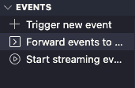
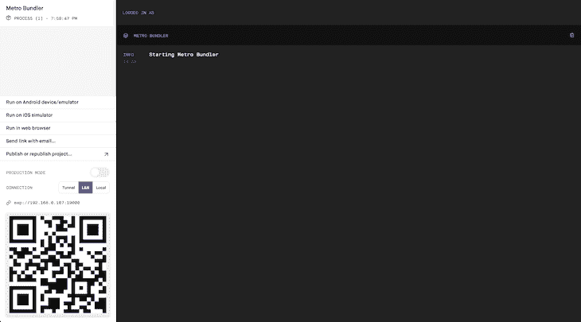
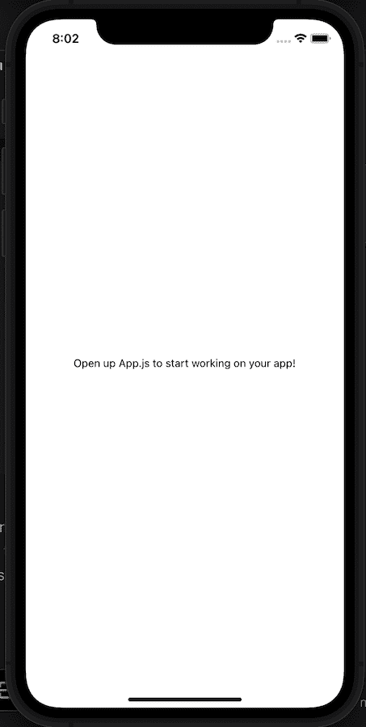
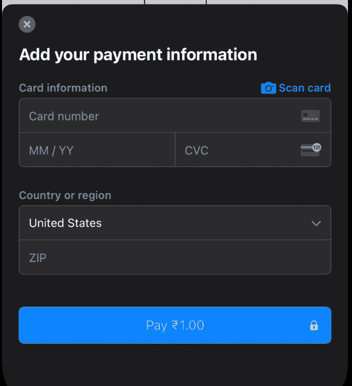

# 掌握 Stripe pay sheet in React Native with Expo-log rocket 博客

> 原文：<https://blog.logrocket.com/mastering-stripe-paymentsheet-react-native-expo/>

如今，在疫情期间，大多数人更喜欢在线支付，不仅因为它的非接触式安全预防措施，还因为它快速，简单，可靠。许多移动应用程序都整合了在线支付，如亚马逊、优步等。

说到在线支付，许多应用程序开发人员正在他们的 React 原生 Android 和 iOS 项目中使用 Stripe，因为 Stripe 提供了一种将支付系统集成到这个框架中的简单方法。我们有两个选项可以将 Stripe 集成到 React Native 中:PaymentSheet 或 Elements。

PaymentSheet 是 Stripe 预建的结账面板，用户可以在其中输入卡的详细信息并继续支付。元素稍微复杂一点；您可以更好地控制流程，因此您可以放置卡元素并负责继续付款。

在这篇文章中，我将讨论我对 PaymentSheet 的偏好，然后开始学习用 React Native、Expo 和 PaymentSheet 构建的示例捐赠应用程序的教程。

## 薪资单与传统要素法

以下是我认为 PaymentSheet 优于 Elements 的一些原因。

首先，元素需要大量的配置。因为你负责付款，所以你需要管理付款表格。这可能很复杂，因为不同的国家有不同的卡配置；例如，印度的信用卡不需要邮政编码，而在美国则需要。您需要考虑所有这些条件，并相应地在元素中管理它们。

然而，在 PaymentSheet 中，Stripe 已经为您配置了大部分这些东西。因此，如果卡号需要邮政编码，系统会自动提示用户添加邮政编码。此外，如果启用，PaymentSheet 支持 Apple Pay 和 Google Pay。

其次，元素需要大量的错误处理。另一方面，PaymentSheet 会为您处理错误，并提醒用户他们的支付方式有什么问题，这意味着您不必担心收款问题。

例如，如果卡的资金不足，Elements 要求您读取错误并显示给用户。但是当你使用 PaymentSheet 的时候，用户会被 Stripe 自动警告。你只需要处理后付款流程。

最后，在使用 Elements 时，您可能会忽略支付处理的一些隐私或法律要求。例如，您可能在不知不觉中存储了不应该存储的数据，比如用户的支付细节。

不同的国家有不同的关于数据隐私的法律，了解并遵守其中的每一条法律都会令人沮丧。PaymentSheet 确保您无需将任何数据保存到您的服务器，因为支付所需的所有通信都直接通过 Stripe 完成。这可以防止您意外违反数据隐私法。

## 构建捐赠应用程序

今天，我们将使用 [Expo 和 React Native](https://blog.logrocket.com/getting-started-with-react-native-and-expo-sdk/) 构建一个捐赠应用程序，使用 PaymentSheet 进行支付处理。我们还需要一个 Node.js 服务器来处理 Stripe 操作，比如启动支付，以及检测服务器上的任何支付。

以下是您应该具备的条件，以便跟进我们今天要做的项目:

*   安装在计算机上的节点
*   代码编辑器——我更喜欢 Visual Studio 代码
*   不定期账户
*   安装在您机器上的 [Stripe CLI](https://stripe.com/docs/stripe-cli)
*   Visual Studio 代码的条带扩展
*   节点和反应本地的工作知识

这里有到 GitHub 库的链接，以防你卡住了，想参考代码。

让我们开始享受乐趣吧！创建一个您选择的文件夹(在我的例子中，我将其命名为`expo-stripe`)作为我们的项目文件夹。

第一步是建立一个节点服务器，它将帮助我们启动支付。

## 创建 Node.js 服务器

在我们刚刚创建的`expo-stripe`文件夹中，创建一个名为`backend`的新文件夹。这是我们的节点后端项目将驻留的地方。

使用以下命令初始化一个节点项目，您将有一个准备好的`package.json`文件:

```
npm init -y

```

在终端的`backend`文件夹中运行以下命令，安装一些对服务器有帮助的依赖项:

```
npm install express cors stripe dotenv

```

Express 用于轻松制作一个带有 Node 的 REST API。它支持中间件的使用，并具有许多不同的特性；另外，它很容易使用。

`cors`包与 Express 一起使用是为了使与我们的服务器的通信更容易，并确保在向我们的服务器发送请求时不会抛出 CORS 错误。

`stripe`包帮助我们与 Stripe 服务(如我们的 Stripe 帐户)通信，以初始化支付或检查支付状态。

最后，`dotenv`包在我们的项目中设置了环境变量，这样我们就不必在代码中存储敏感数据，比如 Stripe secret key。我们可以将它保存在一个单独的`.env`文件中。

* * *

### 更多来自 LogRocket 的精彩文章:

* * *

现在，您可以在终端中使用以下命令启动服务器:

```
nodemon index

```

如果您没有安装`nodemon`，使用以下命令安装它:

```
npm install -g nodemon

```

## 获取我们的条纹密钥

在我们实际处理 Stripe 操作之前，让我们从 Stripe 获取我们的密钥。

打开您的 Stripe 仪表板，确保在侧边栏中勾选了**查看测试数据**。然后，点击**开发者**，再点击 **API 密匙**，你的 API 密匙就会出现。

记住要保密，不要与任何人分享，因为这会让他们访问你的 Stripe 帐户。我们现在不需要可发布的密钥，但我们稍后将在 React 本机应用程序中使用它。

复制密钥并返回到您的`backend`文件夹，创建一个名为`.env`的新文件。请按以下格式输入您的密钥:

```
STRIPE_SECRET_KEY=(secret key here)

```

## 初始化 Express 服务器并处理条带操作

在`backend`文件夹中创建一个名为`index.js`的新文件。这将是存储服务器主要逻辑的文件。

首先，让我们创建一个基本的服务器样板文件:

```
require("dotenv").config();
const express = require("express");
const app = express();
const Stripe = require("stripe");
const stripe = Stripe(process.env.STRIPE_SECRET_KEY);
const cors = require("cors");
const PORT = process.env.PORT || 5000;

app.use(express.json());
app.use(cors());

app.listen(PORT, () => console.log(`Server running on port ${PORT}`));

```

在上面的代码中，我们初始化了`dotenv`，它为我们初始化了环境变量。在我们的例子中，它是条带密钥。

然后我们初始化了一个 Express 应用程序，这样我们就可以创建一个 REST API，并且初始化了`stripe`来传递来自环境变量的密钥。我们还进口了 CORS，这样我们就可以用它来表达。

接下来，我们创建了一个名为`PORT`的变量。这将检查环境变量中是否提供了端口，如果没有，将在端口 5000 上运行。这通常与 Heroku 一起使用，因为 Heroku 使用自己的端口。

我们还实现了`app.use(express.json());`,这样我们的服务器可以接受 JSON 数据作为请求中的有效载荷。

## 创建支付内容

让我们创建一个 POST route ( `/donate`)，因为我们需要来自用户的一些数据，并且我们正在创建一个 PaymentIntent:

```
app.post("/donate", async (req, res) => {
  try {
    // Getting data from client
    let { amount, name } = req.body;
    // Simple validation
    if (!amount || !name)
      return res.status(400).json({ message: "All fields are required" });
    amount = parseInt(amount);
    // Initiate payment
    const paymentIntent = await stripe.paymentIntents.create({
      amount: Math.round(amount * 100),
      currency: "INR",
      payment_method_types: ["card"],
      metadata: { name },
    });
    // Extracting the client secret 
    const clientSecret = paymentIntent.client_secret;
    // Sending the client secret as response
    res.json({ message: "Payment initiated", clientSecret });
  } catch (err) {
    // Catch any error and send error 500 to client
    console.error(err);
    res.status(500).json({ message: "Internal Server Error" });
  }
});

```

在上面的代码中，我们从应用程序中获取`amount`和`name`，并对其进行验证。如果数据没有发送，我们将返回 400 错误。

然后，我们将金额转换为整数，以防将字符串形式的数字发送到服务器。这是因为我们只能将整数值传递给 Stripe。

接下来，我们创建一个 PaymentIntent 并传入要支付的金额(以最小的面额)、货币(我住在印度，所以对我来说是印度卢比；使用您在 Stripe 帐户中设置的货币)、支付方式以及包含用户姓名的元数据。

当我们在条带仪表板上检查事务时，您可以在元数据部分看到用户名。如果您想在付款中包含一些信息，以便以后查找，这真的很有帮助。

然后，我们从 PaymentIntent 中提取客户端机密，这有助于 React 本机应用程序上的 Stripe 实例识别付款并进行确认。

最后，我们将这个客户秘密发送回我们的应用程序，现在可以确认付款。

## 创建网页挂钩

为了在本地测试 Stripe webhooks，我们需要在 Visual Studio 代码中使用 Stripe 扩展来简化工作。请记住，在进入本节之前，您应该安装 Stripe CLI！

从侧边栏打开 Stripe 扩展，您应该会在顶部看到以下选项:



点击**将事件转发到本地机器**。输入 webhook 网址为`[http://localhost:5000/stripe](http://localhost:5000/stripe)`；我们一会儿将处理路线。如果系统提示您登录条带化并授权 CLI，请登录并重复该过程。

如果你看一下终端，你会得到一个测试 webhook 密钥。以下列格式复制并粘贴到`.env`文件中:

```
STRIPE_WEBHOOK_SECRET=(stripe webhook secret)

```

现在让我们创建一个路由来处理 Stripe webhook 请求。首先在我们之前做的 JSON 解析器前面加下面一行(Stripe 需要使用 raw body):

```
app.use("/stripe", express.raw({ type: "*/*" }));

```

现在我们可以着手处理路线:

```
app.post("/stripe", async (req, res) => {
  // Get the signature from the headers
  const sig = req.headers["stripe-signature"];
  let event;
  try {
    // Check if the event is sent from Stripe or a third party
    // And parse the event
    event = await stripe.webhooks.constructEvent(
      req.body,
      sig,
      process.env.STRIPE_WEBHOOK_SECRET
    );
  } catch (err) {
    // Handle what happens if the event is not from Stripe
    console.log(err);
    return res.status(400).json({ message: err.message });
  }
  // Event when a payment is initiated
  if (event.type === "payment_intent.created") {
    console.log(`${event.data.object.metadata.name} initated payment!`);
  }
  // Event when a payment is succeeded
  if (event.type === "payment_intent.succeeded") {
    console.log(`${event.data.object.metadata.name} succeeded payment!`);
    // fulfilment
  }
  res.json({ ok: true });
});

```

这里，我们从标头中获取 Stripe 签名，因为我们需要首先验证请求是由 Stripe 发出的，还是由伪装成 Stripe 的某个第三方发出的。

我们将使用`constructEvent`来对照存储在环境变量中的 webhook 秘密检查签名。如果请求来自第三方，将抛出一个错误，状态代码为 400。

现在，如果请求来自条带本身，事件将存储在`event`中。现在我们可以使用之前制作的 PaymentIntent 的`metadata`来检查`event.type`和用户的支付状态。如果您有任何付款后操作，可以在此处执行。

最后，我们添加一个响应，以便 Stripe 知道我们已经收到了他们的请求。

现在，我们的服务器已经设置好了，我们终于可以继续我们的 Expo 和 React 本地应用程序了。

## 使用 Expo 和 React Native 创建应用程序

回到你的项目文件夹(对我来说是`expo-stripe`)。如果您尚未安装 Expo CLI，请使用以下命令进行安装:

```
npm install -g expo-cli

```

现在，您可以使用 Expo 创建 React 本地应用程序。在终端中键入以下命令:

```
expo init rn-app

```

当出现选项提示时，选择第一个选项，这是一个带有托管工作流的空白 Expo 应用程序。这将创建一个名为`rn-app`的新文件夹，其中包含我们的 React 本地文件。

转到`rn-app`文件夹，键入以下命令，在 web 浏览器中启动开发工具:

```
npm start

```

这应该会自动启动您的浏览器，您应该会看到这样的屏幕:



使用左侧边栏中的任何选项运行应用程序。在我的情况下，我将使用 iPhone 模拟器。如果你在 Windows 机器上，你可能需要使用 Android 模拟器或者真实的物理设备。

运行后，您的模拟器应该会启动，您应该会看到应用程序:



现在，让我们为 Expo 安装 Stripe 包。Expo 使得将 Stripe 集成到 React Native 变得很容易，而无需接触本地项目文件。

在终端中键入以下命令来安装 [Stripe React Native](https://blog.logrocket.com/exploring-the-new-stripe-react-native-sdk/) 包:

```
expo install @stripe/stripe-react-native

```

记住我们使用的是`expo install`而不是`npm install`，因为 Expo 会为我们处理安装。

## 在 React Native 中配置条带

在配置 Stripe 之前，我强烈建议为 Visual Studio 代码安装 [ES7 Snippets 扩展](https://blog.logrocket.com/top-10-vs-code-extensions-2021/#:~:text=navigation%20and%20accessibility.-,3.%20Snippets,-Snippets%20are%20the),因为它会生成空白的组件样板。

创建名为`components`的新文件夹和名为`Checkout.js`的新文件。开始输入`rnfe`，选择代码片段，您将准备好一个组件。保存文件；我们一会儿就会用到它。

转到`App.js`并导入`Checkout`组件和`StripeProvider`:

```
import { StripeProvider } from "@stripe/stripe-react-native";
import Checkout from "./components/Checkout";

```

现在，你的 JSX 应该是这样的:

```
<View style={styles.container}>
  <StatusBar style="dark" />
  <StripeProvider publishableKey="(stripe publishable key here)">
    <Checkout />
  </StripeProvider>
</View>

```

请记住将您的 Stripe 可发布密钥放在 Stripe 仪表板中。我们将`Checkout`组件包装在`StripeProvider`中，这样我们就可以访问条带服务。

转到`Checkout.js`并为`name`和`amount`创建状态。我们还将使用 Stripe 挂钩与 Stripe 进行通信:

```
const [name, setName] = useState("");
const [amount, setAmount] = useState("1");
const stripe = useStripe();

```

默认名称为空，默认金额为 INR。

现在，让我们创建一个基本布局，并用文本框映射各州。你的 JSX 应该是这样的:

```
<View>
  <TextInput
    placeholder="Name"
    style={{ padding: 10, borderColor: "black", borderWidth: 1 }}
    value={name}
    onChangeText={(e) => setName(e)}
  />
  <TextInput
    placeholder="Amount"
    keyboardType="numeric"
    style={{ padding: 10, borderColor: "black", borderWidth: 1 }}
    value={amount}
    onChangeText={(e) => setAmount(e)}
  />
  <Button title="Donate" onPress={donate} />
</View>

```

创建一个名为`donate()`的函数，我们稍后会用到它:

```
const donate = async () => {};

```

生成的布局应该如下所示:


接下来，我们将处理`donate`函数:

```
const donate = async () => {
  try {
    const finalAmount = parseInt(amount);
    if (finalAmount < 1) return Alert.alert("You cannot donate below 1 INR");
    const response = await fetch("http://localhost:5000/donate", {
      method: "POST",
      headers: {
        "Content-Type": "application/json",
      },
      body: JSON.stringify({ amount: finalAmount, name }),
    });
    const data = await response.json();
    if (!response.ok) {
      return Alert.alert(data.message);
    }
    const initSheet = await stripe.initPaymentSheet({
      paymentIntentClientSecret: data.clientSecret,
    });
    if (initSheet.error) {
      console.error(initSheet.error);
      return Alert.alert(initSheet.error.message);
    }
    const presentSheet = await stripe.presentPaymentSheet({
      clientSecret: data.clientSecret,
    });
    if (presentSheet.error) {
      console.error(presentSheet.error);
      return Alert.alert(presentSheet.error.message);
    }
    Alert.alert("Donated successfully! Thank you for the donation.");
  } catch (err) {
    console.error(err);
    Alert.alert("Payment failed!");
  }
};

```

首先，我们将值从字符串转换成整数。然后，我们检查金额是否小于₹1 卢比。如果是这样，应用程序会发出警告，交易会暂停。

接下来，我们向我们的节点后端发出一个 HTTP POST 请求，以获取客户机机密。如果有任何错误，我们通过检查`response.ok`来处理它们。

然后，我们使用`initPaymentSheet()`函数初始化 PaymentSheet，并传递从后端获得的客户端秘密。我们再次使用`presentPaymentSheet()`提交 PaymentSheet，向它提供客户端秘密，并检查是否有任何错误。如果我们发现任何问题，就会向用户发送警报。

如果没有错误，您应该会得到一个“捐赠成功”的提示。当您点击“捐赠”按钮时，您将看到以下内容:



这是 Stripe 制作的工资单。从这里开始，一切都由 Stripe 处理，您不需要担心错误处理。

一旦支付成功，在运行节点服务器的控制台上就可以清楚地看到用户名。在生产环境中，您需要从 Stripe 仪表板手动创建一个 webhook，并使用实时密钥而不是测试密钥。

## 下一步是什么？

恭喜你！您已成功将 PaymentSheet 集成到您的 Expo 应用程序中。我想让你尽可能地玩这个。也许尝试使用苹果支付和谷歌支付以及支付单，我认为这将是一个很好的练习！

如果您面临任何挑战，您可以随时参考本文前面链接的 Github 资源库。

## [LogRocket](https://lp.logrocket.com/blg/react-native-signup) :即时重现 React 原生应用中的问题。

[](https://lp.logrocket.com/blg/react-native-signup)

[LogRocket](https://lp.logrocket.com/blg/react-native-signup) 是一款 React 原生监控解决方案，可帮助您即时重现问题、确定 bug 的优先级并了解 React 原生应用的性能。

LogRocket 还可以向你展示用户是如何与你的应用程序互动的，从而帮助你提高转化率和产品使用率。LogRocket 的产品分析功能揭示了用户不完成特定流程或不采用新功能的原因。

开始主动监控您的 React 原生应用— [免费试用 LogRocket】。](https://lp.logrocket.com/blg/react-native-signup)

## [LogRocket](https://lp.logrocket.com/blg/ecommerce-signup) :看看用户为什么不完成你的电子商务流程中的一个步骤的技术和 UX 原因。

[](https://lp.logrocket.com/blg/ecommerce-signup)

LogRocket 就像是一个网络和移动应用程序和网站的 DVR，记录你的电子商务应用程序上发生的一切。LogRocket 没有猜测用户不转化的原因，而是主动揭示了阻止你转化的根本原因，比如 JavaScript 错误或死点击。LogRocket 还可以监控应用的性能，报告客户端 CPU 负载、客户端内存使用等指标。

开始主动监控您的电子商务应用程序— [免费试用](https://lp.logrocket.com/blg/ecommerce-signup)。