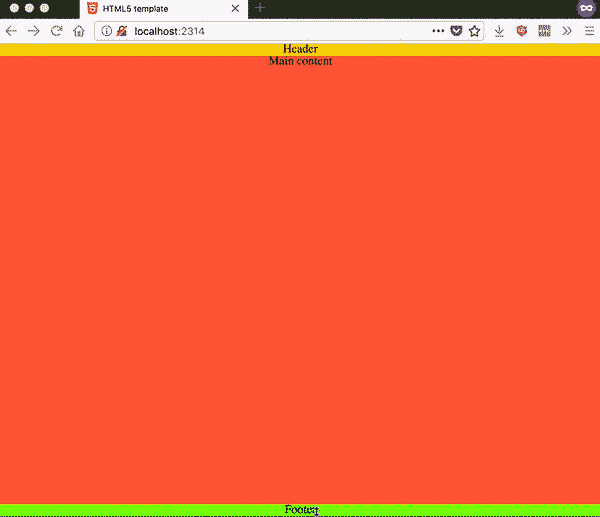
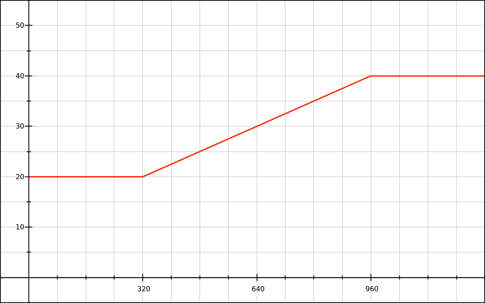
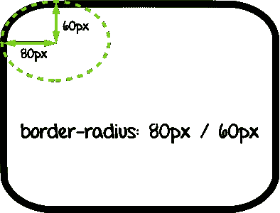
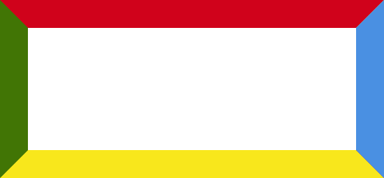
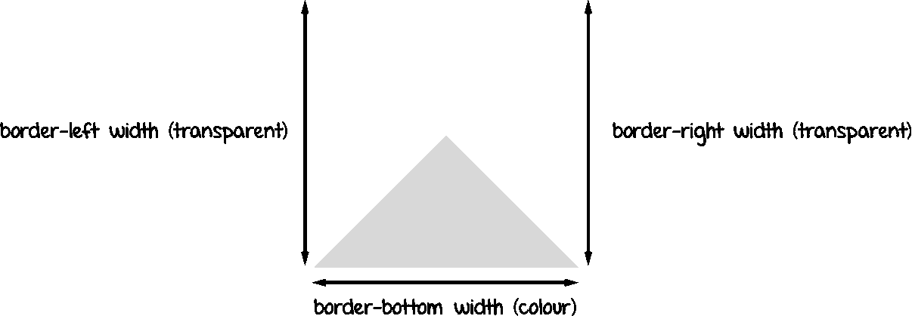
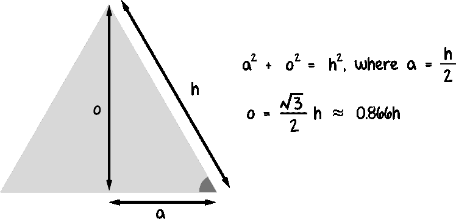

# 数学和前端:上下文比难度重要得多

> 原文：<https://blog.logrocket.com/math-and-front-end-context-is-so-much-more-important-than-degree-of-difficulty-6b689f999edc/>


如果你是那些想知道为什么你必须参加所有那些数学课并学习角度和代数的孩子之一，那么，我也是。我承认，我太不安分了，很容易厌倦，在课堂环境中成为一个好学生。但随着年龄的增长，我意识到某些数学原理实际上在我的日常工作中有实际应用(虽然不是微积分，我的意思是，我不是火箭科学家)。

你是否需要擅长数学才能成为一名优秀的 web 开发人员，这个问题可以归结为你对擅长数学的定义是什么。如果你对擅长数学的定义是指理解像分析或微积分这样的纯数学概念，涉及大量的证明和定理，那么我不得不承认，你在网页设计/开发中没有用到那些技能。

虽然所需的实践技能可能是高中水平，但这是一个在网页设计中应用算术技能和几何知识的问题。

例如，使用边界宽度黑客创建三角形既涉及浏览器如何渲染边界的知识，也涉及三角学的应用，以实现该属性是“可黑客攻击的”。

所以让我们来看看 web 开发中数学可以派上用场的一些方面。

### 算术

> 算术是数学的一个分支，研究计数(和整数)数和分数的性质以及应用于这些数的基本运算。亚历山大·博戈莫尔尼

这看起来是不起眼的基础，但是如果你正在做任何类型的响应式设计，老实说，响应式设计是当今的标准，算术与你完全相关。

你可能会问，算术和设计有什么关系？很多。但在此之前，让我们先谈谈 CSS 的单位和值，因为这是我们将要计算的。

数字在 CSS 中占很大比重，主要是作为属性值。涵盖这一点的规范是 [CSS 值和单位模块级别 3](https://www.w3.org/TR/css-values-3/) 。CSS 算法背后的关键函数是`calc()`函数，它支持加、减、乘、除四种基本运算。

早在网页设计大多是固定宽度的时候，设计师和开发人员会制作像素级的完美设计，只有在特定的视口宽度下才能工作。但随着用户用来浏览网页的不同屏幕尺寸的数量呈指数级增长，固定宽度的设计不再真正符合要求。

更有意义的做法是让浏览器根据视窗大小来计算页面上元素的大小，使用百分比、字体相关单位如`*em*` s 或`*ch*` s，以及最近的视窗单位。`calc`函数处理不同单元的 CSS 值的组合，为我们处理棘手的计算，这样我们就可以专注于设计和构建我们想要的布局和组件。

[](https://logrocket.com/signup/)

#### 浮动页脚问题

许多设计中的一个常见要求是，即使没有足够的内容来填充视口的高度，也要确保页脚“粘”在视口的底部。

现在，有几种不同的方法可以达到这样的效果，但是使用`calc`足够优雅，可以确保当没有足够的内容时页脚不会浮动，但仍然保留在文档流中。

这里有一些非常基本的标记，由一个`header`、`main` 和`footer` 元素组成。

```
<header>Header</header>
<main>Main</main>
<footer>Footer</footer>
```

为了确保页脚停留在页面的底部，而不管`main`元素中的内容量如何，`main`元素的最小高度需要是视窗高度减去页眉和页脚高度的 100%,或者:

```
100% viewport height – ( height of header + height of footer)
```

将其转换为 CSS(假设浏览器样式已经重置):

```
main {
  min-height: calc(100vh - 2em);
}
```

如果没有额外的样式，页眉和页脚的高度都应该是`1em`，因为其中包含文本。使用`min-height`而不是`height`可以确保如果内容超过了视窗的高度，它会正常流动。



The footer is always at the bottom of the viewport

#### 流畅的排版

当我们谈到响应式设计这个话题时，让我们也用一些数学知识来计算不同视口宽度的字体大小。字体大小可以不仅仅使用`px` 或`em` 单位，我们也可以使用视口单位来定义字体大小。这种方法的一个问题是，如果视窗变得太小，您的字体可能会缩小到难以辨认的大小。

为了解决这个问题，我们可以使用`calc`来提供最小字体大小，如下例所示:

```
body { font-size: calc(1em + 1vw) }
```

如果你确实需要对字体大小有更多的控制，那么更多的变量需要加入到这个等式中。精确流畅字体大小的概念是由[迈克·里思穆勒](https://www.madebymike.com.au/)在他的文章[中首创的，这篇文章的标题是](https://www.madebymike.com.au/writing/precise-control-responsive-typography/)对反应式排版的精确控制，并且是由[蒂姆·布朗](http://tbrown.org/)提出的[熔化领先](http://nicewebtype.com/notes/2012/02/03/molten-leading-or-fluid-line-height/)思想的延伸。

Mike Riethmuller 的方程式大概是这样的:


Florens Verschelde 在他的文章[CSS 锁的数学](https://fvsch.com/code/css-locks/)中深入研究了 CSS 锁背后的数学，将字体大小/行高的计算表示为一个线性函数。线性函数可以绘制在图表上，这使得可视化字体大小/行高与视口大小之间的关系更加容易。



*Graph from* [*The math of CSS locks*](https://fvsch.com/code/css-locks/) *by* [*Florens Verschelde*](https://fvsch.com/)

### 几何学

> 几何学是数学的一个分支，它研究几何对象的结构特性——点、(直)线和圆是其中最基本的。
> ————[——*——*——](https://www.cut-the-knot.org/WhatIs/WhatIsGeometry.shtml)

#### 使用 CSS 绘制形状

几何学有助于理解如何只用 CSS 创建形状。让我们以简单的`border-radius`属性为例，它用于对元素的外部边框进行圆角处理。我们大多数人只是输入一个值，然后就结束了，但是`border-radius`属性要稍微复杂一些。

`border-radius`其实是所有 4 个`border-*-radius`属性的简称，其中`*`指的是`top-left`、`top-right`、`bottom-left`或者`bottom-right`。它最多可以取 2 个值，用一个`/`分隔，其中第一个值是水平半径，第二个值是垂直半径。这里有一个用于可视化的图表:



当我们使用百分比作为值时，水平半径将是边框的**宽度**的百分比，而垂直半径将是边框的**高度**的百分比。这就是为什么设置一个`border-radius: 50%`给我们一个完美的圆或椭圆。

转到更有趣的东西，但也需要边界，我们有三角形。纯 CSS 三角形是通过“侵入”元素的边界而成为可能的。当我们在一个元素周围创建边框时，这些边框的边缘对角相交，如果我们对元素应用足够厚的边框宽度，我们可以看到这一点。它们是梯形。



如果我们将元素的宽度和高度设置为 0，梯形就变成了三角形，瞧，我们得到了纯 CSS 三角形。

* * *

### 更多来自 LogRocket 的精彩文章:

* * *


假设我们不想要四个一组的三角形，这可能是通常的情况，其他三个边界应该是不可见的，通过将相邻边界的颜色设置为`transparent` 并完全省略对面的边界。

```
.triangle-up {
  width: 0;
  height: 0;
  border-left: 30px solid transparent;
  border-right: 30px solid transparent;
  border-bottom: 30px solid gray; 
}
```



也许我们并不总是想要等腰三角形(这是通过将所有边框宽度设置为相同值得到的)，所以一些几何图形开始发挥作用。方便的[勾股定理](https://en.wikipedia.org/wiki/Pythagorean_theorem)可以用来计算三角形的高度应该是这样的:



```
.triangle-up {
  width: 0;
  height: 0;
  border-left: 50px solid transparent;
  border-right: 50px solid transparent;
  border-bottom: calc(100px * 0.866) solid gray; 
}
```

### 包扎

数学可能看起来与网页设计和开发的创造性视觉方面相去甚远，但它确实有许多实际应用，所以为什么不刷掉你的高中数学课本，看看是否有什么可以启发你以你以前从未想到的方式探索 CSS？

## 你的前端是否占用了用户的 CPU？

随着 web 前端变得越来越复杂，资源贪婪的特性对浏览器的要求越来越高。如果您对监控和跟踪生产环境中所有用户的客户端 CPU 使用、内存使用等感兴趣，

[try LogRocket](https://lp.logrocket.com/blg/css-signup)

.

[](https://lp.logrocket.com/blg/css-signup)[https://logrocket.com/signup/](https://lp.logrocket.com/blg/css-signup)

LogRocket 就像是网络和移动应用的 DVR，记录你的网络应用或网站上发生的一切。您可以汇总和报告关键的前端性能指标，重放用户会话和应用程序状态，记录网络请求，并自动显示所有错误，而不是猜测问题发生的原因。

现代化您调试 web 和移动应用的方式— [开始免费监控](https://lp.logrocket.com/blg/css-signup)。