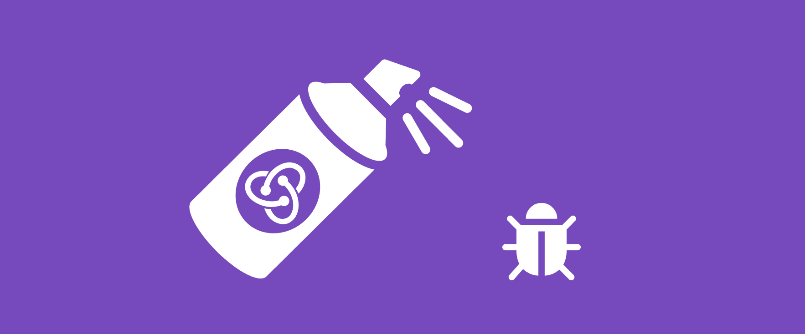
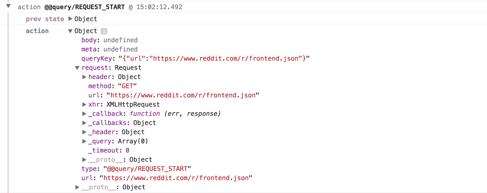
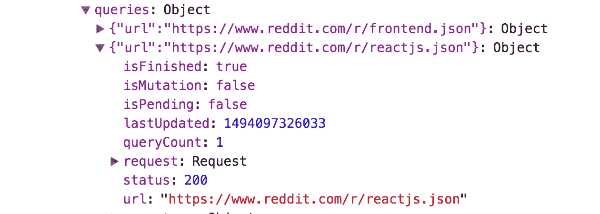

# 使用 Redux - LogRocket 博客最大化可调试性

> 原文：<https://blog.logrocket.com/maximizing-debuggability-with-redux-79b2ad07b64c/>

# 使用 Redux 最大化可调试性

## 

2017 年 5 月 8 日 2 分钟阅读 574



在我的上一篇博客文章 [Redux 登录生产](https://blog.logrocket.com/redux-logging-in-production-3b2a4816b713)中，我讨论了使用 Redux 最重要的好处之一——可调试性。通过使用像 LogRocket 这样的前端日志工具，开发人员可以通过检查导致 bug 的`actions`和`state`变更，轻松理解并修复产品中棘手的 bug。

虽然这些信息在任何 Redux 应用程序中都非常有用，但是通过设计一个考虑到日志的应用程序，我们还可以实现更多。在这篇文章中，我将介绍一些库和抽象，它们通过将尽可能多的应用程序数据放入 Redux，使 Redux 日志*更加有用。*

### 数据提取

通过网络获取/发送数据是任何应用程序中最容易出错的部分之一。连接、意外数据或不正确的逻辑都可能导致问题。轮询、重试逻辑、乐观突变等使事情变得更加复杂。

像 GraphQL 的 **apollo-client** 和 REST 的 **redux-query** 这样的库都有助于通过 redux 从网络获取数据。它们使用 Redux 作为持久层，这意味着在调试问题时，您可以检查您的 Redux 日志，以查看这些客户端获取了哪些数据以及正在进行的请求的状态。

让我们看看 redux-query 生成的 Redux 日志:



这里我们看到了`REQUEST_START`动作，它对应于一个被初始化的查询。查看 action 有效负载，我们可以看到请求中的所有信息，这使得调试变得很容易。一旦收到响应，`redux-query`就会发出一个`REQUEST_SUCCESS`动作，包含关于响应的所有信息。

记录请求和响应只是`redux-query`魔力的一部分。深入到`store`我们看到一个键`queries`，在那里`redux-query`保持其内部状态。



上面，我们看到了应用程序执行的每个查询的对象(一个到`reddit.com/r/frontend.json`，一个到`reddit.com/r/reactjs.json`)。在调试问题时，我们可以深入这个状态对象，查看正在进行的请求、`queryCount`(如果我们对查询进行轮询)和计时的信息。

在 Redux 中存储这些信息非常重要，因为它将所有网络活动的完整上下文放在 Redux 日志中。

[](https://logrocket.com/signup/)

#### 滚动您自己的数据获取“框架”

如果您喜欢更简单的方法，您可以通过在查询和从网络接收数据时简单地分派显式操作来构建自己的数据获取“框架”。

例如，假设我们正在构建一个博客应用程序。在查询帖子时，我们会调度`POSTS_QUERY_INIT`。然后，缩减器可以适当地更新状态，以表明 posts 查询正在进行中。

```
postsQuery: {
  url: 'api.blog.com/posts',
  isPending: true,
  ...
}
```

在`thunk`或`saga`中，我们会调用`fetch`，当承诺完成时，我们会发出类似`POSTS_QUERY_SUCCESS`或`POSTS_QUERY_FAILURE`的动作。这将相应地将状态更新为:

```
postsQuery: {
  url: 'api.blog.com/posts',
  isPending: true,
  data: [...],
}
```

这个例子并不全面，但是它的思想是，通过为请求生命周期的每个部分显式地使用 Redux 操作，可以很容易地调试任何潜在的竞争条件或网络错误。

### TL；速度三角形定位法(dead reckoning)

使用通过 Redux 处理数据的库和模式，通过留下丰富的审计线索，有助于构建更多可调试的应用程序。

当设计一个新特性时，问问自己它是否容易出错，以及能够在 Redux 日志中查看它的状态是否有助于解决未来的 bug。

## 使用 [LogRocket](https://lp.logrocket.com/blg/signup) 消除传统错误报告的干扰

[](https://lp.logrocket.com/blg/signup)

[LogRocket](https://lp.logrocket.com/blg/signup) 是一个数字体验分析解决方案，它可以保护您免受数百个假阳性错误警报的影响，只针对几个真正重要的项目。LogRocket 会告诉您应用程序中实际影响用户的最具影响力的 bug 和 UX 问题。

然后，使用具有深层技术遥测的会话重放来确切地查看用户看到了什么以及是什么导致了问题，就像你在他们身后看一样。

LogRocket 自动聚合客户端错误、JS 异常、前端性能指标和用户交互。然后 LogRocket 使用机器学习来告诉你哪些问题正在影响大多数用户，并提供你需要修复它的上下文。

关注重要的 bug—[今天就试试 LogRocket】。](https://lp.logrocket.com/blg/signup-issue-free)