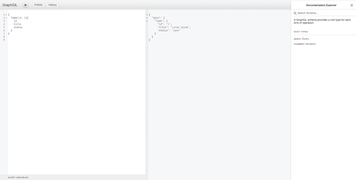

# 用 json-graphql-server 模仿 GraphQL API

> 原文：<https://blog.logrocket.com/mocking-graphql-api-server-using-json-graphql-server/>

# 用 json-graphql-server 嘲笑 GraphQL 应用编程接口

## 

2020 年 9 月 16 日 2 分钟阅读 643

API 模仿是创建真实 API 服务器的模拟的实践，这样您就可以对请求提供真实的响应。Mocks 模拟真实 API 的行为，但是以更可控的方式，将模式与数据类型、对象和数组相匹配。

## 为什么要嘲笑？

当实时数据不可用或不可靠时，API mocking 是快速原型化和测试前端应用程序的好方法。如果后端和前端开发是并行进行的，那么可以使用模拟 API 同时对它们进行处理，这样真实 API 的缺失不会停止前端的开发。

API 模拟使前端工程师能够使用与 [API 合同](https://www.quora.com/What-is-an-API-contract-and-who-should-create-it-when-building-a-set-of-APIs)中规定的最终生产 API 相同的数据来使用 API。通过在开发真正的 API 之前使用模拟 API，后端工程师可以识别不足之处，而无需花费工程时间来开发可能会或可能不会发布到产品中的功能。这种快速反馈循环有助于提高工程团队的效率。

您可以使用 API mocking 在本地运行测试，而无需连接到真正的后端，这样会更快、更安全。如果您有一个为每个新部署运行测试的持续集成/持续部署(CI/CD)管道，您可能不希望等待对外部 API 的几次实时调用。模拟 API 服务器可以返回所需的结果，因此您可以对代码进行单元测试。

您还可以使用模拟 API 来模拟您无法控制的外部 API 的行为。例如，当您没有连接到互联网时，API 服务器可以用来提供公共 API 的虚假结果，甚至为他们的提供商要求您购买的服务提供模拟数据响应。

对于编写 GraphQL API 模拟，有许多开源工具可用。一些流行的解决方案包括:

让我们放大一下 GraphQL API 模拟中最流行、最有用的工具之一:json-graphql-server。

## json 图形 SQL 服务器

json-graphql-server 是一个测试和模仿 graphql 的工具，它对你的数据进行 json。它在 30 秒内生成了一个完整的假 GraphQL API，零编码。

要安装 json-graphql-server，请运行以下命令。

```
npm install -g json-graphql-server

```

在项目的根文件夹中创建一个`graphql-server.json`文件，并在其中添加一个 JSON 对象。这些值应该是实体的列表——也就是至少有一个`id`键的值对象的数组。

```
{
  "todo": [
    {
      "id": 1,
      "title": "Lorem Ipsum",
      "status":"open"
    },
    {
      "id": 2,
      "title": "Sic Dolor amet",
      "status":"open"
    }
  ],
  "users": [
    {
      "id": 123,
      "name": "John Doe"
    },
    {
      "id": 456,
      "name": "Jane Doe"
    }
  ],
  "done": [
    {
      "id": "foo",
      "name": "Foo",
      "status":"completed"
    },
    {
      "id": "bar",
      "name": "Bar",
      "status":"completed"
    }
  ]
}

```

在本地主机端口 5000 上启动 GraphQL 服务器。

```
json-graphql-server graphql-server.json --p 5000

```

如果不添加标志`--p <port number>`，服务器将使用默认端口 3000 启动。

您现在可以通过`http:localhost:5000/graphql`访问 GraphQL API 并执行 GraphQL 查询。

```
{
  Todo(id: 1){
    id
    title
    status
  }
}

```

上面的查询将产生以下响应。

```
{
  "data": {
    "Todo": {
      "id": "1",
      "title": "Lorem Ipsum",
      "status": "open"
    }
  }
}

```

JSON GraphQL 服务器是支持 GraphQL 的，这意味着它包括一个可以进行 GraphQL 查询和变化的平台。



### 在 Apollo 客户机上使用 json-graphql-server

```
import { ApolloClient, InMemoryCache } from '@apollo/client';
import { gql } from '@apollo/client'

// setup Apollo Client
const client = new ApolloClient({
  uri: 'http://localhost:5000/graphql',
  cache: new InMemoryCache()
});

//  make a query
client
  .query({
    query: gql`
      query Todo($id: ID!) {
        Todo(id: $id) {
          id
          title
          status
        }
      }
    `,
  variables: {id: 1}
  })
  .then(result => console.log(result));

```

## 结论

在本指南中，我们概述了如何将 JSON GraphQL 服务器用于 Apollo 客户端。查看文档，了解如何使用 Node、browser fetch、XMLHttpRequest 和 webpack。也可以使用假数据生成器来填充`graphql-server.json`，例如 [faker](https://www.npmjs.com/package/faker) 和 [Chance](https://chancejs.com/index.html) 。

## 监控生产中失败和缓慢的 GraphQL 请求

虽然 GraphQL 有一些调试请求和响应的特性，但确保 GraphQL 可靠地为您的生产应用程序提供资源是一件比较困难的事情。如果您对确保对后端或第三方服务的网络请求成功感兴趣，

[try LogRocket](https://lp.logrocket.com/blg/graphql-signup)

.

[](https://lp.logrocket.com/blg/graphql-signup)[https://logrocket.com/signup/](https://lp.logrocket.com/blg/graphql-signup)

LogRocket 就像是网络和移动应用的 DVR，记录下你网站上发生的每一件事。您可以汇总并报告有问题的 GraphQL 请求，以快速了解根本原因，而不是猜测问题发生的原因。此外，您可以跟踪 Apollo 客户机状态并检查 GraphQL 查询的键值对。

LogRocket 检测您的应用程序以记录基线性能计时，如页面加载时间、到达第一个字节的时间、慢速网络请求，还记录 Redux、NgRx 和 Vuex 操作/状态。

[Start monitoring for free](https://lp.logrocket.com/blg/graphql-signup)

.