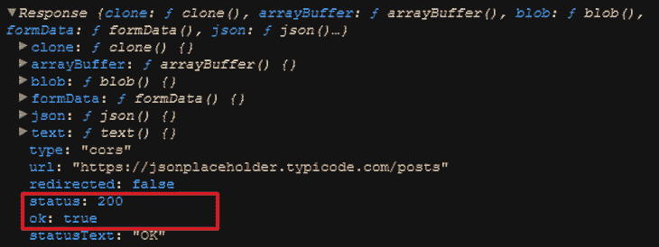
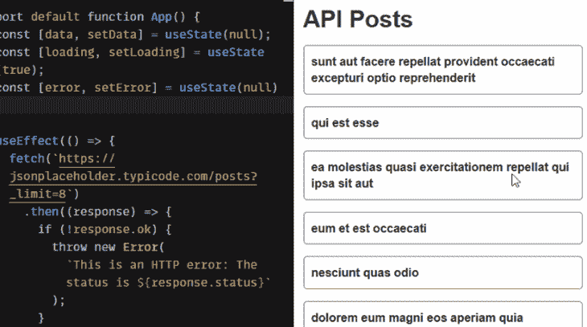
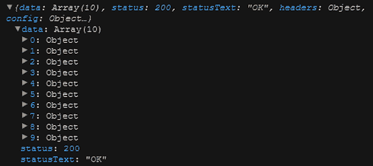
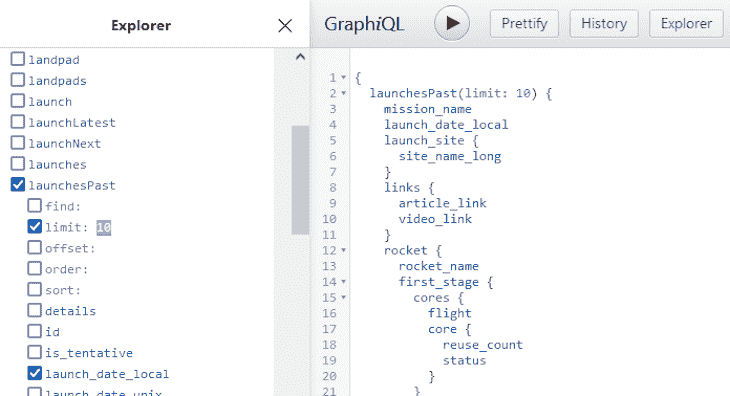
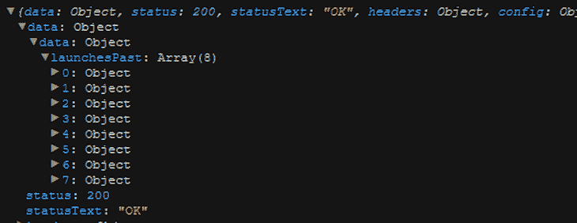
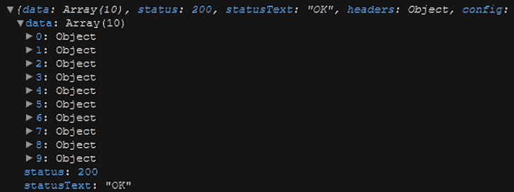

# React 中的现代 API 数据获取方法

> 原文：<https://blog.logrocket.com/modern-api-data-fetching-methods-react/>

了解如何将数据提取到 React 应用程序中，对于每个旨在构建现代真实 web 应用程序的 React 开发人员来说都是必不可少的。

在本指南中，我们将介绍现代的 React 数据获取方法，并学习如何在获取数据时处理应用程序的状态。此外，我们将讨论当数据出错时如何处理应用程序的状态。

这一定会很有趣。要跟进，请确保您熟悉 React。

## 从 React 应用程序中的 API 获取数据

React 初学者可能会想，“API 到底是什么？”为了理解什么是应用程序编程接口(API ),让我们考虑一个应用程序，其中一个部分显示当前城市的每日天气预报。

在构建这种类型的应用程序时，我们可以创建后端来处理天气数据逻辑，或者我们可以简单地让我们的应用程序与拥有所有天气信息的第三方系统进行通信，因此我们只需要呈现数据。

无论哪种方式，应用程序都必须与后端通信。这种通信可以通过 API 实现，在这种情况下，可以通过 web API 实现。

顾名思义，API 公开了我们的应用程序用来访问数据的接口。有了 API，我们不需要从头开始创建一切，简化了我们的过程。我们只需要访问数据所在的位置，就可以在我们的应用程序中使用它。

设计 web APIs 的两种常见风格是 REST 和 GraphQL。虽然本指南关注的是从 REST API 获取数据，但两者的获取策略是相似的。好吧，我们还将看到一个如何从 GraphQL API 获取数据的例子😊。

## 提取数据前的注意事项

当我们请求数据时，我们必须准备一个状态来存储返回的数据。我们可以将它存储在一个类似 Redux 的[状态管理工具中，或者存储在一个上下文对象中。但是，为了简单起见，我们将返回的数据存储在 React 本地状态中。](https://blog.logrocket.com/redux-isnt-dead/)

接下来，如果数据没有加载，我们必须提供一个状态来管理加载阶段以改善用户体验，并提供另一个状态来管理错误。这给了我们三个状态变量，如下所示:

```
const [data, setData] = useState(null);
const [loading, setLoading] = useState(true);
const [error, setError] = useState(null);

```

这里，我们给出了状态的默认值。

### `useEffect`钩子

当我们请求从后端获取数据时，我们执行了一个副作用，这是一个可以为相同的数据获取生成不同输出的操作。例如，同一个请求返回成功或错误。

在 React 中，我们应该避免直接在组件体内执行副作用，以避免不一致。相反，我们可以使用 `[useEffect](https://blog.logrocket.com/guide-to-react-useeffect-hook/)` [钩子](https://blog.logrocket.com/guide-to-react-useeffect-hook/)将它们从渲染逻辑[中分离出来。](https://blog.logrocket.com/guide-to-react-useeffect-hook/)

在这种情况下，我们将在钩子中获取数据，如下所示:

```
useEffect(() => {
 // data fetching here
}, []);

```

上面的实现将在组件挂载上运行并获取数据，也就是说，在第一次渲染时。这对我们的大多数用例来说已经足够了。

然而，在其他场景中，当我们需要在第一次渲染后重新提取数据时，我们可以在数组文字中添加依赖项来触发`useEffect`的重新运行。

现在我们已经介绍了基础知识，我们可以开始学习第一个获取方法了。

## 使用 JavaScript 获取 API

通过`fetch()`方法的 Fetch API 允许我们向后端发出 HTTP 请求。通过这种方法，我们可以使用 HTTP 方法执行不同类型的操作，比如使用`GET`方法从端点请求数据，使用`POST`方法向端点发送数据，等等。

因为我们正在获取数据，所以我们的重点是`GET`方法。

`fetch()`需要我们要获取的资源的 URL 和一个可选参数:

```
fetch(url, options)

```

我们还可以在可选参数中指定 HTTP 方法。对于`GET`方法，我们有以下内容:

```
fetch(url, {
  method: "GET" // default, so we can ignore
})

```

或者，我们可以简单地忽略可选参数，因为`GET`是默认值:

```
fetch(url)

```

如前所述，我们将从 REST API 获取数据。我们可以使用任何 API，但是这里我们将使用一个名为 JSONPlaceholder 的免费在线 API [来将一个帖子列表提取到我们的应用程序中；这里是我们可以请求的资源列表](https://jsonplaceholder.typicode.com/posts)

通过应用我们目前所学的知识，典型的`fetch()`请求如下所示:

```
import { useState, useEffect } from "react";

export default function App() {
 const [data, setData] = useState(null);
 const [loading, setLoading] = useState(true);
 const [error, setError] = useState(null);

 useEffect(() => {
  fetch(`https://jsonplaceholder.typicode.com/posts`)
   .then((response) => console.log(response));
 }, []);

 return <div className="App">App</div>;
}

```

在代码中，我们使用`fetch()`方法从资源端点请求 post 数据，如`useEffect`钩子所示。该操作返回一个可以解决或拒绝的承诺。

如果它解决了，我们使用`.then()`处理响应。但是在这个阶段，返回的数据是一个`Response`对象，这不是我们实际需要的格式，尽管它对检查 HTTP 状态和处理错误很有用。

请注意，我们已经记录了响应。在控制台中查看[我们得到的回报:](https://codesandbox.io/s/interesting-sid-r8kue?file=/src/App.js)



记下`Response`的`OK`状态；我们稍后将使用它来检查不成功的 HTTP 调用。

接下来，我们必须使用`json()`方法将`Response`对象解析为 JSON 格式。这也是一个承诺，从这里，我们可以决定获得我们需要的实际数据:

```
useEffect(() => {
  fetch(`https://jsonplaceholder.typicode.com/posts`)
    .then((response) => response.json())
    .then((actualData) => console.log(actualData));
}, []);

```

现在，我们有一个从 API 获取的 100 个帖子的列表。在这个 CodeSandbox 中打开[控制台查看数据。](https://codesandbox.io/s/magical-rgb-qpnvp?file=/src/App.js)

如果承诺被拒绝，我们将像这样使用`.catch()`处理错误:

```
useEffect(() => {
 fetch(`https://jsonplaceholder.typicode.com/posts`)
  .then((response) => response.json())
  .then((actualData) => console.log(actualData))
  .catch((err) => {
   console.log(err.message);
  });
}, []);

```

注意，从`fetch()`方法返回的承诺仅在网络故障时拒绝；如果我们碰到一个错误的或者不存在的端点，比如`…/postssss`，它不会拒绝。在这种情况下，`.catch()`不会捕捉到那个错误，所以我们必须手动处理它。

前面我们看到了`Response`对象如何返回 HTTP 状态。如果我们到达了正确的端点，则`OK`状态为`true`，否则返回`false`。通过检查该状态，我们可以为“404 Not Found”编写一个自定义错误消息，如下所示:

```
if (!response.ok) {
  throw new Error(
    `This is an HTTP error: The status is ${response.status}`
  );
}

```

并且，`useEffect`钩子现在看起来像这样:

```
useEffect(() => {
  fetch(`https://jsonplaceholder.typicode.com/posts`)
    .then((response) => {
      if (!response.ok) {
        throw new Error(
          `This is an HTTP error: The status is ${response.status}`
        );
      }
      return response.json();
    })
    .then((actualData) => console.log(actualData))
    .catch((err) => {
      console.log(err.message);
    });
}, []);

```

在代码块中，我们检查`R``esponse`的`OK`状态是否是`false`，这意味着我们有一个`404`状态，然后抛出我们的自定义错误消息。

当我们在`.then()`块中抛出一个错误时，`.catch()`会检测并使用我们的自定义消息，只要我们遇到“404 Not Found”

### 在前端渲染帖子

目前，我们在控制台中有帖子。相反，我们希望在我们的应用程序中呈现它们。为了做到这一点，为了简洁起见，我们首先将帖子总数限制为`8`而不是返回的`100`个帖子。

我们可以通过向请求 URL 追加一个查询字符串参数(`?_limit=8`)来做到这一点:

```
fetch(`https://jsonplaceholder.typicode.com/posts?_limit=8`)

```

接下来，我们必须更新状态并呈现 UI:

```
// ...

export default function App() {
  // ...

  useEffect(() => {
    fetch(`https://jsonplaceholder.typicode.com/posts?_limit=8`)
      .then((response) => {
        // ...
      })
      .then((actualData) => {
        setData(actualData);
        setError(null);
      })
      .catch((err) => {
        setError(err.message);
        setData(null);
      })
      .finally(() => {
        setLoading(false);
      });
  }, []);

  return (
    <div className="App">
      <h1>API Posts</h1>
      {loading && <div>A moment please...</div>}
      {error && (
        <div>{`There is a problem fetching the post data - ${error}`}</div>
      )}
      <ul>
        {data &&
          data.map(({ id, title }) => (
            <li key={id}>
              <h3>{title}</h3>
            </li>
          ))}
      </ul>
    </div>
  );
}

```

在代码中，我们分别使用`setData`和`setError`更新状态数据和错误消息。我们还添加了在承诺完成时运行的`.finally`块。

这是一个消除负载效应的好地方。注意，我们分别重置了`.then()`和`.catch()`中的错误和数据，这防止了临时服务器故障的不一致性。

参见 CodeSandbox 上的[项目；我们还添加了一些样式来改善视觉效果。](https://codesandbox.io/s/modest-sound-kux2y?file=/src/App.js)



## 使用`async` / `await`语法

前面的方法解释了使用 pure promise 语法获取数据。在这里，我们将学习一种使用`async` / `await`获取数据的更优雅的方法。

当我们发出请求并期望得到响应时，我们可以在函数前面添加`await`语法来等待，直到承诺得到结果。但是，要使用这种语法，我们必须在典型的 JavaScript 代码中在`async`函数内部调用它。

在`fetch``()`的例子中，语法看起来是这样的:

```
useEffect(() => {
  async function getData() {
    const response = await fetch(
      `https://jsonplaceholder.typicode.com/posts?_limit=10`
    )

    console.log(response)
  }
  getData()
}, [])

```

在代码中，我们使用`await`来等待来自`fetch()`的承诺。记住，我们需要`json()`格式的数据，所以我们也要等待:

```
useEffect(() => {
  async function getData() {
    const response = await fetch(
      `https://jsonplaceholder.typicode.com/posts?_limit=10`
    )
    let actualData = await response.json();

    console.log(actualData) 
  }
  getData()
}, [])

```

注意，我们没有像在前面的方法中那样链接`.then`。不过用`.then()`搭配`async` / `await`就可以了:

```
useEffect(() => {
  async function getData() {
    const actualData = await fetch(
    `https://jsonplaceholder.typicode.com/posts?_limit=10`
    ).then(response => response.json());

    console.log(actualData) 
  }
  getData()
}, [])

```

在实践中，我们经常使用带有`try` / `catch` / `finally`语句的`async` / `await`来捕捉错误并管理加载状态。这类似于在前面的方法中使用`.then`、`.catch`和`.finally`:

```
useEffect(() => {
  const getData = async () => {
    try {
      const response = await fetch(
        `https://jsonplaceholder.typicode.com/posts?_limit=10`
      );
      if (!response.ok) {
        throw new Error(
          `This is an HTTP error: The status is ${response.status}`
        );
      }
      let actualData = await response.json();
      setData(actualData);
      setError(null);
    } catch(err) {
      setError(err.message);
      setData(null);
    } finally {
      setLoading(false);
    }  
  }
  getData()
}, [])

```

上面的代码类似于前面的方法。这里，当在`try`块中发生错误时，`catch`语句捕获并控制错误。

参见 CodeSandbox 中的[项目。](https://codesandbox.io/s/agitated-haze-j9yc3?file=/src/App.js)

## 使用 Axios 库

Axios 是一个基于 promise 的 HTTP 客户端，它连接到一个端点。在本节中，我们将使用它从端点获取 post 数据。与`fetch()`方法不同，从这个库返回的响应包含我们需要的 JSON 格式。

它还具有健壮的错误处理的优点，所以我们不需要像前面使用`fetch()`方法那样检查并抛出错误。

要使用 Axios，我们必须安装它:

```
npm install axios

```

一旦我们将它导入我们的应用程序，就像这样:

```
import axios from "axios"

```

然后我们可以用它来执行一个`GET`请求:

```
const response = await axios.get(
  `https://jsonplaceholder.typicode.com/posts?_limit=10`
);

console.log(response)

```

库返回一个包含我们需要的数据的对象。



我们可以用`response.data`从`data`属性中访问数据。最后，我们的代码看起来像这样:

```
useEffect(() => {
  const getData = async () => {
    try {
      const response = await axios.get(
        `https://jsonplaceholder.typicode.com/posts?_limit=10`
      );
      setData(response.data);
      setError(null);
    } catch (err) {
      setError(err.message);
      setData(null);
    } finally {
      setLoading(false);
    }
  };
  getData();
}, []);

```

与`fetch()`方法相比，这更简单明了，你可以在 [CodeSandbox 项目](https://codesandbox.io/s/gracious-khayyam-o7omo?file=/src/App.js)中看到它的工作。

在我们进入下一个方法之前，让我们快速地看一下从 GraphQL API 端点获取数据。请记住，到目前为止，我们一直在使用 REST API。

### 从 GraphQL API 端点获取数据

这种方法类似于 REST API，除了对于 GraphQL API，我们对 GraphQL 服务器执行一个`POST`请求。

在`POST`查询中，我们提供了我们需要的确切数据，并期望一个 JSON 对象作为响应。这种方法解决了与 REST API 相关的过量提取问题。

注意，有些库是专门用来连接 GraphQL API 和获取数据的，[就像 Apollo 客户端](https://blog.logrocket.com/5-graphql-clients-for-javascript-and-node-js/#apolloclient)；这里我们将保持简单，使用 Axios 获取数据。

在本节中，我们将通过寻找`mission_name`从 [SpaceX GraphQL 服务器](https://api.spacex.land/graphql/)获取任务数据。



我们可以在 GraphiQL 操场的`launchesPast`下面找到名字。


一旦我们按下 **Play** 按钮，我们就会得到返回的数据，现在我们可以像这样在代码中使用查询:

```
const queriedData = ` 
{
  launchesPast(limit: 8) {
    id
    mission_name
  }
}
`;

```

接下来，让我们向服务器发出一个`POST`请求，并在请求体中传递查询:

```
const response = await axios.post(`https://api.spacex.land/graphql/`, {
  query: queriedData
}); // wait until the promise resolves
console.log(response);

```

如果我们检查响应，我们将得到以下内容:



注意实际数据的位置:`response.data.data.launchesPast`。现在，我们可以更新状态并在前端呈现数据:

```
// ...
const response = await axios.post(`https://api.spacex.land/graphql/`, {
  query: queriedData
});

setData(response.data.data.launchesPast);
// ...

```


参见 CodeSandbox 上的[项目。](https://codesandbox.io/s/blazing-firefly-fkmk3?file=/src/App.js)

## 使用`react-fetch-hook`中的`useFetch`自定义挂钩

到目前为止，我们已经介绍了从 API 获取数据所需的大部分内容。然而，我们可以更进一步，通过使用来自`react-fetch-hook`库的`useFetch`钩子来简化数据获取。

这是一个自定义挂钩，允许我们在应用程序的相同或不同组件中重用获取逻辑。

要使用该库，我们必须首先安装它:

```
npm i react-fetch-hook

```

接下来，我们可以将它导入到组件中，如下所示:

```
import useFetch from "react-fetch-hook";

```

然后，在传递端点 URL 的同时调用`useFetch`并从对象中析构状态(`isLoading, data, error`)，然后我们可以在渲染中使用它:

```
export default function App() {
  const { isLoading, data, error } = useFetch(
    "https://jsonplaceholder.typicode.com/posts?_limit=10"
  );
  return (
    // ...
  );
}

```

不会变得更简单。参见 CodeSandbox 上的[项目。](https://codesandbox.io/s/silly-roman-m8r65?file=/src/App.js)

如果你想知道如何构建一个可以像上面一样重用的自定义钩子，我们在这个 CodeSandbox 中提供了一个[。代码类似于我们到目前为止所写的。所以，你可以走了。](https://codesandbox.io/s/rough-currying-2n9m0?file=/src/App.js)

## 使用 React 查询库

有了 [React 查询库](https://blog.logrocket.com/whats-new-in-react-query-3/)，我们可以实现的不仅仅是获取数据。它提供了对缓存和重新提取的支持，通过防止不规则性和确保我们的应用程序感觉更快来影响整体用户体验。

像前面的方法一样，React Query 提供了一个自定义钩子，我们可以在整个应用程序中重用它来获取数据。要使用该库，让我们安装它:

```
npm i react-query

```

接下来，我们必须用从`react-query`导入的`QueryClientProvider`包装我们的父组件，并将客户端实例传递给它:

```
import { QueryClient, QueryClientProvider } from "react-query";

const queryClient = new QueryClient();

ReactDOM.render(
  <StrictMode>
    <QueryClientProvider client={queryClient}>
      <App />
    </QueryClientProvider>
  </StrictMode>,
  // ...
);

```

接下来，我们必须通过从`react-query`调用`useQuery`钩子来获取数据，并传递查询用来获取数据的唯一查询键和函数:

```
import axios from "axios";
import { useQuery } from "react-query";

export default function App() {
  const { isLoading, error, data } = useQuery("posts", () =>
    axios("https://jsonplaceholder.typicode.com/posts?_limit=10")
  );
  console.log(data)
  return (
    // ...
  );
}

```

这里，我们在获取函数中使用了`axios`，但是我们也可以使用`fetch()`方法。

由`useQuery`返回的对象是析构的，因此我们在渲染中有了我们需要的信息。

请注意，我们已经在代码中记录了数据，以查看实际数据在哪里。如果我们看一下控制台，实际数据位于`data`属性(`data.data`)中。



然后，我们可以使用实际数据来呈现前端。参见 CodeSandbox 中的[项目。](https://codesandbox.io/s/ecstatic-cdn-nlmsx?file=/src/App.js)

## 结论

本指南涵盖了我们需要了解的关于现代数据获取技术的几乎所有内容。我们不仅学会了从 REST API 获取数据，还学会了从 GraphQL API 获取数据。

此外，我们还学习了如何管理不同的状态，如加载和错误状态。现在，您应该对将数据导入 React 应用程序更有信心了。

如果你觉得这个指南很有趣，努力在网上分享它。如果你有问题和/或贡献，我在评论区。

## 使用 LogRocket 消除传统反应错误报告的噪音

[LogRocket](https://lp.logrocket.com/blg/react-signup-issue-free)

是一款 React analytics 解决方案，可保护您免受数百个误报错误警报的影响，只针对少数真正重要的项目。LogRocket 告诉您 React 应用程序中实际影响用户的最具影响力的 bug 和 UX 问题。

[ ](https://lp.logrocket.com/blg/react-signup-general) [  ](https://lp.logrocket.com/blg/react-signup-general) [LogRocket](https://lp.logrocket.com/blg/react-signup-issue-free)

自动聚合客户端错误、反应错误边界、还原状态、缓慢的组件加载时间、JS 异常、前端性能指标和用户交互。然后，LogRocket 使用机器学习来通知您影响大多数用户的最具影响力的问题，并提供您修复它所需的上下文。

关注重要的 React bug—[今天就试试 LogRocket】。](https://lp.logrocket.com/blg/react-signup-issue-free)