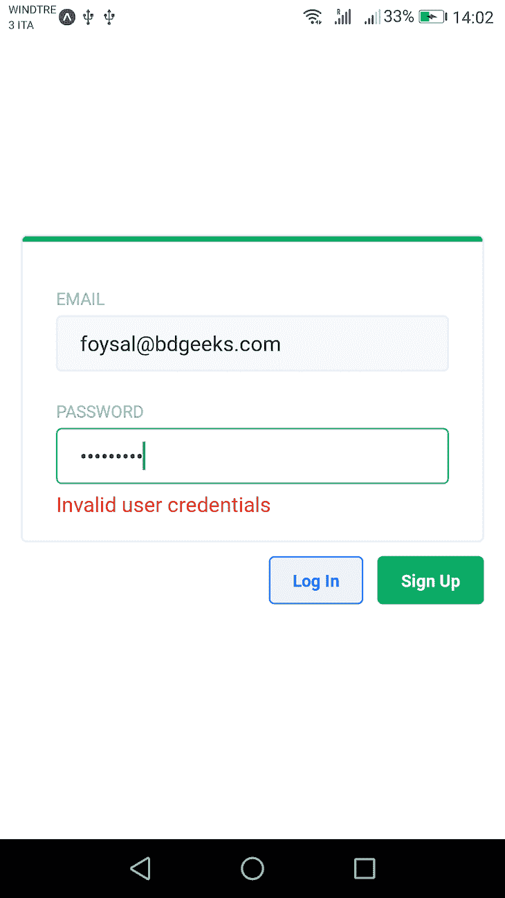
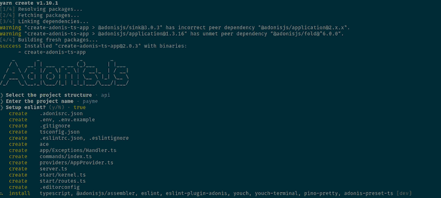
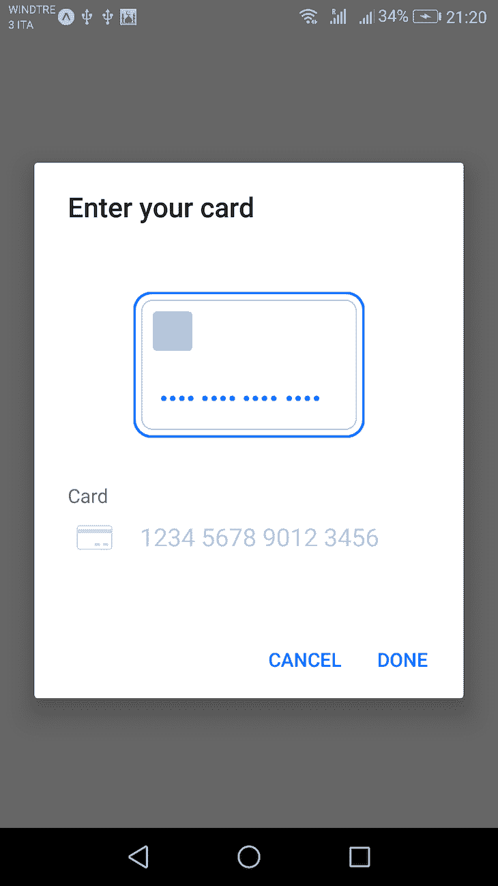

# 利用 Stripe 实现 React 原生应用的货币化

> 原文：<https://blog.logrocket.com/monetizing-react-native-app-stripe/>

## 准备

既然你选择阅读这篇文章，我相信你对 JavaScript 生态系统的发展速度很熟悉。在征服了 web 之后，它现在在本地应用程序行业也很猖獗，比如针对移动应用程序的 React Native 和针对桌面应用程序的 Electron。

如今，使用 React Native 构建的应用程序和使用真正的原生堆栈构建的应用程序之间的差距越来越小。对独立和大型企业应用程序开发者都有利的一个主要细节是能够在他们的应用程序中轻松处理支付。

如果你有一个很棒的应用程序的想法，那么你开始考虑如何将其货币化，并尽可能少地直接从用户那里收取费用，这只是一个时间问题。因此，在这篇文章中，我将带你构建一个完整的应用程序，使用 React Native(通过 [Expo](https://docs.expo.io/) )、 [UI Kitten](https://akveo.github.io/react-native-ui-kitten) 、 [Stripe](https://stripe.com) 和 [AdonisJs](https://adonisjs.com/) ，一个后端 Node.js 框架。

在您开始跟进之前，请记住这篇文章假设您熟悉 Git、React Native、React、TypesScript 和 REST APIs 的基本知识。

如果你对其中的一个或所有内容都不熟悉，你仍然可以继续阅读，并从中学习。然而，为了保持这篇文章的主题性，许多底层的细节将不会在整篇文章中解释。此外，请确保您已经为 [React 本地应用程序开发](https://reactnative.dev/docs/environment-setup)设置了环境。

对于这样的应用程序，其中有一个服务器应用程序和一个客户端应用程序，我通常将它们放在一个容器目录中，并给它命名为项目。我真的不擅长记名字，所以我想不出比 **payme** 更好的名字，它只是 payment 的缩写，让我听起来像是在要钱。哦好吧！

首先，创建一个名为`payme`的新目录，并从您的终端在其中导航:

```
mkdir payme
cd payme
```

如果你像我一样没有耐心，想在提交任何东西之前先看看代码，这里有包含整个代码库的[GitHub repo](https://github.com/foysalit/payme-app-blog)——开始吧！🙂或者，如果你只是想看看最终的结果，这里有一个[快速视频预览](https://youtu.be/fb3TI4erjtg)。

## 世博 app

Expo 是一个建立在 React Native 之上的平台/工具包，使开发人员的体验更加容易和流畅。你可以把它想象成类固醇上的 RN。当涉及到本机功能时，它确实有一些限制，但对于这种事情总是有一个解决方法。

我们首先需要在全球范围内安装`expo-cli`,使用 CLI，我们将生成一个新的样板应用程序:

```
npm install -g expo-cli
expo init payme

```

第二个命令将要求您选择一个模板，并使用箭头键从列表中选择第二个模板，如下图所示。这将生成一个空白的 TypeScript Expo 应用程序。


还记得我说过 Expo 有一些限制吗？很遗憾地说，我们已经击中了其中的一个——这么快就到了邮报！

如果您需要让它与 iOS 一起工作，您将需要使用裸工作流而不是托管工作流，因为 Expo 还不支持 iOS 上的条带模块。欲了解更多详情，请[阅读来自世博会的文档](https://docs.expo.io/versions/v38.0.0/sdk/payments/)。

然而，我们将在这篇文章中编写的所有代码在裸工作流和托管工作流中都是兼容的。

一旦完成，您将会看到一个名为`payme`的新目录。由于我们将有一个服务器端 API 应用程序和一个客户端 Expo 应用程序，让我们将生成的应用程序文件夹从`payme`重命名为`app`。然后，安装几个我们很快就会用到的包:

```
mv payme app
cd app
expo install @react-native-community/async-storage @ui-kitten/eva-icons @ui-kitten/components @eva-design/eva react-native-svg expo-payments-stripe
```

当安装正在运行时，请仔细阅读这个 [UI Kitten 文档](https://akveo.github.io/react-native-ui-kitten/docs/guides/branding#branding)关于品牌和如何为你的应用程序生成一个带有你喜欢的调色板的主题文件。按照文档中的步骤，您应该会得到一个带有许多颜色的`theme.json`。将该文件放入 app 目录的根目录中。

最后，我们可以开始编码了！打开`App.tsx`文件，用以下代码替换现有代码:

```
import { StatusBar } from 'expo-status-bar';
import React, {useEffect, useState} from 'react';
import * as eva from '@eva-design/eva';
import { ApplicationProvider, IconRegistry } from '@ui-kitten/components';
import { default as theme } from './theme.json';
import { EvaIconsPack } from '@ui-kitten/eva-icons';
import { AuthPage } from "./AuthPage";
import { ProductPage } from "./ProductPage";
import { Auth } from "./auth";
import { Payment } from "./payment";

const auth = new Auth();
const payment = new Payment(auth);
export default function App() {
    const [isLoggedIn, setIsLoggedIn] = useState(false);
    const [isLoggingIn, setIsLoggingIn] = useState(true);

    useEffect(() => {
        auth.getToken().then((token) => {
            setIsLoggingIn(false);
            if (!!token) setIsLoggedIn(true);
        });
    });

    return (
        <>
            <IconRegistry icons={EvaIconsPack} />
            <ApplicationProvider {...eva} theme={{...eva.light, ...theme}}>
                <StatusBar style="auto" />
                { isLoggedIn
                    ? <ProductPage {...{payment}} />
                    : <AuthPage {...{auth, setIsLoggedIn, setIsLoggingIn, isLoggingIn}} />
                }
            </ApplicationProvider>
        </>
    );
}
```

有些代码只是样板文件，但是让我们把它分解一下。为了用我们生成的自定义主题设置 UI Kitten，我们导入了`theme.json`文件并将`theme`对象传递给了`ApplicationProvider`。

我们从指定的文件中导入并实例化了两个类，`Auth`和`Payment`。`auth`对象作为依赖项被注入到`Payment`类中。这些封装了业务逻辑，并与服务器 API 进行通信。

该组件中有两个状态变量，一个表示用户是否已经登录，另一个表示登录操作当前是否正在进行

最初，我们在登录模式下加载 UI，在加载时，我们使用`auth.getToken()`检查现有的认证信息。这是必要的，因为如果用户登录一次，随后打开应用程序不应该每次都显示登录屏幕。

然后，我们从 UI Kitten 注册图标集，设置布局，显示状态栏，yada，yada，yada…只是我从 [UI Kitten 的官方文档](https://akveo.github.io/react-native-ui-kitten/docs/guides/getting-started#manual-installation)中复制/粘贴的更多样板文件。如果你是在这篇文章发表后很久才读到这篇文章的，请确保你遵循并匹配了这篇文章的设置。

最后，基于登录状态，如果用户没有登录，我们渲染`AuthPage`组件；否则，我们渲染`ProductPage`组件。`ProductPage`组件只接受付款对象为`[rp[`。

然而`AuthPage`组件需要能够基于组件自身内部发生的交互来改变全局状态。这就是为什么我们要传递所有的状态变量和 setter 函数来修改这些变量。

随着您的应用程序的增长，这种快速而肮脏的状态管理方式可能不再适用，您将不得不选择 React Context 之类的工具或 Redux 或反冲之类的更高级的状态管理库，但对于本文的有限范围来说，这应该很好。

### 认证页面

身份验证可能是你在开始一个项目时首先要做的事情之一，然而，它是最复杂的事情之一，有许多边缘情况和你的应用的上下文依赖。

为了这篇文章的目的，我们将保持简洁明了。当应用程序打开时，我们希望向用户显示一个登录屏幕，用户可以用他们的电子邮件地址和密码注册，或者如果他们已经有一个帐户，就可以登录。

* * *

### 更多来自 LogRocket 的精彩文章:

* * *

首先，在应用程序的根目录下创建一个名为`AuthPage.tsx`的新文件，并放入下面的代码:

```
import {Layout, Icon, Button} from "@ui-kitten/components";
import { Layout, Card, Button, Input, Text } from "@ui-kitten/components";
import { StyleSheet, View } from "react-native";
import React, { useState } from "react";

import { Auth } from "./auth";

const styles = StyleSheet.create({
    page: {
        flex: 1,
        padding: 15,
        alignItems: 'center',
        justifyContent: 'center',
    },
    card: {
      alignSelf: 'stretch',
    },
    formInput: {
        marginTop: 16,
    },
    footer: {
        marginTop: 10,
        alignSelf: 'stretch',
        flexDirection: 'row',
        justifyContent: 'space-between',
    },
    statusContainer: {
        alignSelf: 'center',
    },
    actionsContainer: {
        flexDirection: 'row-reverse',
    },
    button: {
        marginLeft: 10,
    }
});

type AuthPageProps = {
    auth: Auth,
    isLoggingIn: boolean,
    setIsLoggedIn: (isLoggedIn: boolean) => any,
    setIsLoggingIn: (isLoggedIn: boolean) => any,
};

export const AuthPage = ({ auth, isLoggingIn, setIsLoggedIn, setIsLoggingIn }: AuthPageProps) => {
    const [password, setPassword] = useState<string>();
    const [email, setEmail] = useState<string>();
    const [errors, setErrors] = useState<string[]>([]);

    const handlePrimaryButtonPress = async (action = 'signup') => {
        setIsLoggingIn(true);
        // when signing up, we want to use the signup method from auth class, otherwise, use the login method
        try {
            const { success, errors } = await auth.request(action, {email, password});
            setIsLoggedIn(success);
            setErrors(errors);
        } catch (err) {
            console.log(err);
        }

        setIsLoggingIn(false);
    };

    return (
        <Layout style={styles.page}>
            <Card style={styles.card} status='primary'>
                <Input
                    style={styles.formInput}
                    label='EMAIL'
                    value={email}
                    onChangeText={setEmail}
                />
                <Input
                    style={styles.formInput}
                    label='PASSWORD'
                    secureTextEntry={true}
                    value={password}
                    onChangeText={setPassword}
                />
                {errors.length > 0 && errors.map(message =>
                    <Text key={`auth_error_${message}`} status='danger'>{message}</Text>
                )}
            </Card>
            <View style={styles.footer}>
                <View style={styles.statusContainer}>
                    <Text>{isLoggingIn ? 'Authenticating...' : ''}</Text>
                </View>
                <View style={styles.actionsContainer}>
                    <Button
                        size="small"
                        style={styles.button}
                        disabled={isLoggingIn}
                        onPress={() => handlePrimaryButtonPress('signup')}>
                        Sign Up
                    </Button>
                    <Button
                        size="small"
                        status="info"
                        appearance="outline"
                        disabled={isLoggingIn}
                        onPress={() => handlePrimaryButtonPress('login')}>
                        Log In
                    </Button>
                </View>
            </View>
        </Layout>
    );
}
```

理想情况下，在真实世界的应用程序中，您应该有自己的架构和文件夹结构，但是出于本文的目的和范围，我们将把所有内容放在 app 文件夹的根目录中。

这看起来像是很多代码，但是相信我:在真实世界的认证页面中，您将拥有至少比这多五倍的代码。不要害怕——分解并大量消耗是相当容易的。

首先，我们有一些样式表定义。因为 UI 构建不是这篇文章的主要内容，所以我不会详细讨论为什么和如何工作。如果你对此完全陌生，请[在这里](https://reactnative.dev/docs/stylesheet)仔细阅读。总的来说，我们只是添加了一些样式，稍后将应用于由`AuthPage`组件呈现的各种元素。

然后我们创建一个类型，定义这个组件期望从它的渲染器接收的所有不同的属性。

在组件本身中，我们有三个状态变量。前两个是 email 和 password，它们是用户通过 UI 输入的字符串。然后我们有一个包含错误信息的字符串数组。这些是我们可能从服务器端收到的响应身份验证请求的错误。想象一下注册时重复的电子邮件地址、错误的登录密码等错误。

接下来，我们有一个事件处理函数，它将根据用户点击的按钮触发登录或注册操作。在函数体中，我们调用传递给组件的各种状态设置函数，让父组件知道发生了什么。

最后，我们用状态中的电子邮件和密码调用`auth.request(action, {email, password})`方法。想象一下，这会将数据发送到我们的 API 服务器，并得到一些响应。

现在，让我们来看看用户实际上会看到什么。为了让它更漂亮，我们使用 UI Kitten 的`Layout`和`Card`组件，将卡片放在屏幕的正中央，里面有两个输入——一个用于电子邮件，一个用于密码。让我们来分析一下密码字段，例如:

```
<Input
   style={styles.formInput}
   label='PASSWORD'
   secureTextEntry={true}
   value={password}
   onChangeText={setPassword}
/>
```

我们使用`formInput`样式，这给了它一个很好的顶部空白。然后`label` prop 在输入字段的顶部添加一个文本。当用户输入密码时，`secureTextEntry`道具会隐藏文本。作为`onChangeText`事件的处理程序，我们传递了`setPassword` 函数，它将更新状态值。然后，该值被设置为输入字段本身的值。

相当标准的 React 东西加上一点 UI 小猫魔法。通过简单地传递一些道具，你可以做更多的事情来使这些输入看起来和感觉起来符合你的测试。

下面，我们遍历 state 中的所有错误消息字符串，并呈现一个显示消息本身的`Text`组件(如果有的话)。由于 UI Kitten，`status='danger'`部分将使文本颜色变为红色。

```
{errors.length > 0 && errors.map(message =>
                    <Text key={`auth_error_${message}`} status='danger'>{message}</Text>
                )}
```

最后，我们到了页脚。分为两个水平部分，右边显示两个按钮:一个是**登录**，另一个是**注册**。在左边，默认情况下是一个空白区域，但是当我们与服务器通信时，会显示文本**正在认证…** ，让用户知道我们正在处理他们的请求。

请注意，这两个按钮调用相同的函数，但参数不同。他们也有稍微不同的道具——例如，一个有`appearance='outline'`，这给了它一个边框，并使背景颜色有点褪色。我们还传递了`disabled={isLoggingIn}`，它确保在用户按下一个按钮并将数据发送到服务器后，两个按钮都将被禁用，以避免多次提交。

唷！应用程序的第一部分完成了——还不错，对吧？好吧，坏消息是你还看不到它的运行，因为这里缺少一些东西，比如`auth`对象和`PaymentPage`组件。然而，为了感谢你到目前为止的辛勤工作，我会奖励你一张截图，显示一旦应用程序渲染页面时的样子！瞧啊！



好吧，对不起，我可能有点夸大其词了。没那么神奇，但也没那么糟糕，对吧？

### 产品页面

就像我们对 auth 页面所做的一样，让我们在应用程序的根目录下创建一个名为`ProductPage.tsx`的新文件，并将以下代码放入其中:

```
import {Layout, Icon, Button} from "@ui-kitten/components";
import { StyleSheet } from "react-native";
import React, {useEffect, useState} from "react";
import {Payment, PaymentData} from "./payment";

const styles = StyleSheet.create({
    container: {
        flex: 1,
        flexDirection: 'row',
        alignItems: 'center',
        justifyContent: 'center',
    },
    button: {
        margin: 2
    }
});

const products = [{
    status: 'primary',
    text: 'Buy Video',
    product: 'video',
    icon: 'film',
    price: 50,
}, {
    price: 30,
    status: 'info',
    product: 'audio',
    text: 'Buy Audio',
    icon: 'headphones',
}];

type ProductPageProps = {
    payment: Payment,
};

export const ProductPage = ({ payment }: ProductPageProps) => {
    const [paymentReady, setPaymentReady] = useState(false);
    const [paymentHistory, setPaymentHistory] = useState<PaymentData[]>([]);

    // Initialize the payment module, on android, this MUST be inside the useEffect hook
    // on iOS, the initialization can happen anywhere
    useEffect(() => {
        payment.init().then(() => {
            setPaymentReady(true);
            setPaymentHistory(payment.history);
        });
    });

    const handlePayment = async (price: number, product: string) => {
        await payment.request(price, product);
        setPaymentHistory(payment.history);
    };

    const hasPurchased = (product: string) => !!paymentHistory.find(item => item.product === product);

    return (
        <Layout style={styles.container}>
            {products.map(({product, status, icon, text, price}) => (
                <Button
                    status={status}
                    style={styles.button}
                    disabled={!paymentReady || hasPurchased(product)}
                    onPress={() => handlePayment(price, product)}
                    key={`${status}_${icon}_${text}`}
                    accessoryLeft={props => <Icon {...props} name={icon}/>}>
                    {`${text} $${price}`}
                </Button>
            ))}
        </Layout>
    );
};

```

让我们仔细看看这里的代码。就像以前一样，我们有一些样式定义，稍后我们将把它们添加到不同的组件中。

然后我们有一个包含两个产品条目的数组。每个条目都有一个`status`、`price`、`product`、`icon`和`text`属性。除了`price`和`product`属性之外，这些都主要用于 UI，而前两个将在以后的 API 通信中使用。在现实世界的应用程序中，您可能会从服务器获得这个列表，而不是将它硬编码到应用程序的代码中。

在组件本身的定义中，我们将其设置为接收付款对象作为道具，这是我们从`App`组件传递过来的，还记得吗？在加载时，我们通过调用`init()`来初始化支付模块，并且为了保持 UI 与支付模块加载的状态同步，我们引入了一个状态变量，该变量最初被设置为`false`，并且在支付模块初始化时被打开。

此外，还有另一个状态变量，它应该包含用户以前支付的所有款项。在对支付对象调用了`init()`之后，我们用支付对象的`history`属性重置了状态变量。好像在初始化之后，历史属性将包含支付历史。我们稍后将看到这是如何实现的。

我们还有一个事件处理函数`handlePayment`，它由价格和产品数据触发，并从支付模块调用`request`方法。呼叫结束后，我们用来自`payment`对象的`history`属性重新调整`paymentHistory`状态，就好像在付款后，历史属性将包含与之前不同的数据。

我们暂时盲目信任支付对象包含所有这些方法，但不用担心，我们很快就会自己构建它。

然后是 UI 渲染。在 UI Kitten 的一个`Layout`组件中，我们简单地遍历我们的两个产品，并为每个产品呈现一个按钮。在这里你可以看到像`status`、`text`等属性。设置在`product`中的物体派上了用场。

UI Kitten 让我们可以通过简单的属性轻松地操纵按钮等各种组件的外观。例如，`status="primary"`将根据你的主题定义中的原色赋予按钮一种独特的风格。

如果付款初始化未完成或同一产品的历史记录中已有付款条目，我们也会禁用该按钮。您可以通过更改/添加此处记录的各种道具来改变 UI 的外观和感觉。

请注意，我们使用之前创建的`handlePayment`函数作为`onPress`事件的监听器，并且我们还使用我们在开始时创建的各种样式在按钮之间添加一些间距，并使它们在屏幕内垂直居中。

为了让你对这一切有所了解，这里有一个截图:


至此，我们将暂时放下前端工作，构建 API。一旦准备好了，我们将回到这两个连接和包装的事情！

## 阿多尼斯应用

就像 Expo 一样，AdonisJs 附带了一个方便的样板生成器命令。要运行它，请确保您在`payme/`目录中，并运行以下命令:

```
yarn create adonis-ts-app payme
```

您将得到一些问题并提供如下图所示的答案，然后您将会看到一个名为`payme`的目录:



Adonis init output.

就像之前一样，我们将把它换成一个更适合 monorepo 结构的名字:`mv payme api`。现在，您可以在目录中导航并运行应用程序:

```
cd api
yarn start
```

您应该会看到一个输出，告诉您该应用程序正在运行，并且可以从端口 3333 上的本地主机进行访问。

### 证明

Adonis 使用户身份验证变得轻而易举，非常灵活。我们将从安装一些很快就会用到的包开始:`yarn add stripe @adonisjs/[[email protected]](/cdn-cgi/l/email-protection)`。

我们在那里安装的第一个包是用于条带的节点包。第二个是来自 Adonis 的 auth 包，它在运行了`node ace invoke @adonisjs/auth`并提供了所需的所有输入之后，为我们提供了用户认证所需的一切。

以下是我提供的答案，你可以看到它为你生成的所有文件:


Auth boilerplate generation.

注意，我们使用 Lucid 作为数据存储的提供者，我们还没有设置它。是官方的 Adonis 数据库 ORM 层。让我们通过首先安装软件包本身来设置它:`yarn add @adonisjs/[[email protected]](/cdn-cgi/l/email-protection)`。这将要求您选择一个数据库提供商。通常，您会选择 MySQL 或 PostgreSQL 之类的东西，但是对于本文的小范围，我将坚持使用 SQLite。

至此，我们已经准备好运行 Adonis 身份验证包生成的迁移:`node ace migration:run`。这将使用适当的模式创建必要的表，以支持基于 JWT 的用户身份验证。

> **注意**:在写这篇文章的时候，Adonis 中设置软件包的方式有问题，你可能需要通过运行`yarn add phc-argon2`命令来手动安装 phc-argon2 软件包。

对于这个非常基本的应用程序，我们将只设置注册和登录操作，但在现实世界中，您需要构建一个更加复杂的流程，包括重置密码、电子邮件验证等。

对于注册和登录，我们需要两个 REST 端点，这些端点通常通过 Adonis 中的路由和控制器来管理。因此，让我们在`start/routes.ts`文件中创建这些端点，并删除现有代码:

```
import Route from '@ioc:Adonis/Core/Route';

Route.post('/login', 'AuthController.login');
Route.post('/signup', 'AuthController.signup');
```

这将注册两个 POST 请求端点，`/login`和`/signup`，当请求被发送到这些端点时，Adonis 将执行来自名为`AuthController`的控制器类的相关方法。

然而，这还不存在，所以让我们在`app/Controllers/Http/AuthController.ts`中创建一个新文件(和必要的目录，即`Controllers`和`Http`)。或者您可以运行命令`node ace make:controller auth`，它将为您生成文件和目录。现在将以下代码放入控制器文件中:

```
import { HttpContextContract } from '@ioc:Adonis/Core/HttpContext'
import User from 'App/Models/User';

export default class AuthController {
  public async login ({ request, auth }: HttpContextContract) {
    const email = request.input('email');
    const password = request.input('password');

    const token = await auth.use('api').attempt(email, password);
    return token.toJSON();
  }
  public async signup ({ request, auth }: HttpContextContract) {
    const email = request.input('email');
    const password = request.input('password');

    const user = await User.create({email, password});
    const token = await auth.use('api').generate(user);
    return token.toJSON();
  }
}
```

`login`方法期望在 POST 请求的主体中发送一封电子邮件和一个密码，并使用注入的`auth`模块，Adonis 将通过`attempt`方法检查数据库中是否有匹配这些凭证的用户条目。

如果用户存在，它将发出一个令牌并在响应中发送它。令牌响应包含两个属性，`{token: <actual jwt token>, type: <type of the token, usually Bearer>}`。

这里的注册方法稍微简化了一些，但是在真实的应用程序中，您可能需要其他字段，如姓名、地址等。在我们的例子中，它期望与登录方法相同的数据:电子邮件和密码。给定这两个条目，它将在数据库中创建一个新的`User`条目，然后为新创建的用户生成令牌，这些令牌将作为响应发送回调用者。

把上面的设置想象成我们刚刚为 React 本地应用程序构建的`AuthPage`组件的副本。所以现在，我们的 API 剩下的事情就是`PaymentPage`组件的对应物。让我们来构建它，但是我们将为它选择一条更好的路线，因为 Adonis 不会像为 auth 模块那样为我们构建所有的东西。

### 数据结构

当从头开始构建一个特性时，我通常喜欢从粒度数据层开始——在数据库级别提出可以支持该特性可能需要的一切的数据结构。Adonis 的工作方式是通过迁移。

迁移允许您与数据库进行交互，并创建/更新您的表和表中的列。在我们的例子中，我们正在构建一个应用程序来演示如何使用 Stripe 进行支付。因此，我们希望在数据库中保存的是，对于每笔付款，表中的一行包含一笔付款的所有详细信息。

相应地，我们希望将该表称为`payments`。如我所说，我们将运行命令`node ace make:migration payment`来生成支付表迁移，而不是在数据库中手动创建该表。然后，在`api/database/migrations/`目录中用以下新行更新生成的以`_payments.ts`结尾的迁移文件:

```
      table.increments('id');
//--> new lines start
      table.integer('user_id').unsigned().references('id').inTable('users').onDelete('CASCADE');
      table.string('charge_id').unique().notNullable();
      table.string('token_id').notNullable();
      table.string('product').notNullable();
      table.integer('price').notNullable();
//--> new lines end
      table.timestamps(true);
```

现在，在我们深入研究刚刚编写的代码之前，让我们运行命令`node ace migration:run`来创建一个新表，该表具有这段代码中描述的结构。

好了，在迁移运行的同时，让我们更仔细地看看这个，从预先存在的部分开始。我们正在创建一个名为`payments`的新表，它有一个名为`id`的字段，该字段是表的主键，并且每次向表中添加新行时都会自动递增。

`timestamps(true)`也有一些神奇之处，基本上就是:添加两个名为`created_at`和`updated_at`的列，它们是时间戳字段。现在是新的领域:

| **字段** | **标准** | **原因** |
| `price` | 数字，目前只有整数(处理分是另一回事) | 包含产品的价格，即从用户卡上收取的金额 |
| `product` | 字符串，不能为空 | 包含付款产品的名称 |
| `token_id` | 字符串，不能为空 | `tokenId`由用户输入有效卡片信息时，app 内的条纹库生成 |
| `charge_id` | 字符串，不能为空 | 用户卡成功充值后 Stripe 返回的充值条目的 ID |
| `user_id` | Number，一个外键，引用 users 表中的一个条目 | 付款用户的 ID |

如前所述，迁移只在数据库级别创建数据结构，这意味着我们仍然需要让我们的应用程序知道它将处理什么类型的数据。这就是模特出现的地方。

运行命令`node ace make:model payment`来生成支付模型，这将在`app/Models/Payment.ts`中创建一个新文件。打开该文件，并将以下代码放入其中:

```
import { DateTime } from 'luxon'
import { BaseModel, column, belongsTo, BelongsTo } from '@ioc:Adonis/Lucid/Orm'

import User from 'App/Models/User';

export default class Payment extends BaseModel {
  @column({ isPrimary: true })
  public id: number

  @column()
  public price: number

  @column()
  public product: string

  @column()
  public tokenId: string

  @column()
  public chargeId: string

  @column()
  public userId: number

  @belongsTo(() => User)
  public user: BelongsTo<typeof User>

  @column.dateTime({ autoCreate: true })
  public createdAt: DateTime

  @column.dateTime({ autoCreate: true, autoUpdate: true })
  public updatedAt: DateTime
}
```

如您所见，这很像我们在迁移方面所做的工作，但更像是打字稿。注意，我们在模型级别拼写时间戳字段，这是由迁移中的`timestamps(true)`调用处理的。

这里要注意的另一件事是关系位，它告诉 ORM 每个付款条目都有一个父用户。

```
  @belongsTo(() => User)
  public user: BelongsTo<typeof User>
```

这使得我们能够使用设计巧妙的 Lucid ORM 运行各种关系查询。我们很快就会在支付控制器中看到至少一个例子。这只是建立了从付费模型到用户模型的连接。为了让用户模型知道它与付费模型的关系，我们需要进入`app/Models/User.ts`并添加以下几行:

```
import {
  column,
  beforeSave,
  BaseModel,
  hasMany,
  HasMany,
} from '@ioc:Adonis/Lucid/Orm';

//....previously generated code
export default class User extends BaseModel {
//....previously generated code

  @hasMany(() => Payment)
  public payments: HasMany<typeof Payment>
}
```

> **注意**:如果你不熟悉关系数据结构，或者想了解更多关于 Adonis 如何解决这个问题，请[在这里继续阅读](https://preview.adonisjs.com/guides/model-relations/introduction/)。

现在让我们再跳一层，通过 HTTP 请求公开数据管理。这一步涉及三件事。

### 1.)路线

路线为外部世界提供了一种通过 HTTP 与我们的 Adonis 应用程序进行通信的方式。让我们首先在`start/route.ts`文件中创建一个新的 REST 端点，其内容如下:

```
Route.get('/payment', 'PaymentsController.list').middleware('auth');
Route.post('/payment', 'PaymentsController.charge').middleware('auth');
```

我们在`/payment`端点为 GET 请求添加了一个处理程序，当请求到达那里时，我们告诉 Adonis 从`PaymentsController`类向`list`发送方法。另一个处理程序用于同一个端点的 POST 请求，并从控制器类执行`charge`方法。还有一个关于`middleware('auth')`的悬而未决的部分，我们将很快揭开。

### 2.)控制器

运行命令`node ace make:controller payment`生成一个支付控制器，这将在`app/Http/Controllers/Payment.ts`中创建一个新文件。打开该文件并放入以下代码:

```
import { HttpContextContract } from "@ioc:Adonis/Core/HttpContext";
import Env from '@ioc:Adonis/Core/Env'
import Payment from "App/Models/Payment";
import Stripe from 'stripe';

const stripeSecretKey = `${Env.get('STRIPE_SECRET_KEY')}`;
const stripe = new Stripe(stripeSecretKey, {
  apiVersion: '2020-08-27'
});

export default class PaymentsController {
  public async charge ({ request, auth }: HttpContextContract) {
    const payment = new Payment();
    payment.tokenId = request.input('tokenId');
    payment.price = request.input('price');

    const { id } = await stripe.charges.create({
      amount: payment.price * 100,
      source: payment.tokenId,
      currency: 'usd',
    });
    payment.chargeId = id;

    await auth.user?.related('payments').save(payment);
    return payment;
  }
  public async list ({ auth }: HttpContextContract) {
    const user = auth.user;
    if (!user) return [];
    await user?.preload('payments');
    return user.payments;
  }
}
```

有很多东西要打开。让我们从头开始:

```
import Stripe from 'stripe';

const stripeSecretKey = `${Env.get('STRIPE_SECRET_KEY')}`;
const stripe = new Stripe(stripeSecretKey, {
  apiVersion: '2020-08-27'
});
```

还记得我们在安装认证库的时候安装了 Stripe 吗？这是我们使用它的地方。

导入后，我们用密钥实例化 Stripe。然而，出于安全最佳实践的考虑，我们没有硬编码密钥，而是使用 Adonis 的`Env` provider，这让我们可以轻松地从 [env 变量](https://preview.adonisjs.com/guides/directory-structure/#env)中读取。您将更新`api`目录根目录中的`.env`，并添加一个新条目，如下所示:

```
STRIPE_SECRET_KEY=<test secret key from your stripe account>
```

要获得密钥，你必须登录你的 Stripe 账户，然后导航到**开发者** - > **API 密钥**。然后，从右上角打开**查看测试数据**。现在，您可以创建一个新的密钥，或者如果您已经有了一个密钥，可以随意使用它。


请记住，我们正在使用测试数据，因为我们希望能够测试支付功能，而不必实际花钱或向一张真正的卡收费。一旦您完成了应用程序的构建并将其发布到生产环境中，您应该用一个真正的密钥替换这个密钥。

接下来，收费方式:

```
  public async charge ({ request, auth }: HttpContextContract) {
    const payment = new Payment();
    payment.tokenId = request.input('tokenId');
    payment.product = request.input('product');
    payment.price = request.input('price');

    const { id } = await stripe.charges.create({
      amount: payment.price * 100,
      description: payment.product,
      source: payment.tokenId,
      currency: 'usd',
    });
    payment.chargeId = id;

    await auth.user?.related('payments').save(payment);
    return payment;
  }
```

在这里，我们期望客户端给我们发送一个条纹`tokenId`、`price`和`product`，通过这些，我们实例化了一个新的支付模型对象。在保存之前，我们试图通过调用`charges.create()`方法对用户的卡进行收费。Stripe 以美分为单位处理金额，因此如果我们要收取的总金额是$50，我们需要发送 5000 作为收费请求的金额。

我们还将货币硬编码为`usd`，但是在现实世界的应用程序中，您可能会根据用户的卡或其他一些应用程序级别的变量来调整它。当对用户的卡收费时，你可以向 Stripe 发送更多的数据。要了解更多，请在这里阅读他们惊人详细的 [API 文档。](https://stripe.com/docs/api/charges)

如果收费成功，Stripe 将返回一个 ID(以及许多其他信息),我们稍后可以使用它来检索有关交易的信息。这是我们将存储在数据库中`chargeId`列下的唯一一条数据。

请注意，我们不处理任何 Stripe 无法对卡收费的情况—无论是因为卡信息错误、卡过期还是任何其他原因—并返回错误信息而不是`chargeId`。我把它留给读者作为练习。

然后插入行，而不是使用付款模型直接插入，我们使用`user.related('payments').save()`。这样，Adonis 会自动将付款条目与登录用户相关联。

注意，我们期待某个`auth`对象被传递给我们，我们从这个对象访问用户属性。这是由 auth 中间件自动注入的，并允许我们访问用户模型。从用户模型来看，由于我们建立了`hasMany`关系，Adonis 可以自动填充将子条目与父条目相关联的细节。

第二种方法`list`，稍微简单一点。它只是从属于发出`GET`请求的登录用户的`payments`表中找到并返回所有条目。

```
  public async list ({ auth }: HttpContextContract) {
    const user = auth.user;
    if (!user) return [];
    await user?.preload('payments');
    return user.payments;
  }
```

就像收费方法一样，访问用户模型后，我们可以运行`preload('payments')`来加载与登录用户相关的所有支付条目。

### 中间件

出于安全考虑，我们不希望任何未登录的人提出付款请求。手动验证每个请求是一个繁琐而危险的过程，这就是为什么 Adonis 通过使用中间件使它变得非常简单。

在上一步中，我们看到一个`auth`对象被注入到我们的控制器方法中，这是可能的，因为中间件的魔力。不过，我们确实需要做些工作来让魔法发挥作用。

我们已经将`.middleware('auth')`添加到路线定义中。我们要做的最后一件事就是注册中间件。打开`start/kernel.ts`文件，在底部，用下面的代码替换看起来像`Server.middleware.registerNamed({})`的那一行:

```
Server.middleware.registerNamed({
  auth: 'App/Middleware/Auth',
});

```

现在 Adonis 知道我们所说的`auth`中间件是什么意思了，所有阻止未经身份验证的请求到达控制器方法的逻辑都已经由身份验证生成器为我们生成了。

## 结合两个应用程序

现在我们的 REST API 已经准备好了所有的端点，让我们进入连接两者的最后阶段。需要整个 npm 库在客户机和服务器之间进行通信的日子已经一去不复返了；如今，你需要的只是`fetch`。我们首先在`app/`目录的根目录下创建一个`api.ts`文件，并放入以下代码:

```
const API_URL = 'http://192.168.1.205:3333';

export const postDataToApi = async ({endpoint = '', data = {}, headers = {}}) => {
    const response = await fetch(`${API_URL}/${endpoint}`, {
        method: 'POST',
        headers: {
            'Content-Type': 'application/json',
            ...headers
        },
        body: JSON.stringify(data)
    });
    return response.json();
};

export const getDataFromApi = async ({endpoint = '', headers = {}}) => {
    const response = await fetch(`${API_URL}/${endpoint}`, {
        headers: {
            'Content-Type': 'application/json',
            ...headers
        },
    });

    return response.json();
};
```

这里，我们将 API 端点硬编码到这里并指向，但是请注意，它的 IP 部分对您来说是不同的。为了达到这个目的，你可以[遵循这样的](https://opensource.com/article/18/5/how-find-ip-address-linux)。这是必要的，因为我们的应用程序将在移动设备上运行，但我们的 API 应用程序在不同的设备上运行。假设两台设备都连接到同一个网络，您应该得到一个 IP 地址容器 192.168 前缀。

然后我们有两个函数:一个用于发出 POST 请求，另一个用于发出 GET 请求。这两个函数都允许指定端点和附加的头参数。对于 POST 请求，它还允许我们将附加的`data`传递给请求的主体。

这就是我们与 API 服务器通信所需的全部内容。使用这些助手，我们将根据具体情况向服务器发出请求。

### `Auth`阶级

我们处理的第一个案例是`Auth`模块。让我们在名为`auth.ts`的应用程序/目录的根目录下创建一个新文件，并将以下代码放入其中:

```
import AsyncStorage from '@react-native-community/async-storage';
import { postDataToApi } from "./api";

interface AuthData {
    email: string | undefined;
    password: string | undefined;
}

export class Auth {
    tokenKey: string = '@authKey';

    async request(endpoint = 'login', data: AuthData) {
        const { token, errors } = await postDataToApi({ endpoint, data });
        if (token) {
            await AsyncStorage.setItem(this.tokenKey, token);
            return { success: true, errors: [] };
        }

        const errorMapper: (params: { message: string }) => string = ({ message }) => message;
        return { success: false, errors: errors.map(errorMapper) };
    }

    async getToken() {
        return AsyncStorage.getItem(this.tokenKey);
    }

    async getApiHeader() {
        const token = await this.getToken();
        return { 'Authorization': `Bearer ${token}` };
    }
}
```

这个类有一个`request`方法，它使用`postDataToApi` helper 函数向我们的 API 服务器发送电子邮件和密码凭证，该函数将返回一个带有`token`或`errors`数组的对象，其中包含出错的详细信息。如果我们确实收到了令牌，我们会使用`AsyncStorage`包将它存储在本地存储中，这是在设备上本地保存数据的最快方式。

如果登录/注册请求有问题，API 将使用包含错误的对象数组进行响应，每个对象将包含一个`message`属性。为了简化这些数据，我们对数组进行映射，并将其转换为一个字符串数组，我们可以循环遍历该数组并显示给用户。

然后，我们有一个`getToken`方法来从存储器中检索先前保存的令牌，当在视图中加载`App`组件时，我们调用这个方法。最后一个方法是使用存储的令牌创建`Authorization`的助手，这个令牌可以通过 HTTP 请求发送到我们的 API 服务器。

因为认证请求不需要使用现有的令牌，所以我们不会在这里的任何地方使用它，但是我们会在`Payment`类中看到它的用法。

### `Payment`阶级

在`app/`目录的根目录下创建一个新文件，并将下面的代码放入其中:

```
import { PaymentsStripe as Stripe } from 'expo-payments-stripe';
import {Auth} from "./auth";
import {getDataFromApi, postDataToApi} from "./api";

type PaymentData = {
    id: number,
    price: number,
    product: string,
};

export class Payment {
    auth: Auth;
    history: PaymentData[] = [];

    constructor(auth: Auth) {
        this.auth = auth;
    }

    async init() {
        await Stripe.setOptionsAsync({
            androidPayMode: 'test',
            publishableKey: 'pk_test_<rest_of_your_key>',
        });
        await this.getHistory();
        return true;
    }

    async getHistory() {
        const response = await getDataFromApi({endpoint: 'payment', headers: await this.auth.getApiHeader()});
        if (response.errors) {
            this.history = [];
            return false;
        }

        if (response.length > 0) {
            this.history = response;
            return true;
        }
    }

    async request(price: number, product: string) {
        try {
            const { tokenId } = await Stripe.paymentRequestWithCardFormAsync();
            const payment: PaymentData = await postDataToApi({
                endpoint: 'payment',
                data: {price, token: tokenId, product},
                headers: await this.auth.getApiHeader()
            });

            if (payment.id)
                this.history.push(payment);

            return payment;
        } catch(err) {
            console.log(err);
            return null;
        }
    }
}
```

这不仅仅是发出服务器 API 请求。首先，它期望在实例化过程中注入一个`Auth`类的实例。然后我们有一个用`publishableKey`实例化 Expo 的条带库的`init`方法。

要获得可发布的密钥，请按照设置服务器端条带收费机制时获得密钥的相同步骤进行操作，除了密钥之外，您还会在同一页面上看到可发布的密钥。在实例化 Stripe 之后，我们正在调用另一个类方法`getHistory`。

`getHistory`是对我们的 API 服务器的一个简单的 GET 请求，用于检索当前用户以前支付的所有款项。为了识别 HTTP 请求中的当前用户，我们通过使用`this.auth.getApiHeader()`方法调用来传递 auth 令牌头。这个请求被发送到`/payment`端点。

如果您还记得我们对该端点的实现，它会从我们的数据库中返回一个与经过身份验证的用户相关联的所有付款行的数组。因此，如果我们在响应中收到一个数组，我们将它存储在该类的`history`属性中，您可能还记得，该属性在组件中用于更新其状态。

`request`是这个类的最后一个方法。当用户按下其中一个产品上的**购买**按钮时，就会调用这个函数，并接收产品的价格和名称。我们用这个方法做的第一件事是启动一个`Stripe.paymentRequestWithCardFormAsync()`调用，这将为用户显示一个输入他们的卡信息的好的模式。这都是建立在博览会条纹图书馆。您可以通过[将各种配置选项](https://docs.expo.io/versions/latest/sdk/payments/#payment-request-with-card-form-android-ios)传递给这个调用来定制模态的外观和感觉。下面是模态外观的截图:



Stripe 让测试卡支付超级简单；你不需要一张真正的卡来测试它的任何功能。您可以在此处找到[测试卡的详细信息，并使用其中一个来填写此表格。请注意，如果您插入了错误的卡信息，UI 会自动进行验证，并向您显示错误。](https://stripe.com/docs/testing)

一旦您输入一个有效的/测试卡并按下 done，Stripe 将返回各种信息作为一个对象，其中最重要的是`tokenId`属性。仅仅因为您输入了有效的卡信息并按了完成并不意味着您的卡已经被充值。为了安全可靠地做到这一点，我们需要将`tokenId`作为对`/payment`端点的 POST 请求传递给我们的 API 服务器。

我们已经设置了使用条带库调用`charge()`方法，还记得吗？除了`tokenId`，我们还传递产品的价格和名称。请记住，价格是以美元传递的，但是在服务器上，它将被转换为美分，并且产品的名称将被添加到收费的描述中。

此外，为了识别哪个用户正在付款，我们再次使用`this.auth.getApiHeader()`方法在请求的头部添加身份验证令牌。

一旦收费，服务器将创建一个新的付款条目，并将其返回给我们。因此，只要返回的响应是具有 ID 属性的对象，我们就知道支付成功了。我们将这个新的支付附加到`history`数组属性，以保持服务器和客户端数据同步，因为在这个调用之后，组件使用`history`属性更新它的状态，这将禁用按钮。

请注意，我们没有处理错误情况—同样，我把它留给读者作为练习。

还和我在一起吗？太好了！你已经做得很好了，我保证奖励是值得的。

## 带它去兜一圈

现在来看看回报:从`app/`目录中运行`yarn start`命令，您将在终端中看到一个 QR 码。我正在使用一个真实的设备来测试这个，但是如果你想的话，你可以很容易地在一个 [iOS](https://docs.expo.io/workflow/ios-simulator/) 或者 [Android](https://docs.expo.io/workflow/android-studio-emulator/) 模拟器上测试它。

如果您还没有，请在您的设备上安装并打开 Expo 应用程序，然后扫描二维码。它会自动加载并打开你的设备上的应用程序。您还应该确保 API 服务器仍在运行。

此时，您应该会看到身份验证屏幕，就像之前的屏幕截图一样。填写电子邮件地址和密码，然后按**注册**创建账户。一旦你这样做了，你应该得到一个新的屏幕，上面有两个按钮，就像`ProductPage`部分的截图一样。

在您继续操作并按下其中一个按钮之前，我希望您关闭应用程序并重新打开它，以确认不会要求您再次进行身份验证，而是直接转到产品页面。由于异步存储包，即使您离开应用程序，您的身份验证令牌现在也会保存在您的设备上。

现在继续，按下其中一个按钮，你应该会看到卡输入弹出出现，就像上面的截图。摆弄输入，实时观察各种验证。

插入有效/测试卡详细信息并按下 done 后，您应该会看到在弹出窗口出现之前刚刚按下的按钮现在已被禁用。如果您现在关闭应用程序并重新打开它，您将看到该按钮仍然为您禁用。

但是当涉及到金钱时，我们不能盲目地相信我们的 UI！因此，让我们通过前往 Stripe 仪表板来验证支付是否确实发生了。


从你的仪表板的左边栏，打开**查看测试数据**，然后转到**支付**面板。确保你看到付款列表顶部的**测试数据**标签，那里的最新条目应该是我们的应用程序刚刚创建的。恭喜你。你刚赚了些免费现金！

## 结束语

虽然我们已经一起创建了一个令人惊叹的应用程序，但我们不得不承认，这还远远不是我们曾经放到真正用户手中的完美或成品。所以我们在现有的基础上计划一些改进怎么样？

*   将产品列表从应用内的静态数组移动到从 API 检索的动态的、存储在数据库中的产品列表
*   通过添加图片、描述、标题等使产品看起来更别致。
*   使用支付列表端点，显示用户已购买的产品列表
*   一旦用户购买了产品，就在产品上显示一个指示器来提醒用户他们已经购买了该产品——但是如果用户愿意，也可以让用户再次购买相同的产品，而不是仅仅禁用购买选项
*   付款申请成功时显示成功弹出窗口

如果你已经做到了这一步，我有 110%的信心你可以自己实现以上所有内容，我强烈鼓励每个人都去尝试一下。如果您使用您的 Git repo 或商店中发布的已完成应用程序通过 Twitter 上的[联系我，请让我知道您是否完成了上述任何或所有项目！](https://twitter.com/foysalit)

## [LogRocket](https://lp.logrocket.com/blg/react-native-signup) :即时重现 React 原生应用中的问题。

[](https://lp.logrocket.com/blg/react-native-signup)

[LogRocket](https://lp.logrocket.com/blg/react-native-signup) 是一款 React 原生监控解决方案，可帮助您即时重现问题、确定 bug 的优先级并了解 React 原生应用的性能。

LogRocket 还可以向你展示用户是如何与你的应用程序互动的，从而帮助你提高转化率和产品使用率。LogRocket 的产品分析功能揭示了用户不完成特定流程或不采用新功能的原因。

开始主动监控您的 React 原生应用— [免费试用 LogRocket】。](https://lp.logrocket.com/blg/react-native-signup)