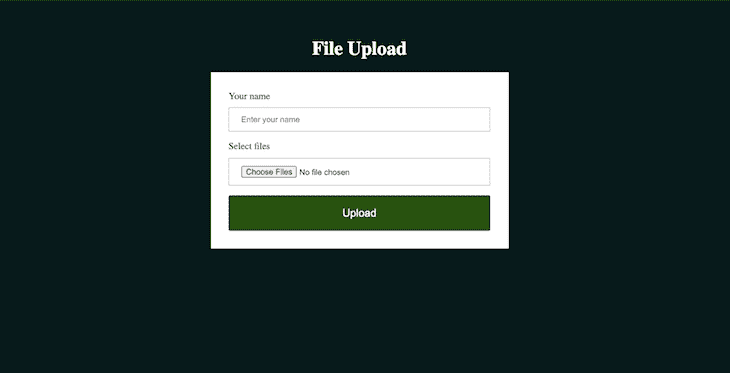
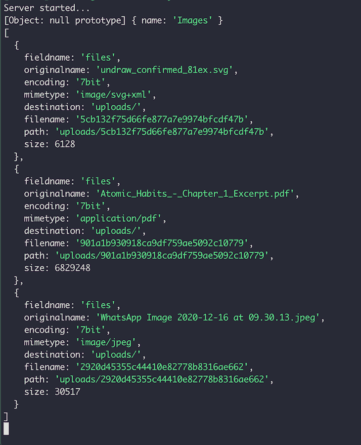

# Multer:使用 Node.js 和 Express - LogRocket Blog 轻松上传文件

> 原文：<https://blog.logrocket.com/multer-nodejs-express-upload-file/>

***编者按**:本文最后更新于 2022 年 3 月 24 日，以反映 Node.js 和`body-parser`库的更新。*

Multer 是一个用于处理`multipart/form-data`的 Node.js 中间件，它使得在 Node.js 中上传文件的过程变得更加容易。在本文中，我们将了解 [Multer](https://github.com/expressjs/multer) 在处理提交表单中的文件时的用途。我们还将通过构建一个带有前端和后端的迷你应用程序来测试上传文件，从而探索 Multer。我们开始吧！

## 目录

## 管理表单中的用户输入

Web 应用程序接收来自用户的所有不同类型的输入，包括文本、图形控件(如复选框或单选按钮)和文件(如图像、视频和其他媒体)。

在表单中，每一个输入都被提交给一个服务器，该服务器处理输入，以某种方式使用它们，也许把它们保存在其他地方，然后给前端一个`success`或`failed`响应。

当提交包含文本输入的表单时，服务器(在我们的例子中是 Node.js)要做的工作较少。使用 [Express，您可以很容易地获取在`req.body`对象](https://blog.logrocket.com/organizing-express-js-project-structure-better-productivity/)中输入的所有输入。然而，提交带有文件的表单要复杂一些，因为它们需要更多的处理，这就是 Multer 的用武之地。

## 用 Multer 编码和上传表单

所有表单都包含一个`enctype`属性，该属性指定在将数据发送到服务器之前，浏览器应该如何对数据进行编码。默认值为`application/x-www-form-urlencoded`，支持字母数字数据。另一种编码类型是`multipart/form-data`，通过表单上传文件。

使用`multipart/form-data`编码上传表单有两种方式。第一种是通过使用`enctype`属性:

```
<form action='/upload_files' enctype='multipart/form-data'>
...
</form>

```

上面的代码将表单数据发送到应用程序的`/upload_files`路径。第二种是通过使用`FormData` API。 [`FormData` API](https://developer.mozilla.org/en-US/docs/Web/API/FormData) 允许我们构建一个带有键值对的`multipart/form-data`表单，该表单可以被发送到服务器。下面是它的使用方法:

```
const form = new FormData()
form.append('name', "Dillion")
form.append('image', <a file>)

```

在发送这样的表单时，正确解析表单并对数据执行最终操作就成了服务器的责任。

## Multer:概述

Multer 是一个设计用来处理表单中的`multipart/form-data`的中间件。它类似于流行的 [Node.js `body-parser`](https://github.com/expressjs/body-parser) ，内置于表单提交的 Express 中间件。但是，Multer 的不同之处在于它支持多部分数据，只处理`multipart/form-data`表单。

Multer 通过在`req.body`对象中附加文本字段的值来完成`body-parser`的工作。Multer 还为多个文件创建了一个新的对象，或者是`req.file`或者是`req.files`，它保存了关于这些文件的信息。从文件对象中，您可以选择将文件发布到媒体管理 API[所需的任何信息，比如 Cloudinary](https://blog.logrocket.com/handling-images-with-cloudinary-in-react/) 。

现在我们已经了解了 Multer 的重要性，我们将构建一个小的示例应用程序来展示前端应用程序如何在一个表单中同时发送三个不同的文件，以及 Multer 如何在后端处理这些文件，使它们可供进一步使用。

## 构建支持多重功能的应用程序

我们将从使用普通的 HTML、CSS 和 JavaScript 构建前端开始。当然，您可以轻松地使用任何框架来跟进。

### 创建我们的前端

首先创建一个名为`file-upload-example`的文件夹，然后在里面再创建一个名为`frontend`的文件夹。在前端文件夹中，我们将有三个标准文件，`index.html`、`styles.css`和`script.js`:

```
&lt;!-- index.html -->
<body>
    <div class="container">
        <h1>File Upload</h1>
        <form id='form'>
            <div class="input-group">
                <label for='name'>Your name</label>
                <input name='name' id='name' placeholder="Enter your name" />
            </div>
            <div class="input-group">
                <label for='files'>Select files</label>
                <input id='files' type="file" multiple>
            </div>
            <button class="submit-btn" type='submit'>Upload</button>
        </form>
    </div>
    <script src='./script.js'></script>
</body>

```

注意，我们已经为`Your Name`和`Select Files`创建了一个标签和输入。我们还增加了一个`Upload`按钮。

接下来，我们将添加样式的 CSS:

```
/* style.css */
body {
    background-color: rgb(6, 26, 27);
}
* {
    box-sizing: border-box;
}
.container {
    max-width: 500px;
    margin: 60px auto;
}
.container h1 {
    text-align: center;
    color: white;
}
form {
    background-color: white;
    padding: 30px;
}
form .input-group {
    margin-bottom: 15px;
}
form label {
    display: block;
    margin-bottom: 10px;
}
form input {
    padding: 12px 20px;
    width: 100%;
    border: 1px solid #ccc;
}
.submit-btn {
    width: 100%;
    border: none;
    background: rgb(37, 83, 3);
    font-size: 18px;
    color: white;
    border-radius: 3px;
    padding: 20px;
    text-align: center;
}

```

以下是目前为止的网页截图:



File upload webpage screenshot with CSS

如您所见，我们创建的表单有两个输入，`name`和`files`。在`files`输入中指定的`multiple`属性使我们能够选择多个文件。

接下来，我们将使用下面的代码将表单发送到服务器:

```
// script.js
const form = document.getElementById("form");

form.addEventListener("submit", submitForm);

function submitForm(e) {
    e.preventDefault();
    const name = document.getElementById("name");
    const files = document.getElementById("files");
    const formData = new FormData();
    formData.append("name", name.value);
    for(let i =0; i < files.files.length; i++) {
            formData.append("files", files.files[i]);
    }
    fetch("http://localhost:5000/upload_files", {
        method: 'POST',
        body: formData,
        headers: {
          "Content-Type": "multipart/form-data"
        }
    })
        .then((res) => console.log(res))
        .catch((err) => ("Error occured", err));
}

```

当我们使用`script.js`时，有几件重要的事情必须发生。首先，我们从 DOM 中获取`form`元素，并向其中添加一个`submit`事件。在提交时，我们使用`preventDefault`来阻止浏览器在表单提交时采取的默认动作，这通常会重定向到`action`属性的值。接下来，我们从 DOM 中获取`name`和`files`输入元素，并创建`formData.`

从这里开始，我们将使用键`name`将名称输入的值追加到`formData`中。然后，我们使用一个键`files`将我们选择的多个文件动态添加到`formData`中。

> 注意:如果我们只关心一个文件，我们可以添加`files.files[0]`。

最后，我们将向`[http://localhost:5000/upload_files](http://localhost:5000/upload_files)`添加一个`POST`请求，这是我们将在下一节构建的后端 API。

### 设置服务器

对于我们的演示，我们将使用 Node.js 和 Express 构建我们的后端。我们将在`upload_files`中设置一个简单的 API，并在`localhost:5000`上启动我们的服务器。API 将接收一个`POST`请求，其中包含来自提交表单的输入。

为了在我们的服务器上使用 Node.js，我们需要建立一个基本的 Node.js 项目。在`file-upload-example`终端中的项目根目录下，运行下面的代码:

```
npm init -y

```

上面的命令创建了一个基本的`package.json`,包含一些关于你的应用程序的信息。接下来，我们将安装所需的依赖项，对于我们的目的来说是 Express:

```
npm i express

```

接下来，创建一个`server.js`文件并添加以下代码:

```
// server.js
const express = require("express");

const app = express();
app.use(express.json());
app.use(express.urlencoded({ extended: true }));

app.post("/upload_files", uploadFiles);
function uploadFiles(req, res) {
    console.log(req.body);
}
app.listen(5000, () => {
    console.log(`Server started...`);
});

```

Express 包含了`bodyParser`对象，这是一个用表单上提交的输入填充`req.body`的中间件。调用`app.use(express.json())`对我们服务器的每个请求执行中间件。

API 是用`app.post('/upload_files', uploadFiles)`设置的。`uploadFiles`是 API 控制器。如上所示，我们只注销了`req.body`，它应该由`epxress.json()`填充。我们将在下面的例子中测试这一点。

### 在 Express 中运行`body-parser`

在您的终端中，运行`node server`来启动服务器。如果操作正确，您将在终端中看到以下内容:


Run Node server output start server

现在，您可以在浏览器中打开您的前端应用程序。在前端填写两个输入，名称和文件，然后点击**提交**。在您的后端，您应该看到以下内容:


Backend visual name and file inputs

上图中的代码意味着`req.body`对象是空的，这是意料之中的。如果你还记得的话，`body-parser`不支持`multipart`数据。相反，我们将使用 Multer 来解析表单。

## 安装和配置 Multer

通过在终端中运行以下命令来安装 Multer:

```
npm i multer

```

要配置 Multer，将以下内容添加到`server.js`的顶部:

```
const multer = require("multer");
const upload = multer({ dest: "uploads/" });
...

```

尽管 Multer 有许多其他配置选项，但我们只对项目的`dest`属性感兴趣，它指定 Multer 保存编码文件的目录。

接下来，我们将使用 Multer 拦截 API 上的传入请求，并解析输入，使它们在`req`对象上可用:

```
app.post("/upload_files", upload.array("files"), uploadFiles);

function uploadFiles(req, res) {
    console.log(req.body);
    console.log(req.files);
    res.json({ message: "Successfully uploaded files" });
}

```

要处理多个文件，请使用`upload.array`。对于单个文件，使用`upload.single`。注意，`files`参数取决于在`formData`中指定的输入名称。

Multer 会将文本输入添加到`req.body`中，并将文件添加到`req.files`数组中。要在终端中看到这一点，输入**文本**并在前端选择多个图像，然后**提交**并在您的终端中检查记录的结果。

正如您在下面的例子中看到的，我在`text`输入中输入了`Images`，并选择了一个 PDF、一个 SVG 和一个 JPEG 文件。下面是记录结果的屏幕截图:



Logged results screenshot images text input

作为参考，如果你想上传到像 Cloudinary 这样的存储服务，你必须直接从上传文件夹发送文件。属性显示了文件的路径。

## 结论

仅对于文本输入，Express 中使用的`bodyParser`对象就足以解析这些输入。它们使输入在`req.body`对象中作为键值对可用。当表单包含包含文本输入和文件的`multipart`数据，而`body-parser`库无法处理这些数据时，Multer 就派上了用场。

使用 Multer，除了通过表单发送的文本输入外，还可以处理单个或多个文件。请记住，您应该只在通过表单发送文件时使用 Multer，因为 Multer 不能处理任何不是多部分的表单。

在本文中，我们简要介绍了表单提交、服务器上主体解析器的好处以及 Multer 在处理表单输入中的作用。我们还使用 Node.js 和 Multer 构建了一个小应用程序来查看文件上传过程。

对于接下来的步骤，您可以使用 [Upload API 参考](https://cloudinary.com/documentation/image_upload_api_reference)从您的服务器上传到 Cloudinary。我希望你喜欢这篇文章！编码快乐！

## 200 只显示器出现故障，生产中网络请求缓慢

部署基于节点的 web 应用程序或网站是容易的部分。确保您的节点实例继续为您的应用程序提供资源是事情变得更加困难的地方。如果您对确保对后端或第三方服务的请求成功感兴趣，

[try LogRocket](https://lp.logrocket.com/blg/node-signup)

.

[](https://lp.logrocket.com/blg/node-signup)[https://logrocket.com/signup/](https://lp.logrocket.com/blg/node-signup)

LogRocket 就像是网络和移动应用程序的 DVR，记录下用户与你的应用程序交互时发生的一切。您可以汇总并报告有问题的网络请求，以快速了解根本原因，而不是猜测问题发生的原因。

LogRocket 检测您的应用程序以记录基线性能计时，如页面加载时间、到达第一个字节的时间、慢速网络请求，还记录 Redux、NgRx 和 Vuex 操作/状态。

[Start monitoring for free](https://lp.logrocket.com/blg/node-signup)

.