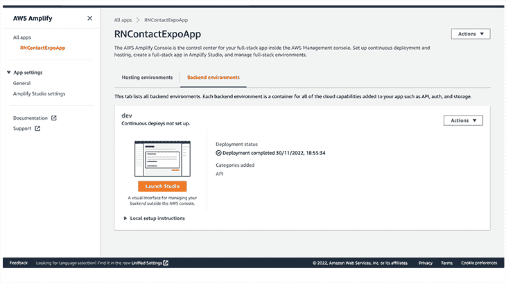
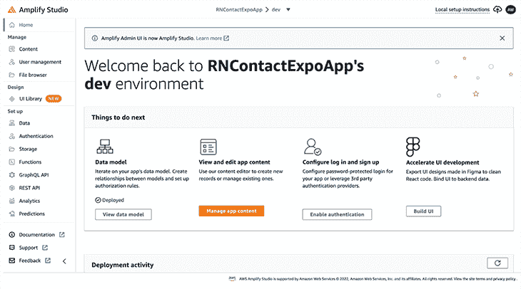
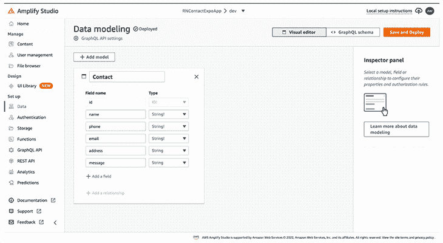
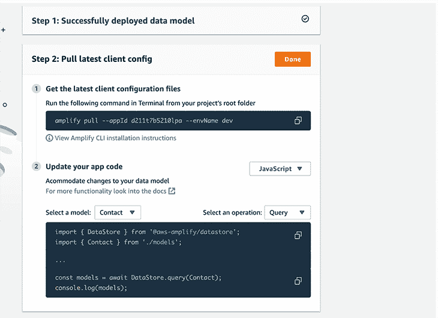
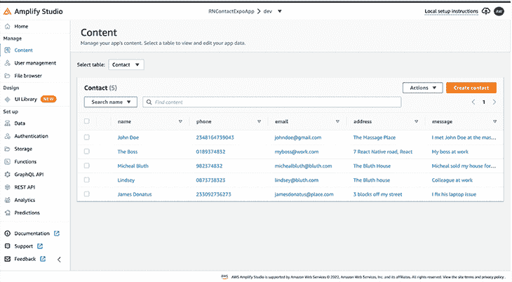
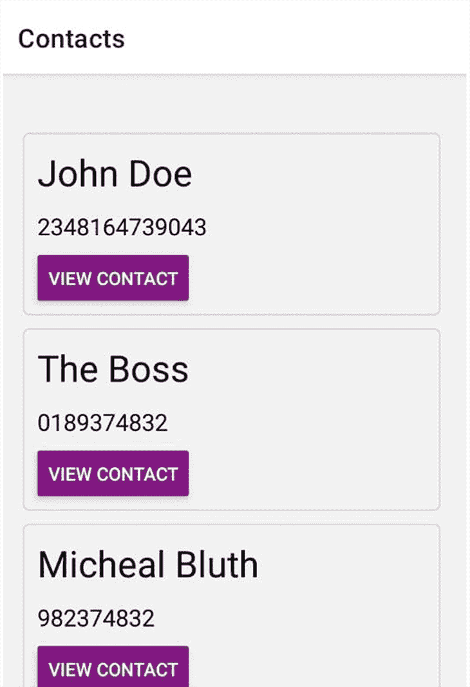

# Expo 中的本地路由指南

> 原文：<https://blog.logrocket.com/native-routing-expo-react-native/>

十年前，如果有人告诉你，你可以使用 JavaScript 构建本地移动应用程序，而不会损害 UX，你不会相信，对不对？然后 React Native 出现了，使之成为可能。

几年前，如果有人告诉你，你可以使用 JavaScript 构建跨平台的应用程序，而不需要像 Android Studio 或 Xcode 这样繁重的仿真器/开发环境，你也不会想到这是可行的，对吗？于是世博会诞生了。

Expo 和 React Native 经常互换使用。这是可以理解的，因为它们具有相似的功能，但它们之间也有一些不同之处:

*   Expo 在 React Native 之上构建了一层工具，允许开发人员无需编写任何本机代码就可以构建应用程序
*   Expo 有一个 CLI ( `expo cli`)，允许开发者在他们的设备上创建项目、部署项目和打开应用程序
*   Expo 有一个客户端应用程序 Expo Go，你可以在那里打开你的项目，而不需要 Android Studio 或 Xcode

然而，Expo 和 React Native 有一个共同的主要特点:导航。React 本地应用中的路由是使用 [React 导航](https://blog.logrocket.com/guide-react-native-navigation/)实现的，它用一个`navigator`组件包装你的应用，该组件管理应用中的导航历史和屏幕显示。

这很有效，但也有它的问题:

*   您必须安装对等依赖项，如`react-native-screens`、`react-native-safe-area-context`。这给你的应用增加了额外的重量
*   JavaScript 开发人员喜欢基于文件的路由。Next.js 基于文件的路由风格运行良好，并且很快成为 JavaScript 应用程序中路由的当前标准

这促使 Expo 的创造者 Evan Bacon 建立了一个名为 [Expo Router 的新图书馆。](https://github.com/expo/router) Expo 路由器的工作原理与 Next.js 路由器类似。它们都完全基于项目的文件结构生成嵌套导航和深层链接。

在本文中，我们将探讨 Expo 路由器的一些优点和缺点。Expo Router 目前处于测试阶段，但我们将使用 Expo Router 构建一个 React 本地应用程序来演示其核心概念。

*向前跳转:*

## Expo 路由器的核心特性

这些是新型 Expo 路由器的核心特性:

*   **离线优先快速**:本地应用必须在没有互联网连接的情况下处理传入的 URL。Expo Router 通过在整个框架中实现这些功能来实现这一点
*   **错误处理**:您可以[在每条路线上设置反应](https://blog.logrocket.com/react-error-handling-react-error-boundary/) [错误边界](https://blog.logrocket.com/react-error-handling-react-error-boundary/)
*   **布局路线**:你应用中的大部分屏幕会共享相同的布局组件。Expo Router 允许您在`app`目录中创建父布局组件
*   **Next.js 类链接和动态静态路由**:类似于 [Next.js 路由器](https://blog.logrocket.com/what-you-need-know-new-next-js-router/)，可以使用`Link`组件链接路由

```
import { Link } from "expo-router";

export default function Page() {
return (

Home
);
}
```

到目前为止，新的 Expo 路由器唯一的主要缺点是它有局限性和固执己见。一些开发者可能喜欢 Expo 路由器的特性，但是想要重新安排文件目录结构。不幸的是，由于其局限性，您可能还不能定制您的 Expo 路由器实例来适应您的首选结构。

让我们继续构建一个联系人目录应用程序，它使用 Expo 路由器在屏幕之间导航。

要完成本教程，请确保您具备以下条件:

*   已安装 Node.js ≥v14
*   JavaScript 和 React 知识
*   AWS Amplify CLI 安装:
    `npm` `install -g @aws-amplify/cli`
*   AWS 放大器配置:
    `amplify configure`
*   世博 CLI 安装:
    `npm install -g expo-cli`
*   Expo Go(从您的手机游戏商店安装)

这是带有完整演示代码的 GitHub repo。

## 入门指南

让我们从搭建一个新的 Expo 应用程序开始吧。在您的终端上运行以下命令:

```
npx create-react-native-app -t with-router

```

这将创建一个新的配置了 Expo 路由器的 React 本地应用程序。在您的终端上使用以下命令更改目录、初始化 Amplify 并安装对等依赖项:

```
cd ReactNativeContactExpoApp
npx [email protected]
npm install aws-amplify @react-native-community/netinfo @react-native-async-storage/async-storage

```

要运行应用程序，请运行`yarn start`或`npm run start`。

```
Starting Metro Bundler
▄▄▄▄▄▄▄▄▄▄▄▄▄▄▄▄▄▄▄▄▄▄▄▄▄▄▄
█ ▄▄▄▄▄ █▄▄███▀ ███ ▄▄▄▄▄ █
█ █   █ █ ▀█ ▄ █▄██ █   █ █
█ █▄▄▄█ █▄ ▄▄▀▀█▄██ █▄▄▄█ █
█▄▄▄▄▄▄▄█▄▀▄▀▄█ █ █▄▄▄▄▄▄▄█
█▄▄▄ ▀▀▄█ ▀████▀██▄██▄ ▄▀▄█
█▀▄▀▄▄▄▄▀▄██▀▀▀▄█▄█ ▀██▀███
█▄▀█▀ ▄▄▀▄▄▀ ▄ █ ▄█ ▄ █ █▀█
█▀▄▀██▀▄█ ▀ █▀███ ▀▀█▀▀█ ▀█
███▄▄▄▄▄█ ▄▀ ▄  ▄ ▄▄▄ ▀▄█▀█
█ ▄▄▄▄▄ ███ ▀▄███ █▄█ █▄  █
█ █   █ █▀▀█▀ ▀▀▀▄▄   █▀▀ █
█ █▄▄▄█ █  ▄▄█▀ ▀▄▀▄█▄▄ ▄██
█▄▄▄▄▄▄▄█▄█▄██▄█▄██████▄▄▄█

› Metro waiting on exp://192.168.55.200:19000
› Scan the QR code above with Expo Go (Android) or the Camera app (iOS)

› Web is waiting on http://localhost:19000

› Press a │ open Android
› Press i │ open iOS simulator
› Press w │ open web

› Press j │ open debugger
› Press r │ reload app
› Press m │ toggle menu

› Press ? │ show all commands

```

扫描移动 Expo Go 应用程序上的二维码，它就会编译。

就像所有其他数据库一样，数据存储需要一个模型。要生成这个模型，请前往 **Amplify 目录** > **后端**>**API**>**(Amplify 项目名称)** > `schema.graphql`。用这几行代码修改`schema.graphql`:

```
type Contact @model {
  id: ID!
  name: String!
  phone: String!
  email: String!
  address: String
  message: String
}

```

接触模型有`id`、`name`、`title`、`phone`、`email`作为字段。现在让我们继续在您的终端上用这个命令生成模型:

```
npm run amplify-modelgen

```

这将创建一个包含模型和 GraphQL 模式的`src` / `models`文件夹。

## 初始化后端环境

我们需要为应用程序初始化一个 Amplify 后端环境。为此，请在您的终端上运行以下命令:

```
amplify init
? Enter a name for the environment dev
? Choose your default editor: Visual Studio Code
Using default provider  awscloudformation
? Select the authentication method you want to use: AWS profile

```

这将在`src/aws-config.js`中创建一个配置文件。接下来，我们将使用以下命令部署后端并创建 AWS 资源:

```
amplify push
...
Do you want to generate code for your newly created GraphQL API? No
...

```

根据您的互联网连接质量，这可能需要一些时间来部署。

## 使用数据存储配置应用程序

让我们继续配置 Expo 应用程序，以便与 Amplify 配合使用。创建一个`app/index.js`并添加以下代码行:

```
import config from '../src/aws-exports';
import { DataStore, Amplify } from 'aws-amplify';

Amplify.configure(config)

```

让我们向数据存储添加一些联系人。要做到这一点，请在浏览器中打开 AWS Amplify 控制台。快捷方式是在你的终端运行`amplify console`并选择 **AWS 控制台**。

要使用 Amplify Studio 创建联系人，请转到 Amplify 仪表盘并点击**启动 Studio** :



您应该会看到类似这样的内容:



点击仪表盘左侧栏的**数据**菜单，点击**保存部署**。



现在您可以看到我们创建的模式，并使用 UI 编辑它。部署数据模型可能需要几分钟时间，具体取决于您的互联网连接。



部署完成后，打开**内容**菜单。



点击**创建联系人**按钮创建一个新的联系人。您也可以通过点击**动作**下拉菜单并选择**自动生成数据来自动生成种子数据。**

就是这样！我们已成功为该应用程序创建了联系人。

让我们渲染一下联系人。用这几行代码更新`app/index.js`:

```
import { View, Text, Button } from "react-native";
import { Link, Stack } from "expo-router";
import config from '../src/aws-exports';
import { DataStore, Amplify } from 'aws-amplify';
import { Contact } from '../src/models'
import { useState } from "react";

Amplify.configure(config)

export default function Home() {
    const [contacts, setContacts] = useState([])

    async function fetchContacts() {
        const allContacts = await DataStore.query(Contact)
        setContacts(allContacts)
    }

    fetchContacts()

    return (
        <View style={container}>
            <Stack.Screen options={{ title: "Contacts" }} />
            {
                contacts.map(contact => (
                    <View key={contact.id} style={contactBox}>

                        <View>
                            <Text style={textStyleName}>{contact.name}</Text>
                            <Text style={textStyle}>{contact.phone}</Text>

                        </View>
                        <Link href={`contacts/${contact.id}`}>
                            <Button
                                title="View contact"
                                color="#841584"
                            />
                        </Link>
                    </View>
                ))
            }
        </View>
    );
}

```

这里，我们通过将模型传递给`DataStore .query()`方法来查询数据存储中的联系人。

```
DataStore.query(Contact)

```

为了获得每个联系人的更多细节，我们使用了新的 Expo 路由器组件`link`，并将`[contact.id](<[http://contact.id&gt](http://contact.id&gt);)`传递给了`href`属性。动态路线会是`contacts/[contactId]`。

让我们为联系人详细信息创建一个屏幕。在 app 目录下，创建一个`contacts`文件夹和一个`[id].js`文件。

```
import { Text, View } from "react-native";
import { Stack } from "expo-router";
import { useEffect, useState } from "react";
import { Contact } from "../../src/models";
import { DataStore } from "aws-amplify";

export default function SingleContact({ route }) {
    const [contact, setContact] = useState('')
    useEffect(() => {
        if (!route.params?.id) {
            return
        }
        DataStore.query(Contact, route.params.id).then(setContact)
    }, [route.params?.id])
    return (
        <View style={container}>
            <Stack.Screen options={{ title: contact.name }} />
            <View style={contactBox}>
                <Text style={textStyleName}>{contact.name}</Text>
                <Text style={textStyle}>{contact.phone}</Text>
                <Text style={textStyle}>{contact.email}</Text>
                <Text style={textStyle}>{contact.address}</Text>
                <Text style={textStyle}>{contact.message}</Text>
            </View>
        </View>
    );
}

```

如果您使用过 Next.js，这段代码应该很熟悉。主要区别在于 Expo 路由器使`route`对象可用，而无需导入它。

在 DataStore 中，要按 ID 查询单个项目，可以传递要查询的型号和 ID。在我们的例子中，我们传递参数 ID。厉害！运行您的应用程序，您应该会得到如下结果:



Our final contacts app, build with the new Expo Router

## 结论

这篇文章向我们介绍了 Expo 路由器、它的工作原理、它的核心特性以及它的优缺点。我们用 Expo 和来自 Amplify DataStore 的数据构建了一个 React 本地应用程序。

基于文件的路由是移动应用平滑导航体验的未来。Expo 路由器在其库中实现了该解决方案。虽然它只是在测试版，但 Expo 路由器的特性令人印象深刻，肯定会让 React 本地开发人员兴奋不已。

## [LogRocket](https://lp.logrocket.com/blg/react-native-signup) :即时重现 React 原生应用中的问题。

[](https://lp.logrocket.com/blg/react-native-signup)

[LogRocket](https://lp.logrocket.com/blg/react-native-signup) 是一款 React 原生监控解决方案，可帮助您即时重现问题、确定 bug 的优先级并了解 React 原生应用的性能。

LogRocket 还可以向你展示用户是如何与你的应用程序互动的，从而帮助你提高转化率和产品使用率。LogRocket 的产品分析功能揭示了用户不完成特定流程或不采用新功能的原因。

开始主动监控您的 React 原生应用— [免费试用 LogRocket】。](https://lp.logrocket.com/blg/react-native-signup)