# 。面向 Android 和 iOS 的. NET MAUI 教程

> 原文：<https://blog.logrocket.com/net-maui-tutorial-android-ios/>

如果您想创建一个能够在移动和桌面平台上本地工作的跨平台应用程序，有许多很好的框架可供选择。

其中之一就是[。NET 多平台应用 UI](https://dotnet.microsoft.com/en-us/apps/maui) (MAUI)，微软的开源、跨平台框架，使用 C#和 XAML 构建移动和桌面应用。。NET MAUI 使您能够开发可以在 iOS、macOS、Android 和 Windows 上运行的应用程序，所有这些都来自一个共享的代码库。。NET MAUI 是对 [Xamarin 的一个进步。Forms](https://dotnet.microsoft.com/en-us/apps/xamarin/xamarin-forms#:~:text=building%20mobile%20apps.-,Xamarin.,API%20that%20is%20highly%20extensible.) ，它现在包含了为了更好的性能和可伸缩性而重新设计和优化的 UI 控件。

。NET 毛伊岛配备了 XAML 热重装，它可以在你修改你的 XAML 代码时更新你的应用程序界面，而不需要重新编译。同样，它也支持。NET hot reload，它将 C#代码更改应用到正在运行的应用程序，而无需重新编译整个程序。

在本文中，我们将探索。NET MAUI，回顾它的架构，比较它的特性 React Native 和 Flutter，最后在一个项目中使用它。我们开始吧！

*向前跳转:*

## 。NET 毛伊岛架构概述

。NET MAUI 提供了一次编写、随处运行的体验，同时仍然允许您访问本机的、特定于平台的 API。引擎盖下，。NET MAUI 使用特定于平台的框架在不同的目标设备上创建应用程序:

*   。NET for Android → Android 设备
*   Windows UI 3 (WinUI 3) → Windows 设备
*   。NET for iOS → iOS 设备
*   。NET for macOS → macOS 设备

下图对此进行了更详细的解释:

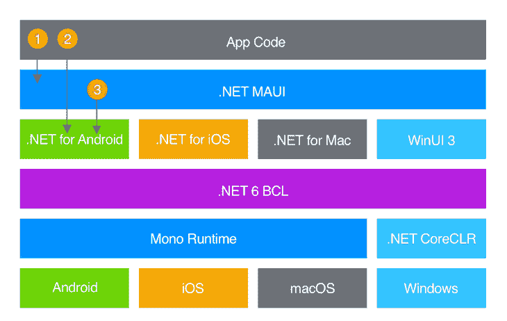

Image from learn.microsoft.com

更多地了解。NET MAUI 的架构，也可以参考官方[文档](https://learn.microsoft.com/en-us/dotnet/maui/what-is-maui?view=net-maui-7.0#how-net-maui-works)。

## 。网络毛伊岛 vs .颤动 vs .反应原生

虽然有许多跨平台框架，但全球开发者使用的最流行的是 Flutter 和 React Native。

如果我们在社区规模和第三方库兼容性的基础上比较这些。NET MAUI 是一个不太成熟的选项，2022 年 5 月发布。因此，如果你被困在某个地方，从社区获得帮助可能是一个挑战。此外，Visual Studio for Mac 可能比 Windows 操作系统有一点缺陷，性能也不如 Windows 操作系统。

。NET MAUI 主要使用 C#和 XAML 代码，所以如果你已经熟悉。NET 生态系统，那么 MAUI 很容易成为您的首选框架。另一方面， [Flutter 使用 Dart，这是 Google](https://blog.logrocket.com/pros-cons-flutter-app-development/) 推出的一种学习曲线明显更高的编程语言。最后，我们有了本地反应；React Native 由脸书开发，构建在 JavaScript 之上，是一个跨平台的应用程序开发框架。

虽然所有这些框架都可以部署到 Android、iOS、macOS 和 Windows，但有些需要额外的调整才能做到，如 React Native，它使用`[react-native-windows](https://github.com/microsoft/react-native-windows)`和 [`react-native-macos`](https://github.com/microsoft/react-native-macos) 来支持 Windows 和 macOS。另一方面，。NET MAUI 自带对这些的支持。

但是，与 Flutter 和 React Native 不同，您不能部署。NET 毛伊岛应用程序直接在网上。作为 Flutter 的额外收获，Flutter 应用程序也可以在基于 Linux 的操作系统上分发和运行。最终，由您来决定哪个框架是最合适的。但是，如果你需要一个. NET 生态系统。NET MAUI 肯定是你的首选框架。

## 。NET MAUI 安装和设置

在写我们的。NET 毛伊岛 app，我们首先需要正确安装设置。我们系统中的网络毛伊岛。由于我使用的是 macOS，所以我将指导您完成 macOS 的安装步骤。如果你用的是 Windows，可以参考[文档](https://learn.microsoft.com/en-us/dotnet/maui/get-started/installation?view=net-maui-7.0&tabs=vswin)。

首先，我们将下载[Mac 版 Visual Studio 2022】。系统将提示您添加安装配置；选择**。净** *→* **。NET MAUI**→**iOS**→**Android**。就是这样！现在，您应该能够在您的系统上运行 Visual Studio 2022 for Mac 了。](https://visualstudio.microsoft.com/vs/mac/)

## 创建新的。网络毛伊岛项目

当你打开 VS 2022 时，你会看到一个弹出窗口，如下图所示。要创建新项目，请点击**新建**:

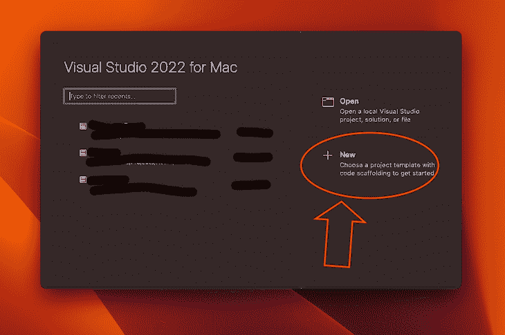

然后，系统会提示您选择项目类型。选择**多平台应用**和**。NET MAUI App** ，然后点击**继续**:

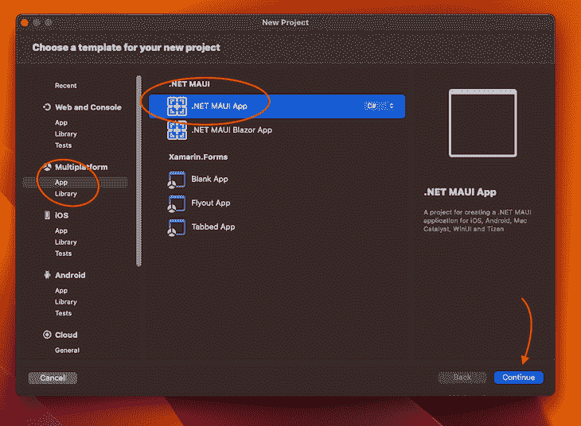

选择**。NET 7.0** 为目标框架，点击**继续**:

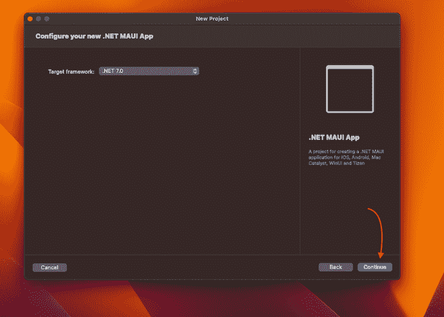

输入项目名称并取消勾选`Put project in a subfolder`复选框。点击**创建**创建您的应用程序:

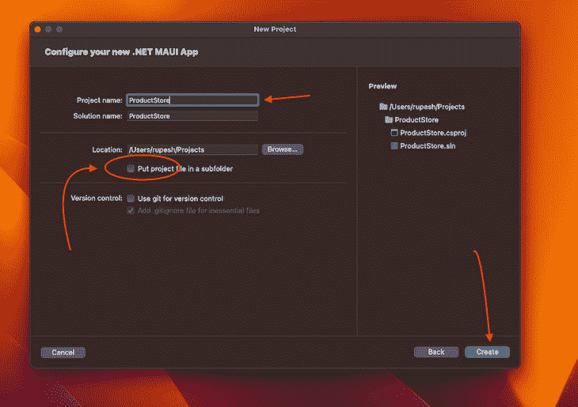

现在，您的项目应该创建好了，VS 22 应该打开了。从列表中选择您首选的调试设备或模拟器后，将鼠标光标移动到应用程序的左上角，然后单击**播放**图标:


你会注意到 Android 和 iOS 的构建时间非常快。您的模拟器将打开应用程序，在屏幕上显示预定义的虚拟文本:

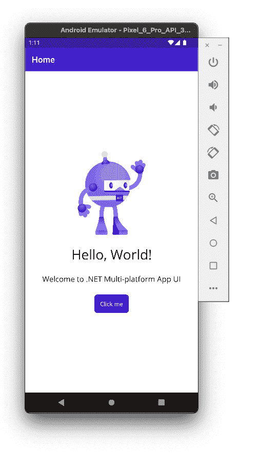

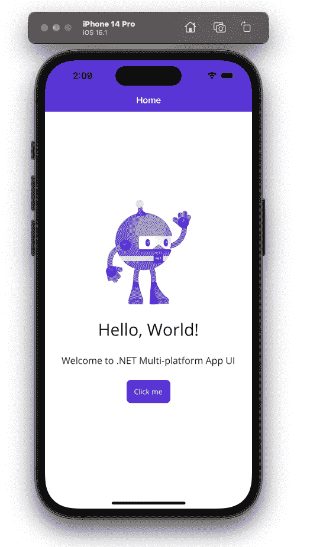

就这样，你创造了你的第一个。适用于 Android 和 iOS 的. NET MAUI 应用程序。在我们进入代码之前，首先，让我们了解我们将构建什么。

## 举例。网络毛伊岛应用

我们的示例应用程序相当简单，只显示两个屏幕，包括一个列表屏幕，它将显示带有图像的垂直产品列表。当我们点击一张图片时，我们将导航到`Product Detail`屏幕，该屏幕将显示该产品的所有信息。我们还将使用 HTTP 服务从 REST API 获取产品列表。

我们最终的应用程序用户界面将如下图所示:


您可以在这个 [GitHub 资源库](https://github.com/hrupesh/NET_MAUI_ProductStoreDemo)中找到本教程的代码。

## 用`CollectionView`设计一个列表

XAML 是创建 UI 的基本构件。网毛伊岛；让我们创建一个 UI 来呈现产品列表。在开始之前，我们需要组织我们的代码文件，以便我们各自的代码块都属于一个特定的文件夹:

*   `Views` : UI 元素和屏幕
*   `Models`:数据结构和类型
*   `Services` : API 处理程序和业务逻辑

删除`MainPage.xaml`文件及其代码隐藏文件，或者与该文件关联的`.cs`文件。在这种情况下，它是`MainPage.xaml.cs`。

右键点击`Solution Explorer`窗口中的项目，在`Project`中创建一个新文件夹，并将其命名为`Views`。下一步，我们将在这个文件夹中添加`ProductList`文件:

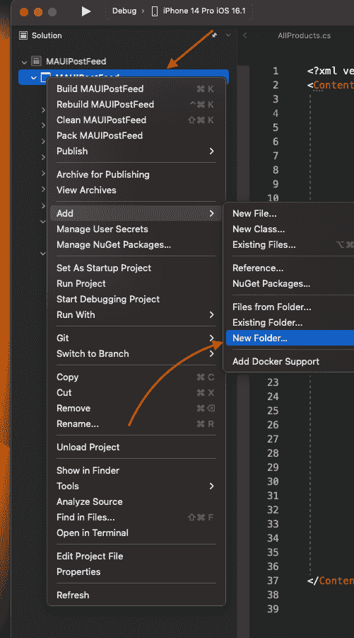

右键点击已创建的`Views`文件夹，选择**添加** → **新类别**:

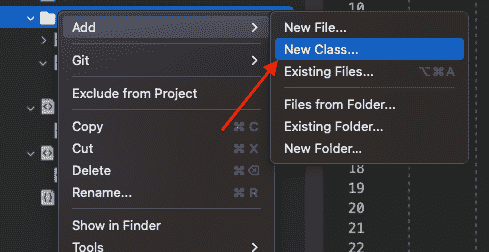

系统会提示您选择要创建的文件类型。选择**。净毛伊岛** → **。NET MAUI ContentPage(XAML)** 。将文件名改为`ProductList`并按**创建**:

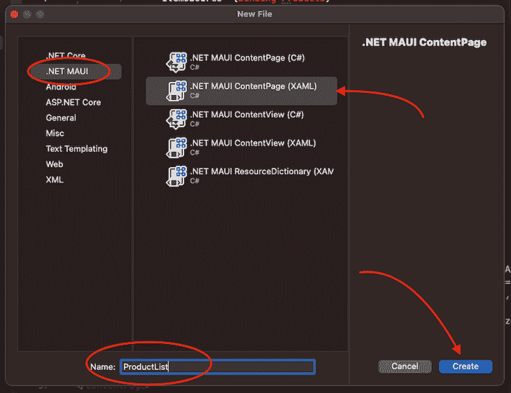

这将创建两个文件`ProductList.xaml`和它的代码隐藏文件`ProductList.xaml.cs`，其中将包含它的所有代码逻辑。

在用`ProductList.xaml`写任何代码之前，我们首先需要更新我们的`AppShell.xaml`文件，它是我们 UI 的根，顾名思义，是我们应用程序 UI 的`Shell`或结构:

```
<?xml version="1.0" encoding="UTF-8" ?>
<Shell
    x:Class="MAUIPostFeed.AppShell"

    xmlns:x="http://schemas.microsoft.com/winfx/2009/xaml"
   // Added views to refer to Views folder inside project
    xmlns:views="clr-namespace:MAUIPostFeed.Views"
    Shell.FlyoutBehavior="Disabled">
    <ShellContent
        Title="Products"
        // Using views to access Views.ProductList file
        ContentTemplate="{DataTemplate views:ProductList}" 
     />
</Shell>

```

现在我们的页面已经在`AppShell`中正确设置，让我们在`ProductList.xaml`文件中编写代码:

```
<?xml version="1.0" encoding="utf-8" ?>
<ContentPage 
        xmlns:x="http://schemas.microsoft.com/winfx/2009/xaml"
        x:Class="MAUIPostFeed.Views.ProductList"
        &gt;
        <CollectionView x:Name="productsCollection"
                ItemsSource="{Binding Products}"
                Margin="10"
                SelectionMode="Single"
                >
            <CollectionView.ItemsLayout>
                <LinearItemsLayout Orientation="Vertical" ItemSpacing="20"              />
            </CollectionView.ItemsLayout>
            <CollectionView.ItemTemplate>
                <DataTemplate>
                    <VerticalStackLayout>
                       <Image HeightRequest="180" Aspect="AspectFill" >
                            <Image.Source>
                                <UriImageSource
                                    Uri="{Binding thumbnail}"
                                    CacheValidity="00:12:00:00"
                                />
                            </Image.Source>
                        </Image>
                        <HorizontalStackLayout>
                            <Label Text="{Binding title}" FontSize="Title"                               FontAttributes="Bold" />
                            <Label Text="{Binding discountPercentage}"                                           FontSize="Default" Margin="40,4,0,0"                                                    FontAttributes="Italic"                                       FontFamily="Open-Sans" />
                            <Label Text=" % OFF" FontSize="Default" 
                               Margin="0,4,0,0" FontAttributes="Italic" 
                               FontFamily="Open-Sans"  />
                        </HorizontalStackLayout>
                        <Label Text="{Binding description}" MaxLines="2" 
                            FontSize="Subtitle" TextColor="Gray"  />
                    </VerticalStackLayout>
                </DataTemplate>
            </CollectionView.ItemTemplate>
        </CollectionView>
</ContentPage>

```

在上面的代码中，我们添加了`x:Class="MAUIPostFeed.Views.ProductList"`来给`ContentPage`一个类名，这样我们就可以从代码隐藏文件中访问它的`Controls`属性。

然后我们用来自`Binding`的`ItemSource = Products`创建了一个`CollectionView`。绑定是 XAML 中的一种机制，XAML 和代码隐藏类可以通过它进行通信。我们还没有创建`Products`；我们将在下一步中这样做。最后，我们使用`CollectionView.ItemTemplate`来定义列表项应该如何呈现。

至此，列表页面的 UI 部分就完成了。现在，让我们实际建立一个 HTTP 服务，从 REST API 获取产品，并将其存储在`ObservableCollection`中。

先说`ProductList`的代码隐藏文件。将以下代码粘贴到`ProductList.xaml.cs`文件中:

```
using MAUIPostFeed.Models;

namespace MAUIPostFeed.Views;

public partial class ProductList : ContentPage
{
        public ProductList()
        {
                InitializeComponent();
                // Initializing the BindingContext with Products
                BindingContext = new Models.AllProducts();
        }
}

```

在上面的代码中，我们将`BindingContext`设置为`Models.AllProducts`。但是，我们还没有创建任何模型，所以我们现在就开始吧。

## 集成 HTTP 服务

将名为`Models`的新文件夹添加到您的项目中。在内部，创建一个名为`AllProducts.cs`的新类。这个模型将包含我们想要显示的`Products`的列表。将以下代码粘贴到`AllProducts.cs`文件中:

```
using System.Collections.ObjectModel;
using MAUIPostFeed.Services;

namespace MAUIPostFeed.Models
{
    public class AllProducts
    {
        public ObservableCollection<Product> Products { get; set; } =                                new ObservableCollection<Product>();
        readonly IProductsRepository ProductsRepository =                                            new ProductsService();

        public AllProducts() =>
            LoadProducts();

        public async void LoadProducts()
        {
            ObservableCollection<Product> temp =                                                await ProductsRepository.LoadProducts();
            for (int i = 0; i < temp.Count; i++)
            {
                Products.Add(temp[i]);
            }
        }
    }
}

```

在上面的代码中，我们创建了一个名为`AllProducts`的类，并添加了一个`Products`属性，它是`Product`的一个`ObservableCollection`。稍后我们将创建`Product`类。

接下来，我们在类型`IProductsRepository`上添加了一个`ProductsRepository`属性，它用`ProductService`实例化。我们将在接下来的步骤中创建这些类。

在该类的构造函数中，我们调用了`LoadProducts`方法，该方法从`ProductsRepository`获取`Product`列表。然后，我们将每个产品推入我们的类属性`Products`。

我们的代码中还需要一个`Model`，它将保存`Products`的结构。在`Models`中添加一个新类，命名为`Products.cs`。然后，将以下代码添加到新类中:

```
using System;
using System.Collections.ObjectModel;

namespace MAUIPostFeed.Models;

public class Product
{
    public int id { get; set; }
    public string title { get; set; }
    public string description { get; set; }
    public int price { get; set; }
    public double discountPercentage { get; set; }
    public double rating { get; set; }
    public int stock { get; set; }
    public string brand { get; set; }
    public string category { get; set; }
    public string thumbnail { get; set; }
    public List<string> images { get; set; }
}

public class Products
{
    public ObservableCollection<Product> products { get; set; }
    public int total { get; set; }
    public int skip { get; set; }
    public int limit { get; set; }
}

```

在上面的文件中，我们创建了两个类。第一个，`Product`，保存单个`Product`的结构。第二个是`Products`，包含一个`Product`列表和一些我们从 API 中获得的其他数据。

至此，我们完成了`Models`。现在，让我们创建`Services`，它将与网络交互并获取产品。

在项目中，添加一个名为`Services`的新文件夹。在其中，创建一个名为`IProductsRepository`的新类，并在文件中添加以下代码:

```
using System;
using System.Collections.ObjectModel;
using MAUIPostFeed.Models;

namespace MAUIPostFeed.Services
{
        public interface IProductsRepository
        {
                Task<ObservableCollection<Product>> LoadProducts();
        }
}

```

在上面的代码中，我们创建了一个`IProductsRepository`接口，它有一个`LoadProducts`属性，或者一个返回`Product`的`ObservableCollection`的`Task`。

接下来，我们需要创建`ProductsService`类，它将实现`IProductsRepository`类并使用`HTTPClient`获取`Products`。创建一个名为`'ProductsService.cs`的新类，并向其中添加以下代码:

```
using System;
using System.Collections.ObjectModel;
using System.Diagnostics;
using System.Text.Json;
using MAUIPostFeed.Models;

namespace MAUIPostFeed.Services;

public class ProductsService: IProductsRepository
{
    HttpClient client;
    JsonSerializerOptions serializerOptions;

    public ObservableCollection<Product> Products { get; set; }

    private static string BASE_URL { get; set; } =                                                          "https://dummyjson.com/";

    public ProductsService()
    {
        client = new HttpClient();
        serializerOptions = new JsonSerializerOptions
        {
            PropertyNamingPolicy = JsonNamingPolicy.CamelCase,
            WriteIndented = true
        };
    }

    public async Task<ObservableCollection<Product>> LoadProducts()
    {
        Products = new ObservableCollection<Product>();

        Uri uri = new Uri(string.Format($"{BASE_URL}products?limit=10",                                   string.Empty));
        try
        {
            HttpResponseMessage response = await client.GetAsync(uri);
            if (response.IsSuccessStatusCode)
            {
                string content =                                                                     await response.Content.ReadAsStringAsync();
                Products temp =                                                    JsonSerializer.Deserialize<Products>(content, serializerOptions);
                Products = temp.products;
            }
        }
        catch (Exception ex)
        {
            Debug.WriteLine(@"\tERROR {0}", ex.Message);
        }

        return Products;
    }
}

```

您可能已经注意到，我们正在使用 [`dummyjson`](https://dummyjson.com/) 端点来获取一个`Products`列表。我们使用来自`HttpClient`的`GetAsync`方法来调用指定 API 端点上的`GET`请求。然后，我们使用我们的`Products`类`Deserialized`它，并且只分配从 API 响应接收的`products`。

就是这样。重新构建您的应用程序，您将在屏幕上看到十种产品的列表:

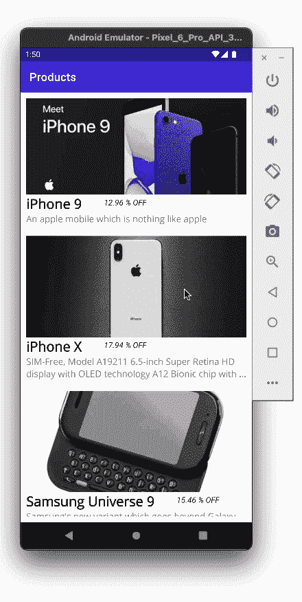

## 导航至`Details`页面

此时，我们可以在`Products`页面上看到产品列表。当用户点击任何产品时，他们应该被导航到`ProductDetails`页面；所有相关的产品信息都应该显示在那里。

为了实现这个功能，我们将把一个`Product`作为一个`NavigationParam`传递给`ProductDetails`页面。

创建新的。NET MAUI 内容页面放在`Views`文件夹中，并将其命名为`ProductDetails`。将下面的代码粘贴到`ProductDetails.xaml`中:

```
<?xml version="1.0" encoding="utf-8" ?>
<ContentPage 
             xmlns:x="http://schemas.microsoft.com/winfx/2009/xaml"
             x:Class="MAUIPostFeed.Views.ProductDetails"
             Title="Product Details"
             >
    <ScrollView BackgroundColor="#eee"  >
        <VerticalStackLayout>
            <CarouselView Loop="False"
                ItemsSource="{Binding product.images}"
                VerticalOptions="Start"
                HeightRequest="300"
                HorizontalScrollBarVisibility="Never" >
                <CarouselView.ItemTemplate>
                    <DataTemplate>
                            <Image Source="{Binding}"
                                Aspect="AspectFit"
                                HeightRequest="300" />
                    </DataTemplate>
                </CarouselView.ItemTemplate>
            </CarouselView>
            <VerticalStackLayout Margin="24, 10" Spacing="10" >
                <Label Text="{Binding product.title}" FontSize="Title" FontFamily="OpenSansSemibold" />
                <Label Text="{Binding product.description}" FontSize="Body" FontFamily="OpenSansRegular" />
                <Grid ColumnDefinitions="*,*" ColumnSpacing="30" Margin="0, 10" >
                    <HorizontalStackLayout>
                        <Label Text="💵  $" FontSize="30" VerticalTextAlignment="Center" FontFamily="OpenSansRegular" />
                        <Label Text="{Binding product.price}" FontSize="40" FontFamily="OpenSansRegular" />
                    </HorizontalStackLayout>
                    <HorizontalStackLayout Grid.Column="1">
                        <Label Text="⭐️  " FontSize="30" VerticalTextAlignment="Center" FontFamily="OpenSansRegular" />
                        <Label Text="{Binding product.rating}" FontSize="40" FontFamily="OpenSansRegular" />
                    </HorizontalStackLayout>
                </Grid>
                <HorizontalStackLayout>
                    <Label Text="Stocks left: " FontSize="20" VerticalTextAlignment="Center" FontFamily="OpenSansRegular" />
                    <Label Text="{Binding product.stock}" FontSize="30" FontFamily="OpenSansRegular" />
                </HorizontalStackLayout>
                <HorizontalStackLayout>
                    <Label Text="Brand: " FontSize="20" VerticalTextAlignment="Center" FontFamily="OpenSansRegular" />
                    <Label Text="{Binding product.brand}" FontSize="30" FontFamily="OpenSansRegular" />
                </HorizontalStackLayout>
                <HorizontalStackLayout>
                    <Label Text="Category: " FontSize="20" VerticalTextAlignment="Center" FontFamily="OpenSansRegular" />
                    <Label Text="{Binding product.category}" TextTransform="Uppercase" FontSize="30" FontFamily="OpenSansRegular" />
                </HorizontalStackLayout>
            </VerticalStackLayout>
        </VerticalStackLayout>
    </ScrollView>
</ContentPage>

```

在上面的代码中，我们将完整的 UI 包装在一个`ScrollView`中，并使用一个`CarouselView`来显示一个`Product`的`images`列表。然后，我们使用一个`VerticalStackLayout`来显示关于使用`Label`的产品的所有相关信息。

然而，因为我们还没有将从`Navigation`获得的导航参数映射到`BindingContext`，所以这是行不通的。为此，在`ProductDetails.xaml.cs`中添加以下代码:

```
using System.ComponentModel;
using MAUIPostFeed.Models;

namespace MAUIPostFeed.Views;

[QueryProperty(nameof(Product), "product")]
public partial class ProductDetails : ContentPage, IQueryAttributable,                                           INotifyPropertyChanged
{
    public Product product { get; private set; }

    public void ApplyQueryAttributes(IDictionary<string, object> query)
    {
        product = query["product"] as Product;
        OnPropertyChanged("product");
    }

    public ProductDetails()
    {
        InitializeComponent();
        BindingContext = this;
    }
}

```

在上面的代码中，我们使用`IQueryAttributable`及其`ApplyQueryAttributes`将`product`属性设置为我们从`QueryProperty`中获得的值。

最后，在`ProductList`页面中添加导航逻辑。在`products`的`CollectionView`中添加`SelectionChanged`事件处理程序:

```
<CollectionView x:Name="productsCollection"
                ItemsSource="{Binding Products}"
                Margin="10"
                // Add below lines
                SelectionMode="Single"
                SelectionChanged="productsCollection_SelectionChanged"
                >

```

现在我们已经传递了一个`eventHandler`，让我们在代码隐藏文件中创建`eventHandler`。在`ProductList.xaml.cs`中增加以下方法:

```
    async void productsCollection_SelectionChanged(System.Object sender,                      Microsoft.Maui.Controls.SelectionChangedEventArgs e)
    {
        if (e.CurrentSelection.Count != 0)
        {
            Product product = e.CurrentSelection.FirstOrDefault()                                          as Product;
            var navigationParams = new Dictionary<string, object>
            {
                { "product", product }
            };
            await Shell.Current.GoToAsync("ProductDetails",                                                           navigationParams);

            productsCollection.SelectedItem = null;
        }
      }

```

在上面的代码中，当选择了`CollectionView`中的任何项目时，我们将导航到`ProductDetails`页面。然后，我们将`productsCollection`列表的`selectedItem`设置为`null`，重置 UI。

如果您现在运行这段代码，它将不起作用，因为我们还没有在`Router1`中注册`ProductDetails`页面。为此，将以下代码粘贴到`AppShell.xaml.cs`中:

```
using MAUIPostFeed.Views;

namespace MAUIPostFeed;

public partial class AppShell : Shell
{
    public AppShell()
    {
        InitializeComponent();
        // Registering the Page into Routes
        Routing.RegisterRoute("ProductDetails",                                                       typeof(ProductDetails));
    }
}

```

至此，我们的应用程序就完成了。现在，如果您构建并运行项目，输出将类似于下图:

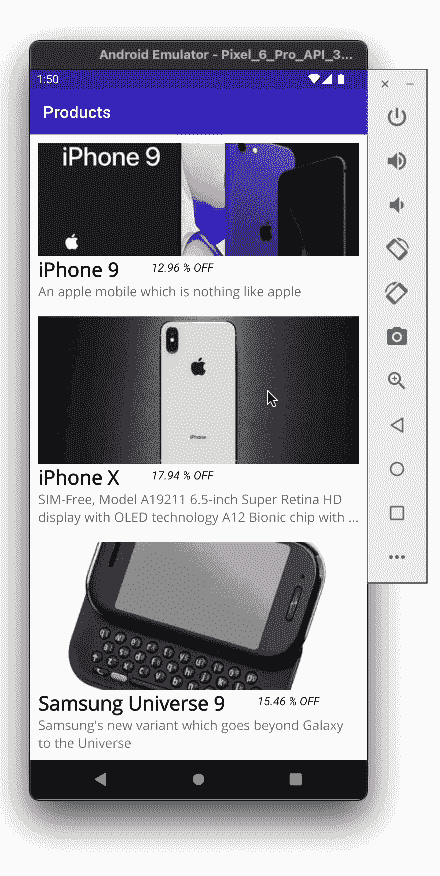

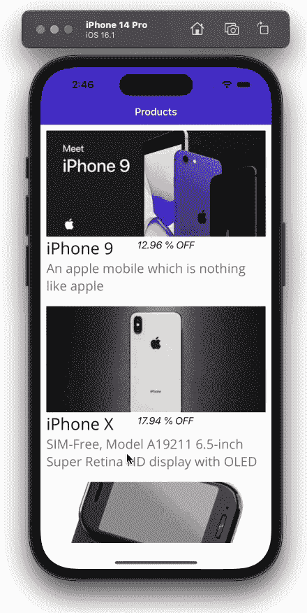

## 结论

在本文中，我们学习了如何使用。网毛伊岛。但是，。NET MAUI 不仅限于 iOS 和 Android 我们也可以使用相同的代码库在 macOS 和 Windows 上部署应用程序。

。NET MAUI 是一个高性能的框架，非常适合构建跨平台的应用程序，特别是如果您想留在. NET 生态系统中而不必学习新的框架。我希望你喜欢这篇文章，感谢阅读！

## LogRocket :即时重现你的安卓应用中的问题。

[](https://lp.logrocket.com/blg/kotlin-signup)

[LogRocket](https://lp.logrocket.com/blg/kotlin-signup) 是一款 Android 监控解决方案，可以帮助您即时重现问题，确定 bug 的优先级，并了解您的 Android 应用程序的性能。

LogRocket 还可以向你展示用户是如何与你的应用程序互动的，从而帮助你提高转化率和产品使用率。LogRocket 的产品分析功能揭示了用户不完成特定流程或不采用新功能的原因。

开始主动监控您的 Android 应用程序— [免费试用 LogRocket】。](hhttps://lp.logrocket.com/blg/kotlin-signup)