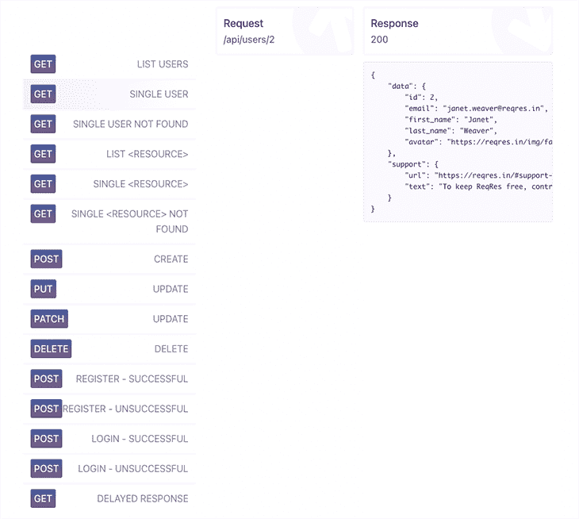
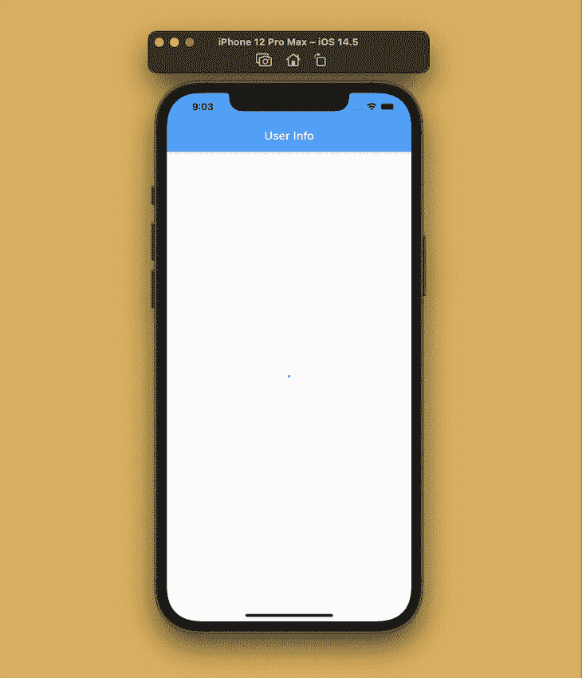
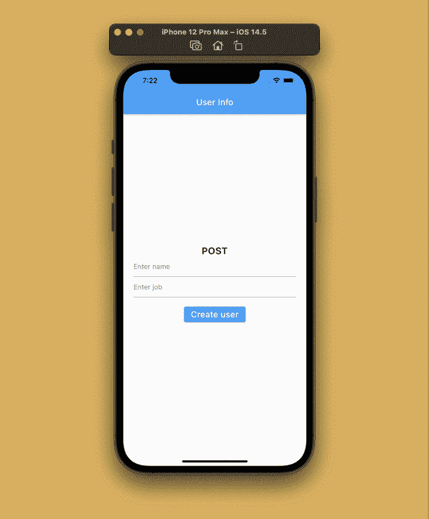
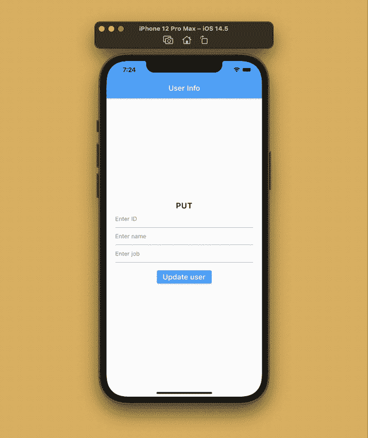
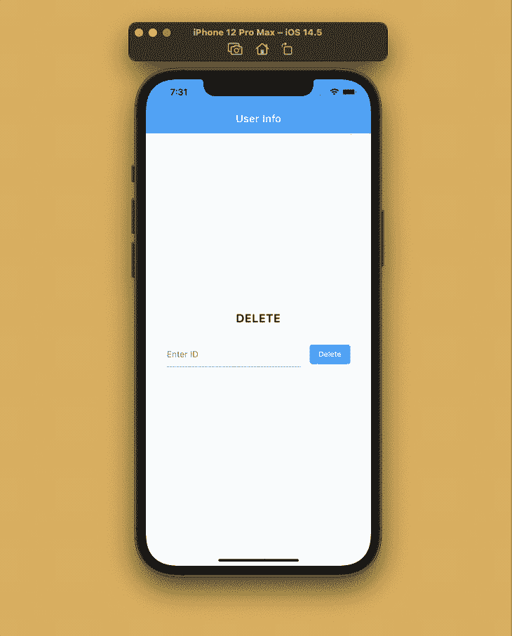

# 使用 Dio 在 Flutter 中联网

> 原文：<https://blog.logrocket.com/networking-flutter-using-dio/>

应用程序开发的一个关键部分是优雅地处理网络请求。网络返回的响应可能包含意想不到的结果，为了获得良好的用户体验，您需要提前处理边缘情况。

在本文中，我们将看看如何使用 Dio 包在 Flutter 中处理 REST API 请求。

## Dio 是什么？

Dio 是 Dart 的强大 HTTP 客户端[。它支持拦截器、全局配置、`FormData`、请求取消、文件下载和超时等等。Flutter 提供了一个](https://blog.logrocket.com/introduction-to-using-dart-in-flutter/) [http 包](https://pub.dev/packages/http)，对于执行基本的网络任务来说很好，但是在处理一些高级功能时却令人望而生畏。相比之下，Dio 提供了一个直观的 API 来轻松执行高级网络任务。

## 入门指南

让我们从创建一个新的 Flutter 项目开始。使用以下命令:

```
flutter create dio_networking

```

您可以使用您最喜欢的 IDE 打开项目，但是对于这个例子，我将使用 VS 代码来[:](https://blog.logrocket.com/essential-vs-code-extensions-for-flutter/)

```
code dio_networking

```

将 Dio 包添加到您的`pubspec.yaml`文件中:

```
dependencies:
  dio: ^4.0.0

```

用以下内容替换您的`main.dart`文件的内容:

```
import 'package:flutter/material.dart';

void main() {
  runApp(MyApp());
}

class MyApp extends StatelessWidget {
  @override
  Widget build(BuildContext context) {
    return MaterialApp(
      title: 'Dio Networking',
      theme: ThemeData(
        primarySwatch: Colors.blue,
      ),
      debugShowCheckedModeBanner: false,
      home: HomePage(),
    );
  }
}

```

我们将在获取网络数据后定义`HomePage`类。

现在，让我们来看看将用于演示的网络数据。

## 使用 API 数据进行测试

我们将使用 [REQ | RES](https://reqres.in/) 来测试我们的网络数据，因为它为您提供了由样本用户数据组成的托管 REST API，并允许您执行各种网络操作测试。



我们将从一个简单的获取数据的 GET 请求开始。为此所需的端点是:

```
GET https://reqres.in/api/users/<id>

```

注意这里的`<id>`必须替换为一个整数值，该整数值对应于并用于查找特定的用户。

当请求成功时，示例 JSON 响应应该是这样的:

```
{
    "data": {
        "id": 2,
        "email": "[email protected]",
        "first_name": "Janet",
        "last_name": "Weaver",
        "avatar": "https://reqres.in/img/faces/2-image.jpg"
    }
}

```

## 定义模型类

如果您想轻松地处理从 REST API 请求返回的数据，您需要定义一个模型类。

现在，我们将只定义一个简单的类来存储单个用户数据。您可以互换使用纯 Dart 代码或库，而无需在同一个示例应用程序中进行任何其他更改。我们将像这样手动定义一个模型类:

```
class User {
  User({
    required this.data,
  });

  Data data;

  factory User.fromJson(Map<String, dynamic> json) => User(
        data: Data.fromJson(json["data"]),
      );

  Map<String, dynamic> toJson() => {
        "data": data.toJson(),
      };
}

class Data {
  Data({
    required this.id,
    required this.email,
    required this.firstName,
    required this.lastName,
    required this.avatar,
  });

  int id;
  String email;
  String firstName;
  String lastName;
  String avatar;

  factory Data.fromJson(Map<String, dynamic> json) => Data(
        id: json["id"],
        email: json["email"],
        firstName: json["first_name"],
        lastName: json["last_name"],
        avatar: json["avatar"],
      );

  Map<String, dynamic> toJson() => {
        "id": id,
        "email": email,
        "first_name": firstName,
        "last_name": lastName,
        "avatar": avatar,
      };
}

```

为了防止手动定义时可能出现的任何未被注意到的错误，您可以使用 JSON 序列化并自动生成工厂方法。

为此，您将需要以下软件包:

将它们添加到您的`pubspec.yaml`文件中:

```
dependencies:
  json_annotation: ^4.0.1

dev_dependencies:
  json_serializable: ^4.1.3
  build_runner: ^2.0.4

```

将用户和数据类分别分成两个 Dart 文件— `user.dart`和`data.dart`—并修改它们的内容。

`User`课程内容如下:

```
import 'package:json_annotation/json_annotation.dart';

import 'data.dart';

part 'user.g.dart';

@JsonSerializable()
class User {
  User({
    required this.data,
  });

  Data data;

  factory User.fromJson(Map<String, dynamic> json) => _$UserFromJson(json);
  Map<String, dynamic> toJson() => _$UserToJson(this);
}

```

`Data`课程内容如下:

```
import 'package:json_annotation/json_annotation.dart';

part 'data.g.dart';

@JsonSerializable()
class Data {
  Data({
    required this.id,
    required this.email,
    required this.firstName,
    required this.lastName,
    required this.avatar,
  });

  int id;
  String email;
  @JsonKey(name: 'first_name')
  String firstName;
  @JsonKey(name: 'last_name')
  String lastName;
  String avatar;

  factory Data.fromJson(Map<String, dynamic> json) => _$DataFromJson(json);
  Map<String, dynamic> toJson() => _$DataToJson(this);
}

```

`fromJson`和`toJson`方法将由`json_serializable`包生成。一些类属性用`@JsonKey`标注，因为映射中定义的名称(由 API 请求返回)不同于它们的属性名称。

您可以使用以下命令触发代码生成:

```
flutter pub run build_runner build

```

保持代码生成器在服务器中运行，这样对类的任何新更改都会自动触发代码生成。使用以下命令来完成此操作:

```
flutter pub run build_runner serve --delete-conflicting-outputs

```

如果发现任何冲突，`--delete-conflicting-outputs`标志有助于重新生成生成类的一部分。

## 初始化 Dio

您可以创建一个单独的类，包含用于执行网络操作的方法。这有助于将功能逻辑与用户界面代码分开。

为此，创建一个包含`DioClient`类的新文件`dio_client.dart`:

```
class DioClient {
  // TODO: Set up and define the methods for network operations
}

```

您可以使用以下命令初始化 Dio:

```
import 'package:dio/dio.dart';

class DioClient {
  final Dio _dio = Dio();
}

```

定义 API 服务器的基本 URL:

```
import 'package:dio/dio.dart';

class DioClient {
  final Dio _dio = Dio();

  final _baseUrl = 'https://reqres.in/api';

  // TODO: Add methods
}

```

现在，我们可以定义执行网络请求所需的方法。

### 定义 GET 请求

我们将定义一种方法，通过传递一个`id`从 API 中检索单个用户数据:

```
Future<User> getUser({required String id}) async {
    // Perform GET request to the endpoint "/users/<id>"
    Response userData = await _dio.get(_baseUrl + '/users/$id');

    // Prints the raw data returned by the server
    print('User Info: ${userData.data}');

    // Parsing the raw JSON data to the User class
    User user = User.fromJson(userData.data);

    return user;
}

```

上面的方法是可行的，但是如果这里有任何编码错误，当你运行它时，应用程序将会崩溃。

一个更好更实用的方法是用一个`try-catch`块包装`get()`方法:

```
Future<User?> getUser({required String id}) async {
  User? user;
  try {
    Response userData = await _dio.get(_baseUrl + '/users/$id');
    print('User Info: ${userData.data}');
    user = User.fromJson(userData.data);
  } on DioError catch (e) {
    // The request was made and the server responded with a status code
    // that falls out of the range of 2xx and is also not 304.
    if (e.response != null) {
      print('Dio error!');
      print('STATUS: ${e.response?.statusCode}');
      print('DATA: ${e.response?.data}');
      print('HEADERS: ${e.response?.headers}');
    } else {
      // Error due to setting up or sending the request
      print('Error sending request!');
      print(e.message);
    }
  }
  return user;
}

```

在这个例子中，我们还将`User`设置为可空，这样，如果出现任何错误，服务器将返回`null`而不是任何实际的用户数据。

为了显示用户数据，我们必须构建`HomePage`类。创建一个名为`home_page.dart`的新文件，并向其中添加以下内容:

```
class HomePage extends StatefulWidget {
  @override
  _HomePageState createState() => _HomePageState();
}

class _HomePageState extends State<HomePage> {
  final DioClient _client = DioClient();

  @override
  Widget build(BuildContext context) {
    return Scaffold(
      appBar: AppBar(
        title: Text('User Info'),
      ),
      body: Center(
        child: FutureBuilder<User?>(
          future: _client.getUser(id: '1'),
          builder: (context, snapshot) {
            if (snapshot.hasData) {
              User? userInfo = snapshot.data;
              if (userInfo != null) {
                Data userData = userInfo.data;
                return Column(
                  mainAxisSize: MainAxisSize.min,
                  children: [
                    Image.network(userData.avatar),
                    SizedBox(height: 8.0),
                    Text(
                      '${userInfo.data.firstName} ${userInfo.data.lastName}',
                      style: TextStyle(fontSize: 16.0),
                    ),
                    Text(
                      userData.email,
                      style: TextStyle(fontSize: 16.0),
                    ),
                  ],
                );
              }
            }
            return CircularProgressIndicator();
          },
        ),
      ),
    );
  }
}

```

在`_HomePageState`类中，`DioClient`首先被实例化。然后，在`build`方法中，使用一个`FutureBuilder`来检索和显示用户数据。在获取结果时，将显示一个`CircularProgressIndicator`。



### 定义发布请求

您可以使用 POST 请求向 API 发送数据。让我们尝试发送一个请求并创建一个新用户。

首先，我将定义另一个模型类，因为这个 JSON 数据的属性将不同于先前定义的`User`模型类，用于处理我们必须发送的用户信息:

```
import 'package:json_annotation/json_annotation.dart';

part 'user_info.g.dart';

@JsonSerializable()
class UserInfo {
  String name;
  String job;
  String? id;
  String? createdAt;
  String? updatedAt;

  UserInfo({
    required this.name,
    required this.job,
    this.id,
    this.createdAt,
    this.updatedAt,
  });

  factory UserInfo.fromJson(Map<String, dynamic> json) => _$UserInfoFromJson(json);
  Map<String, dynamic> toJson() => _$UserInfoToJson(this);
}

```

在`DioClient`类中指定一个创建新用户的方法:

```
Future<UserInfo?> createUser({required UserInfo userInfo}) async {
  UserInfo? retrievedUser;

  try {
    Response response = await _dio.post(
      _baseUrl + '/users',
      data: userInfo.toJson(),
    );

    print('User created: ${response.data}');

    retrievedUser = UserInfo.fromJson(response.data);
  } catch (e) {
    print('Error creating user: $e');
  }

  return retrievedUser;
}

```

它将一个`UserInfo`对象作为参数，然后将其发送给 API 的`/users`端点。它返回一个响应，其中包含新创建的用户信息以及创建日期和时间。



### 定义 PUT 请求

您可以通过使用 PUT 请求来更新 API 服务器中的数据。

为了在`DioClient`类中定义一个更新用户的新方法，我们必须传递更新后的`UserInfo`对象以及我们希望对其应用更新的用户的`id`。

```
Future<UserInfo?> updateUser({
  required UserInfo userInfo,
  required String id,
}) async {
  UserInfo? updatedUser;

  try {
    Response response = await _dio.put(
      _baseUrl + '/users/$id',
      data: userInfo.toJson(),
    );

    print('User updated: ${response.data}');

    updatedUser = UserInfo.fromJson(response.data);
  } catch (e) {
    print('Error updating user: $e');
  }

  return updatedUser;
}

```

上面的代码将发送一个 PUT 请求到端点`/users/<id>`以及`UserInfo`数据。然后，它返回更新的用户信息以及更新的日期和时间。



### 定义删除请求

您可以使用删除请求从服务器上删除一些数据。

在`DioClient`类中定义一个新方法，通过传递用户的`id`从 API 服务器中删除用户。

```
Future<void> deleteUser({required String id}) async {
  try {
    await _dio.delete(_baseUrl + '/users/$id');
    print('User deleted!');
  } catch (e) {
    print('Error deleting user: $e');
  }
}

```



## 选择和定义您的基础

不用每次都用`baseUrl`传递端点，你可以在`BaseOptions`中定义它，在实例化`Dio`时传递一次。

为此，您需要如下初始化`Dio`:

```
final Dio _dio = Dio(
  BaseOptions(
    baseUrl: 'https://reqres.in/api',
    connectTimeout: 5000,
    receiveTimeout: 3000,
  ),
);

```

该方法还提供了各种其他定制——在同一个示例中，我们为请求定义了`connectTimeout`和`receiveTimeout`。

## 上传文件

Dio 使得上传文件到服务器的过程更加简单。它可以同时处理多个文件上传，并有一个简单的回调函数来跟踪它们的进度，这使得它比`http`包更容易使用。

您可以使用`FormData`和 Dio 轻松地将文件上传到服务器。下面是一个向 API 发送图像文件的示例:

```
String imagePath;

FormData formData = FormData.fromMap({
  "image": await MultipartFile.fromFile(
    imagePath,
    filename: "upload.jpeg",
  ),
});

Response response = await _dio.post(
  '/search',
  data: formData,
  onSendProgress: (int sent, int total) {
    print('$sent $total');
  },
);

```

## 截击机

您可以使用`then`或`catchError`在 Dio 请求、响应和错误被处理之前拦截它们。在实际场景中，拦截器对于使用 [JSON Web 令牌(JWT)](https://jwt.io/) 进行授权、解析 JSON、处理错误以及轻松调试 Dio 网络请求非常有用。

您可以通过在三个地方覆盖回调来运行拦截器:`onRequest`、`onResponse`和`onError`。

对于我们的例子，我们将定义一个简单的拦截器来记录不同类型的请求。创建一个名为`Logging`的新类，它从`Interceptor`扩展而来:

```
import 'package:dio/dio.dart';

class Logging extends Interceptor {
  @override
  void onRequest(RequestOptions options, RequestInterceptorHandler handler) {
    print('REQUEST[${options.method}] => PATH: ${options.path}');
    return super.onRequest(options, handler);
  }

  @override
  void onResponse(Response response, ResponseInterceptorHandler handler) {
    print(
      'RESPONSE[${response.statusCode}] => PATH: ${response.requestOptions.path}',
    );
    return super.onResponse(response, handler);
  }

  @override
  void onError(DioError err, ErrorInterceptorHandler handler) {
    print(
      'ERROR[${err.response?.statusCode}] => PATH: ${err.requestOptions.path}',
    );
    return super.onError(err, handler);
  }
}

```

这里，我们覆盖了由 Dio 请求触发的各种回调，并为每个回调添加了一个打印语句，用于在控制台中记录请求。

初始化时将拦截器添加到`Dio`:

```
final Dio _dio = Dio(
    BaseOptions(
      baseUrl: 'https://reqres.in/api',
      connectTimeout: 5000,
      receiveTimeout: 3000,
    ),
  )..interceptors.add(Logging());

```

调试控制台中记录的结果如下所示:


## 结论

使用 Dio 来联网[在 Flutter](https://blog.logrocket.com/tag/flutter/) 感觉像是轻而易举的事情，它优雅地处理了许多边缘情况。Dio 使得处理多个同时的网络请求变得更加容易，所有这些都具有高级错误处理技术的安全性。它还允许您避免使用`http`包跟踪任何文件上传进度所需的样板代码。还有[各种其他的高级定制](https://pub.dev/packages/dio)，你可以使用 Dio 包来完成，这超出了我们在这里讨论的范围。

感谢您阅读文章！如果你对这篇文章或例子有任何建议或问题，请随时通过 [Twitter](https://twitter.com/sbis04) 或 [LinkedIn](https://www.linkedin.com/in/sbis04/) 与我联系。你也可以在我的 GitHub 上找到示例应用[的资源库。](https://github.com/sbis04/dio_networking)

## 使用 [LogRocket](https://lp.logrocket.com/blg/signup) 消除传统错误报告的干扰

[](https://lp.logrocket.com/blg/signup)

[LogRocket](https://lp.logrocket.com/blg/signup) 是一个数字体验分析解决方案，它可以保护您免受数百个假阳性错误警报的影响，只针对几个真正重要的项目。LogRocket 会告诉您应用程序中实际影响用户的最具影响力的 bug 和 UX 问题。

然后，使用具有深层技术遥测的会话重放来确切地查看用户看到了什么以及是什么导致了问题，就像你在他们身后看一样。

LogRocket 自动聚合客户端错误、JS 异常、前端性能指标和用户交互。然后 LogRocket 使用机器学习来告诉你哪些问题正在影响大多数用户，并提供你需要修复它的上下文。

关注重要的 bug—[今天就试试 LogRocket】。](https://lp.logrocket.com/blg/signup-issue-free)