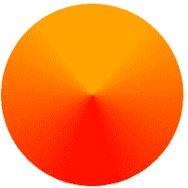
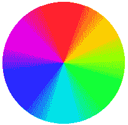
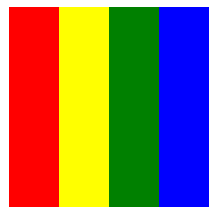
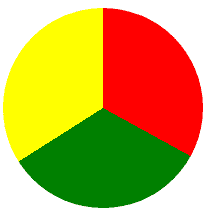

# Chrome 69 的新功能:用锥形渐变构建甜甜圈图

> 原文：<https://blog.logrocket.com/new-in-chrome-69-building-progress-doughnut-charts-with-conical-gradients-356820b1d081/>

每个人都喜欢图表。它们以简单的方式传达信息，一眼就能迅速理解。每个人都喜欢甜甜圈。它们是美味可口的甜甜圈。

饼图和甜甜圈图是我们喜欢但很少在 web 上看到的元素之一，主要是因为创建它们涉及的技术复杂性。我们一直依赖于带有 JavaScript 库的 canvas，或者带有 CSS 和 SVGs 的一些非常粗糙(并且很棒)的方法，但是它们仍然很复杂并且缺乏语义。

幸运的是，随着最近 Chrome 69 的发布，我们终于支持关键成分——圆锥形渐变。现在，我们可以用极其简单和语义化的方式创建饼图和甜甜圈图。

### 圆锥形的什么？

圆锥形渐变是填充渐变，它们的颜色停止点*在*圆周周围。它们是 [CSS 图像值的一部分，取代了内容级别 4](https://www.w3.org/TR/css-images-4/#conic-gradients) 模块，并且已经工作多年，但是直到最近还没有浏览器实现它们。

在其最基本的应用中，圆锥形渐变看起来像一个方向光效果，并且通过多个光圈，我们可以轻松地创建色轮。

```
.cone{
  background: conic-gradient(orange .1turn, red, orange 326deg);
}
```



Directional light effect using conical gradient

```
.color-wheel{
  background: conic-gradient(red, yellow, lime, aqua, blue, magenta, red);
}
```



Color wheel using conical gradient

与我们对线性和径向渐变所做的创建交替纯色图案的操作类似，我们可以在相等的位置定义锥形渐变的颜色停止点(或从 0 开始的后续停止点)，有效地将它变成饼图。

```
.linear-background{
  background: linear-gradient(to right, red 25%, yellow 25%, yellow 50%, green 50%, green 75%, blue 75%, blue 100%);
}
```



Solid stops linear gradient

```
.pie-chart{
  background: conic-gradient(red 33%, green 33%, green 66%, yellow 66%);
}
```



Simple pie chart using solid stop conical gradients

从那里到一个甜甜圈图是很容易的，因为应用一个单一的停止圆锥梯度遮罩。

### 正确的标记

HTML 5 引入了许多额外的语义元素，其中一些对大多数开发人员来说仍然知之甚少。对于甜甜圈图，我们可以轻松地使用单个

，但是有两个元素更适合它:<progress>和<meter>。</meter></progress>

**进度**表示给定任务的完成进度，例如文件下载。

浏览器在如何实现它上有一些自由(可能太自由了)，但是它通常显示为一个进度条。除了全局属性之外，它们接受 max 来表示任务完成的次数(默认为 1)，接受 value 来表示已经完成了多少(范围从 0 到 max)

**计量器**用于表示已知范围内的标量值，例如磁盘使用量。它的渲染方式类似于 progress，但针对不同的范围添加了其他样式。

属性包括当前值、min 表示最小值(默认为 0)、max 表示最大值(默认为 1)、low、high 和 optimum，以根据给定的阈值给出不同的样式(例如，当磁盘使用率高于 90%时，以红色显示条形)。它也可以通过表单参数与表单元素(如输入)相关联。

考虑到这一点，我们的图表的语义正确的 HTML 标记如下所示:

```
/* 50% filled progress bar */
<progress value="50" max="100"></progress>
/* 50% filled meter bar */
<meter value="50" max="100"></meter>
```

### 取消元素样式

类似于其他复杂的表单元素，浏览器依赖于供应商特定的伪元素来创建<progress>或<meter>的不同可视组件。它们还使用 appearance 属性根据操作系统的主题来设计元素的样式。所以，第一步是摆脱所有这些:</meter></progress>

```
/* gets rid of custom appearance provided by the operating system's theme */
progress, meter{
  -webkit-appearance: none;
  appearance: none;
}
/* hides all <progress> pseudo elements from webkit */
::-webkit-progress-inner-element, ::-webkit-progress-bar, ::-webkit-progress-value{
  display:none;
}
/* hides all <meter> pseudo elements from webkit */
::-webkit-meter-bar, ::-webkit-meter-optimum-value, ::-webkit-meter-suboptimum-value,::-webkit-meter-even-less-good-value {
  display: none;
}
```

这将为我们留下一个空容器(类似于一个空的 div ),我们可以随意设置它的样式来创建饼图/圆环图。

**我们只需要隐藏手头任务的所有元素**，但这里有一个所有这些工作方式的参考，以防你想设计进度条:

*   外观:none 从 OS 主题中禁用自定义样式，这是对任何内部组件进行样式化所必需的。

**进度伪差:**

*   ::-webkit-progress-inner-element，尽管名称令人困惑，但表示 progress 元素的最外层容器。我们可以在这里添加边框和阴影。
*   ::-webkit-progress-bar 样式化整个进度条，它通常只作为未填充部分可见，因为填充部分呈现在它上面。我们通常会改变背景。
*   ::-webkit-progress-value 是该栏的填充部分，同样，背景是我们通常在其上设置的样式

**计伪:**

*   ::-webkit-meter-bar 样式化整个仪表栏，作为未填充部分可见。填充的部分由其他三个伪元素控制。请注意，根据给定值及其与低、高和最佳参数的关系，在给定时间内，它们中只有一个处于活动状态。
*   ::-webkit-meter-optimum-value 当值在从低到高的范围内时对其进行样式化。
*   ::-WebKit-meter-suboptimum-当值超出低到高范围时应用值。
*   ::-WebKit-meter-even less-good-value 当值在低到高范围之外并且在最佳值的相反侧时应用

### 创建图表

随着所有自定义样式的出现，我们可以定义我们的图表大小，并简单地使用 border-radius 将它变成一个圆形，用单步锥形渐变填充它。

要定义该步骤的值，我们可以使用 CSS 自定义属性(也称为 CSS 变量):

```
progress, meter{
  position: relative;
  width: 100px; height: 100px;
  border-radius: 50%;
  --fill: calc(var(--progress) * 1%);
  background: conic-gradient(CornflowerBlue var(--fill), LightGrey 0);
}
```

这将给出一个饼图，第一种颜色(浅蓝色)填充到可变百分比，第二种颜色(浅灰色)填充其余部分。

在理想情况下，我们将使用在 [CSS 值和单位模块级别 3](https://developer.mozilla.org/en-US/docs/Web/HTML/Element/progress) 中定义的 attr()函数来分配来自实际值属性的变量。

```
--progress: attr(value);
```

不幸的是，除了伪元素的内容之外，在任何其他属性中使用 attr()函数目前都不被任何浏览器支持，所以我们需要通过一点 JavaScript 解析来分配它，或者在元素的内联样式中重复这个值。

我选择了后者，只是为了在这个演示中只使用 CSS，但是用 JS 方法来分配 CSS 变量对于可维护性、可重用性和保持简洁来说会更好。

```
<progress class="doughnut" value="50" max="100" style="--progress:50"></progress>
<meter class="doughnut" value="50" max="100" style="--progress:50"></meter>
```

下一步是将饼图变成甜甜圈。这可以通过在饼图顶部覆盖一个伪元素来轻松实现，用纯色背景作为一种遮罩，用 value 属性作为内容

```
/* "masks" the pie chart, overlays text */
progress::after, meter::after{
  content: attr(value) "%";
  position: absolute;
  top:8px; right:8px; bottom:8px; left:8px; /* bar thickness */
  background: white; /* "mask" color */
  border-radius: 50%;
/* centers text */
  display: flex;
  align-items: center;
  justify-content: center;
}
```

这就是我们的 Chrome 69+的单元素、语义、易于编码的甜甜圈图

见 [CodePen](https://codepen.io) 上法库多科拉迪尼([@法库多科拉迪尼](https://codepen.io/facundocorradini) )
的[笔
(仅限 Chrome 69+)CSS 进度/米甜甜圈图带 CSS 变量和锥形渐变](https://codepen.io/facundocorradini/pen/MBzOeP/)。

使用实际屏蔽

### 现实世界的实现可能会要求内圈是一个实际的遮罩，而不是硬编码的背景色，以便在不同颜色的容器中使用它。浏览器对 mask 属性的支持比锥形渐变好得多，所以这应该很容易。

前面的代码创建了一个蒙版，它由透明填充组成，一直到最后 9px，以及纯黑色(可以声明为任何颜色，重要的是 alpha 通道为 1)取最后 8px，有效地从元素中“剪切”除了外部 8px(即进度条厚度)之外的所有内容。步骤之间的 1px 差异是为了防止锐边。

```
mask:radial-gradient(closest-side, transparent calc(100% - 10px), black calc(100% - 8px));
```

更多来自 LogRocket 的精彩文章:

* * *

### 这里的问题是，在元素上应用掩码也会去掉伪元素上显示的文本。所以，我们需要把渐变和蒙版分离成各自的伪，用另一个显示文本。

* * *

这提供了一个更好看、更可重用的圆环图。

```
/* element styles only define sizing */
.progress, meter{
  position: relative;
  width: 100px; 
  height: 100px;
}
/* using a conical gradient + masking on a pseudo to create the doughnut chart. */
progress::before, meter::before{
  content: "";
  position: absolute;
  top: 0; left: 0; right: 0; bottom: 0;
  border-radius: 50%;
  --fill: calc(var(--progress) * 1%);
  background: conic-gradient(CornflowerBlue var(--fill), lightgrey 0);
  mask:radial-gradient(closest-side, transparent calc(100% - 9px), black calc(100% - 8px));
}
/* overlays text using the other pseudo */
progress::after, meter::after{
  content: attr(value) "%";
  position: absolute;
  top: 0; right: 0; bottom: 0; left: 0;
  display: flex;
  align-items: center;
  justify-content: center;
}
```

参见 [CodePen](https://codepen.io) 上 Facundo 科拉迪尼([@ facundocoradini](https://codepen.io/facundocorradini))
的 [(仅限 Chrome 69+的)带有 CSS 变量和锥形渐变的 CSS 进度/米甜甜圈图——蒙版](https://codepen.io/facundocorradini/pen/Ooxorm/)。

其他浏览器呢？

Chrome 69 是第一个正式支持锥形渐变的浏览器，而 [Webkit 刚刚实现了它](https://bugs.webkit.org/show_bug.cgi?id=189329)，所以我们可以期待它在基于 Webkit 的浏览器的下一个版本中出现。

### 到目前为止，Edge 和 Firefox 还没有计划支持的迹象。

所以第一件要做的事情是考虑把它作为渐进的增强，用不起眼的进度条作为退路。这可以通过在@supports 查询中包装我们的甜甜圈图声明来轻松实现

也就是说，由于 Lea Verou 的 polyfill，我们可以在其他现代浏览器中使用锥形渐变。

要使用它，我们只需要包括圆锥梯度 polyfill.js 文件，以及它的依赖前缀自由。

```
@supports(background: conic-gradient(#000 50%, #FFF 0)){
  /*  (...)    */
}
```

尽管有一些限制，最明显的是缺乏对 calc()和 var()的支持。所以请记住这一点，因为使用 polyfill 会阻止我们将填充集作为 CSS 变量。我们可以使用一些 JS 来读取每个<progress>的值，并直接从 JS 设置背景，而不是设置 CSS 自定义属性。</progress>

正如我们对 Chrome 所做的那样，我们应该隐藏 Firefox 和 Edge 的伪元素。幸运的是，对他们来说，这是一个单一的元素。

```
<script src="https://cdnjs.cloudflare.com/ajax/libs/prefixfree/1.0.7/prefixfree.min.js"></script>
<script src="conic-gradient.js"></script>
```

注意我们使用 visibility:hidden 而不是 display:none 来隐藏 Firefox 的进度条，因为后者没有任何效果，即使标记为！重要。我们也不能改变伪元素的宽度或以任何其他方式塑造它。看起来火狐把它设计成了内嵌的！重要，所以我们只能在那里更改一些属性。

但是为什么我们首先要设计 pseudo 的样式呢？事实证明，Firefox 也不支持<progress>中的::before 或::after 伪元素，因此设计::moz-progress-bar 似乎是应用掩码或文本内容的可行方法。但事实并非如此。</progress>

```
/* hides Firefox progress fill bar */
::-moz-progress-bar {
  visibility: hidden;
}
/* hides Edge progress fill bar */
::-ms-fill {
  display: none;
}
```

不幸的是，我们别无选择，只能改变我们的标记，使其在 Firefox 上工作。

包装一个语义中立的元素(比如 div 或 span)将值显示为文本是我能找到的最简单的方法

**HTML**

**CSS**

这不是世界上最好的事情，特别是因为这需要在 span 上重复数据属性中的值。但至少有用。

```
<span class="doughnut" data-value="40"><progress value="40" max="100"></progress></span>
```

参见 [CodePen](https://codepen.io) 上法库多科拉迪尼([@法库多科拉迪尼](https://codepen.io/facundocorradini) )
的[笔多填版 CSS 进度/米甜甜圈图锥形渐变](https://codepen.io/facundocorradini/pen/WgzwXj/)。

```
.doughnut{
  position:relative;
}
.doughnut progress{
  -moz-appearance: none;
  appearance: none;
  width: 100px;
  height: 100px;
  display: block;
  border:0;
  border-radius:50%;
  background: conic-gradient(CornflowerBlue 40%, lightgrey 0);
  mask:radial-gradient(closest-side, transparent calc(100% - 9px), black calc(100% - 8px));
}
/* overlays text on the span's pseudo */
.doughnut: after{
  content: attr(data-value) "%";
  position: absolute;
  top: 0; right: 0; bottom: 0; left: 0;
  display: flex;
  align-items: center;
  justify-content: center;
  font-weight: 700;
}
```

Not the best thing in the world, especially since this requires to repeat the value in a data attribute on the span. But at least it works.

进入 Edge 领域，主要的限制是 Edge 17 缺乏对 mask 属性的支持，这是目前的版本。它可以通过“启用 CSS 屏蔽”标志来启用，但这显然是我们不能要求用户做的事情。因此，纯色覆盖可能是正确的方法。

好消息是 Edge 18 计划为面具提供支持。

包扎

圆锥形渐变让我们很容易将枯燥的进度条变成令人惊叹的甜甜圈图。此外，它们可以用于各种应用:饼图、色轮、3D 模拟、闪电效果、星爆。连[视错觉](https://codepen.io/Rplus/pen/eNGbrg/)都可以轻松搞定。

### 开发者对这个特性的需求并不高，这可能是浏览器花了这么长时间才开始实现的原因。但有了 Chrome 69 和 WebKit 的引领，其他人没有理由不跟随。

如果你也想看到他们实现锥形渐变，请确保在 [Gecko bug 报告](https://bugzilla.mozilla.org/show_bug.cgi?id=1175958)和 [Edge uservoice 线程](https://wpdev.uservoice.com/forums/257854-microsoft-edge-developer/suggestions/8471413-implement-conic-gradients-from-css-image-values-le)上制造一些噪音。我们可以让网络变得更漂亮一点。也更美味。

使用 [LogRocket](https://lp.logrocket.com/blg/signup) 消除传统错误报告的干扰

[LogRocket](https://lp.logrocket.com/blg/signup) 是一个数字体验分析解决方案，它可以保护您免受数百个假阳性错误警报的影响，只针对几个真正重要的项目。LogRocket 会告诉您应用程序中实际影响用户的最具影响力的 bug 和 UX 问题。

## 然后，使用具有深层技术遥测的会话重放来确切地查看用户看到了什么以及是什么导致了问题，就像你在他们身后看一样。

[](https://lp.logrocket.com/blg/signup)

LogRocket 自动聚合客户端错误、JS 异常、前端性能指标和用户交互。然后 LogRocket 使用机器学习来告诉你哪些问题正在影响大多数用户，并提供你需要修复它的上下文。

关注重要的 bug—[今天就试试 LogRocket】。](https://lp.logrocket.com/blg/signup-issue-free)

LogRocket automatically aggregates client side errors, JS exceptions, frontend performance metrics, and user interactions. Then LogRocket uses machine learning to tell you which problems are affecting the most users and provides the context you need to fix it.

Focus on the bugs that matter — [try LogRocket today](https://lp.logrocket.com/blg/signup-issue-free).