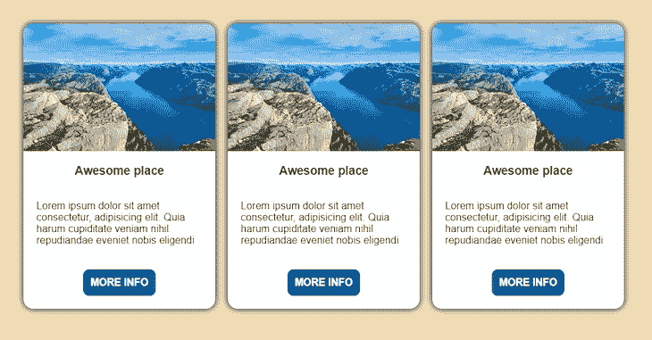
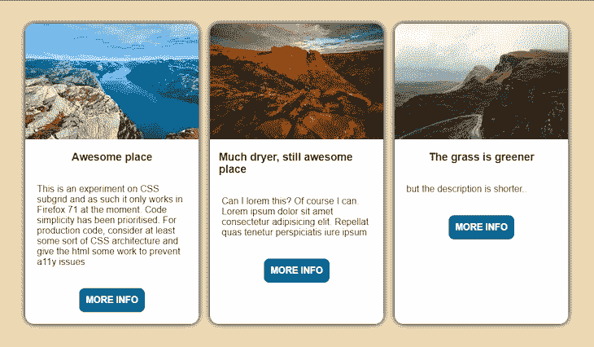
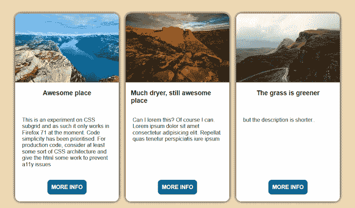
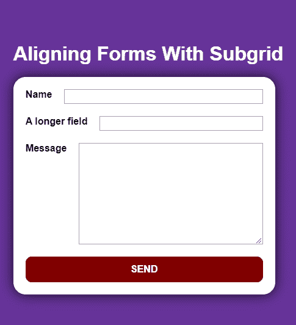
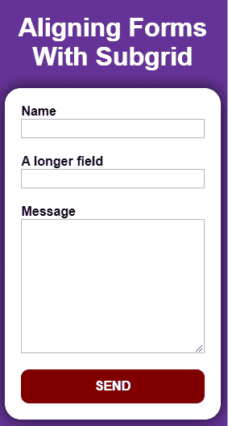
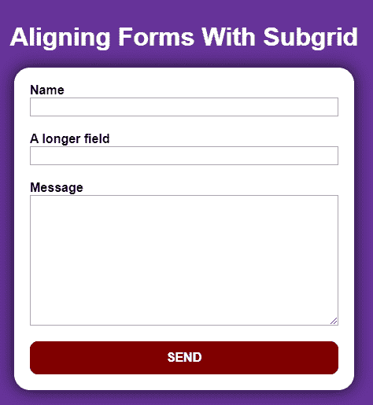

# Firefox 71 的新特性:CSS 子网格和 more 

> 原文：<https://blog.logrocket.com/new-in-firefox-71-css-subgrid/>

Firefox 71 刚刚发布，支持 CSS 子网格。这对任何使用 web 布局的人来说都是一个巨大的消息，因为它允许我们轻松地将项目对齐到其父级的网格容器。

到目前为止，当我们声明一个网格容器时，只有它的直接后代可以与指定的列/行对齐。我们总是可以在网格中嵌套网格，但是它们的轨迹是相互独立的，当我们需要孙元素(嵌套网格中的元素)对齐时，这会导致一些问题。

`grid-template-columns`和`grid-template-rows`的新的`subgrid`值允许我们声明一个嵌套网格，它继承了其父网格的轨迹，反过来，在使用任何类型的自动调整大小(`auto`、`min-content`、`max-content`)时，可以影响它的尺寸。

让我们看看这在一些常见 UI 组件中是如何工作的。

## 对齐行

考虑一个典型的卡片网格。设计 UI 时，我们可能会得到一个完全对齐的重复占位符模型:



但是当我们把它变成真正的 web/app 代码时，我们可能会得到不同的文本长度，这通常会导致一个粗略的布局，用糟糕的 HTML 和一些 CSS 代码把它们放在一起。



Without subgrid, aligning elements across the cards can be quite hard.

在卡片中使用 CSS 子网格来继承主容器中的行声明，可以保证元素与其他卡片中的元素占据相同的空间。我们只需定义容器中的行，然后指示卡片跨越所有行，并且它们的元素自动调整为每行一行。

我建议在一个`@supports`查询中做这类事情，这样我们可以有一个明智的回退，逐步增强到子网格版本:

```
@supports (grid-template-rows: subgrid){
  .container{
    /* declare the rows for the container*/
    grid-template-rows: repeat(4, auto);  
  }

  .card{
    /* gets the element to span all rows, to prevent overlapping */
    grid-row: span 4;
    /* sets the card row tracks to depend on the parent*/
    grid-template-rows: subgrid;
  }
}
```



Using subgrid, the elements align despite their length.

这里有一个 CodePen 上的现场演示，如果你运行的是 Firefox 并想体验一下的话:

参见 [CodePen](https://codepen.io) 上 Facundo 科拉迪尼([@ facundocoradini](https://codepen.io/facundocorradini))
的 Pen [子网格#1:卡牌](https://codepen.io/facundocorradini/pen/LYEEOmQ)。

通过列轨道对齐

## 相同的概念可以用于列。假设我们得到了这个简单的表单 UI，我们需要将它转换成代码:


一些开发人员喜欢将`<input>`嵌套在`<label>`元素中，以获得更清晰的标记，因为这样更容易阅读，并且可以隐式声明它们之间的关系。其他人选择让标签成为输入的兄弟，明确声明它们与`for`属性的关系，有时为每一对添加一个容器。

虽然选择任何一种方法都有许多可访问性、可用性和兼容性方面的考虑，但嵌套在标签内的输入的一个更大的限制是，当标签长度是动态的(即，当我们不知道标签到底有多宽)时，很难使它们与 CSS 正确对齐。这是一个非常常见的情况，尤其是在处理国际化的时候。

如果我们只是尝试使用嵌套网格，不同的标签文本节点将导致不均匀的输入。



Subgrid 通过使用表单的网格来对齐标签的子标签，为我们提供了一个更好的解决方案。这样，标签的间距将对应于最长的一个，并且输入将自动对齐。

接下来的问题是做什么作为退路。我们可以为标签的文本节点轨迹设置一个固定的宽度，或者更改`grid-template-columns`声明，以便将输入设置为具有固定宽度的输入。

或者，在不支持子网格的浏览器中，我们可以简单地让表单退回到标签覆盖输入的布局，因为这也很可能是我们在小屏幕上要做的事情。记住，我们可以嵌套`@supports`和`@media`查询，所以这应该会使维护更简单。

参见 [CodePen](https://codepen.io) 上 Facundo 科拉迪尼([@ facundocoradini](https://codepen.io/facundocorradini))
的 Pen [CSS 子网格#2:表单布局](https://codepen.io/facundocorradini/pen/wvBBpJM)。

```
@media screen and (min-width:500px){
  @supports (grid-template-columns: subgrid){
    .form{
      grid-template-columns: auto 1fr;
      grid-gap: 20px;
    }
    .field{
      grid-column: 1 / -1;
      grid-template-columns: subgrid;
    }
    input,textarea{
      /* lets the grid-gap take care of spacing instead */
      margin: 0;
    }
  }
}
```



Small-screen layout.



Browser that doesn’t support subgrid.


Final layout with subgrid support.

See the Pen [CSS subgrid #2: form layout](https://codepen.io/facundocorradini/pen/wvBBpJM) by Facundo Corradini ([@facundocorradini](https://codepen.io/facundocorradini))
on [CodePen](https://codepen.io).

正如你所看到的，subgrid 是一个非常受欢迎的 CSS 工具箱的补充，它在 Firefox 中首次亮相，很快也将为其他浏览器做好准备。我们可以通过渐进增强开始使用它，所以现在是学习如何这样做的时候了。

在这里，我介绍了两个非常常见的应用程序，但是 subgrid 远不止于此:我们可以将两个轴都设置为 sub grid，使用命名轨迹，并将元素放置到特定的轨迹中，就像 CSS grid 一样。

为了更全面地了解，我推荐阅读 CSS Grid Level 2 规范(T1)和 Rachel Andrew 的文章(T3)。

不仅仅是子网格！

## 虽然我关注的是这个关键方面，但是 Firefox 71 为用户和开发人员提供了许多改进。

`column-span`

### 属性的实现最终允许我们以一种强大的方式使用多字体布局。例如，我们可以将一个容器设置为 multicol，并让一个元素跨越所有列，这对于标题来说很常见。Firefox 比这晚了八年，但我仍然庆祝它的实现——迟到总比不到好。

纵横比映射和对`path`值的支持

### Firefox 现在从 HTML 属性中计算图像的内部纵横比，因此即使我们通过 CSS 设置图像尺寸，它也会显示正确的占位符大小。这将防止布局抖动。Chrome 在下周即将发布的版本中宣布了这一功能，因此我们现在就可以开始使用这一令人惊叹的功能。

`clip-path`属性现在接受`path()`值，这允许我们使用任何类似 SVG 的路径来裁剪元素。

支持`Promise.allSettled()`

### 在 JS 方面，现在支持`Promise.allSettled()`方法。当所有给定的承诺都被解决时，这将实现，不管它们是被实现还是被拒绝，提供每个承诺的结果的数组。
之前可用的`Promise.all()`非常相似，但是只有当所有承诺都实现时才解决。

要更深入地了解这些变化和完整的变化列表，请查看 Mozilla Hacks 在这个新版本上的帖子。

使用 [LogRocket](https://lp.logrocket.com/blg/signup) 消除传统错误报告的干扰

## [LogRocket](https://lp.logrocket.com/blg/signup) 是一个数字体验分析解决方案，它可以保护您免受数百个假阳性错误警报的影响，只针对几个真正重要的项目。LogRocket 会告诉您应用程序中实际影响用户的最具影响力的 bug 和 UX 问题。

[](https://lp.logrocket.com/blg/signup)

然后，使用具有深层技术遥测的会话重放来确切地查看用户看到了什么以及是什么导致了问题，就像你在他们身后看一样。

LogRocket 自动聚合客户端错误、JS 异常、前端性能指标和用户交互。然后 LogRocket 使用机器学习来告诉你哪些问题正在影响大多数用户，并提供你需要修复它的上下文。

关注重要的 bug—[今天就试试 LogRocket】。](https://lp.logrocket.com/blg/signup-issue-free)

Focus on the bugs that matter — [try LogRocket today](https://lp.logrocket.com/blg/signup-issue-free).