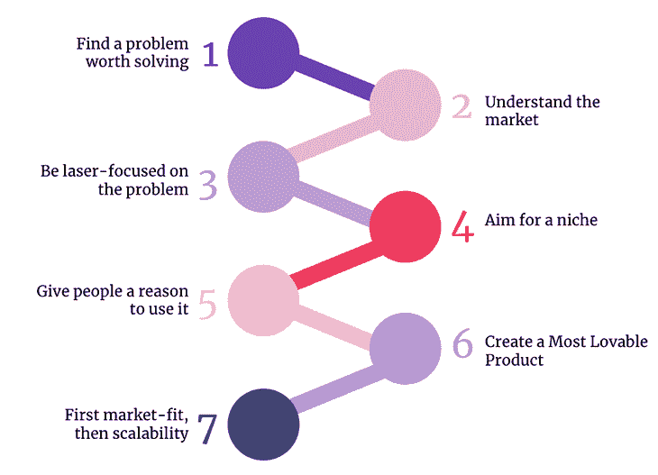

# 新产品开发过程:7 个阶段

> 原文：<https://blog.logrocket.com/product-management/new-product-development-process-7-stages/>

没有出色的执行力，想法什么都不是。任何人都可以想出一个点子，但是把它转化成人们关心的产品是一件完全不同的事情。

在这篇文章中，我将分享新产品开发过程的七个阶段。我所说的“新产品开发”指的是将一个全新的产品从创意推向市场的过程。

* * *

*新产品开发过程的七个阶段是:*

1.  [找到一个值得解决的问题](#find-a-problem-worth-solving)
2.  [了解市场](#understand-the-market)
3.  [专注于问题](#be-laser-focused-on-the-problem)
4.  [瞄准利基市场](#aim-for-a-niche)
5.  [给人们一个使用它的理由](#give-people-a-reason-to-use-it)
6.  [打造最可爱的产品](#create-a-most-lovable-product)
7.  [首先适应市场，然后是可扩展性](#first-market-fit-then-scalability)

* * *

* * *

## 1.找到一个值得解决的问题

不是所有的问题都值得你关注。你需要花时间去发现那些能帮助你为客户和企业创造价值的东西。然而，找到它们绝非易事。

问题到处都是。你只需要观察周围发生的事情。例如，网飞的联合创始人雷德·哈斯汀斯支付了一笔后期电影租赁费，意识到这种体验很糟糕，并决定改善它。

我认为你应该首先从三个方面入手:

*   **合意性**:客户在乎吗？
*   **可行性**:你能解决这个问题吗？
*   可行性:从商业角度来看是否可行？

一旦你确定了客户关心的问题，你就可以解决并创造商业价值。这听起来像是一个值得追求的想法，但不要对此太兴奋。在全押之前，你必须了解这个问题空间的其他方面。

## 2.了解市场

人们很容易对自己的想法兴奋不已，然后一头扎进[最低可行产品定义](https://blog.logrocket.com/product-management/what-is-minimum-viable-product-mvp-how-to-define/)。没那么快，我的朋友。

首先，你必须了解人们是如何解决问题的，以及他们是否真的关心这个问题。我称这一步为市场理解。

你应该这样做:

*   与有你想要解决的问题的人交谈——努力了解他们现在是如何解决问题的。确定人们在解决问题时的痛苦和收获
*   **寻找潜在的竞争对手** —有人已经在尝试解决这个问题了吗？他们是如何解决的？你可以成为顾客，自己学习
*   **寻找差异化** —评估你如何从现有的备选方案中脱颖而出

一个重要的提示:永远不要问客户他们是否会使用你正在考虑创造的产品。人们很温柔——他们会说好，但这并不意味着什么。

## 3.全神贯注于问题

随着你对市场有了更好的了解，是时候选择一个你想要解决的激光聚焦问题了。这一部分对你的成功至关重要。我想你的想法可能很宽泛。你必须尽可能缩小范围。

也许你不同意我的观点，但没关系。让我给你一些真实的例子:

*   亚马逊并不是一开始就在全球范围内一次销售所有商品。一开始，亚马逊只卖书。不多不少
*   网飞并不是从在全球范围内创造内容或流媒体开始的。他们从每张海报的 DVD 租金开始

专注对你的成功至关重要。从小处着手的重要性在于你学习的速度。没有它，你会把自己拉得太瘦。

## 4.瞄准利基市场

从小处着手，您还必须缩小受众范围，因为首要目标是学习而不是可扩展性。当你开始做大的时候，你会有巨大的风险，最终会处理太多的问题，限制你的学习能力。

你不希望一开始就受到媒体的关注。你要确保你有一个针对小众观众的激光聚焦问题。

例如，脸书从第一天起就不是一个开放的社交网络。这是哈佛学生的社交网络。在这一过程中，马克·扎克伯格和他的公司可以加速学习，不断改进面向小部分受众的产品。

## 5.给人们一个使用它的理由

在这一步，您应该知道您在为谁解决哪个问题，以及这如何为企业和客户创造价值。现在的问题是:*你如何让人们使用你的产品？*

要回答这个问题，你需要了解你的受众。你的创造力将在需要时发挥关键作用。以下是一些值得探索的关键方面:

*   **首先利用你的产品** —假设你的企业是一个市场。只有当你有足够多的买家时，卖家才能受益，反之亦然。其中一方需要有相当的优势，才能在早期加入你的平台
*   **排他性** —一些平台开始是一个封闭的社区。要去那里，你需要一张邀请函。做好你的工作会让人害怕错过，人们会渴望得到这个邀请
*   **B2B** —这是一种保守的商业模式。大多数公司不会使用你的产品，除非有人在用。然而，你可以提供在早期阶段加入的优势——例如，对产品功能制作的影响

市场充斥着各种产品和服务。你的价值主张不足以让人们使用你的产品。你需要给他们优势，让他们在早期阶段就开始使用某些东西。

秘诀是识别早期采用者，因为他们愿意接受失败的体验，以换取成为第一个使用新事物的人。

## 6.创造最可爱的产品

首先，创建一个小受众喜爱的产品，然后你可以考虑可伸缩性。我见过太多失败的产品，因为它们试图快速扩展。

我理解投资者向创始人施压，要求他们扩大规模并带来成果。只有你做对了，那才会发生。

> 你的产品拥有的受众越少，你的产品就越可爱。

一个常见的错误是定义 MVP 并完成完整的实现。这会导致浪费，因为你的大部分想法都会失败。

以下是制作最可爱产品的方法:

*   **确定并优先考虑假设** —花时间确定你的关键假设。优先考虑你需要测试的假设。努力发现你不知道的东西，如果它对业务至关重要
*   **从快速实验**开始——手工实验给你正确的方向。比如无节制原型，采访，绿野仙踪，礼宾。这样的实验应该不超过几天的时间
*   **根据证据做出决定**:根据实验结果，在进化、放弃或旋转之间做出决定
*   加强你的实验——你的第一次实验创造了微弱的证据。之后，你需要收集更有力的证据。现在你想要更多的承诺，例如订阅、购买和承诺购买
*   **改进** —正如您所料，您将学到一些东西，并应相应地增强您的用户体验和产品
*   **重复，直到你的产品受到欢迎** —你应该继续努力完成这些步骤，直到你的客户满意度超高。如果你与[净推广得分](https://blog.logrocket.com/product-management/what-is-a-good-net-promoter-score-nps/)合作，你希望你的客户群中 90%的人都是没有诋毁者的推广者。这就是为什么你一开始的目标是更少的观众

## 7.首先是适应市场，然后是可扩展性

一旦你有了一个最可爱的产品，是时候逐步扩大规模了。你仍然会面临一个机会，你的产品不适合更多的观众，你想测试一下。

回到脸书后，他们从哈佛开始，然后扩展到更多的大学。事实证明这很有效，他们逐渐建立了一个社交网络。这个想法是让你有一个类似的方法，首先证明市场适合你的产品，然后扩大规模。

* * *

订阅我们的产品管理简讯
将此类文章发送到您的收件箱

* * *

一旦你明白自己符合市场需求，你可能就需要努力提高自己的可扩展性。这一步对于扩大规模至关重要。

支持 50 个用户的产品不同于支持 5000 个用户的产品。

希望，一旦你达到这个水平，你会有一个价值驱动的心态。一个产品永远不是最终的。你总能从你的顾客那里学到一些东西，并有机会做得更好。

## 最后的想法

上面提到的七个步骤将帮助你把产品推向市场，但是扩展它需要不断的学习和适应。从不和解。不断改进你的价值主张。

开始一个新产品很难。在你成功之前，失败会多次敲你的门。价值驱动的思维模式与产品思维相结合将增加成功的几率。

一旦你发现了一个值得解决的问题，尽你最大的努力去解决好它，创造出一种杰出的体验。当你帮助人们做好他们的工作时，他们会使用你的产品。

*精选图片来源:[icon scout](https://iconscout.com/icon/box-738)*

## [LogRocket](https://lp.logrocket.com/blg/pm-signup) 产生产品见解，从而导致有意义的行动

[LogRocket](https://lp.logrocket.com/blg/pm-signup) 确定用户体验中的摩擦点，以便您能够做出明智的产品和设计变更决策，从而实现您的目标。

使用 LogRocket，您可以[了解影响您产品的问题的范围](https://logrocket.com/for/analytics-for-web-applications)，并优先考虑需要做出的更改。LogRocket 简化了工作流程，允许工程和设计团队使用与您相同的[数据进行工作](https://logrocket.com/for/web-analytics-solutions)，消除了对需要做什么的困惑。

让你的团队步调一致——今天就试试 [LogRocket](https://lp.logrocket.com/blg/pm-signup) 。

[David Pereira Follow](https://blog.logrocket.com/author/davidpereira/) Product Leader with 15+ years of experience. Partner at Value Rebels and interim CPO at omoqo. Almost every product team is trapped somehow; untrapping them is what drives me.