# Next.js Commerce:概述和教程

> 原文：<https://blog.logrocket.com/next-js-commerce-an-overview-and-tutorial/>

Next.js 是一个流行的开源 web 框架，允许您使用 React 构建 SSR 和静态 web 应用程序。由 Vercel 创建的这个生产就绪的框架由于其可伸缩性和易用性而被世界各地的工程团队所使用。

现在，该框架还提供了 Next.js Commerce，这是一个开发人员入门工具包，用于构建高性能、视觉上吸引人、完全可定制的电子商务站点。然后，这些网站可以增加各种应用程序集成，如购物车和分析工具，为客户和店主提供完整的在线购物体验。

Next.js Commerce 自带 BigCommerce，计划在未来为更流行的电子商务后端提供支持。

## 显著的特征

### 国际化

从 v10.0.0 开始，Next.js 提供了对国际化路由的内置支持。您所需要做的就是输入一个区域列表、默认区域和特定于域的区域，Next.js 将为您设置自动路由器处理。

### 分析学

对于任何电子商务企业来说，监控应用程序的性能以及用户和潜在客户的使用情况都是至关重要的。

您可能想要回答的一些问题是:

*   我的应用程序加载速度有多快？
*   它是否响应迅速，是否提供跨平台的一致满意的体验？
*   是否有足够的视觉稳定性？

这些关键指标是由谷歌和[网络性能工作组](https://web.dev/vitals/)共同制定的。

Vercel Analytics 收集这些指标，并计算出一个[真实体验分数](https://vercel.com/docs/analytics)，它提供了您的应用程序的整体健康和性能的有力指示。通过为您的电子商务网站增加强大的分析功能，您可以在应用程序生命体征出现任何异常时得到提醒，帮助您确保您的访问者享受快速、无缝、无中断的体验。

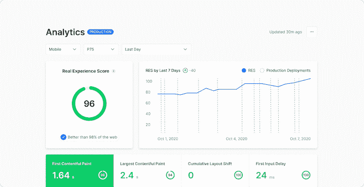

### 图像优化

从 v10.0.0 开始，Next.js 还提供了内置的图像组件以及自动图像优化。

下一个/image 组件扩展了 HTML ``元素，而自动图像优化支持以像 WebP 这样的[现代文件格式提供图像。它还提供自动调整大小，重新调整非常大的图像，以适应较小的显示器。](https://caniuse.com/webp)

该功能适用于任何图像，包括由 CMS 等外部数据源托管的图像。默认情况下，图像是延迟加载的，这使得渲染速度不受影响。

### 混合应用

您可以在单个项目中利用服务器端呈现和静态站点生成。

### 快速刷新

该特性使您能够在不丢失组件状态的情况下，获得对 React 组件所做更改的近乎即时的反馈。启用快速刷新(Next.js 9.4 以后的默认设置)后，大多数更改应该会在一秒钟内反映出来。

### 不需要配置

Next.js 配备了自动编译和捆绑功能，旨在成为一个生产就绪的框架，从一开始就准备好进行扩展。

其他特性包括 TypeScript 支持、内置 CSS 支持、代码分割和捆绑、简单的文件系统路由和 API 端点创建。

## Next.js 商务入门

### 先决条件

在开始之前，确保已经安装了 Next.js。如果您没有安装它，您可以通过运行:

```
npm i next

```

请记住，您将需要 [Node.js 10.13 或更高版本](https://nodejs.org/en/)来安装 Next.js。

### 克隆和部署演示应用程序

为了深入了解 Next.js，我们将克隆并部署一个演示应用程序。我们还会用自己的 logo 来定制默认的店铺 logo。

在本教程结束时，您应该已经在 Vercel 上运行了一个带有自己商店徽标的应用程序，并且您可以开始自己修改组件来定制您喜欢的站点。

#### 首先，转到 [Next.js Commerce 主页](https://nextjs.org/commerce)，点击 Clone and Deploy。您将看到一个如下所示的页面:


使用您的 GitHub、GitLab 或 Bitbucket 帐户登录。或者，您可以用您的电子邮件地址[创建一个 Vercel 帐户](https://vercel.com/signup)。登录后，您将被定向到此页面:


输入你的项目名称，点击**继续**。

然后你将被要求安装 BigCommerce 的第三方服务，因为 Next.js Commerce 目前支持 BigCommerce 后端(尽管它计划在不久的将来将支持扩展到所有主要的电子商务后端)。

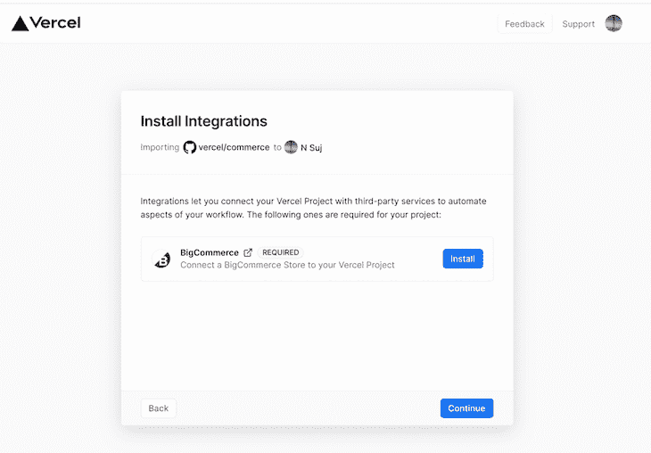

点击**安装**。您应该看到以下内容:

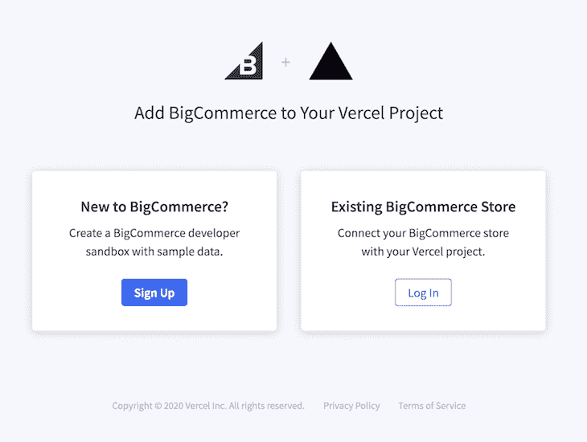

如果你有一个现有的 BigCommerce 商店，点击**登录**并填写你的凭证。如果没有，请按照提供的步骤注册一个帐户。

注册和/或登录后，您会在所需的 BigCommerce 集成旁边看到一个蓝色的复选标记。

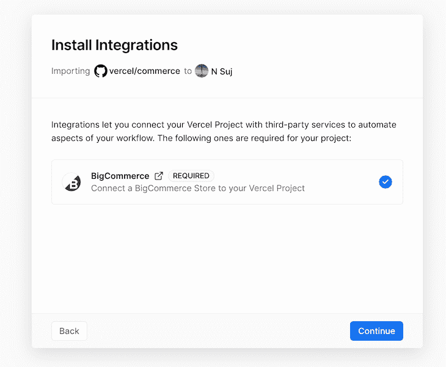

点击**继续**。现在您将有机会创建一个 Git 存储库，如下所示。输入你的库名，点击**继续**。

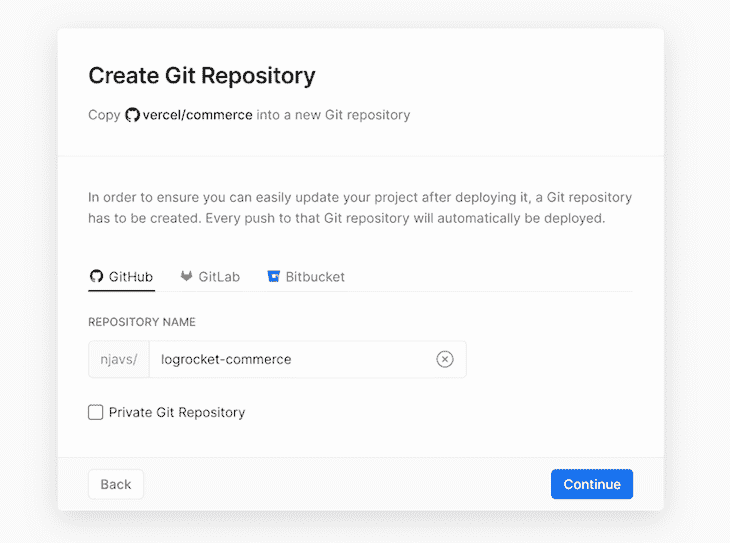

您将被引导至以下屏幕:

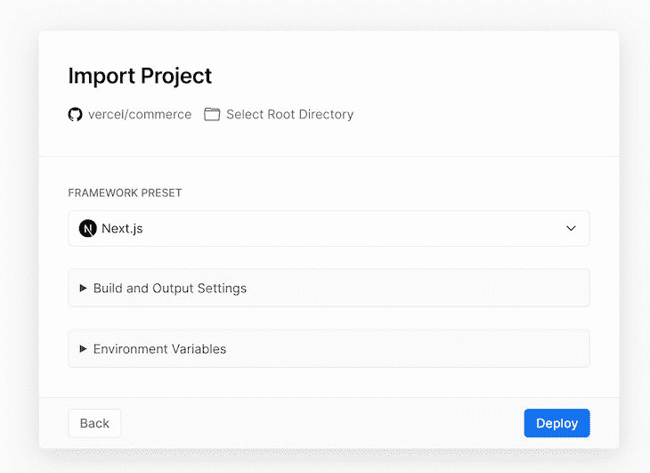

保持默认设置不变，点击**部署**——现在我们就等着瞧吧！部署应该不到五分钟。

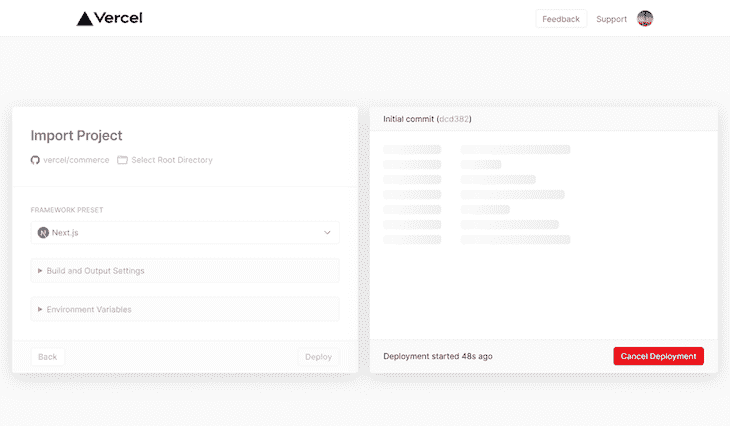

***注意，如果你的屏幕停留在“完成部署…”的时间超过这个时间，只需进入你在 vercel.com[的开发者仪表板](https://vercel.com/)，查看部署是否完成，并提供一个随时可以访问的 URL。***

一旦您的项目部署完毕，在 Vercel 仪表板上点击您的项目:

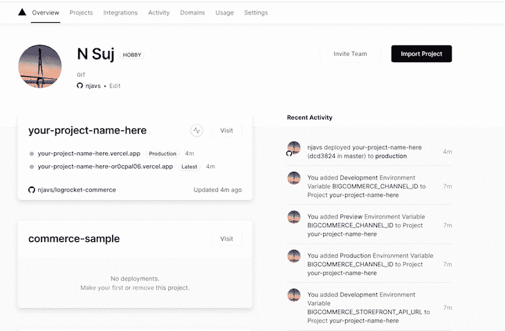

当您点击您的项目时，您将能够查看项目概述页面:

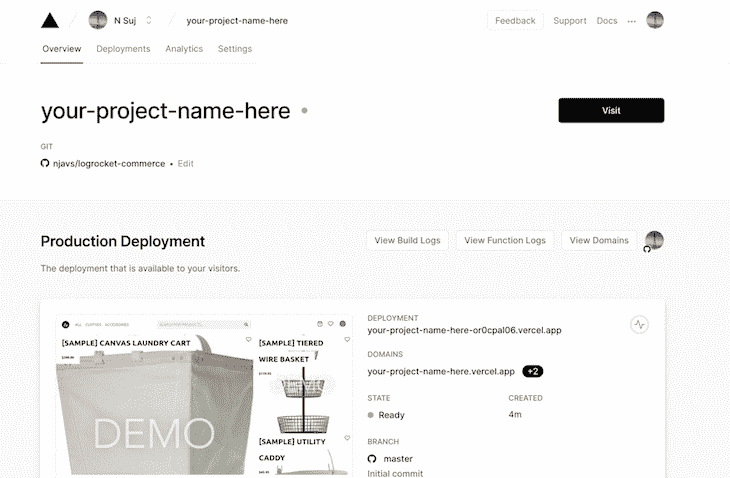

在这里，您可以查看您的构建日志以及与您的应用程序相关的域。现在，我们只需点击**访问**即可实时观看我们的应用程序。

在那里，您的电子商务商店是活的，并准备定制！

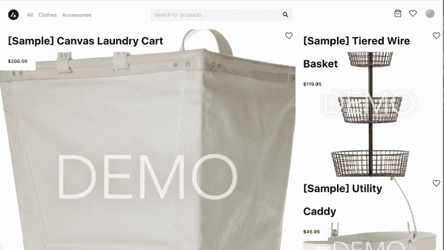

现在，让我们继续做一个快速的调整:我们将把默认的商店标志改为我们自己的标志。对于这个例子，我们将使用[一个服装图标](https://icon-library.com/images/icon-clothing/icon-clothing-4.jpg)。

在您最喜欢的 IDE 中打开存储库，并打开`components > ui > Logo`。下面是徽标组件最初的样子:


1.  让我们用我们选择的图像替换`Logo`组件:

```
const Logo = ({ className = '', ...props }) => ](<https://icon-library.com/images/icon-clothing/icon-clothing-4.jpg>)"} width="40" height="40" alt="Logo" /> 

16\. Push the changes to Git. As soon as you push, Vercel will begin re-deploying your application:
```

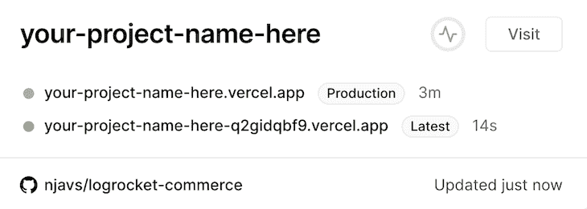

瞧！[这款应用已经上线并投入使用](https://your-project-name-here.vercel.app/)，定制了我们自己的标志。

## 结论

类似地，您可以继续使用 Next.js Commerce 模板定制许多现成的特定于电子商务的组件，包括各种购物车、愿望列表和产品页面组件等。

与 Vercel 易于使用的部署平台配合使用，Next.js Commerce 框架使开发人员能够通过 BigCommerce 后端构建无缝的电子商务体验，并且它将很快能够支持许多其他主要的电子商务后端——包括 Shopify、Swell、Saleor 等等。

## [LogRocket](https://lp.logrocket.com/blg/nextjs-signup) :全面了解生产 Next.js 应用

调试下一个应用程序可能会很困难，尤其是当用户遇到难以重现的问题时。如果您对监视和跟踪状态、自动显示 JavaScript 错误、跟踪缓慢的网络请求和组件加载时间感兴趣，

[try LogRocket](https://lp.logrocket.com/blg/nextjs-signup)

.

[](https://lp.logrocket.com/blg/nextjs-signup)[](https://lp.logrocket.com/blg/nextjs-signup)

LogRocket 就像是网络和移动应用的 DVR，记录下你的 Next.js 应用上发生的一切。您可以汇总并报告问题发生时应用程序的状态，而不是猜测问题发生的原因。LogRocket 还可以监控应用程序的性能，报告客户端 CPU 负载、客户端内存使用等指标。

LogRocket Redux 中间件包为您的用户会话增加了一层额外的可见性。LogRocket 记录 Redux 存储中的所有操作和状态。

让您调试 Next.js 应用的方式现代化— [开始免费监控](https://lp.logrocket.com/blg/nextjs-signup)。