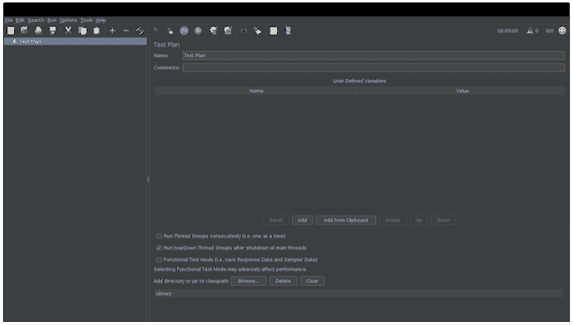
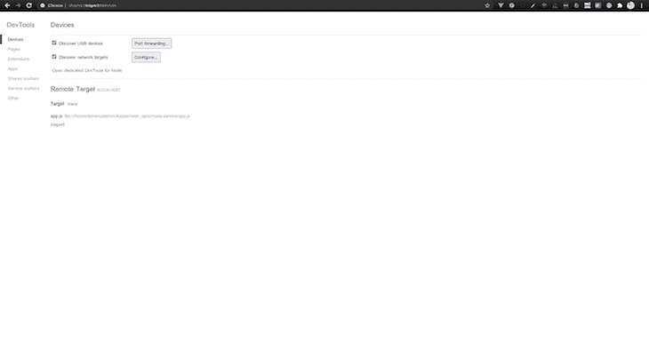
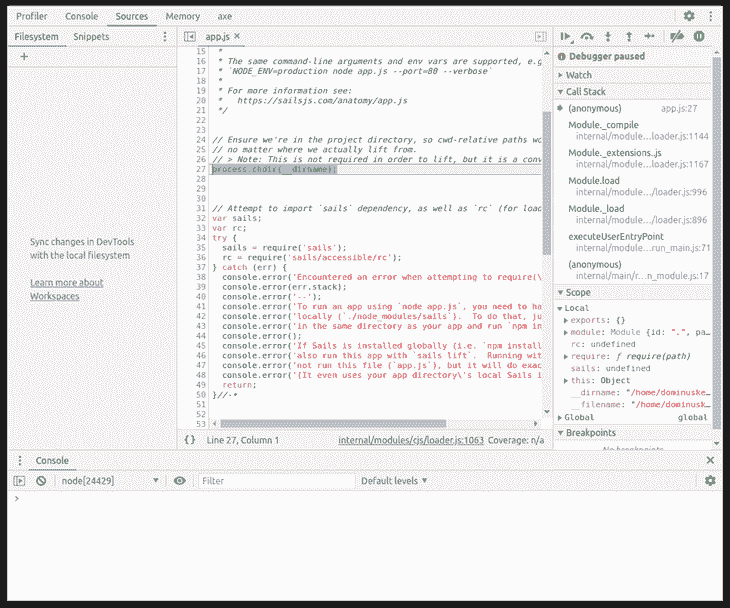
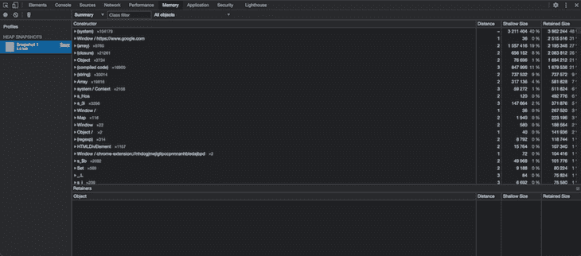

# Node.js best 年最佳实践和性能分析- LogRocket 博客

> 原文：<https://blog.logrocket.com/node-js-best-practices-and-performance-analytics-in-2021/>

对于使用 Node.js 的团队来说，最大的好处之一就是能够在客户端和服务器端使用 JavaScript。但是我们如何确保不在 Node.js 中编写未经优化的 JavaScript 代码呢？此外，如何在开发期间和部署到生产环境之后测试应用程序的性能？

在本文中，我们将研究一些编写和测试 Node.js 代码的最佳实践，然后通过一些示例来使用它们。

## Node.js 最佳实践

首先，让我们从一些最佳实践开始，当涉及到 CPU 资源时，将这些最佳实践结合到您的代码中。

### 子进程

尽管是单线程的，Node.js 可以产生[子进程](https://nodejs.org/api/child_process.html)来处理任务。尽管少量使用会有所帮助，但是过多的子进程会大大降低代码的性能。子进程会增加 CPU 的开销，比如内存消耗，这会占用机器有限的资源。因此，重要的是不要产生比您机器中的内核更多的子进程。

下面是一个 Node.js 脚本使用`cpuCount`变量生成子进程的例子，这个变量决定了它是否需要生成更多的子进程:

```
var counter = 0;
fn: async (inputs, exits) {
  const os = require('os')  
  // Get number of CPU cores
  const cpuCount = os.cpus().length
  if (counter > cpuCount) throw new Error('Can\'t spawn any more child processes')
  var fork = require('child_process').fork;
  var child = fork('./test');
  console.log('Test Started....');
  counter++; // note this line
}

```

### 工作线程

工作线程，或者说[工作线程](https://blog.logrocket.com/node-js-multithreading-what-are-worker-threads-and-why-do-they-matter-48ab102f8b10/)，对于执行 CPU 密集型的 JavaScript 操作非常有用。但是，不要将它们用于输入/输出密集型操作。正如在 [Node.js 文档](https://nodejs.org/api/worker_threads.html)中所描述的，Node.js 处理异步输入/输出比使用 workers 更有效。

在下面的代码片段中，我们在主应用程序线程上创建了一个`Worker`构造函数的实例。之后，我们将在`else`块中执行 CPU 密集型任务，并通过`parentPort.postMessage('Hello world!')`将消息传回主线程:

```
const { Worker, isMainThread, parentPort } = require('worker_threads');
if (isMainThread) {
  // This code is executed in the main thread and not in the worker.
  // Create an instance of Worker
  const worker = new Worker(__filename);
  // Listen for messages from the worker and print them.
  worker.on('message', (msg) => { console.log(msg); });
} else {
  // This code is executed in the worker and not in the main thread.
  // Send a message to the main thread.
  // In here you perform CPU-intensive tasks
  parentPort.postMessage('Hello world!');
}

```

### PM2

[PM2](https://pm2.keymetrics.io/) 是 production Node.js 应用程序的流程经理。它有助于在多个本地进程上扩展 web 应用程序，提高应用程序的性能，还有助于监控。通过在终端中运行以下命令来安装 PM2:

```
npm install -g pm2

```

通过运行以下代码启动您的应用程序，其中`app.js`是入口点:

```
pm2 start app.js

```

PM2 允许您通过在[集群中运行您的应用程序来利用多核系统，](https://nodejs.org/api/cluster.html)使您的应用程序易于扩展或缩小。我们可以告诉 PM2 在两个实例上运行我们的应用程序:

```
pm2 start app.js -i 2

```

回想一下，PM2 在后台运行，这意味着当你不使用它时，你很容易忘记关闭它。添加以下代码以查看正在运行的进程:

```
pm2 list

```

使用以下命令关闭正在运行的进程:

```
pm2 kill

```

### 内存限制

Node.js 分配足够的内存来保持当前范围内的所有对象。默认情况下，内存限制为 512 MB。随着内存消耗接近极限，V8 将在垃圾收集上花费更多的时间，这反过来会影响应用程序的性能。

您可以使用`--max-old-space-size`开关增加内存限制。`--max-old-space-size`是 Node.js V8 CLI 选项，允许您覆盖默认内存大小。

要使用`--max-old-space-size`选项，在启动 Node.js 时将其作为一个选项传递，并给它一个以兆字节为单位的大小。例如，下面的代码片段会将内存大小增加到 1536 MB (1.5 GB):

```
node --max-old-space-size=1536 index.js

```

### 重用对象

Node.js 应用程序中的大多数对象的生命周期都很短，因此，最好尽可能重用对象。创建太多新对象会降低应用程序的速度，因为您必须频繁运行 [Node.js 垃圾收集器](https://developer.mozilla.org/en-US/docs/Web/JavaScript/Memory_Management)。

要检查应用程序中的内存使用情况，可以使用`process.memoryUsage()`方法:

```
process.memoryUsage().heapTotal // Gets available memory heap toal in bytes
process.memoryUsage().heapUsed // Gets used memory heap in bytes

```

避免在生产中运行垃圾收集器很重要，因为它会不断地将运行这两个函数的值记录到您的生产日志记录环境中。然而，这个过程适合于开发环境。你可以在**内存**标签区的 [Chrome 开发者工具](https://www.shopify.com/partners/blog/chrome-developer-tools) (DevTools)上监控应用程序的内存使用情况。

### 负载测试

构建 Node.js 应用程序后，执行负载测试是个好主意。负载测试确定应用程序一次可以有效处理的请求数量，以及应用程序在处理大型请求时的行为。它还将帮助您决定如何扩展您的应用程序。对于负载测试，您可以使用 Apache JMeter。

#### 阿帕奇 JMeter

据其网站介绍， [Apache JMeter](https://jmeter.apache.org) 是一个开源的纯 Java 应用程序，旨在加载测试功能行为和性能测量。你可以[下载 JMeter](https://jmeter.apache.org/download_jmeter.cgi) 并按照[入门指南](https://jmeter.apache.org/usermanual/get-started.html)使用它进行负载测试。

使用 Apache JMeter，您可以记录 Node.js 应用程序上的任何行为，比如文件上传和客户端会话。您还可以对应用程序的负载测试请求进行批处理，然后观察和监控性能瓶颈。



Apache JMeter

现在，您已经知道了创建 Node.js 应用程序的一些最佳实践。但是，您仍然应该检查您的代码是否尽可能具有高性能。在下一节中，我们将讨论 Node.js 的一些性能分析。

## 基准测试 Node.js 性能

缓慢的 Node.js 应用程序通常是资源耗尽的结果。虽然还有其他资源，如网络和硬盘，但我们将重点关注这两项:

1.  处理器
2.  记忆

Node.js 自带了几个工具，允许您监视资源利用率。

### Node.js 检查器

当您使用`--inspect`或`--inspect-brk`开关启动 Node.js 应用程序时，Node.js 进程将监听调试客户端。它允许您使用一个您熟悉的用于调试客户端 JavaScript 的工具来调试 Node.js 代码，在我们的例子中是 Chrome Dev tools。

要使用检查器，使用`node ---inspect-brk app.js`命令运行 Node.js 脚本，这将:

*   启用 [Node.js 检查器](https://nodejs.org/api/inspector.html)
*   将检查员绑定到`IP address: 127.0.0.1`
*   收听`port 9229`
*   在用户代码开始之前中断

运行该命令后，转到 Google Chrome 浏览器。它运行与 Node.js 相同的 JavaScript 引擎，即 V8 引擎。在地址栏中输入`about:inspect`，它会将你重定向到`chrome://inspect`。



要调试 Node.js 会话，请单击`inspect`链接，用 Chrome 开发工具启动一个弹出窗口。如果你已经知道如何使用 Chrome 开发者工具，你可以继续分析你的应用程序并查看资源消耗。你可以阅读更多关于在 Chrome 中调试 JavaScript 的文章。



Chrome Debugger

### 执行线程

如前所述，重要的是要记住 Node.js 是单线程的，这意味着您只有一个执行进程可以使用。想象一下数以百万计的客户端使用单个线程工作！那是非常有限的资源。

虽然这种单线程方法使 Node.js 保持简单，这样我们就不必处理类似[线程安全](https://en.wikipedia.org/wiki/Thread_safety#:~:text=Thread%20safety%20is%20a%20computer,design%20specifications%20without%20unintended%20interaction.)这样的事情，但它就是无法伸缩。

Node 使用异步输入/输出来调度读写操作，这不会阻塞执行过程。但是，如果您的代码编写时没有遵循最佳实践，它可能会使用 100%的 CPU，并且会阻塞 Node.js 执行进程。

让我们看一个可以阻塞执行线程的代码示例:

```
function blockProcess() {
        while(true) {
                console.log("Blocking process")
        }
}

```

虽然这只是一个表面的例子，但是如果您运行`blockProcess`函数并监控您的 CPU，您将会看到它是如何将 CPU 消耗提高到几乎 100%的。因此，避免编写像这样阻塞进程的代码是明智的。

#### 测量 CPU 负载

您需要测量 CPU 负载来分析您是否有高 CPU 负载问题。检查的一种方法是在 Node.js 进程会话运行时使用 Chrome 开发工具。

转到 Chrome 开发者工具的**评测工具**部分，它给出了一个 CPU 配置文件，告诉你某个函数、子进程或资源花费了多少时间。接下来，查找占用大量 CPU 时间的文件。单击它可以找出哪个函数/语句导致了高 CPU 负载，以便您可以解决问题。



CPU Profiling in Chrome

### 执行时间

执行时间是我们的应用程序的某些块从开始到结束执行所花费的时间。要测量执行时间，使用
`console.time`和`console.timeEnd`方法包装您想要测量的代码块。例如，下面的代码在一个 [Sails.js](https://blog.logrocket.com/building-a-node-js-web-api-with-sails-js/) web 应用程序中发出一个网络请求:

```
fn:  async function(inputs, exits) {
var wavesNGNPrice = await sails.helpers.fetch('https://waves-africa-api.herokuapp.com/ngn');
exits.success(wavesNGNPrice)
}

```

函数的实现对于我们现在想要实现的并不重要，但是假设我们想要知道函数的第一行执行了多长时间。我们会这样包装它:

```
fn:  async function(inputs, exits) {
console.time(‘waiting’)
var wavesNGNPrice = await sails.helpers.fetch('https://waves-africa-api.herokuapp.com/ngn');
console.timeEnd(‘waiting’)

exits.success(wavesNGNPrice)
}

```

当我们启动应用程序时，我们将在控制台中看到一个输出，显示代码运行所需的时间(以毫秒为单位)。我们可以使用这个输出来查看是什么阻塞了我们的代码并使应用程序变慢。


### 性能挂钩

另一个用于测量性能的 Node.js 工具是 `[perf_hooks](https://www.npmjs.com/package/perf_hooks)` 模块，当您在代码中创建标记时，它允许您测量应用程序不同方面的性能。

让我们通过使用它来测量与上面相同的代码块来看看它的实际运行情况。首先，我们需要从`perf_hooks`模块中导入`PerformanceObserver`和`performance`:

```
const { PerformanceObserver, performance } = require(‘perf_hooks’)

```

接下来，我们将创建一个新的观察者对象:

```
const obs = new PerformanceObserver(items => {
        console.log(items.getEntries()[0].name, items,getEntries()[0].duration);
performance.clearMarks();
});

```

然后，我们将调用对象上的 observer 方法，告诉它我们需要什么样的条目类型:

```
obs.observe({ entryTypes: [‘measure’] });

```

最后，我们将使用`performance.mark`方法包装代码，并通过运行`performance.measure`输出测量结果:

```
fn:  async function(inputs, exits) {

performance.mark(‘start waiting’)
var wavesNGNPrice = await sails.helpers.fetch('https://waves-africa-api.herokuapp.com/ngn');
performance.mark(‘end waiting’)

performance.mark(‘waiting period’, ‘start waiting’, ‘end waiting’)

exits.success(wavesNGNPrice)
}

```

您应该会得到类似如下所示的输出:


在上面的`PerformanceObserver`实现中，我们将执行时间记录到控制台。关于[性能测量 API](https://nodejs.org/api/perf_hooks.html)的 Node.js 文档将有助于更深入地理解这一功能。

模块没有副作用，因此当你把它放入你的代码时，它不会改变任何东西。当您怀疑某一行是 Node.js 应用程序运行缓慢的罪魁祸首时，它就派上了用场。

如果您遇到任何性能问题，可以将`perf_hooks`观察者包含在生产中，以测量实时项目的性能分析。然而，你不应该在生产中的任何情况下都打开它，因为它可能会导致你的应用程序滞后。

## 结论

让我们回顾一下测量代码性能的最佳实践。

*   用真实数据测试:为你的应用程序模拟真实世界的状态，而不是使用虚拟数据
*   运行常规负载测试:检查新特性是否会增加系统性能的开销
*   预先定义你的性能指标并观察它们:事先知道你在测试和观察什么

因为我们的 Node.js 应用程序的性能会直接影响我们的用户，所以一个优秀的开发人员知道如何确保应用程序的性能和优化！

## 200 只显示器出现故障，生产中网络请求缓慢

部署基于节点的 web 应用程序或网站是容易的部分。确保您的节点实例继续为您的应用程序提供资源是事情变得更加困难的地方。如果您对确保对后端或第三方服务的请求成功感兴趣，

[try LogRocket](https://lp.logrocket.com/blg/node-signup)

.

[](https://lp.logrocket.com/blg/node-signup)[https://logrocket.com/signup/](https://lp.logrocket.com/blg/node-signup)

LogRocket 就像是网络和移动应用程序的 DVR，记录下用户与你的应用程序交互时发生的一切。您可以汇总并报告有问题的网络请求，以快速了解根本原因，而不是猜测问题发生的原因。

LogRocket 检测您的应用程序以记录基线性能计时，如页面加载时间、到达第一个字节的时间、慢速网络请求，还记录 Redux、NgRx 和 Vuex 操作/状态。

[Start monitoring for free](https://lp.logrocket.com/blg/node-signup)

.