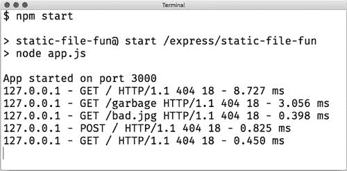

# Node.js 日志记录最佳实践:基本指南

> 原文：<https://blog.logrocket.com/node-js-logging-best-practices-essential-guide/>

***编者按:**本文于 2022 年 4 月 14 日更新，以反映 Node.js 日志记录最佳实践的最新信息，包括关于 Pino 和 Bunyan 以及健康监控工具的信息。*

日志记录是开发人员在 Node.js 中工作时可以采取的最重要和最有用的步骤之一。事实上，不管他们的运行时环境如何，这都是开发人员可以采取的最有用的步骤之一！日志有助于开发人员了解[他们的代码实际上在做什么](https://blog.logrocket.com/context-aware-logging-node-js/)，并且可以帮助开发人员节省调试工作的时间。

日志记录的主要目的之一是保存关于每个流或运行时的信息。这是开发人员用来理解他们的应用程序的相同信息。例如，如果一个应用程序的数据库部分有一个错误，一个日志会指出错误发生的位置，帮助您确定问题的原因。

在本文中，我们将介绍 Node.js 中日志记录的一些最佳实践，并了解为什么日志记录是一个好主意。我还将分享我对 Node.js 应用程序的最佳监控工具的建议。

向前跳:

## 应该记录哪些数据？

在我们回顾登录 Node 的最佳实践之前，重要的是要记住不是所有的信息都应该被记录。例如，个人数据(如用户信息)和敏感数据(如密码和信用卡信息)不应被记录。同样值得注意的是，你用来记录的工具远没有你记录的方法重要。

在接下来的部分中，我们将解释最有效的方法，作为 Node.js 中日志记录最佳实践的一部分。

## 从`console.log`开始

有些人会说，在构建一个附带项目时，让`console.log`围绕着您的应用程序应该是常规做法。其他控制台方法包括`[console.group](https://developer.mozilla.org/en-US/docs/Web/API/Console/group)`、`[console.info](https://developer.mozilla.org/en-US/docs/Web/API/Console/info)`，以及`console.error`等不太常用的方法:

```
console.error('Error!');

```

运行`console.log`时，您可能会注意到性能略有下降。为了避免对性能产生负面影响，我建议在项目开始扩展时切换到日志库。

## 移动到日志库

日志库帮助开发人员创建和管理日志事件，这可以提高应用程序的整体效率和功能。一些最流行的 Node 日志库有 [Winston](https://www.npmjs.com/package/winston) 、 [Pino](https://github.com/pinojs/pino) 、 [Bunyan](https://www.npmjs.com/package/bunyan) 和 [Log4js](https://www.npmjs.com/package/log4js) 。

虽然您应该总是使用标准的 console.log，但日志库可以更具功能性，并有助于避免应用程序性能下降。

### 温斯顿

如果您想将错误日志存储在远程位置或单独的数据库中，Winston 可能是最佳选择，因为它支持多种传输方式。或者，Log4js 支持日志流，如记录到控制台，以及日志聚合器，如 [Loggly](https://www.loggly.com/) (使用 [appender](https://www.npmjs.com/package/@log4js-node/loggly) )。

下面是如何使用 Winston 设置日志库的示例:

```
const winston = require('winston');
const config = require('./config');

const enumerateErrorFormat = winston.format((info) => {
  if (info instanceof Error) {
    Object.assign(info, { message: info.stack });
  }
  return info;
});

const logger = winston.createLogger({
  level: config.env === 'development' ? 'debug' : 'info',
  format: winston.format.combine(
    enumerateErrorFormat(),
    config.env === 'development' ? winston.format.colorize() : winston.format.uncolorize(),
    winston.format.splat(),
    winston.format.printf(({ level, message }) => `${level}: ${message}`)
  ),
  transports: [
    new winston.transports.Console({
      stderrLevels: ['error'],
    }),
  ],
});

module.exports = logger;

```

### 皮诺

这个日志库因其低开销和极简主义而非常受欢迎。通过使用工作线程进行处理，它使用较少的资源进行日志记录。

```
const pino = require('pino');

// Create a logging instance
const logger = pino({
level: process.env.NODE_ENV === 'production' ? 'info' : 'debug',
});

logger.info('Application started!');

```

最近，在 web 框架中使用 Pino 变得更加容易了。比如 Fastify 默认自带 Pino，其他的都有专门针对 Pino 的库。有关如何使用 Pino 的更多信息，请参考本文。

### 班扬

Bunyan 是另一个快速 JSON 日志库，它支持多种传输，并使用 CLI 过滤日志。它有一个精炼的方法，产生他们应该做什么。我最喜欢的关于 Bunyan 的特性是日志窥探，它有助于调试生产中的故障。

```
const bunyan = require('bunyan');
const log = bunyan.createLogger({name: 'myapp'});
log.info('My App');

{"name":"myapp","hostname":"banana.local","pid":40161,"level":30,"msg":"My App","time":"2022-04-04T18:24:23.851Z","v":0}

```

Bunyan 其他很酷的特性是用于控制日志位置的流系统、对 Node.js 之外的环境的支持，以及缺省情况下 JSON 对象是序列化的。

## 用 Morgan 记录节点中的 HTTP 请求

另一个最佳实践是在 Node.js 应用程序中记录 HTTP 请求。完成这项工作最常用的工具之一是 [Morgan](https://www.npmjs.com/package/morgan) ，它获取服务器日志并将其系统化，使其更具可读性。

要使用 Morgan，只需设置格式字符串:

```
const morgan = require('morgan');
app.use(morgan('dev'));

```

作为参考，预定义的格式字符串为:

```
morgan('tiny')

```

以下是预期的输出:



Output of HTTP request in Node with Morgan.

## 用摩根配置温斯顿

如果您选择使用 Winston 库，那么您可以很容易地用 Morgan 进行配置:

```
const morgan = require('morgan');
const config = require('./config');
const logger = require('./logger');

morgan.token('message', (req, res) => res.locals.errorMessage || '');

const getIpFormat = () => (config.env === 'production' ? ':remote-addr - ' : '');
const successResponseFormat = `${getIpFormat()}:method :url :status - :response-time ms`;
const errorResponseFormat = `${getIpFormat()}:method :url :status - :response-time ms - message: :message`;

const successHandler = morgan(successResponseFormat, {
  skip: (req, res) => res.statusCode >= 400,
  stream: { write: (message) => logger.info(message.trim()) },
});

const errorHandler = morgan(errorResponseFormat, {
  skip: (req, res) => res.statusCode < 400,
  stream: { write: (message) => logger.error(message.trim()) },
});

module.exports = {
  successHandler,
  errorHandler,
};

```

从上面的例子可以看出，要用 Morgan 配置 Winston，只需设置 Winston 将 Morgan 的输出传递回它。

## 定义日志级别

在开发团队开始构建之前，为了区分日志事件，定义日志级别是非常重要的。以有序和一致的方式管理日志事件可以更容易地快速获得必要的信息。

有几种日志级别，了解它们及其用途非常重要。每个日志级别都给出了消息的重要性和紧急程度的大致方向:

*   **错误:**导致程序执行失败的重要事件
*   **警告:**应注意防止失败的关键事件
*   **信息:**详述已完成任务的重要事件
*   **调试:**多为开发者使用

开发人员应该能够看到详细的事件，并确定是否应该立即修复它。

## 在日志管理系统中使用日志

根据您的应用程序有多大，从您的应用程序中提取日志并使用日志管理系统单独管理它们可能会有所帮助。

日志管理系统允许您实时跟踪和分析日志，这反过来有助于改进您的代码。正如您在下面的例子中看到的，日志管理系统可以帮助您跟踪有用的数据，包括后端错误、异常、日志源和生产错误。


Loggly log management system display.

对于日志分析和日志管理工具，我推荐 [Sentry](https://sentry.io/welcome/) 、 [Loggly](https://www.loggly.com) 、 [McAfee Enterprise](https://www.mcafee.com/enterprise/en-us/products/enterprise-log-manager.html) 、 [Graylog](https://www.graylog.org) 、 [Splunk](https://www.splunk.com) 、 [Logmatic](https://www.datadoghq.com/blog/datadog-acquires-logmatic-io/) (撰写本文时已被 Datadog 收购)，或者 [Logstash](https://logz.io/learn/complete-guide-elk-stack/#logstash) 。

健康监控工具是跟踪服务器性能并确定应用程序崩溃或停机原因的好方法。大多数健康监控工具提供错误跟踪、警报和一般性能监控。一些开发人员发现 Node.js 中的错误跟踪[特别令人沮丧，因此使用健康监控工具可以帮助缓解这些困难。](https://blog.logrocket.com/frustrations-with-node-js/)

下面是几个流行的 Node.js 监控工具:

## 结论

在本文中，我们讨论了日志记录的重要性，以及它如何帮助开发人员更好地理解他们的应用程序。我们还讨论了 Node.js 中的日志记录最佳实践，包括使用日志库、记录 HTTP 请求、定义日志级别以及使用日志管理系统。

一些流行的日志库，如 Winston、Pino 和 Bunyan，实际上很容易使用，并且是轻量级的，这意味着它们不会成为 Node.js 应用程序的瓶颈。

虽然没有基础设施是完全安全或完全没有错误的，但对于希望监控生产和减少错误的开发人员来说，日志记录是一个必要的步骤。

* * *

### 更多来自 LogRocket 的精彩文章:

* * *

日志记录对其他团队成员也很有用，包括 QA、支持和新程序员，因为它保存了有价值的信息，可以从中学习和构建。

## 200 只显示器出现故障，生产中网络请求缓慢

部署基于节点的 web 应用程序或网站是容易的部分。确保您的节点实例继续为您的应用程序提供资源是事情变得更加困难的地方。如果您对确保对后端或第三方服务的请求成功感兴趣，

[try LogRocket](https://lp.logrocket.com/blg/node-signup)

.

[](https://lp.logrocket.com/blg/node-signup)[https://logrocket.com/signup/](https://lp.logrocket.com/blg/node-signup)

LogRocket 就像是网络和移动应用程序的 DVR，记录下用户与你的应用程序交互时发生的一切。您可以汇总并报告有问题的网络请求，以快速了解根本原因，而不是猜测问题发生的原因。

LogRocket 检测您的应用程序以记录基线性能计时，如页面加载时间、到达第一个字节的时间、慢速网络请求，还记录 Redux、NgRx 和 Vuex 操作/状态。

[Start monitoring for free](https://lp.logrocket.com/blg/node-signup)

.