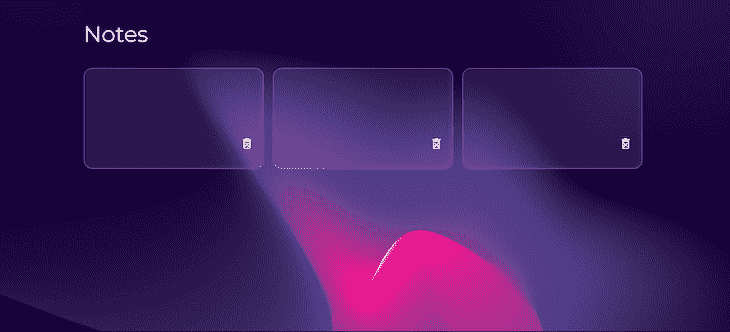
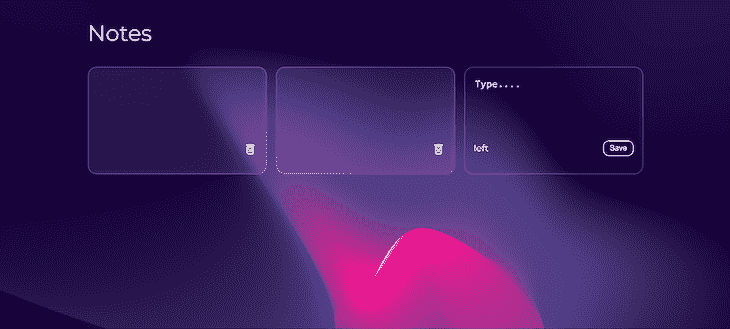

# 如何用 React 和 localStorage - LogRocket Blog 构建一个 notes 应用程序

> 原文：<https://blog.logrocket.com/notes-app-react-localstorage/>

在本文中，我们将学习如何在 React 中创建一个 notes 应用程序，并将该应用程序与`localStorage`集成。我们的应用程序的主要功能将包括创建笔记，设置字符限制，删除笔记，并将其保存在`localStorage`中。我们开始吧！

## 创建新的 React 应用程序

首先，我们需要为我们的项目创建一个空白的 React 应用程序。使用以下命令从头开始创建 React 应用程序:

```
npx create-react-app my-app
cd my-app
npm start

```

接下来，删除`App.js`文件中的所有内容，使其为空。我们将在这里添加所有组件。

### 文件结构

因为我们的应用程序会有很多文件，所以文件结构很重要。首先，在`src`文件夹中创建一个`Components`文件夹。在`Components`文件夹中，再创建三个名为`NoteComponents`、`css`和`img`的文件夹。

您的目录可能如下所示:


接下来，在 CSS 文件夹中创建一个名为`App.css`的新文件，并将以下代码添加到您的`App.js`文件中:

```
import { React } from "react";
import "./Components/css/App.css";
function App() {
  return (
    <div className="main">
    </div>
  );
}
export default App;

```

## 笔记网格

在`App.css`文件中，我们需要设计页面和主`div`的样式。除此之外，我们将使用 CSS Grid 创建一个三列注释网格，并使其具有响应性。因此，在平板电脑上，我们将有两列，在移动设备上，我们将有一列。

我还添加了一个背景图片，但是你可以用你选择的任何图片来替换它。图像保存在我们之前创建的`img`文件夹中。

```
@import url('https://fonts.googleapis.com/css2?family=Montserrat:[email protected];800&display=swap');
body {
    background-image: url("../img/background.jpg");
    background-repeat: no-repeat;
    background-size: cover;
    font-family: "Montserrat";
}
.main {
    max-width: 960px;
    margin: 0px auto;
    padding: 0px 15px;
    min-height: 100vh;
}
.header {
    display: flex;
    width: 100%;
    justify-content: space-between;
    align-items: center;
    margin: 10px 0px;
}
.notes__title {
    color: #fff;
    font-size: 38px;
    font-family: "Montserrat";
    font-weight: 400;
}
.notes {
    max-width: 1200px;
    margin: 0 auto;
    display: grid;
    grid-gap: 1rem;
    grid-template-columns: repeat(3, minmax(300px, 1fr));
}
@media screen and (max-width: 900px) {
    .notes {
        grid-template-columns: repeat(2, minmax(300px, 1fr));
    }
}
@media screen and (max-width: 500px) {
    .notes {
        grid-template-columns: repeat(1, minmax(300px, 1fr));
    }
}

```

## 添加标题

现在，我们需要在`NoteComponents`文件夹中创建一个名为`Header.js`的文件。`Header.js`将包含页面标题，因此它完全是可选的:

```
import React from "react";
function Header() {
  return (
    <div className="header">
      <h1 className="notes__title">Notes</h1>
    </div>
  );
}
export default Header;

```

## 创建便笺

让我们为稍后将使用的单个便笺创建以下基本布局和模板:

*   注释体:包含用户输入的文本
*   附注页脚:包含删除图标

此外，页脚将有一个添加按钮和一个字符计数器。现在，创建一个名为`Note.js`的新文件，并添加以下代码:

```
import React from "react";
import DeleteForeverOutlinedIcon from "@mui/icons-material/DeleteForeverOutlined";
function Note() {
  return (
    <div className="note">
      <div className="note__body"></div>
      <div className="note__footer" style={{ justifyContent: "flex-end" }}>
        <DeleteForeverOutlinedIcon
          className="note__delete"
          aria-hidden="true"
        ></DeleteForeverOutlinedIcon>
      </div>
    </div>
  );
}
export default Note;

```

删除图标是从 MUI 图标导入的[。您可以使用以下命令安装 MUI 图标:](https://mui.com/)

```
npm install @mui/icons-material

```

## 添加样式

接下来，创建一个名为`Note.css`的新 CSS 文件，它将包含注释的样式。我们将使用玻璃态来改善笔记的外观。Glassmorphism 是一种模仿磨砂玻璃外观的 UI 设计趋势。它是通过使用半透明背景和模糊效果来实现的。

下面的 CSS 代码还包含我们稍后将创建的笔记表单的样式。将以下代码添加到`Note.css`:

```
.note {
    background: rgba(255, 255, 255, 0.1);
    backdrop-filter: blur(5px);
    box-shadow: inset -6px -4px 2px rgba(255, 255, 255, 0.03);
    border-radius: 15px;
    border: 1.5px solid rgba(255, 255, 255, 0.326);
    color: #fff;
    padding: 15px;
    min-height: 140px;
    display: flex;
    flex-direction: column;
    justify-content: space-between;
    word-wrap: break-word;
}
.note__footer {
    display: flex;
    align-items: center;
    justify-content: space-between;
    margin-bottom: 15px;
}
.note textarea {
    white-space: pre-wrap;
    background: transparent;
    border: none;
    color: #fff;
    resize: none;
    font-size: 18px;
}
.note textarea:focus {
    outline: none;
}
.note textarea::placeholder {
    color: #fff;
}
.note__save {
    background: transparent;
    transition: 0.1s ease-in-out;
    border: 1.5px solid #fff;
    border-radius: 10px;
    color: #fff;
    padding: 4px 10px;
    font-size: 13px;
    cursor: pointer;
}
.note__save:hover {
    background: #fff;
    border: 1.5px solid #fff;
    color: #4b1589;
}
.note__delete {
    cursor: pointer;
}
.note__delete:hover {
    transform: scale(1.1);
}
.char__progress {
    background-color: #fff!important;
}

```

## 创建 notes 容器

现在，我们将在`NoteComponents`文件夹中创建一个名为`Notes.js`的新文件。`Notes.js`将包含所有的状态和功能，并将所有的组件链接在一起。在`Notes.js`中，我们将首先导入刚刚创建的`Note`组件以及`Note.css`文件:

```
import { React, useState, useEffect } from "react";
import "../css/Note.css";
import Note from "./Note"
function Notes() {
  return (
    <div className="notes">
      <Note />
      <Note />
      <Note />
    </div>
  );
}
export default Notes;

```

在上面的代码中，我渲染了一些示例注释来看看我们的应用程序是什么样子的。记得将`Header.js`和`Notes.js`文件导入到`App.js`中。到目前为止，您的`App.js`文件应该如下所示:

```
import { React } from "react";
import "./Components/css/App.css";
import Header from "./Components/NoteComponents/Header";
import Notes from "./Components/NoteComponents/Notes";
function App() {
  return (
    <div className="main">
      <Header />
      <Notes />
    </div>
  );
}
export default App;

```

此时，您的应用程序应该如下图所示:



现在，我们将在`Notes.js`中创建两个状态。第一个将我们所有的笔记存储为一个数组，第二个将存储输入文本:

```
//states
const [notes, setNotes] = useState([]);
const [inputText, setInputText] = useState("");

```

## 创建便笺表单

现在，我们将创建一个用作表单的固定注释。它将有一个类似于普通便笺的外观，但它将有一个保存按钮和一个带进度条的字符计数器，而不是删除图标。在固定的注释中，用户将在`texarea`中输入文本，并且他们可以通过点击保存按钮来创建新的注释。

创建一个名为`CreateNote.js`的新文件，然后向其中添加以下代码:

```
import { React } from "react";
function CreateNote() {
  return (
    <div className="note" style={{ background: "rgba(255, 255, 255, 0)" }}>
      <textarea
        cols="10"
        rows="5"
        placeholder="Type...."
        maxLength="100"
      ></textarea>
      <div className="note__footer">
        <span className="label"> left</span>
        <button className="note__save">Save</button>
      </div>
    </div>
  );
}
export default CreateNote;

```

您可能会注意到`texarea`上的`maxLength`属性。这将用户可以输入的字符数限制为一个指定的值，在我们的例子中是 100 个。这是必要的，否则，用户可以输入任意多的字符，导致状态和 UI 出现问题。继续导入`CreateNote`组件:

```
import CreateNote from "./CreateNote";

```

现在，在`Notes.js`文件中调用它:

```
<div className="notes">
  <Note />
  <Note />
  <CreateNote />
</div>

```

您的页面应该如下所示:



## 主要功能

至此，我们已经基本上创建了示例应用程序的主要组件。现在，我们需要创建几个函数，这些函数从表单中获取用户输入，将其保存在输入状态中，然后在用户每次单击 save 按钮时使用它来生成新的注释。

所有这些函数都将添加到`Notes.js`文件中，该文件是连接每个单个注释和表单的主文件。

### 输入文本功能

输入文本函数将接受用户输入，并将其设置为输入状态。稍后，我们将在笔记表单中将此称为道具:

```
// get text and store in state
const textHandler = (e) => {
  setInputText(e.target.value);
};

```

### 保存便笺功能

当用户单击表单上的保存按钮时，保存注释功能将运行。我们在后面的笔记表格中也会把这个叫做道具。

首先，保存笔记功能将在`note`状态下创建一个新的笔记。它将从输入状态中获取用户输入，并使用惟一的 ID 在数组中创建一个对象。其次，它将清除文本区域，以便在提交后，框是空的。

[uuid v4](https://www.npmjs.com/package/uuid) 将创建唯一的 id，它也将被用作映射注释的键。您可以使用以下命令安装 uuid v4:

```
npm install uuidv4

```

按如下方式使用它:

```
import { v4 as uuid } from "uuid";

```

下面是保存按钮功能的完整代码:

```
// add new note to the state array
const saveHandler = () => {
  setNotes((prevState) => [
    ...prevState,
    {
      id: uuid(),
      text: inputText,
    },
  ]);
  //clear the textarea
  setInputText("");
};

```

### 删除笔记功能

当用户点击 delete 图标时，我们将运行 delete note 函数，该函数将通过过滤从数组中删除注释。ID 参数将是被点击的笔记的唯一 ID:

```
//delete note function
const deleteNote = (id) => {
  const filteredNotes = notes.filter((note) => note.id !== id);
  setNotes(filteredNotes);
};

```

## 链接功能

现在我们已经创建了函数，我们需要将它们传递给我们的 note 表单。我们将为此使用道具。要将属性传递给`CreateNote`组件，请在`Notes.js`文件中进行以下更改:

```
&lt;CreateNote
  textHandler={textHandler}
  saveHandler={saveHandler}
  inputText={inputText}
/>

```

现在，保存和文本函数以及输入状态被传递给了`CreateNote`组件。接下来，在`CreateNote.js`文件中，如下调用 props:

```
function CreateNote({ textHandler, saveHandler, inputText })

```

我们将在三个地方使用它们:

1.  我们将把`textarea`的值设置为`inputText`
2.  当使用`onChange`的`textarea`发生任何变化时，我们将运行`textHandler`函数
3.  我们将在保存按钮上运行`saveHandler`函数`onClick`

您的`CreateNote.js`文件现在应该看起来像下面的代码:

```
import { React } from "react";
function CreateNote({ textHandler, saveHandler, inputText }) {
  return (
    <div className="note" style={{ background: "rgba(255, 255, 255, 0)" }}>
      <textarea
        cols="10"
        rows="5"
        value={inputText}
        placeholder="Type...."
        onChange={textHandler}
        maxLength="100"
      ></textarea>
      <div className="note__footer">
        <span className="label"> left</span>
        <button className="note__save" onClick={saveHandler}>
          Save
        </button>
      </div>
    </div>
  );
}
export default CreateNote;

```

## 显示注释

几节之前，我们渲染了几个`Note`组件，看看它们看起来如何，只是为了测试。为了使应用程序动态化，我们将从`notes`数组中映射出注释。`map()`函数通过为每个数组元素调用一个函数来创建一个新数组，在我们的例子中是`notes`数组。

我们在`Notes.js`文件的返回函数中添加了`map()`函数:

```
return (
  <div className="notes">
    {notes.map((note) => (
      <Note
        key={note.id}
        id={note.id}
        text={note.text}
        deleteNote={deleteNote}
      />
    ))}
    <CreateNote
      textHandler={textHandler}
      saveHandler={saveHandler}
      inputText={inputText}
    />
  </div>
);

```

上面的代码遍历了`notes`数组中的每个元素。然后，它使用用户输入和我们创建的惟一 ID 创建一个新的注释。该 ID 将用于删除函数的参数

一个`key`是一个特殊的字符串属性，在创建元素列表时需要包含它，就像我们例子中的 notes。

正如您在上面的代码中看到的，我们将删除函数和文本作为道具传递给了`Note`组件。现在，在`Note.js`文件中，我们可以将`text`和删除功能分别添加到`note`主体和`delete`图标中:

```
function Note({ id, text, deleteNote }) {
  return (
    <div className="note">
      <div className="note__body">{text}</div>
      <div className="note__footer" style={{ justifyContent: "flex-end" }}>
        <DeleteForeverOutlinedIcon
          className="note__delete"
          onClick={() => deleteNote(id)}
          aria-hidden="true"
        ></DeleteForeverOutlinedIcon>
      </div>
    </div>
  );
}

```

现在，我们的 notes 应用程序功能齐全了！

## 添加字符计数器

在创建笔记表单时，我们已经给`textarea`添加了一个字符限制，以及一个显示剩余字符的标签。

现在，让我们计算 100 个字符中还剩多少个字符，并显示在我们的应用程序中。

* * *

### 更多来自 LogRocket 的精彩文章:

* * *

在`CreateNote.js`文件中，在 return 语句前添加以下代码:

```
//character limit
const charLimit = 100;
const charLeft = charLimit - inputText.length;

```

上面的代码通过从 100 中减去当前的输入长度来计算剩余的字符，我们将当前的输入长度作为一个道具。随着用户键入，该值将继续减小。

我们可以简单地在`span`标签中调用它:

```
<span className="label">{charLeft} left</span>

```

## 添加进度条

我们可以通过添加一个线性进度条来反映字符数，从而进一步改进表单。线性进度条将从 MUI 中使用，它有许多预构建的进度条。您可以使用以下命令安装 MUI:

```
npm install @mui/material

```

像这样将其导入到`CreateNote.js`文件中:

```
import LinearProgress from "@mui/material/LinearProgress";

```

为了满足我们的要求，我们将把它的变量设置为判别式，把它的值设置为我们已经计算过的`charLeft`。

您的完整的`CreateNote.js`文件将类似于以下代码:

```
import { React } from "react";
import LinearProgress from "@mui/material/LinearProgress";
function CreateNote({ textHandler, saveHandler, inputText }) {
  //character limit
  const charLimit = 100;
  const charLeft = charLimit - inputText.length;
  return (
    <div className="note" style={{ background: "rgba(255, 255, 255, 0)" }}>
      <textarea
        cols="10"
        rows="5"
        value={inputText}
        placeholder="Type...."
        onChange={textHandler}
        maxLength="100"
      ></textarea>
      <div className="note__footer">
        <span className="label">{charLeft} left</span>
        <button className="note__save" onClick={saveHandler}>
          Save
        </button>
      </div>
      <LinearProgress
        className="char__progress"
        variant="determinate"
        value={charLeft}
      />
    </div>
  );
}
export default CreateNote;

```

## 将笔记保存到`localStorage`

最后，我们需要将注释保存到浏览器`localStorage`中，这样当我们刷新页面或者关闭页面然后再打开时，我们的数据不会丢失。

在`Notes.js`文件中，我们将创建两个函数:一个保存数据，一个读取数据。我们将运行代码来保存`useEffect`中的数据，并添加`notes`状态作为第二个参数，这样每次数据发生变化时我们都会保存数据:

```
//saving data to local storage
useEffect(() => {
  localStorage.setItem("Notes", JSON.stringify(notes));
}, [notes]);

```

我们使用`JSON.stringify`将对象转换成一个字符串，这样它就可以被存储。同样，为了读取数据，我们也将使用`useEffect`钩子。但是，这一次，第二个参数将是一个空数组，因为我们只想在页面加载时获取一次数据:

```
//get the saved notes and add them to the array
useEffect(() => {
  const data = JSON.parse(localStorage.getItem("Notes"));
  if (data) {
    setNotes(data);
  }
}, []);

```

## 结论

我们完事了。你可以在 [CodeSandbox](https://codesandbox.io/s/notes-app-with-react-js-and-localstorage-ifsglz) 上找到完整的代码。

在本文中，我们使用 React 和`localStorage`从头构建了一个 notes 应用程序。我们的应用程序具有所有需要的功能，例如，存储用户输入，保存和删除它。我们使用`localStorage`将数据保存到浏览器中。因此，当我们刷新页面时，它不会丢失。我们甚至更进一步添加了字符计数和进度条，这样用户就知道他们还有多少空间可以输入。

我希望你喜欢这篇文章，如果你有任何问题，一定要留下评论。感谢您的阅读！

## 使用 LogRocket 消除传统反应错误报告的噪音

[LogRocket](https://lp.logrocket.com/blg/react-signup-issue-free)

是一款 React analytics 解决方案，可保护您免受数百个误报错误警报的影响，只针对少数真正重要的项目。LogRocket 告诉您 React 应用程序中实际影响用户的最具影响力的 bug 和 UX 问题。

[ ](https://lp.logrocket.com/blg/react-signup-general) [  ](https://lp.logrocket.com/blg/react-signup-general) [LogRocket](https://lp.logrocket.com/blg/react-signup-issue-free)

自动聚合客户端错误、反应错误边界、还原状态、缓慢的组件加载时间、JS 异常、前端性能指标和用户交互。然后，LogRocket 使用机器学习来通知您影响大多数用户的最具影响力的问题，并提供您修复它所需的上下文。

关注重要的 React bug—[今天就试试 LogRocket】。](https://lp.logrocket.com/blg/react-signup-issue-free)