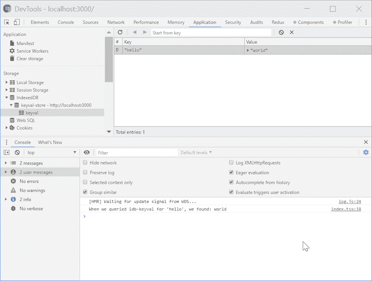
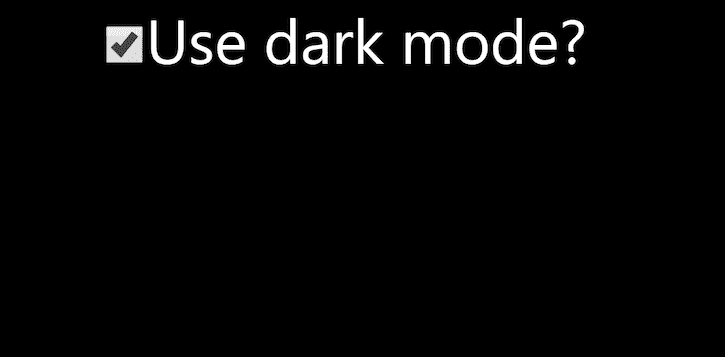

# PWAs - LogRocket 博客的离线存储

> 原文：<https://blog.logrocket.com/offline-storage-for-pwas/>

无论您正在构建什么类型的应用程序，您都可能希望存储在单个用户会话之后仍然存在的信息。有时(但不总是)，您希望这些信息存储在某种集中式数据库中。如果用户离线，您可能还希望这些数据可用，这样即使他们无法连接到网络，他们仍然可以使用应用程序来执行有意义的任务。

为了实现这一功能，该应用程序可能需要大量的数据。我们如何在一个[渐进式网络应用(PWA)](https://blog.logrocket.com/from-create-react-app-to-pwa/) 的环境中实现这一点？

## `localStorage`的问题

如果您正在构建一个经典的 web 应用程序，您可能会在此时使用 [`Window.localStorage`](https://developer.mozilla.org/en-US/docs/Web/API/Window/localStorage) 。`Window.localStorage`是一个长期存在的 API，它存储单个会话之外的数据。它有一个简单的 API，非常容易使用。然而，它提出了几个关键问题:

*   `Window.localStorage`是同步的，这对于每个应用程序来说都不是一个大问题，但是如果你正在构建的东西有很高的性能需求，这可能会导致问题
*   `Window.localStorage`不能在`Worker`或`ServiceWorker`的上下文中使用，因为 API 在那里不可用。
*   `Window.localStorage`只存储`string`s；鉴于 [`JSON.stringify`](https://developer.mozilla.org/en-US/docs/Web/JavaScript/Reference/Global_Objects/JSON/stringify) 和 [`JSON.parse`](https://developer.mozilla.org/en-US/docs/Web/JavaScript/Reference/Global_Objects/JSON/parse) ，这并不是什么大问题，但肯定会带来不便

这里的第二点很重要。如果您需要在`ServiceWorker`环境中访问离线数据，您会怎么做——如果您正在离线工作，您几乎肯定会这样做。

## IndexedDB 不足之处

幸运的是，`localStorage`不是镇上唯一的游戏。浏览器中有一种替代的离线存储机制，它有一个奇怪的名字叫做 [IndexedDB](https://developer.mozilla.org/en-US/docs/Web/API/IndexedDB_API) 。引用文档:

> IndexedDB 是一个事务数据库系统，类似于基于 SQL 的 RDBMS。然而，与使用固定列表的基于 SQL 的 RDBMSes 不同，IndexedDB 是基于 JavaScript 的面向对象数据库。IndexedDB 允许您存储和检索用键索引的对象；可以存储结构化克隆算法支持的任何对象。您需要指定数据库模式，打开到数据库的连接，然后在一系列事务中检索和更新数据。

很明显，IndexedDB 非常强大，但听起来肯定不简单。进一步看看如何与 IndexedDB 交互的 [MDN 示例](https://github.com/mdn/to-do-notifications/blob/8b3e1708598e42062b0136608b1c5fbb66520f0a/scripts/todo.js#L48),不会与这种想法相矛盾。

我们希望能够离线访问数据，但是以一种简单的方式——就像我们用`localStorage`一样，它有一个非常简单的 API。要是有人能在 IndexedDB 上构建一个抽象来让我们的生活变得更简单就好了…

幸运的是，有人做到了。

## IDB-Keyval 来救援了！

谷歌的杰克·阿奇博尔德创建了 [IDB-Keyval](https://github.com/jakearchibald/idb-keyval) ，它宣称自己是一个“基于承诺的超级简单的 Keyval 商店，使用 IndexedDB 实现”

这个 API 本质上相当于`localStorage`,只是有一些可爱的区别:

*   API 是基于承诺的；所有函数都返回一个`Promise`，这使得它成为一个非阻塞 API
*   与`localStorage`不同，API 不局限于`string` s。根据文档，它是 IDB 支持的，这意味着你可以存储任何结构化的可克隆的东西，比如数字、数组、对象、日期、blobs 等等
*   因为这是建立在 IndexedDB 之上的抽象，所以它既可以用在典型的 web 应用程序的上下文中，也可以用在`Worker`或`ServiceWorker`中(如果需要的话)

## 基本用途

为了展示如何使用 IDB-Keyval，我们需要一个示例应用程序。我们将演示它的基本功能以及如何在应用程序中使用它。

让我们用 [Create React App](https://create-react-app.dev/) 创建一个 TypeScript React app:

```
npx create-react-app offline-storage-in-a-pwa --template typescript

```

接下来，将 IDB-Keyval 添加到其中。

```
yarn add idb-keyval

```

更新`index.tsx`文件，添加一个使用 IDB-Keyval 进行测试的函数。

```
import React from 'react';
import ReactDOM from 'react-dom';
import { set, get } from 'idb-keyval';
import './index.css';
import App from './App';
import * as serviceWorker from './serviceWorker';

ReactDOM.render(<App />, document.getElementById('root'));

serviceWorker.register();

async function testIDBKeyval() {
    await set('hello', 'world');
    const whatDoWeHave = await get('hello');
    console.log(`When we queried idb-keyval for 'hello', we found: ${whatDoWeHave}`);
}

testIDBKeyval();

```

`testIDBKeyval`功能执行以下操作:

*   使用 IDB-Keyval 为`'hello'`的键添加值`'world'`到 IndexedDB
*   使用 IDB-Keyval 查询 IndexedDB 的关键字`'hello'`，并将其存储在变量`whatDoWeHave`中
*   记录我们发现的东西

你还会注意到`testIDBKeyval`是一个`async`函数。这是为了让我们在与 IDB-Keyval 交互时可以使用`await`。鉴于它的 API 是基于`Promise`的，它是`await-`友好的。当您一次执行多个异步操作时，使用 [async/await](https://blog.logrocket.com/async-await-in-typescript/) 来增加代码库的可读性通常是有价值的。

当我们用`yarn start`运行我们的应用程序时会发生什么？让我们这样做，并看看开发工具。



我们成功地将一些内容写入 IndexedDB，读回它，并将该值打印到控制台。

## 在 React 中使用 IDB-Keyval

到目前为止，我们所做的有点抽象。为了实现一个真实的用例，让我们创建一个应用程序，使用户能够在黑暗模式和常规显示之间进行选择。

首先，我们将把我们的`App.tsx`替换为:

```
import React, { useState } from "react";
import "./App.css";

const sharedStyles = {
  height: "30rem",
  fontSize: "5rem",
  textAlign: "center"
} as const;

function App() {
  const [darkModeOn, setDarkModeOn] = useState(true)
  const handleOnChange = ({ target }: React.ChangeEvent<HTMLInputElement>) => setDarkModeOn(target.checked);

  const styles = {
    ...sharedStyles,
    ...(darkModeOn
      ? {
          backgroundColor: "black",
          color: "white"
        }
      : {
          backgroundColor: "white",
          color: "black"
        })
  };

  return (
    <div style={styles}>
      <input
        type="checkbox"
        value="darkMode"
        checked={darkModeOn}
        id="darkModeOn"
        name="darkModeOn"
        style={{ width: "3rem", height: "3rem" }}
        onChange={handleOnChange}
      />
      <label htmlFor="darkModeOn">Use dark mode?</label>
    </div>
  );
}

export default App;

```

当你运行这个应用程序时，你可以看到它是如何工作的。


如你所见，这是使用 React 的`useState`钩子实现的。页面刷新时，任何选定的用户首选项都将丢失。让我们看看是否可以使用`IDB-Keyval`将这个状态转移到 IndexedDB 中。

我们将这样修改代码:

```
import React, { useState, useEffect } from "react";
import { set, get } from "idb-keyval";
import "./App.css";

const sharedStyles = {
  height: "30rem",
  fontSize: "5rem",
  textAlign: "center"
} as const;

function App() {
  const [darkModeOn, setDarkModeOn] = useState<boolean | undefined>(undefined);

  useEffect(() => {
    get<boolean>("darkModeOn").then(value =>
      // If a value is retrieved then use it; otherwise default to true
      setDarkModeOn(value ?? true)
    );
  }, [setDarkModeOn]);

  const handleOnChange = ({ target }: React.ChangeEvent<HTMLInputElement>) => {
    setDarkModeOn(target.checked);

    set("darkModeOn", target.checked);
  };

  const styles = {
    ...sharedStyles,
    ...(darkModeOn
      ? {
          backgroundColor: "black",
          color: "white"
        }
      : {
          backgroundColor: "white",
          color: "black"
        })
  };

  return (
    <div style={styles}>
      {darkModeOn === undefined ? (
        <>Loading preferences...</>
      ) : (
        <>
          <input
            type="checkbox"
            value="darkMode"
            checked={darkModeOn}
            id="darkModeOn"
            name="darkModeOn"
            style={{ width: "3rem", height: "3rem" }}
            onChange={handleOnChange}
          />
          <label htmlFor="darkModeOn">Use dark mode?</label>
        </>
      )}
    </div>
  );
}

export default App;

```

让我们概述一下变化。

*   `darkModeOn`现在被初始化为`undefined`，应用程序显示加载信息，直到`darkModeOn`有一个值
*   该应用程序尝试使用键`'darkModeOn'`从 IDB-Keyval 加载一个值，并使用检索到的值设置`darkModeOn`。如果没有检索到值，它将`darkModeOn`设置为`true`
*   当复选框改变时，相应的值应用于`darkModeOn`并保存到 IDB-Keyval 和密钥`'darkModeOn'`

这意味着除了页面刷新之外，我们还在以一种在线和离线都可以工作的方式保持首选项。



## 使用 IDB-Keyval 作为 React 挂钩

为了加分，让我们把这个功能移到一个可重用的 React 钩子中。

创建一个新的`usePersistedState.ts`文件。

```
import { useState, useEffect, useCallback } from "react";
import { set, get } from "idb-keyval";

export function usePersistedState<TState>(keyToPersistWith: string, defaultState: TState) {
    const [state, setState] = useState<TState | undefined>(undefined);

    useEffect(() => {
        get<TState>(keyToPersistWith).then(retrievedState =>
            // If a value is retrieved then use it; otherwise default to defaultValue
            setState(retrievedState ?? defaultState));
    }, [keyToPersistWith, setState, defaultState]);

    const setPersistedValue = useCallback((newValue: TState) => {
        setState(newValue);
        set(keyToPersistWith, newValue);
    }, [keyToPersistWith, setState]);

    return [state, setPersistedValue] as const;
}

```

这个新的钩子是仿照 [`useState`](https://reactjs.org/docs/hooks-reference.html#usestate) 的 API，命名为`usePersistentState`。它需要一个密钥，这个密钥将用于保存数据。它还需要一个缺省值，以防在查找过程中一无所获。

就像`useState`一样，它返回一个有状态的值和一个更新它的函数。

* * *

### 更多来自 LogRocket 的精彩文章:

* * *

最后，让我们切换我们的`App.tsx`来使用我们闪亮的新钩子。

```
import React from "react";
import "./App.css";
import { usePersistedState } from "./usePersistedState";

const sharedStyles = {
  height: "30rem",
  fontSize: "5rem",
  textAlign: "center"
} as const;

function App() {
  const [darkModeOn, setDarkModeOn] = usePersistedState<boolean>("darkModeOn", true);

  const handleOnChange = ({ target }: React.ChangeEvent<HTMLInputElement>) =>
    setDarkModeOn(target.checked);

  const styles = {
    ...sharedStyles,
    ...(darkModeOn
      ? {
        backgroundColor: "black",
        color: "white"
      }
      : {
        backgroundColor: "white",
        color: "black"
      })
  };

  return (
    <div style={styles}>
      {darkModeOn === undefined ? (
        <>Loading preferences...</>
      ) : (
          <>
            <input
              type="checkbox"
              value="darkMode"
              checked={darkModeOn}
              id="darkModeOn"
              name="darkModeOn"
              style={{ width: "3rem", height: "3rem" }}
              onChange={handleOnChange}
            />
            <label htmlFor="darkModeOn">Use dark mode?</label>
          </>
        )}
    </div>
  );
}

export default App;
```

## 结论

现在，您应该对 web 应用程序或 PWA 如何使用本机浏览器功能安全轻松地存储会话间持久化的数据有了深入的了解。

IndexedDB 支持我们在本教程中构建的解决方案。我们使用 IDB-Keyval 而不是 IndexedDB，因为它提供了令人愉快和熟悉的抽象。这允许我们用一个类似的可爱的 API 来构建一个解决方案。

值得注意的是，IDB-Keyval 还有其他选择，比如[local feed](https://github.com/localForage/localForage)，如果您正在为可能缺乏良好 IndexedDB 支持的旧浏览器构建，这将是一个特别好的选择。但是请注意，随着向后兼容性的提高，下载量也会增加。做出对你有意义的权衡是很重要的。

最后，我们展示了如何在 React 上下文中使用 IDB-Keyval。请注意，我们的离线存储机制没有任何 React 特定的内容。所以，如果你正在使用 Vue，Angular，或者其他什么东西，这个教程也可以帮助你。

简而言之，离线存储可以带来更好的用户体验。您应该考虑在您的应用程序中使用它。

## [LogRocket](https://lp.logrocket.com/blg/react-signup-general) :全面了解您的生产 React 应用

调试 React 应用程序可能很困难，尤其是当用户遇到难以重现的问题时。如果您对监视和跟踪 Redux 状态、自动显示 JavaScript 错误以及跟踪缓慢的网络请求和组件加载时间感兴趣，

[try LogRocket](https://lp.logrocket.com/blg/react-signup-general)

.

[ ](https://lp.logrocket.com/blg/react-signup-general) [](https://lp.logrocket.com/blg/react-signup-general) 

LogRocket 结合了会话回放、产品分析和错误跟踪，使软件团队能够创建理想的 web 和移动产品体验。这对你来说意味着什么？

LogRocket 不是猜测错误发生的原因，也不是要求用户提供截图和日志转储，而是让您回放问题，就像它们发生在您自己的浏览器中一样，以快速了解哪里出错了。

不再有嘈杂的警报。智能错误跟踪允许您对问题进行分类，然后从中学习。获得有影响的用户问题的通知，而不是误报。警报越少，有用的信号越多。

LogRocket Redux 中间件包为您的用户会话增加了一层额外的可见性。LogRocket 记录 Redux 存储中的所有操作和状态。

现代化您调试 React 应用的方式— [开始免费监控](https://lp.logrocket.com/blg/react-signup-general)。