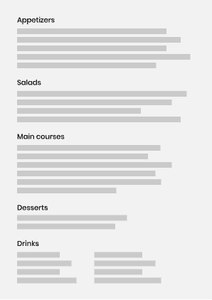
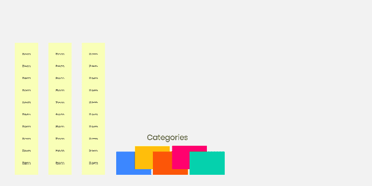
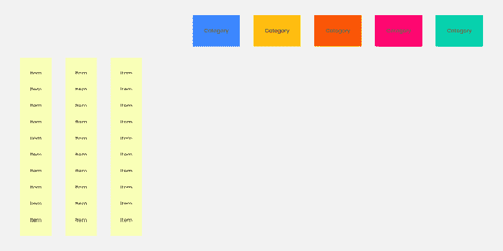
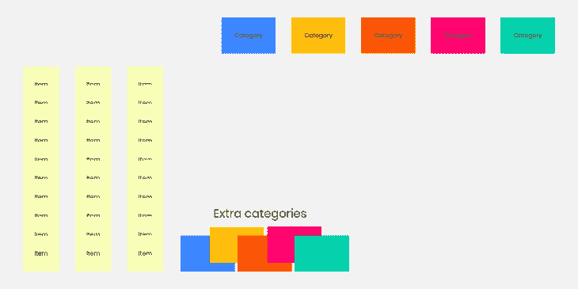

# UX 研究中心的开放式、封闭式和混合型卡片分类

> 原文：<https://blog.logrocket.com/ux-design/open-closed-hybrid-card-sorting-ux-research/>

当试图为用户设计或改进信息架构和导航时，我们应该考虑运行卡片分类测试。卡片分类作为一种更好地理解用户心智模型的工具已经存在了很多年。它帮助 UX 的设计师和研究人员改进应用程序和网站的设计。

本文将全方位回顾这种方法，找出它的优点和缺点，讨论何时使用它，研究不同类型的卡片分类，并涵盖卡片分类的最佳实践。

## 什么是卡片分类？

卡片分类是为用户在网站或应用程序上创建清晰信息架构的最有效方法之一。这个练习包括将不同的项目分类成组，它帮助你了解用户如何在他们的脑海中对信息进行分类，这样你就可以改进你的网站或应用程序。

让我举一个简单的例子来说明这是如何工作的。假设你有一个销售家具的网站——它销售从椅子到桌子到床的所有东西。当用户搜索新沙发时，他们如何在网上找到它？是沙龙用的沙发吗，白色的沙发？他们是否也想同时考虑将沙发延伸成床？

正如你所看到的，我们需要在应用程序中建立导航并对信息进行分类，以反映用户如何组织他们脑海中关于他们搜索的项目的信息。使用卡片分类方法，我们可以更好地理解如何组织这些信息。

## 什么是信息架构？

信息架构是对内容进行组织、命名和结构化的实践，以便于用户查找和使用。举个简单的例子，餐馆菜单有信息架构，包括饮料、葡萄酒、开胃菜等部分。

销售食品的网站可以组织产品和类别，使用户很容易找到他们想要的东西。例如，肉制品、奶制品、水果和蔬菜。

此外，信息架构也用于组织我们的应用程序的菜单。例如，一个 3D 模型制作应用程序可以在其菜单中有许多选项和命令，良好的信息架构将使用户很容易找到他们正在寻找的命令。

## 什么时候应该使用卡片分类？

UX 的研究人员可以在推出一个新网站时进行卡片分类练习，以了解如何组织信息。

您还可以在向现有网站添加新部分之前进行卡片分类，或者测试当前的导航和信息架构是否工作正常。这将让您看到您的用户是否可以轻松找到他们需要的信息。

## 卡片分类的类型

有三种卡片分类:开放式、封闭式和混合型。让我们来看看它们各自能做什么，以及它们有什么不同。

## 开放式卡片分类

开放式卡片分类包括参与者根据他们的组织感对不同的主题进行分类。通常，设计人员使用开放卡片排序来了解用户如何对内容进行分组。

参与者得到一些有许多项目的卡片，将它们分组，然后根据他们的偏好命名这些类别，让他们产生想法并将内容划分到他们的类别中。

参与者对主题进行分类并命名类别后，您和参与者可以评估结构并讨论他们选择这些特定类别的原因。

我在我参与的开发者项目的技术工具中使用了这种方法。我们的页面有许多要组织的项目。然而，我们需要深入了解如何给它们分类和命名，所以我们邀请用户来帮助我们。这样，我们学会了如何有效地组织信息。

## 封闭式卡片分类

封闭式卡片分类包括向参与者展示包含物品和类别名称的卡片，他们需要相应地对卡片进行分类。

它不是一种了解用户如何在概念上对主题进行分组的方法，而仅仅是一种评估现有分类结构的方法。

一个例子是一个网站的**食品**类别，其中包括诸如**水果**、**蔬菜**和**小吃**等项目。之后，用户可以根据类别对包含香蕉、西红柿和薯片等物品的卡片进行分类。

## 混合卡片分类

混合式卡片分类方法结合了开放式和封闭式卡片分类方法，允许参与者将卡片分成预定义的类别，并创建自己的类别。

如果您已经建立了一些类别，但是不确定其他类别应该如何分类，您可以使用这种技术。

## 卡片分类的最佳实践

### 卡片数量

进行卡片分类时，所需卡片的数量取决于研究的目标和要分类的物品数量。

理想的卡片数量应该在 30 到 50 张之间，因为这允许不同的物品以不同的方式分组和贴标签。此外，需要组织的项目数量可以根据研究的背景和目标而变化。

### 为准确分类写清楚主题

对于准确的卡片分类练习，避免包含相似或相同单词的主题。您可以使用不同的术语或提供额外的上下文或信息来突出卡片。

简单解释一下，可以用“红苹果”和“青梨”代替“苹果”和“梨”来区分两者。如果按水果分类，苹果和梨会在一组，但如果加上颜色，就不同组了。

有时，你可以通过在卡片上添加图片来更好地解释一些主题。

### 在进行会话之前，先进行测试

在你整理卡片之前，让 2-3 个人测试一下，这样你就可以知道整理所有东西需要多长时间。此外，它将帮助您在希望用户分类的项目中找到错误。例如，您可能会发现有些项目过于相似，使得用户很难区分它们。

### 参与者人数

根据尼尔森诺曼集团，你会得到十五个参与者的最佳结果。更多的话，每增加一个用户，你得到的回报会越来越少；少了，你就没有足够的数据来找出重叠的模式。

### 找到合适的参与者

卡片分类任务的参与者应该靠近用户。比如你在建一个卖跑步装备的网站，你需要找到跑步的人。

### 随机化卡片

在你把卡片给用户之前，把它们随机化。这样，用户就不会因为订单而产生偏见。

### 注意分类

在封闭式卡片分类练习中，呈现给参与者的类别数量可以根据研究的目标和涉及的项目数量而变化。因此，类别的数量应限制在便于管理的数量内，以便对项目进行清晰的分组和标记。

进行开放式卡片分类时，最好让参与者先分类，然后给他们卡片，让他们在上面写下类别名称。这样，他们可以先集中精力组织信息，然后给类别命名。

## 如何执行有效的卡片分类

以下步骤将帮助您成功进行卡片分类。

### 查找卡片分类参与者

您可以通过不同的方式招募卡片分类研究的参与者。社交媒体和论坛是寻找潜在参与者的有效场所。在不同的社交媒体网站上发布帖子或进行调查，以吸引符合目标受众的参与者。

如果产品已经上市，你可以联系客服部门，与潜在参与者取得联系。因此，你可以接触那些已经使用过你的产品或服务的人，他们可能对参与更感兴趣。

### 与潜在参与者取得联系

向潜在的参与者发送一封电子邮件，其中包含清晰透明的信息，包括您是谁以及您如何获得他们的电子邮件地址。告诉他们这项研究是关于什么的，以及他们可以如何提供帮助。通过这样做，你可以建立信任，增加他们参与研究的机会。

联系潜在的参与者后，让他们知道你希望会议什么时候开始。这样，他们将能够相应地进行计划，并确保他们能够参与。设定时间时要灵活，以适应学员的日程安排。

如果卡片分类会议将在网上举行，向在线工具发出邀请，并告诉每个人如何使用它。如果会话是脱机的，请向参与者发送站点方向和其他必要信息，以便他们可以轻松找到该站点。

### 顺利执行的规划

邀请其他人参加会议是一个聪明的主意，这样你就可以有一个记录员和一个在需要时会帮忙的人。此人可以帮助您组织会议，并确保会议顺利进行。

如果是在线课程，确保在线工具中的卡片组织良好，以便参与者可以快速理解练习。

如果你在现场主持一个会议，适当地布置房间。之前把所有实体卡写好，整理好，把材料都准备好，是个不错的主意。这样做，你会节省会议时间。

为了简化开放式卡片分类的过程，请准备彩色空白卡片，供用户在上面书写类别。颜色帮助用户更容易区分类别。

### 开始任务之前

在开始练习之前，解释它将如何工作，以及为什么参与者的贡献是有价值的。向他们解释任何答案都可以，目标是更好地理解如何组织数据，这一点很重要。请他们大声说话。这会让你了解他们是如何思考的，以及为什么他们会以这种方式给卡片贴标签和分类。

对于非托管会话，您可以向公告板添加解释。这样会让参与者更容易理解。此外，您可以录制视频，使其更加动态。

让参与者在课程开始前提问也很重要，以确保他们理解任务并对任务感到舒适。

### 讨论可以在会议期间进行

当参与者整理卡片时，听卡片并观察他们如何组织信息。你可以在需要的时候帮助他们，但是记住不要影响他们的决定。因此，你将能够确保说明是清楚的，并开始获得有价值的见解。

当他们完成后，你可以和他们交谈，问他们为什么要这样整理卡片。你会更好地理解他们是如何看待这些信息的。这次谈话很有价值，你可能会从中发现不止一个有价值的见解。

请注意，在不受控制的会议中，您无法进行这种对话，也无法获得信息，因为参与者是单独工作的。

### 在结束会话之前

完成卡片分类练习后，向参与者致谢。让他们知道从会议中获得的见解将用于改善产品体验。这将向他们表明他们的贡献受到赞赏。

在离线卡片分类会话的情况下，记得拍下卡片组织的照片，以便您可以数字化信息并更容易地对其进行分析。

### 分析你的卡片分类结果

在进行卡片分类练习后，分析数据以深入了解用户的心智模型。从整组参与者的结果中找出不同卡片之间的共同类别和关系，将有助于您确定组织数据的最有效方式。

记住，你也可以从用户的评论和你在会议中的观察中学到很多东西。这些见解将为您提供有价值的背景，并帮助您更好地理解为什么参与者会以这种方式思考。

使用电子表格应用程序，您可以更准确地组织信息，更有效地分析数据。

当您使用特定工具进行卡片分类时，您可能会发现该软件具有高级数据分析功能。这些功能可以节省您的时间，并帮助您快速识别模式和趋势。如果你想测试一些具有高级数据分析功能的工具，可以看看 [OptimalSort](https://www.optimalworkshop.com/optimalsort/) 、 [UXtweak](https://www.uxtweak.com/card-sort-tool) 和 [UserZoom](https://www.userzoom.com/card-sorting/) 。

分析完数据后，与利益相关者和团队分享您的发现非常重要。通过这种方式，每个人都将清楚地了解获得了哪些见解，以及如何利用这些见解来改进网站或 app 的导航和信息架构。

## 在线或离线会话都是可能的

在线或离线:两者的主要思想是相同的，但由于媒介的不同会有一些不同。

## 在线卡片分类提示

1.  在会议开始前，向参与者发送电子邮件，确认他们可以访问该应用程序
2.  确保您和您的参与者拥有稳定的互联网连接
3.  每当你与来自不同时区的人交谈时，确保双方谈论的是同一个时区。毕竟，你不想凌晨 3 点起床去参加会议
4.  数字工具允许您快速组织信息，许多应用程序提供 CSV 导出选项
5.  有了在线工具，你可以进行自由的会话。这意味着您不必与参与者同时在场。当时差很大时，这很有用。无节制的会话有一个缺点，即研究者不能询问参与者关于他们的分类
6.  如果选择免费计划的工具，可以省钱帮你；下面是有免费计划的工具列表:[米罗](https://miro.com/)、 [OptimalSort](https://www.optimalworkshop.com/optimalsort/) 、[壁画](https://www.mural.co/)、 [UXtweak](https://www.uxtweak.com/) 、用户验证的。

## 离线卡片分类提示

1.  你可以把项目写在简单的纸上，但最好写在可回收的纸箱上。因此，您将能够重用它们，人们在使用它们时会感觉更好
2.  这些项目可以手写在卡片上，但是打印出来可以确保文字清晰
3.  如果你的卡片分类是在计算机实验室进行的，重要的是你要给参与者提供清楚的指示，告诉他们如何到达这个网站，这样人们就可以很容易地找到它
4.  确保房间处于可接受的温度，并为参与者提供一瓶水
5.  你还应该确保人们有足够的空间来整理卡片，比如一张大桌子
6.  课程一结束，就给订单拍一张清晰的照片。将参与者的名字以及更多信息(如日期)添加到图像中是一个好主意。重要的是要记住，进行离线会话的缺点是，一旦会话结束，您将不得不数字化所有内容

## 结论

卡片排序法是了解如何在网站或应用程序上排列信息的一种简单方法，使用户更容易找到他们想要的东西。这种方法很简单，只需要将卡片分类，在产品上市之前和之后都可以使用。

正如我在文章中提到的，当我为开发人员开发技术产品时，我亲身体验了这种方法的有效性。我将信息架构组织在一个菜单中，但是我发现它缺乏。

在我执行了卡片分类任务并组织了调查结果之后，我做了许多更改，因为我对信息架构的理解与用户不同。

从这次经历中，我学到了关于信息架构的重要一课:在组织信息之前对卡片进行排序总是更好，尤其是如果我没有很好地控制域的话。

正因为如此，我建议您看看卡片分类方法和我在文章中展示的不同类型(开放、封闭或混合)。

当您需要进行排序测试时，有一些免费且易于使用的工具可供您使用，无论它是有节制的还是无节制的。

除了在网上完成，你也可以在现场完成任务。请记住，准备工作各不相同，提供食物或饮料始终是一个好主意。毕竟，没有什么比一些小吃和一杯咖啡更能让工作变得轻松的了！

所以，当你获得了所有关于卡片分类的信息后，现在是时候把它应用到你的工作过程中了。🙂

*精选图片来源:* [IconScout](https://iconscout.com/icon/cards-4238141)

## [LogRocket](https://lp.logrocket.com/blg/signup) :无需采访即可获得 UX 洞察的分析

[LogRocket](https://lp.logrocket.com/blg/signup) 让您可以回放用户的产品体验，以可视化竞争，了解影响采用的问题，并结合定性和定量数据，以便您可以创建令人惊叹的数字体验。

查看设计选择、交互和问题如何影响您的用户— [立即尝试 LogRocket】。](hhttps://lp.logrocket.com/blg/signup)