# 使用 Android Profiler 优化您的应用程序

> 原文：<https://blog.logrocket.com/optimizing-app-android-profiler/>

Android Studio 内置了对 [Android Profiler](https://developer.android.com/studio/profile/android-profiler) 的支持，它提供了一种调试应用程序并优化其性能的好方法。

## 什么是 Android Profiler？

Android Profiler 提供有关您的应用的实时数据，如 CPU、内存、网络和能源使用情况，以及事件分析数据。所有 3.0 以上的 Android Studio 版本都有。

## 设置 Android Profiler

要启动 Android Profiler，进入**视图**、**工具窗口**，选择 **Profiler** 。这将在屏幕底部打开 Profiler 窗口。


现在，在手机或模拟器上运行 Android Studio 的应用程序。Android Profiler 会自动选择进程并添加一个新的会话，如下图所示。

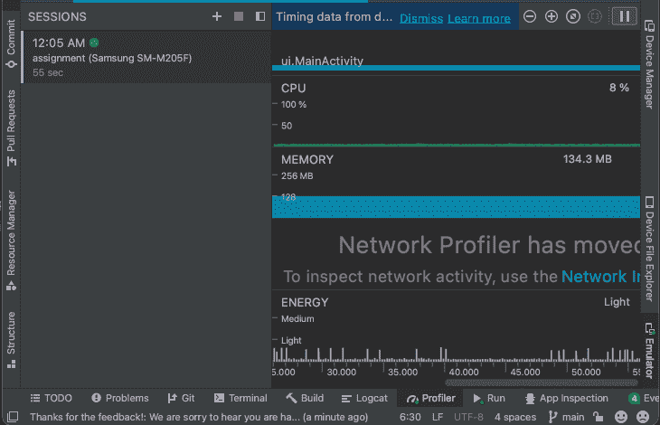

一次可以有一个活动会话。在**会话**选项卡中，您可以看到您最近的会话、应用程序名称、设备名称以及经过的时间。要添加新的会话，请单击会话工具栏上的 **+** 按钮，选择您的电话或仿真器，然后选择您想要分析的进程。

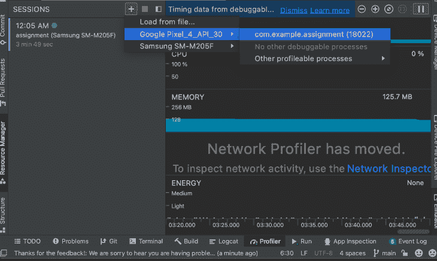

蓝线指示器显示选定的会话，绿点显示活动的会话。

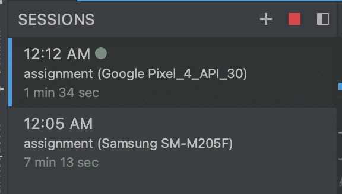

要打开任何 Profiler，单击相应行上的任意位置，您将看到更详细的视图。

> 注意:对于 Android Studio 版本 2020.3.1+，网络概述已被移动到应用程序检查器。要打开网络概述，请进入**视图** > **工具窗口** > **应用检查**，并从选项卡中选择**网络检查器**。

## 使用 Android Profiler 分析网络使用情况

对于这个例子，我们将分析一个简单的 Android 应用程序的网络使用情况，该应用程序在一篇新闻文章被点击时获取赞数和评论数。

要打开网络概述，只需单击网络概述行中的任意位置。网络概况将向您显示所有的网络请求和响应，并实时绘制在图表上。使用该分析器，您可以确保您的应用程序不会执行任何不必要的网络活动，并且您可以调试您的应用程序发送和接收的所有网络请求。

您可以将鼠标悬停在图表上，找出特定时刻发送和接收的数据量，帮助您评估是否在正确的时间执行了正确的网络请求和响应。

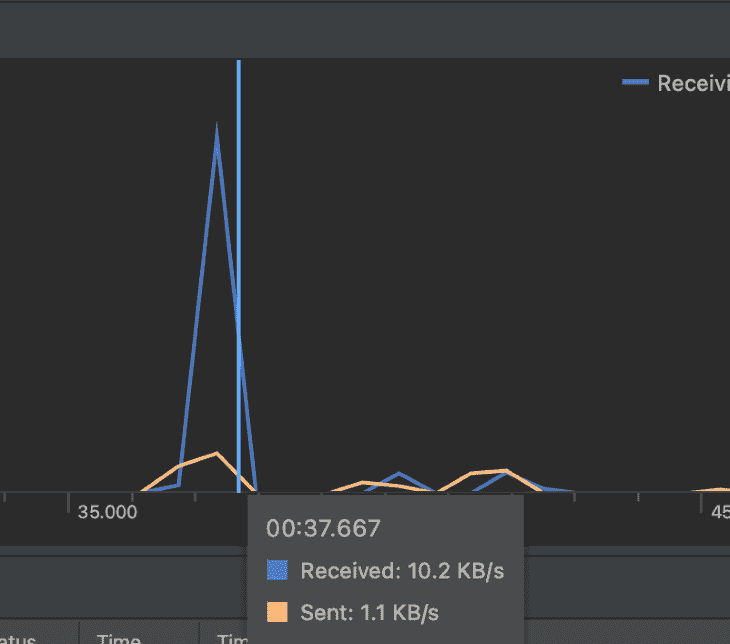

默认情况下,“网络概述”会实时显示数据。但是，您也可以选择指定的时间范围。要选择时间范围，请单击时间线中的起点和终点。

当您选择范围时，所选时间范围内的所有网络请求和响应将显示在**连接视图**选项卡下。

连接视图提供了对所选网络请求和响应的详细了解。要了解特定请求的更多信息，请单击该请求，将会显示更详细的视图。

您可以找到请求和响应的细节，如标题、正文和线程信息。


## 在 Android Profiler 中分析能耗

您可以使用 Energy Profiler 来确定您的应用是否消耗了过多的电池电量，这可能是由于以下原因造成的:

*   过多的网络请求
*   不断获取位置
*   未发布的资源，如唤醒锁、闹钟和调度程序

Energy Profiler 可以帮助您以图形方式推断您的应用程序是否消耗了过多的资源，即使它并不需要。你可以使用此配置文件来确保你的应用不会耗尽用户的电池。

请注意，能量分析器不直接测量电池电量。它只通过应用消耗的资源来估计功耗，这就是为什么你也可以在仿真器上运行 Energy Profiler。

目前，我们的新闻应用程序每秒钟从网络上获取新闻，而不是只有一次，这可以在`HomeViewModel`文件中看到:

```
fun getArticles() {
    viewModelScope.launch {
        while (true) {
            delay(1000)
            getNewsFromWeb()
        }
    }
}

```

这也可以在能量分析器中观察到。

正如你在上面看到的，我们的应用程序在 CPU 和网络资源上花费了恒定的能量。删除错误代码并使其仅获取一次新闻后，您可以再次观察能量分析器中的变化。

你可以看到，在最初从网上加载新闻文章后，我们的应用程序几乎不使用任何资源。

## 在 Android Profiler 中分析内存使用情况

内存分析器帮助您调试崩溃、应用程序不响应(ANRs)以及由于应用程序内存泄漏而导致的冻结。理想情况下，Android 系统通过移除创建的不使用的对象来自动处理垃圾收集。

但是，有时由于内存泄漏，这些对象占用的内存无法释放回堆中，这会导致垃圾收集事件，从而降低应用程序的速度，甚至会导致应用程序死亡。

内存分析器帮助您确定应用程序是否以及何时不释放未使用的对象。您还可以使用该分析器强制 Android 进行垃圾收集。内存分析器将内存分成各种组件，如 Java、本机、图形等。，以及分配的对象数。

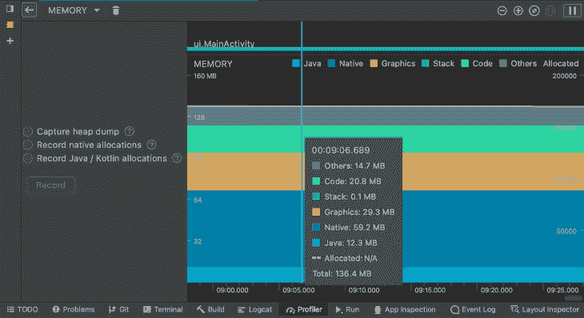

要查看分配的对象，可以捕获一个堆转储。这将记录 Android 操作系统和我们的应用程序分配的所有对象。

您还可以捕获本机分配，包括来自 C/C++代码或 Java/Kotlin 分配的对象的内存，这将捕获来自 Kotlin/Java 代码的对象。

对于 Android v7+，您可以实时检查分配的对象，而不必捕获堆转储。在捕获堆转储之后，您可以看到分配的对象。您可以按类、按包或按调用堆栈过滤这些对象。

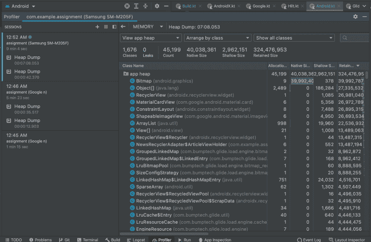

对于这个例子，我们将分析应用程序分配的字符串对象。您可以查找对象类型并单击它。

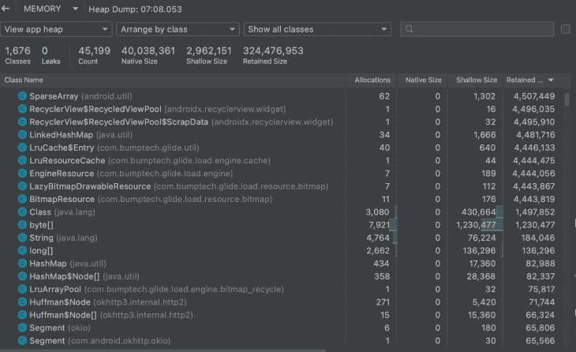

单击它会显示我们的应用程序分配的所有字符串对象。


关于每个对象的详细信息可以在**实例详细信息**中找到，单击特定对象后会显示出来。

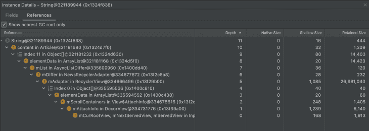

您还可以记录多个堆转储，并在某些对象被成功释放时对它们进行比较。

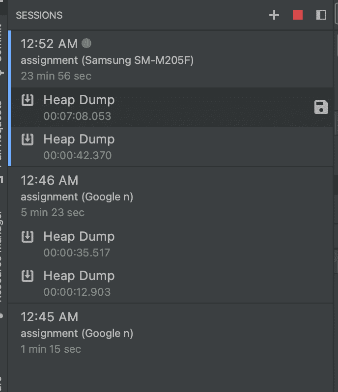

## 分析事件

您可以监控触摸、活动转换和设备旋转等事件。触摸被记录为显示活动名称正上方的红点。事件会显示在所有子系中。

要了解有关显示的活动和片段的更多信息，请将鼠标悬停在蓝线上。将出现一个包含所有视图详细信息的弹出窗口:


## 分析 CPU 活动

解决应用程序性能问题的最佳方法之一是分析其 CPU 使用情况。通过使用 CPU Profiler，您可以在真实设备或模拟器上运行应用时，实时监控应用的 CPU 使用情况和线程活动。

您可以看到应用程序中所有线程的列表。线程状态在 CPU profiler 中用三种颜色表示。绿色表示线程正在运行，黄色表示线程处于活动状态，但正在等待另一个 I/O 操作完成，灰色表示线程处于非活动状态。要获得所有执行方法的更详细视图，您需要按下 **record** 按钮。

记录时，您可以通过点击**编辑配置**按钮来编辑采样率。采样率是 CPU 被采样的次数。CPU 探查器可能无法检测短期方法。要捕获那些短命的方法，可以进一步缩短采样间隔。


你可以记录你的应用程序在运行期间的堆栈跟踪。按下**录制**按钮，在手机上移动你的应用程序的用户界面，感觉很慢。

录制完成后，会生成一个系统跟踪，类似于下面的截图。

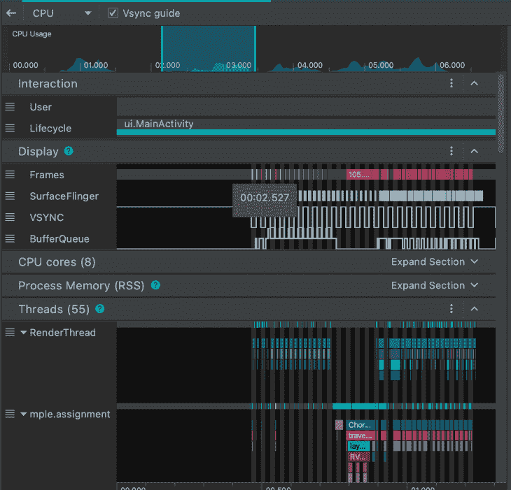

您可以使用左上角的时间范围选择器来关注您想要的时间间隔。下面的数据将反映所选的时间间隔。

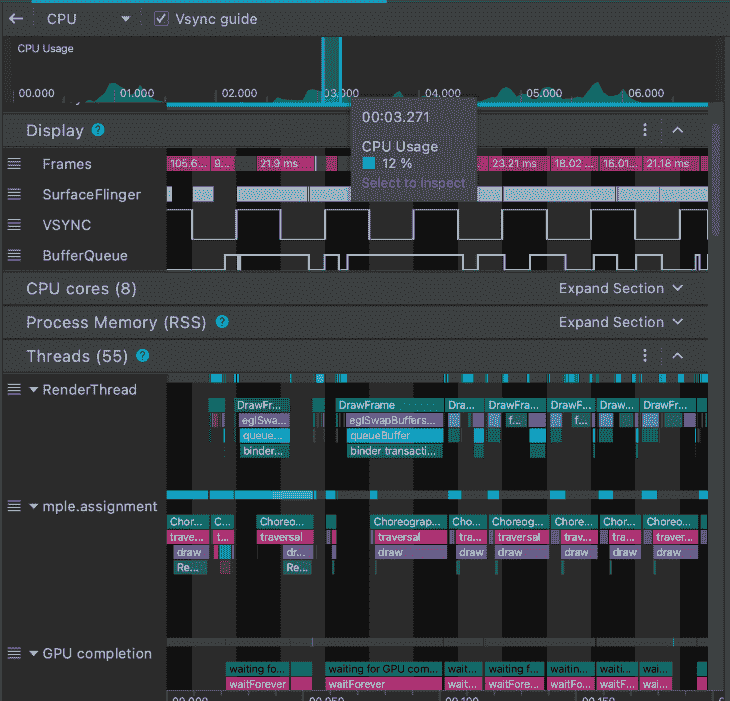

您还可以在 display 部分检查 UI 性能，比如何时绘制一个帧，有多少帧缓冲区在排队，等等。你可以在这里阅读更多关于 Android 图形性能的信息。

在**线程**部分，你可以看到所有的线程活动，并且很容易找到活动的。线程事件显示在一个图表中，并在每个线程中按事件递减的顺序排列。

要深入一个线程中的更多细节，您可以选择感兴趣的区域并按下 **M** 键。这将集中在线程内的选定区域。


上面所选的区域现在将成为焦点。可以在右侧的弹出窗口中看到该线程活动的摘要。

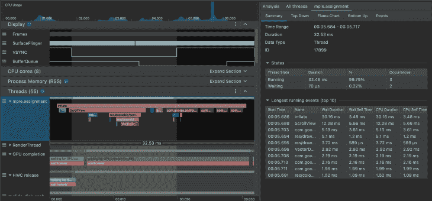

您还可以将鼠标悬停在跟踪事件上来查找其持续时间。较长的事件可能会导致跳帧、滞后甚至崩溃。

## 结论

## Android Profiler 可以让您轻松找到 Android 应用程序的错误或故障排除。无需任何第三方库，Android Studio 允许您分析应用程序的 CPU、网络、能源和内存使用情况。它还使您能够构建一个没有缓慢性能、高电池消耗和内存泄漏的应用程序。

使用 [LogRocket](https://lp.logrocket.com/blg/signup) 消除传统错误报告的干扰

## [LogRocket](https://lp.logrocket.com/blg/signup) 是一个数字体验分析解决方案，它可以保护您免受数百个假阳性错误警报的影响，只针对几个真正重要的项目。LogRocket 会告诉您应用程序中实际影响用户的最具影响力的 bug 和 UX 问题。

[](https://lp.logrocket.com/blg/signup)

然后，使用具有深层技术遥测的会话重放来确切地查看用户看到了什么以及是什么导致了问题，就像你在他们身后看一样。

LogRocket 自动聚合客户端错误、JS 异常、前端性能指标和用户交互。然后 LogRocket 使用机器学习来告诉你哪些问题正在影响大多数用户，并提供你需要修复它的上下文。

关注重要的 bug—[今天就试试 LogRocket】。](https://lp.logrocket.com/blg/signup-issue-free)

Focus on the bugs that matter — [try LogRocket today](https://lp.logrocket.com/blg/signup-issue-free).