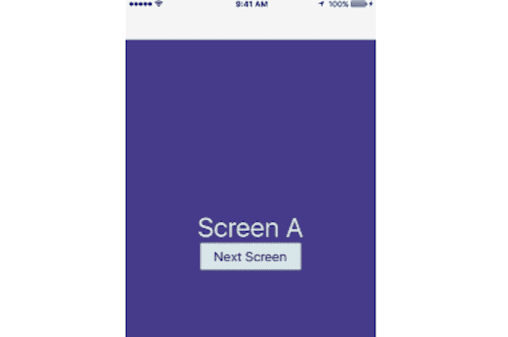

# 克服 React Native - LogRocket 博客中的单线程限制

> 原文：<https://blog.logrocket.com/overcoming-single-threaded-limitations-in-react-native/>

React Native 旨在弥合软件开发中 web 和移动框架之间的差距。不幸的是，开发人员在使用 React Native 时会面临一些与性能相关的障碍。

每个框架都有其局限性，重要的是我们如何解决这些局限性并构建功能齐全的应用程序。在这篇博文中，我们将看看限制 React Native 性能的某些特性，以及我们如何减少它们的影响，以便用这个框架构建健壮的产品。

## React Native 的架构——它是如何工作的

为了理解问题，我们先来看看 React Native 的架构是如何工作的。有三个线程主要运行 React 本机应用程序:

*   UI 线程——这是用于在 iOS 设备中运行 Swift/Objective C 和在 Android 设备中运行 Java/Kotlin 的本机线程，应用程序的 UI 仅在该线程上操作。在这里，应用程序的[视图](https://facebook.github.io/react-native/docs/view)被渲染，应用程序的用户可以与操作系统交互。这个线程中的大部分繁重工作都是由 React Native 执行的
*   JavaScript 线程——这是通过 [JavaScript 引擎](https://v8.dev/)单独执行 JavaScript 的线程。应用程序的逻辑——包括显示哪些视图以及以何种方式显示——通常在这里配置
*   桥——React Native 的桥支持 UI 和 JS 线程之间的通信

现在，UI 和 JavaScript 线程各自都很快，但是性能问题发生在它们通过桥进行通信的过程中。假设您在两个线程之间传递巨大的文件，这可能会降低性能。重要的是将桥两端之间的传递保持在最低限度，以避免任何类型的性能相关问题。

因为 React 有一个[虚拟 DOM](https://reactjs.org/docs/faq-internals.html) ，所以它异步呈现 JavaScript 组件，并且在这个过程中，减少了需要通过桥发送的数据量。然而，这并不妨碍不时出现一些性能问题，让我们突出这些问题以及如何修复它们。

## 单线程限制

React Native 本质上是单线程的。在其呈现过程中，当一个组件被呈现时，其他组件必须等待，而不是多个进程同时发生(多线程)。

事实证明，这对于那些可能希望同时实现多种功能的应用程序来说是一个巨大的挑战，例如需要实时聊天功能和实时流馈送的流媒体服务。具有更多 RAM 和处理能力的高端设备可能会运行良好，但更便宜的设备将无法运行像下面所示的 [Mixer](https://mixer.com/) 这样的应用程序:


Screenshot taken from Mixer, a live stream gaming app

解决应用程序中单线程限制的方法是让工程师构建可维护的扩展，这些扩展可以在 React 本机应用程序中处理多线程。一个扩展可以让你为一个应用程序提供定制的功能，否则它不会有。可以使用 Java、Swift 或 Objective-C 构建扩展。解决单线程问题的扩展的一个很好的例子是在 React 本机和本机组件之间建立桥梁。

在构建扩展时，重要的是在真实设备上执行测试，而不仅仅是在模拟器上，因为真实的应用程序很可能会超过应用程序的[内存限制](https://blog.swmansion.com/hunting-js-memory-leaks-in-react-native-apps-bd73807d0fde)，从而导致内存泄漏(我们将在本文后面讨论)。苹果的 [Xcode Instruments](https://help.apple.com/instruments/mac/current/) 仍然是检查应用程序内存使用情况的便捷工具。

## 慢速导航过渡

React 本机应用程序中单线程限制的另一种情况是在动画过渡期间。JavaScript 线程负责控制 React 本机应用程序中的导航器动画。



当 React Native 在 JavaScript 线程上运行动画时尝试渲染新屏幕时，会导致动画中断。React Native 的`InteractionManager` API 是改善慢速导航过渡的一个好方法。

假设你有一个做位置追踪的应用程序，用户可以通过列出位置的频繁变化来找到彼此。通过启动以特定时间间隔搜索位置的功能来列出位置变化。

```
onChangeTab(event) {
    if (event === 1) {
        intervalId = BackgroundTimer.setInterval(() => {
            this.props.actions.getAllLocationAction();
        }, 5000);
    } else {
        BackgroundTimer.clearInterval(intervalId);
    }
    this.setState({
        activeTab: event
    });
}
```

这种重复的动作必然会在组件之间的运动中产生一些滞后。为了在不降低 UI 渲染速度的情况下重复调用`onChangeTab`，我们将使用`InteractionManager` API 中的`runAfter Interactions()`方法，该方法允许我们延迟所有操作，直到所有动画完成:

```
import { InteractionManager } from 'react-native';

onChangeTab(event) {
    if (event === 1) {
        InteractionManager.runAfterInteractions(() => {
            this.props.dispatchTeamFetchStart();
        });
    }
    this.setState({
        activeTab: event
    });
}
```

## 内存泄漏

Android 和 iOS 平台上的 React 原生应用都在努力应对[内存泄漏](https://en.wikipedia.org/wiki/Memory_leak)的问题。因为 React 原生应用由 JavaScript 支持，所以它们的内存由[垃圾收集器](https://javascript.info/garbage-collection) r 管理——一个后台进程，它不断地检查对象和模块，并从那些没有被根对象直接或间接引用的对象和模块中释放内存。

在 JavaScript 中，内存由[垃圾收集器(GC)](https://en.wikipedia.org/wiki/Garbage_collection_(computer_science)) 自动管理。简而言之，垃圾收集器是一个后台进程，它定期遍历已分配对象及其引用的图表。如果碰巧遇到图形的一部分没有被根对象(例如，堆栈上的变量或像`window`或`navigator`这样的全局对象)直接或间接引用，则整个部分可以从存储器中解除分配。

使用 React Native 的架构，每个模块都附加到一个根对象。核心 React 本机模块声明保存在主作用域中的变量。这些变量可以保留其他对象，防止它们被垃圾收集。

React 原生应用中可能导致内存泄漏的一个常见做法是对闭包的不正确处理。闭包是从父作用域捕获变量的函数。查看下面的代码示例:

```
var thisList = null;
var replaceList = function () {
  var originalList = thisList;
  var idle = function () {
    if (originalList)
      console.log("nice");
  };
  thisList = {
    thisArray: new Array(2000000).join('*'),
    thisMethod: function () {
      console.log(thisMessage);
    }
  };
};
setInterval(replaceList, 1000);
```

在上面的代码示例中，每次调用`replaceList`时，`thisList`都会获得一个包含数组(`thisArray`)和方法`thisMessage`的对象。同时，变量`idle`持有一个引用`originalList`的闭包，T5 引用它的父函数`replaceList`。为闭包`thisMethod`创建的作用域由变量`idle`共享，尽管它从未被使用过，但它对`originalList`的间接引用使它保持活动状态，不能被垃圾收集器收集。

因此，当重复调用`replaceList`时，可以观察到内存使用的稳定增长，当垃圾收集器运行时，这种增长不会变小。这意味着创建的每个闭包链表都带有对`thisArray`的间接引用，从而导致代价高昂的内存泄漏。

幸运的是，修复闭包导致的内存泄漏非常简单。在`replaceList`的末尾加上`originalList = null`就可以了。所以即使名字`originalList`仍然在`thisMethod`的词汇环境中，也不会有到父值`thisList`的链接:

```
var thisList = null;
var replaceList = function () {
  var originalList = thisList;
  // Define a closure that references originalList but doesn't ever
  // actually get called. But because this closure exists,
  // originalList will be in the lexical environment for all
  // closures defined in replaceList, instead of being optimized
  // out of it. If this function is removed, there is no leak.
  var idle = function () {
    if (originalList)
      console.log("nice");
  };
  thisList = {
    thisArray: new Array(2000000).join('*'),
    thisMethod: function () {}
  };
  // If you add `originalList = null` here, there is no leak.
  originalList = null
};
setInterval(replaceList, 1000);
```

在上面的代码示例中，虽然`thisList`可以访问`originalList`，但它并不使用它。但是因为`originalList`是词汇环境的一部分，`thisMethod`将持有对`originalList`的引用。因此，即使我们用没有有效方法引用旧值`thisList`的东西替换`thisList`，旧值也不会被垃圾收集器清除。如果有一个大对象被一些闭包使用，但没有被任何需要继续使用的闭包使用，那么只要确保一旦使用完局部变量就不再指向它。

## 结论

React Native 是一个很棒的框架，融合了 web 和移动开发。只需使用一种语言——JavaScript，就可以为 Android 和 iOS 设备编写应用程序。虽然它在影响应用程序的整体性能方面可能有缺点，但这些缺点中的大部分都可以避免或改进，从而为移动应用程序创建整体更好的用户体验。

## [LogRocket](https://lp.logrocket.com/blg/react-native-signup) :即时重现 React 原生应用中的问题。

[](https://lp.logrocket.com/blg/react-native-signup)

[LogRocket](https://lp.logrocket.com/blg/react-native-signup) 是一款 React 原生监控解决方案，可帮助您即时重现问题、确定 bug 的优先级并了解 React 原生应用的性能。

LogRocket 还可以向你展示用户是如何与你的应用程序互动的，从而帮助你提高转化率和产品使用率。LogRocket 的产品分析功能揭示了用户不完成特定流程或不采用新功能的原因。

开始主动监控您的 React 原生应用— [免费试用 LogRocket】。](https://lp.logrocket.com/blg/react-native-signup)