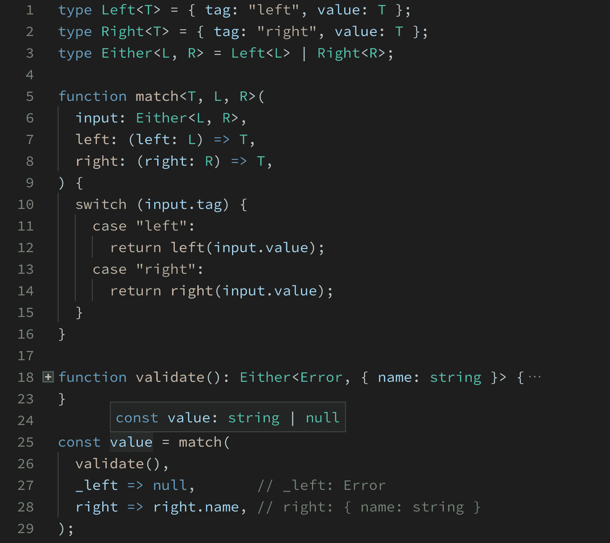
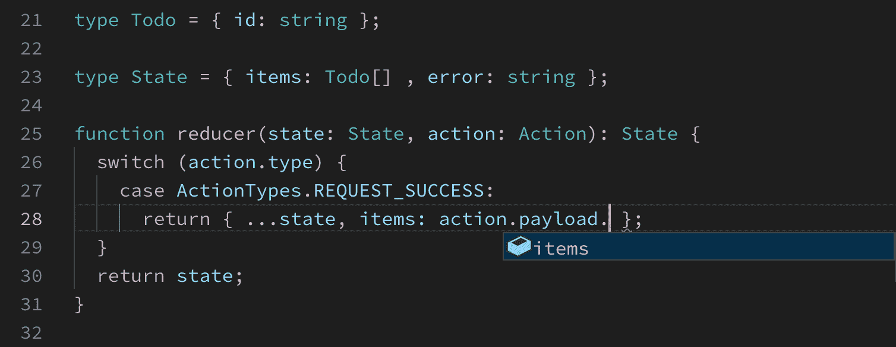
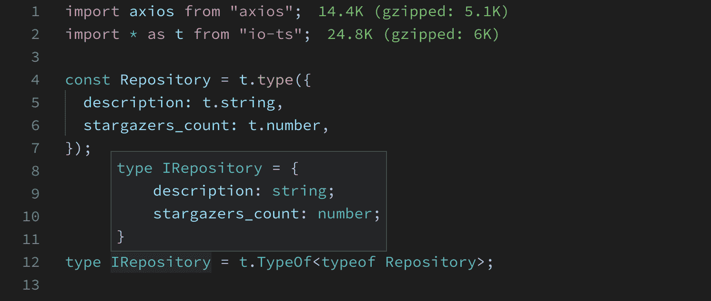
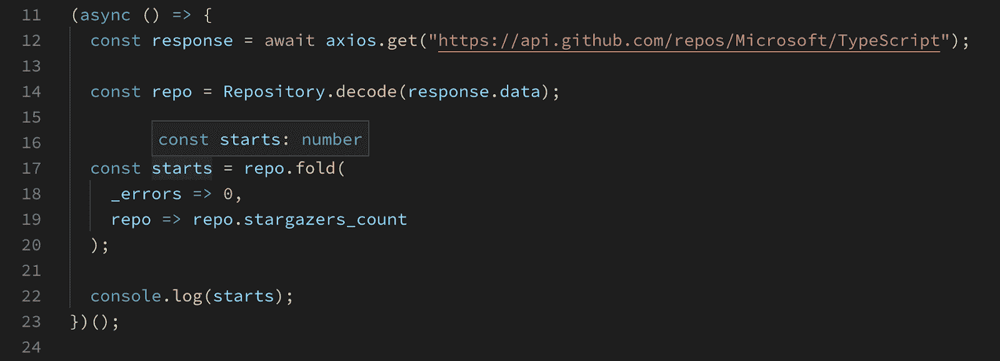

# TypeScript 中的模式匹配和类型安全

> 原文：<https://blog.logrocket.com/pattern-matching-and-type-safety-in-typescript-1da1231a2e34/>

我认为公平地说，大多数程序员把类型安全理解为消除类型错误的编程语言的一个特性。TypeScript 作为 JavaScript 的静态类型化超集解决了这个问题，特别是在严格模式下，这种模式更加严格，并执行额外的检查。

也就是说，我更感兴趣的是将类型安全理解为程序正确性的程度，而不仅仅是确保我期望的字符串是字符串而不是数字。本文的目标是介绍一些技术，您可以在日常工作中应用这些技术来增强您对代码正确性的信心。

通常在我们的程序中，我们不得不处理不同的情况，而大多数错误都是由于错误地处理了某个特定的情况或者根本没有处理它。这确实是一个非常宽泛的定义，说明了是什么导致了 bug，但是补救措施也是通用的，并且有许多应用。为了解决源于代码中错误处理决策的问题，我们使用代数数据类型，这是函数式编程中的一个流行概念。

[](https://logrocket.com/signup/)

### 要么向左，要么向右

代数数据类型是一种复合类型(也就是将几种类型组合在一起的类型)。听起来熟悉吗？是啊！我们在 TypeScript 中有一个类似的构造，它被称为联合类型。


结果类型只接受“左”或“右”值，“向前”不可赋给类型`Either`。这是我们正在寻找的代数数据类型吗？还没有，首先我们需要一个界面。

```
type Left = { tag: "left", error: Error };
type Right<T> = { tag: "right", result: T };
type Either<T> = Left | Right<T>;
```

任一个现在都是标记的并集(区别并集)。TypeScript 的类型系统是结构化的，标记的 union 是我们在 TypeScript 中所能得到的最接近代数数据类型的。这种符号实际上非常接近于我们在 Haskell 这样的纯函数式语言中如何将代数数据类型导出到 JSON。

这种方法的好处是什么？虽然它看起来像是不必要的样板文件，但它是值得的。我们现在可以用 switch 语句模拟模式匹配。


该函数允许我们匹配类型为`Either<string>`的值的标签。我们马上就能得到所有可供选择的值的提示。


现在，TypeScript 知道了`Left`值的唯一可用成员是 tag 和 error。结果只在`Right`类型上可用，我们知道它不属于等于 left 的标签。


我忘了处理正确的案件！由于显式指定了匹配返回类型，TypeScript 可以警告我忘记处理的情况。


现在，match 为它接受的每种情况的值返回一个字符串。现在，您应该已经掌握了哪些代数数据类型是有用的。可以使用回调来实现更好的可重用的 match 实现。



这个特定的 match 实现的真正优点是，只要您获得了正确的输入类型，match 调用的其余类型就会被推断出来，并且不需要额外的输入。

在我们看一个更复杂的例子之前，你以前听说过`Either`类型吗？很有可能是你干的！

当我们必须处理两种情况中的任何一种时，经常使用这两种类型。按照惯例，`Left`用于保存错误，`Right`用于保存正确(“正确”)的值。如果你在记住顺序方面有问题，并且“正确-正确”的类比不成立，那么想想我们习惯的参数和 Node.js 中的回调。

```
import fs from "fs";
fs.readFile("input.txt", (err, data) => {
  if (err) return console.error(err);
  console.log(data.toString());
});
```

第一个参数是错误(参数列表的左侧)，第二个参数是结果(参数列表的右侧)。

如果我让你对代数数据类型感兴趣，看看 [fp-ts](https://github.com/gcanti/fp-ts) ，这是一个定义了许多不同的代数数据类型供选择的库，并且有一个丰富的生态系统。

### 类型安全减压器

在 redux 的 reducer 中，我们用来提出我们的`Either`类型的非常相同的技术可以应用于使用 switch 语句已经很流行的地方。不是只有一个二元选项`Left`或`Right`，我们可以有尽可能多的选项作为我们必须处理的动作类型。为了记录，我们努力优化 reducer 的正确性和开发的简易性，这要归功于精确的自动完成。

```
enum ActionTypes {
  REQUEST_SUCCESS = "REQUEST_SUCCESS",
  REQUEST_FAILURE = "REQUEST_FAILURE",
}
type SFA<T, P> = { type: T, payload: P };
const createAction = <T extends ActionTypes, P>(
  type: T,
  payload: P
) : SFA<T, P> => ({ type, payload });
const success = (payload: { items: Todo[] }) =>
  createAction(ActionTypes.REQUEST_SUCCESS, payload);
const failure = (payload: { reason: string }) =>
  createAction(ActionTypes.REQUEST_FAILURE, payload);
const actions = { success, failure };
type Action = ReturnType<typeof actions[keyof typeof actions]>;
type Todo = { id: string };
type State = { items: Todo[] , error: string };
function reducer(state: State, action: Action): State {
  switch (action.type) {
    case ActionTypes.REQUEST_SUCCESS:
      return { ...state, items: action.payload.items, error: "" };
    case ActionTypes.REQUEST_FAILURE:
      return { ...state, items: [], error: action.payload.reason };
  }
  return state;
}
```

我将动作类型定义为字符串枚举。`SFA` type 代表一个标准的通量动作，可以和`createAction`一起过载，以适应更多的动作形状，但目前这不是最重要的。有趣的部分是我们如何建造`Action`型。使用`ReturnType`，我们可以直接从 actions 对象中获得动作创建者返回的动作类型。



这极大地减少了我们在每个 reducer 中必须做的输入量，而又不影响类型安全性。

* * *

### 更多来自 LogRocket 的精彩文章:

* * *

### 运行时类型

你曾经为 JSON 有效负载定义过类型吗？一般来说，HTTP 客户端允许您这样做，但是您不能保证您实际要获取的内容与您指定的接口相匹配。这就是运行时类型的用武之地。 [io-ts](https://github.com/gcanti/io-ts) 库采用了这种方法，模糊了静态类型的可能性和需要编写防御性代码和自定义类型保护的可能性之间的界限。



定义`Repository`(运行时类型)就像在 TypeScript 中定义接口一样轻松。也可以使用`TypeOf`从运行时类型中提取静态类型。



我可以获取有效载荷，而不用担心指定响应的类型，反正我也不确定。我将有效载荷解码成我期望的 Microsoft/TypeScript GitHub 存储库。我不必定义所有的领域，只定义我感兴趣的领域。对回购调用 fold 类似于我们使用 match 函数的方式。事实上，回购是类型`Either`的，它的实现与我们的`Either`略有不同，但思想是相同的。左边的值是阻止有效负载正确解析的错误列表，右边的值是存储库。

### 外卖食品

我有意试图避免抛出和处理错误。在所提供的例子中，错误处理不是事后的想法，我们将软件建模为将错误视为领域的一部分。这并不容易，但我发现这是一次很好的学习经历。

我也鼓励你避免在你的接口和函数签名中使用任何。它是一个快速传播到所有消费者的出口，要么迫使您失去静态类型的好处，要么断言类型(显式使用“as”语法或保护函数)。

我希望所提供的例子能给你一些指导，告诉你如何将代数数据类型合并到你自己的项目中。别忘了亲自尝试一下 io-ts！

## [LogRocket](https://lp.logrocket.com/blg/typescript-signup) :全面了解您的网络和移动应用

[](https://lp.logrocket.com/blg/typescript-signup)

LogRocket 是一个前端应用程序监控解决方案，可以让您回放问题，就像问题发生在您自己的浏览器中一样。LogRocket 不需要猜测错误发生的原因，也不需要向用户询问截图和日志转储，而是让您重放会话以快速了解哪里出错了。它可以与任何应用程序完美配合，不管是什么框架，并且有插件可以记录来自 Redux、Vuex 和@ngrx/store 的额外上下文。

除了记录 Redux 操作和状态，LogRocket 还记录控制台日志、JavaScript 错误、堆栈跟踪、带有头+正文的网络请求/响应、浏览器元数据和自定义日志。它还使用 DOM 来记录页面上的 HTML 和 CSS，甚至为最复杂的单页面和移动应用程序重新创建像素级完美视频。

[Try it for free](https://lp.logrocket.com/blg/typescript-signup)

.