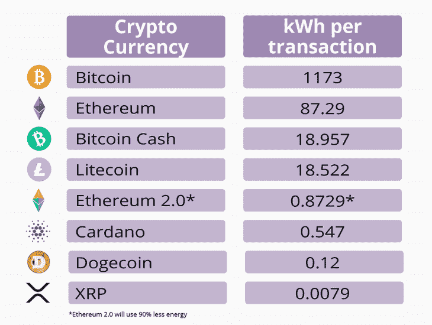

# DApps - LogRocket 博客的许可与非许可区块链

> 原文：<https://blog.logrocket.com/permissioned-vs-permissionless-blockchains-dapps/>

区块链为没有中央权威的分散网络和平台提供便利。然而，使用无许可区块链访问模式的不受监管的区块链平台可能会导致不受欢迎的用户加入公共区块链平台，只是为了欺骗其他用户。

为了防止这种情况，存在一种使用治理和分层结构的区块链访问模型。在这个模型中，用户需要获得许可才能加入区块链平台。这种模式被称为许可或私人区块链。

这些模型有自己的用例，适用于不同的环境，即使未经许可的区块链初看起来像是一个安全风险。

未经许可的区块链平台非常常见，并且得到了开源社区的更多支持，例如以太坊和比特币。然而，这种模式对于想要分级特权和严格访问的组织和社区来说并不好。

因此，必须了解您的分散式应用程序的需求，以便将它们与合适的区块链访问模型相匹配。在本指南中，您将了解许可型和非许可型区块链之间的基础架构差异，以确定哪种最适合您的 DApp。

### 内容

## 什么是许可的区块链？

许可或私人区块链访问模式有管理员定期监管和展望区块链平台。它有一个治理结构，不同的成员有不同的角色和权限。与无权限的区块链不同，用户需要访问权限才能访问和使用有权限的区块链。

Quorum 和 Corda 是被许可的区块链的例子。Quorum 向金融机构和企业提供许可的 DeFi 服务，而 Corda 是区块链的一个项目，使个人和公司能够建立可互操作的区块链网络，允许他们与其他企业进行通信和直接交易。

被许可的区块链在被给予访问权限之前需要符合 KYC(了解你的客户)的身份和角色定义。KYC 合规是验证客户身份以防止欺诈和腐败的过程。

因为任何想加入许可区块链平台的人都需要许可访问，它的网络很快，因为只有很少的用户可以访问。此外，管理员可以控制访问平台或特定功能的用户数量。能够调整用户流量意味着区块链将易于维护。

监管一个建立在许可的区块链上的社区很容易，因为你可以暂停恶意成员的资格。跟踪变更和授权给高参与度的成员也很容易。

许可区块链并不是 100%透明的，因为平台所有者或管理员可以决定在区块链平台上分享多少信息。普通成员将无法检测任何故障或跟踪某些数据。

为了提高透明度和隐私性，管理员可以同时使用有权限和无权限的区块链。当这两种模式同时使用时，这种结合产生了一种新的区块链模式，称为混合区块链。

在混合区块链模型中，服务、特性和流程的某一部分是私有的，而区块链的另一部分是公共的。

## 什么是无权限区块链？

未经许可的区块链没有一个中央管理机构。成员不需要权限就可以加入免权限区块链平台或社区。与有权限的区块链不同，用户在使用无权限的区块链时可以保持匿名。

以太坊和比特币是首批未经许可的区块链平台。这些平台是开源的，使用共识算法来验证块，并激励那些验证(或挖掘)它们的人。

这种模式允许所有用户查看区块链平台上发生的所有交易。比如[以太扫描](https://blog.logrocket.com/how-to-mint-an-nft-with-etherscan/)，一个记录和展示以太坊交易活动的平台。

因为无许可区块链没有管理机构或所有者，所以该模型使用一致算法来促进平台上发生的所有交易和活动。

无许可区块链使用不同的共识算法，例如:

*   工作证明
*   股权证明
*   有效的股权证明(ePOS)

这些共识算法决定了验证区块的矿工如何获得令牌作为补偿。这些共识模型提高了安全性，因为矿工验证块，并可以撤销任何恶意块。具有讽刺意味的是，这使得未经许可的区块链比经过许可的区块链更加安全。

尽管无权限区块链似乎不安全，但在这个模型中破坏数据是很难的，因为超过 50%的参与者必须同意破坏数据。

* * *

### 更多来自 LogRocket 的精彩文章:

* * *

## 哪个区块链最适合你的 DApp？

本节旨在通过查看许可和非许可区块链的不同使用案例和特征，向您展示哪种基础架构最适合您的 DApp。

以下是您在决定哪种区块链访问模式适合您时应该考虑的一些因素。

### 审查和透明度

如果您的 DApp 的主要优先事项是促进隐私和透明度，那么无许可区块链是最适合您的应用程序。当谈到维护隐私和透明度时，无权限区块链也是最好的，因为用户可以匿名，所有交易都可以被每个人看到。所有用户都是平等的，都有平等的访问权。没有管理员可以审查 DApp 的用户。

在这种情况下，许可的区块链并不是最好的，因为有一个人拥有可以破坏数据的权利。如果掌权者为了自己的利益而改变算法，那么也很难维持一致的算法。

### 商品化

获得许可的区块链在 NFT 市场表现良好。当一个用户购买了一个 NFT，他们就可以进入一个许可的区块链。这给了他们更多的额外待遇，比如和其他成员一起乘游艇。此权限仅限于未购买 NFT 的区块链会员。

许可区块链最好的一点是，它监管良好，对企业有利，因为企业可以选择谁有权访问他们的私人区块链。

### 性能和安全性

与无权限的区块链相比，有权限的区块链速度更快，因为它们管理可以访问和加入有权限的区块链的用户数量。

然而，与无许可的区块链相比，有许可的区块链不具有有效的安全性，因为没有或很少有验证者来验证块或活动。在无许可区块链中发生的每个块或交易在被添加之前都必须被验证。

一个无权限的区块链很容易维护，因为有数百万成员报告错误和验证块。在得到许可的区块链，管理员可以执行安全措施，但不如在没有许可的区块链有效。

FAANG 公司和以太坊二层平台之所以成功，是因为他们的源代码是开源的。开源你的分布式应用程序的源代码是有益的，因为你将会收到来自世界各地的开发者的评论、更新和想法。

开源的 DApps 经历了快速的发展和技术进化。无权限区块链最适合这个用例，因为它有利于投票和筹款程序。这是因为每个人都被允许加入筹款计划并为源代码做出贡献。

无许可区块链还为贡献者提供了一种通过加密货币获得补偿的方式。共识算法有助于补偿过程。

### 用电量

由 MoneySuperMarket 进行的一项研究显示，单笔比特币交易至少使用 1173 千瓦时。这些能量足够[为一所房子](https://www.eia.gov/tools/faqs/faq.php?id=97&t=3#:~:text=How%20much%20electricity%20does%20an,about%20893%20kWh%20per%20month.)供电一个多月。所有这些挖掘代币的加密货币都使用无许可区块链。这是因为有许多正在进行的交易需要由加密挖掘者进行验证。

Photo credit: MoneySuperMarket

无权限模型在开采和验证区块时会消耗大量能量。当使用无权限区块链时，也很难扩展您的 DApp，因为每天都有许多未知用户加入并进行交易。

一个无许可的区块链是昂贵的，因为验证者必须被激励。许多未经许可的区块链，如[以太坊和 Harmony](https://blog.logrocket.com/ethereum-vs-harmony-which-blockchain-right-for-you/) 已经创建了他们自己的加密货币和令牌，用于激励他们的验证者。这是一个有效的策略，但让加密硬币具有真正的价值，可以在公开市场上交易并不容易。加密货币的价值将取决于区块链平台的性能。这一领域的竞争也很激烈。

### Web 定制和灵活性

许可的区块链 DApps 很容易定制和满足他们的观众，因为他们有一个小的观众和用户群，加上管理员和所有者将他们的时间投入到设计平台的特定需求。这个过程很快，因为不需要投票过程来选择将哪些更新推送到 DApp 的代码库。

## 结论

混合模型介于许可和非许可区块链之间。这种模式是许多 DApps 的最佳选择，因为它不会限制您只能选择一种区块链访问模式，并允许您的用户从许可功能切换到无许可功能。

一言以蔽之，无权限区块链有利于公共平台和应用；所有用户都是平等的，没有人可以凌驾于《区块链共识》之上。然而，允许的区块链对 DApp 有严格的数据访问权限。

但是，最佳的区块链接入模式是满足您的 DApps 需求的模式。希望您可以使用我在本文中列出的标准，为您的下一个项目做出明智的决定。

## 加入像 Bitso 和 Coinsquare 这样的组织，他们使用 LogRocket 主动监控他们的 Web3 应用

影响用户在您的应用中激活和交易的能力的客户端问题会极大地影响您的底线。如果您对监控 UX 问题、自动显示 JavaScript 错误、跟踪缓慢的网络请求和组件加载时间感兴趣，

[try LogRocket](https://lp.logrocket.com/blg/web3-signup)

.

[https://logrocket.com/signup/](https://lp.logrocket.com/blg/web3-signup)

LogRocket 就像是网络和移动应用的 DVR，记录你的网络应用或网站上发生的一切。您可以汇总和报告关键的前端性能指标，重放用户会话和应用程序状态，记录网络请求，并自动显示所有错误，而不是猜测问题发生的原因。

现代化您调试 web 和移动应用的方式— [开始免费监控](https://lp.logrocket.com/blg/web3-signup)。