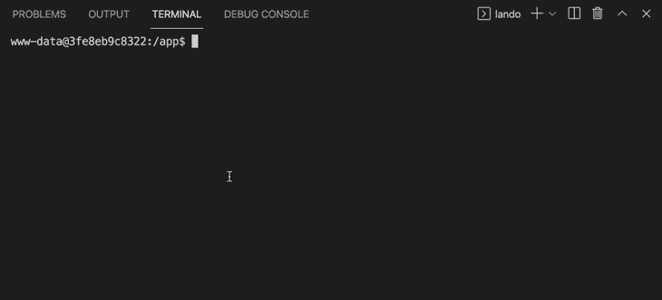
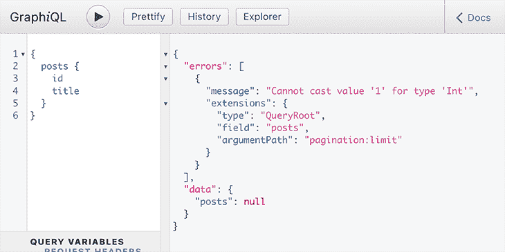
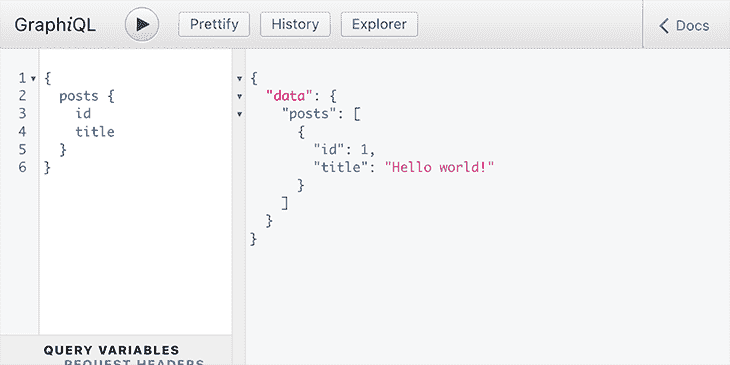

# Phabel vs. Rector:哪个更适合传输 PHP 代码？- LogRocket 博客

> 原文：<https://blog.logrocket.com/phabel-vs-rector-better-transpiling-php-code/>

一段时间以来，我一直支持将 PHP 代码降级，因为它允许我们使用最新版本的 PHP，并将其部署到由于这样或那样的原因仍然必须运行遗留 PHP 版本的环境中。通过[主管](https://github.com/rectorphp/rector)，一个基于规则重构 PHP 代码的工具，PHP 降级变得可行。

在我的特殊情况下，自从我开始为 WordPress 传输我的插件以来，我可以开始使用类型化属性、联合类型、构造函数属性提升、箭头函数和许多其他现代特性，并且还可以产生 PHP 7.1 版本。结果，我的开发体验得到了极大的改善，然而 85%的 WordPress 站点(那些运行 PHP 7.1 和更高版本的[)可以使用该插件，这比运行 PHP 8.0 的 WordPress 站点的 2%有了大幅增长。](https://wordpress.org/about/stats/)

因此，几周前，当我看到 Reddit 上的一个帖子时，我有点兴奋，这个帖子说[推出了一个专门用于编译 PHP 代码的新工具](https://www.reddit.com/r/PHP/comments/piznsr/phabel_convert_php8_syntax_into_lower_versions/%20target=):[Phabel](https://github.com/phabelio/phabel)。(你可能已经猜到了，它的名字来源于“PHP”和“Babel”的混合，后者是 JS 代码的流行 [transpiler。)](https://blog.logrocket.com/tag/babel)

我觉得有必要尝试一下这个新工具，看看它与 Rector 相比如何。我的意图并不是取代 Rector，因为到目前为止我非常喜欢它，而是比较这两种方法，分析这两种工具是否优于另一种，并确定每种工具的最佳用例。

这篇文章是我探索的结果。

## 这些工具什么时候可以用？

Phabel 是一个专门用来降级 PHP 代码的工具。相比之下，Rector 是一个可编程的工具，可以将 PHP 代码从任何状态转换成任何其他状态。

除了降级， [Rector 还提供了一些规则](https://github.com/rectorphp/rector/blob/main/docs/rector_rules_overview.md)，用于更新 PHP 代码(比如从 PHP 7.1 转换到 8.1)、提高代码质量、重命名函数以及其他一些规则。

因此，在降级 PHP 代码的特定用例中，Phabel 可以替代 Rector，除此之外别无他用。

## Rector 如何降级代码

雷克脱和法贝尔在执行方式上有很大不同。Rector 依靠 [Composer](https://getcomposer.org/) 在`vendor/bin/rector`下生成独立的可执行文件。然后，我们可以在任何时候访问控制台或脚本环境时调用它，例如在我们的笔记本电脑上进行开发时，在托管服务器上推送代码时，在 web 服务器上部署代码时，等等。

为了降级 PHP 代码，一个简单的方法是在 CI 流程中调用 Rector。在这个使用 GitHub Actions 的例子中，当标记 repo:

```
name: Generate Installable Plugin and Upload as Release Asset
on:
  release:
    types: [published]
jobs:
  build:
    name: Build, Downgrade and Upload Release
    runs-on: ubuntu-latest
    steps:
      - name: Checkout code
        uses: actions/[email protected]
      - name: Downgrade code for production (to PHP 7.1)
        run: |
          composer install
          vendor/bin/rector process
          sed -i 's/Requires PHP: 7.4/Requires PHP: 7.1/' graphql-api.php
      - name: Build project for production
        run: |
          composer install --no-dev --optimize-autoloader
          mkdir build
      - name: Create artifact
        uses: montudor/[email protected]
        with:
          args: zip -X -r build/graphql-api.zip . -x *.git* node_modules/\* .* "*/\.*" CODE_OF_CONDUCT.md CONTRIBUTING.md ISSUE_TEMPLATE.md PULL_REQUEST_TEMPLATE.md rector.php *.dist composer.* dev-helpers** build**
      - name: Upload artifact
        uses: actions/[email protected]
        with:
          name: graphql-api
          path: build/graphql-api.zip
      - name: Upload to release
        uses: JasonEtco/[email protected]
        with:
          args: build/graphql-api.zip application/zip
        env:
          GITHUB_TOKEN: ${{ secrets.GITHUB_TOKEN }}

```

GitHub 动作工作流还可以通过[将降级的 PHP 代码推送到一个额外的“DIST”repo](https://github.com/leoloso/PoP/blob/36a0df5d1ba317c0ce655bcc0793b6c9050e874f/.github/workflows/generate_plugins.yml#L191-L213)来使其可用:

```
      - name: Uncompress artifact
        uses: montudor/[email protected]
        with:
          args: unzip -qq build/graphql-api.zip -d build/dist-plugin

      - id: previous_tag
        uses: "WyriHaximus/[email protected]"

      - name: Publish to DIST repo
        uses: symplify/[email protected]
        env:
          GITHUB_TOKEN: ${{ secrets.ACCESS_TOKEN }}
        with:
          tag: ${{ steps.previous_tag.outputs.tag }}
          package-directory: 'build/dist-plugin'
          split-repository-organization: GraphQLAPI
          split-repository-name: graphql-api-for-wp-dist

```

## Phabel 如何降级代码

Phabel 使用不同的策略，由两个要素组成:

1.  `vendor/bin/phabel`下的独立可执行文件，用于标记要降级的回购
2.  执行降级的作曲脚本

在第一阶段，每当为库标记代码时，我们还必须执行`vendor/bin/phabel publish`来创建和推送两个额外的标记:`tag.9999`和`tag.9998`(例如，在用`1.0.0`标记 repo 之后，它还会产生`1.0.0.9999`和`1.0.0.9998`)。

`tag.9999`是`tag`的简单复制，因此它告诉 Composer 它需要用于开发的相同版本的 PHP，很可能是 PHP 8.0。

相反，`tag.9998`用`*`替换了`composer.json`中所需的 PHP 版本，从而告诉 Composer 它可以处理任何 PHP 版本。它将所有依赖项从`require`转移到`extra`以避免不成功的版本约束生效，允许 Phabel 安装和降级依赖项。

在第二阶段，用户必须通过 Composer 将库安装到他们的项目中。该库通常是必需的，例如，带有版本约束`^1.0`。然后，当执行`composer install`或`composer update`时，基于环境的 PHP 版本，Composer 将决定使用哪个版本。如果运行 PHP 8.0 它将使用`1.0.0.9999`；如果运行的是 PHP 7.3，会回退到`1.0.0.9998`。

最后，如果依赖关系是通过标签`1.0.0.9998`解决的，那么 Phabel 的 Composer 脚本将在依赖关系安装后自动触发，并降级其 PHP 代码。



Transpiling code via Phabel (4x the speed)

## 对比这两种方法

降级代码的两种不同方法产生了一个重要的影响:Rector 很可能在服务器上执行，而 Phabel 将在客户机上运行！

起初，这似乎是 Phabel 的一个优势，因为它更简单:

*   它不需要集成到 CI 流程中
*   没有必要创建额外的 DIST 回购协议
*   不需要将`vendor/`文件夹(包含库的所有依赖项，也必须降级)上传到 DIST 回购

然而，这种方法有几个缺点，在我看来，这使得它不如使用 Rector 有吸引力。

首先，在 Rector 中，库的维护者可以完全控制降级体验，确保在发布降级的库之前一切顺利。相反，由于 Phabel 的降级过程在客户端运行，如果客户端遇到问题，那么 Phabel 可能会失败。

事实上，这种情况发生在我身上:将我的代码从 PHP 8.0 降级到 7.1 需要几分钟，而且一次又一次地，Composer 脚本会在代码完全降级之前被终止:


我试图克服这个问题；我以为会和 [Composer 的进程超时](https://getcomposer.org/doc/06-config.md#process-timeout)有关，默认设置为 300 秒，所以在`composer.json`里增加了超时:

```
{
  "config": {
    "process-timeout": 600
  }
}

```

但是没有用。我花了几个小时试图修复它，但没有成功。最后，我决定将我的代码降级到 PHP 7.3，而不是 PHP 7.1，PHP 7.3 需要执行更少的规则，因此可以在超时之前完成。这不是一个实用的解决方案；对于我对工具的探索来说，这已经足够好了，但是如果我需要将它用于生产，就不够好了。

另一方面，当使用 Phabel 时，同一个库会被一次又一次地降级，进一步消耗处理能力。等待时间也从库的维护者转移到库的每一个用户，这不是最优的。

从这个角度来看，一个流行的库，比如 Symfony DependencyInjection 有超过 5000 个项目依赖于它。这意味着 5000 个项目将需要执行降级库的过程；5000 个用户将需要等待进程执行，消耗的能量将比在原点降级库大 5000 倍。

现在，这个问题可以在 Phabel 中解决。事实上，Phabel 库本身正在使用 Phabel 进行降级，降级的版本都是在不同分支下的 Phabel repo 中发布的[。但是 Phabel 的简单性几乎丧失了，所以它不再比使用 Rector 有任何优势。](https://github.com/phabelio/phabel/branches)

## Phabel 的可扩展性如何？

降级 PHP 代码是一个要么全有要么全无的命题:要么有效，要么无效。我们不能只降级 99%的代码，因为剩下的 1%足以使应用程序失败。

Phabel 有一个项目在使用它: [MadelineProto](https://github.com/danog/MadelineProto) ，由与 Phabel 相同的作者创建，因此我们可以确信 Phabel 足够好，可以降级 MadelineProto 使用的 PHP 特性。如果您的 PHP 项目不使用任何额外的 PHP 特性，那么 Phabel 可能是不错的选择。

然而，在我的例子中，在使用 Phabel 降级我的插件后，运行应用程序会抛出一个错误:

```
PHP Fatal error:  Class Symfony\\Component\\DependencyInjection\\Exception\\ExceptionInterface cannot implement previously implemented interface Throwable in /app/vendor/phabel.transpiler73:symfony/dependency-injection/Exception/ExceptionInterface.php on line 20

```

失败的代码是这样的(发生这种情况是因为`ContainerExceptionInterface`已经从`Throwable`扩展而来):

```
namespace Symfony\Component\DependencyInjection\Exception;

use Psr\Container\ContainerExceptionInterface;

interface ExceptionInterface extends ContainerExceptionInterface, \Throwable
{
}

```

在我修复了这段代码之后，错误消失了，应用程序运行了。

我们可以有把握地得出结论，库的可扩展性很重要，因此我们可以提供缺失的降级功能。如果功能是通用的(如上例)，我们可以尝试对其进行编码，并为回购做出贡献(毕竟，开源是每个人都做的)。

但是如果逻辑是特定于我们的应用程序的，那么我们应该能够使用我们自己的代码来扩展 Phabel。

一个明显的例子是当使用 PHP 8.0 属性时，它必须降级为等效的功能，可能基于注释。属性可以用于一些通用目标，例如`[#Deprecated]`(降级为`@deprecated`)，或者可以支持来自应用程序的定制功能，为此降级也将是特定于应用程序的。

尽管如此，在撰写本文时，Phabel 不支持[降级属性](https://github.com/phabelio/phabel/issues/11)，更重要的是，它不支持[自定义降级](https://github.com/phabelio/phabel/issues/10)。因此，如果您的应用程序使用属性，或者有一些特定于应用程序的代码需要降级，那么您就不能使用 Phabel。

## Rector 的可扩展性如何？

Rector 处理扩展性要好得多。它已经[提供了一个降级属性](https://github.com/rectorphp/rector/blob/main/docs/rector_rules_overview.md#downgradeattributetoannotationrector)的规则，可以配置来处理低挂果实(比如`[#Deprecated]`)。如果这个规则还不够，Rector 的[基于规则的架构](https://blog.logrocket.com/creating-first-rector-rule-transform-php-code/)意味着我们可以创建和执行自己的规则。

另外，因为 Rector 通常在 CI 流程中执行，所以我们也可以在其中执行降级逻辑。在上面演示的 GitHub Actions 工作流中，有这样一段代码:

```
        run: |
          composer install
          vendor/bin/rector process
          sed -i 's/Requires PHP: 7.4/Requires PHP: 7.1/' graphql-api.php

```

那个`sed -i 's/Requires PHP: 7.4/Requires PHP: 7.1/' graphql-api.php`正在改变我的 WordPress 插件的 PHP 要求，从 PHP 7.4。到 7.1。我可以为此创建一个 Rector 规则，但实际上没有必要，因为这个解决方案要简单得多。

## 法贝尔有多可靠？

执行降级(并手动修复问题)后，应用程序将运行。然而，不幸的是，降级逻辑改变了应用程序的行为，使其无法正常工作。

我的插件是 WordPress 的 GraphQL 服务器。当执行一个应该返回响应的简单 GraphQL 查询时，我得到了一个验证错误:



调试降级的代码时，我发现以下代码导致了问题:

```
class IntScalarTypeResolver extends AbstractScalarTypeResolver
{
  public function coerceValue($inputValue)
  {
    if (!$inputValue instanceof stdClass) {
      if (!\is_bool($inputValue)) {
        if (!(\is_bool($inputValue) || \is_numeric($inputValue) || \is_string($inputValue))) {
          if (!\is_float($inputValue)) {
            if (!(\is_bool($inputValue) || \is_numeric($inputValue))) {
              if (!\is_int($inputValue)) {
                if (!(\is_bool($inputValue) || \is_numeric($inputValue))) {
                  if (!\is_string($inputValue)) {
                    if (!(\is_string($inputValue) || \is_object($inputValue) && \method_exists($inputValue, '__toString') || (\is_bool($inputValue) || \is_numeric($inputValue)))) {
                      throw new \TypeError(__METHOD__ . '(): Argument #1 ($inputValue) must be of type stdClass|string|int|float|bool, ' . \Phabel\Plugin\TypeHintReplacer::getDebugType($inputValue) . ' given, called in ' . \Phabel\Plugin\TypeHintReplacer::trace());
                    } else {
                      $inputValue = (string) $inputValue;
                    }
                  }
                } else {
                  $inputValue = (int) $inputValue;
                }
              }
            } else {
              $inputValue = (double) $inputValue;
            }
          }
        } else {
          $inputValue = (bool) $inputValue;
        }
      }
    }

    // ...
  }
}

```

所有这些类型验证是什么？它们是由 Phabel 添加的，用于将[原始函数参数中的联合类型降级为`coerceValue`](https://github.com/leoloso/PoP/blob/dbae37b7585b14c8312e7b2067a9bfa1fb9c70e2/layers/Engine/packages/engine/src/TypeResolvers/ScalarType/IntScalarTypeResolver.php#L28) :

```
function coerceValue(string|int|float|bool|stdClass $inputValue)
{
  // ...
}

```

这个逻辑是否有问题，我不知道——我没有调试到足够深的程度来看冲突发生在哪里——但是，就目前的情况而言，这个逻辑还意外地将变量的类型从`int`转换为`string`，这使得 GraphQL 查询的验证失败，因为它期望一个`Int`并接收到一个`String`。

在手工注释了所有这些额外的行之后，在该函数和降级代码中的许多类似的行中，应用程序将会很好地工作:



同样，我可以手动执行这个编辑，因为我正在测试这个工具。但是如果要我用在生产上，那就一点都不实用了。

## Rector 有多靠谱？

Phabel 出于好意遇到了上面的问题:它想在 PHP 8.0 到 PHP 7.x 中重新创建相同的类型验证行为。不幸的是，这个过程中有些事情没有做好(希望可以修复)。

Rector 不会遇到这个问题，因为它不需要重新创建类型验证。这就是 Rector 降级相同代码的方式:

```
/**
 * @param string|int|float|bool|stdClass $inputValue
 */
function coerceValue($inputValue)
{
  // ...
}

```

Rector 不想重新创建相同功能的原因是它不需要这样做。降级预期并不完美；只需要*足够好*。

在这种特殊情况下，联合类型可以帮助我们在开发期间，即当我们使用 PHP 8.0 时，防止应用程序中的错误。对于产品来说，我们可以期待 bug 不再存在。如果它们存在，无论我们是否重新创建类型验证，应用程序都会出错；最多错误信息会不一样(原来的`RuntimeException` vs. Phabel 的`TypeError`)。

因此，Rector 不会改变应用程序的行为，至少在类型验证方面不会。关于我的插件，到目前为止它是可靠的，我仍然很喜欢这个工具。

(可以肯定的是:Rector 的新版本不时会引入一些未经宣布的重大变化。为了应对不测事件和避免意外，我开始将我的`composer.lock`投入到回购中，并且在生产中只使用经过战斗考验的 Rector 版本。因为这样做，我没有遇到任何问题；到目前为止，我的应用程序中还没有一个 bug 进入生产环境。)

## 结论

现在看来，雷克脱显然比法贝尔更可靠。这部分是由于它的社区，包括几十个贡献者，以及他们可以夸耀的对新问题的响应时间(错误通常在几天内修复，如果不是几个小时)。

在真正成为雷克脱的竞争对手之前，法贝尔还有一段路要走。然而，潜力是存在的:尽管这篇评论在很大程度上看起来是负面的，但我想强调的是，它给我留下了深刻的印象。该库设计良好，执行得当，其 repo 中的代码非常易读(不好的方面是，没有太多的文档)。尽管有我前面提到的缺点，但我相信它与 Composer 的集成是一项伟大的成就。

Phabel 也很有前途，因为它确实有效！在我的 GraphQL 服务器出现故障的情况下，经过一些手动修复后，它开始工作，工作代码运行的是 PHP 7.3，是 PHP 8.0 原始代码的降级。成功似乎触手可及！

尽管 Phabel 目前的问题，如果工作继续下去，它可以完美地成为一个伟大的图书馆。我会密切关注它的进展。

## 使用 [LogRocket](https://lp.logrocket.com/blg/signup) 消除传统错误报告的干扰

[](https://lp.logrocket.com/blg/signup)

[LogRocket](https://lp.logrocket.com/blg/signup) 是一个数字体验分析解决方案，它可以保护您免受数百个假阳性错误警报的影响，只针对几个真正重要的项目。LogRocket 会告诉您应用程序中实际影响用户的最具影响力的 bug 和 UX 问题。

然后，使用具有深层技术遥测的会话重放来确切地查看用户看到了什么以及是什么导致了问题，就像你在他们身后看一样。

LogRocket 自动聚合客户端错误、JS 异常、前端性能指标和用户交互。然后 LogRocket 使用机器学习来告诉你哪些问题正在影响大多数用户，并提供你需要修复它的上下文。

关注重要的 bug—[今天就试试 LogRocket】。](https://lp.logrocket.com/blg/signup-issue-free)

## 监控生产中失败和缓慢的 GraphQL 请求

虽然 GraphQL 有一些调试请求和响应的特性，但确保 GraphQL 可靠地为您的生产应用程序提供资源是一件比较困难的事情。如果您对确保对后端或第三方服务的网络请求成功感兴趣，

[try LogRocket](https://lp.logrocket.com/blg/graphql-signup)

.

[](https://lp.logrocket.com/blg/graphql-signup)[https://logrocket.com/signup/](https://lp.logrocket.com/blg/graphql-signup)

LogRocket 就像是网络和移动应用的 DVR，记录下你网站上发生的每一件事。您可以汇总并报告有问题的 GraphQL 请求，以快速了解根本原因，而不是猜测问题发生的原因。此外，您可以跟踪 Apollo 客户机状态并检查 GraphQL 查询的键值对。

LogRocket 检测您的应用程序以记录基线性能计时，如页面加载时间、到达第一个字节的时间、慢速网络请求，还记录 Redux、NgRx 和 Vuex 操作/状态。

[Start monitoring for free](https://lp.logrocket.com/blg/graphql-signup)

.