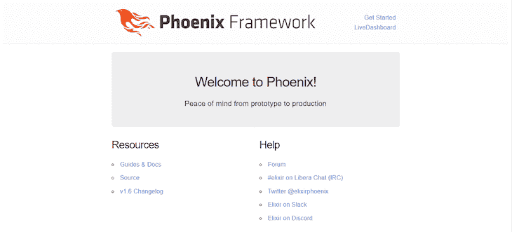
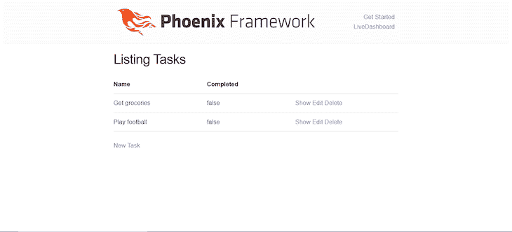
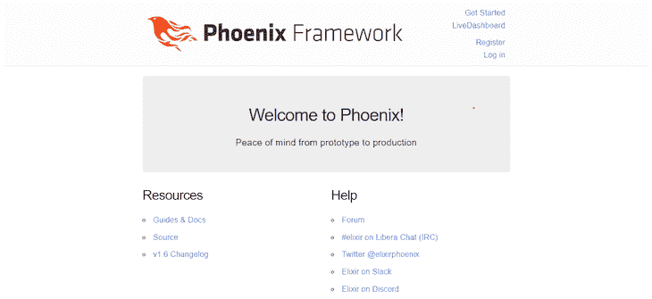
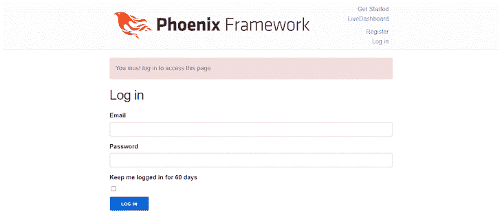

# 通过 Phoenix 认证

> 原文：<https://blog.logrocket.com/phoenix-authentication/>

Phoenix 是一个基于 Elixir 的 web 开发框架，它使用服务器端模型视图控制器(MVC)设计模式。它的实现(组件和结构)可以与其他知名框架相媲美，包括 Ruby on Rails、Node 的 Express.js 和 Python 的 Django。Phoenix 利用了众所周知的 web 开发结构，如果您已经在该领域工作过，那么学习起来很简单。

在本教程中，我们将学习如何使用`phx.gen.auth`生成器向 Phoenix 应用程序添加身份验证。由于其灵活性、安全性以及实现了 Elixir 的最佳实践，所以`phx.gen.auth`生成器被广泛使用。`Phx.gen.auth`包含在 Phoenix 框架中，是向 Phoenix 应用程序添加身份验证的推荐方式。

我们将涵盖:

## 先决条件

要在您的系统上安装 Elixir，请访问 [Elixir 文档](https://elixir-lang.org/install.html)，并按照您的操作系统的安装说明进行操作。

## 凤凰城入门

运行以下命令在您的系统上安装 Phoenix:

```
mix archive.install hex phx_new 

```

上面的命令指示 [Mix](https://elixir-lang.org/getting-started/mix-otp/introduction-to-mix.html) 安装 Phoenix 框架。与其他主流编程语言类似，Elixir 提供了 Mix build 工具来帮助编译、创建和测试应用程序，以及安装、更新和卸载依赖项。如果没有 Mix 这样的工具，使用 Elixir 是不可想象的。

## 创建 Phoenix 应用程序

通过用`phx.new`命令提供`--no-ecto`标志，可以创建一个没有数据库的 Phoenix 应用程序，但是因为我们需要数据持久性，所以我们将使用数据库。本课选择的数据库是 PostgreSQL，Phoenix 应用程序的标准选择。

要安装 PostgreSQL，[参考文档](https://www.enterprisedb.com/downloads/postgres-postgresql-downloads)或者你可以访问这个[教程](https://blog.logrocket.com/build-rest-api-elixir-phoenix/)来使用 Docker 安装和运行:

```
mix phx.new todo_app

```

这里，`todo`是我们希望创建的应用程序的名称。当提示`Fetch and install dependencies? [Yn]`时，选择**是**。在获取依赖项之后，我们还有几个步骤来启动和运行我们的应用程序。

首先，我们必须进入我们新创建的应用程序目录:

```
cd todo_app 

```

## 更新数据库凭据

接下来，我们必须配置我们的数据库，找到`config/dev.exs`，并且
更新下面一行来反映我们的 Postgres 数据库`username`和`password`:

```
username: "postgres",
password: "postgres",

```

然后，运行以下命令创建数据库:

```
mix ecto.create

```

最后，我们可以使用以下命令运行我们的服务器:

```
mix phx.server

```

访问`[http://localhost:4000](http://localhost:4000)`查看您的 Phoenix 应用程序:



## 使用`phx.gen.html`为 HTML 资源生成 MVC

Phoenix 为我们提供了一种为 HTML 资源生成控制器、视图和上下文的方法:

```
mix phx.gen.html Todo Task tasks name:string completed:boolean
```

我们向`phx.gen.html`生成器提供了两个参数，第一个是上下文模块，接下来是模式模块的名称，最后是模式的复数名称(该名称将用作模式表名称)。`name:string`和`completed:boolean`是将在`tasks`表中创建的两个字段。

看终端，可以看到凤凰提供的指令:

首先，我们必须将`resources "/tasks", TaskController`复制到我们的`lib/todo_app_web/router.ex`文件中:

```
defmodule TodoAppWeb.Router do
use TodoAppWeb, :router
...

scope "/", TodoAppWeb do
pipe_through(:browser)
get("/", PageController, :index)
resources "/tasks", TaskController #updated
end
...
```

`resources`代表不同的 HTTP 方法——Phoenix 提供了`resources`,而不是显式地写出每个方法。

然后，我们必须更新我们的数据库，以更新由`phx.gen.html`所做的更改:

```
mix ecto.migrate
```

最后，要访问生成的任务路径，请访问`[http://localhost:4000/tasks](http://localhost:4000/tasks)`:



在上面的截图中，我添加了几个未完成的任务。你可以随意做同样的事情，并尝试一下这个应用程序。Phoenix 为这些生成的资源提供了开箱即用的 CRUD 能力，因此不需要任何额外的代码，我们就可以从数据库中创建、更新和删除任务。

## 使用`phx.gen.auth`验证

Phoenix 提供了一种非常简单的方法，使用`phx.gen.auth`生成器向我们的应用程序添加身份验证。让我们看看如何做到这一点。

在您的终端中，运行:

```
mix phx.gen.auth Accounts User users
```

使用这个命令，用一个模块为`Accounts.User`模式创建一个`Accounts`上下文。最后一个参数是模式模块的复数形式，它创建数据库表名和路由助手。`mix phx.gen.auth`生成器类似于`mix phx.gen.htm``l`生成器，除了它不接受添加到模式中的额外字段列表，并且它生成更多的上下文函数。

查看我们的终端，我们可以看到 Phoenix 已经生成了几个文件，并且还更新了现有的文件。我们稍后将查看其中的一些文件，尤其是`lib/todo_app_web/router.ex`文件，但是让我们快速运行几个命令。

在您的终端中，运行:

```
mix deps.get
```

此命令更新您的应用程序依赖项。我们还需要更新我们的数据库，以反映由`phx.gen.auth`生成器所做的更改。

现在，运行以下命令:

```
mix ecto.migrate
```

如果我们检查浏览器中运行的应用程序，我们可以看到由`phx.gen.auth`生成器生成的`Register`和`Log in`:



在应用程序上注册，您应该会看到一个“用户创建成功”的弹出消息。

## 浏览由`phx.gen.auth`创建的文件

让我们来看看由`phx.gen.auth`创建的一些文件。

位于`lib/todo_app_web/router.ex`的路由器文件已经存在，`phx.gen.auth`生成器只是添加了几行代码:

```
...
## Authentication routes
  scope "/", TodoAppWeb do
    pipe_through [:browser, :redirect_if_user_is_authenticated]
    get "/users/register", UserRegistrationController, :new
    post "/users/register", UserRegistrationController, :create
    get "/users/log_in", UserSessionController, :new
    post "/users/log_in", UserSessionController, :create
    get "/users/reset_password", UserResetPasswordController, :new
    post "/users/reset_password", UserResetPasswordController, :create
    get "/users/reset_password/:token", UserResetPasswordController, :edit
    put "/users/reset_password/:token", UserResetPasswordController, :update
  end

  scope "/", TodoAppWeb do
    pipe_through [:browser, :require_authenticated_user]
    get "/users/settings", UserSettingsController, :edit
    put "/users/settings", UserSettingsController, :update
    get "/users/settings/confirm_email/:token", UserSettingsController, :confirm_email
  end

  scope "/", TodoAppWeb do
    pipe_through [:browser]
    delete "/users/log_out", UserSessionController, :delete
    get "/users/confirm", UserConfirmationController, :new
    post "/users/confirm", UserConfirmationController, :create
    get "/users/confirm/:token", UserConfirmationController, :edit
    post "/users/confirm/:token", UserConfirmationController, :update
  end
...

```

`:require_authenticated_user`和`:redirect_if_user_is_authenticated`称为插头。之后出现的路由遵循它们所声明的规则。

`:require_authenticated_user`插件允许我们保护路由不被未经认证的用户访问，而`:redirect_if_user_is_authenticated`插件允许我们阻止经过认证的用户访问某些路由。

`:require_authenticated_user`和`:redirect_if_user_is_authenticated`插头均来自`lib\todo_app_web\controllers\user_auth.ex`控制器；

```
def redirect_if_user_is_authenticated(conn, _opts) do
    if conn.assigns[:current_user] do
      conn
      |> redirect(to: signed_in_path(conn))
      |> halt()
    else
      conn
    end
  end
  @doc """
  Used for routes that require the user to be authenticated.
  If you want to enforce the user email is confirmed before
  they use the application at all, here would be a good place.
  """
  def require_authenticated_user(conn, _opts) do
    if conn.assigns[:current_user] do
      conn
    else
      conn
      |> put_flash(:error, "You must log in to access this page.")
      |> maybe_store_return_to()
      |> redirect(to: Routes.user_session_path(conn, :new))
      |> halt()
    end

```

## 向我们的`/tasks`路线添加身份验证

目前，我们的`/tasks`路线不要求用户在访问它们之前进行身份验证。如果我们愿意，我们可以将我们的`/tasks`路由分成不同的 HTTP 方法。因此，这一行只有一个`resource`来访问所有方法:

```
resources "/tasks", TaskController
```

与以下内容相同:

```
get "/tasks", TaskController, :index
post "/tasks", TaskController, :create
get "/tasks/new", TaskController, :new
get "/tasks/:id", TaskController, :show
get "/tasks/:id/edit", TaskController, :edit
put "/tasks/:id/update", TaskController, :update
delete "/tasks/:id/delete", TaskController, :delete

```

为了使这些路由要求用户认证，我们所要做的就是将`resources`放在`:require_authenticated_user`插头后面:

```
scope "/", TodoAppWeb do
    pipe_through [:browser, :require_authenticated_user]
    ...
    resources "/tasks", TaskController
  end

```

注销应用程序，然后尝试访问`http:localhost:4000/tasks`路线。您将被重定向到登录路径，并显示一条错误消息:



您只能在登录时访问这些路线。就是这样！我们已经在 Phoenix 应用程序中实现了身份验证。

## 结论

在本教程中，我们学习了如何在 Phoenix 应用程序中实现身份验证，方法是使用`phx.gen.auth`生成器为我们的应用程序生成身份验证，并了解它为我们提供的中间件。希望在这篇教程的帮助下，你可以用 Phoenix 实现更多。

## 使用 [LogRocket](https://lp.logrocket.com/blg/signup) 消除传统错误报告的干扰

[](https://lp.logrocket.com/blg/signup)

[LogRocket](https://lp.logrocket.com/blg/signup) 是一个数字体验分析解决方案，它可以保护您免受数百个假阳性错误警报的影响，只针对几个真正重要的项目。LogRocket 会告诉您应用程序中实际影响用户的最具影响力的 bug 和 UX 问题。

然后，使用具有深层技术遥测的会话重放来确切地查看用户看到了什么以及是什么导致了问题，就像你在他们身后看一样。

LogRocket 自动聚合客户端错误、JS 异常、前端性能指标和用户交互。然后 LogRocket 使用机器学习来告诉你哪些问题正在影响大多数用户，并提供你需要修复它的上下文。

关注重要的 bug—[今天就试试 LogRocket】。](https://lp.logrocket.com/blg/signup-issue-free)