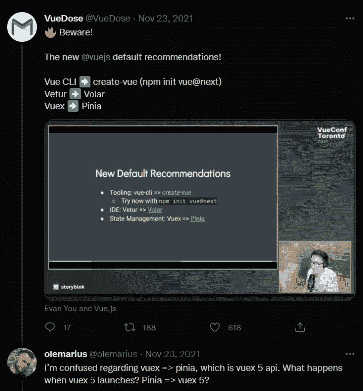

# Pinia vs. Vuex:哪个状态管理库最适合 Vue？- LogRocket 博客

> 原文：<https://blog.logrocket.com/pinia-vs-vuex/>

***编者按:**这篇文章于 2022 年 1 月 25 日更新，包含了关于皮尼亚和 Vue 未来的新闻。你可以在[皮尼亚、Vuex 和 Vue](#future-pinia-vuex-vue) 的未来部分了解更多信息。*

## 介绍

Pinia 是 Vue.js 的一个轻量级状态管理库，最近很受欢迎。它使用 Vue 3 中的新反应系统来构建一个直观的全类型状态管理库。

Pinia 的成功可以归功于其管理存储数据的独特功能(可扩展性、存储模块组织、状态变化分组、多存储创建等)。

另一方面，Vuex 也是一个流行的为 Vue 框架构建的状态管理库，是 Vue 核心团队推荐的状态管理库。Vuex 高度关注应用程序可伸缩性、开发人员工效学和信心。它基于与 Redux 相同的 flux 架构。

在本文中，我们将对 Pinia 和 Vuex 进行对比。我们将分析两个框架的设置、社区优势和性能。我们还将了解 Vuex 5 与 Pinia 2 相比的新变化。

本文中使用的代码片段基于 Vue 3 组合 API。

## 设置

### Pinia 设置

Pinia 很容易上手，因为它只需要安装和创建一个商店。

要安装 Pinia，您可以在终端中运行以下命令:

```
yarn add [email protected]
# or with npm
npm install [email protected]

```

该版本与 Vue 3 兼容。如果你正在寻找与 Vue 2.x 兼容的版本，检查[的`v1`分支](https://github.com/posva/pinia/tree/v1)。

Pinia 是围绕 Vue 3 组合 API 的包装器。因此，你不必把它初始化成一个插件，除非你需要 Vue devtools 支持、SSR 支持和 webpack 代码分割:

```
//app.js
import { createPinia } from 'pinia'
app.use(createPinia())

```

在上面的代码片段中，您将 Pinia 添加到 Vue.js 项目中，以便可以在代码中使用 Pinia 的全局对象。

要创建一个存储，您可以用一个对象调用`defineStore`方法，该对象包含创建一个基本存储所需的状态、动作和 getters:

```
// stores/todo.js
import { defineStore } from 'pinia'

export const useTodoStore = defineStore({
  id: 'todo',
  state: () => ({ count: 0, title: "Cook noodles", done:false })
})

```

### Vuex 设置

Vuex 也很容易设置，需要安装和创建一个商店。

要安装 Vuex，您可以在终端中运行以下命令:

```
npm install [email protected] --save
# or with yarn
yarn add [email protected] --save

```

要创建一个存储，您可以用一个对象调用`createStore`方法，该对象包含创建一个基本存储所需的状态、动作和 getters:

```
//store.js
import {createStore} from 'vuex'
const useStore = createStore({
  state: {
    todos: [
      { id: 1, title: '...', done: true }
    ]
  },
  getters: {
    doneTodos (state) {
      return state.todos.filter(todo => todo.done)
    }
  }
})

```

要访问 Vuex 全局对象，需要将 Vuex 添加到根 Vue.js 项目文件，如下所示:

```
//index.js
import { createApp } from 'vue'
import App from './App.vue'
import {useStore} from './store'
createApp(App).use(store).mount('#app')

```

## 使用

Vuex 和 Pinia 进入商店的方式略有不同。

### 皮尼亚用法

使用 Pinia，可以按如下方式访问商店:

```
export default defineComponent({
  setup() {
    const todo = useTodoStore()

    return {
      // gives access only to specific state
      state: computed(() => todo.title),
    }
  },
})

```

请注意，在访问其属性时，store 的 state 对象被省略。

### Vuex 用法

使用 Vuex，可以按如下方式访问商店:

```
import { computed } from 'vue'
export default {
  setup () {
    const store = useStore()

    return {
      // access a state in computed function
      count: computed(() => store.state.count),

      // access a getter in computed function
      double: computed(() => store.getters.double)
    }
  }
}

```

## 社区和生态系统的力量

在撰写本文时，Pinia 只有一个很小的社区，这导致对堆栈溢出的贡献和解决方案很少。

由于 Pinia 从去年年初开始流行，到目前为止，它的社区正在快速发展。希望 Pinia 上很快会有更多的贡献者和解决方案。

Vuex 是 Vue.js 核心团队推荐的状态管理库，它有一个很大的社区，主要贡献来自核心团队成员。Vuex 错误的解决方案在堆栈溢出上很容易找到。

## 学习曲线和文档

这两个状态管理库都很容易学习，因为它们在 YouTube 和第三方博客上有很好的文档和学习资源。对于以前有过使用 Redux、MobX、反冲等 Flux 架构库经验的开发人员来说，他们的学习曲线更容易。

这两个库的文档都很棒，并且对有经验的和新的开发人员都很友好。

## GitHub 评级

在撰写本文时，Pinia 有两个主要版本:v1 和 v2，其中 v2 在 GitHub 上的[超过 1.6k 星。鉴于它最初于 2019 年发布，而且相对较新，它无疑是 Vue.js 生态系统中增长最快的状态管理库之一。](https://github.com/posva/pinia/)


同时，从 Vuex 创建之日到现在，Vuex 库已经发布了五个稳定版本。虽然 v5 还处于实验阶段，但 Vuex 的 v4 是迄今为止最稳定的版本，在 GitHub 上拥有[约 26.3k 颗星。](https://github.com/vuejs/vuex/releases)


## 表演

Pinia 和 Vuex 都非常快，在某些情况下，与 Vuex 相比，使用 Pinia 时，您的 web 应用程序会更快。这种性能提升可以归功于 Pinia 的极轻重量。皮尼亚重约 1KB。

尽管 Pinia 是在 Vue devtools 支持下构建的，但一些功能如时间旅行和编辑仍然不受支持，因为 Vue devtools 没有公开必要的 API。当开发速度和调试对您的项目更重要时，这是值得注意的。

## 比较 Pinia 2 和 Vuex 4

Pinia [将这些与 Vuex 3 和 4](https://pinia.esm.dev/introduction.html#rfcs) 进行比较:

*   > 突变不再存在。他们经常被认为极其罗嗦。他们最初带来了 devtools 集成，但这不再是一个问题。
    > 
    > 

*   > 无需创建定制的复杂包装器来支持 TypeScript，一切都是类型化的，API 的设计方式尽可能利用 TS 类型推断。
    > 
    > 

这些是 Pinia 在比较其状态管理库和 Vuex 时得出的其他见解:

对比 Pinia 2(目前在 alpha)和 Vuex，可以推断出 Pinia 领先于 Vuex 4。

Vue.js 核心团队为 Vuex 5 提供了一个开放的 RFC，类似于 Pinia 使用的 RFC。目前，Vuex 通过 RFC 收集尽可能多的社区反馈。希望 Vuex 5 的稳定发布会胜过 Pinia 2。

[根据 Pinia 的创造者](https://pinia.esm.dev/introduction.html) (Eduardo San Martin Morote)的说法，他也是 Vue.js 核心团队的一员，并积极参与 Vuex 的设计，Pinia 和 Vuex 的相似之处多于不同之处:

> 皮尼亚试图尽可能接近 Vuex 的哲学。它旨在测试 Vuex 下一次迭代的提案，这是一个成功，因为我们目前有一个针对 Vuex 5 的开放 RFC，其 API 与 Pinia 使用的 API 非常相似。我个人对这个项目的意图是重新设计使用全球商店的体验，同时保持 Vue 的平易近人的哲学。我让 Pinia 的 API 尽可能接近 Vuex，因为它一直在向前发展，以便将来人们可以轻松地迁移到 Vuex，甚至融合两个项目(在 Vuex 下)。

虽然皮尼亚足以取代 Vuex，但取代 Vuex 并不是它的目标。但后来它变得太好了，以至于 Vue.js 核心团队决定让它成为 Vuex 5。

## Vuex 和 Pinia 的利弊

### Vuex 前进

*   支持调试功能，如时间旅行和编辑
*   适合大规模和高复杂性的 Vue.js 项目

### Vuex Cons

*   从 Vue 3 开始，getter 的结果不像 computed 属性那样被缓存
*   Vuex 4 有一些与类型安全相关的问题

### 皮尼亚普罗斯

*   完整的类型脚本支持:与在 Vuex 中添加[类型脚本相比，添加类型脚本更容易](https://blog.logrocket.com/vue-typescript-tutorial-examples/#usingvuexwithtypescript)
*   极轻(重约 1KB)
*   商店的动作作为常规函数调用被分派，而不是使用 Vuex 中常见的`dispatch`方法或`MapAction`辅助函数
*   支持多个商店
*   支持 Vue devtools、SSR 和 webpack 代码分割

### 皮尼亚 Cons

*   不支持调试功能，如时间旅行和编辑

## 何时使用 Pinia，何时使用 Vuex

从我个人的经验来看，由于 Pinia 的重量较轻，适合中小规模的应用。它也适用于低复杂度的 Vue.js 项目，因为仍然不支持一些调试功能，如时间旅行和编辑。

对中小型 Vue.js 项目使用 Vuex 是大材小用，因为它的重量极大地降低了性能。因此， [Vuex 适合大规模、高复杂度的 Vue.js 项目](https://blog.logrocket.com/do-you-really-need-vuex/)。

## 皮尼亚、Vuex 和 Vue 的未来

在撰写本文时，Pinia 已经是 Vuex 州管理库的顶级竞争者，有足够的资格取代 Vuex 成为 Vue 州管理库的官方。

根据尤雨溪最近关于皮尼亚的推文:


This means that Pinia has a dominant position by Vue.js developers and the core team’s acceptance although it’s not officially announced.

尤雨溪最近关于皮尼亚的推文是对@olemarius 关于推出 Vuex 5 作为皮尼亚的影响的不确定性的回复。


Since the Vue core team has decided to make Pinia the new Vuex 5, we should be anticipating an announcement with Pinia as the official state management library for Vue applications.

## 结论

在本文中，我们对 Vuex 和 Pinia 进行了比较，并强调了它们的最佳特性、文档、社区优势、学习曲线，以及在撰写本文时在两个库中发现的一些缺陷。

Vuex 4 和 Pinia 在大多数方面是相似的，它们可以用来完成相同的任务。

总的来说，一个并不比另一个更好——它们都达到了预期的目标。这完全取决于您的使用案例和偏好。

此外，请记住，Pinia 的创建者已经声明，Pinia 的目标不是取代 Vuex。更确切地说，它的目标是让开发者将来更容易迁移到 Vuex，甚至融合两个项目(在 Vuex 下)。

## 像用户一样体验您的 Vue 应用

调试 Vue.js 应用程序可能会很困难，尤其是当用户会话期间有几十个(如果不是几百个)突变时。如果您对监视和跟踪生产中所有用户的 Vue 突变感兴趣，

[try LogRocket](https://lp.logrocket.com/blg/vue-signup)

.

[](https://lp.logrocket.com/blg/vue-signup)[https://logrocket.com/signup/](https://lp.logrocket.com/blg/vue-signup)

LogRocket 就像是网络和移动应用程序的 DVR，记录你的 Vue 应用程序中发生的一切，包括网络请求、JavaScript 错误、性能问题等等。您可以汇总并报告问题发生时应用程序的状态，而不是猜测问题发生的原因。

LogRocket Vuex 插件将 Vuex 突变记录到 LogRocket 控制台，为您提供导致错误的环境，以及出现问题时应用程序的状态。

现代化您调试 Vue 应用的方式- [开始免费监控](https://lp.logrocket.com/blg/vue-signup)。