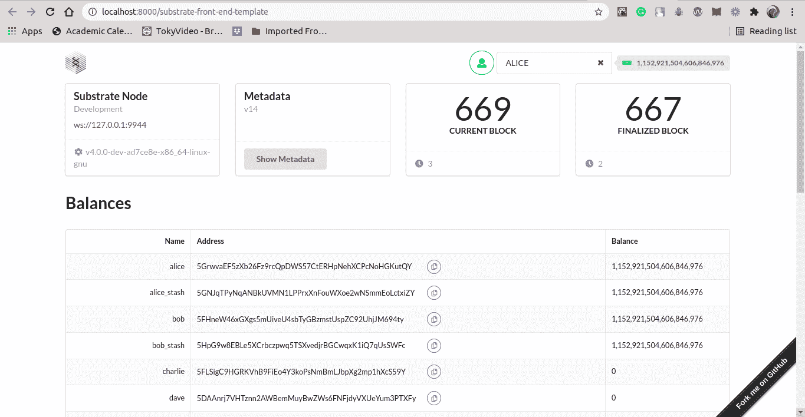

# 波尔卡多特区块链应用程序开发和部署指南

> 原文：<https://blog.logrocket.com/polkadot-blockchain-app-development-deployment/>

构建区块链应用程序需要大量的资源，这导致了更长的开发过程，并且需要来自不同编程领域(如密码学、数据库管理等)的专家团队的输入。Polkadot 的目标是减少这些麻烦，简化区块链开发。

## 什么是波尔卡多？

波尔卡多特是一个区块链互通网络。作为一种网络协议，它为自定义区块链应用程序提供了一个平台，以无信任的方式传输包括价值在内的消息，共享其独特的功能，并启动任何数据或资产的跨区块链传输。

基于 Polkadot 构建的自定义区块链(也称为 parachains)可以使用 Polkadot 提供的共享安全性，以信任最小化的方式执行链间事务。这个协议催生了区块链的互联网络。

## 什么是副链？

Polkadot 上应用程序的结构意味着每个应用程序可以并行处理事务，因此得名 [parachain](https://polkadot.network/parachains/) 。

副链可以是全局一致的区块链或特定于应用程序的数据结构。Parachains 可以在 Polkadot 网络上独立运行，并实现自己的治理、经济等。

Polkadot 没有规定副链如何决定处理它们的交易。但是它确实通过[跨共识消息(XCM)格式](https://polkadot.network/blog/xcm-the-cross-consensus-message-format/)为这些独立的应用程序提供了一种通信方式。

副链由[中继链](https://polkadot.network/technology/)连接，中继链也提供共享安全性、共享安全性，并有助于网络的可扩展性。

## 什么是副线程？

Polkadot 提供的共享安全不是免费安全；副链与网络建立这种联系，以保护波尔卡多特。

Parathreads 可以访问 Polkadot 上与 parachains 相同的吞吐量、API 和功能，但是这些服务是按使用量付费的。这允许更多的基础设施链，并提高了可组合性。

## 什么是基质？

构建区块链应用程序可能需要大量资源。一个区块链项目可以有很好的特性和现实世界的价值，但是如果没有合适的资源来资助它的开发，它就不会起步。

[底物](https://substrate.io/)是通用的[区块链框架](https://blog.logrocket.com/top-blockchain-development-frameworks/)。因此，它为构建区块链应用程序和网络提供了即插即用的组件。它的模块化和可插拔库使您能够根据需要实现签名、共识机制和链的其他部分。Substrate 的核心是它的可组合特性，在 Polkadot 网络上构建应用程序时可以驱动定制。

Polkadot 作为一个网络，为基质链提供了相互发送消息的协议。您可以通过拍卖过程在 Polkadot 网络上托管您的基质链，但您的基质链不一定必须在 Polkadot 网络上托管，除非您想利用其功能。

## 开发和部署基板区块链应用程序

构建区块链应用程序时，以下重要组件充当核心层:

*   数据库层
*   事务队列
*   网络层
*   块创作
*   状态转移函数

Substrate 提供了在创建区块链时简化开发过程所需的核心组件。这使您能够根据项目的需要专注于构建特定的功能或定制。

您可以使用现成的、可工作的、基于基底的节点模板轻松设置区块链应用程序。

### 先决条件

要跟随本教程，您需要:

*   Rust 本地安装和配置，以设置开发环境
*   软件编程和终端使用的基本知识

### 步骤 1:用衬底建立一个区块链应用程序

为了建立一个开发环境，我们将使用现有的模板。基底模板提供了一个工作开发环境。这些模板是初学者工具包，在基础上构建时可以添加更多功能和定制。

```
git clone https://github.com/substrate-developer-hub/substrate-node-template

```

运行以下命令添加 Rust 的 Nigtly 版本:

```
rustup update nightly
rustup target add wasm32-unknown-unknown --toolchain nightly

```

接下来，将目录切换到`./substrate-node-template`文件夹，并签出到存储库中的`latest`版本:

```
cd substrate-node-template
git checkout latest

```

该存储库包含 Rust 文件，可以根据特定于区块链项目的特性(定制)进行相应的修改。

在项目中，让我们使用以下命令编译并运行节点模板:

```
$ cargo build --release

2021-12-16 00:36:30 Running in --dev mode, RPC CORS has been disabled.    
2021-12-16 00:36:30 Substrate Node    
...
2021-12-16 00:36:33 📦 Highest known block at #0    
2021-12-16 00:36:33 〽️ Prometheus exporter started at 127.0.0.1:9615    
2021-12-16 00:36:33 Listening for new connections on 127.0.0.1:9944\.    
2021-12-16 00:36:36 🙌 Starting consensus session on top of parent 0x4bbcc70ccccc322d314a5df12a814c28d40e6879b7b930df5ac5a50fe4be4c30    
2021-12-16 00:36:36 🎁 Prepared block for proposing at 1 (1 ms) [hash: 0x18f1c7bf91a1544c9a0e35ac08c8f036b4cb2f8d8297233fffadb94022b982a7; parent_hash: 0x4bbc…4c30; extrinsics (1): [0x6458…325e]]    
2021-12-16 00:36:36 🔖 Pre-sealed block for proposal at 1\. Hash now 0xf10d170d82617ff5df6752dc911d3483badf34b005c8c48a46aeb6b708c915b2, previously 0x18f1c7bf91a1544c9a0e35ac08c8f036b4cb2f8d8297233fffadb94022b982a7\.    
2021-12-16 00:36:36 ✨ Imported #1 (0xf10d…15b2)    
2021-12-16 00:36:38 💤 Idle (0 peers), best: #1 (0xf10d…15b2), finalized #0 (0x4bbc…4c30), ⬇ 0 ⬆ 0    
...  
2021-12-16 00:36:42 🔖 Pre-sealed block for proposal at 2\. Hash now 0x409138fda4f59dc093dce60fefbaca31c354ce18cef1bbea6f69a5009af6e0f4, previously 0x484e81ea10a15f04a640a595cb51d41eecc05919b4a16839852ba4d8a69440e1.
...

```

在上面的终端输出中，我们的区块链应用程序产生了新的块，并就它们所描述的状态达成了一致。

接下来，让我们设置一个前端应用程序，与终端上当前运行的区块链进行交互。打开一个新的终端会话，并运行以下命令:

```
git clone https://github.com/substrate-developer-hub/substrate-front-end-template

```

现在，让我们将目录切换到新创建的文件夹`substrate-front-end-template`，并为 UI 安装必要的依赖项:

```
yarn install

```

一旦我们成功安装了所有需要的依赖项，我们就可以使用`yarn start`命令开始安装了:



上图显示了我们所连接的链的当前信息，包括当前块和最终块。

在测试我们的应用程序的基本 UI 结构中，我们有示例帐户，其中一些有可用的资金。使用网页中的`Transfer`组件，我们可以复制一个帐户的地址，将其粘贴到 to 输入字段，并将资金转移到该帐户。

我们也可以决定添加更多的组件，称为托盘，以增加更多的功能。或者，我们可以构建并发布超出本教程范围的定制托盘。使用托盘交互器，我们可以将托盘添加到节点模板中。

### 步骤 2:部署您的区块链应用程序

为了测试我们的区块链应用程序，我们需要启动一个类似 Polkadot 的链(中继链)，然后使用本地 [testnet 环境](https://blog.logrocket.com/top-4-ethereum-testnets-testing-smart-contracts/)将其连接到中继链。

Polkadot 上有中继链可以作为测试网。我们将使用 Rococo，一个流行的 Polkadot parachain testnet，来启动一个 parachain testnet 来测试我们的应用程序。洛可可网络使用权威证明[共识机制](https://blog.logrocket.com/guide-blockchain-consensus-protocols/)。你也可以使用 [Westend](https://polkadot.network/blog/westend-introducing-a-new-testnet-for-polkadot-and-kusama/) testnet 在 Polkadot 上启动和测试一个 parachain，但是对于本教程，我推荐使用洛可可。

我们将使用一个基于积云的基底节点来建立一个副链，因为洛可可将波尔卡多与积云结合在一起。基于积云的衬底节点也与上面的`substrate-node-template`项目相同，只需要做一些修改就可以在洛可可上注册为副链或副线程。

要在 Polkadot 网络上部署 parachain，您需要通过拍卖过程获得 parachain 插槽，这更像是在 Polkadot 上启动新的 parachain 项目的提议。在 [Polkadot 文档](https://wiki.polkadot.network/docs/learn-auction)中可以找到 Polkadot 上一个位置的投标过程。

## 结论

在本教程中，我们介绍了在 Polkadot 网络上构建区块链应用程序的相关概念，如副链、副线程、中继链和底层框架。

你应该知道开发和主持一个区块链或区块链网络的基本技能，以及为处理特定任务而设计的应用程序。这些项目从提供真实世界数据的 Oracle 区块链，到 Polkadot 网络中的其他 parachains，到 DeFi 应用程序网络，再到 Polkadot 社区中其他区块链平台的桥接。

您可以在波尔卡多特区块链上构建的项目列表是无止境的。Polkadot 的互操作性质为所有这些项目提供了一个无缝交互的公共基础，创建了一个新的无边界互联的 [Web3。](https://blog.logrocket.com/tag/web3/)

## 加入像 Bitso 和 Coinsquare 这样的组织，他们使用 LogRocket 主动监控他们的 Web3 应用

影响用户在您的应用中激活和交易的能力的客户端问题会极大地影响您的底线。如果您对监控 UX 问题、自动显示 JavaScript 错误、跟踪缓慢的网络请求和组件加载时间感兴趣，

[try LogRocket](https://lp.logrocket.com/blg/web3-signup)

.

[](https://lp.logrocket.com/blg/web3-signup)[https://logrocket.com/signup/](https://lp.logrocket.com/blg/web3-signup)

LogRocket 就像是网络和移动应用的 DVR，记录你的网络应用或网站上发生的一切。您可以汇总和报告关键的前端性能指标，重放用户会话和应用程序状态，记录网络请求，并自动显示所有错误，而不是猜测问题发生的原因。

现代化您调试 web 和移动应用的方式— [开始免费监控](https://lp.logrocket.com/blg/web3-signup)。