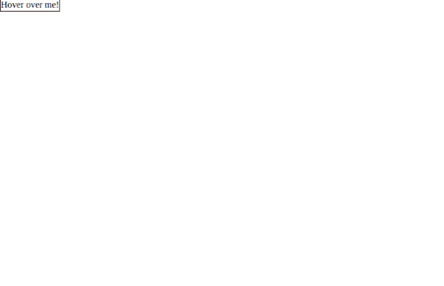
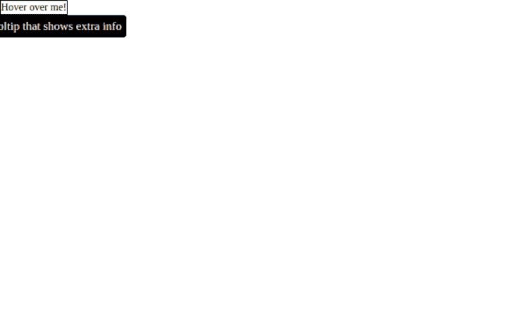
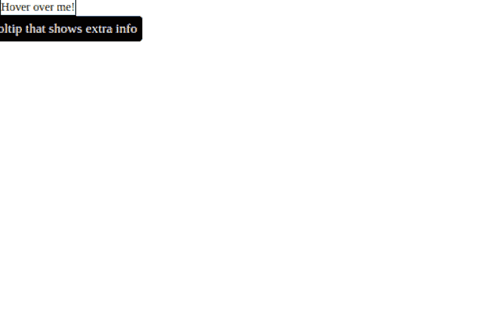
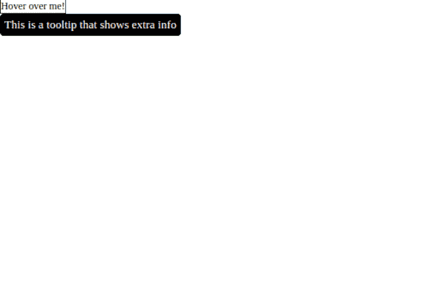

# Popper vs .浮动 UI 

> 原文：<https://blog.logrocket.com/popper-vs-floating-ui/>

CSS `float`属性指定一个元素应该向左、向右浮动，还是根本不浮动，并允许我们获取一个元素，将其从页面的正常流程中移除，并将其放置在其父元素的左侧或右侧。

发生这种情况时，页面上的所有其他元素都会围绕浮动元素流动。然而今天，我们有工具可以更容易地定位这些浮动元素(在本例中，称为 poppers ),同时智能地将它们保留在视图中。

虽然有许多定位工具和库，但浮动 UI 和 Popper 仍然是最受欢迎和使用最多的。因此，需要回答这些问题:

1.  哪个图书馆最好用？
2.  哪个库提供更多支持？
3.  哪个库比较好用？

在本文中，我们将研究这两个库，它们的不同之处，以及哪一个最适合使用。

## 波普简介

在 2006 年创建 [Popper 之前，](https://popper.js.org/) [Tether 是定位浮动元素的开源解决方案](http://tether.io/)，但被 Popper 取代。

Popper 是一个轻量级库，旨在提供一个可靠且可扩展的定位引擎，以确保所有 popper 元素都定位在正确的位置。这些 popper 元素包括工具提示、弹出窗口、下拉菜单、菜单等等。

Popper 还关注兼容性、包大小和更现代的 API。

## 浮动用户界面简介

[浮动 UI 是 Popper](https://floating-ui.com/) 的升级；它是像 Popper v2 和 Tether 这样的库的演变，具有更现代的 API。

Federico Zivolo，Popper 的创造者和浮动 UI 的共同维护者，[注意到](https://opencollective.com/floating-ui/updates/popper-is-evolving-into-floating-ui) [即使 Popper v2 可能仍然可用和工作，浮动 UI 被创建来取代它](https://opencollective.com/floating-ui/updates/popper-is-evolving-into-floating-ui)。

浮动 UI 比 Popper 更好的一个明显因素是，虽然 Popper 只在使用 DOM 的 web 上运行，但浮动 UI 支持 web、React Native、Canvas 等。

既然浮动 UI 是对 Popper 的升级，那就让我们来看看它们的不同之处。

## 为什么不用纯 CSS？

在我们深入探讨浮动 UI 和 Popper 之间的区别之前，您可能想知道为什么您应该学习如何使用一个新工具来处理您的纯 CSS。

虽然你是正确的——你可以使用纯 CSS 来做 Popper 和浮动 UI 可以做的事情——但使用纯 CSS 而不是使用浮动 UI 或 Popper 有一些缺点。

### 不要翻动

必要时，普通的 CSS 弹出器不会翻转到[不同的位置来更好地适应视图中的](https://blog.logrocket.com/bidirectional-css-centering-complete-guide/)。您可以使用 JavaScript 转换弹出器来实现这一点，但是您不能仅使用 CSS 来实现这一点。

弹出器和浮动 UI 会自动翻转弹出器以尽可能适合视图。使用浮动 UI，让我们看看如何自动翻转弹出窗口。

在 React 中，将此代码添加到 App.js 文件中；`paragraph`将是我们的参考元素，而`tooltip`将是我们的弹出器:

```
// App.js

import React from 'react';
import { computePosition, flip } from '@floating-ui/dom';
import './style.css';

const App = () => {
const paragraph = document.querySelector('.paragraph');
const tooltip = document.querySelector('.tooltip');
computePosition(paragraph, tooltip, {
    placement: 'top',
    middleware: [ flip() ]
}).then(({ x, y }) => {
    Object.assign(tooltip.style, {
       left: `${x}px`,
       top: `${y}px`
    });
});
    return (
        <div>
            <p className="paragraph"> Hover over me! </p>
            <div className="tooltip">
                This is a tooltip that shows extra info
            </div>
        </div>
    );
};
export default App;

```

在一个`style.css`文件中，添加以下代码:

```
// style.css

body {
    margin: 0;
    padding: 0;
    box-sizing: border-box;
}
.paragraph {
    margin: 60px 0 0 60px;
    font-size: 14px;
    position: absolute;
}
.tooltip {
    background: black;
    color: white;
    font-size: 16px;
    padding: 6px;
    border-radius: 5px;
    pointer-events: none;
    position: absolute;
}

```

浮动 UI 有一个叫`flip`的中间件，当它在我们的视口之外时，它会自动将 popper 放置平移或更改到相反的轴或方向，所以我们不需要自己手动更改。

当弹出器位于参考元素的顶部或底部时，使用`Flip()`。

这意味着，如果我们将弹出器放置在引用元素的顶部，当引用元素上方没有空间显示弹出器时，浮动 UI 会自动将位置更改为底部，反之亦然。

这是我们添加`Flip()`之前的应用程序:



然后，这里是我们添加`Flip()`后的:



### 剪裁和溢出问题

不会阻止纯 CSS 弹出器溢出剪辑边界，如视口。如果它们靠近边缘，它们将被部分切断或溢出，因为没有动态定位逻辑。

但是，当使用 popper 和浮动 UI 时，您的 popper 将始终定位在正确的位置，而无需手动调整，因此确保 Popper 始终保持在视口内。

与垂直工作的`Flip()`不同，`Shift()`沿 x 轴水平工作。这将始终确保弹出器不会溢出我们的视口。

要从浮动 UI 包导入`Shift()`,添加以下内容:

```
// App.js

import { computePosition, shift } from '@floating-ui/dom';

computePosition(paragraph, tooltip, {
    middleware: [ shift() ]
})

```

这是我们添加`Shift()`之前的应用程序:



然后用`Shift()`补充道:



### 开发周期较慢

当使用纯 CSS 定位 popper 元素时，必须仔细放置它们以考虑所有屏幕大小上的溢出，并正确定位在引用元素上，这可能很耗时。

使用 Popper 和浮动 UI，您可以将元素放在任何地方，它们将正确定位，而无需考虑不同的屏幕大小、布局等。

这大大加快了开发时间，因为工作被自动卸载到 Popper 和浮动 UI。

## 比较浮动 UI 和 Popper

### 跨平台功能

如前所述，浮动 UI 是跨平台的。虽然 Popper 只支持 web，但浮动 UI 通过正确的接口逻辑支持 mobile、Canvas 和 WebGL。事实上，浮动 UI 可以在任何 JavaScript 环境下运行。

### 库大小

Popper 是一个轻量级的库，也就是说它很小，只有 3kb 左右。另一方面，浮动 UI 只有 600 字节，这使得它的大小更小。

### 可摇动的树

树抖动是在捆绑生产的过程中从捆绑包中删除未使用的代码。

默认情况下，Popper 不是可树摇动的。为了利用摇树功能，您必须使用 [Popper Lite](https://popper.js.org/docs/v2/#popper-lite-tree-shaking) :

```
import { createPopper } from "@popperjs/core/lib/popper-lite"

```

默认情况下，浮动用户界面是模块化的，因此它是可树摇动的。此外，如果你不想使用新功能，它们就会被树摇走。

### 安置

“放置”是一个显示弹出器放置位置的选项，这意味着弹出器可以放置在参考元素的顶部、底部、左侧或右侧。

自动放置会自动将弹出器放置在有更多空间的一侧，弹出器提供自动放置作为放置选项之一，而浮动 UI 提供它作为修改器:

```
// Popper
import { createPopper } from "@popperjs/core"

createPopper(referenceElement, floatingElement, {
    placement: 'auto'
})

// Floating UI
import { computePosition, autoPlacemnt } from "@floating-ui/dom"

computePosition(referenceElement, floatingElement, {
    middleware: [ autoPlacement()]
})

```

### 总体特征

浮动 UI 支持比 Popper 更多的特性，比如`size`和`inline`中间件。`size`中间件改变浮动元素的大小，确保它不会溢出可用空间。这意味着浮动元素将始终适合可用空间:

```
import { computePosition, size } from '@floating-ui/dom';

computePosition(referenceElement, floatingElement, {
    middleware: [ size({ padding: 5 })]
})

```

`inline`中间件允许浮动元素定位在`inline`参考元素上。当参考元素跨越另一条线时，`inline`中间件允许浮动元素正确定位在`inline`参考元素上。

### 改进的可扩展性

Popper 的构建考虑到了可扩展性，但是编写修饰符仍然很困难，因为您需要检查其他修饰符的数据来编写正确的逻辑。

要在 Popper 中编写偏移修改器，我们需要执行以下操作:

```
// Popper
import { createPopper } from "@popperjs/core"

createPopper(referenceElement, floatingElement, {
    placement: "top",
    modifiers: [{
        name: "offset",
        options: {
            offset: [0, 7]
        }
    }]
})

```

要编写另一个类似`flip`的修饰符，在编写`flip`修饰符之前，我们必须先检查`offset`的数据:

```
// Popper
import { createPopper } from "@popperjs/core"

createPopper(referenceElement, floatingElement, {
    placement: "top",
    modifiers: [{
        name: "offset",
        options: {
            offset: [0, 7]
        }
    }, name: "flip",
       options: {
            fallbackPlacements: ["top", "bottom"]
        }
    ]
})

```

使用浮动 UI，编写修饰符更容易，因为您只需要适当地安排中间件，因为您控制了中间件数组的顺序，使其更具可扩展性:

```
// Floating UI
import { computePosition, shift, flip, offset } from "@floating-ui/dom"

computePosition(refrenceElement, floatingElement, {
    middleware: [ offset(), flip(), shift() ]
})

//Note: Offset must always be at the beginning of the array while hide and arrow must always be at the end

```

### 默认情况下为强类型

浮动 UI[是用 TypeScript](https://blog.logrocket.com/whats-new-typescript-4-5/) 构建的，因此它利用了 TypeScript 的优点，比如可读性、类型检查、修饰符的可预测性等等。

然而，Popper 是用 Flow 构建的，默认情况下是松散类型的，这意味着修饰符没有严格的类型检查。这意味着修饰符的数据类型错误不会在早期被发现，除非是在运行时，这使得它容易出错。

TypeScript 检查数据类型并找出发生变化的数据类型中的错误。Popper 不是这样构建的，所以没有提前检查修改器类型。这样做的问题是，您只能在运行时/执行时发现错误。

### 可预测性

由于浮动 UI 是用 TypeScript 编写的，所以它比 Popper 更容易预测。

这意味着一切都保持最初定义的样子；中间件在默认情况下是不启用的，您不需要预先配置任何中间件，而是可以在需要时添加它们，这与 Popper 中的中间件在默认情况下是启用的不同。

浮动 UI 和 Popper 提供了类似于`offset`、`arrow`、`shift`、`flip`等中间件。要在浮动 UI 中使用这些中间件，您必须导入并使用它们，因为它们在默认情况下是不启用的:

```
// Floating UI
import { computePosition, shift, flip, offset } from "@floating-ui/dom"

computePosition(refrenceElement, floatingElement, {
    middleware: [ offset(), flip(), shift() ]
})

```

然而，在 Popper 中，这些中间件已经默认启用:

```
// Popper
import { createPopper } from "@popperjs/core"

createPopper(referenceElement, floatingElement, {
    modifiers: [{
        name: "offset",
        options: {
            offset: [0, 7]
        }
    }]
})

```

### 未来可用性

Popper 正处于低维护模式，这意味着维护频率将很低，所以目前还不清楚是否会在不久的将来添加新功能。

然而，在浮动 UI 方面已经做了很多工作，以使它成为定位领域中最好、最容易使用的解决方案。

## 结论

我们已经看到了为什么使用像浮动 UI 和 Popper 这样的库来定位我们的浮动元素比仅仅使用普通的 CSS 要好。

浮动 UI 是 Popper v2 的进化，用来取代 Popper，使其更具跨平台兼容性。遗憾的是，关于浮动 UI 的教程很少，甚至没有视频，所以只有文档可以用来学习如何使用它。

然而，Popper 已经使用了相当长的时间，因此如果您遇到问题，需要更多的教程和社区支持。

然而，对于您的用例，您应该选择浮动 UI，因为它提供了更多的优势。它不仅易于使用，而且可以与 React、Vue 甚至普通的 JavaScript 一起使用，在 web 上定位浮动元素。您还可以将它与 React Native 一起使用，以在 mobile 上定位浮动元素。

谢谢。

## 你的前端是否占用了用户的 CPU？

随着 web 前端变得越来越复杂，资源贪婪的特性对浏览器的要求越来越高。如果您对监控和跟踪生产环境中所有用户的客户端 CPU 使用、内存使用等感兴趣，

[try LogRocket](https://lp.logrocket.com/blg/css-signup)

.

[](https://lp.logrocket.com/blg/css-signup)[https://logrocket.com/signup/](https://lp.logrocket.com/blg/css-signup)

LogRocket 就像是网络和移动应用的 DVR，记录你的网络应用或网站上发生的一切。您可以汇总和报告关键的前端性能指标，重放用户会话和应用程序状态，记录网络请求，并自动显示所有错误，而不是猜测问题发生的原因。

现代化您调试 web 和移动应用的方式— [开始免费监控](https://lp.logrocket.com/blg/css-signup)。