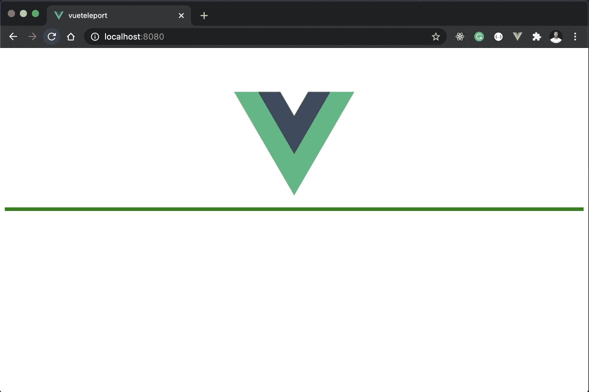
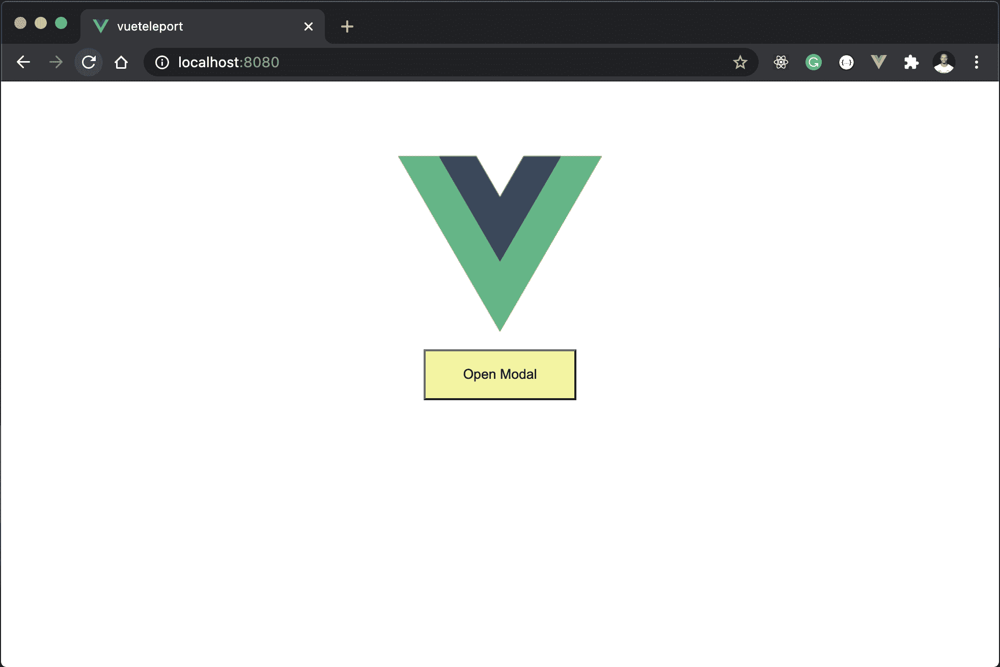
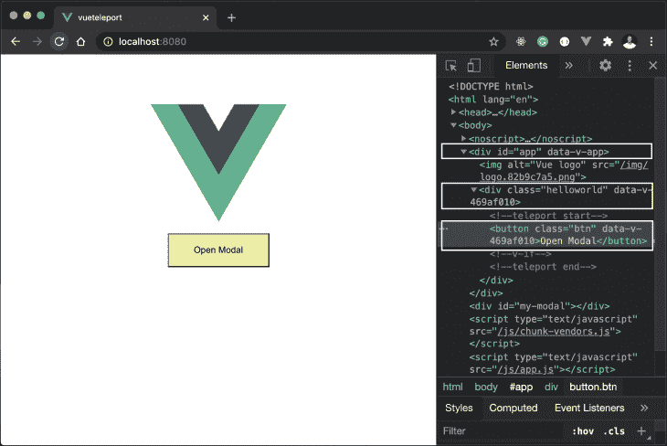
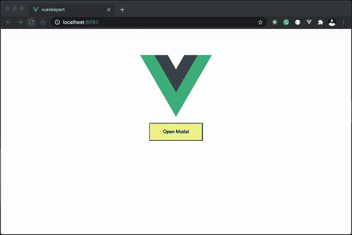
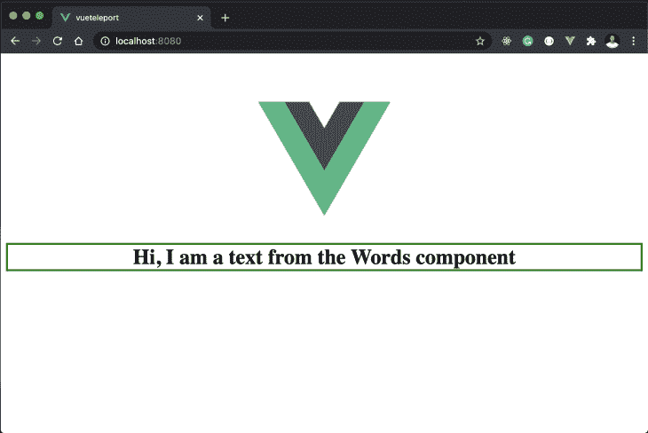
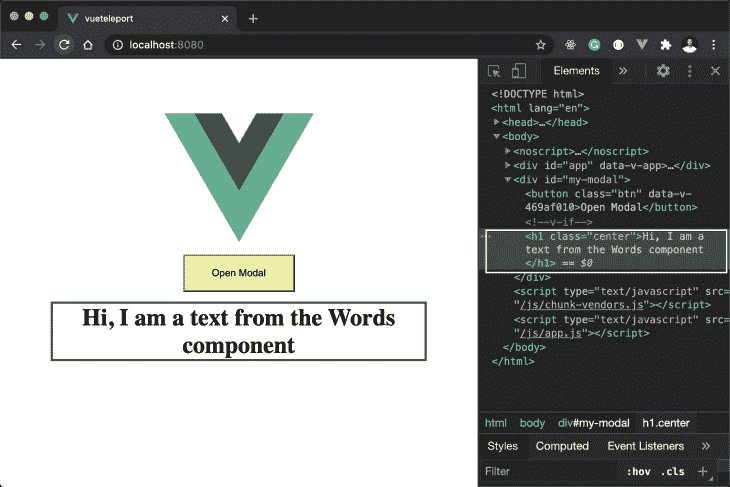

# 用 Vue 3 Teleport - LogRocket 博客定位元素

> 原文：<https://blog.logrocket.com/positioning-elements-with-vue-3-teleport/>

Vue 3 有一个令人兴奋的新功能，叫做[瞬移](https://v3.vuejs.org/guide/teleport.html#teleport)。在 Vue 3 的早期阶段，这个功能被称为*门户*，但 Vue 团队最终决定将其命名为 Teleport。开发人员可以通过 Teleport 在 Vue 应用程序中将元素从一个地方移动到另一个地方。

如果你想知道为什么这是必要的，那么你问对了问题。当你使用像模态、通知等组件时。您会注意到它们在 DOM 中的位置很重要。例如，如果您在深度嵌套的元素中使用模态，父元素的 CSS 属性将影响模态的样式。

这种行为很麻烦，因为像模态这样的组件可以从应用程序的不同部分调用，我们希望保持模态的位置和样式一致。这就是传送为我们做的。它使我们能够准确地指定我们想要在 DOM 中的什么位置呈现模态或任何其他的 HTML 片段。完全不用担心管理全局状态或为模型创建新的组件。

## 它是如何工作的

`<teleport>`标签接受一个`to`属性，该属性指定要将一个元素传送到 DOM 中的哪个位置。这个目的地必须在组件树之外的某个地方，以避免对其他应用程序的 UI 组件的任何干扰。出于这个原因，Vue 团队建议将其放在公共目录的`index.html`文件中的`body`标签下面。

## 先决条件

本教程不是对 Vue 3 的介绍。我们关注的是 Vue 3 的传送功能，所以我们不会讨论 Vue 3 的基础知识。

## 创建 Vue 应用程序

首先，您需要使用以下命令安装最新版本的 [Vue CLI v4.5](https://github.com/vuejs/vue-cli) :

```
yarn global add @vue/[email protected]
#OR
npm install -g @vue/[email protected]
```

创建 Vue 应用程序的过程没有改变。如果您安装了 [Vue CLI](https://github.com/vuejs/vue-cli) ，运行下面的命令创建一个名为`vueteleport`的新 Vue 项目:

```
vue create vueteleport
```

按照终端提示，选择 Vue 3 预设完成设置过程。为了创建这个演示的模型，让我们用下面的代码片段更新`src/public/index.html`文件:

```
<!-- src/public/index.html -->
  <body>
    <noscript>
      <strong>We're sorry but <%= htmlWebpackPlugin.options.title %> doesn't work
        properly without JavaScript enabled. Please enable it to
        continue.
      </strong>
    </noscript>
    <div id="app"></div>
    <div id="my-modal" style="border: green 3px solid"></div>
  </body>
```

我们在这里做的是定义一个 ID 为`my-modal`的 div。它直接呈现在保存所有项目文件的应用程序容器下面。你可以看到我们更新了`my-modal` div 元素，给了它一些彩色边框。



绿色水平线表示`my-modal` div 元素的位置。在我们的 Vue 组件中，我们可以使用 ID CSS 选择器将`teleport`元素添加到`my-modal` div 元素中，例如`my-modal`。为了演示如何将内容传送到我们刚刚指定的目标中，让我们打开`HelloWorld.vue`文件并创建一个简单的模型:

```
<!-- src/components/HelloWorld.vue -->
<template>
  <div class="hello">
    <h1>{{ msg }}</h1>
        <button @click="showModal = true">Open Modal</button>
      <div v-if="showModal" id="myModal">
        <div class="modal-content">
          <span @click="showModal = false">&times;</span>
          <h3>This is the title</h3>
          <p>This is the awesome content</p>
        </div>
      </div>
  </div>
</template>
<script>
export default {
  name: "HelloWorld",
  data() {
    return {
      showModal: false,
    };
  },
};
</script>
```

如果此时运行 app，会看到浏览器上打开模态的按钮是这样的:


然而，如果我们检查浏览器上的*打开模式*按钮，你会注意到该按钮被深深地嵌入到应用程序容器中。它从 ID 为`app`的容器元素到 ID 为`helloworld`的 div 元素深入两层:



回想一下前面，我们在`index.html`文件中提供了一个`my-modal` div 元素，我们将把内容传送到这个元素中。为了将这个模型传送到其中，我们将上面创建的模型包装在 Vue 的`<teleport>`标签中，并传递一个`to`属性给它。这个属性指向目标，也就是一个代表我们要传送到哪里的标识符。在这种情况下，我们将使用分配给 div 元素的 CSS ID 选择器`my-modal`来标识 div 元素:

```
<!-- src/components/HelloWorld.vue -->
<template>
  <div class="hello">
    <h1>{{ msg }}</h1>
    <teleport to="#my-modal">
      <button @click="showModal = true" >Open Modal</button>
      <div v-if="showModal" id="myModal">
        <div class="modal-content">
          <span @click="showModal = false">&times;</span>
          <h3>This is the title</h3>
          <p>This is the awesome content</p>
        </div>
      </div>
    </teleport>
  </div>
</template>
```

我们所做的是将模态包装在 Vue 的`<teleport>`中，并传递一个`to`属性，该属性指向我们将模态传送到的位置。在这种情况下，我们将传送到我们在`index.html`文件中提供的`my-modal` div 元素。

检查浏览器，我们应该看到我们在上一步中经历的深度嵌套不再存在，模态已经被传送到这个应用程序的根。


在这里，我们已经构建了一个完全解耦的模态组件，通过使用 transport 特性，我们可以从这个应用程序的任何地方调用它。这是实际应用中的模态。



这还不是传送的全部。你可以执行更多的动作，比如从多个源传送元素到同一个根。这意味着您可以通过为我们想要传送的所有其他元素的`to`属性指定值，将多个元素传送到同一个`my-modal`元素中。

teleport 的另一个重要特性是它不从父节点继承 CSS。这使得它完全独立于父组件，并且可以在任何指定的上下文中限定范围。

### 在同一个目标上挂载多个传送内容

在上面的例子中，我们从`HelloWorld`组件传送了模态，并将其呈现在应用程序的根`index.html`文件中。如果我们的应用程序中有一个不同位置的元素，我们想传送到同一个目标，该怎么办？是的，这是可能的。让我们创建一个新的`src/components/Words.vue`文件，并用下面的代码片段更新它:

```
<!-- src/components/Words.vue -->
<template>
  <h1 class="center">Hi, I am a text from the Words component</h1>
</template>
<script>
export default {
  name: "Words",
};
</script>
<style >
.center {
  text-align: center;
  border: 3px solid green;
}
</style>
```

很简单，这个组件显示一个文本，该文本被包装在一个带有绿色边框的 div 元素中。如果我们在浏览器中单独呈现这个组件，我们会得到以下输出:



现在我们要做的是将这段内容传送到我们现有的`my-modal`目标，并让它在同一个根上与模态一起显示。为此，我们将使用下面的代码片段更新我们的`App.vue`:

```
<!-- src/App.vue -->
<template>
  
  <HelloWorld msg="Vue 3 Teleport Demo" />
  <teleport to="#my-modal">
    <Words />
  </teleport>
</template>

<script>
import HelloWorld from "./components/HelloWorld.vue";
import Words from "./components/Words.vue";
export default {
  name: "App",
  components: {
    HelloWorld,
    Words,
  },
};
</script>
</style>
```

我们在这里所做的是将`Words`组件带入应用程序视图，并将其传送到我们之前为模型指定的`my-modal`目标。现在，如果我们检查浏览器上的`Words`组件，我们应该看到它已经被传送到与模态相同的目标。



这就是传送功能如何让你在 Vue 的同一个目标上挂载多个内容。使用 Vue teleport，您可以控制应用程序中任何组件的布局元素。通过扩展，您可以使用 Teleport 从应用程序中的任何组件更新应用程序页眉或页脚的内容。这个特殊的用例应该谨慎使用，因为它可能会给应用程序带来复杂性。

## 传送道具

*   `to` —这是一个必需的属性，它指定了一个目标元素，其中将呈现`<teleport>`中的每个内容。`to`属性的值必须是一个有效的查询选择器，用于标识现有的 CSS `class`、`id`或`HTMLElement`:

```
<!-- ok -->
<teleport to="#some-id" />
<teleport to=".some-class" />
<teleport to="[data-teleport]" />

<!-- Wrong -->
<teleport to="h1" />
<teleport to="some-string" />
```

*   顾名思义，这个道具是布尔型的，用来禁用传送功能。当设置为 true 时，`<teleport>`的内容将在指定的位置呈现。所以，它不会被“传送”到任何外部目标或位置。以我们之前的例子为例，如果我们想禁用我们模式的传送，我们可以像这样添加`disabled`道具:

```
<!-- src/components/HelloWorld.vue -->
<teleport to="#my-modal" :disabled="true">
  <button @click="showModal = true" >Open Modal</button>
  <div v-if="showModal" id="myModal">
    <div class="modal-content">
      <span @click="showModal = false">&times;</span>
      <h3>This is the title</h3>
      <p>This is the awesome content</p>
    </div>
  </div>
</teleport>

```

值得注意的是，你可以将内容直接传送到`body`而不仅仅是一个指定的 CSS 选择器。这里有一个例子:

```
<!-- src/components/HelloWorld.vue -->
<teleport to="#body">
  <button @click="showModal = true">Open Modal</button>
  <div v-if="showModal" id="myModal">
    <div class="modal-content">
      <span @click="showModal = false">&times;</span>
      <h3>This is the title</h3>
      <p>This is the awesome content</p>
    </div>
  </div>
</teleport>
```

## 结论

在本教程中，我们已经过了新的 Vue 3 传送功能。我们已经介绍了这个特性的基本概念，并且演示了一个带有模式的用例。为了更好地理解 Teleport API，我们解释了 Teleport 接受的道具，以及我们如何使用它们来修改这个特性的功能。要了解更多关于 Vue Teleport 的信息，请点击查看[官方文档。](https://v3.vuejs.org/guide/teleport.html#teleport)

## 像用户一样体验您的 Vue 应用

调试 Vue.js 应用程序可能会很困难，尤其是当用户会话期间有几十个(如果不是几百个)突变时。如果您对监视和跟踪生产中所有用户的 Vue 突变感兴趣，

[try LogRocket](https://lp.logrocket.com/blg/vue-signup)

.

[](https://lp.logrocket.com/blg/vue-signup)[https://logrocket.com/signup/](https://lp.logrocket.com/blg/vue-signup)

LogRocket 就像是网络和移动应用程序的 DVR，记录你的 Vue 应用程序中发生的一切，包括网络请求、JavaScript 错误、性能问题等等。您可以汇总并报告问题发生时应用程序的状态，而不是猜测问题发生的原因。

LogRocket Vuex 插件将 Vuex 突变记录到 LogRocket 控制台，为您提供导致错误的环境，以及出现问题时应用程序的状态。

现代化您调试 Vue 应用的方式- [开始免费监控](https://lp.logrocket.com/blg/vue-signup)。