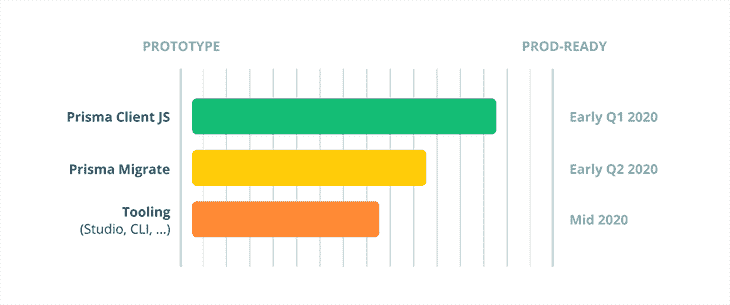
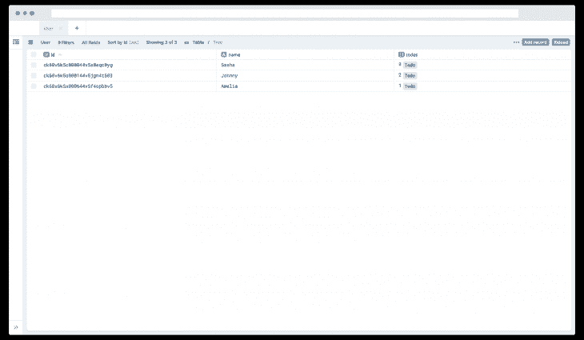
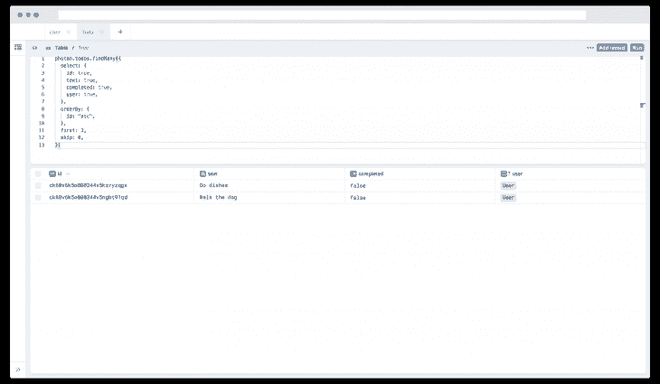

# Prisma 2 简介

> 原文：<https://blog.logrocket.com/prisma-2-introduction/>

*编者按:这篇文章于 2021 年 10 月 20 日更新，以更新信息并提供 Prisma 2 中新功能的附加发布后上下文。*

## 什么是 Prisma 2？

Prisma 2 提供了一个抽象，允许我们使用 JavaScript 和 TypeScript 编写数据库查询，并提供对 and Go 的早期访问支持。Prisma 2 然后将我们选择的语言编写的查询映射到我们选择的数据库中，这对于开发人员来说更容易，因为我们不必用数据库语言本身编写查询。

目前，它支持 MySQL、SQLite、PostgreSQL、SQL Server 和 MongoDB。

Prisma 2 由三个主要工具组成:

1.  [Prisma Client JS](https://github.com/prisma/prisma-client-js) :类型安全、自动生成的数据库客户端(一个[“ORM 替换”](https://blog.logrocket.com/why-you-should-avoid-orms-with-examples-in-node-js-e0baab73fa5/))
2.  Prisma Migrate :带有自定义工作流的声明式迁移系统
3.  Prisma Studio :支持各种数据库工作流的管理用户界面

### 1.Prisma 客户端 JS

Prisma Client JS 是一个类型安全的数据库客户端，它取代了传统的 ORM，如 Sequelize、Bookshelf 和 Mongoose。

它允许我们通过普通的 JavaScript 方法和对象访问数据库，而不必用数据库语言本身编写查询。这是在数据库前面充当抽象的部分，因此更容易编写 CRUD(创建、读取、更新和删除)应用程序。

### 2.棱镜迁移

Prisma Migrate 是一个强大的数据库模式迁移工具。它使用声明性的[数据建模语法](https://www.prisma.io/dataguide/datamodeling)来描述我们的数据库模式。

Prisma Migrate 存储了我们的整个迁移历史，并让我们轻松地恢复和重放迁移。它还允许我们在迁移时运行前后挂钩来执行脚本，这样我们就可以在迁移过程中用所需的值填充数据库。

目前，Prisma Migrate [不支持 MongoDB 连接器](https://www.prisma.io/docs/concepts/components/prisma-migrate)。

### 3.棱镜工作室

Prisma Studio 允许我们通过管理用户界面可视化数据。

在这里，我们可以对数据执行 CRUD 操作。这是从我们的数据库中可视化数据以及操作它的最简单的方法。

## Prisma 2 准备好了吗？

Prisma 最新的稳定版本是 v3.4.0，已经可以在生产中使用了。

MongoDB 支持仍处于预览模式，尽管支持正在扩展，但不建议在生产中使用它。Prisma 最新稳定版也支持 [PostgreSQL 14](https://www.postgresql.org/docs/14/release-14.html) 。



Prisma 2 正式上市的最新状态可以在[isprisma2ready.com](https://isprisma2ready.com/)查看。Prisma 2 目前已经可以生产了，isprisma2ready 现在提供了一些关于从 Prisma 1 迁移到 Prisma 2 的文档。isprisma2ready.com 还展示了其他关于 Prisma 的重要文件。

## 先决条件

本教程将向您展示以下内容:

正因为如此，掌握一些关于 [Node.js](https://nodejs.org/) 和 [npm](http://npmjs.com/) 的基本知识非常重要。Prisma 也可以使用 Typescript 或 Go 来实现，但是您将在后面的教程中看到如何使用这些语言来实现。

为了确保我们在同一页上，这些是本教程中使用的版本:

*   节点 v16.13.0
*   npm 版本 8.1.0
*   npx v8.1.0
*   Prisma v3.4.0

## Prisma 2 教程:入门

首先，我们需要安装`prisma`作为一个开发依赖项。以前，我们曾经将`prisma`作为一个全局依赖项来安装，但是现在不推荐这样做了。

在用`npm`初始化项目目录后，通过在终端中键入以下命令来安装`prisma`作为开发者依赖项:

```
npm install -D prisma

```

继续在终端中键入以下内容，在目录中初始化一个`prisma`项目:

```
npx prisma init

```

现在，它应该会在您的终端中打印出以下内容:

```
✔ Your Prisma schema was created at prisma/schema.prisma
  You can now open it in your favorite editor.

Next steps:
1\. Set the DATABASE_URL in the .env file to point to your existing database. If your database has no tables yet, read https://pris.ly/d/getting-started
2\. Set the provider of the datasource block in schema.prisma to match your database: postgresql, mysql, sqlite, sqlserver or mongodb (Preview).
3\. Run prisma db pull to turn your database schema into a Prisma schema.
4\. Run prisma generate to generate the Prisma Client. You can then start querying your database.

More information in our documentation:

开始

```

通过键入`npx` `prisma init`，一个新的`schema.prisma`文件被创建在`prisma`目录中。

## 棱柱线路图档案

现在，你应该看到在父目录中创建了一个名为`prisma/`的文件夹，在`prisma`目录中，你会发现一个名为`schema.prisma`的文件。

去打开它。它应包含以下内容:

```
// This is your Prisma schema file,
// learn more about it in the docs: https://pris.ly/d/prisma-schema
generator client {
  provider = "prisma-client-js"
}
datasource db {
  provider = "postgresql"
  url      = env("DATABASE_URL")
}

```

继续删除所有这些注释，并将`schema.prisma`文件的内容更改如下:

```
// 1
datasource db {
  provider = "sqlite"
  url      = "file:./dev.db"
}

// 2
generator client {
  provider = "prisma-client-js"
}

// 3
model User {
  id    String @id @default(cuid())
  fname String
  lname String
  todos Todo[]
}

// 4
model Todo {
  id        String  @default(cuid()) @id
  text      String
  completed Boolean @default(false)
}

```

`schema.prisma`文件包含数据模型和配置选项。让我们来分解一下:

### `datasource`区块

`datasource`块用于指定与数据库的连接。我们将`provider`字段设置为`sqlite`。SQLite 是一个嵌入式数据库软件，可以在任何地方使用，从低功耗设备到内存较低的设备。它允许我们创建一个本地数据库，而不需要安装任何东西。

`url`字段包含到我们数据库的连接字符串。这里，无论我们在`file:`后面键入什么，都是创建数据库的名称。在我们的例子中，数据库将被创建在名为`dev.db`的`prisma/`文件夹中。

### `generator`区块

通过添加`generator`块，我们指定我们想要生成 Prisma 的数据库客户机。

客户端是通过运行`prisma generate`命令生成的，将位于`node_modules/@prisma.`中，它可以在我们的代码中作为`import { PrismaClient } from '@prisma/client'`导入。

### `model`区块

这里，我们使用`model`块定义了`User`数据模型。模型代表了我们的应用领域的实体。在技术层面上，模型映射到数据源的底层结构。

例如，在关系数据库中——比如`SQL`、`SQLite`和`PostgreSQL`——一个模型映射到一个表，而在非关系数据库中——比如 MongoDB——它将映射到一个集合。在我们的`User`模型中有三个属性，即`id`、`name`和`todos`。

1.  `id`字段是类型为`String`的主键，默认值为 [`cuid()`](https://github.com/ericelliott/cuid) 。为了确定模型的哪个字段是 ID 字段，我们可以用`@id`属性对其进行注释
    1.  在像`SQL`、`SQLite`和`PostgreSQL`这样的关系数据库中，一个惟一的 ID 对应于一个带有主键约束的列
2.  `fname`和`lname`字段属于`String`类型
3.  `todos`字段的类型是`Todo`，它包含一个类型修饰符`[]`,使字段成为一个列表，这样我们就可以在我们的`User`数据模型中存储一个 todos 列表

### `Todo`数据模型

最后，我们定义了`Todo`数据模型。`Todo`数据模型包含三个字段:

1.  `id`:这也是一个类型为`String`的主键，默认值为 [`cuid()`](https://github.com/ericelliott/cuid)
2.  `text`:这是`String`的一种
3.  `completed`:这是一种`Boolean`，默认值为`false`

## 安装 Prisma JS 2

现在，通过使用`npm`安装`@prisma/client`，将 Prisma 客户端添加到项目中，如下所示:

```
npm install @prisma/client

```

通过键入以下命令，继续生成 Prisma 客户端:

```
npx prisma generate

```

生成的客户端将位于`node_modules/@prisma`中，从而允许我们将 Prisma 客户端作为`import { PrismaClient } from '@prisma/client'`导入到我们的代码中。

* * *

### 更多来自 LogRocket 的精彩文章:

* * *

## 使用 Prisma Migrate 迁移我们的数据库

现在让我们迁移数据库来创建空表。以下命令将创建并应用迁移。

```
npx prisma migrate dev

```

运行此命令将要求您命名迁移。为迁移命名将生成 SQLite 数据库。

```
$ npx prisma migrate dev
Environment variables loaded from .env
Prisma schema loaded from prisma\schema.prisma
Datasource "db": SQLite database "dev.db" at "sqlite:./dev.db"

SQLite database dev.db created at sqlite:./dev.db

√ Enter a name for the new migration: ... first-migration
Applying migration `20211104134108_first_migration`

The following migration(s) have been created and applied from new schema changes:

migrations/
  └─ 20211104134108_first_migration/
    └─ migration.sql

Your database is now in sync with your schema.

✔ Generated Prisma Client (3.4.0) to .\node_modules\@prisma\client in 74ms                        

```

上述命令将创建一个包含空表的`dev.db`文件。

## 我如何用初始值植入 Prisma 数据库？

继续在`prisma/`文件夹中创建一个名为`seed.js`的文件:

```
$ touch prisma/seed.js

```

现在，打开一个`seed.js`文件，开始导入 Prisma 客户端:

```
const { PrismaClient } = require("@prisma/client")

const prisma = new PrismaClient()

const main = async () => {

}

main()
  .catch(e => console.error(e))
  .finally(async () => {
    await prisma.$disconnect()
  })

```

首先，我们已经从`@prisma/client`包中导入了`PrismaClient`，它是在我们运行`npx` `prisma generate`时从我们的`schema.prisma`文件中生成的。接下来，我们创建一个名为`prisma`的常量，它是`PrismaClient`的一个实例。

我们有一个名为`main`的`async`函数。当调用`main`函数时，如果有错误发生，`catch`块会捕捉错误并用`console.error`显示出来，运行`main`函数后无论是否有错误发生，`finally`内的代码块都会运行。

`finally()`函数本身包含一个`async`回调函数，它与 Prisma 数据库断开连接，这样就不会让它继续运行，因为我们只是在播种数据库。

现在打开`main()`功能并粘贴以下内容:

```
  const john = await prisma.user.create({
    data: {
      fname: 'John',
      lname: 'Doe',
    },
  });
  console.log(john);

```

如果您键入上面的代码，您会发现多亏了 TypeScript 的自动完成支持。上面的代码将创建一个名为`John`姓为`Doe`的用户。

我们可以通过生成的`PrismaClient`实例上各自的模型属性来访问每个函数，例如`User`模型的`users`。名称`users`是使用[复数包](https://github.com/blakeembrey/pluralize)自动生成的。因此，建议我们的型号命名为单数，即`User`而不是`Users`。

创建用户最简单的方法是给它一个`name`字段。

通过在终端中键入以下命令来运行`seed.js`文件:

```
$ node prisma/seed

```

控制台应该输出以下内容:

```
{ id: 'ckvos4qr00000c8vndplgz0zl', fname: 'John', lname: 'Doe' }

```

现在，在下面，让我们创建另一个用户`johnny`，同时设置`todos`:

```
  const johnny = await prisma.user.create({
    data: {
      fname: 'Johnny',
      lname: 'Doe',
      todos: {
        create: [
          {
            text: 'Do dishes',
          },
          {
            text: 'Walk the dog',
          },
        ],
      },
    },
  })

```

这里，我们创建一个名为`Johnny`的用户。不同的是，我们还创建了一个待办事项列表。

`todos`字段是一个接受`create`的对象，T1 是一个对象数组。这些对象是实际的`todo`项，包含来自`Todo`数据模型的字段`id`、`text`和`completed`。

Prisma 有很好的自动完成功能，所以我们不需要记住数据模型或者`create`对象。它将在自动完成建议列表中提供，这样我们可以更快地编写代码，这提供了一个很好的开发人员体验。

作为提醒，我们已经展示了用`todos`创建一个`user`的例子。再次运行`seed.js`文件，您应该看到控制台输出如下:

```
{ id: 'ckvosauk10000f4vnxvk4lsxq', fname: 'Johnny', lname: 'Doe' }

```

您会注意到它没有返回`todos`，但是它肯定会将它们添加到数据库中。当我们查询我们的数据库时，我们会看到它。

让我们通过在`seed.js`文件中键入以下内容来创建一个没有用户的 todo:

```
const run = await prisma.todo.create({
  data: {
    text: "Run a full marathon"
  }
})

console.log(run)

```

上面的代码将简单地创建一个 todo，而不将用户分配给它。运行`seed.js`文件，查看如下输出:

```
{
  id: 'ck60v6k5t000444v5gc1vv3cs',
  text: 'Run a full marathon',
  completed: false
}

```

让我们通过键入以下内容来创建一个用户待办事项:

```
  const grocery = await prisma.todo.create({
    data: {
      text: 'Buy groceries for the week',
      User: {
        create: {
          fname: 'Amelia',
          lname: 'Dane',
        },
      },
    },
  });
  console.log(grocery);

```

上面的代码将创建一个 todo，并将其分配给名为`Amelia`的用户。运行`seed.js`文件，查看控制台输出如下内容:

```
{
  id: 'ckvlx7m8x0000wgvnqduu86re',
  text: 'Buy groceries for the week',
  completed: false,
  userId: 'ckvlx7m8x0001wgvn0ikwj774'
}

```

这一次，您将看到它没有返回`user`，但是它明确地将它们添加到数据库中。当我们查询我们的数据库时，我们会看到它。

整个`seed.js`文件现在应该看起来像这样:

```
const { PrismaClient } = require('@prisma/client');
const prisma = new PrismaClient();
const main = async () => {
  const john = await prisma.user.create({
    data: {
      fname: 'John',
      lname: 'Doe',
    },
  });
  console.log(john);
  const johnny = await prisma.user.create({
    data: {
      fname: 'Johnny',
      lname: 'Doe',
      todos: {
        create: [
          {
            text: 'Do dishes',
          },
          {
            text: 'Walk the dog',
          },
        ],
      },
    },
  });
  const run = await prisma.todo.create({
    data: {
      text: 'Run a full marathon',
    },
  });
  console.log(run);
  const grocery = await prisma.todo.create({
    data: {
      text: 'Buy groceries for the week',
      User: {
        create: {
          fname: 'Amelia',
          lname: 'Dane',
        },
      },
    },
  });
  console.log(grocery);
};
main()
  .catch((e) => console.error(e))
  .finally(async () => {
    await prisma.$disconnect();
  });

```

使用以下命令在根文件夹中创建一个`index.js`文件:

```
touch index.js

```

## 使用 Prisma 客户端植入值

让我们从导入 Prisma 客户端开始:

```
const { PrismaClient } = require("@prisma/client")

const prisma = new PrismaClient()

const main = async () => {

}

main()
  .catch(e => console.error(e))
  .finally(async () => {
    await prisma.$disconnect()
  })

```

这是一个演示项目，这就是我们关闭数据库连接的原因。在现实世界的应用程序中，服务器一直在运行，所以从技术上来说，我们只调用没有`finally()`块的`main()`函数。

让我们从在`main()`函数中添加以下代码开始:

```
const users = await prisma.user.findMany()

console.log(users)

```

上面的代码将找到所有用户，因为在`findMany()`中没有指定任何条件。要运行`index.js`文件，请在终端中键入以下内容:

```
node index

```

输出应该如下所示:

```
[
  { id: 'ckvos4qr00000c8vndplgz0zl', fname: 'John', lname: 'Doe' },
  { id: 'ckvosauk10000f4vnxvk4lsxq', fname: 'Johnny', lname: 'Doe' },
  { id: 'ckvosdm6d000144vn1regc1l4', fname: 'Amelia', lname: 'Dane' }
]

```

在此之下，添加以下代码块:

```
const usersWithTodos = await prisma.user.findMany({
    include: {
      todos: true
    }
  })

console.log(JSON.stringify(usersWithTodos, null, 2))

```

上面的代码返回所有的`users`，但也包括`user`已经创建的`todos`。

上面指定的`JSON.stringify()`方法允许我们用`2`的间距级别来美化 JSON。继续运行`index.js`文件，查看如下输出:

```
[
  {
    "id": "ck60v6k5c000044v5a0eqc0yg",
    "name": "Sasha",
    "todos": []
  },
  {
    "id": "ck60v6k5o000144v5jgn4t583",
    "name": "Johnny",
    "todos": [
      {
        "id": "ck60v6k5o000244v5kzryzqgx",
        "text": "Do dishes",
        "completed": false
      },
      {
        "id": "ck60v6k5o000344v5ngbt91qd",
        "text": "Walk the dog",
        "completed": false
      }
    ]
  },
  {
    "id": "ck60v6k5x000644v5f4opbbv5",
    "name": "Amelia",
    "todos": [
      {
        "id": "ck60v6k5x000544v5y5oig1qq",
        "text": "Buy groceries for the week",
        "completed": false
      }
    ]
  }
]

```

现在，在下面添加以下代码块，以查找数据库中的所有待办事项:

```
const todos = await prisma.todo.findMany()

console.log(todos)

```

您会注意到它类似于第一个`users`查询。现在，运行`index.js`文件来查看输出:

```
[
  {
    id: 'ckvosauk10001f4vnezedy9k2',
    text: 'Do dishes',
    completed: false,
    userId: 'ckvosauk10000f4vnxvk4lsxq'
  },
  {
    id: 'ckvosauk10002f4vna3knwti8',
    text: 'Walk the dog',
    completed: false,
    userId: 'ckvosauk10000f4vnxvk4lsxq'
  },
  {
    id: 'ckvosdm6d000044vnzw9kwb7g',
    text: 'Buy groceries for the week',
    completed: false,
    userId: 'ckvosdm6d000144vn1regc1l4'
  }
]

```

在其下方，添加以下代码:

```
const todosWithUsers = await prisma.todo.findMany({
  include: {
    User: true
  }
})

console.log(JSON.stringify(todosWithUsers, null, 2))

```

类似于第二个`users`查询，它将找到所有具有与那个`todo`相关的`user`的`todos`。再次运行`index.js`文件，查看输出，它将漂亮地打印出以下内容:

```
[
  {
    "id": "ckvosauk10001f4vnezedy9k2",
    "text": "Do dishes",
    "completed": false,
    "userId": "ckvosauk10000f4vnxvk4lsxq",
    "User": {
      "id": "ckvosauk10000f4vnxvk4lsxq",
      "fname": "Johnny",
      "lname": "Doe"
    }
  },
  {
    "id": "ckvosauk10002f4vna3knwti8",
    "text": "Walk the dog",
    "completed": false,
    "userId": "ckvosauk10000f4vnxvk4lsxq",
    "User": {
      "id": "ckvosauk10000f4vnxvk4lsxq",
      "fname": "Johnny",
      "lname": "Doe"
    }
  },
  {
    "id": "ckvosdm6d000044vnzw9kwb7g",
    "text": "Buy groceries for the week",
    "completed": false,
    "userId": "ckvosdm6d000144vn1regc1l4",
    "User": {
      "id": "ckvosdm6d000144vn1regc1l4",
      "fname": "Amelia",
      "lname": "Dane"
    }
  }
]

```

注意:当我们创建 todo `Run a full marathon`时，我们没有指定用户，这就是它是`null`的原因。

整个`index.js`文件现在应该看起来像这样:

```
const { PrismaClient } = require('@prisma/client');
const prisma = new PrismaClient();
async function main() {
  const users = await prisma.user.findMany();
  console.log(users);
  const usersWithTodos = await prisma.user.findMany({
    include: {
      todos: true,
    },
  });
  console.log(JSON.stringify(usersWithTodos, null, 2));
  const todos = await prisma.todo.findMany();
  console.log(todos);
  const todosWithUsers = await prisma.todo.findMany({
    include: {
      User: true,
    },
  });
  console.log(JSON.stringify(todosWithUsers, null, 2));
}
main()
  .catch((e) => console.error(e))
  .finally(async () => {
    await prisma.$disconnect();
  });

```

## 使用 Prisma Studio 管理用户界面可视化数据

Prisma Studio 允许我们使用漂亮的管理用户界面来可视化数据。它还允许我们对数据执行 CRUD 操作。要打开 Prisma Studio，请在终端中键入以下内容:

```
npx prisma studio

```

Prisma studio 将于`[http://localhost:5555](http://localhost:5555)`打开，你将能够看到管理界面。

使用 Admin UI，我们可以快速地对数据进行排序、过滤，甚至执行查询，而不必将它们写在脚本文件中。

以下是管理界面的一些截图:



Users table view


Todos table view



Run query view

你可以在 GitHub 上找到本教程使用的全部源代码。

## 结论

在本文中，我们学习了 Prisma 2 的基础知识。它有三大工具，即:Prisma Client、Prisma Migrate 和 Prisma Studio。

我们使用 Prisma Client 将值植入数据库并从中查询数据。我们还使用 Prisma Migrate 来创建初始迁移。最后，我们使用 Prisma Studio 通过一个漂亮的管理用户界面来可视化我们的数据。

## 使用 [LogRocket](https://lp.logrocket.com/blg/signup) 消除传统错误报告的干扰

[](https://lp.logrocket.com/blg/signup)

[LogRocket](https://lp.logrocket.com/blg/signup) 是一个数字体验分析解决方案，它可以保护您免受数百个假阳性错误警报的影响，只针对几个真正重要的项目。LogRocket 会告诉您应用程序中实际影响用户的最具影响力的 bug 和 UX 问题。

然后，使用具有深层技术遥测的会话重放来确切地查看用户看到了什么以及是什么导致了问题，就像你在他们身后看一样。

LogRocket 自动聚合客户端错误、JS 异常、前端性能指标和用户交互。然后 LogRocket 使用机器学习来告诉你哪些问题正在影响大多数用户，并提供你需要修复它的上下文。

关注重要的 bug—[今天就试试 LogRocket】。](https://lp.logrocket.com/blg/signup-issue-free)

## 200 只显示器出现故障，生产中网络请求缓慢

部署基于节点的 web 应用程序或网站是容易的部分。确保您的节点实例继续为您的应用程序提供资源是事情变得更加困难的地方。如果您对确保对后端或第三方服务的请求成功感兴趣，

[try LogRocket](https://lp.logrocket.com/blg/node-signup)

.

[](https://lp.logrocket.com/blg/node-signup)[https://logrocket.com/signup/](https://lp.logrocket.com/blg/node-signup)

LogRocket 就像是网络和移动应用程序的 DVR，记录下用户与你的应用程序交互时发生的一切。您可以汇总并报告有问题的网络请求，以快速了解根本原因，而不是猜测问题发生的原因。

LogRocket 检测您的应用程序以记录基线性能计时，如页面加载时间、到达第一个字节的时间、慢速网络请求，还记录 Redux、NgRx 和 Vuex 操作/状态。

[Start monitoring for free](https://lp.logrocket.com/blg/node-signup)

.