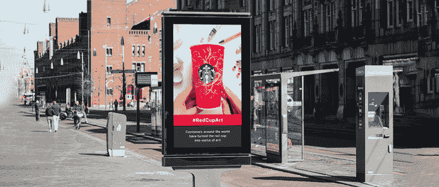
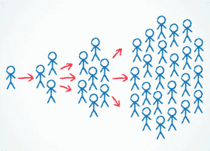
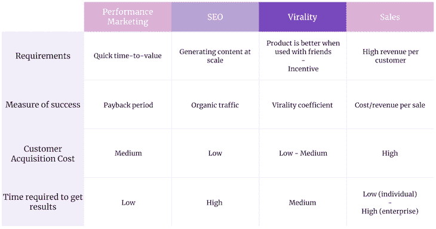

# 产品增长渠道、策略和示例

> 原文：<https://blog.logrocket.com/product-management/product-growth-channels-strategies-examples/>

与普遍看法相反，伟大的产品不会自我推销。

每天都有成百上千的新产品推向市场。消费者不断被“下一个大东西”淹没，这种噪音使得人们很难区分真正有用的产品和仅仅是时尚。

打破这种噪音的能力将获得关注的产品与最终被遗忘的产品区分开来。你通过掌握正确的成长通道来突破噪音。

* * *

## 目录

* * *

## 什么是增长渠道？

如果没有用户，就没有产品。

新用户可以通过各种方式获取:有机增长、付费获取、推荐等。我们可以将这些获取客户的方法分为几类，称为增长渠道。

简单来说，增长渠道就是一套获取新用户的策略。

## 4 个增长渠道和相关战略

四种最常见的增长渠道是:

1.  [效果营销](#performance-marketing)
2.  [SEO](#seo)
3.  [病毒式传播](#virality)
4.  [销售额](#sales)

让我们更详细地看一下每个增长渠道。

### 绩效营销

当我们谈到效果营销时，我们指的是付费获取渠道。

更多时候，效果营销侧重于各种形式的数字广告。但是，我们不应该局限于此；户外广告、广播通知、电视广告等。，也属于绩效营销范畴。

绩效营销的类型包括:

#### 高意图数字广告

高意图广告是指我们向已经在搜索类似我们产品的用户展示广告。

以谷歌广告为例。如果你正在打造一款金融科技产品，你可能希望把你的营销活动瞄准那些搜索“最佳银行账户”等短语的人。

因为这些用户已经在寻找一个银行账户，所以你捕获的潜在客户将有很高的转化机会。

尽管高意图广告可能看起来是最好的方式，但它也有缺点:

*   竞争通常很激烈
*   你只关注有限的潜在客户群体
*   你可能有一个人们不会自然搜索的产品(例如，他们不知道它的存在)

#### 低意图数字广告

低意图广告以精确度为代价减轻了高意图广告的缺点。我想在不相关的环境中捕捉用户。

以脸书广告为例。人们不使用脸书开设银行账户，所以这个广告很有可能是不相关的。另一方面，这些广告接触到了更广泛的受众。

低意向广告转化率低于高意向广告。反过来，它们使您能够:

*   在用户开始搜索竞争解决方案之前抓住他们
*   吸引那些还不知道他们需要你的产品的人

#### 大众广告

广播和电视是大众广告的形式。如果你的价值主张是广泛的，并吸引了许多人，他们就能很好地工作。

例如，如果你正在为一个特定的城市开发一个通用的应用程序，在当地的广播和电视上推广产品可能会给你一个在其他地方很难达到的提升。

#### 数字户外广告

户外(OOH)和数字户外(DOOH)广告在公共汽车站等实体场所推销你的产品。

虽然与大众广告非常相似，但还是有细微的区别。

* * *

订阅我们的产品管理简讯
将此类文章发送到您的收件箱

* * *

以下是星巴克数字户外广告的一个例子:

Source: [African Marketing Confederation](https://africanmarketingconfederation.org/digital-ooh-in-the-us/)

DOOH 广告最大的优势是能够准确定位展示广告的位置。这对于依赖位置的产品和服务有着巨大的影响。

缺点是人们已经习惯了这种类型的广告，经常完全忽视它。

#### 何时使用绩效营销

绩效营销在以下情况下非常有用:

*   你的潜在用户不会有机地寻找你的产品
*   您的产品可以快速实现价值，让您快速转化用户
*   您可以从新获得的用户中快速创收

### 搜索引擎优化

搜索引擎优化(SEO)专注于从搜索引擎获取有机流量。

SEO 是另一篇博文的主题，但是最重要的一点是，它完全是关于数量的。您创建的内容越多，您在高容量查询的搜索结果页面上排名靠前的机会就越大。

换句话说，你不会用一两个 SEO 优化的页面获得成千上万的用户。

组织用于大规模创建内容的常用策略有三种:

#### 用户生成的内容

大规模创建内容的最佳方式之一是让你的用户为你做这件事。那些价值主张依赖于创造新内容的产品最适合 SEO。

Source: [Reforge](https://www.reforge.com/blog/growth-loops)

以 Medium、Pinterest 和易贝为例。人们通常通过谷歌搜索相关术语来发现这些网站。然后，一旦他们迷上了，他们就创建自己的内容，这有助于吸引新用户并形成闭环。

#### 博客内容

创建相关的、专门的博客内容是吸引和转化用户的一个很好的方法。

一个管理良好的博客首先带来新的线索(通过良好的 SEO 定位),然后将那些运营公司的人定位为领域专家。

因为它需要大量的积极努力，我们经常使用博客作为多用途的工具。除了搜索引擎优化，它还可以作为销售材料，品牌建设饲料等。

#### 自动生成的内容

如果你的产品可以生成数百个页面，搜索引擎会喜欢你的。实现这一点的一个方法是构建以 SEO 为中心的模板，这些模板可以自动地、可扩展地填充。

假设你是一个本地蓝领工人可以为他们的服务做广告的市场。然后，您可以自动生成标题为:“[姓名]:[城市]的专家[专家]。”

然后，如果在纽约、费城和纽黑文工作的通才加入您的市场，它会自动创建标题如下的页面:

*   乔:纽约的管道专家
*   乔:纽约的一个熟练的杂工
*   乔:纽约的专业技术人员
*   乔:费城的管道专家
*   乔:费城的一个熟练的杂工
*   乔:费城的专家技师
*   乔:纽黑文的管道专家
*   乔:纽黑文的一个专业杂工
*   乔:纽黑文的专业技术人员

在这个例子中，一个新的自由职业者在你的网站上帮助创建了九个相关的、SEO 优化的页面。有了成百上千的自由职业者，你可以很快地制作出成千上万的网页供搜索引擎抓取。

#### 何时使用 SEO

在以下情况下，SEO 是一种很好的方法:

*   你的潜在用户有机地搜索你的解决方案
*   大规模创作内容是你价值主张的一部分
*   您可以使用创建的内容

### 活力

病毒式传播包括现有用户邀请更多新用户。一旦你达到一个点，每个用户都带来一个或更多的新用户，你就建立了一个无止境的病毒循环。

有三种常见的病毒类型:

#### 口碑

当用户有机地谈论你的产品时，口碑就产生了。当你提供了一种值得讲述的体验时，这种感觉就会产生——这种体验让用户有一种体验过你的产品的吹嘘权。

这种体验的一个例子是，通过 Airbnb 预订或在 Tinder 上找到新的合作伙伴，度过一个美好的假期。

Clubhouse 是另一个例子——这个产品给了用户一个吹嘘自己是“独家”社区一员的理由。

#### 邀请

如果有充分的理由，人们会主动邀请其他人。

一个例子可能是社会强制。与朋友一起使用时，脸书、Signal 和 Snapchat 等产品简直更好、更令人愉悦。

另一个方面是实用性:一些产品，如 Zoom 和 PayPal，是为与其他产品一起使用而设计的。

你也可以通过奖励带朋友来的人来激励邀请，就像优步给邀请者免费乘车一样。

#### 经验的

当人们被动地从他们的朋友那里发现新产品时，经验病毒式传播就发生了。

YouTube 就是一个很好的例子。人们不谈论 YouTube，也不邀请朋友来发现这个平台。他们只需在 YouTube 上发送带有视频的链接，这就是其他人发现并坚持使用该平台的方式。

网飞也有一些经验上的病毒式传播。如果你邀请你的朋友过来，打开一个网飞秀，你让他们体验产品。将来，这增加了他们自己购买订阅的机会。

#### 何时使用生命力

在以下情况下，病毒式传播是一种很好的策略:

*   你的目标群体倾向于自我参考——例如，青少年经常谈论他们手机上的应用程序
*   你的产品和朋友一起使用会更好
*   网络效应对于解决用户的痛点至关重要

### 销售

直销活动是获得新用户的最有效方式。它也是可伸缩性最差、最昂贵的一种。

销售类型包括:

#### 个人/中小企业销售

在这里，我们讨论的是直接销售给一个买家。可能是个人用户，也可能是只有一个决策者的小公司。

这里的销售相对较快，通常在一两次会议之后，但很少达到惊人的数字。

#### 企业销售

企业销售很辛苦。通常你需要赢得许多决策者的支持，销售周期可能会持续数周，甚至数月。

然而，巨大的努力往往会带来相应的高收入潜力。

在以下情况下，一个好的销售策略可以让你走得更远:

*   你的潜在客户需要高接触服务
*   你有一个很难解释的复杂产品
*   你期望每个客户的高收入
*   你能接触到的顾客数量是有限的

## 如何选择正确的增长战略

如果没有人发现，伟大的价值主张是没有用的。这就是为什么分销是关键。

获取用户的方式有很多。最常见的是效果营销、搜索引擎优化、病毒式传播和销售:

*   如果你的产品能迅速实现价值，你能在短时间内收回投资，绩效营销就是正确的方法。也不需要太多时间就能看到第一批结果
*   对于自然产生大量内容的产品来说，SEO 是一个很好的策略。这里的重点是获得尽可能多的相关流量。这也是获取用户最便宜、最具扩展性的方式之一，但在显示第一批结果之前，通常需要数月的工作
*   如果产品对朋友来说自然更好，或者当你可以提供一个有吸引力的激励时，虚拟性会很有效。我们专注于从每个现有用户那里获得最大数量的新用户
*   **销售**是最贵最不可扩展的渠道。但是，如果你能从每一个新客户那里获得高收入，投资客户获取是明智的。保持健康的采购成本/收入比是健康销售引擎的关键

尽管所有这些销售听起来很诱人，但你的产品可能最适合某个特定的渠道。最终，掌握一个渠道比平均开发所有四个渠道要好。

*精选图片来源:[icon scout](https://iconscout.com/icon/chart-growth-1913955)*

## [LogRocket](https://lp.logrocket.com/blg/pm-signup) 产生产品见解，从而导致有意义的行动

[LogRocket](https://lp.logrocket.com/blg/pm-signup) 确定用户体验中的摩擦点，以便您能够做出明智的产品和设计变更决策，从而实现您的目标。

使用 LogRocket，您可以[了解影响您产品的问题的范围](https://logrocket.com/for/analytics-for-web-applications)，并优先考虑需要做出的更改。LogRocket 简化了工作流程，允许工程和设计团队使用与您相同的[数据进行工作](https://logrocket.com/for/web-analytics-solutions)，消除了对需要做什么的困惑。

让你的团队步调一致——今天就试试 [LogRocket](https://lp.logrocket.com/blg/pm-signup) 。

[Bart Krawczyk Follow](https://blog.logrocket.com/author/bartkrawczyk/) Learning how to build beautiful products without burning myself out (again). Writing about what I discovered along the way.