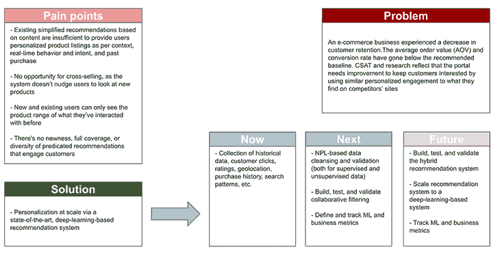

# 推动增长的产品推荐技巧

> 原文：<https://blog.logrocket.com/product-management/product-recommendation-techniques-drive-growth/>

随着电子商务平台、OTT 渠道或任何 B2C 应用的竞争越来越激烈，激活和保留客户的成功取决于客户的参与程度。

毫无疑问，客户参与是商业和在线平台不断增长和蓬勃发展的一个基本特征。

在本文中，我们将讨论个性化以及如何使用它来推动产品增长。我们开始吧！

* * *

## 目录

* * *

## 什么是个性化？

在在线应用开始时，大多数商业和 OTT 平台都专注于通过在整个客户旅程中提供完美的支付、结账、目录和订单体验来提供世界级的客户购物或浏览体验。

然而，在过去的几年里，网络空间已经成倍地增长和成熟。它还产生了大量的数据，例如客户购买历史和认知数据，这些数据可以满足日益增长的要求苛刻、见多识广的客户的需求，这些客户在许多选择中拥有大量数字知识。

因此，这些客户在做出购买决定时会更加谨慎。此外，他们更喜欢选择一个直观的平台，花更少的时间在各种应用程序中找到服务或产品。

成功的在线平台，如亚马逊、易贝、Shopify、网飞、谷歌地图、Copilot 和其他同类最佳应用程序的制胜秘诀是，他们相信通过个性化策略给客户带来的不仅仅是浏览和购物体验。

亚马逊的推荐系统就是最好的例子之一。此外，网飞和 Udemy 是几个将个性化作为其核心商业模式战略以超越日益增长的竞争的例子。他们将金钱、时间、精力和策略投入到机器学习(ML)和最先进的深度学习中，以构建推荐引擎，不断努力将个性化扩展到未来的最高成熟度。

## 产品个性化的好处

个性化的优势是在数据的帮助下，提供量身定制的、有意义的、以客户为中心的产品。根据麦肯锡最近的研究，[个性化可以创造 1.7-3 万亿美元的价值](https://www.mckinsey.com/capabilities/growth-marketing-and-sales/our-insights/a-technology-blueprint-for-personalization-at-scale)。另一项研究表明[亚马逊上 35%的购买和网飞上 75%的挑选是产品推荐引擎的结果，为客户提供了个性化的体验。](https://www.mckinsey.com/industries/retail/our-insights/how-retailers-can-keep-up-with-consumers)

在日常的数字生活中，个性化经常出现在日常应用程序中。例如，亚马逊的产品推荐带来了追加销售和交叉销售收入，Spotify 的推荐音乐使其与竞争对手区分开来，这是下一个值得注意的。

同样，YouTube 基于用户浏览历史、偏好、个人资料或行为推荐短片、音乐和视频博客。电影、连续剧和纪录片的评级，以及对网飞和 Hotstar 的推荐，有助于用户更快地做出决定，并让他们参与探索新事物——这是这些 OTT 应用的核心产品战略。

## 什么是推荐引擎或系统？

推荐引擎是一个强大的机器学习系统，允许客户快速做出选择，并帮助他们探索和购买有趣和相关的产品。

想象一下，像网飞这样的 OTT 平台，或者像亚马逊这样没有推荐系统的电商平台。通过这个 app 挑选一个系列或者购买一个产品，会是同样的乐趣和吸引力吗？

如果你想要一个更正式的定义，“推荐系统是由一套人工智能/人工智能算法驱动的，这些算法通过客户过去的购买历史、认知行为和个人资料来预测他们想要或寻找什么，并有时从心理上说服他们做出购买决定。"

## 产品经理在构建基于人工智能和人工智能的产品中的角色和职责

理解构建机器学习产品的产品经理的[角色和职责](https://blog.logrocket.com/product-management/what-does-a-product-manager-do-role-responsibilities/)很重要。他们的角色类似于任何其他产品经理。建立一个强大的搜索引擎、推荐引擎或 AI/Ml 驱动的产品需要所有期望的 PM 技能和策略。

此外，他们必须了解潜在的客户问题和挑战，以证明企业对 AI/ML/神经网络(NN)或深度学习(DL)产品的需求。这些产品的商业价值的合理性必须在每个阶段进行评估，从构建、增强或扩展开始，因为在发展它们时，大量的努力、风险、时间和大量的资本都处于危险之中。

除了一般的产品管理技能，项目经理还必须具备特定数据科学概念的知识。项目经理必须知道模型部署阶段、测试和验证方法。他们必须对数据监督和非监督学习、AI 框架和库有深入的了解，比如 [PyTorch](https://pytorch.org/) 和 [TensorFlow](http://tensorflow.org/?gclid=Cj0KCQiAsdKbBhDHARIsANJ6-jfFQ2o9F4xYSXkQ1eVaerH5F7Fn63wfebSyBOvjifP1eiU6izmPLDkaAuCDEALw_wcB) 。他们还必须知道模型的类型:回归、分类、决策树(DT)、NN、DL 和自然语言处理(NLP)，以及它们的优缺点。

这使得 PMs 适合根据业务需求和客户问题提出解决方案。尽管如此，拥有这些技能的项目经理可以轻松地量化和发起与 AI/ML 业务领导者和经验丰富的数据科学家的对话。

在下面的例子中，我将展示一个来自电子商务的简单和假设的案例，展示用于从头构建基于 AI/ML 的推荐系统的基本项目管理活动的知识组合。

## 影响产品个性化的 PMs 示例

假设某个项目经理提出了一个推荐系统，为商务应用程序上的客户提供个性化体验。在这个例子中，项目经理基于先进的深度学习算法，通过推荐系统提出了大规模个性化。

* * *

订阅我们的产品管理简讯
将此类文章发送到您的收件箱

* * *

为此，项目经理首先通过定性和定量的方法识别客户的问题和痛点。后来，项目经理提出了一个解决方案，但确保从小处着手，逐步向“大规模个性化”的最终目标迈进

总之，项目经理遵循构建、衡量和学习快速构建推荐系统的方法，并建议在未来通过复杂的模型扩大规模。他们将跟踪每个里程碑的改进，以评估由此带来的业务影响:

Hypothetical examples of building a recommendation system (source: Surbhi B Sooni).

构建推荐系统有助于组织使用人力、成本和工作评估，以及为长期可伸缩性目标持续创造价值。在这种方法中，项目经理可以很容易地影响[高科技利益相关者来解决正确的问题](https://blog.logrocket.com/product-management/what-stakeholder-management-tools-techniques/)。

## 有哪些不同类型的推荐系统？

有不同类型的推荐系统，每一种都有其特性、优点和缺点。下面我们来看看最常见的几种！

### 1.基于内容的过滤

这个基本的推荐系统使用用户简档信息，例如他们的喜欢和不喜欢，并生成推荐。

*   优点:经济高效，不需要其他用户的数据，可扩展
*   缺点:仅基于用户现有的好恶进行推荐
*   流行算法:[余弦相似度](https://en.wikipedia.org/wiki/Cosine_similarity)

### 2.协同过滤(CF)

它根据用户在应用程序上的行为来识别用户之间的相似性。

### 3.混合模型

顾名思义，混合模型结合了协作和基于内容的过滤。因此，它是一个强大的推荐系统，并提供准确的推荐。该方法还克服了稀疏性和冷启动的挑战。

*   优点:不稀疏，不丢失信息
*   缺点:实施成本高，复杂

### 4.深度学习推荐系统

这是一个强大的推荐工具，可以基于用户和产品的非线性数据进行预测。一个简单的例子是 Gmail 上的智能撰写功能，它可以预测一个句子的下一个单词。它在商业和零售方面也有平等的机会。

## 如何跟踪和衡量推荐系统的价值

产品经理必须明白如何通过推荐系统直接衡量企业的成功。[在这种情况下，最常用的漏斗和业务指标](https://blog.logrocket.com/product-management/what-metrics-kpis-product-managers-track/)是点击率(CTR)、用户参与度、保留率、采用率和忠诚度。

此外，推荐系统的影响还可以通过提供产品的尾部来跟踪销售和收入，这些产品可以补充客户当前或先前购买的项目。它不仅提高了几个热门商品的销量，还带来了几个交叉销售和追加销售产品，从而导致更多的购买。

在用户参与度指标方面，个性化推荐显著增加了产品探索时间。这是因为个性化推荐反过来会影响下载、购买、订阅续订和点击率。即便如此，这也表明通过忠诚度、会话时长或网站访问，回头客的数量有所增加。

此外，推荐说服用户选择优质产品，而不是低预算产品，以实现利润最大化。例如，电子商务应用程序上的大量推荐目录产品让用户参与到探索中。此外，它还能吸引顾客对可能与他们想要的产品搭配或互补的商品的注意力。

为了使这些业务指标显示快速增长，产品团队不断尝试通过 A/B 实验来微调推荐引擎算法[，以跟踪变化的效果。](https://blog.logrocket.com/product-management/what-is-a-b-testing-optimizely-demo-examples/)

## 提示和策略

个性化策略应符合推荐系统的目标和结果。例如，基于内容的过滤推荐系统只根据用户的兴趣进行推荐。

假设业务目标是基于客户的行为发现并向客户推荐新兴趣的体验，与基于内容的过滤解决方案的概念形成对比。一个独立的基于内容的模型无法实现这个目标，除非它不能扩展到协作过滤或混合模型。

为了证明推荐系统的 ROI，PM 确保预期的业务目标和路线图中的最终模型范围之间的一致性。

接下来，我将讨论推荐引擎度量如何与业务度量性能联系在一起。对于一个 PM 来说，知道如何带着自信和知识领导一个世界级的数据科学工程师团队是一个重要的概念。

## 模型度量和业务度量之间的关系

除了业务指标，产品团队必须使用标准的机器学习评估指标来衡量模型的成功。最常见的有:

*   [【电子邮件保护】](/cdn-cgi/l/email-protection):表示前 k 个推荐项目列表的相关程度
*   [【电子邮件保护】](/cdn-cgi/l/email-protection):表示前 k 个补救项目中所有相关项目的覆盖范围。较高的召回率会降低精确度，反之亦然
*   平均绝对误差(MAE):帮助预测评级或准确性，以解决预测/推荐评级与用户真实评级的接近程度。它也称为损失函数(L1 损失),用于计算预测值和实际值之间的绝对差值
*   均方根误差(RMSE):另一个损失函数，称为 L2 损失。它是二次损失，因为预测误差是平方的，所以它永远不会是负的。一个好的模型必须具有接近于零的 MSE

要理解这些指标的真正含义，重要的是认识到推荐系统的任务，然后跟踪少数几个来评估良好的性能。然后，作为一个项目经理，可以根据指向推荐引擎常见用法的基本事实，向工程团队建议使用(或不使用)哪些指标。它们大致分为以下三类:

1.  预测:YouTube、网飞和谷歌新闻是预测收视率和向客户提供预测的重要例子。这有助于做决定。对于评级，推荐的指标是 MAE 和 RMSE
2.  排名:电子商务应用程序补救系统的一个常见任务是排名前 K，或排名中的推荐产品列表。常见的指标有[【受电子邮件保护】](/cdn-cgi/l/email-protection)和[【受电子邮件保护】](/cdn-cgi/l/email-protection)除此之外，新奇度、覆盖率和挑选率都是很好的跟踪指标
3.  分类:推荐系统的预期结果是确定一组不按顺序排列的推荐项目。它可以是相似的项目或用户。例如，在脸书上，有特殊兴趣的相似用户被推荐成为你的朋友。评估该任务的度量可以是基于相关或不相关的推荐项目的数量的简单决策。这些数字被放在列联表上，称为混淆矩阵。从这个混淆矩阵中通常已知的数字是精确度或真正可能的精确度、辐射率(假阳性率)和遗漏率(假阴性率)。

Contingency table or confusion matrix to view the number of T/F, positive, or negative recommendations.

### 业务指标

我已经详细解释了业务度量，但是在 ML 度量和业务度量之间有一个重要的关系。据说“为商业模型构建的推荐系统所展示的性能应该通过跟踪它对商业的影响来证明它的投资回报率。”

Business value metrics of the recommendation system.

在上面讨论的情况下，项目经理可以定义一些 ML 和业务指标来跟踪他的路线图上的建议的改进:

Metrics to track business success through recommendation system performances.

## 结论

简而言之，个性化的最终目标是解开客户意图和行为的秘密，并根据他们的需求快速准确地为他们服务。

正确的服务和产品推荐将客户与应用程序联系起来。借助于使用神经网络、CNN 和 DL 的越来越多的客户数据，有很多机会放大一个健壮的推荐系统的能力。

*精选图片来源:[icon scout](URL%20OF%20IMAGE)*

## [LogRocket](https://lp.logrocket.com/blg/pm-signup) 产生产品见解，从而导致有意义的行动

[LogRocket](https://lp.logrocket.com/blg/pm-signup) 确定用户体验中的摩擦点，以便您能够做出明智的产品和设计变更决策，从而实现您的目标。

使用 LogRocket，您可以[了解影响您产品的问题的范围](https://logrocket.com/for/analytics-for-web-applications)，并优先考虑需要做出的更改。LogRocket 简化了工作流程，允许工程和设计团队使用与您相同的[数据进行工作](https://logrocket.com/for/web-analytics-solutions)，消除了对需要做什么的困惑。

让你的团队步调一致——今天就试试 [LogRocket](https://lp.logrocket.com/blg/pm-signup) 。