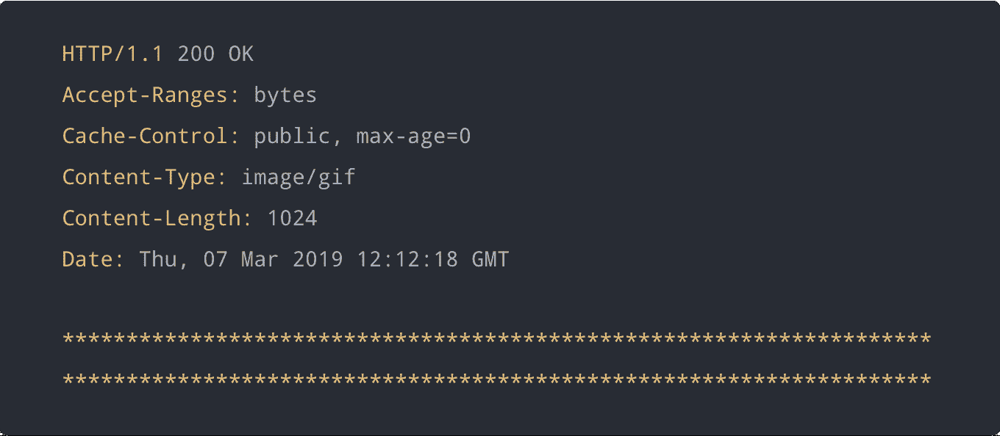
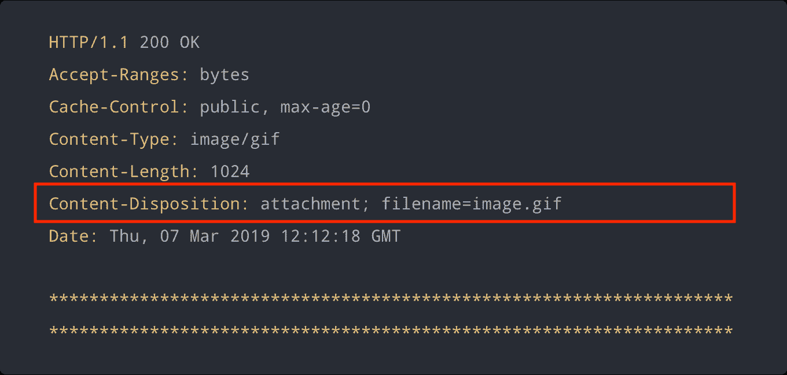
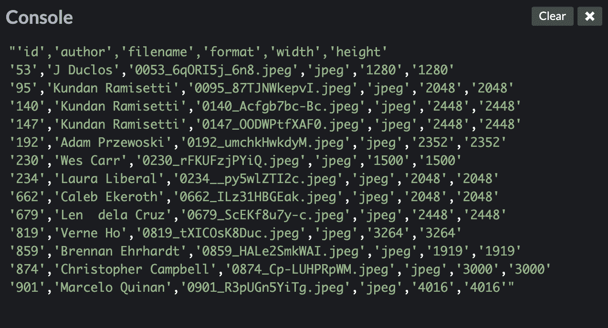

# browser - LogRocket 博客中的程序文件下载

> 原文：<https://blog.logrocket.com/programmatic-file-downloads-in-the-browser-9a5186298d5c/>

## 暴露的 Blobs 和对象 URL

文件下载是网上冲浪的一个核心方面。每天都有大量的文件从互联网上下载，从二进制文件到纯文本文件。

 [https://www.youtube.com/embed/PgOHF4u-d1E?version=3&rel=1&showsearch=0&showinfo=1&iv_load_policy=1&fs=1&hl=en-US&autohide=2&wmode=transparent](https://www.youtube.com/embed/PgOHF4u-d1E?version=3&rel=1&showsearch=0&showinfo=1&iv_load_policy=1&fs=1&hl=en-US&autohide=2&wmode=transparent)

视频

### 从服务器获取文件

传统上，要下载的文件首先通过*客户端*从*服务器*请求，例如用户的网络浏览器。然后，服务器返回一个响应，包含文件的*内容*和一些指示性的*头*，指定客户端应该如何下载文件。

Schematic of Client-Server communication in fetching a file via HTTP

在这个图中，绿线显示了通过 HTTP 从客户机到服务器的请求流。橙色线显示了从服务器返回到客户端的响应流。

尽管该图指出了通信流，但它没有明确显示来自客户端的请求是什么样子，或者来自服务器的响应是什么样子。

服务器的响应可能是这样的:



Sample HTTP Response for a GIF image — the asterisks(*) represent the binary content of the image

在这个响应中，服务器简单地提供资源的原始内容(*用星号* — `*`表示)，这些内容将由客户端接收。

响应还包含一些头，这些头为客户端提供了一些关于它接收到的内容的性质的信息——在这个示例响应中,**内容类型**和**内容长度**头提供了这些信息。

当客户机(在本例中是 web 浏览器)收到这个 HTTP 响应时，它只是显示或呈现 GIF 图像——这不是我们想要的行为。**期望的行为是图像应该被下载而不是显示。**

### 强制文件下载

为了通知客户机不打算显示资源的内容，服务器必须在响应中包含一个附加的头。 **Content-Disposition** 报头是用于指定这种信息的正确报头。

`**Content-Disposition**`标题最初是为邮件用户代理设计的——因为电子邮件是多部分文档，可能包含几个文件附件。但是，它可以被包括 web 浏览器在内的几个 HTTP 客户端解释。该标题提供了关于**处置类型**和**处置参数**的信息。

**处置类型**通常是以下类型之一:

1.  **inline** —显示消息内容时，正文部分将自动显示
2.  **附件** —正文部分与消息的主要内容分开，除非用户提示，否则不应自动显示

**处置参数**是指定关于主体部分或文件的信息的附加参数，例如文件名、创建日期、修改日期、读取日期、大小等。

下面是强制文件下载的 GIF 图像的 HTTP 响应:



Sample HTTP Response for downloading a GIF image — the asterisks(*) represent the binary content of the image

现在服务器强制下载 GIF 图像。大多数 HTTP 客户端在收到来自如上服务器的响应时，会提示用户下载资源内容。

### 单击以在浏览器中下载

假设您有一个可下载资源的 URL。当您尝试在 web 浏览器上访问该 URL 时，它会提示您下载资源文件—无论该文件是什么。

上述场景在 web 应用程序中是不可行的。对于 web 应用程序，期望的行为将是— **下载文件以响应用户交互**。例如，*点击保存照片*或*下载报告*。

使用 HTML **锚元素** ( `<a></a>`)可以在浏览器中实现这样的行为。锚元素对于从 HTML 文档添加到其他资源和文档的超链接非常有用。链接资源的 URL 在锚元素的`**href**`属性中指定。

下面是一个链接到 PDF 文档的传统 HTML 锚元素:

A basic HTML anchor element (<a></a>)

### 下载属性

在 HTML 5 中，一个新的`**download**`属性被添加到锚元素中。`download`属性用于通知浏览器下载 URL，而不是导航到它——因此会出现一个提示，要求用户保存文件。

可以给`download`属性一个有效的文件名作为它的值。但是，用户仍然可以在弹出的保存提示中修改文件名。

关于`**download**`属性的行为，有几个**值得注意的事实**:

1.  根据*同源策略*，该属性仅对同源 URL 有效。因此，它不能用于下载从不同来源提供的资源
2.  除了 HTTP(s)URL，它还支持`blob:`和`data:`URL——这对于下载用 JavaScript 编程生成的内容非常有用
3.  对于具有指定文件名的 HTTP `Content-Disposition`标题的 URL，标题文件名的优先级高于`download`属性的值

以下是用于下载 PDF 文档的更新的 HTML 锚元素:


HTML anchor element (<a></a>) for resource download

### 程序化内容生成

随着 HTML5 和新的 Web APIs 的出现，使用 JavaScript 在浏览器中完成大量复杂的工作而无需与服务器通信已经成为可能。

* * *

### 更多来自 LogRocket 的精彩文章:

* * *

现在有一些 Web APIs 可用于以编程方式:

*   在画布上绘制和操作图像或视频帧— **画布 API**
*   读取文件的内容和属性，甚至为文件生成新的数据— **文件 API**
*   为二进制数据生成对象 URL—**URL API**

仅举几个例子。

在本节中，我们将研究如何在浏览器上使用 Web APIs 以编程方式生成内容。

***我们来考虑两个常见的例子*** 。

### 示例 1 —从 JSON 数组生成 CSV

在这个例子中，我们将使用 **Fetch API** 从 web 服务中异步获取 JSON 数据，并将数据转换成一串可以写入 CSV 文件的*逗号分隔值*。下面是我们将要做的事情的分类:

*   从 API 获取 JSON 对象的数组集合
*   从数组中的每一项提取选定的字段
*   将提取的数据重新格式化为 CSV 格式

CSV 生成脚本可能是这样的:

```
function squareImages({ width = 1, height = width } = {}) {
  return width / height === 1;
}

function collectionToCSV(keys = []) {
  return (collection = []) => {
    const headers = keys.map(key => `"${key}"`).join(',');
    const extractKeyValues = record => keys.map(key => `"${record[key]}"`).join(',');

    return collection.reduce((csv, record) => {
      return (`${csv}\n${extractKeyValues(record)}`).trim();
    }, headers);
  }
}

const exportFields = [ 'id', 'author', 'filename', 'format', 'width', 'height' ];

fetch('https://picsum.photos/list')
  .then(response => response.json())
  .then(data => data.filter(squareImages))
  .then(collectionToCSV(exportFields))
  .then(console.log, console.error);
```

这里，我们使用由**获取 API** 提供的全局`fetch()`函数从 [Picsum Photos API](https://picsum.photos/) 获取照片集合，过滤该集合并将集合数组转换为 CSV 字符串。代码片段只是将生成的 CSV 字符串记录到控制台。

首先，我们定义一个`**squareImages**` *过滤函数*，用于过滤集合中宽度和高度相等的图像。

接下来，我们定义一个`**collectionToCSV**` *高阶函数*，它接受一个键数组并返回一个函数，该函数接受一个对象数组集合并将其转换为一个 CSV 字符串，仅从每个对象中提取指定的键。

最后，我们在`**exportFields**`数组中指定要从集合中的每个照片对象中提取的字段。

控制台上的输出如下所示:



### 示例 2 —使用 Canvas API 处理图像像素

在这个例子中，我们将使用 **Canvas API** 来操作图像的像素，使其呈现灰度。下面是我们将要做的事情的分类:

*   根据图像设置画布尺寸
*   在画布上画出图像
*   提取画布上的图像像素并将其转换为灰度
*   在画布上重绘灰度像素

假设我们有一个看起来很像这样的标记:

<画布></画布>

< /div >

下面是图像操作脚本的样子:

```
const wrapper = document.getElementById('image-wrapper');
const img = wrapper.querySelector('img');
const canvas = wrapper.querySelector('canvas');

img.addEventListener('load', () => {
  canvas.width = img.width;
  canvas.height = img.height;

  const ctx = canvas.getContext('2d');

  ctx.drawImage(img, 0, 0, width, height);

  const imageData = ctx.getImageData(0, 0, width, height);
  const data = imageData.data;

  for (let i = 0, len = data.length; i < len; i += 4) {
    const avg = (data[i] + data[i + 1] + data[i + 2]) / 3;

    data[i]     = avg; // red
    data[i + 1] = avg; // green
    data[i + 2] = avg; // blue
  }

  ctx.putImageData(imageData, 0, 0);
}, false);

```

下面是实际图像和相应的灰度画布图像之间的比较。

### Blobs 和对象 URL

在我们继续学习如何在浏览器中下载以编程方式生成的内容之前，让我们花些时间来看看一种叫做`**Blob**`的特殊对象接口，它已经被大多数主流 web 浏览器实现了。你可以在这里了解 blob[。](https://developer.mozilla.org/en-US/docs/Web/API/Blob)

**blob 是用来表示原始不可变数据的对象。** Blob 对象存储关于它们所包含的数据的类型和大小的信息，这使得它们对于在浏览器上存储和处理文件内容非常有用。事实上，`File`对象是`Blob`接口的特殊扩展。

### 获取斑点

Blob 对象可以从几个来源获得:

*   使用`Blob`构造函数从非 blob 数据创建
*   使用`Blob.slice()`方法从已经存在的 blob 对象切片
*   从获取 API 响应或其他 Web API 接口生成

以下是上述 blob 对象源的一些代码示例:

```
const data = {
  name: 'Glad Chinda',
  country: 'Nigeria',
  role: 'Web Developer'
};

// SOURCE 1:
// Creating a blob object from non-blob data using the Blob constructor
const blob = new Blob([ JSON.stringify(data) ], { type: 'application/json' });

```

```
const paragraphs = [
  'First paragraph.\r\n',
  'Second paragraph.\r\n',
  'Third paragraph.'
];
const blob = new Blob(paragraphs, { type: 'text/plain' });

// SOURCE 2:
// Creating a new blob by slicing part of an already existing blob object
const slicedBlob = blob.slice(0, 100);

```

```
// SOURCE 3:
// Generating a blob object from a Web API like the Fetch API
// Notice that Response.blob() returns a promise that is fulfilled with a blob object
fetch('https://picsum.photos/id/6/100')
  .then(response => response.blob())
  .then(blob => {
    // use blob here...
  });

```

### 正在读取 blob 内容

获得 blob 对象是一回事，使用它又是另一回事。您希望能够做的一件事是读取 blob 的内容。这听起来是一个使用`**FileReader**`对象的好机会。你可以在这里了解`FileReader`对象[。](https://developer.mozilla.org/en-US/docs/Web/API/FileReader)

一个`FileReader`对象提供了一些非常有用的方法，以不同的方式异步读取 blob 对象或文件的内容。`FileReader`接口有很好的浏览器支持，并支持读取 blob 数据，如下所示*(在撰写本文时)*:

*   **为文本** — `FileReader.readAsText()`
*   **为二进制字符串** — `FileReader.readAsBinaryString()`
*   **as base64 数据 URL** — ` FileReader.readAsDataURL()`
*   **作为数组缓冲** — ` FileReader.readAsArrayBuffer()`

基于之前的 Fetch API 示例，我们可以使用一个`FileReader`对象来读取 blob，如下所示:

```
fetch('https://picsum.photos/id/6/240')
  .then(response => response.blob())
  .then(blob => {
    // Create a new FileReader innstance
    const reader = new FileReader;

    // Add a listener to handle successful reading of the blob
    reader.addEventListener('load', () => {
      const image = new Image;

      // Set the src attribute of the image to be the resulting data URL
      // obtained after reading the content of the blob
      image.src = reader.result;

      document.body.appendChild(image);
    });

    // Start reading the content of the blob
    // The result should be a base64 data URL
    reader.readAsDataURL(blob);
  });

```

### 对象 URL

`URL`接口允许创建特殊类型的 URL，称为*对象 URL*，用于以非常简洁的格式表示 blob 对象或文件。典型的对象 URL 如下所示:

```
blob:https://cdpn.io/de82a84f-35e8-499d-88c7-1a4ed64402eb
```

#### **创建和发布对象 URL**

静态方法使得创建一个代表 blob 对象或文件的对象 URL 成为可能。它将一个 blob 对象作为它的参数，并返回一个代表传递的 blob 对象的 URL。它看起来是这样的:

```
const url = **URL.createObjectURL(blob)**;
```

值得注意的是，每次调用这个方法时，它总是返回一个新的对象 URL，即使它是用同一个 blob 对象调用的。

每当创建一个对象 URL 时，它会在创建它的文档的生命周期内一直存在。通常，在卸载文档时，浏览器会释放所有对象 URL。但是，为了提高性能和最小化内存使用，在不再需要对象 URL 时释放它们是很重要的。

静态方法可以用来释放一个对象 URL。它把要释放的对象 URL 作为它的参数。它看起来是这样的:

```
const url = URL.createObjectURL(blob);
URL.revokeObjectURL(url);
```

#### **使用对象 URL**

只要能够以编程方式提供 URL，就可以使用对象 URL。例如:

*   它们可用于加载可在浏览器中显示或嵌入的文件，如图像、视频、音频、pdf 等——例如，通过设置`Image`元素的`src`属性
*   它们可以用作一个`<a></a>`元素的`href`属性，使得下载以编程方式提取或生成的内容成为可能

### 下载生成的内容

到目前为止，我们已经了解了如何下载从服务器提供的文件，并通过 HTTP 发送到客户端——这几乎是传统的流程。我们还看到了如何使用 Web APIs 在浏览器中以编程方式提取或生成内容。

在这一节中，我们将研究如何在浏览器中下载以编程方式生成的内容，利用我们从本文开始学到的所有知识以及我们已经知道的关于 blobs 和对象 URL 的知识。

#### 创建下载链接

首先，假设我们有一个**斑点对象**。我们希望创建一个帮助器函数，它允许我们创建一个下载链接(`<a></a>`元素)，可以单击该链接来下载 blob 的内容，就像普通的文件下载一样。

我们的助手函数的逻辑可以分解如下:

*   为 blob 对象创建对象 URL
*   创建一个*锚*元素(`<a></a>`)
*   将锚元素的`href`属性设置为创建的对象 URL
*   将`download`属性设置为要下载的文件的文件名。这将强制锚点元素在被单击时触发文件下载
*   如果该链接是一次性下载，请在单击锚元素后释放对象 URL

下面是这个助手函数的实现:

```
function downloadBlob(blob, filename) {
  // Create an object URL for the blob object
  const url = URL.createObjectURL(blob);

  // Create a new anchor element
  const a = document.createElement('a');

  // Set the href and download attributes for the anchor element
  // You can optionally set other attributes like `title`, etc
  // Especially, if the anchor element will be attached to the DOM
  a.href = url;
  a.download = filename || 'download';

  // Click handler that releases the object URL after the element has been clicked
  // This is required for one-off downloads of the blob content
  const clickHandler = () => {
    setTimeout(() => {
      URL.revokeObjectURL(url);
      this.removeEventListener('click', clickHandler);
    }, 150);
  };

  // Add the click event listener on the anchor element
  // Comment out this line if you don't want a one-off download of the blob content
  a.addEventListener('click', clickHandler, false);

  // Programmatically trigger a click on the anchor element
  // Useful if you want the download to happen automatically
  // Without attaching the anchor element to the DOM
  // Comment out this line if you don't want an automatic download of the blob content
  a.click();

  // Return the anchor element
  // Useful if you want a reference to the element
  // in order to attach it to the DOM or use it in some other way
  return a;
}

```

这是下载链接助手函数的一个非常简单的实现。请注意，每当助手被调用时，它都会触发 blob 内容的一次性自动下载。

还要注意，helper 函数将文件名作为第二个参数，这对于设置下载文件的默认文件名非常有用。

helper 函数返回对创建的锚元素(`<a></a>`)的引用，如果您想将它附加到 DOM 或以其他方式使用它，这将非常有用。

这里有一个简单的例子:

```
// Blob object for the content to be download
const blob = new Blob(
  [ /* CSV string content here */ ],
  { type: 'text/csv' }
);

// Create a download link for the blob content
const downloadLink = downloadBlob(blob, 'records.csv');

// Set the title and classnames of the link
downloadLink.title = 'Export Records as CSV';
downloadLink.classList.add('btn-link', 'download-link');

// Set the text content of the download link
downloadLink.textContent = 'Export Records';

// Attach the link to the DOM
document.body.appendChild(downloadLink);

```

### 重温示例

现在我们已经有了下载助手函数，我们可以重新访问前面的例子并修改它们来触发生成内容的下载。开始了。

### 1.从 JSON 数组生成 CSV

我们将更新最终的 promise `.then`处理程序，为生成的 CSV 字符串创建一个下载链接，并使用我们在上一节中创建的`downloadBlob` helper 函数自动单击它来触发文件下载。

下面是修改后的样子:

```
fetch('https://picsum.photos/list')
  .then(response => response.json())
  .then(data => data.filter(squareImages))
  .then(collectionToCSV(exportFields))
  .then(csv => {
    const blob = new Blob([csv], { type: 'text/csv' });
    downloadBlob(blob, 'photos.csv');
  })
  .catch(console.error);
```

这里我们更新了最后的承诺。然后按如下方式处理:

*   为 CSV 字符串创建新的 blob 对象，并使用以下命令设置正确的类型:

```
{ type: 'text/csv' }
```

*   调用`downloadBlob`辅助函数触发 CSV 文件的自动下载，指定默认文件名为`“photos.csv”`
*   将承诺拒绝处理器移动到单独的`.catch()`模块:

```
.catch(console.error)
```

下面是这个应用程序在 [**Codepen**](https://codepen.io/gladchinda/pen/GemGNG) **:** 上的一个更高级的工作示例

参见 [CodePen](https://codepen.io) 上的[JSON 收藏到 CSV](https://codepen.io/gladchinda/pen/GemGNG/) 的笔 Glad Chinda([@ Glad Chinda](https://codepen.io/gladchinda))
。

2.图像像素操作

### 我们将在`img`对象的`load`事件监听器的末尾添加一些代码，以允许我们:

使用`Canvas.toBlob()`方法为`canvas`中的灰度图像创建一个斑点对象

*   然后使用前面的`downloadBlob`助手函数为 blob 对象创建一个下载链接
*   最后，将下载链接附加到 DOM 中
*   更新应该是这样的:

下面是这个应用程序在 [**Codepen**](https://codepen.io/gladchinda/pen/pmzJXe) **:** 上的一个工作示例

```
img.addEventListener('load', () => {

  /* ... some code have been truncated here ... */

  ctx.putImageData(imageData, 0, 0);

  // Canvas.toBlob() creates a blob object representing the image contained in the canvas
  // It takes a callback function as its argument whose first parameter is the 
  canvas.toBlob(blob => {
    // Create a download link for the blob object
    // containing the grayscale image
    const downloadLink = downloadBlob(blob);

    // Set the title and classnames of the link
    downloadLink.title = 'Download Grayscale Photo';
    downloadLink.classList.add('btn-link', 'download-link');

    // Set the visible text content of the download link
    downloadLink.textContent = 'Download Grayscale';

    // Attach the link to the DOM
    document.body.appendChild(downloadLink);
  });

}, false);

```

参见 [CodePen 上的](https://codepen.io) [@gladchinda](https://codepen.io/gladchinda) )
笔[图像像素操作——灰度](https://codepen.io/gladchinda/pen/pmzJXe/)。

结论

我们终于来到了本教程的结尾。虽然从本教程中可能有很多东西可以挑选，但很明显，Web APIs 在为浏览器构建强大的应用程序方面有很多可以提供的。不要犹豫尝试和冒险。

### 感谢您抽出时间阅读这篇文章。如果你觉得这篇文章很有见地，如果你不介意，请随意鼓掌——因为这将有助于其他人在媒体上轻松找到它。

Thanks for making out time to read this article. If you found this article insightful, feel free to give some rounds of applause if you don’t mind — as that will help other people find it easily on Medium.