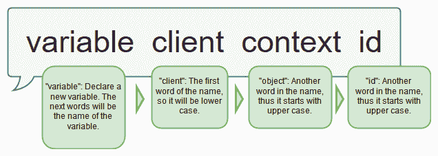
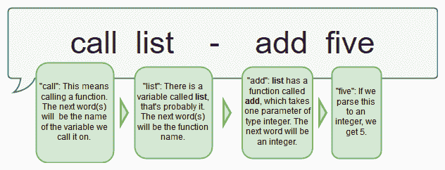
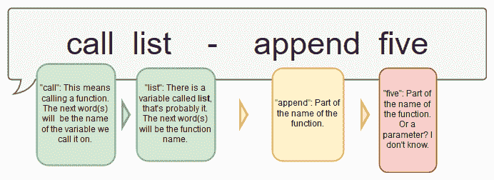

# 2019 年语音编程- LogRocket 博客

> 原文：<https://blog.logrocket.com/programming-by-voice-in-2019-3e1855f5add9/>

一些软件开发人员可能没有充分利用他们的双手，无论是由于像腕管综合症或其他原因的条件。对于这些开发人员来说，使用键盘和鼠标可能很困难，甚至是不可能的。我曾经写过 2017 年的[点语音编码的状态是什么样的，很遗憾，文章里的大部分东西都没有改变。语音编码不是一个快速发展的领域。](https://medium.com/bambuu/state-of-voice-coding-2017-3d2ff41c5015)

如果这是你第一篇关于语音编码的文章，我建议你阅读那篇文章，因为它涵盖了该领域的许多基础技术和方面。

尽管事情进展缓慢，但它们并没有停滞不前。让我们来看看过去两年的一些亮点，以及未来可能会带来什么。

### 技术正在进步

#### 语音识别准确性

通过声音控制电脑有一些基本要求。

其中一个要求是你的电脑能听懂你的话。以前，很难将语音准确度提高到不妨碍语音编码体验的水平。如果这种情况还没有改变的话，那么它即将改变。

随着你可以与之交谈的数字助理(如 Siri、Cortana、Alexa 和谷歌助手)越来越受欢迎，我们将继续看到计算机识别我们声音的准确性有所提高，即使是在嘈杂的环境中。

为了获得足够好的准确度，语音编码传统上需要非常昂贵的麦克风。我推荐的是一款 300 美元的 Audix OM7 舞台话筒——但它体积大，不实用，还需要一个放大器。

数字助理使用不同的策略来减少噪音。他们使用多个麦克风和一些强大的机器学习来区分噪音和声音。

目前，我还不知道你可以买到任何带有多个麦克风的耳机，但不久我们就会看到一些便宜的耳机，让我们在任何环境下都能高精度地听写。如果你现在正在寻找什么，除了 Audix，有人向我推荐了 [d:fine](https://www.dpamicrophones.com/dfine-headsets-and-earsets) 耳机和[斯特诺 SR](https://talktech.com/stenomask-steno-sr/) 麦克风。

这项技术发展很快，我预测在五年内，我们将会接近完美的语音识别。

#### 基本软件改进

今天，大多数可用的语音编码软件依赖于 Nuance 的 [Dragon](https://www.nuance.com/dragon.html) 语音识别软件和开源的蜻蜓框架。

蜻蜓以前没有被维护过(上一次提交是在三年前)——但是现在一个[分叉正在加速](https://github.com/dictation-toolbox/dragonfly)，并且已经被积极地维护了相当一段时间。

蜻蜓过去只能和老版本的 Dragon 一起工作，但是由于最近的一些发展，它现在可以和最新版本一起工作了。这意味着我们获得了前面提到的所有语音识别准确性的提高。

这些更新听起来可能不是特别有趣，但事实是，我能找到的几乎所有语音编码技术都是建立在“龙”和“蜻蜓”之上的。对这些库的任何改进都可能波及整个生态系统，为每个人提供更好的体验。

### 挑战者出现——塔龙简介

[Talon](https://talonvoice.com/) 是目前最有前景的免提编码项目。
它允许你以多种方式控制你的电脑。塔龙的开箱即用的语音编码非常令人想起[塔维斯拉德是如何做的](https://www.youtube.com/watch?v=8SkdfdXWYaI)。

许多短单词映射到字母和语法，这提供了很好的效率，但可能很难学习。Talon 还具有定义自己的规则的能力(当我说“X”时，做“Y”)。

如果仅此而已，那就很像使用许多已经存在的基于蜻蜓的解决方案。塔龙不止于此。首先，它允许你通过眼球追踪来控制你的鼠标。虽然通常眼球追踪代替鼠标有问题，因为眼睛很难专注于小物体，如链接或小按钮。

Talon 通过将眼球跟踪鼠标与声控变焦或头部跟踪结合起来进行精确移动，解决了这一问题。这里可以看到变焦[。](https://www.youtube.com/watch?v=VMNsU7rrjRI&list=PL2wTcyeSmhsbPZYt65mRiKSeuq6WU-rXZ&index=1)

后来的版本还带有内置的语音识别引擎，所以你不必花大价钱买一个 Dragon 许可证。创作者瑞安·希勒曼全职制作《塔龙》。

像任何事情一样，塔龙也有缺点。它目前只支持 MacOS，并且没有像我希望的那样得到很好的证明。然而，它确实有一个非常活跃的 Slack 社区，你可以在那里提问。

现在，Talon 绝对是一个值得关注的项目。你可以在这里看到它的作用[。](https://www.youtube.com/watch?v=HsodtJY0BX8&list=PL2wTcyeSmhsZuHqbSlLAxkroWIuIpExwx)

### 我剩下的任务怎么办？

在编辑器中输入文本只是编码的一小部分。我们还需要搜索网页、发送邮件、打开程序和控制终端。这些事情不像编程那样特殊，所以有一些不同的解决方案来管理这些事情。

让我们来看看一些不同的可用工具。


当然真正的问题是，哪一个会让你在 stackoverflow 上搜索最快。

[**KnowBrainer**](http://www.knowbrainer.com/) 是 Dragon 之上的一层，允许我们用命令扩展它，例如与 GUI 程序交互。它允许非常令人印象深刻的鼠标和键盘模拟。点击这里观看[的表演。](https://www.youtube.com/watch?v=IswK9r3KjRA)

[**发出命令**](http://redstartsystems.com/uttercommand) 让你在 Windows 文件系统和应用程序中高效导航。这是一种相当老的产品，但它完全不在我的注意范围内。我不确定它是否还能在现代版本的 windows 上工作，但他们的网站是语音输入相关知识的金矿。

[**Intag 语音界面**](http://voicecomputer.com/a-game-changing-speech-interface/) for [VoiceComputer](http://voicecomputer.com/) 是我见过的最有前景的东西之一。它将数字叠加在 Windows 程序的常规按钮上，这意味着你可以与几乎任何东西进行交互。鼠标控制通常是免提计算的弱点之一，但这可能会改变游戏规则。点击查看演示[。](https://youtu.be/yq2zXvLQXB0?t=50)

[**龙**](https://www.nuance.com/dragon.html) 自带浏览器插件，可以让你远程控制你的浏览器。

如果你没有使用 Dragon，或者你正在寻找基于他们的浏览器插件的东西，有一个由 handsfreecoding.org 的 James Stout 开发的很棒的浏览器插件。它叫做[非模态键盘导航](https://addons.mozilla.org/en-US/firefox/addon/modeless-keyboard-navigation/)，它可以让你通过快捷方式控制浏览器的大部分功能。
然后你可以把你的语音命令挂在这些快捷键上，通过语音控制你的浏览器。

### 编辑器和语言支持

你通常会看到很多用 Python 演示的语音编码。作为一门语言，Python 有很多非常强的地方。它很简洁，语法也很容易让人理解。

在我看来，任何适合语音编码的语言都需要两种不同的品质，正如我们将看到的，python 只有其中一种。

#### 用人类可读的名字命名事物的惯例

首先需要的是强大的约定。我们想要一种语言，其中有对变量大小写的约定，但也有对变量名使用“真实”单词的约定。我们来看看为什么。

假设我们想要声明一个变量:

```
var clientContextId = // whatever
```

声明这一点的语音命令的例子如下:
*“可变客户端上下文 id”*



这能“凑合”是因为这两个方面。大写的约定意味着我们知道变量名将会是驼峰式的。使用真实单词作为变量名的惯例意味着在我们必须拼写的地方没有冲突。我们只说我们想要的，我们可以让计算机解决剩下的问题。

* * *

### 更多来自 LogRocket 的精彩文章:

* * *

让我们看一下同一个例子，但是我们用缩写代替真实的单词。

我们想定义一个变量:

```
var client_ctx_id = // whatever
```

这里 ***ctx*** 是**上下文**的缩写。现在事情变得有点棘手，因为我们需要手动拼写它。一个示例语音命令可以是，*“可变客户端下划线 c，t，x，下划线，id”。*

更麻烦，也更不优雅。当我们开始使用我们不能发音的名字时，我们就输了。

### 静态类型系统

Python 是一种非常动态的语言——我们并不总是知道(或者关心)我们的变量是什么类型。然而，在编写代码时知道变量的类型，可以通过语音进行更智能的编码。

让我们举另一个假设的例子，用两种不同的语言向列表中添加一个数字。C#，有静态类型系统，Python 没有。

```
// C#
// the 'list' variable is defined somewhere else
list.add(5)
```

实现这一点的一种方式可以是这样说:*“呼叫列表增加五个”*



计算机会将其理解为“对列表变量调用 add 方法，将数字五(5)作为参数”

这非常令人愉快，但是它要求我们的编辑器理解我们现在在代码中的位置。它需要理解什么变量在范围内，对它们存在什么方法，以及它们采用什么参数。

让我们用一个 Python 例子来做同样的尝试:

```
#Python
#list is defined somewhere else
list.append(5)
```

如果我们像上面一样说*“调用列表追加五个”*，我们就无法弄清楚是否有一个名为`append`的方法将五作为参数，或者是否有一个名为`append_five`的方法，或者甚至“五”是一个数字还是一个字符串。



我们最终需要添加一些额外的单词，来解释函数名的终止位置和参数的开始位置。这个稍微长一点的命令的例子可以是，*“调用列表附加参数五”。*

这些例子都是假设的。不幸的是，现在还没有能与语音编码软件一起工作的编辑器。但在未来，我认为我们将能够从更易于分析的语言中获得更好的体验。

我们对语音识别中的错误也有更强的抵抗力。即使在上面的 C#示例中，计算机听到“**调用列表 bat** ”而不是“**调用列表 add** ”，它也能够调用正确的方法，因为“bat”相当接近“add”。

### 结论

语音编码仍在以合理的速度发展。我们即将达到语音识别尽善尽美的地步，然后我们只会受到编辑的限制。

在某种程度上，语音编码将超越简单地把我们的嘴当成键盘。但前提条件之一是我们的编辑器，甚至我们的语言，足够聪明让这种情况发生。

## 使用 [LogRocket](https://lp.logrocket.com/blg/signup) 消除传统错误报告的干扰

[](https://lp.logrocket.com/blg/signup)

[LogRocket](https://lp.logrocket.com/blg/signup) 是一个数字体验分析解决方案，它可以保护您免受数百个假阳性错误警报的影响，只针对几个真正重要的项目。LogRocket 会告诉您应用程序中实际影响用户的最具影响力的 bug 和 UX 问题。

然后，使用具有深层技术遥测的会话重放来确切地查看用户看到了什么以及是什么导致了问题，就像你在他们身后看一样。

LogRocket 自动聚合客户端错误、JS 异常、前端性能指标和用户交互。然后 LogRocket 使用机器学习来告诉你哪些问题正在影响大多数用户，并提供你需要修复它的上下文。

关注重要的 bug—[今天就试试 LogRocket】。](https://lp.logrocket.com/blg/signup-issue-free)