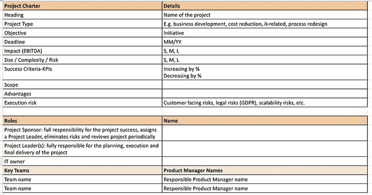

# 如何通过项目章程轻松传达您的项目愿景

> 原文：<https://blog.logrocket.com/product-management/project-charter-how-to-convey-project-vision/>

在我之前的文章中，我描述了我们如何可视化我们的项目任务。我们可以根据公司结构使用项目计划或项目路线图，但在开始项目之前，我们需要一份说明文件。

在动员会上展示项目想法有几种方法，但我认为你不必浪费时间来创建项目演示文稿、表格、报告等等。项目章程是你重新开始所需要的。

* * *

## 目录

* * *

## 什么是项目章程？

项目章程是一页纸的文件，描述你的项目动机。章程页面是每个项目创意成为新请求的起点，并指明您的目标、项目风险、优势、[和关键利益相关方](https://blog.logrocket.com/product-management/what-stakeholder-management-tools-techniques/)。

我们在每个项目中都使用 Excel 表格，以符合多团队的要求。章程(第一页)用于从较高的层面向利益相关方、高管、经理或启动会议成员解释项目。

与项目路线图或计划不同，我们不需要在这个表中添加每个细节。我们应该避免过度解释。超过一页会降低宪章的价值。这是一个快速取胜的网页，我们应该始终考虑到整体情况，而增加一个新的行。

在没有任何其他解释的情况下，人们应该能够在几分钟内看到项目章程并理解项目。假惺惺。就这么简单。

对于实现部分，我建议您创建一个新页面来“分阶段”执行项目。在一切开始之前，你可以展示重要的过程和迭代。这将有助于每个人从更广阔的视角看到项目的发展方向。

## 项目章程的用途是什么？

项目章程旨在回答我们为什么需要这个项目，以及我们将在截止日期结束时完成什么。它还用于与业务团队就项目范围、来源和最终期限进行高层交流。

我们可以把它的用法在观念接受之前和之后分开。正如我之前所描述的，验收之前是用来解释我们应该开始这个项目的内容和原因。对利弊、风险和优势的总结有助于我们展示我们的目标。

验收后，章程[显示了我们在项目时间表中应该领导](https://blog.logrocket.com/product-management/what-are-okrs-how-to-write-templates-examples/)的共同目标和目的。将决定所需资源和关键成员，并承诺具体的截止日期。因此，我们可以说这是每个利益相关者都应该遵守的契约。

## 谁通常会撰写项目章程？

项目章程是由创意所有人创建的，但整个业务团队会创建一个包含业务影响和收入点的图表。该文档基本上是创意所有者对项目的第一份陈述。在协调和启动之后，项目章程对于创意负责人显示关键成员和相关人员列表仍然很重要。

作为一个产品经理，一旦我有了一个新的想法，我也会创建一个项目章程，并用例子来写问题，我解决问题的动机，以及它的优点。项目章程没有界限，每个人都可以创建一个来解释他们的想法。

## 如何创建项目章程

正如我前面所描述的，一页的表格对于项目章程就足够了。您可以使用包含所需元素的简单模板，如下所示:

| **元素** | **描述** |
| 标题 | 项目名称 |
| 项目类型 | 该字段应从产品愿景模板中选择。你应该为你的项目设定一个目标，并根据你的年度产品愿景来区分这些项目。例如，降低成本是一个产品愿景，可以根据项目类型从项目池中选择项目。你的项目创意可以解决一个问题，一个流程，或者实现一个全新的逻辑。这个领域在那方面很重要，每个人都可以直接理解这个概念 |
| 目标 | 项目的主动性和约束条件可在此字段中说明 |
| 截止日期 | 时间或季度信息。这将是业务交付日期的期望值。截止日期可以显示整个项目的交付日期或特定的 MVP 范围。当然，截止日期可能会随着时间的推移而改变，但是我们应该意识到，一旦我们开始项目，我们就是在向业务团队做出承诺 |
| 影响(EBITDA) | Budget, revenue, and business impact can be used according to the company’s vision. You can also use the same legend [from the project roadmap (S, M, L) template](https://docs.google.com/spreadsheets/d/1QN9Yn0l-ie4baF4aPDcrEw9i_5xEcgdkQ3VXAalBig8/edit#gid=1870897008).例如，不到 10 万美元= S，10 万美元–50 万美元= M |
| 规模/复杂性/风险 | This field will be the project’s complexity and risk statement. [You can use the same legend from the roadmap (S, M, L) template](https://docs.google.com/spreadsheets/d/1QN9Yn0l-ie4baF4aPDcrEw9i_5xEcgdkQ3VXAalBig8/edit#gid=1870897008).例如，一个团队资源需要一个月的努力= S，多个团队需要一个月的努力= M |
| 成功标准 KPI | Our goals to achieve the objective will be explained with numbers. This field will show us when to stop or decide if the project is successful. Be careful when you are selecting your success criteria because they all should be measurable KPIs. I suggest comparing it with earlier numbers. If people know the effect your idea will have on the product’s/company’s success, they will have more motivation to support your project:将 X 流程性能提高%将 Y 流程的客户取消减少% |
| 范围 | 此处列出了高水平的要求。我们应该调整的部件可以列成一个粗略的清单。我们可以在带有迭代细节的阶段化文档中添加范围项目符号。我们不必在一次迭代中交付所有的范围。产品经理可以根据范围的高级需求创建 MVP 或原型范围。 |
| 优势 | 完成这个项目后，我们会有什么收获？将列出范围的结果。您可以添加一个利弊部分来更详细地讨论。我认为列出优势比显示收入更重要。我们有一个陈述、一个想法或一个问题，我们必须尽可能多地润色项目的理由 |
| 执行风险 | This is where to explain the concepts we should be aware of before the project’s execution. We can see the bottlenecks and go-live problems in this field. The IT owner can lead this part with the project owner.例如， 面向客户的风险、法律风险(GDPR)、可扩展性风险等。 |
| 角色 | 你应该列出负责团队成员的角色和团队，以展示你的项目团队。尽快了解负责的成员是至关重要的，这样你就可以在开始前讨论细节。

*   **项目发起人:** 全面负责项目的成功，指派项目负责人，消除风险，并定期评审项目
*   **项目负责人:** 全面负责项目的计划、执行和最终交付
*   **IT 负责人:** 全面负责项目的开发、集成、部署和端到端测试。
*   **关键成员:负责某一特定流程的成功、计划，以及流程的最终交付。关键成员大多是从产品经理中挑选出来的，因为他们负责从他们的 backlog 中交付新的特性，并且他们是他们领域的决策者。**

 |

## 项目章程模板

我创建了一个宪章模板(如下所示)供免费下载和使用！这些都是我认为有助于包含在项目章程中的部分和细节。这不需要什么特别的东西，但是这是保持有条理的好方法:

[您可以通过此链接](https://docs.google.com/spreadsheets/d/1TzDlodDHeo2goPCP_NJbLFF9iBpLkOZ7yyvbVj-7YeY/edit#gid=0)下载章程模板。

## 在项目文件中加入项目阶段划分的重要性

一旦你把你的想法文档创建成一个章程，你可以清楚地看到在一个阶段交付所有东西几乎是不可能的。你要做的很简单，将你的范围作为一个总结添加到章程中，并准备一个优先级列表。某些阶段划分和 MVP 范围是由产品经理创建的，但是您可以表明您对项目路线图的观点。

阶段页面是路线图的简短版本。创意拥有者可以清晰详细地展示愿景。这些元素如下所示:

*   时间表
*   描述
*   影响
*   技术努力
*   KPI
*   关键里程碑
*   高级需求

我在示例模板中添加了以下阶段表:

MVP(原型)和附加的两个阶段可以概括，但是试图定义第三和第四个阶段是不必要的。在第一或第二阶段之后，你会看到项目的实际结果，项目本身也可以改变。

## 如何向风险承担者展示您的项目章程

一旦您最终确定了章程并在高水平上逐步实施，就到了向主要成员介绍您的想法的时候了。章程和阶段表是每个人理解这个想法的好材料，但它们不足以说明所有问题。

这就产生了一个瓶颈:我们是应该增加解释，降低可读性，还是应该让读者蒙在鼓里？在陈述我的想法时，我试着为赞成、反对和选择创建一个额外的表格。这些表格有助于显示我已经想到但出于某种原因被排除的其他选项。你会得到很多关于你的结论的问题，所以你应该准备好你已经考虑过的一切。

例如，如果你有“为什么我们应该投资你的想法”这样的问题，下面的汇总表可以帮你解决。

从你可以给出的选项开始，包括描述和细节(如果需要的话)。继续讨论你的正反两方面的选择。这种流动将帮助他们理解你来自的路径，并到达与你相同的点。

如果你也在表格中添加了数据，我想不出比这更好的辩护理由了:

假设你有额外的选择，但挑战更占主导地位。你可以把它们列在下表中，让每个人都知道你在参加会议之前已经考虑了很多可能性，评估了所有风险:

在我之前的公司里，展示你的想法有严格的规定。带有需求的项目 word 文档意味着要写几十页。在 word 文档之后，您应该准备一个 PowerPoint(带有公司特定的模板)来总结 word 文档。

相信我，因为文件的负担，我有时没有提出我的想法。我们生活在这样一个时代，人们说如果你不能在三个月内完成你的产品，你甚至不应该开始它。作为领导/经理，我们的工作是让我们的团队尽可能多地创造。不是为了制造新的麻烦。

有些人喜欢使用像 Miro、Ideaboardz、Creately、Lucidchart 等这样的创意板。我完全建议你用 Miro 来进行你的头脑风暴或事件风暴活动。此外，Lucidchart 是我最喜欢的创建流程和展示过程，以支持我的项目想法。

* * *

订阅我们的产品管理简讯
将此类文章发送到您的收件箱

* * *

有几十种易于使用的免费工具可以让你的团队有创造力。不要给他们增加不必要的负担，他们已经有日常工作了。

## 结论

您可以使用项目管理工具创建项目章程和阶段划分，但是我发现 Excel 对于跟踪项目非常有用。我只能建议你使用你觉得更舒服的工具。

对于敏捷公司来说，花哨的演示或文档可能很耗时，所以专注于你的想法，相信你收集的数据——而不是一个闪亮的模板。更加以数据为导向，向利益相关者展示你的想法的影响！

找到我创建一个开始文件，我将非常乐意帮助你🙂

*精选图片来源:[icon scout](https://iconscout.com/icon/file-3250251)*

## [LogRocket](https://lp.logrocket.com/blg/pm-signup) 产生产品见解，从而导致有意义的行动

[LogRocket](https://lp.logrocket.com/blg/pm-signup) 确定用户体验中的摩擦点，以便您能够做出明智的产品和设计变更决策，从而实现您的目标。

使用 LogRocket，您可以[了解影响您产品的问题的范围](https://logrocket.com/for/analytics-for-web-applications)，并优先考虑需要做出的更改。LogRocket 简化了工作流程，允许工程和设计团队使用与您相同的[数据进行工作](https://logrocket.com/for/web-analytics-solutions)，消除了对需要做什么的困惑。

让你的团队步调一致——今天就试试 [LogRocket](https://lp.logrocket.com/blg/pm-signup) 。

[Zeynep Cansu Yildirim Follow](https://blog.logrocket.com/author/zeynepcansuyildirim/) I am an experienced PM of 5+ years with 9+ years of analyst and leadership experience in software companies, currently working as a PM in an e-commerce company. I am an Electric and Electronic Engineer with a Masters in Engineering Management. In my social life, I like skiing, kitesurfing, boxing, and am a professional horse rider in show jumping competitions.