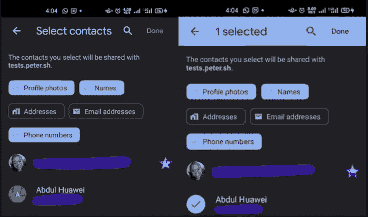
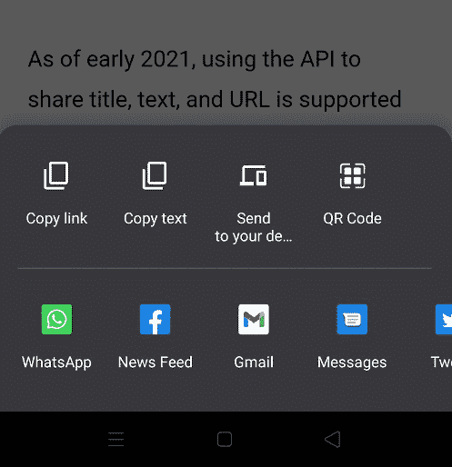
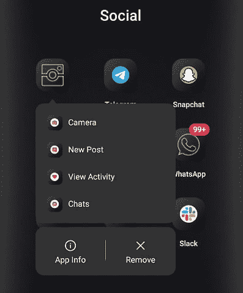

# 河豚项目:在你的 PWA - LogRocket 博客中尝试 5 种新的 API

> 原文：<https://blog.logrocket.com/project-fugu-5-new-apis-to-try-out-in-your-pwa/>

web 平台对软件开发人员、产品所有者和利益相关者都很有吸引力，因为它的覆盖范围和普遍可访问性。无论设备类型或操作系统如何，强大的 web 应用程序都可以在任何地方工作。现在，当与 PWA 结合时，web 应用程序获得了离线访问的额外好处，以及以前只有在本机平台上才有的其他功能。

尽管自 2015 年由谷歌推广以来，pwa 已经取得了很大进展，但仍有很长的路要走。为了不断缩小网络与本地之间的差距，谷歌、微软、英特尔和其他一些公司共同发起了“网络能力项目”或通常被称为[项目 Fugu](https://fugu-tracker.web.app/) 的项目，目标只有一个:

> Web 应用应该能够做任何本地应用能做的事情

在本文中，我们将了解 Project Fugu 最近发布的五个新 API，它们帮助开发人员在 web 上构建功能全面的应用程序。

## 联系 API

与本地应用程序一样，[联系人 API](https://github.com/WICG/contact-api/) 让你可以访问用户的联系人列表(当然是在他们允许的情况下)。例如，让我们假设您正在构建一个 web 应用程序，帮助人们为他们的朋友提供随机的有思想的消息。

以前，如果你想向联系人列表中的成员发送在网络应用程序中生成的消息，你必须复制消息，切换屏幕到你的电话联系人，选择目标联系人，点击发送消息，粘贴文本，然后发送。有了新的联系人 API，您现在可以添加选项，让用户自动从联系人列表中选择一个联系人来发送生成的消息，而不是手动复制、查找接收联系人、粘贴，然后发送。

有了联系人 API，就不需要切换屏幕了。应用程序开发人员可以从他们的应用程序中添加选择联系人权限的选项。你不必复制粘贴，也不必切换应用程序。



关于这个 API，您应该知道一些事情:

*   它只能通过安全上下文(即 https)或本地主机进行访问以进行测试
*   它适用于 Chrome 80 及更高版本
*   它目前只能在 Android 上运行，至少需要 Android M (6.0.1)
*   它是在考虑安全性的基础上构建的，以确保浏览器只共享用户选择的内容
*   它只能通过点击或轻拍等手势来触发，以确保网站不会在没有任何上下文的情况下随机显示选取器
*   没有*批量选择*或*全选*选项

要开始使用联系 API:

```
const sendMessage = async() => {
  const isSupported = ('contacts' in navigator && 'ContactsManager' in window);
  const availableProperties = await navigator.contacts.getProperties();
  if(isSupported && availableProperties.includes('tel')){
    try{
      const props = ['name','tel',];
      const opts = {multiple: true};
      const contacts = await navigator.contacts.select(props, opts);
      functionToSendMessageToSelectedContacts(contacts);
    }catch{
      //handle any errors
    }
  }else{
    alert('Contacts API not supported in this browser, please copy and paste message instead')
  }
}
```

`navigator.contacts.getProperties`方法返回一个承诺，该承诺解析为包含特定浏览器支持的联系人属性的字符串数组，比如(`name`、`email`、`tel`、`address`、`icon`)。`navigator.contacts.select`做两件事——当被调用时，它返回一个承诺并显示联系人选择器，允许用户选择他们想要与站点共享的联系人。在选择了要共享的联系人并点击 *Done* 之后，promise 将通过用户选择的一组联系人进行解析。它接受两个参数——应该为每个联系人返回的属性数组和一个用于指定是否可以选择多个联系人的多重指示器。

要查看运行中的 Contact API，请查看这个[演示应用程序](https://tests.peter.sh/contact-api/)。

## Web 共享目标 API

第一次发布的[网络共享 API](https://developer.mozilla.org/en-US/docs/Web/API/Navigator/share) 是在 Android 的 Chrome 61 中推出的，它允许网站使用设备的原生共享功能，将文本数据共享到用户选择的任何支持的目的地。这是通过`navigator.share()`方法实现的，该方法接收一个对象，该对象包含一个`url`和/或`text`属性以及一个可选的`title`属性:

```
shareButton.addEventListener("click", async () => {
  if(navigator.share){
    try {
        await navigator.share({
          title: "5 Developer NewsLetters to help you grow as a frontend developer ",
          url: "https://www.codewithlinda.com/blog/developer-newsletters-to-help-you-grow/",
          text:"Discover 5 new newsletters that will help you grow in your career"
});
       console.log("Data was shared successfully");
    }catch (err) {
       console.error("Share failed:", err.message);
    }
    }else{
      console.log("Share not supported")
   }
});
```

像所有其他敏感的 API 一样，share 方法只能通过手势触发，以防止滥用。当用户单击 share 按钮时，调用`navigator.share()`方法，它触发用户的设备共享目标选择器弹出，然后返回一个承诺，当用户选择一个应用程序进行共享时，该承诺会解决。



过了一段时间，Web Share API 增加了一项功能，通过添加一个接受共享文件数组的`files`属性，允许共享文本旁边的文件。这一新增功能被标记为 [Web Share API Level 2](https://web.dev/web-share/) ，并被发布到 Android 上的 Chrome 75 及更高版本:

```
if (navigator.canShare && navigator.canShare({ files: [...files] })) {
  try{
      await navigator.share({
         files: [...files],
         title: 'Pictures',
         text: 'Our Pictures.',
      })
     console.log('Share was successful.')
   }catch(error){
     console.log('Sharing failed', error)
   }
} else {
  console.log(`Your system doesn't support sharing files.`);
}
```

`navigator.canShare()`方法检查浏览器是否可以共享目标文件。

在撰写本文时， [Chrome 不支持 PDF 文件的共享](https://bugs.chromium.org/p/chromium/issues/detail?id=1006055)(参见 Chrome 允许的文件类型扩展名)。

注意，传递给`files`属性的文件应该是以 [JavaScript 文件对象](https://developer.mozilla.org/en-US/docs/Web/API/File/File)的形式，就像从`<input type='file'>`中检索的一样。

这里有一个 Web 共享 API 级和 2 级的演示。另外，查看当前浏览器支持表[这里](https://caniuse.com/?search=share%20api)。

这还不是全部，为了让网络共享更上一层楼，Android 上的 Chrome 71 和 Chrome 75 发布了 Web Target API Level 1 和 2。 [Web 目标共享 API](https://github.com/w3c/web-share-target/blob/main/docs/explainer.md) 允许已安装的 pwa 位于共享的接收端。现在，已安装的 PWAs 不仅可以提供共享内容，还可以接收共享内容。

为此，您首先需要将您的应用程序注册为清单文件中的共享目标:

```
//In manifest.json
{
  "share_target": {
    "action": "share.html",
    "params": {
      "title": "name",
      "text": "description",
      "url": "link"
    }
  }
}
```

action 属性指定处理 PWA 中共享内容的 URL。你如何决定[处理传入的共享数据](https://justmarkup.com/articles/2020-02-11-share-images-to-your-website/)实际上取决于你和你的应用程序做什么。

要查看 Web 共享目标 API 的运行情况，请查看这个[演示应用程序](https://scrapbook-pwa.web.app/)。对于浏览器支持，Android 上的 Chrome 和 Edge 76 或更高版本以及 Chrome OS 上的 Chrome 89 或更高版本支持 Web Share 目标 API(在撰写本文时)。

## 应用快捷方式 API

如果长按移动设备上的某个应用程序图标，会弹出一个快捷方式列表。例如，如果你长按设备上的 Instagram 启动器图标，就会弹出一个列出相机、新帖子、活动和聊天的面板。



这正是 Chrome 84 for Android 和 Chrome 85 for Windows 中发布的[应用快捷方式 API](https://github.com/MicrosoftEdge/MSEdgeExplainers/blob/main/Shortcuts/explainer.md#shortcuts-explainer) 为 PWAs 所做的事情。开发人员现在可以快速访问用户在其应用程序中经常执行的常见操作。应用程序快捷方式的出现被认为可以提高用户的工作效率，并增加他们对 web 应用程序的参与度。

要向 PWA 添加应用程序快捷方式，请向清单文件添加一个`shortcuts`条目。例如，如果你正在构建一个股票投资网络应用程序，你的快捷方式可以包括“购买股票”、“出售股票”和“存款”:

```
//in manifest.json
"shortcuts": [    
    {  
      "name": "Buy Shares",  
      "url": "/buy-shares?utm_source=homescreen",     
    },
    {  
      "name": "Sell Shares",  
      "url": "/sell-shares?utm_source=homescreen",     
    },  
    {  
      "name": "Deposit Funds",  
      "url": "/deposit-funds?utm_source=homescreen",     
    },     
]
```

`shortcuts`清单条目是一个包含各个快捷方式信息的对象数组。每个快捷方式对象应该有一个`name`和`url`属性，可以有也可以没有可选的`short-name`、`description`和`icon`属性。

关于这个 API，您应该知道一些事情:

*   它仅适用于已经安装在用户设备上的 PWAs
*   应用程序快捷菜单通过平台特定的手势触发。对于 Android，长按应用程序，对于 Windows，右键单击任务栏上的应用程序图标

使用此链接查看[当前浏览器支持](https://caniuse.com/?search=manifest%3A%20shortcuts)。要查看应用程序的快捷方式，请看这个[演示应用程序](https://app-shortcuts.glitch.me/)。

## 碰撞 api

你可能见过那些显示在手机或桌面上应用程序图标右上角的数字，指示应用程序中存在多少未读消息、通知或更新。这些通常作为视觉线索，让用户打开应用程序，看看有什么在等着，这增加了参与度。好消息是，有了新的标记 API，您现在可以将相同的功能添加到 PWAs 中。


[标记 API](https://github.com/w3c/badging/blob/main/explainer.md) 提供了两种方法——`navigator.setAppBadge`和`navigator.clearAppBadge`。`navigator.setAppBadge(value)`方法将徽章的值设置为传递给它的`value`参数的值，而`navigator.clearAppBadge()`移除应用程序的徽章:

```
if( "setAppBadge" in navigator && "clearAppBadge" in navigator){
   try{
      await navigator.setAppBadge(badgeCount)
   }catch(error){
      //handle errors here
   }
}
```

你如何决定为你的 PWA 实现徽章真的取决于你和你想用你的应用程序实现什么。

在撰写本文时，Badging API 还不能在移动设备上运行，但它目前可以在 Windows 和 macOS、Chrome 81 以及 Edge 84 或更高版本上运行。此处见当前浏览器支持表[。](https://caniuse.com/?search=Notification%20API%3A%20badge)

要查看运行中的徽章 API，请访问这个[演示应用](https://badging-api.glitch.me/)。

## 屏幕唤醒锁定 API

根据用户定义的设备设置，设备可能会在空闲几分钟或没有收到任何用户手势(如点击或触摸)后进入睡眠状态。这种行为可能会令人沮丧，特别是当你使用虚拟体验应用程序时，这些应用程序要求你只是观看或观察，而没有任何交互。你必须不时地点击或触摸屏幕，以防止屏幕变暗并最终熄灭。这类应用程序的例子有虚拟旅游应用程序、演示应用程序或跟进食谱应用程序。

防止屏幕进入睡眠状态的功能只有本机应用程序才有。在 [Screen Wake Lock API](https://web.dev/wake-lock/) 之前，web 开发人员不得不求助于黑客、易受安全威胁且耗电的解决方案来实现这种行为。

要激活屏幕锁定:

```
let wakelock = null;
const requestWakeLock = async () => {
  if ('wakeLock' in navigator) {
      try {
        wakeLock = await navigator.wakeLock.request();
      catch (err) {
        console.error(`${err.name}, ${err.message}`);
    }
  }
}
```

与以前的 API 不同，这个 API 不需要激活用户手势。`navigator.wakeLock.request()`方法用于请求屏幕唤醒锁定。如果请求成功，它返回一个解析为`WakeLockSentinel`对象的承诺。`wakelock`变量用于保存对`WakeLockSentinel`对象的引用，因为稍后您可能需要访问它的一些方法和属性。

为了延长电池寿命，建议在屏幕锁定完成后将其释放。例如，在虚拟旅游应用程序的情况下，应该在旅游结束时释放屏幕锁定。这可以通过使用`WakeLockSentinel`对象的`release`方法来完成:

```
wakeLock.release();
wakeLock = null;
```

释放屏幕锁定，并通过将变量`wakeLock`设置回 null 来释放对现有`WakeLockSentinel`对象的引用。

根据屏幕唤醒锁 API 生命周期，当具有活动屏幕锁定的页面或窗口被最小化或切换时，屏幕唤醒锁将自动释放。要重新获得屏幕唤醒锁，请监听`[visibilitychange](https://developer.mozilla.org/en-US/docs/Web/API/Document/visibilitychange_event)`事件:

```
const handleVisibilityChange = async () => {
    if (wakeLock !== null && document.visibilityState === 'visible') {
        await requestWakeLock();
    }
};

document.addEventListener('visibilitychange', handleVisibilityChange);
```

首先，检查是否存在现有的`WakeLockSentinel`对象引用，以及页面是否可见，以确保我们仅在目标页面或窗口再次变为活动时重新获取屏幕唤醒锁。

要查看`WakeLockSentinel`对象的样子，您可以在浏览器的控制台上运行`await navigator.wakeLock.request()`。

要查看屏幕唤醒锁定 API 的运行情况，请查看这个[演示 web 应用程序](https://wake-lock-demo.glitch.me/)。查看当前浏览器支持表[这里](https://caniuse.com/?search=Screen%20Wake%20Lock%20API)。

## 结论

在本文中，向您介绍了五个激动人心的 API，它们将帮助您构建功能更好的 pwa。现在，去建造一些伟大的东西吧！

## 使用 [LogRocket](https://lp.logrocket.com/blg/signup) 消除传统错误报告的干扰

[](https://lp.logrocket.com/blg/signup)

[LogRocket](https://lp.logrocket.com/blg/signup) 是一个数字体验分析解决方案，它可以保护您免受数百个假阳性错误警报的影响，只针对几个真正重要的项目。LogRocket 会告诉您应用程序中实际影响用户的最具影响力的 bug 和 UX 问题。

然后，使用具有深层技术遥测的会话重放来确切地查看用户看到了什么以及是什么导致了问题，就像你在他们身后看一样。

LogRocket 自动聚合客户端错误、JS 异常、前端性能指标和用户交互。然后 LogRocket 使用机器学习来告诉你哪些问题正在影响大多数用户，并提供你需要修复它的上下文。

关注重要的 bug—[今天就试试 LogRocket】。](https://lp.logrocket.com/blg/signup-issue-free)