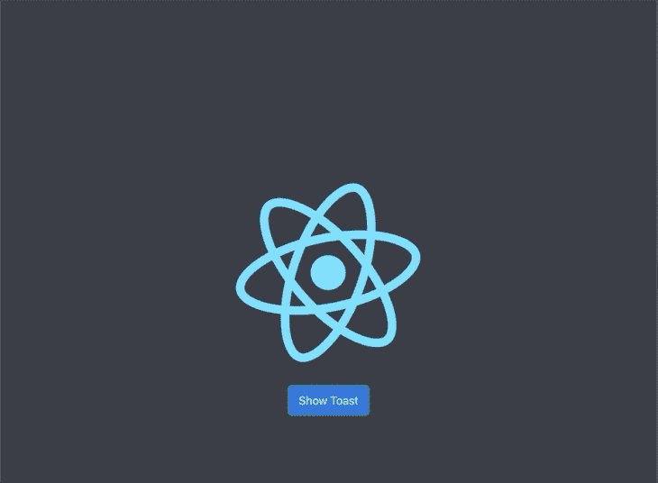
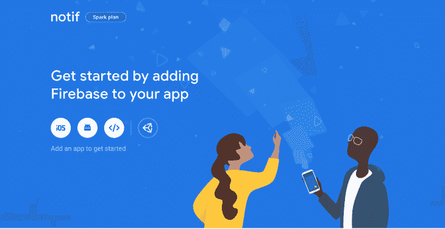
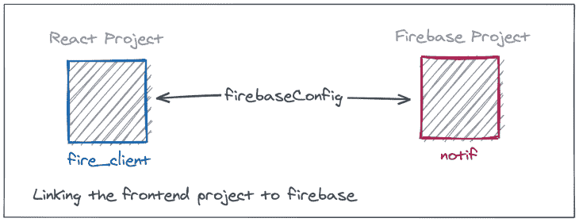
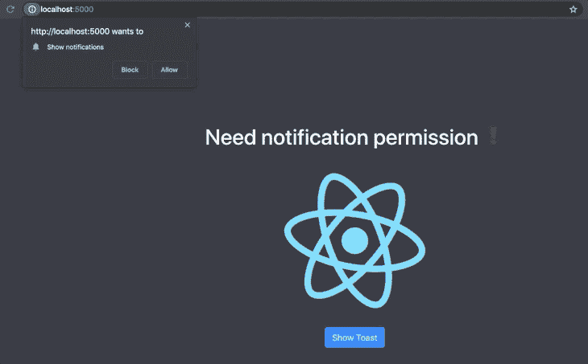
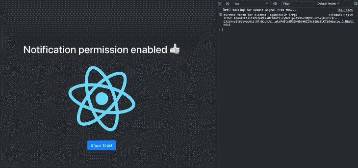
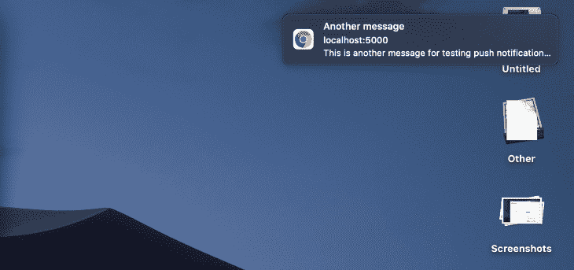

# 使用 React 和 Firebase - LogRocket 博客推送通知

> 原文：<https://blog.logrocket.com/push-notifications-react-firebase/>

***编者按:*** *本文更新于 2022 年 3 月 17 日，包含了 Firebase 的最新变化。*

## 介绍

Firebase 是谷歌在 2014 年收购的一家公司。自那以后，谷歌对该平台进行了多次改进，现在它将 Firebase [作为其移动应用的一站式后端即服务解决方案](https://cloud.google.com/solutions/mobile/mobile-app-backend-services)。

在几个谷歌解决方案中，如作为 Firebase 保护伞的一部分的[集中式认证](https://blog.logrocket.com/user-authentication-firebase-react-apps/)，实时数据库和云功能(谷歌的 AWS Lambda)，有一个脱颖而出，成为管理应用程序通知的首选解决方案: [Firebase 云消息(FCM)](https://blog.logrocket.com/using-firebase-cloud-messaging-as-a-pub-sub-service/) ，以前的谷歌云消息(GCM)。

在今天的文章中，我们将探讨如何在前端 React 应用程序中启用推送通知。

### 内容

## React 应用程序设置示例

出于本文的目的，我们将使用用 [Create React app](https://blog.logrocket.com/getting-started-with-create-react-app-d93147444a27/) 创建的骨架 React App。

因此，让我们创建一个名为`firebase-notifications`的文件夹，并在其中运行以下命令(确保您已经安装了 npm 和 npx):

```
npx create-react-app fire_client

```

这就创建了一个基本的 React 应用程序。要运行应用程序，让`cd`进入文件夹并运行`npm run start`,以便应用程序在本地主机上启动，我们会看到这个熟悉的页面:


现在，让我们添加集成 Firebase 云消息客户端功能的依赖项，以及获取一些基于[引导的](https://blog.logrocket.com/whats-new-bootstrap-5-1-0/) React UI 组件的`react-bootstrap`:

```
npm install --save firebase react-bootstrap bootstrap

```

### 自举设置

完成后，让我们像这样修改`src/App.js`文件:

```
import logo from './logo.svg';
import './App.css';
import {useState} from 'react';
import {Button, Row, Col, Toast} from 'react-bootstrap';
import 'bootstrap/dist/css/bootstrap.min.css';

function App() {

  const [show, setShow] = useState(false);
  return (
    <div className="App">
        <Toast onClose={() => setShow(false)} show={show} delay={3000} autohide animation style={{
          position: 'absolute',
          top: 20,
          right: 20,
        }}>
          <Toast.Header>
            
            <strong className="mr-auto">Notification</strong>
            <small>12 mins ago</small>
          </Toast.Header>
          <Toast.Body>There are some new updates that you might love!</Toast.Body>
        </Toast>
      <header className="App-header">
        
        <Button onClick={() => setShow(true)}>Show Toast</Button>
      </header>
    </div>

```

我们已经用一个**显示 Toast** 按钮将引导 CSS 导入到`App.js`中，这个按钮会弹出一个 Toast 通知，3 秒后自动隐藏。这是它的样子:



有了这个，我们现在可以移动到 Firebase 设置。

### Firebase 设置

在 Firebase 控制台中登录或注册，然后点击**添加项目**。按照以下步骤添加项目:

*   给项目起一个合适的名字
*   根据您的偏好启用或禁用分析
*   等待安装完成

完成后，重定向到项目主屏幕，看起来应该是这样的:



现在我们需要在 Firebase 项目和 React 应用程序之间创建一个链接，这是我们之前用 Firebase 项目配置创建的。在前面截图中可见的 iOS、Android 和 web 选项中，单击 web 图标。

这将我们带到**注册应用程序**用户界面:


给我们之前创建的 React 应用指定一个昵称，然后点击**注册应用**按钮。等待一段时间，屏幕会生成一个配置，我们很快会将它集成到 React 应用程序中。

最终生成的配置应该是这样的:


`firebaseConfig`对象将被集成到我们的 React 应用程序中，这将把它链接到这个特定的 Firebase 项目。

## 链接项目



让我们在 React 代码库中创建一个名为`firebase.js`的新文件，并添加以下代码行:

```
import { initializeApp } from 'firebase/app';
var firebaseConfig = {
  apiKey: "YOUR_API_KEY",
  authDomain: "YOUR_AUTH_DOMAIN",
  projectId: "YOUR_PROJECT_ID",
  storageBucket: "YOUR_STORAGE_BUCKET",
  messagingSenderId: "YOUR_MESSAGING_SENDER_ID",
  appId: "YOUR_APP_ID"
};

initializeApp(firebaseConfig);

```

确保用上一步生成的替换`firebaseConfig`。在`App.js`中导入`firebase.js`文件现在可以将两个项目链接在一起。

## 集成云消息传递

接下来，我们需要生成一个 web 推送证书密钥。导航到您项目的[云消息](https://console.firebase.google.com/u/0/project/_/settings/cloudmessaging)选项卡，并滚动到 **Web 配置**部分。

在 **Web 推送证书**下，点击**生成密钥对**。请注意生成的密钥。


回到`firebase.js`文件，我们现在需要启用消息传递。将此行添加到导入:

```
import { getMessaging, getToken, onMessage } from "firebase/messaging";

```

然后，我们可以从`firebase`对象访问消息对象，如下所示:

```
const firebaseApp = initializeApp(firebaseConfig);
const messaging = getMessaging(firebaseApp);

```

### 通知权限和注册客户端

为了向浏览器发送推送通知，我们首先需要获得用户的许可。当我们这样做时，它会打开“启用通知？”您可能在其他网站上见过的弹出窗口。

发起该请求的方法是调用 Firebase 提供的`getToken`方法。在此之前，让我们向`App.js`文件的状态添加一个变量，它将跟踪我们是否有权访问通知:

```
const [isTokenFound, setTokenFound] = useState(false);
getToken(setTokenFound);

// inside the jsx being returned:
{isTokenFound && 
 Notification permission enabled 👍🏻 
}
{!isTokenFound && 
 Need notification permission ❗️ 
}

```

现在，将`getToken`函数添加到`firebase.js`中:

```
export const getToken = (setTokenFound) => {
  return getToken(messaging, {vapidKey: 'GENERATED_MESSAGING_KEY'}).then((currentToken) => {
    if (currentToken) {
      console.log('current token for client: ', currentToken);
      setTokenFound(true);
      // Track the token -> client mapping, by sending to backend server
      // show on the UI that permission is secured
    } else {
      console.log('No registration token available. Request permission to generate one.');
      setTokenFound(false);
      // shows on the UI that permission is required 
    }
  }).catch((err) => {
    console.log('An error occurred while retrieving token. ', err);
    // catch error while creating client token
  });
}

```

注意我们是如何将`setTokenFound`函数传递给`getToken`函数的。这样我们就可以跟踪我们是否获得了客户端令牌(即，是否提供了通知许可)。当我们现在保存并执行代码时，会弹出一个请求通知的窗口:



当与消息传递对象一起提供时，`getToken`方法显示通知的 UI，等待用户输入，并在允许的情况下，为客户机分配一个惟一的令牌，这个令牌可以在控制台中看到:



## 配置消息监听器

### 后台监听器

既然我们已经在浏览器端获得了通知权限和对客户机令牌的引用，下一步就是向指向客户机的传入推送通知添加一个侦听器。

为此，我们在 React 应用程序的 public 文件夹中添加了一个`firebase-messaging-sw.js` service worker 文件，然后添加了以下代码:

```
// Scripts for firebase and firebase messaging
importScripts('https://www.gstatic.com/firebasejs/9.0.0/firebase-app-compat.js');
importScripts('https://www.gstatic.com/firebasejs/9.0.0/firebase-messaging-compat.js');

// Initialize the Firebase app in the service worker by passing the generated config
var firebaseConfig = {
  apiKey: "YOUR_API_KEY",
  authDomain: "YOUR_AUTH_DOMAIN",
  projectId: "YOUR_PROJECT_ID",
  storageBucket: "YOUR_STORAGE_BUCKET",
  messagingSenderId: "YOUR_MESSAGING_SENDER_ID",
  appId: "YOUR_APP_ID"
};

firebase.initializeApp(firebaseConfig);

// Retrieve firebase messaging
const messaging = firebase.messaging();

messaging.onBackgroundMessage(function(payload) {
  console.log('Received background message ', payload);

  const notificationTitle = payload.notification.title;
  const notificationOptions = {
    body: payload.notification.body,
  };

  self.registration.showNotification(notificationTitle,
    notificationOptions);
});

```

注意我们是如何将脚本的`compat`版本与`importScripts`一起使用的。这是因为我们获得了 Firebase v8 兼容的服务人员脚本。如果我们得到了 v9 脚本，我们需要一个额外的编译步骤，因为它们不能与 ES 模块一起工作。这也是为什么我们将服务人员内部的代码保持为 Firebase v8 风格而不将其更改为 v9 的原因。

这段代码将处理应用程序不在前台时收到的所有通知。

### 前台监听器

为了处理应用程序在前台活动的情况，我们需要将这段代码添加到`firebase.js`文件中:

```
export const onMessageListener = () =>
  new Promise((resolve) => {
    onMessage(messaging, (payload) => {
      resolve(payload);
    });
});

```

我们还需要将它导入到`App.js`中，并添加逻辑以从解析的有效负载中创建通知，如下所示:

```
function App() {

  const [show, setShow] = useState(false);
  const [notification, setNotification] = useState({title: '', body: ''});
  const [isTokenFound, setTokenFound] = useState(false);
  getToken(setTokenFound);

  onMessageListener().then(payload => {
    setShow(true);
    setNotification({title: payload.notification.title, body: payload.notification.body})
    console.log(payload);
  }).catch(err => console.log('failed: ', err));

  return (
    <div className="App">
        <Toast onClose={() => setShow(false)} show={show} delay={3000} autohide animation style={{
          position: 'absolute',
          top: 20,
          right: 20,
          minWidth: 200
        }}>
          <Toast.Header>
            
            <strong className="mr-auto">{notification.title}</strong>
            <small>just now</small>
          </Toast.Header>
          <Toast.Body>{notification.body}</Toast.Body>
        </Toast>
      <header className="App-header">
        {isTokenFound && <h1> Notification permission enabled 👍🏻 </h1>}
        {!isTokenFound && <h1> Need notification permission ❗️ </h1>}
        
        <Button onClick={() => setShow(true)}>Show Toast</Button>
      </header>

    </div>
  );
}

```

现在，我们已经准备好在 React 应用程序中接收前台和后台通知了！

## 测试推送通知

我们现在可以通过访问我们应用程序的[云消息](https://console.firebase.google.com/u/0/project/storemax-50908/notification)部分并触发测试通知来测试我们的通知是否有效。

在主页上，点击**发送您的第一条消息**。输入**通知标题**和**通知文本。**然后，在**设备预览**部分，点击**发送测试消息。**

在打开的弹出窗口中，输入登录到控制台的客户端令牌作为 FCM 注册令牌，然后按下 **+** 按钮。确保 FCM 令牌被选中，然后点击**测试。**

如果 React 应用程序在前台浏览器选项卡中打开，您应该会看到弹出的消息，其中包含刚刚填充的内容，如下所示:


如果选项卡在后台，您应该会看到一个操作系统默认通知，看起来像这样，这要感谢 worker 中配置的侦听器:



测试完成后，消息会根据您的喜好显示，您可以选择应用程序并创建活动，继续配置推送通知。在这种情况下，该应用程序的所有用户都将收到类似于刚才测试的推送通知。

## 结论

我们已经介绍了将 Firebase 集成到 React 应用程序中以及配置前台和后台消息的步骤。在这个流程中，我们通过 Firebase 中的云消息面板触发通知。

另一种方法是将客户端到令牌的映射存储在后端服务器中，然后通过将这些特定的令牌作为目标，使用`firebase-admin`库来触发通知。这将允许对通知进行更细粒度的控制。

但是就向客户端设备(iOS、Android 或 web)发送推送通知而言，最好使用 Firebase 平台。

下次在项目中遇到这样的需求时，一定要尝试一下。在这个 GitHub [库](https://github.com/kokanek/firebase-react-notifications)上找到完整的代码。

## [LogRocket](https://lp.logrocket.com/blg/react-signup-general) :全面了解您的生产 React 应用

调试 React 应用程序可能很困难，尤其是当用户遇到难以重现的问题时。如果您对监视和跟踪 Redux 状态、自动显示 JavaScript 错误以及跟踪缓慢的网络请求和组件加载时间感兴趣，

[try LogRocket](https://lp.logrocket.com/blg/react-signup-general)

.

[ ](https://lp.logrocket.com/blg/react-signup-general) [](https://lp.logrocket.com/blg/react-signup-general) 

LogRocket 结合了会话回放、产品分析和错误跟踪，使软件团队能够创建理想的 web 和移动产品体验。这对你来说意味着什么？

LogRocket 不是猜测错误发生的原因，也不是要求用户提供截图和日志转储，而是让您回放问题，就像它们发生在您自己的浏览器中一样，以快速了解哪里出错了。

不再有嘈杂的警报。智能错误跟踪允许您对问题进行分类，然后从中学习。获得有影响的用户问题的通知，而不是误报。警报越少，有用的信号越多。

LogRocket Redux 中间件包为您的用户会话增加了一层额外的可见性。LogRocket 记录 Redux 存储中的所有操作和状态。

现代化您调试 React 应用的方式— [开始免费监控](https://lp.logrocket.com/blg/react-signup-general)。